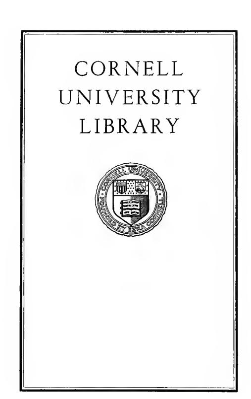
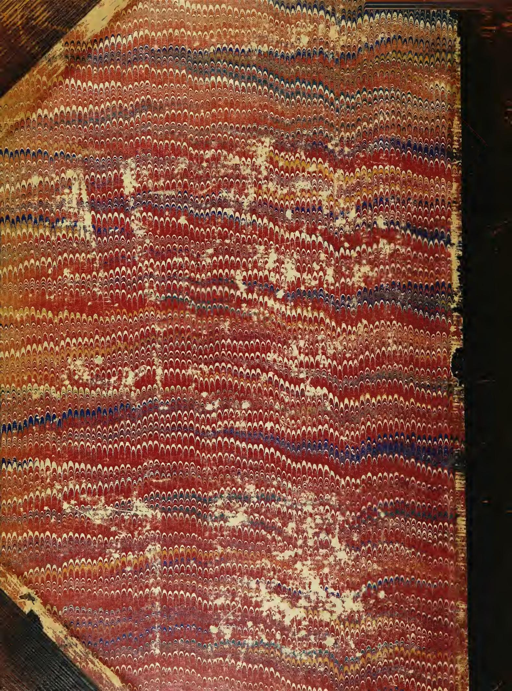

Cornell University Library HJ8101 .A32 1881

The national loans of the United States,

3 1924 030 228 245 Clin Overs

The original of this book is in the Cornell University Library.

There are no known copyright restrictions in the United States on the use of the text.

# THE

# NATIONAL LOANS OF THE UNITED STATES,

FROM

X

JULY 4, 1776, TO JUNE 30, 1880.

BY

# RAFAEL A. B^AYLEY,

TREASURY DEPARTMENT.

[AS PREPAitED FOE THE TENTH CENSUS OF THE UNITED STATES.]

WASHINGTON: GOVERNMENT PRINTING OFFICE. 1881.

r

# LETTERS OF TRANSMITTAL.

# TREASURY DEPARTMENT,

Office of the Secketakt,

Washington, D. C, August 6, 1881.

Hon. Francis A. Walker,

Superintendent of Census, Washington, D. C.

Sir : As requested in your letter of tlie Stli instant, I transmit herewith the information compiled under the supervision of Mr. R. A. Bayley, of this offlce, concerning the old loans of the government and other matters pertaining to the national debt, transmitted to me under date of the 1st instant.

Very respectfully,

W. WINDOM, Secretary.

TREASURY DEPARTMENT, Washington, D. C, August 1, 1881.

Hon. Wm. Windom, Secretary of the Treasury.

Sir : I have the honor to transmit herewith, for such disposition as you may deem proper, the manuscript notes prepared by me relative to the national loans of the United States from July 4, 177G, to June 30, 1880, showing the issues and redemptions of the several loans for each year, together with a brief historical resume of the causes which led to their negotiation. I take great pleasure in acknowledging my indebtedness to Hon. J. K. Upton, assistant secretary of the treasury, Hon. James Gilflllan, treasurer of the United States, J. T. Power, esq., chief clerk, Mr. W. P. MacLennan, chief of the division of warrants, estimates, and appropriations, and James H. Saville, esq., formerly chief clerk of the Treasury Department, for encouragement and valuable assistance. The late David S. Green was my fellow-worker in the laborious searchings through documents, old and new, bringing to the work great intelligence, zeal, and industry. I trust that the information furnished in tliese sheets may be promotive of a more general knowledge of our fiscal history, and more especially of the early financial struggles of Our government, and that, as a work of reference, the compilation may be useful to many persons in ofQcial life.

The fact that this work ends with the census year 1880, explains the absence of any reference to the financial operations of the government for the current year. These include a notable reduction of the annual interest charge on about six hundred millions of the bonded debt; a reduction effected practically without expense to the government or financial disturbance of any kind. The annual saving thus brought about is but one of the great results effected, and the transaction, taken as a whole, renders memorable the present administration of the Treasury Department.

The respoasibilifcy for any errors that may exist in this work must rest entirely upon me, but I think it proper to say that the statements have baen most carefully verified, and it is believed that strict reliance may be i)laced upon them.

Very respectfully, your obedient servant,

# THE NATIONAL LOANS OF THE UNITED STATES FROM JULY 4, me, TO JUNE 30, 1880.

# P^RT T-KISTORICAL.

# FOEEIGN SUBSIDIES.

The opening of the Eevolntionary War excited deep interest in Europe, and especially in France, which power, once the possessor of two-thirds of North America, had been humbled by the seven years' warfare that closed witli the treaty of Fontainebleau, under which France had been forced to surrender to Great Britain all her American possessions except a few unimportant islands. The French watched with interest the course of events that threatened in turn to strip their hereditary enemy of both her old and new possessions in America, and to build up on this side of the Atlantic a new power. The contest claimed the particular attention of the Comte do Vergennes, the French minister of exterior relations, who, though unwilling at first to conclude an armed alliance witli the colonies, determined to assist them with money and munitions of war. Tlie treaty followed, but the military supplies and money furnished early in the contest were of the utmost importance. These supplies were not furnished openly, because France was not in a position to commence war with (xreat Britain. Accordingly the celebrated Caron dc Beaumarchais was employed as a secret agent. Ho was a brilliant French writer and courtier, a man of great vivacity and energy, but ajiparently with limited luiowledge of mercantile affairs. As mucli sympathy has been expended on the memory of Beaumarchais, and his fate has been referred to as an illustration of the ingratitude of republics, an attempt will be made to bring to light, from the documents on record and from the worts of his biographer and contemporary authorities, tlie facts in the case, with a view of showing the justice or injustice of the settlements between Beaumarchais and the United States. This question once divided Congress, and was the cause of much bitter feeling. It can now, however, be discussed, by the aid of documents then inaccessible, without i)rejudice. The charge made against the United States was a serious one, and involved the receiving of millions of dollars worth of supplies under a regular cont ract dniing the darkest hours of the Eevolution, and then allowing the person furnishing these supplies to pass his last days in prison for the non-payment of the debt thus incurred.

Beaumarchais, at the commencement of the Revolution, had taken vqt the cause of the Americans witli all the ardor of his nature, and rendered most important services in bringing the hesitating French ministry to atlopt a d< cisive course of action. Eis services in this particular were greater, probably, than those of all our agents in Eurox)e at the time. As carlyas September, 177ij, he addressed a memorial to the king of France, in which ho plead the cause of America with all the vigor of his pen. He ibllowed this up with many others, addressed cither to the king or the Comte de Yergennes. The gist of his arguaients was that it would be impossible for Great Britahi to subdue the colonies if they were assisted in their struggle; that if not assisted they might succumb, join the English, and turn their arms against France. He says : "We are not yet in a fit state for making war; we must I)repare ourselves, keep up the contest, and with that view send secret assistance, in a prudent manner, to ihe Americans." Tiiese memorials seem to have deaided the Comte de Vergennes to give the assistance, and to employ, as his agent, their author. Beaamarchais was sent to London in the spring of 177G to make the necessary arrangements, there being then no American agent in Franco. In London he was introduced to Arthur Lee, wiio was at the time studying law in the Temple, but who bore some kind of commission from the secret committee of Congress. Beaumarchais informed liim that the French government wished to send 200,000 lonis d'or (equal to \$810,750), in arms, ammunition, and si)ecie, for the assistance of ihe Americans, but in a secret manner, and that all they wanted was to know throngli what source it was be.-t to make tlie remittances. He recpiested Mr. Lee to give the earliest intelligence of this to Congress, and to lecinest that a small quantity of tobacco or some other production of America might be returned, to give it the air of a iiKrccinillc irunsuvtion.\*

On Beaumarchais' return to Paris he made the acquaintance of Silas Deane, who arrived there about the first of Julj', 1770, with full powers as polilicid and commercial agent for the United States in France. His instructions

\* ]"'ilkin's Civil and Political History of (lio United States, vol. i, p. 403. Letters of Leo .ind otliers, Ecport of Coiumittoc, No. Ill, Ist. BChHJon IClli Co:i!iress.

were to obtain, if possible, 100 cannon with ammunition, also arms and uniforms for 25,000 men. These Beaumarchais contracted to furnish\* from the arsenals of France, in addition to a large amount of other articles thought needful for the supply of the colonies. Deane, on his part, agreed that the United Colonies should pay for them by remittances of American produce, the business to be transacted by Beaumarchais, under the name of the Spanish firm of Eoderigue, Hortales & Co. This contract, with its accompanying letters, appears on its face to be perfectly regular : an ordinary commercial contract, by which the United Colonies were to receive the supplies they needed, and to pay for the same within one year by shipments of produce to the imaginary firm of Eoderigue, Hortales & Co. Had it been what it appears to be, the United Colonies would have been bound in common honesty not only to pay in full for the stores, but to pay dearly for the risks to which the contractor would be exposed. But there is evidence that both parties knew the contract as it stood to be but a sham, drawn up to mask the fact that it was the government of France which was to supply England's rebellious colonies. The contract was concluded about July 24, 1776. On the 15th of August, twenty-two days after it was signed, Deane wrote to the secret committee of Congress as follows

I find Beaumarchais, as I before liinted, possesses the entire confidence of the ministry ; he is a man of wit and genius, and a considerable writer on comic and political subjects. All my supplies are to come through his hands, which at first greatly discouraged my friends, knowing him to bo a man of no interest with the merchants, but, had I been as doubtful as they, I could not have stepped aside from the path so cordially marked out for me by those I depend on. \* \* \* Mverything he says, writes, or does is in reality the action of the ministry ; for that a man should but a few months ago confine himself from his creditors, and now, on this occasion, lie aile to advance half a million, is so extraordinary that it ceases to l>e a mystery.

The whole tenor of Deane's letter f shows that while he supposed the supplies were to be paid for as well as received through Beaumarchais, yet that, if a debt, it was a debt due to the government of France. On the part of Beaumarchais, he was not only aware that the French ministry had determined to assist the Americans, but when he signed the contract he had in his possession a million of livres drawn from the French treasury for the purpose of furnishing this assistance, and a few days afterward he received from the Spanish treasury, through the Comte de Yergennes, another million for the same purpose. As shipments went on and remittances came but slowly from America, he received a third million from the king of France. As the whole controversy between the United States and Beaumarchais turns upon the fact of these advances for the benefit of the colonies through him, it is necessary to show the evidence on this point.

On the 2d of May, 177G, the Comte de Yergennes submitted the subject to Louis XYI in the following note:|

I have the honor of submitting to your majesty the paper which is to authorize mo to furnish a million of litres for the English colonies, if yon should deign to ratify it with your signature. I add, too, sire, the draft of the reply which I mean to malce to M. Beaumarchais, if your majesty shall approve it ; I beg it may be returned to mo without delay. It shall not go forth in my handwriting nor in that of any of my clerks or secretaries. I will employ that of my son, which cannot bo known, and, although ho is in his fifteenth year, I can answer positively for his discretion. As it is of importance that this operation should not be detected, or at least not imputed to tho government, I propose, if your majesty consents, to call hither the Siour Montaudin ; tho ostensible motive will be to ask an account of his correspondence with the Americans, and tho real one to charge him with the transmission of the funds, which your majesty is pleased to grant them, directing at the same time all the precautions to be taken as if he advanced the funds on Ms own account.

On this head also I take tho liberty of requesting the orders of your majesty. That being dour, I will write to the Marquis Grimald (secretary of foreign affairs in Spain). I will inform him of our operations and propose to him [de la doubter'] to do the same.

The king immediately gave bis minister the authority he asked for, and M. de Harvelay, keeper of the royal treasury, was directed to hold the million of livres subject to the particular order of Yergennes. The Sieur Montaudin was, however, not intrusted with the transmission of the funds, Beaumarchais being emjiloyed for that purpose, and the million was paid over to him. For it he gave the receipt of which the following is a translation of the original in the archives of France :§

I have received from Monsieur Duvergicr, agreeably to the orders of the Comte de Vergeunes, dated the 5t.h instant, which I had remitted to liim, tho sum of one million, of which I am to render an account to tho said Comte de Vergenues.

Paris, June 10, 177G.

CAEON DE BEAUMARCHAIS.

Good for one million livres Tournois.

The advance of this million was suspected by the authorities of the United States, and when Beaumarchais made his demands on them for a settlement, they attempted to obtain a statement of the fact from the French government; but it was a state secret, and a copy was refused. They were obliged to be content with a statement that a million was advanced on the 10th of June, 1770, before the Americans had any authorized agent in France. It was not until July 7, 1794, after the downfall of tho French monarchy, when the republicans in power cared little for the secrets of the defunct government, that a copy was obtained by Gouverneur Morris, then minister of the United States in France. He wrote to M. Buchot, commissioner of exterior relations in France, as follows:

Sir. : D:n-iug the last war France furnished several sums of money to the United States of America, both under the head of loans and that of gratuities. The first of these advances was a million of livres, and it a]]pears to have been made on the 10th of June, 177G. It ia

Beaumarchais and his Times, Loai(5nic, vol. iii, p. 153. Lom^aio says 200 cannon.

t Appendix to Pitkin's History, vol. i, pp. 514-51S.

t Pitkin's History, vol. i, p. 403.

§ Sparks' Life of GouvcriiBiir Morris, vol. ii, p. 440, note. Lom6uie, vol. iii, p. 129.

entered among the gratuities, but it is not known to whom it was paid nor how it was appropriated. Doctor Franklin, in settling the accounts of the United States with the French ministry, neglected to ask for the papers which relate to this subject, and afterward, when the banker of the United States applied (in the months of August and September, 1786) to M. Durival, in order to obtain them, he assured him that he had communicated the request to the Count de Vergennes, who said that the receipt in question could be of no use to the banker, since he was not intrusted with the pecuniary aifairs of the United States till January, 1777, and that this payment was made on the 10th of June, 1776.

Our ministers were also given to understand that it was useless to urge the demand for a paper in proof of a payment, which would be of no account in the reimbursements to bo made by the United States. Doctor Franklin concluded from this that the advance had been lodged in the hands of M. Beaumarchais, and that it was a cabinet mystery whose eclairdssement ought to be a matter of inditference to US, at least till it became necessary to set this siim against the demands of Beaumarchais for the supplies which he had furnished to the Uuited States. This occasion has now arrived, but without this you will perceive, at the first glance, that the payment having been acknowledged by the United States, the receiver, whoever he may be, ought to give them an account of the manner in which he employed it. Besides, mysteries serve too often only to cover wasteful expenditures, of which the people are victims. It is therefore given me in charge to solicit the papers acknowledging the payment of a million livres as a gratuity, made by France to the United States of America on the 10th of June, 1776. I think they will be found among the accounts of M. Durival, then head of the treasury department for foreign affairs ; and I apply to you, in these circumstances, with the more confidence, as I am fully convinced of the good will of the French government toward the United States.

I have the honor to be, &c., GOUVEENEUE MOEEIS.

To M. BucHOT,

Commissioner of Exterior Belations.

M, Bucket to Gouverneur Moms, minister of tlte Unitid States.

Paris, July 7, 1794.

\* Sir : In your letter of the 21st ultimo you request of me the communication of the papers which explain in what manner the million advanced to the United States on the 10th of June, 1776, was paid.

I sent your request to the Comity de salut public, to whom it appeared just, in this respect, to render to the United States the satisfaction, which was denied to them by the ministers of (lie ancient r^ijime. In consequence, I caused the necessary researches to be made, and I hereby subjoin a copy of a receipt, dated the 10th of June, 1776, which aiipears to be the one desired by the United States to regulate their accounts.

As you have well observed, there is no occasion for mystery between two nations united by all the ties of friendship and of common interest.

I have the honor to be, &c., BUCHOT.

If more conclusive proof is ueeded that tUis million of livres was not ouly advanced to the United Colonies through Beaumarchais, hut that it was intended as a gratuity to the colonies, it is to be found in the letter of M. Durival, one of the French ministry, and Chef du bureau desfonds des affaires etrangeres. Benjamin Franklin, minister of the United States to France in 1785, discovered that a million of livres had been advanced from the royal treasury, which did not appear in the accounts of M. Grand, the banker of the United States in Paris. He determined to have the matter explained if possible, so that, as he says, "it may stand clear before I die, lest some enemy should afterward accuse me of having received a million not accounted for." After his return to America in 178G he opened a correspondence with the secretary of Congress on the subject, and finally wrote to M. Grand lequesting hnn to make inquiry into the matter at the French treasury. The result of his inquiries was the following letter :t

M. Durival to M. G}and.

[Tianslation.]

VEnsAiLLES, August 30, 1785.

Sir: I have received the letter which you did mo the honor to write on the 28tli of this month touchiag the advance of a million, which you say was made by the farmers-general to the United States of America, the 3d of June, 1777. I have no knowledge of that advance. What I have verified is, that the king, by the contract of the 25th of February, 1783, has confirmed the gratuitous gift which his majesty had previously made of the three millions hereafter mentioned, viz : one million delivered by the royal treasury the lOlh of June, 1776, and two other millions advanced also by the roy.al treasury in 1777, on four receipts of the deputies of Congress, of the' 17th of January, 3d of April, lOth of June, and 15th of October, of the same year. This explanation will, sir, I hope, resolve your doubt touching the advance of the 3d of June, 1777. I further recommend to you, sir, to confer on this subject with M. Gojard, who ought to be better informed than we, who had no knowledge of anj' advances but thoje made by the royal treasury.

I have the honor to be, &c., DURIVAL.

This would appear to settle the question as to the advance of the first million. Against all this evidence there can be adduced only a resolve of Congress passed in 1779, denying that any present of supplies previous to the treaty of alliance had been received from France, and the denial of M. de Talleyrand in 181G, when pressing the claim of the heirs of Beaumarchais. The resolution of Congress was passed under the pressure of a demand made by Gerard, the French embassador, after the publication of a pamphlet by Thomas Paine, secretary of the congressional committee on foreign affairs, in which, from ofiflcial documents in his possession, he had, without authority, made such extracts as went far to reveal this dangerous state secret.

As for M. de Talleyrand it is probable, from his too well-known character, that he would, in a diplomatic way, have denied or asserted anything to carry liis point. His denial, even if sincere, could have no weight against the express declarations of Vergennes, Durival, and others, the actors in this aff'a-ir.

&quot; See American Stat o Papers, "Foreign Afl'airs," vol. i, p. 411. See receipt, ante. t Sparks' Diplomatic Corrispondonee, vol. iv, p. 223.

As to the second million the evidence is as follows: The kings of France and Spain had, as members of the royal house of Bourbon, signed what was known as the "family compact," by virtue of which they were to act together in their foreign policy. We have seen that Vergennes, when asking for a million from the French treasury "for the English colonies", proposed to write to the Spanish minister of foreign affairs and ask him to double the gift. The dispatch is not accessible, though it might probably be found in the Spanish archives, but the request was granted.

\*In order that this subvention might be kept secret, the Spanish million before reaching his (Beaumarchais') hands had to make a little circuit. The Spanish embassader paid it into the public treasury of France, and took an acknowledgment for it from the cashier; he remitted this acknowledgment to M. de Vergennes, and the latter gave it to Beaumarchais in exchange for the following receipt, which I quote literally from the original in the archives of foreign affairs.

### [Translation.]

I have received from his excellency M. le Comte de Vergennes an acknowledgment for the million livres Tournois which M. Duvergier had given to the Spanish embassador, with which acknowledgment I shall touch, at the royal treasury, the said sum of a million Tournois, for the employment of which I will render an account to his said excellency M. le Comte de Vergennes.

AT VERSAILLES, Aug. 11, 1776.

CARON DE BEAUMARCHAIS.

No evidence as to this second million was accessible to the United States authorities when they settled Beaumarchais' accounts. The versatile author of the "Barber of Seville" was now set up as a merchant, an entirely new walk in life for him, with a capital of two millions of livres (about \$363,000), advanced from the royal treasuries of France and Spain to supply the United Colonies with the means of carrying on the contest. It is probable that he had received orders from the French ministry to invest it in material supplies, instead of handing over the specie. The cannon, ammunition, and muskets were taken directly from the French arsenals. It is said that he was to restore these in kind, and this may be the fact. The only evidence on the point is a letter from the French minister of war notifying him that when he returns the powder it will have to be subjected to the usual tests. This might apply either to the powder sent to the Americans or to that required for the private navy which Beaumarchais fitted out, as he says, "to cruise across the ocean, to convoy, attack, burn, or take private vessels." One of his vessels, the Fier Roderigue, a three-decker, carrying sixty guns, while convoying ten merchant vessels, was stopped and ordered into line of battle by Admiral de Estaing, who was then lying off the island of Grenada in command of the French fleet, and preparing to fight the English fleet commanded by Admiral Byron. The Fier Roderigue came out of the action covered with glory, but the captain and a large number of the crew were killed and the vessel riddled with balls. Byron was forced to retreat.

The cloth for uniforms was purchased in market, as it is hardly possible that the French government had in store clothing for soldiers to suit the fantastic ideas of Beaumarchais, and if it had possessed it, to clothe American soldiers in French uniforms would have been equivalent to a declaration of war with Great Britain. The secret committee of Congress had ordered that the uniforms to be purchased should be blue with facings of different colors for the different arms of the service, but Beaumarchais very coolly changed all this. As a writer of operas, he had perhaps derived his ideas of martial equipments from those of the mimic soldiers of the stage. He wrote to the committee, December 1, 1776, that he should ship uniforms for six divisions of five thousand men each, one division to be blue, the others respectively brown, green, red, gray, and light blue.

History has not recorded the color of the uniform in which our Revolutionary forefathers won or lost their battles, but as Beaumarchais actually shipped a large part of the clothing, it is probable that some divisions of the army really were attired in this par i colored fashion. In these shipments his native energy came out in all its force. Despite the scarcity of vessels and seamen, the fact that the ocean swarmed with British cruisers ready to intercept all supplies for America, the strict blockade of the American coast, and the energetic remonstrances of Lord Stormont, the British embassador, he succeeded in loading and dispatching a large amount of supplies, cannon, ammunition, and arms, most of which reached their destination.

Loménie, the author of the entertaining work "Beaumarchais and his Times", says he had forty ships at sea, and that the first cargo of supplies sent to the Americans was valued at three million livres, but in this there is much exaggeration. If he had forty ships at sea they were not engaged in supplying the United Colonies. The total number of vessels sent was eight, the Amphitrite, Mercure, Mère Bobie, Flamand, Mary Catherine, Seine, Amelia, and Thérèse. The first shipment was by the Amphitrite, and her eargo was valued (as shown by Beaumarchais' original account-current) at 979,493 livres, 8 sols, 3 deniers. Four of these vessels arrived safely at Portsmouth, New Hampshire, two reached Martinique, where their cargoes were received by Mr. Bingham, agent for the Continental Congress, and dispatched in small, swift-sailing vessels to Edenton, North Carolina, and two, the Amelia and Thérèse, arrived at cape François, where they were received by M. Carabosse, agent for Beaumarchais. The fate of these last cargoes is uncertain; a portion at least was dispatched to the continent.

Loménie in his work asserts that hardly any return was made in produce for these shipments, mentioning only three small lots as having been received, and even for these, he says, Beaumarchais had a contest with the American commissioners, Franklin, Deane, and Lee, who wished to sell the cargoes and appropriate the proceeds to other purposes. Now, the fact is, as shown by the Beaumarchais manuscript, that ten vessels were dispatched with

produce to Beaumarchais, the cargoes of which he sold, and credited the proceeds to the United Colonies. Some of these were return cargoes on his own ships, others were by vessels chartered for the purpose, and one shipment was made on the Bonhomme Richard, Paul Jones' flagship.

The shipments began October 1, 1777, when the Amphitrite was dispatched with a return cargo, and continued until July, 1781, by the following vessels: Th^rese, Fier lioderigue (two cargoes), P^rouse, Deux Helciies, Bouhomme Eichard, Polly, Amelia, and Mercure. These vessels were not all fnlly loaded, but their cargoes, after deducting one /ia7/ for freight and large sums for commissions, netted 713,990 livres. It is a noticeable fact that among the American i)rodHce sent was a large amount of indigo, tUen extensively cultivated at tlie South, but no longer produced in the United States, though the soil proved well adapted to it, and its quality was excellent.

The returns from America were, however, very slowly made—too slowly to enable Beaumarchais to meet his engagements. For this reason he applied in the year 1777 to Louis XVI, and received by installments another million of livres. The proof of this is to be found in Lom6nie's work referred to above. Lom6nie often exaggerates, but he advocates most warmly the side of Beaumarchais, and wastes a great deal of special pleading to prove that the United States defrauded him. For tliis very reason he is a first-class witness when stating facts that bear against his client. He held in his possession Beaumarchais' papers and had access to the French archives, and the proof was so incontestable that he could not avoid the conclusions. He says (vol. 3, page 224)

I have Leen obliged, nevertlieless, contrary to the very sincere opinion of the heirs of Beanmarchais and to the decLr.a'ions of the difi'crent ministers since 1778, all based upon the first official dixlaral ion of JI. do Vergcnncs—I havo been obliged to re-establish the truth as to the fact of the celebrated million which -(vas iucontestably given by tho government, not for a sicri-l. political siriiicc, nncoiivectrdicith the American supplies, but for thesupplies iliemselvcs. Finding, also, in the archives of foreign affairs, the niateiial proof that Beainnarchals, independently of tho first million, given June 10, 177G, received a second from tho court of Spain, August 11, 177(3, and a third paid by installments in the course of 1777, I have been obliged to mention all these facts because they are true, and because the first duty of a writer, who respects himself, is not (o conceal tho truth.

Beaumarchais' letters written while shipping the supplies are both unique and interesting. He lectures the Continental Congress with the freedom of a general officer spealdng to a council of western Indians, advises the appointment of a dictator, urges the declaration of war against Portugal, as if war with Great Britain was not enough, and wishes expeditions fitted out against "the defenseless English factories in Africa", and the "galleons heavy with gold on the coast of Brazil". He says he has two thousand military ofBeers ready to start for America, and in a subsequent letter says he has sent thirty -four of them over. To these foreign olBcers he made large advances in specie. Some of them did good service in the armies of the Eevolution ; others, who came over with great pretensions, proved worthless. Besides the shipments of produce, Congress paid in specie to M. de Francy, an agent sent over by Beaumarchais in 1777, as admitted in his account-current, 55,000 livres ; in June, 1780, by bills on Dr. , Franklin, 144,000 livres; in June, 1781, 144,000 more; and May 18, 1782, bills of exchange for 2,4(JO,000 livres at three years from date, with interest added. These bills were all cashed at maturity.

Under the act of April 18, 1806 (2 Stat., 389), \$78,880 2G, equal to about 434,035 livres, was paid to Beaumarchais' heirs; and under the convention with the king of the French of July 4, 1831, 800,000 francs, equal to 810,000 livres, were reserved and paid.\*

An account fairly stated between 1 he United States and Beaumarchais and his heirs, allowing to Beaumarchais all his charges for shipments, freight, insurance, and advances to foreign offlcers, and to the United States the subsidies and the payments admitted to have been made, will stand as follows. The account is stated in livres Tonrnois, as nearly all the transactions were carried on in that currency. Fractions of li\'ies are thrown out. Five and a half livres are nearly equal in value to one dollar. ACCOUNT.

| Cr.                                                                                             |         |                 |
|-------------------------------------------------------------------------------------------------|---------|-----------------|
| States— The United                                                                        |         | Livres.         |
| By produce shipments of                                                                |         | 713,99(3        |
| By M. do Fraiicy paynienii to                                                    | ':      | 000 55,      |
| -* By exchange of on Franklin bills                                           | .*;i,   | COO 'J, 688, |
| By French Beanmarchais subsidies jiaid                                              | 2,      | 000 000,     |
| By Beanmarchais Siianish subsidies jiaid                                            | ),      | 000,000         |
| By by Congress grant 1805 April,                                                 |         | 434, G'i'i   |
| By payment 1835 in                                                                     |         | 810,000         |
|                                                                                                 |         | 7,701,031       |
| Dr.                                                                                             |         |                 |
| Ac, To by himself Beaumarchais' account stated for supplies, as 1 |         | 844 6,574,   |
| Overpayment by the United States                                                    | - 1, | 787 4"!),    |
|                                                                                                 |         |                 |

Much more evidence might have been adduced from Arthur Lee's correspondence, of the correctness of these conclusions, but Lee has been accused of personal hostility to Beaumarchais, and his cvirteiico is therefore ruled out, except ou matters in which it is confirmed by others. The charges of interest by Beaumarchais have not been admitted. If any interest was due it was to the United States, the three millions of subsidy having been advanced so early in the transactions.

Beaumarchais was iinancially ruined, it is true, but not by his dealings with the United Colonies. Lom(5uie, who was in possession of his private papers when he wrote, says that from October 1, 1776, until September 30, 1783, his accounts show that he received 21,092,515 livres and disbursed 21,014,191, showing an excess of receipts over disbursements of 48,324 livres.\* But these seven years cover precisely the time of the American Eevolution, during which the shipments were made. The balance on the right side of the profit-and-loss account is small, but it does not look like financial ruin. The fact is that his embarrassments arose solely from his engaging, in the year 1779, in the republication of the works of Voltaire, one of the most extensive and most unfortunate literary undertakings on record. Voltaire's works were prohibited in France, and the influence of the clergy was sufQcieut to prevent even Beaumarchais, though high in favor with the king, from republishing them there. He therelore rented from the margrave of Baden, in Grermany, an old castle at Kehl. Here he founded an enormous printing establishment, imported from England, notwithstanding the war, the best types that could be purchased, made the paper for the work, and carried the whole through, after years of labor, to its final completion.

Voltaire's works comprised seventy octavo volumes, and of these he printed 15,000 copies, or 1,050,000 volumes. It was a most unfavorable time for a great literary enterprise. Half the world was in arms, and in France church and state were tottering on the verge of an abyss. When the revolution broke out but 2,000 sets of Voltaire had been disposed of, leaving ou hand 910,000 volumes. So vast were the quantities of books that he was obliged to store in Paris, in the Faubourg St. Antoine, that he was subjected to frequent domiciliary visits by the mob and the revolutionary authorities, who were persuaded that his storehouses contained either grain or arms.t To sell the books was impossible, and they probably saw the light only in the shape of gun cartridges.

So much si)ace has been devoted to the affairs of Beaumarchais that not much more can be given to an account of the other subsidies received. Two million livres more were granted by France in the year 1777, and in 1781 six millions, making a total of ten millions, of which Beaumarchais received two, and the rest was paid through Benjamin Franklin. The French authorities insisted that so much of this money as was not expended in Europe should be drawn for by General Washington in bills on M. de Harvelay, (farde du tresor royal. Franklin protested that it was not the usage in the United States to allow the General of the army to draw for moneys intended to be paid into the treasury, but the French minister would hear no explanations on this point, and assured Franklin that it was his majesty's order. | It is supposed, therefore, though the fact has not been recorded, that the bills went to Paris signed by General Washington.

| The subsidy account stands as follows |            |
|------------------------------------------------------|------------|
| French subsidy                                    | 10,000,000 |
| Subsidy Spanisli                                  | 1,000,000  |
| Total                                                | 11,000,000 |

equal to \$1,996,500. As this money was a free gift it has not been repaid, unless the sums paid Beaumarchais be taken as a partial reimbursement.

# LOAN FEOM FARMEES-GEISrEEAL OF FEANCE.

The first loan negotiated by the Continental Congress was obtained in the year 1777 from the " farmers-general of France". Until that time the expenses of the Eevolutionary government in Europe had been met by small subsidies from France and Spain, and by such remittances in specie as could be spared from home. But these funds could not go very far toward accomplishing the objects of the American commissioners in Europe. Beside the supplies obtained through Beaumarchais, it was thought necessary to purchase large amounts, especially of gunpowder, of which 200,000 pounds were purchased at once; also to build ships of war to cruise on the coast of Great Britain and make prizes of the richly laden English ships in those seas. While waiting for the means of buildhig large ships, small, swift-sailing vessels were fitted out as privateers, with the connivance of the French ministry, under the encouragement and partly with the funds of the commissioners. One of these sailed entirely around Ireland and captured and burnt seventeen or eighteen sail of vessels, which occasioned great consternation among English merchants, raised insurance to ten per cent., prevented the great fiiir at Chester, in England, and so much deterred shipments in English bottoms that in a few weeks forty Fi'ench ships were loading in the Tbaiues, an instance never before known. §

The secret committee of Congress appears to have advised Deane to obtain a loan. It is probable that he applied to the French ministry for one, but tlie time had not yet come for them to loan money openly to England's rebellious colonies. They grew bolder in 17 78; but on this application they refeiTed Deane to the farmers-general, who, as a private cori)oration engaged in the collection of the national revenue of France, migbt loan public moneys, if encouraged to do so by the government, without causing any diplomatic complications. The farmers-general were a privileged association who "farmed" or leased the public revenues, paying to the government a certain iixed sum,

and making a heavy profit from the surplus. Tbis association was allowed to bring tobacco into the kingdom free of duty, which, practically, gave them the monopoly of the tobacco trade. When Deane ai)plied for a loan to the farmers-general they offered him two millions of livres in exchange for tobacco. The contract, dated March 24, 1777, and signed by Franklin and Deane on the part of the United States and by M. Panlze on the part of the farmersgeneral,\* provided that the United States should deliver in the ports of Prance, during tlie year 1777, 5,000 hogsheads, or 5,000,000 pounds, of York or James river tobacco, at 8 sols per pound, or 10 livres Tournois (\$7 26) per hundred-weight, which would amount to 2,000,000 livres for the wliole. For tliis the farmers-general were to advance 1,000,000 livres within one month after the signing of the contract, and 1,000,000 more on the arrival of tlie first ships loaded with tobacco. Any greater quantity than the 5,000,000 pounds sent by Congress, was to be paid for at the same rates. Under this contract the advance of 1,000,000 livres was paid to the commissioners, Franklin and Deane, June 4, 1777, and by them deposited with M. Grand, banker of the United States in Paris. It appears that, on this contract, the United States made three shipments of tobacco in 1778 and 1779, by the ships Baltimore, Morris, and Bergfere. The aggregate net yeight of their cargoes was 390,891 pounds, which the farmers-general received at 153,229 livres, 5 sols, 7 dealers. This left a balance of 846,770 livres, 14 sols, 5 deniers, wiiich was paid after the Revolution to the republican government of France. The corporation of farmers-general was extinguished by the Revolution and most of its members perished by the guillotine. The government probably seized the obligations of the United States which they held, and claimed their payment—the property of the victims, held to be public enemies, having escheated to the state.

When the time came for settling this loan, the transactions of the American commissioners in France were involved in so much mystery, that it was supposed by the treasury authorities that this advance of 1,000,000 livres was included in the French subsidies, and even Franklin, though engaged in the transaction, was unable to explain it. The king of France had declared that he Iiad given 3,000,000 livres to the United Colonies in 1776 and 1777, but only 2,000,000 had reached M. Grand, banker of the United States, in Paris. What had become of the other million, was unknown; and it was at one time supposed that the advance from the farmers- general was the third million. The comptroller wrote, February 8, 1794, to M. Bournonville, secretary of the foreign legation, as follows:

After a careful examination of all the foreign accounts of the United States, it is certain that no more than 3,000,000 livres, including the million advanced hy the farmers-general, have been credited hy any agents of the United States. The assumption of this debt by the French government, taken in connection with the circumstances before stated, creates, therefore, a just presumption, uutil an explanation is received, that the advance by the farmers-general -was included with the advances made from the French treasuiy in the year 1777, and constituted part of the gratuitous aid referred lo in the contract of February 25, 1783.

The mystery was not cleared up until Gouverneur Morris obtained, from tbe French archives, a copy of the original receipt given by Caron de Beaumarchais showing that he had received the first million of subsidy, and hence the advance by the farmers-general was a loan from that corporation and not a gratuity from France. The interest on this loan ceased December 31, 1793, when the account was merged in the general account of the Freucli debt.

# FEEI^rcn LOAN OF EIGHTEEN MILLION LIVRES.

It is extremely difficult to obtain information respecting this loan. It is probabLe that it was, in its inception, not so much a loan as a subsidy, a payment of 750,000 livres every three months to the American commissioners in France, to enable the colonies to keep up the unequal struggle with Great Britain. The money was advajiced without an expectation of repayment, though with a stipulation that it should be repaid. In 1782 an account was taken of former payments not included in the 10,000,000 livres expressly given as a gratuity, and a formal contract for the repayment was drawn up. These payments amounted to 15,000,000 livres, and a further sum of 3,000,000 livres was added and paid to the United States, making a total of 18,000,000, which it was agreed sliould be repaid. • The contract will be found in Journals of Congress, vol. iv. Appendix, p. 20, and is dated July IC, 1782. It enumerates the different sums advanced by the king of France to tbe United States "under the title of a loan, in the years 1778, 1779, 1780, 1781, and 1782", and provides that, although in the receipts for said payments it is promised that the money should be repaid on tbe 1st of January, 1788, with interest at 5 per cent, per annum, yet, as the .payment of so large a sum at one jieriod might greatly injure the finances of the United States, it should be made in twelve annual payu.ents of 1,5110,000 livres each, to commence from tbe third year alter the conclusiim of/ peace. Article 3 declares that " although the receipts of the minister of tbe Congress of the United States si)ecify| that the 18,000,(:00 of livres Tournois are to be paid at the royal treasury with interest at 5 per cent, per annum,! his majesty, being willing to give the United States a new proof of his affection and friendship, has been pleased to make a present of, and to forgive, tbe whole arrears of interest to tbis day, and from thence to tbe day of the date of the treaty of peace: a favor which the minister of the Congress of tlie United States ackuowledued to ilow from the pure bounty of the king, and which he accepts in the name of tbe said United States v.ith profound audi lively acknowledgments ' Franklin, in transmitting tbis contract, wrote : t

All the accounts against us for money lent and stores, arms, amimmition, and clothing furnished by government were brought in and examined, and a balance received which made tlus debt amount to (ho even sum of lfi,000,(inO livres, oxclnsive of the Holland loan fur

which the king is gnarantee. In reading the contract you will discover several fresh marks of the king's goodness to us, amounting to the value of near two millions. These, added to the free gifts before made us at different times, form an object of at least twelve millions, for which no returns but that of gratitude and friendship are expected. These, I hope, may be everlasting.

It does not appear whether the "stores, arms, and ammunition" were those sent to the United States by Beaumarchais from the arsenals of France, as before referred to; if they were the same, the United States have paid for them twice.

The definitive treaty of peace was made in 1783; but the United States, in the confusion existing between the close of the war and the adoption of the new Constitution, were unable to begin the repayment as provided for in the contract. It was a debt due by a Congress dependent for its revenues on States beyond its control. Not until after the formation of the general government, as now existing, was repayment begun, and then the French monarchy, to which the debt was due, had passed away. The repayment began in 1791, and was made to the revolutionary government of France. The last direct payment in money on this contract was 1,500,000 livres, made in 1795. This left a balance still due of 4,185,776 livres, 17 sols, 2 deniers. For this balance, added to other items of the debt due France, then unpaid, stock was issued known as the  $5\frac{1}{2}$  per cent. stock of 1795, this stock being accepted in lieu of all demands by James Swan, agent of the French government. This loan has all been repaid.

### LOAN FROM SPAIN IN 1781.

The early financial transactions of the United States in Europe appear to have been, in the main, secret. To this may be attributed the fact that the information respecting them is so scanty. If it exists, most of it is probably buried in the archives of foreign governments, and the Spanish loan of 1781 is no exception to this rule, even the Secret Journals of Congress containing but little information respecting it. The instructions to John Jay, sent as minister to Spain in 1779, show that he was directed to represent the distressed state of the financial concerns of this country "to his Catholic majesty" and to solicit a loan of \$5,000,000, but before asking for a loan he was to endeavor to obtain from his majesty a subsidy in consideration of a guarantee by the United States of all rights which Spain might acquire in Florida by conquest from Great Britain.\* It is to be presumed; of course, that Mr. Jay obeyed his instructions, but he obtained neither the subsidy nor the five millions as a loan.

In making up a statement of the foreign debt, however, after the adoption of the Constitution, it appeared that a small sum was due Spain for advances of money in the year 1781. The register of the treasury in a letter to the Secretary, Alexander Hamilton, October 9, 1792, says:

I have the honor to inclose certified copies from the treasury books of an account depending between his most Catholic majesty and the United States, for moneys received on loan. I cannot find that this loan has been recognized on the Journals of Congress in like manner with the French and Dutch loans. It is founded on a settlement made 1 y the late commissioner for settling the foreign accounts, entitled: "Loans from the court of Spain." This money was paid to the Hen. James Gardoquoi and has been regularly accounted for by him, having been expended in the purchase of clothing and in the payment of bills of exchange drawn by order of Congress.

It appears by this statement that the Spanish debt amounted to \$174,011 00. This was all repaid in the years 1792 and 1793; in fact there was an overpayment of \$6 13, caused by small variations in the rates of exchange.

### FRENCH LOAN OF TEN MILLION LIVRES.

The financial situation of the Continental Congress was at its worst in the years 1779 and 1780. Over \$200,000,000 in Continental currency had been issued, and this currency, at first circulating readily at its face value, had depreciated as the amount issued increased, until it only passed at forty for one. Even at this discount it soon ceased to circulate at all, and in the year 1780 "it quietly expired in the hands of its possessors". The Revolutionary army was reduced to extremity. On the 1st of February, 1778, nearly 4,000 men were returned as unfit for duty for want of clothes. In January, 1780, General Washington wrote to the governor of Connecticut, that the army had been near three months on a short allowance of bread, within a fortnight almost perishing. They had been sometimes without bread, sometimes without meat, and oftener without both. They had borne this distress, in which the officers shared the common lot with the men, with as much fortitude as human nature was capable of, but they had at last been brought to such a dreadful extremity that no authority or influence of the officers, no virtue or patience in the men, could any longer restrain them from obeying the dictates of their feelings. The soldiers had in several instances plundered the neighboring inhabitants even of their necessary subsistence. Without an immediate remedy this evil would soon become intolerable, and, unhapily, there was no prospect of relief through the ordinary channels. They were reduced to this alternative: either to let the army disband, or to call upon the counties of that state to furnish a supply of eattle and grain for the supply of their wants. If the magistrates refused their aid, they would be obliged to have recourse to a military impress. It was evident to the members of Congress that relief from new issues of paper money was hopeless, and it was determined to attempt to negotiate a

loan in Holland. On the 21st of October, 1779, Henry Laurens, of South Carolina, was chosen as agent for that purpose. His instructions were contained in two resolutions which were introduced and passed October 26, and which were as follows:\*

Resolved, That he he instructed to borrow a sum not exceeding ten millions of dollars at the lowest rate possible, not exceeding six per cent. per annum.

Resolved, That he be empowered to employ on the best terms in his power some proper mercantile or banking house in the city of Amsterdam or elsewhere in the United Provinces of the Low Countries to assist in the procuring of loans, to receive and pay the money borrowed, to keep the accounts, and to pay the interest.

A commission was issued June 20, 1780, to John Adams, who had been appointed minister plenipotentiary to negotiate a treaty of peace with Great Britain, authorizing him to contract for a loan in Holland, and another was issued to Francis Dana of the same purport, setting forth that Henry Laurens, who had been appointed on that business, had been detained by unavoidable accidents from proceeding on the business of his agency.

Shortly after these commissions were issued Mr. Laurens sailed for Europe, but the vessel in which he took passage was captured by a British frigate off the coast of Newfoundland. He threw his papers overboard, but not weighting them sufficiently, they floated and were recovered by a British sailor. This incident produced a war between Great Britain and Holland, for the papers contained the plan of a treaty with the United States drawn up under the directions of Van Berckel, grand pensionary of Amsterdam. Sir Joseph York, English minister at the Hague, was instructed to demand a disavowal of this plan by the states general and "the exemplary punishment of the pensionary and his accomplices as disturbers of the public peace and violators of the rights of nations". "Satisfaction for the supposed offense not being made by the states general, the British minister was ordered to withdraw from Holland, and this was soon followed by a declaration of hostilities against that country by the court of London." †

Mr. Laurens was taken to London, examined before the privy council, and committed a close prisoner to the Tower on the charge of high treason, but the negotiations for a loan went on under the commission issued to Mr. Adams, aided by the exertions of Col. John Laurens, who had been dispatched to Europe on the same mission in December, 1780, his father, Henry Laurens, being still a prisoner in the Tower of London. When Colonel Laurens arrived in Paris, he found that very fair promises of assistance had been made by the French court, but nothing had been done.

The delay in fulfilling these promises illy accorded with the high and ardeut feelings of the young American envoy. Knowing the pressing wants of his country and the necessity of immediate aid, if afforded at all, after a delay of more than two months he determined at the next levee day to present, in person, a memorial to the king, though directly contrary to the forms of court. In conversation with the Comte de Vergennes, on the morning of the day on which he intended to present his memorial to the king, Mr. Laurens expostulated with him, on delaying the promised aid, in such warm and bold language that the minister replied:

"Colonel Laurens, you are so recently from the headquarters of the American army, that you forget you are no longer delivering the orders of the commander-in-chief, but addressing the minister of a monarch who has every disposition to favor your country."

"Favor, sir," rejoined Laurens; "the respect which I owe my country will not admit the term—say the object of my mission is of mutual interest to our respective nations and I subscribe the obligations; but as the most conclusive argument I can address to your excellency, the sword which I now carry in defense of France as well as of my own country, I may be compelled to draw against France as a British subject, unless the succor I solicit is speedily accorded."

He presented his memorial to the king on the same day. It was graciously received and, no doubt, was the means of hastening the promised succor.

Applications for loans in Holland had hitherto been unsuccessful. The Hollanders either distrusted the security, or were unwilling to incur the resentment of Great Britain by lending the Americans money to enable them to carry on the war.

The king of France had, through his minister at the Hague, offered his assistance to the Americans in procuring loans in that country, but without effect. He now engaged to become, himself, responsible for the sums which might be furnished. In consequence of this and the exertions of Mr. Adams, a loan of ten millions of livres was obtained in Holland. ‡

The money thus borrowed, although intended solely for the United States, having been obtained on the credit of France, became a debt due to that country, and was provided for in the financial contract drawn up July 16, 1782, and signed by the Comte de Vergennes and Benjamin Franklin.

Article V of this contract says that although the loan of 5,000,000 florins of Holland, amounting on a moderate valuation to 10,000,000 livres Tournois, agreed to by the states general of the Netherlands on the terms of the obligation passed November 5, 1781, between his majesty and the states general, has been made in his majesty's name and guaranteed by him, it is nevertheless acknowledged that the said loan was made, in reality, on account and for the service of the United States of North America. By the terms of the obligation the king had agreed to pay the capital of the said loan with the interest at 4 per cent. per annum, the capital to be repaid in ten equal payments, the first to commence the sixth year after the date of the loan, and to be completed in five years thereafter, and it was therefore promised that the United States should reimburse and pay the same with interest

at 4 per cent. per annum, at the royal treasury of France, in ten equal annual payments of 1,000,000 livres each, to commence November 5, 1787, the king, "on account of his affection for the United States, having been pleased to charge himself with the expense of commissioners and bank for the loan, of which expense his majesty has made a present to the United States."\*

The repayment of the principal, however, was found to be impossible until after the new government of the United States went into operation, and was not commenced until the year 1792. In 1795 there remained unpaid the sum of 969,696 livres, 19 sols, 5 deniers, equivalent to \$176,000, which was paid in the  $4\frac{1}{2}$  per cent. stock of 1795, issued in settlement of this with other amounts due France. This stock has all been redeemed.

It appears that when the money was received from Holland 5,000,000 livres was paid into the French treasury for supplies furnished, amounting to 5,134,065 livres, 7 sols, 6 deniers, leaving a balance due France for supplies amounting to 134,005 livres, 7 sols, 6 deniers.

### FRENCH LOAN OF SIX MILLION LIVRES.

The loan of 10,000,000 livres obtained from France in 1781 was soon exhausted. Very little of it in eash ever reached America, one-half of it being immediately paid into the French treasury for supplies previously furnished by the government, and the balance mostly expended in taking up bills of exchange drawn long before, under the authority of the Continental Congress. So utterly exhausted was the American treasury that in 1782, when, peace having become a certainty, it was determined to reduce the army, the utmost difficulty was experienced in obtaining a small sum to pay the discharged soldiers enough to take them to the places of their enlistment. New loans were necessary, and it was resolved to make new efforts both in France and Holland.

On the 14th of September, 1782, Congress resolved:

That a sum not exceeding \$4,000,000, exclusive of the money which Mr. Adams may obtain by the loan now negotiating in Holland, be borrowed in Europe on the faith of the United States of America, and applied toward defraying the expenses which shall be incurred, and those which during the present year have been incurred, for earrying on the war.

The superintendent of finance and secretary for foreign affairs were directed to take means for carrying this resolution into effect, and to transmit it to the United States ministers plenipotentiary at Versailles and the Hague.

The minister at the court of Versailles was instructed to communicate to his most Christian majesty the foregoing resolution, and to assure him of the high sense which the United States, in Congress assembled, entertained of his friendship and generous exertions, and their reliance on a continuance of them; also, the necessity of applying to his majesty on this present occasion.†

No information respecting the negotiations for the loan is accessible. By the contract dated February 25, 1783, it appears that "his majesty determined, notwithstanding the pressing necessities of his own service, to grant to Congress a new pecuniary assistance, which he fixed at the sum of 6,000,000 livres Tournois (\$1,089,000), under the title of a loan".‡ The money was to be paid to the United States, from the funds of the royal treasury, in sums of 500,000 livres monthly for twelve months. For its use the United States were to pay an interest of 5 per cent. per annum, to be reckoned from January 1, 1784, and to refund the principal in six equal portions of 1,000,000 livres each, the first to be paid January 1, 1785, and the payments to be made thereafter annually until the entire loan was reimbursed. These repayments were not made as provided for by the contract. The debt remained unpaid until the year 1795, when the agent of the French government accepted a new  $5\frac{1}{2}$  per cent. stock in lieu of the money (see:  $5\frac{1}{2}$  per cent. stock of 1795).

### BALANCE OF SUPPLIES DUE FRANCE.

This account for balance of supplies was a credit allowed by the government of France on a purchase made by the agents of Congress. It is admitted here because it was included as a part of the account at the time of the final adjustment of the French debt, in 1795. Its settlement closed the financial transactions of the Continental Congress in France. The whole amount received from France during the war of the Revolution, in the way of loans and subsidies, was 45,000,000 livres, equivalent to \$8,167,500.

This account was stated after the conclusion of the loan of 10,000,000 livres. One half of this ten millions was immediately paid into the French treasury for supplies previously furnished by the government of France on the requisition of Col. John Laurens, who arrived in Paris early in 1781. The supplies furnished on his requisition amounted to 5,134,065 livres, 7 sols, 6 deniers. When the 5,000,000 livres were paid into the French treasury there remained a balance due France of 134,065 livres, 7 sols, 6 deniers, equivalent to \$24,332 86. The supplies furnished consisted of clothing, arms, medicines, surgical instruments, gunpowder, lead, and steel, besides a considerable amount of finery, such as lace, silk, velvet, and silvered buttons. Our forefathers of the Revolution, in the midst of their distresses, seem to have had an eye to "the pomp and circumstance of war". Interest on this balance of supplies commenced in September, 1783, the date of the definitive treaty of peace with Great Britain. This was probably owing to some arrangement made in France, as the supplies were mostly furnished in 1781, and the last payment on them until the final settlement was made, in 1782.

\* Journals of Congress, vol. iv, Appendix, p. 20. † Jonrnals of Congress, vol. iv, p. 78. ‡ Journals of Congress, vol. iv, Appendix, p. 23.

# HOLLAND LOAN OF 17S2.

The negotiation of this loan was the commencement of a long series of financial transactions in Ilolland. If the gold of France aided the United States throngh the war in which indepeudeuce was obtained, it was from Holland that the money came which assisted the government throngh the diilcult years of peace that followed. It will appear by the remarks on the "French loan of ten million livres" that on the 21st of October, 1779, Henry Laurens was appointed a commissioner to negotiate a loan in Holland, and that, as he was not able to leave for Europe at the time, a commission was issued to John Adams, June 21, 1780, giving him authority to borrow in Holland, on the credit of the United States, a sum not exceeding \$10,000,000, at not exceeding per cent, interest. There was then no American minister in Holland, nor had that country yet acknowledged the United States as an independent nation. Mr. Adams, when he began his negotiations, held no commission authorizing him to treat with the government, and this fact proved an insurmountable obstacle in the way of obtaining a loan in Amsterdam. A commission as minister plenipotentiary to the court of the Hague had been issued to Mr. Laurens, and he had at last sailed for Europe, but his voyage had only resulted in landing him in the Tower of London, and his papers were in possession of the English.

Mr. Adams ajipeared in Amsterdam as the agent of tliirteen states, unknown among nations, unrecognized and not asking for recognition by the government, but seeking a loan of millions. The repayment of the loan depended on the success of these states in a doubtful and disastrous war. It is not to be wondered at that- the security seemed very uncertain to the careful Hollanders. The court of the Hague was evidently well, disposed toward the colonies, and had shown this disposition in many ways, which had been the occasion of earnest remonstrances from the British minister. To one of his letters, demanding that American vessels be no longer allowed a shelter in their harbors nor American rebels an asylum in their country, the states general returned the haughty answer that "there were no gates to the Hague "-

It does not appear why recognition and a treaty of amity and commerce had not been asked for earlier. No money could be borrowed in Holland until recognition was obtained. William Lee, minister to Prussia, had stopped in Amsterdam long enough to confer with Van Berckel, grand pensionary of tliat city, and to draw up the plan of a treaty ; and this paper, captured with Mr. Laurens, finally involved the states general in war with Great Britain.

Mr. Adams began the attempt to negotiate a loan in September, 1780, and soon found that there were great difficulties in the way. He wrote to the president of the Continental Congress, September 19 :\*

I was told that it was mysterious that Congress should empower any gentleman to negotiate a loan without at the same time empowering the same, or some other, to negotiate a political treaty of alliance and commerce consistent with the treaties already made with other powers ; that a minister plenipotentiary here would be advised to apply directly to the prince and the states general ; that he would not be affronted or ill-treated by either; whether publicly received or not, would be courted by many respectable individuals, and would greatly facilitate a loan.

He appears to have made the first application for a loan to the firm of VoUenhovens.f

Mr. Bicker recommended the Vollenhovens as a house of unquestionable solidity, wholly Dii tch, biased neither by France nor England. But they were too rich to hazard so dangerous an experiment. They declined my application to them at that time, and have repented since, as I believe, for they have endeavored to retrieve their error, and have succeeded, though not to so great advantage as they might have reaped if they had accepted my offer.

After the refusal of the Vollenhovens Mr. Adams applied to the house of Bowens & Sons, who also declined.|

This Mr. Bowens & Sons was a capital house in Amsterdam, near relations of Mr. Bicker, who recommended them to me after the Vollenhovens had refused. Although these gentlemen received me very kindly and politely, as the Vollenhovens had done, and gave me some hopes ; yet the prince's denunciation of Mr. Van Berckel and the burgomasters of Amsterdam had excited such an alarm that the Bowens were intimidated and refused.

In the meantime Congress, sorely iiressed for funds, seems to have drawn bills of exchange for money that had not yet been received, hoping that it might be obtained before the bills reached Europe. This had been done before, while Dr. Franklin was negotiating for loans in France, and had caused him very great embarrassment, leading to constant applications for small sums from the French treasury', some of which vvcre granted, some denied, and part of the bills went to protest, though after^vards paid. Mr. Adams wrote to the president of Congress, November 17, 1780 :§

In the present critical state of things a commission of a minister plenipotentiary would be useful hero. It would not be acknowledged, perhaps not produced, except in case of war (between Holland and England) ; but if peace should continue, it would secure its possessor the external respect of all. It would givi'. him a right to claim and demand the prerogatives and privileges of a minister ]ilenipotentiary in case anything should turn uj] which might require it. It would make him considered as tlio center of American affairs, and it would assist, if anything would, a loan. I cannot conclude without observing that I cannot think it would be safe for Congress to draw for money here until they shall receive certain information that these bills can bo honored. There are bills arii\ed which, if Mr. Franklin cannot answer, must, for aught I know, be protested.

It was evident that American credit was very low in Holland. The defeat of General Gates at the South, the treason of Arnold, the capture of Laurens and liis papers, which were soon to bring on a war between Holland and the English, were the reasons assigned for this. Added to this was the fact that Mr. Adams held no commission as minister in Holland. Congress finally removed this objection by appointing him minister plenipotentiary to negotiate a treaty of amity and commerce with the states general. The commission reached him in April, 1781, and he immediately presented a memorial to Peter Van Bleiswyck, grand pensionary of Holland, and to "the president of their high mightinesses for the week, the Baron Linden de Hemmen", asking to be received as minister from the United States of America. This memorial appears to have been under consideration for nearly a year. The constitution of the states general was peculiar, and to American ideas would seem to have been invented for preventing the transaction of any business whatever. The principle that the majority shall rule was not recognized, all bills requiring for their passage the unanimous vote of all the states of the Netherlands. The smallest province (and some of them were very minute) was able by its single vote to veto any bill whatever. This system caused a great delay in the settlement of the question, and rendered it necessary for Mr. Adams to call personally in January, 1782, on the delegates of each province and city. He found that the attainment of unanimity would be difficult, there being a strong English party at the court, though the republic was then at war with England. The Americans were blamed as the cause of the war, which had interrupted the trade of the country, and efforts were made to excite the mob of Amsterdam against them and their friends.

\*All this had such an effect that all the best men seemed to shudder with fear. I should scarcely find credit in America if I were to relate anecdotes. It would be ungenerous to mention names, as well as unnecessary. I need only say that I was avoided like a pestilence by every man in government. Those gentlemen of the ranks of burgomasters, schepens, pensionaries, and even lawyers, who had treated me with great kindness, sociability, and even familiarity, dared not see me, dared not be at home when I visited at their bouses, dared not return my visit, dared not answer in writing even a card that I wrote them. \* \* \* Not long after arrived news of the capture of St. Enstatia, &c. This filled up the measure. You can have no idea, sir, no man who was not upon the spot can have any idea, of the gloom and terror that was spread by this event. The creatures of the court openly rejoiced in this, and threatened, some of them in the most impudent terms. I had certain information that some of them talked high of their expectations of popular insurrections against the burgomasters of Amsterdam and M. Van Berckel, and did Mr. Adams the honor to mention him as one who was to be hanged by the mob in their company.

When it became known, however, among the people of Holland that Mr. Adams held full powers as minister plenipotentiary, and was asking for a treaty of commerce and alliance, the machinations of the English party at court proved of avail only to delay, not prevent, the recognition of the republic of the west. The feelings of the masses are always safer guides than the selfish instincts of courtiers.

\*The people, who are generally eager for a connection with America, began to talk, and paragraphs appeared in all the gazettes in Dutch, French, and German, containing a thousand ridiculous conjectures about the American embassador and his errand. One of my children could scarcely go to school without some pompous account of it in the Dutch papers. I had been long enough in this country to see tolerably well where the balance lay, and to know that America was so much respected by all parties that no one would dare offer any insult to her minister as soon as he should be known. I wrote my memorial and presented it in English, Dutch, and French. There was immediately the most universal and unanimous approbation of it expressed in all companies, pamphlets, and newspapers, and no criticism ever appeared against it.

While Mr. Adams was waiting the slow endeavors of the states general to arrive at unanimity, the province of Friesland, one of the states, took the resolution to recognize him as minister on her own account. The provinces and cities of Holland seem to have possessed the right of acting thus independently, even in matters affecting their foreign relations, each being, according to Mr. Adams, considered as an independent republic.\* It would appear to American ideas that such a system would subject the nation to the inconvenience of being at any time involved in war, against its will, by the acts of some one member of the confederacy. This action of the province of Friesland was taken by Mr. Adams as indicating the result of his application to the states general. "Friesland is said to be a sure index of the national sense. The people of that province have ever been famous for the spirit of liberty. The feudal system never was admitted among them, they never would submit to it, and they have preserved those privileges which all others have long since surrendered."† One of the ancient statutes of Friesland, coming down from the days of paganism, declared that the people should be free "as long as the winds blow and the world stands". The Friesians are the nearest blood-relations of the Anglo-Saxon race.

Mr. Adams was not mistaken in his supposition that the action of Friesland indicated that of the states general. The vote by which he was received was taken in that province in February; in March, 1782, the states of Holland voted to recognize him, and on the 23d of April their "high mightinesses, the states general," appointed a committee to negotiate a treaty of amity and commerce with Mr. Adams,‡ as the representative of the United States of America, almost exactly one year after he had received his commission in that capacity. During this long deliberation Mr. Adams had continued his unsuccessful efforts to obtain a loan, having applied, among others, to the house of John de Neufville & Sons. This John de Neufville bad at one time been negotiating with Dr. Franklin at Paris, offering to raise a large sum for the United Colonies, on condition that the title to all the public lands in this country be made over to him, a proposition the andacity of which must have amazed the doctor. He was very profuse in his promises to Mr. Adams, but very unsuccessful in placing the loan. All that was obtained through his house was 3,000 guilders, about \$1,200.

After the recognition of the United States, however, and the opening of the negotiations for a treaty of amity and commerce, the difficulties vanished. The surrender of Lord Cornwallis, October, 1781, had also a good effect on American credit. It became evident in the spring of 1782 that Great Britain would be compelled to acknowledge the independence of the United States. Mr. Adams api)lied, in May, 1782, to the firms of Wilhelm & Jan Willink, N. & J. van Staphorst, and De la Lande & Fynje, who, after some preliminary negotiation, agreed to raise the money. The Willinks and Van Staphorsts thus became, and long continued, the financial agents of the United States in Holland. For more than forty years they remained our European bankers, much to our advantage and probably to their own. During all this long period, their financial honor remained unsullied and their good faith unbroken. Years afterwards they purchased from the state of New York a large body of land, which became known as the "Holland land purchase", now a rich agricultural district in western New York.

The united firms offered a loan of 5,000,000 guilders (\$2,000,000), to run for ten years, at 6 per cent, interest, then to be redeemed in five years, by paying each year a fifth part. As compensation for raising this money they asked 4^ per cent., to include all the expenses, except a charge of 1 i)er cent, for paying out the annual interest and a charge of J per cent, on the final redemption. To this last item Mr. Adams refused to accede. He offered them 4J per cent, to cover all charges except the 1 per cent, on the annual interest received and paid by them. To this they agreed, and the contract was closed, varying in no other particular from their first proposition. Five formal contracts lor 1,000,000 guilders each, numbered from 1 to 5, were drawn up, "as advised by the ablest lawyers and most experienced notaries," setting forth these terms, with a great deal of verbiage, but which, as Mr. Adams observes in one of his letters, "meant only that the money having been bon-owed must be paid." The contract was concluded June 11, and the five formal documents were confirmed by Congress September 14, 1782.\* The placing of the loan went on meanwhile without waiting for the confirmation.

It appears that Mr. Adams had small hopes of obtaining the money very soon. In one of his letters he says : t

Althongli I was obliged to engage with them to opeu the loan for five millions of guilders, I do not expect we shall obtain that sum for a long time. If wo got a million and a half bj' Christmas it will be more than I expect.

The united firms, however, were more successful than he hoped. By the middle of August they were able to ad%ise the Continental Congress that 1,300,000 florins awaited their order, besides reserving 200,000 guilders to meet bills of exchange which had already been drawn. By the end of the year they had raised 1,800,000 guilders, notwithstanding the fftct that money was very scarce, owing to the demand caused by the war in which France, Spain, Holland, the United Slates, and England were engaged. During the year 1783 the sum of 1,460,000 guilders was paid into the hands of the bankers of the United States, although all the warring nations, and some not engaged in the fight, were striving to raise loans in the market of Holland.

Mr. Adams wrote to Secretary Livingston, July 28, 1783 :|

I have great pleasure iu assuring you that there is not one foreign loan open in this republic which is in as good credit and goes so quick as mine. The empress of Russia opened a loan of five millions .about Ihe same time that I opened mine. She is far from having obtained three millions of it. Spain opened a loan with the house of Hope, at the same time, for two millions only, and you may depend upon it it is very far from being full. Not one-quarter part of the loan of France, upon life- rents, advantageous as it is to the lender, is full. » \* \* You will see persons and letters in America that will affirm that the Spanish loan is full, and that France and Spain cau have what money they please here. Believe me, this is all stock-jobbing gasconade. 1 have made very particular inquiries, and find the foregoing account to be the truth. Of all the sons of men, I believe the stock-julibers are the fjrcaicst liars.

Congress appears, during the negotiations, to have made some shipments of produce to Holland, as the united firms acknowledge, in December, 1783, the receipt and sale "of the cargo of tobacco of the ship Sally". Notwithstanding these shipments and the large amount received on the loan, however. Congress was so pressed for means, as to draw bills of exchange faster than money could be obtained to meet them, so that bills to the amount of 1,250,000 guilders went to protest. In this emergency the Messrs. Willink and their co partners advised Mr. Adams that, owing to the great demand for money, and France having determined to opeu a new loan of one hundred millions on better terms than those offered by the United States, it would be necessary to either authorize a new loan, at higher rates, or to offer a higher interest on that which had already been placed on the market. It was finally determined to'^authorize a new loan while the negotiations for money mider the old contracts still went on. During the year 1784 the sum of 1,488,000 guilders was received under the contracts for five millions ; in 1785, 134,000 ; and in 1786, 118,000 guilders, making up a total of 5,000,000. This money was all repaid at the time provided for in the five contracts.

# HOLLAND LOAN OF 1784.

On account of the demand for money in Holland in the year 1783, caused by the fact that nearly every nation in Europe was seeking loans at the same time, the subscriptions to the 5,000,000 loan, first negotiated by Mr. Adams, came in but slowly. At the same time tliere was extreme necessity for money to save the credit of the United States, already endangered by the fact that drafts for nearly 1,300,000 guilders in excess of the amount already raised in Holland had been drawn by Eobert Morris^ the superintendent of finance, part of which drafts had

&#x27;Journals of Congress, vol. iv, Appendix, p. 21. tAdams' Works, vol. vii, p. 599. i Ibid., vol. viii, p. 118.

already reached Europe. The receipt of advices of these drafts in November, 1783, by the united firms of Wilhelm & Jan Williuk, Nic. & Jacob van Staphorst, and De la Lande & Fynje, then financial agents and bankers of the United States in Europe, so alarmed them, that, although the intelligence was received on Sunday, a meeting of the co-partners was called on the afternoon of that day to consider the state of affairs. It was found that there were but 400,000 florins on hand to meet drafts for 1,250,000 guilders (\$500,000). An express was immediately dispatched with the information to Mr. Adams, who was then in London, and a letter sent to Dr. Franklin in Paris, asking for assistance. Mr. Adams hastened to Amsterdam as soon as he could leave London, encountering a stormy passage across the German ocean in the dead of winter, but arriving too late to save the bills from protest. A part of these bills were payable in March, and the rest, the largest part, in May, 1784. Though too late to save them from protest for non-acceptance, an immediate and determined effort to raise the money before they became due was made, and was successful. It was apparent that but little could be hoped from the five million loan, which was still on the market, while wealthier nations than the United States were not only pressing for loans, but offering higher terms than Mr. Adams had offered. It was necessary to present additional inducements, and those which were determined on were rather extraordinary, causing the transaction, in fact, to assume the character partly of a loan and partly of a lottery. It is evident that Mr. Adams almost despaired of effecting anything. In a letter to Benjamin Franklin, of January 24, 1784, he says:\*

I should look back with less chagrin upon the disagreeable passage from London, if we had succeeded in obtaining the object of it; but I find that I am here only to be a witness that American credit in this republic is dead, never to rise again, at least until the United States shall all agree upon some plan of revenue, and make it certain that interest and principal will be paid. There has been scarce an obligation sold since the news of the mutiny of soldiers in Philadelphia, and the diversity of sentiments among the States about the plan of impost.

It was at first determined to apply to the regency of the city of Amsterdam, in hopes that, to prevent a panic among a community whose interests were so entirely commercial, they might be induced to advance the money, but this application was refused. The next idea was to raise the interest, on the obligations still unsold, to 6 per cent., but even this was thought to be insufficient, and Mr. Adams seems to have considered himself bound by the authorizing act of Congress, which limited the interest to 6 per cent. It was finally determined to place a new loan on the market for 2,000,000 guilders at 4 per cent. per annum, and to distribute among the subscribers by lot, in subsequent years, obligations of the United States for 690,000 guilders, as a bonus or premium on the loan. These obligations were to bear interest at 4 per cent., unless paid by the United States in cash within six months. The loan was to run for seventeen years, then to be redecmable by annual payments, to be completed in six years, and as an additional inducement "gratifications", amounting to from 5 to 10 per cent., were to be paid at the time of redemption, to the holders of all the original certificates. It is difficult to make the transaction clear without quoting a large part of the original contract, which will be found in the Appendix to Journals of Congress, vol. iv, page 25.

\* \* \* That for the advantage of the persons who are participators in the above-mentioned obligations or bonds of participation, a certain number of obligations or bonds, each of 1,000 guilders, yielding likewise an interest of four in the hundred in the year, shall be distributed at the undermentioned periods, as premiums to the bearers of such numbers as shall have a right and be entitled thereto by a drawing, which is to be three months before, and in the presence of a notary public and witnesses.

### FIRST OF FEBRUARY.

|                             | Capital. |                              | Capital. |
|-----------------------------|----------|------------------------------|----------|
| 1785, 50 obligations in all | 50,000   | 1793, 100 obligations in all | 100,000  |
| 1787, 60 obligations in all | 60,000   | 1795, 120 obligations in all | 120,000  |
| 1789, 70 ohligations in all | 70,000   | 1797, 200 obligations in all | 200,000  |
| 1791, 90 obligations in all |          |                              | ,        |

That the obligations or bends arising from this drawing shall be likewise signed by Messrs. Wilhelm & Jan Willink, Nicholas & Jacob van Staphorst, and De la Lande & Fynje, or the successors of the said gentlemen for the time being, and duly attested by a notary, unless the United States of America might choose to pay off and discharge, in ready money, the premiums thus drawn six mouths after the drawing, to do which the honorable appearer by these presents reserves the liberty for the above-mentioned States of America. That the redeeming of the above-mentioned obligations or honds of participation, as also of the premiums falling thereto in consequence of a drawing to be done annually, in the presence of a notary public and witnesses, shall be accomplished at the following periods:

| On the 1st of February, 1801, shall be redeemed | 250, 000 50, 000 |
|-------------------------------------------------|---------------------|
| With a gratification at 4 per cent              |                     |
| On the 1st of February, 1802, shall be redeemed |                     |
| With the obligations distributed in 1787        | 60,000              |
| With a gratification of 5 per cent              | 15,500              |

| On February, redeemed. the of be 1st 1803, shall With the obligations distributed 1789 in | 250,000 70,000  |                       |
|-------------------------------------------------------------------------------------------------------------------------------------|--------------------|-----------------------|
| With per a gratification of 6 cent                                                                                   |                    | 000 320, 19,200 |
| On February, be redeemed the of shall 1804, 1st With the obligations distributed in 1791  | 250,000 90,000  | 340,000               |
| With of 7 per cent "a gratification                                                                                     |                    | 23,800                |
| On the of February, be redeemed 1st 1805, shall With the obligations distributed 1793 in  | 250,000 100,000 |                       |
| With a gratification of 8 per cent                                                                                   |                    | 000 350, 28,000 |
| On the of February, redeemed 1st be shall 1806, With the obligations distributed in 1795  | 250,000 120,000 |                       |
| With a gratification per of 9 cent                                                                                   |                    | 000 370, 33,300 |
| On the February, redeemed of be Ist shall 1807, And the obligations distributed in 1797   | 500,000 200,000 |                       |
| With a gratification per of 10 cent                                                                                  |                    | 000 700, 70,000 |
|                                                                                                                                     |                    |                       |

That for the payment of the yearly interest, and the redeemings or liquidations to be done in consequence of the above-mentioned drawing, of which a due publication shall be made by advertisement in the public newspapers, the honorable appearer, in his aforesaid quality, and thus in the name of the United States of America, promises and engages to remit the necessary moneys thereto, to the above mentioned gentlemen, Messrs. Wilhelm & Jan Willink, Nicolas & Jacob van Staphorst, and Do la Lande & Fynje, and their successors, in good bills of exchange, products of America, or in ready money, without any abatement or deduction. » » »

This contract was signed in Amsterdam, March 9, 1874, and confirmed by Congress February 1, 1785, " at the city hall in New York." The United States by its terms were, for a principal of 2,000,000 guilders received, to return 2,891,800.

Mr. Adams thought the contract involved an enormous sacrifice, and expresses the fear that he " should be blamed by numbers of persons ". He wrote to Benjamin Franklin before concluding the bargaiu that he despaired of obtaining the money " without agreeing to terms so disadvantageous as to be little better than the final protest of the bills". It is possible, in view of the distress he manifested at the time, that he had not submitted the terms and his fears to the calm logic of arithmetic. Computations show that if the United States cashed the obligations distributed by lottery within six months after the drawing, as they had the privilege of doing, and, as they actually did, the 4 per cent, interest on the loan, with bontis and gratifications added, amounted to less than C^ per cent, annual interest. He had expressed himself as willing and had been authorized by Congress to pay G per cent, interest; he was therefore sacrificing less than three-quarters of one per cent.

Benjamin Franklin, in commenting on the affair in one of his letters to Mr. Adams, says: "I hope these mischievous events will at length convince our people of the truth of what I long since wrote to them, that the foundation of credit must be laid at home," a golden maxim for all financiers, public and jjrivate.

The united firms were to receive on this loan, as on the five million loan, a commission of 4J per cent, to cover all expenses. The money was raised in time to save the bills of exchange from being returned to the United States; in fact, more than 1,000,000 of guilders were received as an advance before the contract was signed; and the whole 2,000,000 were obtained within the year. It was all redeemed at the time and on the terms required by the contract.

# HOLLAND LOAN OF 1787.

This loan appears to have been contracted in order to raise money with which to pay the interest on the previous loans in Holland, made in the years 1782 and 1784. The interest which had before fallen due had been paid, partly by remittances from America and partly by some portions of the amount received on the original loans. • Although the experiment of issuing vast amounts of paper money had proved so disastrous, yet the policy of the government still ran in the same course, and a new emission of paper currency was afloat, which, on its face, was redeemable by the different States, individually, but indorsed by the United States, and was, by an act of March 18, 1780, to be issued at a not greater rate than one dollar of the new for each twenty of the old. The idea of rephicing an inconvertible and valueless paper currency by another issue of a smaller amount, equally inconvertible and almost as valuelesss, was not a new one in finance. It is one of the regular stages on the downward road of paper money, as may yet be forcibly shown, when a financial Gibbon shall arise to write the history of its decline and fall.

Such imposts and duties as the Continental Congress was able to command or persuade, from the thirteen very independent states, were mostly" paid in this new currency, which, being worthless abroad, rendered the

payment of debts due in foreign countries by Congress a difficult matter. Yet this new Continental currency must have circulated with some freedom at home; for a letter of Thomas Pinckney to John Adams, July 10, 1787, speaks of intelligence having been received of attempts to counterfeit it by bills printed in Great Britain. A currency worth counterfeiting is evidently considered of some value. No definite information as to the amount of this currency issued appears on the records. It circulated at a considerable discount, until after the adoption of the present Constitution, under the names of the "New emission" and "Continental bills of credit", and was partially redeemed by being received in subscriptions to the stocks which were created to fund the domestic debt. Hamilton, in his report on the public credit, January 14, 1790, estimated the unliquidated amount of the domestic debt, consisting "chiefly of the continental bills of credit", at \$2,000,000.\* In January, 1795, he stated the amount of these bills for which the United States were liable at \$90,574.†

It was the financial difficulties experienced under the old system of government that, more than anything else, brought about the calling of the convention which, in 1787, framed the present Constitution of the United States. The Continental Congress possessed sufficient authority to carry on war, to make peace, to conclude treaties, and to carry on most of the functions of government; but to do all this required a revenue, and for this they were dependent on the will of the states. It was evident that such a system could not last. At the time Mr. Adams began the negotiations for the loan, delegates to the constitutional convention had been chosen in most of the states, and the convention was in session before the loan was completed.

The firms of W. & J. Willink and N. & J. van Staphorst, the bankers of the United States in Holland, finding that the money for the June interest on the debt of the United States was not likely to be forthcoming in time, proposed to John Adams, who was then minister to England, and was at the time in London, the raising of a loan to meet it, and forwarded to him, May 18, 1787, their definite proposals, as follows:

AMSTERDAM, May 18, 1787.

Agreeably to what we had the honor to acquaint your excellency the 15th instant, we have exerted ourselves to procure money for payment of the interest due the 1st proximo by the United States—a matter very difficult to be accomplished, as we had against us the late news from America, no immediate flattering prospects, and an excessive scarcity of money here at present. We have, however, been successful enough to persuade the undertakers to subscribe to a new loan for one million of florins, upon the following conditions:

One thousand bonds for one thousand guilders each, to be issued on the same conditions as the preceding loan of five per centum, the interest commencing the first of June.

Of which thousand bonds, two hundred and forty to be immediately negotiated to the subscribers; the one-half of their amount to be paid upon the delivery of the bonds; the undertakers reserving to themselves the faculty of taking one month's credit for payment of the remaining half.

The surplus seven hundred and sixty bonds are to remain in our custody, subject to be delivered to the undertakers, each one in proportion to his subscription, at the same rate of those actually negotiated; at the expiration of which period those on hand will be at the free disposal of Congress.

Congress shall not be at liberty to make any further money negotiations in this country until the surplus seven hundred and sixty bonds shall be placed, or before the end of the eighteen months they are to lie at the choice of the undertakers to purchase them.

Such are the best conditions we have been able to obtain; and, although the money will cost the United States eight per cent., including premium, our commission, brokerage, and charges, we deem ourselves fortunate to have been thus able to face the June interest—an object your excellency justly views of the highest importance to the credit and interest of the United States.

By this arrangement we shall be obliged to advance part of the interest until the undertakers shall have completed payment for the engaged bonds, upon which advances we do not doubt the United States will most readily admit our charges of interest.

We endeavor dall in our power that the money should be received by us in récépissés, and thus leave you the time to visit this country at your convenience to pass the bonds; but the undertakers have insisted, as an absolute condition, that they should be liable to pay only on receipt of the bonds signed and perfected by you, so that there is an indispensable necessity for your excellency's setting out for this country, with the full power you have from Congress, by the packet which will leave Harwich next Wednesday, or at latest on Saturday the 26th instant, when we will have everything ready, that your excellency may be able to return by the next or following packet.

We request your excellency to be assured nothing in our power was left untried to spare you this jaunt so suddenly, but, since the payment of the June interest entirely depends upon this exertion of your excellency, we are confident it will be undertaken with alacrity; and, upon this conviction, we have assumed to advertise the payment of the interest on the first of June, which is in all our newspapers of this day.

We are respectfully, &c.,

WILHELM AND JAN WILLINK.
NIC. AND JACOB VAN STAPHORST.

Mr. Adams held full powers to raise loans in Holland within the limit of \$10,000,000, under the authorizing act of October 26, 1779, and the commission issued to him by Congress. He agreed to the terms, but asked Congress to confirm them, which was done. He wrote to the Secretary of State, Mr. Jay, June 16, 1787:

Inclosed is a copy of the translation from the Dutch into English of the contract entered into by me in behalf of the United States, by virtue of their full power, for a million of guilders. This measure became absolutely necessary to prevent the total ruin of their credit and the greatest injustice to their former creditors, who are possessed of their obligations; for the failure in payment of the interest but for one day would, in Hollaud, cause these obligations to depreciate in value like paper money.

It is of great importance that this contract should receive a prompt ratification in Congress, and be retransmitted to Amsterdam as soon as possible. Whether this loan may not enable Congress or their board of treasury to raise the credit of their own paper at home in some degree, is for them to consider, and whether the board of treasury may not purchase produce to advantage and contract to have it delivered free of all risks and charges at Amsterdam, and pay for it in bills of exchange, I know not.

The shipment of American produce under the authority of Congress, to meet demands in Europe, appears to have been a favorite idea among the American agents abroad, and had often been acted on, large amounts of tobacco, &c., having been sent to Beaumarchais and others. It was continued by the new government after the adoption of the Constitution of 1787, and extended to the purchase of cargoes of coffee and sugar. The contract for this loan, as confirmed by Congress, October 11, 1787, will be found in Journals of Congress, vol. iv, Appendix, p. 27. By its terms the loan was to run for ten years, at 5 per cent, per annum interest, then to bo redeemable in five equal annual payments. It would appear from the letter of Williuk and others that the United States received buc 92 guilders for each 100 of obligations, as they state the amount of expenses at 8 per cent. It was all redeemed as provided for in the contract. The firm of De la Lande & Fynje who had been concerned in the previous loans had nothing to do with this ; before the negotiations commenced, they had failed, owing the United States a considerable sum, only a part of which was recovered.

# HOLLAND LOAN OF 1788.

This loan was negotiated to meet the expenses of the United States in Europe, and to afford a financial basis on which to start the new government at home. The new Constitution was to go into operation when ratified by nine states. Some of the states voted to accept it in 1787, but the vote of the ninth state, New Hampshire, was not secured until July, 1788. It was hnown in Europe, however, early in that year, that it would be ratified, and as the Continental Congress was utterlj- without funds t») turn over to its successors, money must be provided in some way.

Thomas Jefferson was then minister of the United States at the court of Versailles, and with Mr. Adams, then about to return to America, conducted the negotiations. His account of the affair leaves little to be desired to make the matter clear.

•Amoug 1 he debilities of the government of the Confederatiou, no one was more distinguished or more distressing than the ufter impossibility of obtaiuiug, from the states, the moneys necessary for the payment of debts, or even for the ordinary expenses of the government. Some contributed a little, some less, and some nothing; and the last furnished at length an excuse for the first to do nothing also. Mr. Adams, while residing at the Hague, had a general authority to borrow what sums might be requisite for ordinary and necessary expenses. Interest on the public debt and the maintenance of the diplomatic establishment in Europe had been habitually provided in this way. He was now elected Vice-president of the Uni'ed States, was soon to return to America, and had referred our bankers to meforfuture counsel on our affairs in their hands. But I had no powers, no instructions, no means, and no familiarity with the subject. It had always been exclusively undtr his management, except as to occasional and partial deposits in the hands of Mr. Grand, banker in Paris, for special and local purposes. These last had been exhausted for some time, .and I had frequently pressed the treasury board to replenish this particular deposit, as Mr. Grand now refused to make further advances. They answered candidly that no funds could be obtained until the new government should get into action and have time to make its arrangements. Mr. Adams had received his appointment to the court of London while engaged at Paiis, with Dr. Franklin and myself, in the negotiations under our joint commissions. He had repaired thence to London without returning to the Hague to take leave of that government, lie thought it necessary, however, to do so now before he should leave Europe, and accordingly went there. I learned his departure from London by a letter from Mrs. Adams, received on the very day on which he would arrive at the Hagi:e. A consultation with him, and some provision for the future, was indispensable while we could yet avail ourselves cf his powers, for when they would l.c gone wc thoukl be without resource. I was daily dunned by a company who had formerly made a small loau to the United Slates, the principal of which was now become due, and our bankers in Amsterdam had nolitiedme thatthe interest on our general debt would be expected in June ; that if we failed to pay it it would be deemed an act of bankruptcy, and would effectually destroy the credit of the United States and all future prospect of obtaining money there ; that the loau they had been authorized to open, of which a third only was filled, had now ceased to get forward, and rendered desperate that hope of resource. I saw that there was not a moment to lose, and set out for the Hague on the second morning after receiving the information of Mr. Adams' journey. I went the direct road by Louvres, Senlis, IJoye, Pont St. Maxence, Bois le Due, Gournay, Peronne, Cambray, Bouchain, Valenciennes, Mons, Bruxelles, Malines, Antwerp, Mordick, and Rotterdiim, to the Hague, where I hajjpily found Mr. Adams. He concurred with me at once in opinion that something must be done, and that we ought to risk ourselves on doing it without instructions, to save the credit of the United States. We foresaw that before the new government could be adopled, assembled, establish its financial system, get the money into the treasury, and place it in Eurojje, considerable time would elapse; that therefore we had better provide at once for the years 'e8, '89, and '90, in order to place our government at its ease and our credit in security during that trying interval. We set out, therefore, by the way of Leyden, for Amsterdam, where we arrived on the 10th. I had prepared an estimate, showing that

|                                                     |                      |             | Florins.  |        |
|-----------------------------------------------------|----------------------|-------------|-----------|--------|
| would There be necessary the for     | year '88          |             | 531,937   | 10     |
|                                                     | '89                  |             | 538,540   |        |
|                                                     | '90                  |             | 473,540   |        |
| Total                                               |                      |             | 1,544,017 | 10     |
|                                                     |                      | Fiorina.    |           |        |
| To had meet bankers the in this,  | hand                 | 79,^68 2 | 8         |        |
| And bonds would unsold yield the     |                      | 542,800     |           |        |
|                                                     |                      |             | 622,068   | 2 8 |
| a Leaving of deficit                       |                      |             | 921,949   | 4 7 |
| We borrow proposed then a to         | yielding million, |             | 920,000   |        |
| Which would a small deficiency leave | of                   |             | 1,949     | 4 7 |
|                                                     |                      |             |           |        |

Mr. Adams accordingly executed 1,000 bonds for 1,000 florins each, and deposited them in the hands of OTir bankers, with instructions, however, not to issue them until Congress should ratify the measure. This done, he returned to London, and I set out for Paris ; and as nothing urgent forbade it, I determined to return along the banks of the Ebiue to Strasburg, and thence strike otf to Paris. \* » \*

There is one error in the above, apparently an error of memory. Mr. Jefferson speaks of Mr. Adams as having been elected Vice-president. The time of which he speaks is March or April, 1788. But the election for President and Vice-president had not then taken place; in fact, did not take place until January, 1789; and its result was unknown, even to Mr. Adams, until March of that year, as the following letter shows:\*

NEW YORK, March 4, 1789.

MY DEAR FRIEND: I find, on inquiry, that you are elected Vice-president, having three or four times the number of votes of any other candidate. Maryland threw away their votes on Colonel Harrison, and South Carolina on Governor Rutledge, being, with some other States which were not unanimous for you, apprehensive that this was a necessary step to prevent your election to the chair. In this point they were mistaken, for the President, as I am informed from pretty good authority, has a unanimous vote. It is the universal wish of all that I have conferred with, and, indeed, their expectation, that both General Washington and yourself will accept, and should either refuse, it will have a very disagreeable effect. The members present met to day in the city hall; there being about eleven senators and thirteen representatives, and not constituting a quorum in either house, they adjourned till to-morrow.

Mrs. Gerry and the ladies join me in sincere regards to yourself, your lady, Colonel and Mrs. Smith; and be assured I remain, &c. E. GERRY.

His election to the office of Vice-president in 1789 certainly was not the cause of Mr. Adams leaving Europe early in 1788. The contract for this loan, as ratified by Congress, provided that the sum of 1,000,000 guilders should be loaned to the United States for ten years, at 5 per cent. per annum, then to be redeemable in five equal annual payments of 200,000 guilders each, and the United States were to have the option of redeeming either by bills of exchange, American products, or ready money.† The amount of discount and expenses paid by the United States does not appear.

### HOLLAND LOAN OF 1790.

The government of the United States, under the present Constitution, went into operation April 30, 1789. The first Wednesday in March, which in that year occurred on the fourth of the month, had been fixed, by an act of the Continental Congress, as the day for its commencement, but it was found impossible to get the members of Congress together in time. "The impotence of the late government, added to the dilatoriness inseparable from its perplexed mode of proceeding on the public business, and its continued session, had produced among the members of Congress such a habitual disregard of punctuality in their attendance on that body that, although the new government was to commence operations on the fourth of March, 1789, a House of Representatives was not formed until the first, nor a Senate until the sixth, of April."‡ Soon after the organization of the two honses the votes for President and Vice-president were counted. General Washington's election was officially announced to him at Mount Vernon on the 14th of April. He reached the city of New York, then the seat of government, on the 23d and was inaugurated on the 30th. John Adams appears to have been previously inaugurated Vice president, as he was presiding in the Senate on the 21st of March, though there was then no quorum present.

Probably no new government ever started with more discouraging financial prospects. There was a debt of untold millions to be provided for, while there was not a dollar on hand even to meet current expenses. Means of raising revenue from an exhausted and impoverished country had yet to be devised, and these means, when invented, could not produce anything for months. There was no treasury department, and nothing to put in a treasury if one had existed. The board of treasury, instituted by the Continental Congress, appears to have been still in office, as they were called on by General Washington, in June, 1789, for a statement of their accounts, but they had no funds, and had issued warrants, in anticipation of future revenues, for over \$140,000, which were afterward paid by the new government. The Treasury Department was created by act of Congress of September 2, 1789, Alexander Hamilton being appointed Secretary and Samuel Meredith treasurer. An act laying duties on importations was approved July 4, 1789, but no revenue was obtained under this act until September 29, when about \$13,000 was received. As the only means of meeting current expenses, the Secretary negotiated temporary loans from the Bank of New York and Bank of North America, obtaining in this manner, in September and October, \$140,000. This money was nearly all expended in paying the salaries of the President and Vice-president and the compensation of members of Congress.

The first payment from the new treasury was made September 26, 1789, and was the sum of \$1,000 to George Washington on account of his salary as President of the United States. The accounts show that General Washington received, from September 26, 1789, to December 27, 1791, on account of his salary as President, the sum of \$72,150, and up to March 4, 1797, when his term expired, a total of \$196,121 on this account. He did not receive the full sum of \$200,000, because his term of office fell short of eight years.

The expenditures for the year 1789 were estimated by a committee of the House of Representatives at \$8,285,603 $\frac{87}{90}$ , but the greater portion of this was for principal and interest due on the foreign and domestic debt, the current expenses of the year being estimated at but \$630,101 $\frac{28}{90}$ . The committee said that they were unable, from want of sufficient data, to make an approximate estimate of the revenue which would be realized. It was evident, however, that, while the government was supported principally by temporary loans, it would be impossible to attempt a reduction of the debt, and no payments on it were made during the year 1789, except the interest on the money borrowed in Holland.

"An act making provision for tbe debt of the United states" was approved Angnst 4, 1790 (1 Statutes, 138). This act provided that the surphis of customs and tonnage duties above the sura of \$600,000 siiould be applied to the payment of the interest and the reduction of the principal of the foreign debt, and authorized the President to borrow, on the credit of the United States, a sum not exceeding \$12,000,000, to be devoted to paying interest, arrears, and installments on the foreign debt, and to paying off the Avhole of it, if it could be effected on terms advantageous to the United States.

"An act making provision for the reduction of the public debt" was approved August 12, 1 70 (1 Statutes, 180), by which the President was authorized to borrow, on behalf of the United States, a sum not exceeding \$2,000,000, at an interest not exceeding 5 per cent., the money so borrowed to be applied to the purchase of the debt of the United States. These purchases were directed to be made under the direction of the president of the Senate, the Chief Justice, the Secretary of State, the Secretary of the Treasury, and the Attorney General, for the time being, any three of whom were authorized to cause such pui-chases to be made.

-Under these acts the Secretary of the Treasury, Alexander Hamilton, authorized the houses of W. & J. Willink, N. & J.van Staphorst, and Hubbard to open negotiations for a loan of three million florins or guilders (\$1,200,000), giving them authority to i)hdge the good faith of the United States for the payment of the interest and the repayment of the principal. The contract for the money has never been printed, but a translation of the original is to be found among the "Washington Papers" in the Department of State. It is dated jSTovember 12, 1790. It provided that the loan shoidd be reimbursable within fourteen years, in tive annual payments of 000,000 guildeis each, the first i)ayment to be made February 1, 1800, and on that day annually until paid.

Three thousand bonds or obligations of the United States, for one thousand guilders each, were to be issued, and in the December preceding each annual payment the numbers of six hundred of these were to be drawn by lot, in the presence of a notary, the numbers so drawn to be reimbursed in the following February. Coujions for the annual interest at 5 per cent, per annum were to be attached to each bond. For commission and all expenses connected with the loan the United States were to pay J J per cent, on the principal.

# HOLLAND L0A:N^ OF MAEOH, 1791.

This loan, like the previous one, was contracted under the authority given by the ac's of August 4 and 12, 1700. The Secretary of the Treasurj', September 1, 1790, by direction of the President, authorized William Short, then chaig6 d'affaires at Paris, to proceed to Amsterdam and endeavor to effect a second loan under these acts. Mr. Short's instructions will be found in Hamilton's Works, vol. iv, p. 38. They were to the effect that he should borrow for the United States, on the best terms practicable, such sums as would be necessary to discharge the interest and such installments of the foreign debt as became due during the year 1791 ; to employ the houses of Willinks and the Van Staphorsts unless doubt should be entertained of their stability and influence in the money market, and to endeavor to reduce the amount of commissions below that which the United States had paid on previous loans. Mr. Short found no reason to discontinue the financial relations of the United States with the firms mentioned. He met with much difliculty in his efforts to- reduce the amount of commissions to be paid, the bankers representing that but one power in the world, Austria, had obtained more favorable terms than the United States, and even in her case the difference was but one-half of one per cent. After some negotiation, however, the commission and brokerage were reduced to 4 per cent. It was determined to open a loan for two and a half million of guilders (\$1,000,000), at 5 per cent, interest, the reimbursement to begin in ten years and to be completed in five, the United States to have the right to reimburse the whole at an earlier period if deemed proper.

The brokers, however, when consulted about the time for opening the loan, thought it an unfavorable moment for making loans in general, and especially for the United States, because their 5 per cent, loans were below par already, owing to many people selling these loans in order to place their funds in those made by the "liquidated debt" of the United States, which bore a higher rate of interest. They therefore advised postponuig the opening of the loan until the following February, when it was thought there would be a better state of things in the money market. This was acccordingly done. The loan was brought on the market February 15, 1791, and was all taken up within two hours after being published on the exchj.nge—a celerity, of which there had been no instance before in the loans for any country. The credit of the United States evidently stood high in Holland.

A translation of the original contract, as confirmed by the President, exists among the "Washington Papers" in the Department of State. It provided that the loan sliould run for eleven years, at 5 per cent, interest, then to be redeemable in the city of Amsterdam, on the 1st day of March in each year until paid, at the rate of 500,000 guilders per annum, the United States to have the privilege of reimbursing the whole sum or any part thereof at any earlier date if they should wish so to do.

Two thousand five hundred bonds of the United States, for 1,000 guilders each, were to be issued to the subscribers to the loan, and it was to be determined by lot which of these should be redeemed in any one year.

Eedemption of this loan began March 1, 1802, and was completed in 1805, one year sooner than the time fixed in the contract, the United States having made a partial use of the option allowed.

# HOLLAND LOAN OF SEPTEMBBE, 179L

Shortly after receiYing notice of tbe successfal negotiation of the loan for 2,500,000 guilders of March, 1791, Mr. Hamilton authorized the opening of a third loan under the enabling acts of August 4 and 12, 1790. His first idea was to open one for 3,000,000 guilders, and in a letter to William Short, who had negotiated the previous loan, and who was soon after appointed minister at the Hague, he limits him to that amount. Mr. Short, however, represented to him that there were times when large sums might be borrowed in Holland with facility, while at other times it was difficult to obtain small ones, and that, as a large amount was needed, it would be well to take advantage of these favorable moments for procuring it. His letter was submitted to the President, who thought it expedient to remove the restrictions as to the amount, and to authorize Mr. Short " to open, at his discretion; loans for the United States at such times and places as he might find advisable, within the limitations of the respective laws authorizing these loans ".\*

Hamilton transmitted the instructions of the President to Mr. Short, adding the qualification that: "With regard to such parts of the principal of our foreign debt as will not fall due till after the year 1792, no loan is to be opened which will cost the United States, in interest and charges, more than 4J per cent, on the sum actually received by them. This restriction is founded on an expectation of being able, ere that period arrives, to borrow money within that limit." \*

Mr. Short accordingly opened a loan for 6,000,000 guilders (\$2,400,000), at 5 per cent., during the summer of 1791, and the money appears to have been obtained without difficulty. No copy of the contract is now to be found. It appears to have been a loan running for ten years, then to be redeemable in five equal annual payments of 1,200,000 guilders each. The charges for commission and brokerage were 4 per cent. The reimbursement began in 1802 and was completed in 1805. ^

# ANTWERP LOAN OF 1791.

The idea of opening negotiations for a loan at Antwerp appears to have been first suggested by Gouverneur Morris, minister of the United States to the Eevolutionary government at Paris. In his letter to the Secretary of the Treasury dated August 17, 1792, he says

I formerly recommended lo Mr. Short the opening of a loan at Antwerp, and it was attended wi h the best effects, for tbe capitalists of Amsterdam, who had shortly before induced our commissioners to believe that moury could not be obtained there under 5 per cent., shortly after let us have it at 4 per cent. This I was sure would happen, for I had been in Holland, had studied the character of the moneylending people, and made myself acquainted with the manner of transacting business.

Before the subscriptions were concluded it was found that money was obtainable at lower rates, and a portion of the loan (950,000 guilders) was withdrawn from market.

The money obtained was remitted to Prance for the purpose of paying installments due on the debt to the governmeiit of that country. The redemption of this loan was, by contract, to have commenced December 1, 1802 but, although the money was ready, owing to some misapprehension on the part of the banker, was paid only May 1, 1803,t causing a loss to the United States of five months' interest. The redemption was comph;ted in 1805, the United States using the option reserved so far as to anticipate the last payment. The American bankers in this transaction at Antwerp were Messrs. 0. J. M. De Wolf & Co., and they remained the financial agents of the United States in that city until the death of Mr. De Wolf, in 1806. A copy of the contract for this loan was obtained by the writer in Antwerp in 1874, and its intrinsic value, together with the fact that it has never before appeared in print, is sufficient to warrant its insertion.

Co^j of the Contract for the Antwerp loan of 1791.

### [Translated from tbe Flemisli.]

This thirtieth day of November, seventeen hundred and ninety-one, before me, John Gerard Deelen, public notary, duly appointed by the sovereign council of Brabant, residing at Antwerp, and in presence of 1 he witnesses named hereinafter, personally appeared William Short, esquire, " charge d'affaires" of the United States of America at the court of France, known by the witnesses as being appointed, by virtue of a warrant of the first of September, of the year seventeen hundred and ninety, by Alexander Hamilton, Secretary of State for the treasury of the United States of America, authorized to this effect by an "act of substitution" of the twenty-eighth of August, of the same year, seventeen hundred and ninety, by his excellency George Washington, President of the United States, duly empowered by two acts of Congress of the fourth and twelfth of August, seventeen hundred and ninety, to raise in some part of Europe a certain limited sum of money, and to conclude for that purpose any contracts or engagements as he may deem necessary, but in accordance with the documents deposited at the office of C. J. M. De Wolf, banker, of this town, and where they are to remain for the inspection of the money lenders. The appearer, by virtue of his above-mentioned commission, decliires to owe to several persons, for account of the United States of America a sum of three millions of florins of Brabant exchange money, received by him in his aforesaid capacity, in ready money, conformably to the receipts attached to the bonds mentioned hereinafter, each of one thousand florins of Brabant exchange money. The appearer, in his above-said capacity, promises to repay, free of expense, to the above-meuf ioned persons, or to the future holders of their bonds, the aforesaid sum of three millions of florins of Brabant exchange money, in this town of Antwerp, at the office of C. J. M. Do Wolf, within fifteen years after the first of December, seventeen hundred and ninety-one, according to the conditions and lerms stipulated hereinafter.

The aforesaid sum of three millions of florins cannot be reclaimcid during? eleven years after the first of December, seventeen hundred and ninety-one ; but Jit the expiration of th.at period the sum of six hundred thousand florins, Brab.int exchange money, shall be repaid

and a similar sum at the same date of every successive year, in such a manner that the whole debt of three millions of florins shall be entirely discharged at the expiration of the fifteenth year.

The United States of America have, however, the right to repay sooner the whole sum or a part of it, but always in bonds of one thousand florins exchange money. In the mean time an annual interest of four and a half per cent, shall be paid for the aforesaid capital f om the first of December, seventeen hundred and ninety-one, until the entire repayment of it, against " coupons" signed by Mr. Gouy, clerk in the office of C. J. M. De Wolf, or by those holders of bonds who may have preferred to have them made out in their own name.

The series of six hundred successive numbers, which after the expiration of eleven years are to be repaid yearly, shall each time be decided by drawings by lot in presence of the undersigned notary and witnesses, at the office of C. J. M. De Wolf, of this town, where the reimbursements shall be effected, together with the interest, at a date to be announced in the public newspapers.

The appearer, in his aforesaid capacity, declares that C. J. M. De Wolf, banlier, of this town, is the director of the present negotiation, and promises in the name of his constituents that the amount of the annual Interest, as well as the partial repayments, shall be yearly remitted to him without any expense to the money lenders. He further declares, in the name of his constituents, that neither the present loan of three millions of florins, Brabant exchange money, nor any part of it, shall ever be subject to any tax or duty already imposed or which may be imposed at any future period by the United States, or some of them, not even if a war or contest should break out between the United States, or some of them, on the one side, and the sovereign of these Belgian provinces on the other side, so that the repayment neither of the present capital nor of the interest can ever be interrupted or delayed under any pretext whatever.

The aforesaid appearer, in his above-mentioned capacity, and in the name of the United States of America, promises and binds himRclf that neither by them, nor in their name, nor by any of them, any covenant or treaty—^private or public—shall be made which might be prejudicial to the validity or fulfillment of the present contract, or which might contain a clause at variance with its contents; so that the present contract will have its full effect without any exception, whatever may occur.

Moreover, for the sake of increasing the security, the appearer, in his above-mentioned capacity, promises and binds himself that the present contract shall be ratified as soon as possible by his excellency the President of the United States of America, and that an authentic copy of this ratification, as well as the translation of the original, shall be deposited at the office of the aforesaid director of the present negotiation, to remain there, together with the authentic copies of the translations, commissions, and warrants of the appearer, until the repayment of the capital and interest.

The appearer, in his above-mentioned capacity, consents that a number of three ihousand copies ot this contract shall be printed, each of which containing at foot a receipt of one thousand florins, Brabant exchange money, with a name or in blank, at the option of the money lenders, signed by the appearer, numbered from one to three thousand, and countersigned by C. J. M. De Wolf, for the sake of certifying that the number of partial contracts issued by virtue of this consent does not exceed that of three thousand. These partial contracts, with their receipts thereto attached, must be returned by the holders against repayment.

For the fulfillment of the premises the appearer, in his above-mentioned capacity, pledges the good faith of the United States of America ; warrants everything contained in the acts of the Congress of the fourth and twelfth of August, seventeen hundred and ninety, and expressly renouuces ever to take advantage of the law " Dudbus vel plwibiis reis dilendi", as well as of the law " Ordinis Diviawnis, Excusaiottis ", of which the effects are known to him, and of which he promises never to avail himself.

The present contract was signed after a French translation had been made of it, to serve as a duplicate, \*hich the appearer has likewise signed and deposited with me, the notary at Antwerp, in the presence of John A. Lanckpaep and John van Ouwenhuyzen as witnessea. W. SHORT.

JEAN A. LANCKPAEP. J. VAN OUWENHUYZEN. JOANS. G. DEELEN, Notary.

I, the undersigned, certify that the above is a true and genuine copy delivered by Alphonse Balthasar Pauwels, notary at Antwerp, and custodian of the deeds of the above-named Deelen, notary .

Antwerp, (7th) seventh November, eighteen hundred and seventy-four.

ALPHONSE PAUWELS.

Seen for legalization of the above signature of Mr. Pauwels in his above stated capacity. Antwerp, ninth November, eighteen hundred and seventy-four. For the president of the civil court of justice : ALFRED BEREE.

Seen for the legalization of the signature of Alfred Berre, given this tenth day of November, eighteen hundred and seventy-four. ERNST FUCHS,

United States Vioe-Consul.

I, the undersigned, certify that the above is a true and faithful translation. Antwerp, 17th November, 1874. [SEAL.] C. F. JAEGER,

Sworn T^ranslator,

Vu par nous, president du tribunal de l'^ instance, s^ant h Anvers, pour 16galisation de la signature de M. Jaeger, qualifl6 ci-dessus. Anvers, 19 November, 1874.

[SEAL.] TH. SMEKINS.

Seen for the legalization of the signature of Mr. Th. Smekins. Given under my hand and the seal of this consulate the day and year above written. [SEAL.] ERNST FUCHS,

U. S. rice-Consul.

### HOLLAND LOAN OF DECEMBER, 1791.

The information respecting this loan is very scanty. It was negotiated in Holland under the authorizing acts of August 4 and 12, 1790, by Mr. Short. Finding that money could be obtained cheaper in Holland, he withdrew a portion of the Antwerp loan from market and opened a loan of 3,000,000 guilders (\$1,200,000) in Amsterdam. He obtained the money at a lower rate of interest but a higher commission. It appears to have been negotiated to run for twelve years, at 4 per cent. interest, then to be redeemable in five equal annual payments of 600,000 guilders each. The charges for commission, brokerage, &c., were  $5\frac{1}{2}$  per cent. W. & J. Willinks, N. & J. van Staphorst, and Hubbard were the bankers employed in the transaction. The redemption commenced in 1803 and was completed in 1807.

### HOLLAND LOAN OF 1792.

The instructions to borrow this money are contained in the following letter from the Secretary of the Treasury, Alexander Hamilton, to Mr. Short:\*

TREASURY DEPARTMENT, March 21, 1792.

SIR: As the discharge of the arrears of interest and installments of the principal of the French debt, which are due, may have occasioned your power to borrow for that object to be suspended until you can obtain a loan at a rate of interest and charges sufficiently reduced, it is my wish that as soon as it shall be proper, after the receipt of this letter, you would proceed to borrow the sum of three millions of florins, on the terms of the Antwerp loan, to be applied to the purposes mentioned in the act of the 12th of August, 1790, for the reduction of the public debt.

I shall wish for the earliest advices upon this subject to enable me to direct the drafts, and I request your particular attention so to manage the operation that no loss of interest which can be avoided may take place.

The purposes mentioned in the act of the 12th of August, 1790, were the purchase of the debt of the United States (the domestic debt) at its market price, not exceeding par.

Mr. Short appears to have found no difficulty in obtaining the money on favorable terms.

A copy of the contract is not now to be found, but it was drawn for three millions of guilders (\$1,200,000), at 4 per cent. interest, to run for eleven years, then to be redeemable in five equal annual payments of 600,000 guilders each. The commission and charges amounted to 5 per cent, with an additional charge of 1 per cent. on the interest received and paid. For some reason, which does not appear, the subscriptions to this loan were closed at 2,950,000 guilders. Its redemption began in 1803 and was completed in 1807.

### HOLLAND LOAN OF 1793.

This money appears to have been the first installment due on the loan of five million guilders obtained by the Continental Congress in Holland in the year 1782. Mr. Hamilton proposed, in order to meet this and other payments, to obtain a new loan of five million guilders, but as it was found impossible to effect the arrangements in time, the bankers of the United States either furnished the money themselves, or obtained from the holders of the stock a reloan or continuation of the amount for ten years at the same rate of interest. The following letter from Mr. Hamilton appears to have been the authority under which the affair was transacted by the bankers, though it was written principally in reference to a subsequent transaction: †

Hamilton to Messrs. W. & J. Willink, N. & G. Van Staphorst, and Hubbard, Bankers, Amsterdam.

TREASURY DEPARTMENT, PHILADELPHIA, March 15, 1793.

GENTLEMEN: I received, two days since, the letter which you did me the henor to write me of the 14th of January last, inclosing the copy of one of the same date to Mr. Short.

I regret the state of things as there exhibited; and my regret will be increased, if circumstances shall have rendered it necessary to allow the high rate of 5 per cent. for the contemplated loan. I hope, nevertheless, a better issue from your zeal and intelligent exertions; and, in time to come, every effort must be made here to avoid a like necessity. If the thing were still in my power, I should decline the loan altogether.

Lest a disappointment should attend the obtaining of a loan, I have taken measures to arrest, in your hands, 495,000 guilders of the sum which I last advised you would be drawn for. The sale having been made to the Bank of the United States, has left this expedient in my power. I shall, in addition to this, cause to be remitted to you, between this time and the third of next month—when the British packet sails—the further sum of 975,000 guilders, in bills upon London and Amsterdam, unless I should, in the meantime, hear of a loan having been undertaken. I cannot doubt that it will be, at all events, in your power to make temporary arrangements to face the exigency, should any delays ensue which may prevent these means being in measure for the demand.

The means at their command were not sufficient and the reloan was made as the only practicable arrangement. It was to run for ten years, at 5 per cent. interest, then to be redeemable in one payment. The commission and charges amounted to  $3\frac{1}{2}$  per cent. It was reimbursed in the year 1803.

# HOLLAND LOAN OF 1794.

It appears to have been determined, in tbe year 1793, to borrow an additional sum of five million guilders under fhe acts of August 4 and 12, 1790, tbe power to borrow conferred on the President by those acts not having been t'ully u>ed, and money being needed to pay installments and interest on the foreign debt and to make purchases of Hie domestic debt under the acts constituting a sinking fund. At the same time it was probable that the United States might need large sums for military purposes, or at least to make preparations for war. There was a prospect at home of general hostilities with the Indians, on whose territory the white population was beginning to encroach, while abroad the French Eevolutioii had set Barope in a blaze. France had already declared Avar against England, Eussia, and Holland. It was possible that this war would involve, as it did, every nation in Europe, while it was doubtful if the United States would be able to preserve its neutrality. Hamilton submitted the question of a loan to the President, who, before deciding, required a statement of the operations of the treasury under the authorizing acts of 1790. Hamilton transmitted the statement June 24, 1793,\* from which it appeared that there had been borrowed, under these acts, \$7,54(i,C60 C4, leaving, still unused, authority to borrow the sum of \$6,453,333 30. One of the purposes for which the money was wanted was the payment of a million guilders, due as an installment on the first loan contracted by the Continental Congress in Holland, but advices were soon received that this installment had been reloaned to the United States for another ten years. This reduced tbe amount required to four millions, which was subsequently cut down by Washington to three millions, as the rates of interest and cliarges asked for money in Holland bad increased, while the prospect of war had become less. Hamilton's instructions to the bankers of the United States in Amsterdam are found in the following letter :t

Hamilton, to W. ^- J. Will'mlc, N. ^ J. Van Staphorat, and Hubbard, Banlcers, Amsterdam.

Treasury Departmknt, August 12, 1793.

Gentlemex : I have lately the pleasure of your letters of the 22d of April and Ist of May. The last was particularly acceptable, as it removed all anxiety about the June payment in a mode quite satisfactory to me.

Tholow prices at which our stocks have been for some time past, owing to the state of affairs in Europe (which has tended to lower them in two ways, by lessening the foreign demand and by opening new channels for the more beneficial employment of our domestic capital), indicate the expediency of extending the purchases of stock on account of the government, which at present yields a very decided advantage.

Upon this ground it is judged advisable to endeavor to obtain a loan in Holland for three millions of florins, though better terms should not be obtainable than 5 per cent, interest and 4 per cent, charges.

Not expecting that Mr. Short will be in Holland when this letter reaches yon, and having full confidence in your pnrc zeal for the interests of the United States, I have concluded to address an instruction for the above purpose immediately to you.

In the event, therefore, of Mr. Short's not being in Holland when this letter is received, you will take measures, of yourselves, to obtain a loan for the above sum, within the limit above specified.

I count, nevertheless, upon your zealous exertions, if the state of the market should possibly admit of it, to obtain the loan at a lower rate of interest. The success of your endeavors for that purpose will be particularly gratifying to me, and will be, in more than one way, useful to our affairs. It is important, too, that I should receive the earliest advice of what you shall do.

The inclosed letter for Mr. Short advises him of the preseut arrangement, and desires him to co-operate in whatever may be necessary to give the business due form. .

With great and real consideration and;esteem, I am, &o.

Under tbese instructions the Messrs. Willink, Van Staphorst, and Hubbard opened the loan about December 1, 1793, and obtained the money by August 31, 1794. The general war in Europe had raised the price of money, though it had a favorable effect on the credit of the United States as a neutral power in the great contest.

The formal contract for the money cannot now be found. It seems to have borne the date of April 10, 1794, and was for a loan of 3,000,000 guilders (\$1,200,000), to run for eleven years at 5 per cent, interest, then to be redeemable in five equal annual payments of 600,000 guilders each. The chaiges for commission and brokerage were 4 per cent. Its redemption commenced in the year 1805 and was completed in 1809. This closes the account of the Holland loans. They amounted to 32,500,000 guilders (\$13,000,000), of which 9,000,000 guilders were borrowed under tbe authority of tbe Continental Congress and 23,500,000 guilders (\$9,400,000) by the present government of the United States, which began and completed the redemption of the whole.

A part of the redemption of tbese loans was effected in rather a singular way. Instead of buying bills of exchange and remitting them, the Secretary of the Treasury purchased cargoes of coffee and sugar, deliverable in Holland, paying the owners in this country. These cargoes were consigned to the bankers of tbe United States in Amsterdam, sold by them, and the net proceeds applied in the redemption of the debt. These shipments began in the year 1795 and continued until 1803 or 1804.

Of the \$9,400,000 borrowed by the present government over \$3,000,000 was paid into the treasury of the United States and used in buying up the domestic debt, under the oijeratiQus of the sinking fund ; the balance was used in paying the debt due Spain, debts due to foreign officers who bad served in the armies of the Eevolution, and a large portion in paying off a part of the debt due France. In connection with these payments to France, an interesting question arose. The Frencli "assiguats", as they were called, had depreciated enormously, yet they were a legal tender in France, and were receivable at the French treasury at par. It was suggested that it might be possible to wipe out the entire French debt by purchasing the assigaats at tlieir market price and paying them out in France at their nominal and legal value. The idea was a tempting one. The money borrowed in Holland Lad been raised with difiSculty, part of it by heavy sacrifices, find to pay the interest and installments on these loans as they fell due was a heavy burden on a treasury sustain :^d by loans and by the scanty revenues drawn from an impoverished country. To pay France in her own currency would have relieved the United States at once from the pressure of a large amount of foreign indebtedness. The proijositiou was rejected by the President, however, probably irom the self-evident fact that, though legal, it was not honorable to take advantage of the miserable state of financial affairs in France. The President directed the secretary to make the payment " iu a mode which will exempt the parties receiving from the loss attendant on the depreciation of the assignats, and, at the same time, occasion no loss to the United States". This was done, "giving to each creditor his option either to receive bills on Amsterdam, dollar for dollar, according to the intrinsic par of the metals at Paris and Amsterdam, or to receive an equivalent iu assignats, according to the current rate of exchange between Paris and Holland at the time ". The only profit received by the United States in the transaction was the gain on the rates of exchange between Paris and Amsterdam on payments in gold and silver.

# DEBT DUE FOREIGN OFFICERS.

There were many foreign officers who fought in the armies of the Revolution. Of these, some were sent to this country by M. de Beaumarchais in the same vessels that brought cargoes of military supplies ; but this statement does not apply to La Fayette, Steuben, Kosciusko, and others of high rank or of great military experience in the wars of Europe. These, and a large number whose achievements are forgotten, and of whose record nothing remains save what is found iu the journals of the Continental Congress and the archives of the Treasury Department, through which they received pay for their services, reached the American armies by their own independent means. Several of these officers, however, had overestimated the reward they expected to receive, while others followed with equally high expectations, and in many cases with such extravagant promises made them as to cause serious trouble to Congress.

Native officers who had risen to high rank in the Revolutionary army were not inclined to be quietly superseded by foreigners. Among those who were sent over by Beaumarchais was, M. du Coudray. who came under a contract, by which he was to receive the rank of major general, with the command of the artillery. But General Knox was in command of the artillery, and was one of Washington's most trusted officers. To take the command from him and give it to a foreigner ignorant of the language of the troops he was to command, would have caused the immediate resignation of Knox, and wonld have demoralized the service; while to decline to acknowledge a contract made by an American commissioner in Paris, would have caused great embarrassment, especially when the contracting party had come three thousand miles to claim its fulfillment. The question was postponed in Congress, Du Coudray consenting to serve as a volunteer with a nominal rank until a decisioa was made. Before it was formally settled he was accidentally drowned while crossing the Schuylkill river. Many of those who came over from Europe to seek commissions in the American army were men of high character, and their services have added luster to our military history.

The Continental Congress was unable, when the war closed, to pay the army in full, much difficulty being found iu obtaining even enough money to send the soldiers to their places of enlistment. The foreign officers, so far as pay was concerned, probably fared rather better than the American soldiers, a strong effort being made to pay them as large a portion of the amount due them as possible; but to pay them in full, could not be done. An adjustment of their accounts was made in 1782, and a part of their demands was paid in cash. For the balance, certificates of indebtedness were given, bearing an interest of 6 per cent. These certificates, like all paper of the Continental Congress, depreciated rapidly in value, and in January, 1784, under a resolution of Congress, they were called in and new certificates were issued, dated " y" 5th April, 1784", bearing interest at 6 per cent, from January 1, payable annually at the house of M. Grand, banker, in Paris. No time for the redemption of these certificates was named. The total amount of certificates or bonds issued was \$180,988 78. Their redemption began in 1792 under instructions from the Secretary of the Treasury, who directed that a part of the Holland loan of 2,950,000 guilders should be used for that purpose, paying the holders of the bonds in gold or its equivalent, and not in the depreciated paper currency of France. In 1803 the larger portion had been reimbursed, but a small amount remained outstanding, not having been presented for payment. It was not until the year 1828 that all were redeemed.

The original bonds, which are all well preserved, were printed on parchment, and were the only bonds of the United States issued on this material.

# TEMPORARY LOAN OP 1789.

On assuming the position of Secretary of the Treasury, Hamilton found himself entirely without funds to meet the ordinary expenses of the government, except by borrowing, until such time as the revenues from duties on imports and tonnage began to come into the treasury. Under these circumstances he was forced to make

arrangements with the Bank of New York and the Bank of North America for temporary loans, and it was the money received from these banks that paid the first installment of salary due President Washington, senators, representatives, and officers of Congress, during the first session under the Constitution, which began at the city of New York, March 4, 1789.

The following copy of a circular to the collector of customs at Baltimore, Maryland, refers to negotiations which had been recently made with the banks named:\*

TREASURY DEPARTMENT, September 22, 1789.

Sir: In consequence of arrangements lately taken with the Bank of North America and the Bank of New York, for the accommodation of the government, I am to inform you that it is my desire that the notes of those banks, payable either on demand or at no longer period than thirty days after their respective dates, should be received in payment of the duties as equivalent to gold and silver, and that they will be received from you as such by the treasurer of the United States. This measure, heside the immediate accommodation to which it has reference, will facilitate remittances from the soveral States, without drawing away their specie—an advantage in every view important. I shall cause you shortly to be furnished with such indications of the genuine notes, as will serve to guard you against counterfeits, and shall direct the manner of remitting them. In the meantime, and until further orders, you will please to receive them, transmitting to me a weekly account of your receipts and payments. The treasurer of the United States will probably have occasion to draw upon you for part of the compensation for members of Congress from your state. These drafts you will also receive, in payment of the duties, or in exchange for any specie arising from them which shall have come to your hands.

I am, sir, your obedient servant,

ALEXANDER HAMILTON, Secretary of the Treasury.

OTHO H. WILLIAMS, Esq.,

Collector of the Customs for Baltimore, Maryland.

The following is an extract from the report of the Secretary of the Treasury to the House of Representatives, dated March 1, 1790, transmitting additional estimates of appropriations required:†

As to the interest on loans for the current service: those which have been already made, were the result of necessity; they have been in great part satisfied, and the residue will shortly be reimbursed out of the product of the duties; but the interest, being an extra expenditure, requires an appropriation; and, as a further anticipation of the receipts into the treasury, to satisfy immediate demands upon it, will be unavoidable, it is necessary that this also should be provided for. Obvious considerations dictate the propriety, in future cases, of making previous provision, by law, for such loans as the public exigencies may call for, defining their extent, and giving special authority to make them.

### The estimate is as follows: ‡

For the payment of interest which has already arisen on the two leans made by the Secretary of the Treasury, viz:

| On \$90,000 borrowed of the Bauk of North America On \$80,000 borrowed of the Bauk of New York              | \$2,085 06 1,934 82 |
|-------------------------------------------------------------------------------------------------------------|------------------------|
| Deduct for interest arising on moneys paid into those banks, of the collectors of the duties on imports and | 4,019 88               |
| tonnage, for the ports of Philadelphia, and New York, in part payment of the said loans                     | 1,605 27               |
| Interest upon further loans which will be necessary for expenditures during the present year, before the    | 2,414 61               |
|                                                                                                             |                        |
|                                                                                                             | 5,000 00               |

The loans referred to were contracted for as follows:

September 13, 1789, \$29,069.—A loan agreed to be made by the Bank of New York to the Secretary of War, in pursuance of an appropriation made by an act of Congress of the 20th of August, 1789 (1 Statutes, 54).

This act provides: "That a sum not exceeding \$20,000 arising from the duties on imports and tonnage, shall be, and the same is hereby, appropriated to defraying the expenses of negotiating and treating with the Indian tribes."

September 14, 1789, \$30,000.—A loan agreed to be made by the Bank of New York to the United States, conformably to certain articles of agreement of the same date.

September 21, 1789, \$50,000.—A loan agreed to be made by the Bank of North America to the United States, conformably to certain articles of agreement of September 17.

October 1, 1789, \$20,000.—A loan agreed to be made by the Bank of New York to the United States, conformably to certain articles of agreement of October 1.

October 10, 1789, \$20,000.—A loan agreed to be made by the Bank of North America to the United States conformably to certain articles of agreement of October 10.

December 1, 1789, \$10,000.—A loan this day agreed to be made by the Bank of New York to the United States. December 2, 1789, \$20,000.—A loan agreed to be made by the Bank of North America, conformably to articles of agreement of November 30, and \$8 \$1 for an overcharge in their interest account.

December 2, 1789, \$1,600.—For a warrant (No. 6) drawn by the Secretary of the Treasury on Joseph Howell, jr., paymaster general, in favor of the treasurer, being for the present service of the public.

\* Hamilton's Works, vol. iii, p. 537.

‡ Ibid., p. 42.

† American State Papers, "Finance," vol. i, p. 38.

February 17, 1700, \$20,000.—Being in part of a loan of \$50,000, agreed to be made by the Bank of New York to the United States, conformably to certain articles of agreement of the same date.

These loans were all repaid according to contract, the flual payment being made June 8, 1790.

### TEMPORARY LOAN OF 1790.

The seventh section of the act of March 26, 1790 (1 Statutes, 105), authorized the President to empower the Secretary of the Treasury to make such loans as might be requisite to carry into effect certain specific appropriations made by the act. In this connection the following, copied from manuscript papers now deposited in the State Department, will sufficiently explain the circumstances which necessitated the making of this loan:

The Secretary of the Treasury begs leave respectfully to inform the President of the United States of America:

That, in order to be able to furnish, in the course of the ensning month, for the compensation of the members of Congress and the officers and servants of the two houses, a sum of about \$60,000; for the payment of the salaries of the civil list to the end of the present month, a sum of about \$40,000; for the use of the Department of War, a sum of about \$50,000; and for procuring bills to pay an arrear of interest on the Dutch loans to the first of June next, a sum of about \$35,000 (amounting together to about \$185,000)—it will be requisite to obtain a loan of \$100,000.

There being in the treasury now a sum not exceeding \$50,000, including \$30,000 which the Bank of New York stands engaged to advance on demand, to complete a loau of \$50,000, stipulated for on the 17th day of February last, which is considered as equivalent to a sum in the treasury; and inasmuch as the payment of former loans and other current demands will probably call for a considerable part of the moneys which may be expected in the interim from the product of the revenues: Wherefore, the said Secretary submits to the President of the United States the propriety of authorizing a loan to be made to the extent of the said sum of \$100,000.

A. HAMILTON, Secretary of the Treasury.

TREASURY DEPARTMENT, March 29, 1790.

The Secretary of the Treasury is hereby authorized to negotiate and agree for a loan to the United States, to an amount not exceeding \$100,000, bearing an interest not exceeding 6 per cent. per annum, to be applied toward carrying into effect the appropriations made by the act entitled "An act making appropriations for the support of government for the year 1790", and according to the annexed representation.

G. WASHINGTON.

UNITED STATES, March 31, 1790.

# SIX PER CENT., THREE PER CENT., AND DEFERRED SIX PER CENT. STOCKS OF 1790.

The mass of debt which devolved upon the United States, as an inheritance from the Continental Congress and the several colonies, engaged the attention of the national legislature soon after the adoption of the Constitution. The debt was very large and depreciated, and was still depreciating in value; but it was the price of liberty, and the payment of that portion of it contracted by national authority was made obligatory by the new Constitution. It was necessary, therefore, to provide for it in some way, although the payment of even the interest seemed impossible in the exhausted condition of the country at that time.

In reply to a confidential letter from President Washington, dated Mount Vernon, July 29, 1792, Hamilton says:\*

The general inducements to a provision for the public debt were:

- 1. To preserve the public faith and integrity by fulfilling, as far as was practicable, the public engagements.
- 2. To manifest a due respect for property, by satisfying the public obligations in the hands of the public creditors, and which were as much their property as their houses or their lands, their hats or their coats.
  - 3. To revive and establish public credit, the palladium of public safety.
- 4. To preserve the government itself by showing it worthy of the confidence which was placed in it; to procure to the community the blessings which in innumerable ways attend confidence in the government, and to avoid the evils which in as many ways attend the want of confidence in it.

On September 21, 1789, the House of Representatives adopted the following resolutions:

Resolved, That this House consider an adequate provision for the support of the public credit as a matter of high importance to the national honor and prosperity.

Resolved, That the Secretary of the Treasury be directed to prepare a plan for that purpose, and to report the same to this House at its next meeting.

There were many difficulties in the way of adopting a plan which would be satisfactory; in fact, to do evenhanded justice was probably impossible. One great difficulty was in the many different kinds of debt which it was thought should be paid by the United States. These various kinds of debt had depreciated in different ways; and on many just claims, which had been purchased of the original owners for a trifle, a large amount of interest was due, in some cases amounting to more than the purchase-money for the claims themselves. This debt was due on account of foreign loans obtained in France and Holland; the obligations of the Continental Congress given for loans, or in payment of supplies at home ; loan-office certificates ; continental bills of credit ; continental currency; the paper currency of the difi'erent States; the floating debt of the government not credited, and of unknown amount; and the debts of the different States.

The following statement shows the indebtedness of the United States at the organization of the present form of government, including arrearages of interest to January 1, 1790:

| French eighteen million loan of livres French loan of ten million livres French million loan of six livres due Loan France, halauce from farmers-general of Loan from Spain in 1781 Holland loan of 1782 Holland loan of 17H4 Holland loan of 1787 _ Holland of 1788 loan | 3,267,000 1,815,000 1,089,000 153,688 174,017 2,000,000 800,000 400,000 400,000 | 00 00 00 89 13 00 00 00 00 |
|---------------------------------------------------------------------------------------------------------------------------------------------------------------------------------------------------------------------------------------------------------------------------------------------------------------------------------------------------------------------------------------------------------------------|---------------------------------------------------------------------------------------------------------|----------------------------------------------------|
| of foreign debts Total principal                                                                                                                                                                                                                                                                                                                                                                        | 10,098,706                                                                                              | 02                                                 |
| due Franco Balance military supplies  for                                                                                                                                                                                                                                                                                                                                                         | 24,332                                                                                                  | 86                                                 |
| January Arrearages of to 1, 1790 interest                                                                                                                                                                                                                                                                                                                                                            | 1,760,277                                                                                               | 08                                                 |
| who had war Debt due the Revolution foreign served the of in officers                                                                                                                                                                                                                                                                                                           | 988 186,                                                                                             | 78                                                 |
| January Arrearages of to 1, 1790 interest                                                                                                                                                                                                                                                                                                                                                            | 11,219                                                                                                  | 32                                                 |
| of the domestic estimated Principal debt,                                                                                                                                                                                                                                                                                                                                                            | 28, 180 858,                                                                                      | 65                                                 |
| January of estimated Arrearages to interest 1, 1790,                                                                                                                                                                                                                                                                                                                                              | 11,398,621                                                                                              | 80                                                 |
|                                                                                                                                                                                                                                                                                                                                                                                                                     | 326 52, 338,                                                                                      | 51                                                 |
| Add and government and against outstanding subsequently discharged. arrears claims the to this late                                                                                                                                                                                                                                                                             | 395 450,                                                                                             | 52                                                 |
| Making January debt United the of the States 1, 1790 total                                                                                                                                                                                                                                                                                                                               | 52,788,722                                                                                              | 03                                                 |

To this should be added the individual debts of the several states, the precise amount and character of which was then unknown, estimated by Hamilton at that time to aggregate about \$25,000,000.

There were two kinds of debt in the adjustment of which there seems to have been no difQculty: One was the undisputed foreign debt, where the lenders had paid for their bonds in gold, on the faith of the Continental Congress ; the other was the paper money issued by Congress and the several states.

Authorities vary much as to the amouut of paper money issued during the struggle for independence. Possibly Mr. Jefferson's statement in his writings may be taken as approximate to the truth, and it affords, at the same time, a striking exhibit of the effects of the inflation of our paper currency:\*

On the coinmeucement of the late Revolution Congress had no money. The external commerce of the states being suppressed, the farmer could not sell his jjioduce, and, of conrse, could not pay a tax. Congress had no resonrce then but in paper money. Not being able to lay a tax for its redemption, they could only promise that taxes should be laid for that purpose, so as to redeem the bills by a certain day. They did not foresee the long coutinuance of the war, the almost total suppression of their exports, and other events which rendered the perf<irniance of their engagements impossible. The paper money continued for a twelvemonth equal to gold and silver; bnt the qnantities which they were obliged to emit, for the purpose of the war, exceeded what had been the usual quantity of the circulating medium.

It began, therefore,, to become cheaper or, as we expressed it, it depreciated, as gold and silver would have done had they been thrown into circulation in equal quantities. But not having, like them, an intrinsic value, its depreciation was more rapid and greater than could ever have happened with them. In two years it had fallen to two dollars of paper money for one of silver; in three years to four for one ; in nine mouths more it fell to ten for one; and in the six months following, that is to say, by September, 1779, it had fallen to t wonty for one.

Congress, alarmed at the consequences which were to be apprehended should they lose this resource altogether, thought it necessary to make a vigorous effort to stop its further depreciation. They therefore determined, in the first place, th.it their emissions should not exceed two hundred millions of dollars, to which sum they were then nearly arrived, and though they knew that twenty dollars of what they were then issuing would buy no more for their army than one silver dollar would buy, yet they thought it would be worth while to submit to the sacrifice of nineteen out of twenty dollars if they could thereby stop further depreciation. They therefore published an address to their constituents, in which they renewed their original declarations that this paper money should be redeemed at dollar for dollar. They proved the ability of the states to do this, and that their liberty would be cheaply bought at this i)rice. The declaration was in'- fl'ectual. No man received the money at a better rate. On the contrary, in six months more, that is, by March, 1780, it had fallen to forty for one. Congress then tried an experiment of a different kind. Considering their former offers to redeem this money at par as relinquished, by the general refusal io take it bnt in progressive depreciation, thoy required the whole to be brought in, declared it should be redeemed at its present value of forty for one, and that they would give to the holders new bills, reduced in their denomination to the sum of gold or silver which was actually to be paid for them. This would reduce the nominal sum of the mass in circulation to the present worth of that mass, which was five millions, a sum not too great for the circulation of the states, and which they therefore hoped would not depreciate further, as they continued firm in their purpose of emitting no more. This etfort was as unavailing as the former. Very litile of the money was brought in.

It continued to circulate and to depreciate till the end of 1780, when it had fallen to seventy-five for one ; and the money circulated from the French army being, by that time, sensible in all the states north of the Potomac, the paper ceased its circulation altogether in those sr.ates. In Virginia and North Carolina it continued a year longer, within which time it fell to one thousand for one, and then expired, as it had done in the other states, without a single groan. Not a murmur was heard on this occasion among the people. On the contrary, universal congratulations took place on their seeing this gigantic mass, whose dissolution had threatened convulsions which should shake their infant Confederacy to its center, quietly interred in its grave.

Jefferson estimates the value of the two hundred millions of Continental currency at the time of its emission at \$36,367,719 83 in specie, and says : \*

If we estimate at the same value the like snm of \$200,000,000 supposed to have been emitted by the states, and reckon the federal debt, foreign and domestic, at about \$43,000,000, and the state debts at \$-:i5,000,000, it will form an amount of \$140,000,000, the total sum which the war cost the United States. It continued eight years from the battle of Lexington to the cessation of hostilities in America. The annual expense was therefore equal to about \$17,500,000 in specie.

A portion of the domestic debt had been audited by authority of the Continental Congress, and certificates given therefor. This was called the "liquidated" debt; while the floating debt, not yet audited, was called the " unliquidated."

The question of assuming the debts of the several states was one that gave rise to excited debate and much angry feeling. The states had contracted these debts, partly in defending themselves against the common enemy, partly in carrying on their governments or in undertakings with which the rest of the continent had nothing to do. Some of them were largely indebted to the general government, while others again claimed large amounts due them from the Confederation.

In relation to this subject, Hamilton, in his letter to Washington, before referred to, says : f

The particular induoeracnta to an assumption of the state debts were

- 1. To consolidate the finances of the country, and give an assurance of permanent order in them ; avoiding the collision of thirteen different and independent systems of finance under concurrent and coequal authorities, and the scramblings for revenue which would have been incident to so many different systems.
- 2. To Bccure to the government of the Union, by avoiding those entanglements, an effectual command of the resources of the Union for present and future exigencies.
- 3. To equalize Ihe condition of the citizens of the several states in the important article of taxation ; rescuing a part of them from being oppressed with burdens beyond their strength, on account of extraordinary exertions iu the war and through the want of certain adventitious resources which it was the good fortune of others to possess.

On the 9th of January, 1790, Hamilton made his report to the House of Eepresentatives, in obedience to the resolution of September 21, 1789, before referred to, in which he gave many reasons for assuming the debts of the old government and of the several states, and furnished a plan for supporting the public credit. His recommendations were finally adopted, and embodied in the act making provision for the payment of the debt of the United States, approved August 4, 1790 (I Statutes, 138).

Section 2 of this act authorized a loan of \$12,000,000, to be applied to the payment of the principal and interest of the foreign debt: Provided, That no contract should be entered into which should preclude the United States from reimbursing the loan within fifteen years.

Section 3 authorized a loan to the full amount of tlie domestic debt, payable in certificates issued for the said debt, according to their specie value, and computing the interest upon such as bore interest to December 31, 1791. The character of these certificates is specified in the same section of the act.

Section 13 authorized a loan of \$J1,500,000, payable in the principal and interest of the certificates or notes which prior to January 1, 1790, were issued by the respective states as evidences of indebtedness incurred by them for the expenses of the late war.

Section 15 provides: "That for two-thirds of any sum subscribed to the said loan, by any person or persons, or body politic, which shall be paid iu the princi]ial and interest of the certificates or notes issued as aforesaid by the respective states, the subscriber or subscribers shall be entitled to a certificate, purporting that the United States owes to the holder or holders thereof, or his, her, or their assigns, a sum to be expressed therein, equal to two-thirds of the aforesaid two-thirds, bearing an interest of nx per centum per annum, payable quarter-yearly, and subject to redemption by payments, not exceeding in one year, on account both of principal and interest, the proportion of eight dollars upon a hundred of the sum mentioned in such certificates; and to another certificate, purporting that the United States owe to the holder or holders thereof, his, her, or their assigns, a sum to be expressed therein, equal to the proportion of thirty-three dollars and one-third of a dollar upon a hundred of the said two-thirds of sucli sum so subscribed, which after the j ear 1800 shall bear an interest of six per centum per annum, payable quarter-yearly, and subject to redemption by payments, not exceeding in one year, on account both of principal and interest, the proportion of eight dollars upon a hundred of the sum mentioned iu such certificate; and that for the remaining third of any sum so subscribed, the subscriber or subscribers shall be entitled to a certificate, purporthig that the United States owes to the holder or holders thereof, his, her, or their assigns, a sum to be expressed therein, equal to the said remaining third, bearing an interest of three ])er cent, per annum, payable quarter-j^early, and subject to redemption by payment of the sum specified therein whenever provision shall be made by law for that purpose."

It will thus be seen that, " in the case of the debt of the United States, interest upon two-thirds of the principal only, at per cent., was immediately paid; interest upon the remaining third was deferred for ten years, and only 3 per cent, was allowed upon the arrears of interest, making one-third of the whole debt. In the case of the separate

debts of the states, interest upon four-nintlis only of the entire sum was immediately paid; interest upon two-nintlis was deferred for ten years, and only 3 per cent, allowed on three-ninths."\*

The following statement, showing the amount authorized to be assumed in the redemption of the debt of each state and the amount assumed, is talien from the official reports

| states. |  |
|---------|--|
|         |  |
|         |  |
|         |  |
|         |  |
|         |  |
|         |  |
|         |  |
|         |  |
|         |  |
|         |  |
|         |  |
|         |  |
|         |  |
|         |  |

dividend books relative to it, deposited in and paid at the office of tlie Bank of the United States, at Washington, to the proprietors, that part excepted which was payable to stockholders (principally foreigners) who had given permanent powers of attorney to the Bank of the United States, and which was remitted to that institution at Philadelphia.

Some of the commissioners of loans at times, though not always, completed their calculations, and communicated the result to the treasury early enough to enable the Secretary to remit tliem the precise amount wanted before the first day of the quarter. To every commissioner whose account was not received, a sum estimated sufiicient to discharge the amount payable was remitted in time to meet the day of payment.

The commissioners of Massachusetts, New York, Pennsylvania, South Carolina, and Georgia deposited tlio money remitted to them, together with their dividend books, in the Bank of tlie United States and its offices, respectively, where the dividends were paid.

The other commissioners, residing at places where there was no office of the Bank of the United States, kept tie specie and paid the dividends themselves. The amount of dividends on the books of the several coramissioneis which remained unclaimed for nine months was, from time to time, and as the same was ascertained, paid by the treasury to the office of the bank at the seat of government, and deducted from the estimate of advances to be made to the respective commissioners. It will thus be seen that the duties of the commissioners of loans consisted in entering on their books the transfers resulting either from sales or from transfers of stock from one office to another; in issuing new certificates in conformity with such transfers; in calculating and transcribing on proper books, for every quarter, the dividends payable on the stock then standing on their books; and, in those places where there was no office of the Bank of the United States, in paying the dividends.

The records show that on June 30, 1803, there was standing upon the books of the treasury and the several commissioners of loans, in stock of the United States, \$70,164,781 48, which amount was held and owned by 14,326 parties, including \$32,119,211 88 held by foreigners and \$38,035,569 60 held by states, banks, and other corporations, and by citizens of the United States. The following is a statement of the old 6 per cent., 3 per cent., and deferred 6 per cent, stocks of the United States standing on the books of the treasury and those of the several commissioners of loans on the 30th of June, 1803

|                    | per cent, stock, 6 nominal nmount. | per 3 cent, stock. | Deferred stoct, nominal amount. |
|--------------------|---------------------------------------------------|-----------------------------|------------------------------------------|
| Treasury           | 021                                               | 332                         | 608                                      |
|                    | 23                                                | 03                          | 77                                       |
|                    | \$11,                                             | 639,                        | 563,                                     |
|                    | 524,                                              | \$7,                        | \$4,                                     |
| New Hampsliire  | 72 693 215,                                 | 726 36 162,           | 638 21 115,                        |
| Massachusetts      | 829 48 145, 6,                           | 769 61 431, 2,     | 491 73 005, 2,                  |
| Ehode              | 44                                                | 165                         | 422                                      |
| Island.            | 586                                               | 85                          | 84                                       |
|                    | 283,                                              | 216,                        | 144,                                     |
| Connecticut        | 652                                               | 783                         | 615                                      |
|                    | 88                                                | 19                          | 76                                       |
|                    | 774,                                              | 436,                        | 425,                                     |
| Kew York        | 929 79 362, 4,                           | 484 30 243, 3,     | 318 S3 405, 2,                  |
| New Jersey      | 168 61 196,                                 | 542 89 116,           | 328 45 110,                        |
| Pennsylvania    | 341 35 419, 3,                           | 286 71 430, 3,     | 284 03 810, 2,                  |
| Delaware           | 953                                               | 93                          | 233                                      |
|                    | 73                                                | 652                         | 21                                       |
|                    | 63,                                               | 37,                         | 23,                                      |
| Maryland           | 263                                               | 821                         | 032                                      |
|                    | 19                                                | 72                          | 37                                       |
|                    | 346,                                              | 411,                        | 162,                                     |
| Virginia           | 69                                                | 384                         | 35                                       |
|                    | 863                                               | 36                          | 925                                      |
|                    | 436,                                              | 282,                        | 196,                                     |
| North Carolina. | 244 91 36,                                  | 296 02 41.            | 777 88 23,                         |
| South Carolina  | 92 940 262, 1,                           | 927 Oil, 61           | 636 23 648,                        |
| Georgia            | 105                                               | 031                         | 587                                      |
|                    | 67                                                | 67                          | 16                                       |
|                    | 87,                                               | 10,                         | 12,                                      |
| Total              | 585                                               | 695                         | 800                                      |
|                    | 61                                                | 15                          | 82                                       |
|                    | 28,                                               | 072,                        | 647,                                     |
|                    | 155,                                              | 19,                         | 13,                                      |

The following is a statement of the amount of 6 per cent., 3 per cent., and deferred 6 per cent, stocks, respectively, owned by foreigners, states, banifs, and other corporations, and by individuals residing in the United States, as shown by the treasury books June 30, 1803

|                            | English.              | Dutch.           | All other for- eign credi- tors. | Total foreign- ers. | States.                  | Incorporated bodies. | Individuals.     | Total domes-      | Total foreign and domestic. |
|----------------------------|-----------------------|------------------|----------------------------------------|------------------------|--------------------------|----------------------|------------------|-------------------|--------------------------------|
| 6 per cent. stock          | <b>\$3,447,672</b> 85 | \$7, 285, 592 58 | \$928, 951 69                          | \$11, 662, 217 12      | \$2, 306, 253 <b>4</b> 3 | \$5, 738, 798 95     | \$8, 448, 316 01 | \$16, 493, 368 39 | \$28, 155, 585 51              |
| 3 per cent. stock          | 6, 663, 371 75        | 3, 902, 307 13   | 663, 868 08                            | 11, 229, 546 96        | 1, 728, 126 40           | 1, 628, 929 86       | 5, 086, 091 93   | 7, 843, 148 19    | 19, 072, 695 15                |
| Deferred 6 per cent. stock | 4, 207, 053 35        | 1, 903, 718 59   | 540, 075 86                            | 6, 656, 847 80         | 1, 558, 084 69           | 1, 563, 669 91       | 3, 869, 198 42   | 6, 990, 953 02    | 13, 647, 800 82                |
| Total                      | 14, 318, 697 95       | 13, 091, 618 30  | 2, 138, 895 63                         | 29, 548, 611 88        | 5, 592, 464 52           | 8, 331, 398 72       | 17, 403, 606 36  | 31, 327, 469 60   | 60, 876, 081 48                |

# SUBSCEIPTION LOAN OF 1791.

Tho first bank of the United States appears to have been proposed by Alexander Hamilton.

On the 14th of December, 1790, as shown by the journal of the House of Eepreseutatives of that date, the Secretary of the Treasury transmitted to the House a letter, accompanying his report No. 2, with a i)lan for the institution of a national bank, which was read and referred to a committee of the whole.

On the 23d of December it was ordered: "That the clerk of the House do communicate to the Senate that this House has received a report from the Secretary of the Treasury coutaining a plan for a national bank, and that he carry an attested copy of the said report to the Senate."\*

The bill to incorporate the subscribers to the Bank of the United States passed the Senate January 20, 1791, and was reported in the House of Eepreseutatives the following day, pead twice and referred.

On the 31st the House resolved itself into a committee of the whole, and the bill was read by paragraphs; no amendment being offered, the bill was reported and ordered to be read the third time on the succeeding day. The debate on the passage of the bill began February 1. It took, immediately, a sectional form, the bill being favored by the members from the North and East, while it was opposed by most of the southern members.

The debate continued until February 8, when the bill passed the House by yeas 39, nays 20. ' An analysis of the vote shows that but six members from the south of Mason and Dixon's line voted for the bill, while but one member from the North voted against it.

The debates in the Senate have not been preserved. James Madison, in the House, and James Monroe, in tho Senate, each of whom afterward became President of the United States, voted against it.

On the Idth of February it was presented to the President for his approval, received his signature, and became a law February 25, 1791 (1 Statutes, 191). In the interval he was occupied in anxious and diligent inquiry into tho constitutionality of the bill, and asked the members of his cabinet for their advice on the subject. Edmund Eandolph, Attorney General, and Thomas Jefferson, Secretary of State, gave their opinions, in writing, against it, while Hamilton gave his written opinion on the other side. The opinions of the others do not appear.

The act provided in substance that a bank should be established, with a capital stocic of not exceeding \$10,000,000, divided into 25,000 shares at \$400 each. Subscriptions were to be payable one-fourth in gold or siher and three-fourths in that part of the x)ublic debt which bore C per cent, interest. The total amount of debts which the corporation might at any time owe in any way, excejit for moneys actually deposited in the bank for safe keeping, was never to exceed \$10,000,000, and if this limit was exceeded the directors under whose administration it might hapijen were to be personally liable for the excess.

The corporation was allowed to sell the evidences of the jiublic debt subscribed to its stock, but was not to purchase any public debt whatever. Notes were allowed to be issued, payable to any person or persons, assignable and negotiable, or to bearer assignable by delivery. The directors were to establish ofSces, for discount and deposit only, wherever they should think fit in the United States. A report of the condition of the bank was to be furnished W'henever the Secretary of the Treasury required it, but not oftener than once a week. The President of tho United States was authorized to subscribe to the stock of the corporation \$2,000,000, borrowing an equal sum of the bank, the money to be paid out of that which should be obtained under previous acts of Congress relating to the public debt. The charter was to expire March 4, 1811.

A supplementary act, approved March 2, 1791 (1 Statutes, 19G), extended the time for receiving subscriptions iu the stock of the United States, and limited the number of shares that might be subscribed by any person iu any one day to thirty.

The subscription of \$2,000,000 to the stock of the bank by the President of the United States, under the authority of the act, was made, giving to the bank, June 25 and July 16, 1792, bills of exchange on Holland, equivalent to gold, and borrowing from tho bank \$2,000,000 for ten years at G per cent, interest.

The bank must have gone into operation very soon after the charter was obtained, and before the subscription of \$2,000,000 was made by the United States, as a dividend of 4 per cent, was declared in July, 1792. So far as the evidence goes, it appears that the bank was well managed, and was of great benefit to the government and the people at large, assisting the government by loans in cases of emergency, and forcing the "wild-cat" banks of the country to keep their issues somewhere within reasonable bounds. More than \$100,000,000 of government money was received and disbursed by it without the loss of a single dollar. It made semi-annual dividends, averaging about 8^ per cent., and its stock rose to a high price. The \$2,000,000 of stock belonging to the United States was sold out at different times at a profit, 2,220 shares sold in 1 802 bringing an advance ol 45 per cent. The government subscription, with ten years' interest, amounted to \$3,200,000, while there was received in di\idends and for stock sold \$3,773,580, a profit of \$573,580, or nearly 28.7 per cent. As this transaction was subsequently made the subject of investigation by a committee of the House of Eepreseutatives, a full explanation of the method devised to carrj' out the provisions of the act authorizing a subscription loan, taken from ofQcial reports, is made a part of this paper.

By the published receipts and expenditures for 1792 (pp. 12, 54) there appears, in connection with the disposition of this loan, "two several credits, each for \$2,000,000, as for moneys received into the treasury, with corresponding debits of equal sums, as for moneys paid out of the treasury." But neither the one nor the other did in reality take place. The whole is a mere operation to accomplish the purposes of the eleventh section of the "act to incorporate the subscribers to the Bank of the United States" without an inconvenient and unnecessary displacement of funds.

That section authorizes a subscription to the stock of the bank, on account of the government, not exceeding in amount \$2,000,000, and provides for the payment of it out of the moneys which should be borrowed by virtue of either of the acts of the 4th and 12th of August, 1790; the first making provision for the public debt, the last for reducing it; enjoining at the same time that a loan should be made of the bank to an equal amount to replace the moneys which were to be applied to the payment of the subscription.

The following plan for these purposes was devised and executed by previous concert: The treasurer drew bills upon our commissioners in Amsterdam for the sums requisite to complete the payment on account of the subscription. These bills were purchased by the bank, and warrants in favor of the treasurer upon the bank served to place the proceeds in the treasury. Warrants afterward issued upon the treasurer in favor of the bank for the amount of the subscription money, which was receipted for on the part of the bank as paid. Other warrants then issued in favor of the treasurer upon the bank for equal sums, as upon account of a loan to the government, which warrants were satisfied by a redelivery to the treasurer of the bills that had been drawn upon the commissioners. In the last place, warrants were drawn upon the treasurer to replace the moneys supposed by the arrangement to be drawn from the foreign fund, which perfected the operation. But, from the detail which has been given, it will be seen that, in fact, no moneys were either withdrawn from, or returned to, that fund. The bills were canceled, annexed to the warrants, and are lodged in the treasury as vouchers of the transaction.\*

### TEMPORARY LOAN FROM BANK OF NORTH AMERICA.

The committee appointed to examine the Treasury Department, &c., in their report to the House of Representatives, dated May 22, 1794, thus refer to this loan:

An act of the 3d of March, 1791, entitled "An act for raising and adding another regiment to the military establishment of the United States, and for making further provision for the protection of the frontiers," appropriated a sum not exceeding \$312,686 20, to be paid out of the moneys which, prior to the 1st of January following, should arise from the duties upon spirits distilled within the United States, and upon stills; and annexes the following power to borrow: "That it shall be lawful for the President to take, on loan, the whole sum by this act appropriated, or so much thereof as he may judge requisite, at an interest not exceeding 6 per cent. per annum; and the fund established for the above appropriation is hereby pledged for the repayment of the principal and interest of any loan to be obtained, in manner aforesaid; and, in case of any deficiency in the said fund, the faith of the United States is hereby also pledged to make good such deficiency."

There being on hand and coming in moneys arising from the proceeds of foreign bills, which, as the Secretary suggests, could not be advantageously applied to their destination, it was deemed advisable by him not to incur the expense of a loan upon interest, but to obtain advances from the Bank of North America, leaving in deposit, as an offset, the sum of \$177,998 08, being the proceeds of the bills. These advances, which were made to Joseph Howell, acting as paymaster to the Department of War, were made upon sundry letters of the Secretary of the Treasury, between the 19th of September, 1791, and the 3d of January, 1792, amounting to \$156,595 56, and were carried, by direction, to an account distinct from that of the treasurer which was kept under the head of "The United States". The advances since have been reimbursed, and the proceeds of the bills carried to the debit of the treasurer of the United States.

### TEMPORARY LOAN OF 1792.

The Secretary of the Treasury, in his report dated March 16, 1792, in reply to a resolution of the House of Representatives asking for "his opinion of the best mode of raising the additional supplies requisite for the ensuing year", estimated, as the amount necessary for carrying into effect the act for making further and more effectual provision for the protection of the frontiers, beyond the appropriations for the support of the government for 1792, at \$675,950 08, with a probable surplus revenue from duties applicable to the part payment of this sum at \$150,000, leaving a deficiency to be provided for amounting to \$525,950 08. Three expedients for providing this amount suggested themselves to the Secretary: One, "to dispose of the government stock in the Bank of the United States, which, at the market price at that time, would yield a clear gain to the government much more than adequate to the sum required;" another, "to borrow the money, upon an establishment of funds, either merely commensurate with the interest to be paid, or affording a surplus which will discharge the principal by installments within a short time;" the third, "to raise the amount by taxes." Believing the first of these expedients "altogether unadvisable", and the second ineligible unless "accompanied with a provision sufficient not only to pay the interest, but to discharge the principal within a short period", the Secretary recommended the last proposition as far preferable to either, and says: "Nothing can more interest the national credit and prosperity than a constaut and systematic attention to husband all the means previously possessed for extinguishing the present debt, and to avoid, as much as possible, the incurring of any new debt."

The repeal of then existing dnties on certain articles was advised, and a new schedule submitted, from which an estimate of increased revenue was anticipated, on the faith of which a temporary loan might be negotiated, If authority for making the same was provided by law.

The recommendations of the Secretary were adopted, the duties were increased, and j^rovisions for a temporary loan were made by the act of May 2, 1792 (I Statutes, 202), which authorized the President of the United States to borrow the sum of \$523,500, at a rate of interest not exceeding 5 per cent, per annum, redeemable at the pleasure of the government, the same to be applied toward carrying into effect the provisions of the act. Under this authority the sum of \$400,000 was boirowed of the Bauli of the United States.

# TEMPOExVEY LOAN OF 1793.

The condition of the treasury at the close of the year 1792 was unsatisfactory. The increased expenditures, on account of Indian troubles, and the large amount requisite for the payment of the interest on the public debt, added to the growing demands for current service, seemed likely to exhaust the revenues, and it was evident that some additional resources must be provided to meet the emergency. The House of Eepresentatives, by resolutions of November 21 and 22, 1792, referred to the Secretary of the Treasury the subject of providing a ]>lan for the redemption of the public debt according to the rights of the government then existing, and also for the reimbursement of the subscription loan made of the Bank of the United States, according to the provisions of the law authorizing it.

In reply thereto the Secretary, in his report of the 30th of November, submitted such recommendations as, iu his judgment, would result in the accomplishment of the object desired.

For the first, temporary loans fiom time to time, equal to the sums annually redeemable, secured by a pledge of the same revenues then appropriated for the payment of interest and the establishment of additional revenues by taxation, were the only resources remaining. For the second, that power be given by law to borrow the sum due, to be applied to the reimbursement of the loan, as required by the eleventh section of the act of incorporation, and that so much of the dividend, on the stock of the government in the bank, as was necessary be appropriated for the payment of the interest on the sum to be borrowed, as by this operation a saving to the government would result equal to the difference between the interest on the new loan and that payable on the sum due the bank at that time.\* In conformity with these recommendations, section 3 of the act approved February 28, 1793 (1 Statutes, 328), "making appropriation for the support of the government for 1793," granted the President authority to borrow the sum of \$800,000, at an interest not exceeding 5 per cent., reimbursable at the pleasure of the United States, to be applied for the purposes specified in the act ; and also provided for the redemption of the loan made of the Bank of the United States, as authorized by section 11 of the act by which it was incorporated, in sums of \$50,000, from time to time, as, in the opinion of the Secretary, the state of the treasury would admit.

The contract for this loan was made May 31, 1793, the money to be advanced in four equal monthly Installments from June 1, and to bear interest at 5 per cent, from the date of such advance.

# TEMPOEAEY LOAN FEOM BANK OF NEW TOEK.

On the 16th of December, 1793, the President, in a special message, transmitted to Congress a report of the Secretary of State on the measures which had been taken on behalf of the government for the purpose of obtaining a recognition of our treaty with Morocco, and for the ransom of our citizens and establishment of peace with Algiers. This report was considered in committee of the whole, and a series of resolutions adopted, as follows :t

Bcsolred, That a sum not exceeding dollars be appropriated, in addition to tlie provision heretofore made, to defray any expense which may be incurred in relation to the intercourse between the United States and foreign nations.

Resolved, That a naval force adequate to the protection of the commerce of the United States against the Algerino corsairs ought to bo provided.

Besolved, That a committee be appointed to report to this House the naval force necessary for the purposes aforesaid, together with an estimate of the expense, and the ways and means for defraying the same.

In their report to the House on the 20th of January, 1794, the committee say that, from the best information they could obtain, the naval force of the Algerines consisted of light vessels, of different size and force (exclusive of galleys), carrying in the whole 282 guns; that it had not varied considerably for many years past; the vessels (except two or three) were slenderly built, smaller in size than vessels of war, carrying the same number of guns, belonging to the Christian powers, and were principally manned with people little accustomed to the management of large ships. The committee recommended that a naval force, to consist of four ships of forty-four and two ships of twenty guns each be provided for the protection of the commerce of the United States against the Algerine corsairs; and for defraying the cost of such armament and the annual expense thereof, there be levied an

increased rate of duties on certain articles specified in their report.\* A long debate followed this report, the main features of which were subsequently adopted. Meanwhile, upon the report of a subcommittee, to whom the House had referred the resolutions of the 2d of January, a bill was introduced March 12, "making further provision for the expenses attending the intercourse of the United States with foreign nations;" and it passed the House without debate. There appears to have been no discussion on the bill in the Senate, and it became a law March 20, 1794 (1 Statutes, 345). The act appropriated \$1,000,000, and authorized the President to borrow the whole, or any part of said sum, an account of the expenditure whereof, as soon as might be, to be laid before Congress. Under the authority of this act, a loan of \$200,000 was procured from the Bank of New York, at 5 per cent. interest, payable. June 8, 1796.

### TEMPORARY LOAN OF MARCH, 1794.

On the 5th of February, 1794, the Secretary of the Treasury submitted a report to the House of Representatives, from which it appeared that the probable demands upon the treasury to the 1st of April would amount to \$1,360,812 07, while the available resources for the same time would probably fall short of this amount \$621,294 13.† The report was referred to a committee, with instructions to submit to the House whether any, and what, su n would be necessary to be loaned for the purpose of carrying on the public service for the year 1794. In the debate which ensued upon the report of the committee, which was, that, in their opinion, it was expedient that the President be authorized to borrow, on the credit of the United States, a sum not exceeding \$1,000,000, if, in his opinion, the public service should require it, it was stated: "That, however inadequate the actual receipts of the revenue might be to discharge all the demands made on the government, there was, in fact, no deficiency in the funds appropriated to the discharge of those demands; the deficit was owing merely to the credit, which, for the convenience and benefit of trade, was allowed to the merchants; and that, in fact, the bonded duties were more than equal to meet all the demands on the treasury. This credit it would be remembered extended from four months to two years"; \* \* " while it was true that all the demands on the treasury might not be made at the precise moment they became due," \* \* \* "and that the estimated deficiency might not be justified by events, yet it was the duty of the legislature to put the preservation of the public credit almost beyond the reach of the possibility of being injured." The report of the select committee was agreed to, and a bill in conformity thereto having been reported to the House March 3, and, passing both houses, it was approved by the President March 20, 1794 (1 Statutes, 345). The act authorized the President to borrow, if in his opinion the public service should require it, a sum not exceeding \$1,000,000, at an interest not exceeding 5 per cent., reimbursable at the pleasure of the United States, to be applied to such public purposes as were authorized by law, to be repaid out of the duties on imports and tonnage to the end of the year 1794. This loan was obtained from the Bank of the United States.

### TEMPORARY LOAN OF JUNE, 1794.

The report of the committee recommending a naval armament for the protection of American commerce against the Algerines, was, after some modification, finally adopted, and, having passed both houses, was approved, and became a law March 27, 1794 (1 Statutes, 350). Although it authorized the President "to provide, by purchase or otherwise, equip, and employ four ships to carry forty-four guns each, and two ships to carry thirty six guns each,", yet there was no appropriation to pay for the same contained in the act; and in order to remedy this defect, and guard against any deficiency in the revenues, the President was authorized by section 2 of the act of June 9, 1794 (1 Statutes, 395), to borrow the sum of \$1,000,000. Under this authority, a loan of this amount was obtained from the Bank of the United States, at 5 per cent. interest. The money was received August 27, 1794, and was repaid April 1, 1795.

### TEMPORARY LOAN OF DECEMBER, 1794.

Such were the exigencies of the public service at the commencement of the last session of the Third Congress that means had to be provided in anticipation of the revenues of the ensuing year, and on the 8th of December, 1794, a committee was appointed by the House of Representatives to prepare and bring in a bill to authorize the President to procure a loan not exceeding \$2,000,000. The bill was reported the next day, and passed the House on the 10th, apparently without debate. It became a law December 18, 1794 (1 Statutes, 404), and under its provisions the President was authorized to borrow any sum not exceeding \$2,000,000, at 5 per cent. interest, reimbursable at the pleasure of the United States, to be applied to such public purposes as were authorized by law, and repaid out of the duties on imports and tonnage for the year 1795. A loan of \$2,000,000 was obtained from the Bank of the United States under this act, \$1,000,000 of which became payable January 1, and the remainder April 1, 1796.

\* American State Papers, "Naval Affairs," vol. i, p. 5.

# TEMPOEAEY LOAN OF PEBRUAEY, 1795.

On tlio 4tb of February, 1795, the President transmitted to Congress a special message, with a letter from the Secretary of State, relative to an additional loan for the maintenance of the intercourse of the United States with foreign nations, the object of this communication being for the purpose of securing additional authority for the negotiation of a loan, requisite at the earliest possible date, in order to procure the release of American citizens held as prisoners in Algiers. The authority asked for was granted, and by an act approved February 21, 1795 (1 Statutes, 418), the Bank of the United States was authorized to lend to the government the whole, or any part, of the sum of \$800,000 (remaining unapplied), in pursuance of the authority granted by the act of March 20, 1791 (1 Statutes, 345). Under this authority, a loan of \$800,000 was procured from the Bank of the United States, at per cent, interest, payable quarterly, the principal to be refunded in four annual installments of \$200,000 each, payable December 31,. 1798, 1797, 179S, and 1799. This loan was received from the bank in 6 per cent, stock of the United States, which was transmitted to Messrs. Baring & Co., of London, to be sold on account of the government, and the proceeds held by them subject to the order of the minister of the United States at Lisbon. With regard to this operation. Secretary Wolcott says : \*

A conviotiou of tho urgency of tlio caso, and a disposition to accommodate tho government, alone induce the l)ank to consent to tlio loan, as tbo stock was salable iu large quantities at par, including interest. Bills of exchange were not readily obtainable, and the suddcju exportation of so considerable a sum of specie would have been attended with inconvenient effects. Indeed, no alternative oft'crod but to renounce the negotiation, or to remit stock as a fund. Various causes operated to produce a depression of tho prices of all kinds of public stock, soon after the remittances had been made.

# TEMPOEAEY LOAF OF MAECH, 1795, A.

On the 26th of December, 1795, the Secretary of the Treasury reported to the commissioners of the sinking fund that, to provide for the payment of the interest on the public debt which would fall due at the close of the current year, it would be necessary to anticipate the appropriated revenues to the amount of \$500,000, and recommended that a loan for this sum be procured from the Bank of the United States for one year, at G ijer cent, interest. These recommendations were adopted and approved by the President. In accordance therewith, a contract was made with the Bank of the United States, December 31, for a loan of \$500,000, redeemable in one year, with interest at 6 per cent., payable semi-annually, reserving to the government the right of reimbursement at pleasure, after giving one month's notice to the bank of its intention to do so.t This loan was made under the authority granted by the act of March 3, 1795 (1 Statutes, 433).

# TEMPOEAEY LOAN OP MAECH, 1795, B.

Under the provisions of Section 6 of the act of March 3, 1795 (1 Statutes, 439), the Seci'etary of the Treasury was authorized by the President to negotiate a temporary loan of \$500,000, in anticipation of' the revenues for that year, and this amount was procured from tho Bank of the United States, at an interest of 6 per cent., from January 1, 1796, the loan to be reimbursed on or before December 31, 1797.

# TEMPOEAEY LOAN OF MAECH, 1795, G.

The necessity for negotiating another loan of \$500,000 is clearly set forth in a letter to the President from Secretary Wolcott, dated July 29, 1795, by which it is shown that, in addition to the current and ordinary expenses of the government, and the payments for interest on the domestic debt, there will shortly be required, in payment for 6 per cent, stock purchased by the late Secretary for the purpose of a remittance on account of the principal and interest of the Dutch debt,| the sum of \$500,000; by the holders of foreign bills which had been drawn on and accepted by the Treasury, \$453,750; for the payment of the loan obtained from the Bank of New York in October, 1794, \$200,000; and three installments, of \$100,000 each, due the Bank of the United States on account of the loan obtained under the contract of May 25, 1792. Alter making -this statement the Secretary says: "As it is certain that the product of the ordinary revenues will be inadequate to the demands for the current service and the reimbursement of all those capitals, the Secretary requests the permission of the President to borrow the sum of

\* American State Papers, "Foreign Eolations," vol. i, p. 555. tA. S. P., "Finance," vol. ii, pp. 371,372.

tin a report on the "condition of the Treasury Department", made to the House of Representatives January 28, 1801, tbo committee refer to this transaction as follows: "It appears from the correspondence of the treasury with the bankers in Holland, which the committee have carefully examined, that an expectation was entertained that tho stock would be sold at par, including interest; or, that the installment of principal due in Holland, for the payment of which the stock was intended to provide, would be continued on loan by a flew contract. Although both of these expectations were disappointed, iu consequence of the unfortunate situation of Holland at that time, yet it clearly appears to the committee that every measure within the power of the Secretary was adopted to render the remittance as productive as possible."—A. S. P., " Fiuancc," vol. i, p. G93.

\$500,000, which he will endeavor so to apply as to prevent an accumulation of debt-bearing interest." This authority was granted by the President, and, under the provisions of the act of March 3, 1795, section 6 (1 Statutes, 409), a loan was obtained of the Bank of the United States, to bear interest at 6 per cent., from October 1, 1795, and reimbursable in one year.

### TEMPORARY LOAN OF 1798.

The seventh installment of \$200,000, due on the subscription loan of the Bank of the United States, became payable December 31, 1798, and such was the condition of the treasury towards the close of that year—owing to the general receipts having fallen short of the expenditures—that the Secretary was obliged to ask authority from the President, through the commissioners of the sinking fund, to borrow this amount. This request was approved by President Adams, and accordingly a contract was made, bearing date December 31, 1798, for a loan of \$200,000 from the Bank of the United States, at 6 per cent. interest, payable January 1, 1803, or sooner, at the pleasure of the government, after one month's notice.\* This loan was made under the authority granted by the act of March 3, 1795 (1 Statutes, 435).

### TEMPORARY LOAN FROM BANK OF NEW YORK.

In 1796 the Secretary obtained a temporary loan of \$320,000 from the Bank of New York, the larger portion of which was more of a reloan than otherwise, it being merely a continuance of the loan made by the same bank in 1794. The remainder (\$120,000) was used in part payment of the loan obtained from the Bank of the United States in 1792, the rate of interest being the same as on the former loan, viz, 6 per cent. The authority for its negotiation was conferred upon the commissioners of the sinking fund, subject to the approval of the President of the United States, as set forth in section 1 of the act of May 31, 1796 (1 Statutes, 488).

### FOUR AND A HALF AND FIVE AND A HALF PER CENT. STOCKS OF 1795.

The Secretary of the Treasury, in his report embodying a plan "on the basis of the actual revenues for the further support of public credit", communicated to the Senate January 20, 1795, estimated the total debt of the United States at \$76,096,468 67, of which \$13,745,379 35 was foreign debt, due in France and Holland. The expenditure for the year, for interest on this debt and for the current expenses of the government, was estimated at \$5,031,843 84 and the revenue at \$6,552,300 74, leaving an estimated surplus of \$870,456 90 to be carried to the sinking fund. His remarks in relation to the foreign debt were as follows:†

The payment of interest and installments of principal of our foreign debt in the countries where it was contracted is found by experience to be attended with difficulty, embarrassment, some loss, and a degree of casualty which occasionally puts in jeopardy the national credit. Loans for reimbursement must be made beforehand, as the market suits, and necessarily involve double interest for a greater or less time. The procuring of bills to be remitted for payment of interest cannot be depended upon in coincidence with the periods of payment, which, co-operating with distance, renders inconvenient anticipations necessary.

The remitting in commodities would be liable to other casualties and to some peculiar objections; and whatever mode be adopted, it may be frequently not practicable to deposit in season the necessary funds on the spot without great sacrifices. If, therefore, the place of these payments could, with consent of the creditors, upon an equitable indemnification to them for the transfer, be changed to the United States, the operation would be, in various lights, beneficial. It has occurred that the present posture of the affairs of Europe might favor a plan of this kind, and perhaps produce some collateral advantages. Under this idea an experiment is proposed. The proposed augmentation of interest is intended as an indemnification for the expense and hazard of agencies in this country, delays in remittance, inconvenience of distant negotiation, renunciation of the facilities which attend the receipt of interest at home, risks of loss by exchange, &c., and is calculated on a liberal scale, in order to induce an acceptance of the proposition.

If, instead of an increase of interest, the option of an equivalent be given by way of premium, in stock bearing an interest of 5 per cont., it would have attractions for certain creditors, and would facilitate the success of the measure. On strict calculation, the equivalent would be six dollars and fifty-eight cents per one hundred dollars of the principal subscribed. It is not perceived that the interests of the United States could suffer by allowing the alternative. The fixing of the rate of interest by postponing the reimbursement to the year 1818 would also be a powerful inducement. And till the period of reimbursement arrives, any surplus of the sinking fund which may exist can be invested in purchases, so as to prevent the progress of the fund being arrested.

It could not be necessary to observe, except for the sake of dispelling jealousy or apprehension on the part of the creditors, that while the plan is in experiment, and afterward, with reyard to all who do not embrace it, everything is to proceed as heretofore, and as the contracts respecting the debt require.

The auxiliary proposition of giving power to the commissioners of the sinking fund to remit certificates for sale, is founded upon a belief that this operation will sometimes be practicable, where direct leans cannot be effected, and will be occasionally a more beneficial mode of remittance than by bills of exchange.

### He therefore proposed: ‡

That provision be made for converting, by a new loan, the whole of our present foreign into domestic debt, upon these terms, to wit: That for any sum subscribed to the new loan, and paid in the principal of the present foreign debt of the United States, there be allowed, in addition to the interest now payable upon such principal, the further yearly interest of  $\frac{1}{2}$  per centum, or, in lieu thereof, at the option of each subscriber, an equivalent sum in capital stock, bearing an interest of 5 per centum per amoun; that the whole interest upon the new loan, including that upon the capital stock, to be given as an equivalent for the additional  $\frac{1}{2}$  per cent. shall remain fixed until the

first day of Jamiiiry, 1818, at T\hioli time, and not sooner, the prineipal of tlie said new loan, including tlic said capital stock given as an equivalent, may and shall be reimbursed, except as to sueli subscribers as may prefiT a shorter term of reimbursement, who may elect any term not less than fifteen years; that the permanent revenues shall be and remain firmly pledged for the jjayment of the said interest, until the reimbursement of the said principal, to be paid quarter-yearly, as that of the present I'uuded domestic debt ; and, lastly, that the commissioners of the siuUing fund bo empowered, with the approbation of the President, to provide by new loans for the reimbnrKement of any installment, or part of principal, of the present foreign debt, or of the loan to be niaile thereupon as aforesaid, either by direct borrowing or by sale, in the market, of certificates of stock, so as the said loan, or the said certificates of stock, shall bear an interest not exceeding 6 per centum per annum, and shall be liable to reimbursement within a term not exceeding twenty-four years. The interest upon the capital reimbursed, and, in aid thereof, the permanent revenues to be pledged for the interest upon the loans or slock to be made or created by virtue of the said power.

In accordance with these suggestions, a bill "making further provision for the support of public credit" was introduced in the House of Eepresentatives, February 14, 1795. The bill was under discussion for several days, but the debate was generally confined to the sections respecting the domestic debt. A motion was made to strike out the section proposing an additional half per cent, to the holders of the foreign debt, if they subscribed the same to the domestic debt, on the ground that nothing would be saved, as the half per cent, would amount to more than the amount lost in exchange on remittances to Europe. It was said that a single concern in Holland were the directors of the chief of our loans in Europe, receiving, as interest alone, between live and six hundred thousand dollars aunually, and that the command by one firm of such enoimous sums of money to be drawn, as the bill proposed, quarterly from the treksury, would be dangerous to the trade of the country, forcing the banks to narrow their discounts, and causing stringency in the money market. After debate, the motion was withdrawn, and the bill passed both houses, and was approved March 3, 1795 (1 Statutes, 433).

The section relating to the foreign debt provided that a loan be opened at the treasury to the full amount of the foreign debt, and that subscriptions to said loan should bo payable in equal sums of the principal of the foreign debt, stock to be issued to bear an interest of one-half per cent, greater than was then payable on the stock subscribed. The principal of the stock issued was to be reimbursable at the pleasure of the United States.

It was found impossible to effect the conversion of the Holland loans. Oliver Wolcott, jr.. Secretary of the Treasury, in his report, December 14, 1795, says in reference to this subject:\*

Measures have been taken for ascertaining whether the residue of the foreign debt, due in Amsterdam and Antwerp, could he reloaned with the consent of the creditors. The experiment cannot yet be considered as fully made, but the prospect of success is not encouraging. The objections against a mutation of the contracts iu the manner proposed, which have been stated, are, generally :

- 1. That the proposed new stock will be redeemable at the pleasure of the United States, by which condition the government will possess the power of reducing the rate of interest or refunding the capital at periods when the reimbursement may ho difficult or disadvantageous to the creditors.
- 2. That the proposed addition of one-half per centum per annum to the rates of interest, does not aftord an equivalent for the expenses of the agency, loss upon the exchange, and the risk of remittances from America.
- 3. That the facilities which attend the negotiation of bonds payable to hearer, over funds which can only be transferred at the treasury or loan offices in the United States, render the obligations of the foreign debt, in their present form, particularly eligible for foreiga creditors. \* \* \*

Considering the actual state of Holland and the restrictions upon our intercourse with that country, it was deemed for the interest of the United States to propose a postponement of the iustallment which fell due iu the present year. It has, however, been conclusively ascertained that no additional loans can be obtained in Holland ; and of course the United States must be provided to make the reimbursements stipulated iu their contracts.

The measures adopted by this department to effect a reimbursement were seasonable, and such as promised to be effectual, but, owing solely to the war, and the stagnation of credit occasioned by the Revolution, the installment which fell due on the 1st of June had not been paid, at the date of the last advices in August. The causes of the delay were, however, well understood by the creditors, and as thoy neither originated with, nor could be controlled by, the United States, and as the interest has been paid, the public credit has yet suffered no blemish.

The " actual state of Holland ", referred to by the Secretary, was the fact that, after a disastrous war with the republic of France, the country had been conquered by the enemy. The numerous rivers and canals of Holland render the country easily defensible, and have always made its invasion a ditficult task, but in the winter of 1794-'95, during intensely cold weather, the watery defenses were frozen, and the French army, under command of General Pichegru, crossing on the ice in overpowering strength, were soon in possession of the kingdom.

The foreign debt not payable in Holland was due to the government of France, and the revolutionary authorities of that country proved easier to deal with in tlie conversion than the private holders of the Holland loans. The terms of conversion provided for in the act of March 3, 1795, were accepted by James Swan, the authorized agent of France, and the full amount of the debt due that country, consisting of balances due on various loan accounts, was subscribed and paid for in the new stock. The amount so subscribed was \$2,024,900, which, by the original contracts, bore interest, part at 4 and part at 5 i)er cent. CertlUcates of stock ^vere therefore issued as provided for in the act, bearing interest at one-half per cent, more than had been previously paid on the amount subscribed. Of these certificates, \$17G,0C0 bore interest at 4J, and \$1,848,900 at 5i per cent. The issue of these certificates closed the accounts of the French debt, and it became merged in the douiestic debt of the United States. A small amount of this stock was received for lands iu 1797. Iledcmption of the remainder began in the year 1807, and was completed in 1815.

### SIX PER CENT. STOCK OF 1796.

Under the act of May 31, 1796, an abortive attempt was made by the government to borrow \$5,000,000 for the purpose of paying a debt due the Bank of the United States. The bank, since its charter in 1791, had made many temporary loans to the government in cases of emergency, and in anticipation of the revenues. In 1796 the United States owed the bank for loans \$6,000,000, and complaints were made by the president and directors that so large a debt crippled the operations of the bank, caused them to refuse discounts to their private customers, and created a perpetual stringency in the money market. It was a further subject of complaint that the government paid but 5 and 6 per cent. for these loans, while the current rate of interest was 8 or 9. A part of this money had been borrowed to pay the expenses of suppressing the whisky insurrection in Pennsylvania, and another large sum had been used to buy a treaty with the pirates of Algiers. The government had yet to learn that iron and steel, backed by gunpowder, were more efficient metals than gold and silver in negotiating treaties with the barbarians of northern Africa.

The subject of making provision for the debts due the Bank of the United States was considered in committee of the whole April 12, 1796, and was under discussion for many days, the debate covering the whole subject of the national debt, the operations of the bank, and the propriety or the possibility of raising money by a new loan at 6 per cent. when the current rate of money was so much higher. A committee was appointed to confer with the officers of the bank on the subject of continuing to a remote period the loans made by the bank to the United States, and this committee reported, May 3, the answer of the bank as follows:\*

The board took into consideration the most essential points that had relation to the present subject, viz: the great increase in the price of all alienable property, which requires a corresponding addition of circulating medium to represent it; the necessity of placing this institution in a more respectable situation, in point of available funds, which will enable it to promote more generally the interests of commerce and manufactures, and afford the means of facilitating the financial operations of the government by temporary loans, whenever the fiscal administration may require such a resource; as well as the more immediate advantages of the stockholders and customers of the bank, intimately connected with the active employment of a large specie capital: Whereupon,

Resolved, That the United States be requested to extinguish the loans that are already due to the bank, as well as to make provision for those which may become payable in the course of the present year.

This report occasioned another long debate, in which the proposition was made to sell the stock held in the bank, and a provision was finally inserted to allow its sale, or a portion of it, if deemed advantageous by the commissioners of the sinking fund.

The bill passed both houses, and was approved May 31, 1796 (1 Statutes, 488). It provided that it should be lawful for the commissioners of the sinking fund, with the approbation of the President of the United States, to borrow any sum not exceeding \$5,000,000, to be applied to the payment of the principal of any part of the debt of the United States due or to become due during the year 1796 to the Bank of the United States or the Bank of New York, and to pay any installment of the foreign debt. Certificates were to be issued for the money borrowed, to bear an interest of 6 per cent., the principal to remain fixed and irredeemable until the year 1819, then to be redeemable at the pleasure of the United States. No certificate was to be issued for any less sum than \$100. The commissioners were to be allowed to sell these certificates to raise the money, but no more than one moiety of the stock was to be sold under par. They might, if deemed advantageous, raise part of the money by selling the bank stock belonging to the government.

Such portion of the public revenues as were heretofore pledged for the payment of the principal and interest of certain debts, and which would be set free by their payment under this act, were pledged for the payment of the interest and the reimbursement of the principal of the new stock.

The attempt to borrow money under this act was almost a total failure. Only \$80,000 were obtained, at a discount of 12½ per cent., yielding in cash \$70,000. It was evident that the market was already overloaded with United States stocks, there being of the domestic debt afloat \$63,216,238 12, which was selling at a heavy discount. There being no other immediate resource, United States Bank stock to the amount of \$1,304,260 was sold at a premium of 25 per cent., and with this a portion of the debt due the bank was paid.

### NAVY SIX PER CENT. STOCK.

In 1797 the United States possessed neither navy nor navy department. During the troubles with the Barbary Powers, in 1794, an attempt was made to create a small navy, by building six frigates, four of forty-four guns and two of thirty-six guns each, for the protection of our commerce in the Mediterranean. These frigates were begun under many disadvantages—one each at the ports of Portsmouth, in New Hampshire, Portsmouth, in Virginia, Boston, New York, Philadelphia, and Baltimore. The timber from which they were to be constructed was still standing in the forest, the iron was still in its native ore, the seed for the flax and hemp was yet to be sown.† Copper could not be procured in the United States. The government possessed neither navy-yards nor cannon foundries. It

was resolved to build the ships of live-oak, aud agents, with a force of lumbermen, were dispatched to Georgia to obtain it. These men met with so many discouragements, from the nnhealthiness of the climate, the constant rain, and other causes, that but slow progress was made. In January, 1790, a committee of the House of Eepresentatives reported that the frigates were still unflnished, and that, as peace had been made with the Barbary Powers, it was not advisable to finish them all at that time, but recommended that two should be completed. In 1797 the six vessels were still on the stocks, but, owing to the troubles with France, it became very evident that the United States must have a navy, and it was resolved to complete the frigates, to build galleys for the defense of the coast, and to purchase such merchant vessels as were adapted for naval service, not exceeding twelve. The act of April 27, 1798, " to provide an additional armament for the protection of the trade of the United States," appropriated \$900,000 for the purchase of these vessels. On the 22d of June, 1798, an act supplementary to the act of April 27 was reported in the House of Eepresentatives, and passed on the 23d, almost without debate, though some opposition appears to have manifested itself at different times to taking any steps whatever for the creation of a navy.

The act supplementary to the act to provide an additional armament for the protection of the trade of the United States was approved June 30, 1798 (1 Statutes, 576). It authorized the President to accept such vessels, not exceeding twelve, as were suitable to be armed for the public service, and to issue, in payment therefor, certificates or other evidences of the public debt of the United States, bearing interest at not more than 6 per cent, per annum, and redeemable at the pleasure of Congress. Under this act the ships George Washington, Merrimack, Maryland, and Patapsco, brig Eiohmond, and frigates Boston, Philadelphia, John Adams, Essex, and New York were purchased, and 6 per cent, stock to the amount of \$711,700 was issued in payment. Besides the stock, money was in some cases given in part payment, under the appropriation of April 27, 1798. The idea of purchasing vessels and issuing stock in payment therefor seems to have originated witb Alexander Hamilton.\*

# EIGHT PEE CENT. LOAN OE 1798.

In the years 1797 and 1798 the United States, though nominally at peace with all the world, was actually at war with France, a war not formally declared, but carried on, upon the ocean, with very great virulence.

Constant captures were being made of American vessels on the ground of having the property of the enemy on board. When captured, these vessels were carried into French ports and condemned on the slightest pretext. The directory ordered that Americans found serving on board hostile armed vessels should be treated as pirates, even although they might plead compulsion iu excuse. In other Avords, American citizens impressed by the British were made liable to be hanged by the French.

John Marshall, Elbridge Garry, and Charles C. Pinckney were appointed envoys extraordinary to the French republic. Their letters of credence and full powers declared them to have been appointed for terminating all differences and restoring harmony, good understanding, and commercial and friendly intercourse between the two republics. Their efforts, however, were vain.

Preparations were now made in the United States to resist a French invasion. The President was authorized to call out eighty thousand militia in case of need, the regiments of regulars in service were ordered to be raised to their full complement of seven hundred men each, and authority was given to raise twelve additional regiments of infantry, with six troops of dragoons, to serve during the existing difficulties with France, Bills were passed for the purchase or lease of cannon foundries and the procuring of additional armed vessels, with appropriations to the amount of \$1,750,000 for the purchase of ships, cannon, small arms, and military stores. For the management of naval affairs a separate naval department was now, for the first time, created. Merchant vessels were authorized to arm for their own defense, and commanders of ships of war were ordered to capture and bring into port any French ship of war or privateer found depredating on American commerce.

It was evident that the ordinary revenues of the country would be inadequate for the increased expenditure, and that a loan would be required. On the 19th of June, 1798, a bill was introduced to enable the President to raise a loan, which was read twice and referred to a committee. It came up for discussion in the House on the 25th of June. There appears to have been no dispute as to the necessity of a loan, but much objection was made to the fact that the bill fixed neither the amount to be raised, the interest to be paid, nor the time at which the loan should be redeemable. It was said that it would be impossible to spend a very large sum during the recess of Congress, and that if a definite sum was fixed and more were needed, in consequence of a sudden invasion. Congress could be immediately called together. On the question of the amount of interest, Mr. Gallatin said that it would be in the power of money-lenders and the Bank of the United States to combine and compel the Secretary of tl;e Treasury to pay a much higher interest than would be possible if the interest was fixed by law. Mr. Livingston, of New York, said there was a probability, if the rate was not fixed, that we should have to pay a much higher rate. He believed moneyed men might so combine as to extort 10 or even 20 per cent, for money.

On the other hand it was said that it was impossible to tell what sums might be wanted for the public service; that the President and Secretary could safely be trusted to borrow no more money than was needed, and at a rate no higher than the market price; that the country might be suddenly invaded, and it might be impossible to obtain money if the rate was fixed; and that it was necessary to consult, in some degree, the interests of moneyed men. The bill was amended so as to make the loan redeemable in fifteen years, but the amount to be borrowed and the rate were not limited.\* In this shape it passed the Honse, without a division, but the Senate subsequently amended it by limiting the amount to be borrowed to \$5,000,000. It was finally passed by both houses, and was approved July 16, 1798 (1 Statutes, 607). The bill authorized the President of the United States to borrow, on such terms as he deemed most advantageous, \$5,000,000, to be applied to make up any deficiency in the appropriations and to defray the expenses which might be incurred by calling out the militia of the United States or in raising, equipping, and calling out regular troops or volunteers. The loan was to be reimbursable at the pleasure of the United States after fifteen years, and the surplus of the duties on imports and tonnage was pledged for its repayment. Under this act \$5,000,000 was raised by subscription, and an equal amount of stock issued for the same, bearing interest at 8 per cent. per annum until December 31, 1808, and thereafter at like interest, during the pleasure of Congress, until redeemed. The market rate at the time was 8 per cent. per annum, and it was thought by a committee of Congress that the loan was negotiated "upon the best terms that could be procured, and with a laudable eye to the public interest".†

A curious circumstance took place in connection with this loan, being, it is believed, the only ease in all the financial history of the government of a successful attempt at a fraudulent issue of United States stock. The subscriptions to this loan were received in cash at the different loan offices, the Bank of the United States, and the treasury, and scrip certificates issued for the money, which certificates were afterward surrendered at the treasury, and 8 per cent. stock issued therefor. After all the scrip certificates had been funded in this way, it was discovered, in the year 1805, that although only \$5,000,000 in cash had been received, yet stock to the amount of \$5,001,000 had been issued, being an overissue of \$1,000. After a long investigation it seemed to be conclusively proved that a certain Charles Tompkins, who had been a clerk in the register's office from 1790 to 1802, and who had charge of the issue of the 8 per cent. stock, had fraudulently taken ten scrip certificates for \$100 each from their place in the files of the register's office; had altered the abstract of certificates filed so as to conceal the theft; and then, presenting the certificates at the office in his own name, as agent for Clement Biddle, a banker of very high standing in Philadelphia, had obtained an order for the issue of the stock; had himself issued it under the order; and had obtained from Mr. Biddle \$1,000, and \$55 as premium. It was suggested by Joseph Nourse, the register, that Tompkins be arrested, but this was not done at the time, perhaps because the evidence, though conclusive to an accountant, hardly amounted to legal proof. The United States redeemed the \$1,000 of fraudulently issued stock as it did its genuine issues, and for a time the matter was at rest.

In September, 1811, however, a new and more alarming feature of the case was developed. A certificate for \$15,000 United States deferred 6 per cents, bearing the genuine signature of Joseph Nourse, register of the treasury, but of which the filling up and marks of issue had evidently been forged, was forwarded to the treasury by Archibald Gracie & Sons, of New York. This was speedily followed by the information that another for \$30,000, also forged, was in the possession of David Parish, of Philadelphia, who had purchased it in London. These certificates had both been sold in London by James Tompkins, a son of Charles Tompkins. On examination of the books at the treasury, it was found that out of a book of blank deferred 6 per cents, which had been kept at the treasury and had been in Charles Tompkins' care, ten signed certificates were missing. It appears to have been the custom of the register to sign the certificates of stock in blank, in quantities, and leave them in the charge of the confidential clerk till wanted for issue. Information was soon received that James Tompkins had a coadjutor in the fraud by the name of Thomas Joy, alias Harrison. It was also ascertained that both James Tompkins and Joy had sailed from Liverpool for the United States, and might be expected early in November. There was an immediate and determined effort made to capture them on their arrival, before they could set foot on shore. It turned out afterward that Joy and Tompkins were on the way over in the ship Justina, which James Tompkins had purchased with part of the proceeds of the forged certificates, and had placed Joy in command. On the 9th of November the Justina came into New York harbor, under the guns of the Wasp, and Tompkius and Joy were immediately arrested. Joy, on being examined, denied everything, but Tompkins made a full confession. He said that he had received the ten blanks, signed by the register of the treasury, from his father, Charles Tompkins; had himself filled up two of them, one with \$15,000 and the other with \$30,000; and had destroyed the rest, except one which he still retained. He admitted having sold the forged certificates in London, receiving therefor £7,598 7s. 6d. sterling; had expended about £4,000 on the Justina; had loaned £3,000 in Liverpool on real estate security; had sent £300 to his mother, and expended a small amount in different ways. The father, Charles Tompkins, was now arrested, and the three were fully committed. The trial of the Tompkins', father and son, for forgery, came off in May, 1812. James Tompkins was convicted, but his father was acquitted, in fact could not be convicted, of forgery, as he had not committed it. He seems to have been careful through the whole transaction to do but little that might bring him within the grasp of the law. The case of young Tompkins seems to have excited some commiscration. He was pardoned in the course of a few months, and Joy was set at liberty, Mr. Dallas, who managed the cases for the government,

advisiug tlie Secretary of tlie Treasury that it was hardly worth while to prosecute the accessory after one principal had been acquitted and the other pardoned. The documents in connection with the case do not show what arrangement was made between those who had suliered by the fraud. The United States seem to have recovered nothing. Archibald Gracie & Sons, for whom the \$15,000 certificate had been purchased at about £2,500, got possession of the Justina, which had cost £4,000, while David Parish, who had paid for the \$30,000 certificate over £5,000, got only the £3,000 mortgage. Whether an equitable settlement was afterward made does not appear.

# EIGHT PEE CENT. LOAN OP 1800.

The committee of ways and means of the House of Eepresentatives reported, February 28, 1800, that the exi)enditure for the coming year was estimated at the sum of \$13,793,034 11, while the estimated revenue would be but \$9,301,258 51, and there would therefore be an apparent deficit of \$4,491,775 GO to be provided for; but as it was probable that when the payments for the year 1799 were all made and the accounts settled, there would be a balance in the treasury of at least \$1,000,000, the real deficit to be provided for was, in round numbers, \$3,500,000, and it was therefore recommended that the President be authorized to borrow, for the service of the year, a sum not exceeding \$3,500,000. This deficit in tiie revenues was caused by the extensive i>reparations for war with France, during the years 1798 and 1790, in which the United States, possessing at the time neither army nor navy, had been obliged to provide both, to meet a threatened invasion.

The bill to authorize the President to borrow \$3,500,000 for the public service passed the House March 18 and the Senate A.pril 30, and was approved May 7, 1800 (2 Statutes, 60). An unsuccessful attempt was made in the Senate to limit the interest to G per cent, and to make the loan reimbursable at the pleasure of the United States after eight years. The act provided that the money should be borrowed to make up any deficiency in the appropriations, and to defray the expenses of calling into service any part of the militia of the United States or of raising and equipping regulars or volunteers. The loan was to be reimbursable after fifteen years, and the rate of interest was not fixed. The surplus of the duties on imports and tonnage was pledged to meet the principal and interest.

Under this act, stock, bearing interest at 8 per cent, per annum, was issued to the amount of \$1,481,700, for which cash was received to the amount of \$1,565,229 24, being a premium of \$83,529 24, or nearly 5| per cent.

# LOUISIANA SIX PEE CENT. STOCK.

This loan was contracted to pay France for the i)rovince of Louisiana, ceded to the United States by that power April 30, 1803. According (^ the construction ot the United States, the cession of France included all of the region between the thirty -first parallel and the Gulf of Mexico, and between the Mississippi river and the Perdido river, now the western boundary of the state of Florida. The United States had heavy demands on France for spoliations committed on American commerce during the previous ten years. The amount of these claims was estimated at \$5,000,000. The first proposition of the French minister was that the United States should pay, for the province of Louisiana, 100,000,000 francs and take uijon themselves the payment of the claims for spoliations, but the amount was finally fixed at \$15,000,000, of which France was to receive \$11,250,000 in United States bonds, payable in fifteen years, and bearing interest at the rate of G per cent. The remainder, amounting to \$3,750,000, was to be devoted to reimbursing American citizens for French depredations on their commerce. The treaty was con firmed by the Senate of the United States, but was the occasion of an extended debate in the House of Eepresentatives.

The act to issue the stock in payment for the territory, which became known as the Louisiana stock, was approved November 10, 1803 (2 Statutes, 245). It provided that, for the purpose of carrying into effect the convention of April 30, 1803, the Secretary of the Treasury should issue, in favor of the French republic or its assignees, certificates of stock for, the sum of \$11,250,000, bearing an interest of six per cent, per annum from the time at which possession of Louisiana might be obtained in conformity with the treaty, the certificates to be delivered by the President to the government of France, or to such persons as should be authorized to receive them, -within three months after Louisiana should be taken possession of in the name of the government of the United St;ites.

The faith of the United States was pledged for the payment of the interest and the reimbursement of the principal, in conformity with the provisions of the convention with France. The convention provided that the interest should be i)ayable half-yearly, in London, Amsterdam, or Paris, and that the stock should be reimbursed in annual i^ayments of not less than three millions each, the first payment to commence fifteen years after the date of the exchange of ratifications. The act, however, provided that the Secretary of the Treasury might consent to discharge the stock in four equal annual installments, and also to shorten the time fixed by the convention for commencing reimbursement. The annual interest, payable in Europe, was to be paid at the rate of four shillings and sixpence sterling for each dollar payable in London, and of two and a half guilders for each dollar payable in Amsterdam. Sufficient money to pay the interest for the first year was appropriated by the act. An annual sum of \$700,000 (in addition to the annual sinking fund of \$7,300,000), payable out of the duties on merchandise and tonnage, -was appropriated, to continue so appropriated until the whole debt of the United States, including th(\* stock created by the act, was paid.

Under this act stock for the portion of the purchase-money due France, amounting to \$11,250,000, was issued. Its redemption began in 1812, and was completed in 1823, every dollar being paid. For the portion reserved to pay American citizens for spoliation (\$3,750,000), no stock was issued, but the claims were paid in money, except the sum of \$11,731 02 carried to the surplus fund June 30, 1868.

### EXCHANGED AND CONVERTED SIX PER CENT. STOCKS OF 1807.

It appeared by the report of Albert Gallatin, Secretary of the Treasury, January 20, 1806, that there remained outstanding: of the old 6 per cent. and deferred stocks about \$31,800,000, and of the 3 per cents (nominal value) about \$19,050,000—total, \$50,850,000. Of these stocks the 6 per cent. and deferred were redeemable at the rate of 2 per cent. per annum, each holder receiving, on every \$100 worth of stock, \$6 for interest and \$2 as reimbursement. This mode of payment had in effect, though not in terms, converted the stocks into annuities, terminable in from twelve to eighteen years later. Under this arrangement these stocks sold in England, where a very large proportion of them was held, at about 95 per cent. on the unredeemed amount of each certificate, while the 3 per cents, which were not redeemable at any specific time, were worth in market about 60 per cent. of their nominal value.

Mr. Gallatin proposed that, in exchange for these three stocks, a common 6 per cent. stock should be offered to the public creditors; the old 6 per cent. and deferred stocks to be received at the par value of the unredeemed amount, and the 3 per cents at about 60 per cent.

Mr. Gallatin thought the exchange would be advantageous to the creditors, because, 1st, instead of receiving, as they did, quarter-yearly, a small reimbursement of their capital, which was in effect a long annuity, they would, if they exchanged their stocks, receive the whole amount within a much shorter time; and, 2d, because an annuity for a term of years is always worth less in market than its intrinsic or arithmetical value, as exemplified by the market rate of every lease and every estate less than the absolute fee. For this reason the navy 6 per cents, which were redeemable at the pleasure of the United States, had always sold higher in market than the 6 per cent. and deferred stocks. He thought the exchange would also be advantageous to the United States, 1st, because the government would thereby be enabled to reimburse the whole in less than nine years, instead of eighteen; and, 2d, because if circumstances should render a resort to new loans necessary, the terms on which these could be obtained would, in a considerable degree, depend on the price of existing stocks. It was therefore desirable that that species, the price of which had a tendency to regulate that of all others, should be as valuable as circumstances would admit, and, as has been stated, the 6 per cent. and deferred stocks, being annuities for a term of years, sold at less than their intrinsic value, the effect of which had already been felt in the operations connected with the purchase of Louisiana. A conversion of the 3 per cent. stocks, however, could not be so easily effected, they being worth more in market than a 6 per cent. stock producing the same annual amount, and it would therefore be necessary for the United States in converting this stock to make some sacrifices.\*

On the 29th of December, 1806, John Randolph, from the committee of ways and means of the House of Representatives, presented a bill for the exchange and conversion of the stocks, entitled "An act supplementary to the act entitled an act making provision for the redemption of the whole of the public debt of the United States". On the 15th of January, 1807, the House resolved itself into a committee of the whole on the bill. The only part of it on which a division was called was on filling the blank in the third section so as to entitle the holders of the 3 per cent. stock to an amount of the 6 per cent. stock equal to "65" per cent. of the nominal amount they held. On this the vote was yeas 52, nays 27. The bill was read the third time January 16, and was opposed by Mr. Alston, who said he knew of no advantages that would accrue to the United States from the passage of the bill. Were the United States to be benefited by this modification of the present debt, or were they in the least interested in it? It was clear they were not interested in it, for if they were the keen speculator would not come forward to subscribe. This was a measure giving to people who had already preyed on the interests of the country another advantage. It held out a strong inducement to all citizens of the United States or of foreign countries who held 3 per cent. stock to subscribe to the new loan, by giving them 9 per cent. more than the value of their stocks twelve or fifteen months ago. He had evidence that at that period not more than 56 per cent. could have been obtained for it, and yet the bill proposed to give them 65.

Mr. Randolph, who favored the bill, said that nothing seemed plainer than that where two individuals stood in the relation of debtor and creditor, new arrangements of existing debts might be made to the advantage of both. At present the commissioners of the sinking fund were authorized to purchase the old 6 per cent. and deferred stock at \$100 in specie for every \$100 of stock, and those stocks were every year partially retired at this rate. The only good, therefore, that the provisions of the bill would do the holders of these stocks would be that the government would pay them at the same rate they were now paying them and at which purchases were now made. As for the 3 per cents, Mr. Randolph said he would use a comparison that would come home to the simplest understanding. A farmer owes his neighbor a thousand dollars, for which he has given his bond, bearing an interest at 3 per cent. He has the option of paying it off for \$650. Would any provident man hesitate to discharge the

tbousand dollars by paying \$050, instead of snfi'ering it to remain as a burden on his children or a lien on his estate ? Would it not be most to the advantage of the people of the United States to pay off this stock at the rate of C5 per cent, rather than to let it xemain as a iierpctual incumbrance on the nation?\* The bill passed the House at the close of the debate by yeas 112, nays 13. It passed the Senate February 7, without amendment and apparently without debate, and was approved February 11, 1807 (2 Statutes, 415). It provided that a subscription should be opened in the United States and at London and Amsterdam to the full amount of the old 6 per cent., deferred, and 3 per cent, stocks. For any amount subscribed, in the old sixes or deferred stocks, a new 6 per cent, stock was to be issued for the par value of the unredeemed amount of each certificate. The interest on the new stock was to be payable quarterly, and it was to be subject to redemption at the pleasure of the United States. No partial, reimbursement was to be made on any certificate, and six months' public notice was to be given of any intended reimbursement. On all subscriptions in 3 per cent, stock, certificates equal to C5 per cent, of the principal of the stock subscribed v/ere to be issued, bearing an interest of 6 per cent., payable quarterly, bud not reimlmrsable without the assent of the holder until after the whole of the 8 per cent, and 4J per cent, stocks, as well as the stock to be issued by virtue of the act in exchange for the old 6 per cent, and deferred stocks, had been redeemed.

It will be observed that the act created two kinds of stocks, one reimbursable at "the pleasure of the United States, the other not without the assent of the holder until after an indefinite peiiod. To distinguish these stocks the first was called the " exchanged", the other the " converted " 6 per cents. For these names, however, no authority appears in the act. "Exchanged" G's were issued amounting to \$0,294,051 12, and of the "converted" \$1,859,850 70. It would appear that the great mnjority of the holders of the old stocks preferred them to the new.

# LOAN OF 1810.

The Secretary of the Treasury, in his report on the finances, dated December 7, 1809, estimated that about twelve and a half millions of dollars would be available for the exiienses of the government during the year 1810. He estimated those expenses as follows : f

| For and the Intercourse civil foreign list                                                                              | 000 500, fl, |
|-------------------------------------------------------------------------------------------------------------------------------------------|--------------------|
| For which would annual the about be required appropriations for public debt, of f: r  3,750,000 | the final       |
| exchanged reimbursement C per of the stock cent,                                                                        | 000 000 8,   |
| and For naval the expenses of the military establishments                                                         | 3,000,000          |
|                                                                                                                                           |                    |
| Making of a total                                                                                                                   | 12,500,000         |
|                                                                                                                                           |                    |

If the expenditures for military and naval purposes could not be reduced, a loan would be necessary to make up the deficiency. The Secretary stated that he had anticipated this state of things, and in his previous annual report, December 10, 1808, had advised an increase of duties. This measure Congxess had not thought proper to adopt, and it was now too late, as the increased revenue arising from an increase in the duties on imports (if made) would hardly become available during the coming year. He stated that if the actual expenditures for military and naval purposes during the year 1810 equaled those of the year 1809, there would be a deficiency of \$3,000,000. He therefore asked Congress to authorize a loan of \$4,000,000, which he estimated would cover all expenditures and leave \$1,000,000 in the treasury.

It seems to have been thought in Congress that it was impossible to effect any important reductions in the exiienditures for the army and navy. Our foreign relations were in a very unsatisfuctory state, and the war in which we soon after became engaged with Great Britain was already looming in the distance. In the discussions which took place on authorizing the loan asked for by the Secretary, every gentleman who spoke assented to the propriety of placing at the disposal of the government a sum of money fully adequate to meet the estimated expenditures for the year. All those who spoke against the bill professed to be willing, in a proper manner, to authorize a loan of any sum of money necessary to sustain the honor of the country, but they contended that the bill was objectionable because the sum to be raised was not stated on the face of the bdl; because the bill bore a deceptive appearance of borrowing money to pay the public debt, when, in fact, it was to meet the ordinary expenses of the government; because the bill authorized a loan of \$5,100,000, being \$1,100,000 more than the Secretary of the Treasury had declared to be necessary ; and because no loan ought to be authorized until bills then before the House, which might effect a reduction in 1;he annual expenditures, were decided on. In reply to these objections it was urged that the amount authorized to be borrowed was as definitely expressed as though in figures; that there could be no deceptiou on the face of the bill, for if no debt heretofore contracted was to be paid off, there would not only be no occasion to borrow, but there would be a large surplus in the treasury; and that since the estimates had been reported to the House various additional appropriations had been made, and it was impossible to say how much money might be wanted, but no more would be borrowed than was actually required.

The bill to authorize the loan passed the House April 15, yeas 77, nays 35, and it was ordered that the title be: "An act authorizing a loan of money for a sum not exceeding the amount of the principal of the public debt reimbursable during the year 1810."| It became a law May 1,1810 (2 Statutes, 010).

\*Aunalsof 9th Cong., 2d sess.,p. 331. t American State Papers, "Finance," vol ii, p. 374. tAnnalsof 11th Cong.,2d sess.,pp. 1947-1957.

The act provided that the President of the TTuited States be authorized to borrow, on the credit of the Uuited States, a sum not exceeding the amount of the public debt which would be reimbursed by law during the year 1810. The interest was not to exceed C per cent., and the loan was to be reimbursable at the pleasure of the United States, or at such period as might be stipulated by contract, not exceeding six years from January 1, 1811. The Bank of the United States was to be allowed to lend the whole or any part of the sum required, and the Secretary of the Treasury was to be permitted to raise the money by selling certificates of stock, not under par. The Secretary was authorized, with the approbation of the President, to give the preference, in the subscriptions toT5e made to the loan under this act, to the holders of the exchanged 6 per cent, stock created by virtue of the second section of the act passed February 11, 1807, for an amount not exceeding for each stockholder the amount of the exchanged stock held by him at the time of subscribing. The sum thus borrowed from the holders of the exchanged stock was to be reimbursable at the pleasure of the United States. So much of the sinking fund of \$8,000,000 as might be needed for the purpose was pledged for the payment of the interest and the reimbursement of the principal, and the faith of the United States was pledged to establish sufficient revenues to make up any deficiency in the fund. Under this bill \$2,750,000 was borrowed, reimbursable at the pleasure of the United States, and it was all reimbursed during the year 1811.

# SIX PEE CENT. LOAN OF 1812.

The committee of ways and means of the House of Eepresentatives reported, February 17, 1812, that the ordinary expenditures for the coming year were estimated at \$9,400,000, while the receipts for the year were estimated at \$8,200,000, leaving a deficit of \$1,200,000, which, however, might be paid out of the balance remaining in the treasury January 1, 1812, amounting to \$3,502,305 80. This would leave a balance of about \$2,302,305 80 on hand, which the committee thought it would not be prudent, under existing circumstances, further to exhaust. But it was probable that more than the ordinary expenses for the year would have to be met. It was evident that war with Great Britain must soon ensue ; it was, in fact, declared within four months. Bills had been introduced into Congress, and several of them had passed, to increase the regular army 25,000 men; to arm and drill the militia; to purchase ordnance, ordnance stores, and camp equipage; to raise a force of mounted rangers; to repair the navy and purchase timber to build new ships; to erect additional fortifications; and to call for volunteers. The bills which had passed or were likely to pass Congress to put the country in readiness for war called for an extraordinary expenditure of about \$ 11 ,000,000, and this sum the committee proposed to raise by loan, and reported a bill for that purpose. The bill was considered in the committee of the whole February 24, and seems to have caused but little debate, passing to its third reading by yeas 92, nays 29. It was slightlj amended in the Senate, but seems to have passed that body without much debate. The House concurred in the amendments, and the bill passed finally March 11, and was approved March 14, 1812 (2 Statutes, 694). It authorized the President to borrow, on the credit of the United States, \$11,000,000, at a rate of interest not exceeding 6 per cent., payable quarter-yearly, the money to be reimbursable, at the pleasure of the United States, at any time after the expiration of twelve years from January i, 1813.

Certificates of stock for the sums borrowed were to be issued, reimbursable as aforesaid, but no such certificates were to be sold below par.

By a supplemental act, approved July 6, 1812 (2 Statutes, 784), the Secretary of the Treasury was authorized to employ an agent or agents, for the purpose of selling any part of this stock, and to allow such agent or agents a commission on the amount sold not exceeding one-eighth of 1 per cent.

Under these acts the sum of \$8,134,700 was obtained, reimbursable as provided for in the act, and also a temporary loan for \$2,150,000, reimbursable as provided for in special contracts with different banks. These loans have been entirely repaid.

# TKEASUEY NOTES OF 1812.

It will be seen, by the remarks on the preceding loan, that the committee of ways and means of the House of Eepresentatives had estimated the ordinary and extraordinary expenses of the year at \$20,400,000, which would leave a deficit of about \$11,000,000; that an act was passed to raise this amount by a loan; and that the sum of \$10,284,700 was actually obtained. The Secretary of the Treasury, however, reported to the committee. May 14, 1812, that up to that date but \$6,118,900 had been subscribed, and that while he was confident the whole amount would be filled as early as the money would be wanted for the public use, yet he thought it advisable, to prevent the possibility of disappointment, that authority should be given to issue treasury notes for such amount as might not be actually subscribed to the loan.\* A bill to authorize the issue of treasury notes was accordingly introduced in the House June 12, read twice, and referred to the committee of the whole on the 13th. It was opposed nt some le::gth by Messrs. Eandolph, Tallmadge, and Key, and supported by Messrs. Cheves, Nelson, McKim, and others. Mr. Eandolph moved to strike out the enacting clause, but his motion was negatived by a large majoritj', and the bill ordered to a third reading.

It was tlie first time since the formation of tlie present government tliat the issue of treasury notes had been proposed, and they were opposed for this reason, as engrafting on our system of finances a new and untried measure.

The bill passed the House June 17, by yeas 85, nays 41; passed the Senate June 26; and was approved June 30, 1812 (2 Statutes, 766). It authorized the President to issue treasury notes for such sums as he should deem expedient, but not exceeding in all \$5,000,000. These notes were to be reimbursed by the United States at such places, respectively, as might be expressed on the face of the notes, one year, respectively, after the day on which the notes were issued. They were to bear interest from the day of issue, at the rate of 5f per cent, a year, payable at the places and times respectively designated on the face of said notes for the payment of the principal. They were to be issued in such portions as the President should deem expedient, in payment for supplies and for debts due by the United States, to such public creditors as chose to receive them at par; and the Secretary of the Treasury was authorized to borrow from time to time, not under par, such sums as the President should deem expedient, on the credit of the notes. They were to be receivable in payment of all duties and taxes laid bj' authority of the United States and for all public lands. In such payments interest was to be computed at the rate of 1^ cent a day on each \$100 in treasury notes, and each month was to be counted at thirty days.

The commissioners of the sinking fund were authorized and directed to cause to be reimbursed and paid the principal and interest of the notes, at the several times when they should become reimbursable by the provisions of the act, and were further authorized to purchase said notes, not above par, in the sam'^. manner as they purchased other evidences of the public debt.

There was issued in these notes the full amount of \$5,000,000 which the act authorized.

# EXCHANGED SIX PEE CENT. STOCK OF 1812.

The Secretary of the Treasury reported to the House of Eepresentatives, June 24, 1812, through the committee of ways and means, that of the loan of \$11,000,000, authorized by the act of March 14, 1812, but \$0,4C0,0C0 had thus far been subscribed, including \$200,000 olfered on special contract but not yet accepted. He said: "The result of the loan was more than doubtful. The old 6 per cent, and deferred stocks are 2 or 3 per cent, under par, and any dejiression in the public funds would seriously affect the sales of the residue of the new loan. Nor does it a[)pear eligible, without an absolute necessity, to give a premium or additional interest in order to obtain subscriptions for that residue. For as it would be just in that case to place the first subscribers on the same footing, the charge to the public would be more than double the premium actually wanted to obtain the four and a half millions which are not yet subscribed." He therefore suggested a conversion of the old G per cent, and deferred stocks into a new 6 per cent, stock not materially difi'erent from that created bj^ virtue of the act authorizing the loan of \$11,000,000. This he thought would have a favorable effect on the price of those stocks, and thereby facilitate the loan of this year and prevent the necessity of applying, in this and subsequent years, the large sums which must otherwise be expended in the reimbursement and purchase of the public debt.\*

A bill for the purpose of effecting a conversion of the old per cen t. and deferred stocks, as recommended by Mr. Gallatin, was considered in committee of the whole July 3, 1812, and was reported without amendment. Hon. John Eandolph moved to amend it by striking out the enacting clause, which motion was rejected by a large majority. Mr. Randolph then moved to amend it by inserting a proviso that nothing contained \n it should be construed to impair the obligation by which the commissioners of the sinking fund were bound, under previous acts of Congress, to apply \$8,000,000 annually to the reduction of the public debt. This motion was also rejected. The bill was then ordered to be engrossed, and read the third time the same day. It passed, apparently without further debate, by yeas 58, nays 26. It passed the Senate without amendment, and was approved July 6, 1812 (2 Statutes, 783).

The act provided that a subscription to the full amount of the old 6 per cent, and deferred stocks be proposed to the proprietors thereof, for which ])nrpose books should be o])ened, at the treasury and the offices of the commissioners of loans, on the 1st day of October next ensuing, to continue open until March 17, 1813, the fourteen last days of each quarter excepted. For such part of the amount of the old 6 per cent, and deferred stocks subscribed a=.id surrendered as should remain unredeemed on the day of subscription, the subscribers were to be entitled to receive certificates of United States stocks, bearing interest at 6 per cent, per annum, payable quarter-yearly, from the first day of the quarter in which the subscription was made. The said certificates were to be reimbursable, at the pleasure of the United States, at any time after December 31, 1824 ; but no reimbursement was to be made except for the whole amount of stock standing at the time to the credit of any proprietor, nor until after at least six months' public notice of the intended reimbursement. Nothing in the act was to be construed to alter, abridge, or impair the rights of tliose creditors of the United States who did not subscribe for the exchanged stock. Under this act \$2,984,746 72 were subscribed in old 6 per cent, and deferred stocks and exchanged for certificates of the new stock. This stock has all been redeemed.

### SIXTEEN MILLION LOAN OF 1813.

The committee of ways and means, January 18, 1813, reported a bill authorizing the issuing of treasury notes for the service of the year 1813; also a bill authorizing a loan of \_\_\_\_ millions of dollars; which bills were read twice and referred to a committee of the whole. It appeared from the report of the committee of ways and means that the expenditures for the year 1813 might be estimated at the sum of \$36,090,000. Of this sum about \$26,000,000 would be required for military and naval operations, which were necessarily heavy, the United States being engaged in war with Great Britain. The balance remaining in the treasury December 31, 1812, had not been ascertained with accuracy, but was believed to amount to about \$3,000,000, after deducting expenses incurred in 1812, but not yet paid.\* Add to this balance the revenue for the year 1813, which was estimated at \$14,000,000, including the amounts receivable during the year from the loan and treasury notes of 1812, and there remained a deficit of \$19,090,000. To meet this the committee proposed the issue of treasury notes to the amount of \$5,000,000 and a new loan of \$16,000,000. This, it was estimated, would leave a surplus of \$2,000,000 in the treasury at the end of the year. The bill for raising the loan was energetically opposed, on the ground that it contained no special provisions, and set apart no special fund for its reimbursement; that the war, for which great expenses were to be incurred, should never have been declared, and now, that the principal reason for its commencement had been removed by events in Europe, its further prosecution was unnecessary. The blank in the bill was filled so as to make the amount to be raised "sixteen" millions. Some debate occurred on the proposition to limit the rate of interest to 6 per cent. and to prevent any stock being sold below par.

The House refused to fix the rate of interest or to limit the sales of the stock to par, and passed the bill by a decisive majority January 27. The Senate passed it without amendment, and it was approved February 8, 1813 (2 Statutes, 798). It authorized the President to borrow, on the credit of the United States, a sum not exceeding \$16,000,000, no contract for the same to be entered into which should preclude the United States from reimbursing it at any time after January 1, 1826.

The President was authorized to sell the certificates of stock issued, at a price not limited to par, and to employ agents for the purpose of effecting the sales, said agents to receive a compensation not exceeding one-fourth of 1 per cent. on the amount they sold or for which they obtained subscriptions. The surplus of the sinking fund was pledged for the payment of the principal and interest, and the commissioners of that fund were authorized to purchase the principal of the stock to be issued, at any time, on the same terms as they were authorized to purchase other evidences of the public debt. The faith of the United States was pledged to establish sufficient revenues to make up any deficiency. Under this bill \$15,468,800 was obtained on subscriptions and sales of \$100 in stock for \$88 in money, and \$531,200 at par, by giving an annuity of  $1\frac{1}{2}$  per cent. for thirteen years in addition. As the bill contains no provision for offering annuities in addition to the interest, it must have been done under the unlimited authority given by the bill to raise money without restricting the means. For the money so obtained, certificates of stock for \$18,109,377 43 were issued, bearing interest at 6 per cent.

### TREASURY NOTES OF 1813.

The circumstances that rendered necessary the issue of the treasury notes of 1813 (required to make up the expected deficit of \$19,000,000), in addition to the 6 per cent. \$16,000,000 loan of that year, have been already referred to.

A bill proposing a new issue of treasury notes was reported to the House of Representatives January 27, 1813. The opposition offered various reasons against its passage, among which were that issuing treasury notes was creating a new system of patronage and favoritism, already too great, and therefore it would be better to add the sum contemplated to the \$16,000,000 loan, or to create another 6 per cent. stock for the occasion; also that, as the notes were to bear but 6 per cent. interest, they would have to be negotiated in such a way as to give the banks taking them some other advantages, as it was not pretended that money could be got for 6 per cent.; if so, why not have limited the sales under the loan bill to par? The banks which had been made government depositories would take up these notes in sums equal to the average balance of government funds in their vaults. They would hold the notes and the average balance, and at the end of the year pay the government in treasury notes, thus forcing the government to pay interest on its own funds. To this it was answered that whether the money was raised by a loan or by issue of treasury notes the effect would be the same. The money would in either case be deposited in those banks which were by law government depositories, and the banks would draw incidental benefits from it. Even the receipts from lands, customs, and internal taxes would all be deposited in the banks, and they would discount on those deposits. The notes which it was proposed to issue were not so objectionable in this respect as a loan, for they would not be issued until the exigencies of the government required it. The House passed the bill by yeas 79, nays 41. An attempt was made in the Senate to amend it, by striking out the provisions permitting the notes to be used in payment for supplies and to be received in payment of duties on imports; but the Senate rejected the proposition and passed the bill with some unimportant verbal amendments, in vrliich the House concurred.\* It was approved February 25, 1813 (2 Statutes, 801). It authorized the President to cause to be issued treasury notes, for such sums as he should deem expedient, not exceeding in amount \$5,000,000. It^also authori7.ed the issue of the further sum of not exceeding \$5,000,000, the proceeds of which were to be deemed and held to be part of the sum of \$16,000,000 authorized to be borrowed by the act of February 8, 1813. (This lirovision was rendered of no effect by the fact that nearly the whole of the sixteen millions was obtained as a loan.) The notes were to be reimbursed, at such places, respectively, as might be expressed on the face of the notes, one year after the date of their issue, and were to bear an interest of 5-| per cent, per annum, payable at the same times and places as the principal should be reimbursable. They were to be issued in payment for supplies to such public creditors as chose to receive them, and were receivable everywhere in the payment of all duties and taxes laid by the United States; also for all public lands sold.

The Secretary of the Treasury was authorized to borrow, on the credit of the notes, not under par,- such sums as the President might deem advisable, and it was to be- deemed a good execution of this provision to pay the notes to such banks as would receive them at par and give credit to the treasurer of the United States for the amount thereof. The notes were to be transferable by delivery and assignment indorsed thereon by the person to whose order the same should, on the face, have been made payable. The comaiissioners of the sinking fund were directed to reimburse and pay the i)rincipal and interest of the notes at the time they should become payable, and were furthermore authorized to purchase said notes, in the same manner as other evidences of the public debt were purchased, at a price not above the par of principal and interest due. Notes were issued under this act to the amount of \$5,000,000,

# SEVEK AND ONE-HALF MILLION LOAN.

The acts authorizing a loan of \$16,000,000 and an issue of treasury notes for \$5,000,000, in the early part of the year 1813, were intended to provide ample means to meet the deficit of \$19,000,000, which was expected to result from the heavy military and naval operations of the year. The acting Secretary of the Treasury, W. Jones, in his report to the Senate, June 3, 1813, estimated the expenditures for the remainder of the year at about \$29,230,000, and the revenue from all sources, including the loans and treasury notes authorized, at the same amount. But he seems to have feared that so large an issue of treasury notes might result in their depreciation, and he advised a loan instead, reserving the power to issue treasury notes if the exigencies of the government required it. He says that, in the estimate of resources, "the whole sum of \$5,000,000 authorized to be issued in treasury notes is taken as a part of the resources of the present year. Eut as it is not deemed eligible to increase the amount of treasury notes in circulation, and as three millions only of those authorized by the act of 1812 were issued in that year, and are reimbursable in the course of the present year, it is respectfully suggested that, in lieu of issuing two millions of the five millions authorized by the act of February, 1813, Congress should authorize an additional loan for the same amount."

In connection with this he recommended the imposition of new internal taxes.t A bill to authorize a loan of dollars, was reported in the House of Eepresentatives from the committee of ways and means July 22, and considered in committee of the whole July 21. The blank in the bill before the word " dollars " was filled with the words "seven million five hundred thousand"- An attempt was made to amend the bill by inserting a provision pledging the proceeds of the direct tax and the internal duties for the payment of the interest of the loan, but the House voted it down by a large majority. The debates, if any took place on the subject, have not been recorded. The bill was slightly amended in the Senate, passed both houses July 30, and was approved August 2, 1813 (3 Statutes, 75). It authorized the President to borrow, on the credit of the United States, a sum not exceeding \$7,500,000, reimbursable at the pleasure of the United States at any time after the expiration of twelve years from January 1, 1814. It allowed the sale of certificates of stock, for the purpose of raising the money, at not less than \$88 in money for \$100 of stock. The interest was not limited. A commission of not exceeding one-quarter of 1 per cent, on the amount sold, or for which subscriptions were obtained, was to be allowed to agents. It contained the usual provision directing the commissioners of the sinking fund to pay the interest and reimburse the principal when due; also to purchase the stock, not above par, as they purchased other evidences of the public debt. The faith of the United States was pledged to establish suilicicnt revenues to make up any deficiency in the fu»ds provided for its reimbursement. Banks in the District of Columbia were to be allowed to lend any part of it, notwithstanding any provision to the contrarj' in their charters. Under this act \$7,500,000 was obtained in cash, and stock to the amount of \$8,498,581 95 was issued therefor, being a discount of 11.75 per cent.

# TEEASURY NOTES OF MAECH, 1814.

The acting Secretary of the Treasury, in his report on the state of the finances, communicated to the Senate January 10, 1814, estimated the expenditure for all purposes during the year 1814 at \$45,350,000, and the revenues,

with the balance in the treasury, at \$16,000,000, leaving to be provided by loans the sum of \$29,350,000.\* He said that "although the interest paid on treasury notes is considerably less than that paid for the moneys obtained by the United States on funded stock, yet the certainty of their reimbursement at the end of one year, and the facilities they afford for remittances and other commercial operations, have obtained for them a currency which leaves little reason to doubt that they may be extended considerably beyond the snm of \$5,000,000, hitherto authorized to be annually† issued. It will, perhaps, be eligible to leave to the executive, as was done last year, a discretion as to the amount to be borrowed upon stock or upon treasury notes, that one or the other may be resorted to, within prescribed limits, as shall be found most advantageous to the United States".

A bill to authorize the issue of treasury notes was reported from the committee of ways and means February 1, and considered in committee of the whole February 21, 1814. An attempt was made to so amend it as to provide that no note should be issued for a larger amount than \$100 nor less than \$5, but the House refused to accept the amendment. The bill passed to a third reading without debate or opposition. It was read a third time February 22, when an attempt was made to amend it by providing that no note of less than \$10 should be issued, which was also rejected, and the bill passed by yeas 83, nays 48. It passed the Senate without debate or amendment March 1, and was approved March 4, 1814 (3 Statutes, 100). It authorized the issue of treasury notes for a sum not exceeding \$5,000,000, and also for an additional sum not exceeding \$5,000,000, to be deemed and held part of the sum which might be authorized to be borrowed by virtue of any aet passed at that session of Congress. The notes were to be reimbursed, at such places, respectively, as might be expressed on the faces of the notes, one year after their respective dates, and to bear an interest of 55/5 per cent. a year, payable at the same times and places as the principal should be payable. They were to be issued in payment for supplies to such public creditors as chose to receive them, and the Secretary of the Treasury was authorized to borrow, on the credit of the notes, not under par, such sums as the President might think expedient, or to sell the notes, not under par; also to employ agents to effect such sales, at a commission not exceeding one-quarter of 1 per cent. The notes were to be receivable everywhere in payment of all duties and taxes laid by authority of the United States; also for public lands sold. It contained the usual provision authorizing and directing the commissioners of the sinking fund to reimburse the principal and interest and to purchase the notes, not above par; also a provision to punish counterfeiting. Notes to the amount of \$10,000,000 were issued under this act.

### SIX PER CENT. LOANS OF 1814.

A bill to authorize a loan of \$25,000,000, to provide, together with the treasury notes of March 4, for the estimated deficiency of \$29,350,000 in the revenues and receipts of the year, was reported from the committee of ways and means February 1, 1814. This was the largest loan that, up to that time, had ever been proposed in Congress, and the idea of increasing the debt of the nation by so large an amount created much opposition and led to an exciting debate, which took a wide range and brought in incidentally the conduct of the war with Great Britain, its justice, and its probable results. The bonds of 1813 had only been negotiated at a heavy discount, the treasury receiving for \$26,607,959 38 in bonds but \$23,500,000 in cash. This money had been mostly exhausted in disastrous attempts on Canada, which had effected nothing, and had only resulted in inflicting on both countries the miseries of border warfare. The only brilliant successes of which the administration could boast were the naval victories.

The bill, after having been before the House for more than a month, finally passed by yeas 97, nays 55. It passed the Senate without amendment by yeas 22, nays 6, March 19, and was approved March 24, 1814 (3 Statutes, 111). It authorized the President to borrow, on the credit of the United States, a sum not exceeding \$25,000,000, reimbursable at the pleasure of the government at any time after the expiration of twelve years from December 31, 1814. Certificates of stock for this amount, or any part thereof, were authorized to be constituted, and the same to be sold. The Secretary of the Treasury was directed to lay before Congress, during the first week of February, 1815, an account of all moneys obtained by the sale of these certificates of stock, with a statement of the rate at which the same had been sold. Agents were to be employed to negotiate these certificates and obtain subscriptions at a commission of not exceeding one quarter of 1 per cent. The commissioners of the sinking fund were directed to reimburse the annual interest and to purchase the certificates, at a price not above par, whenever the condition of the treasury would permit. The rate of interest and the amount of discount to be paid were not limited. Under this act a subscription for a loan was opened May 2 for \$10,000,000.‡

A loan for ten millions was considered as more likely to prove successful, than if an attempt was made to obtain the whole amount of \$25,000,000 at once. The sums offered for this loan amounted to \$11,900,806, of which \$2,675,700 were at rates less than 88 per cent. Of the sum of \$9,229,056 which was offered at 88 per cent., or at rates more favorable to the United States, \$5,000,000 were offered with the condition annexed: that if terms more favorable to the lenders should be allowed for any part of the twenty-five millions authorized to be borrowed the present year, the same terms should be extended to those holding the stock of the ten million loan.

\*American State Papers, "Finance," vol. ii, p. 651, et seg.

† The meaning of the acting Secretary is not very apparent. There was no law at that time authorizing the annual issue of \$5,000,000, or of any other sum.

Report of the Secretary of the Treasury, Sept. 26, 1814.

Taking into consideration ihe expectation then entertained of .an early return of peace, and tlie importance of maintaining uniinpaired the public credit by sustaining the price of the stock in the meantime, and also considering the measure as sanctioned by precedent, it was agreed to accept the loan with that condition. Had the sum to which f he condition was annexed been rejected, the consequence "would have been to reduce the amount obtained to less ihan five millions, a sum altogether inadequate to the public demands, or, by depressing the stock to 8.') per cent., have obtained only a little more than six millions, which would have still been insufficient to answer the purpose of government.

Under these proposals for a loan of ten millions, stock amounting to \$9,919,476 25, bearing an interest of G per cent., was issne(l,aEd cash to the amount of \$7,935,581 was obtained therefor, being a discount of 20 per cent. This stock, though issued under the act for a loan of \$25,000,000, appears as the " ten million loan of 1814". A portion of it was issued at the rate of \$100 in stock for \$88 in cash. But as most of the proposals contained the stipulation that if more favorable terms were granted ior any part of the money obtained under the act for a loan of \$25,000,000, the same terms should be granted them; aud as the second installment of this loan was only negotiated at a discount of 20 per cent., it became necessary to equalize the subscribers by issuing to those who had received stock at 88 i)er cent, supplemental stock at the rate of \$10 on each hundred of stock held by them. The commissioners of loans were therefore directed to issue to the holders of certificates of the ten million loan supplemental stoclc equal to 10 per cent, of the nominal value of their certificates. This supplemental stock is included in the \$9,919,470 25 issued under this loan.

Proposals were again invited, on the 22d of August, for a loan under the same act. The amount asked for was \$0,000,000. Prom the subscriptions obtained under these proposals \$4,307,307 90 was realized in cash, for which stock to the amount of \$5,384,134 87 was issued, a discount of 20 per cent. This appears as the "six million loan of 1814". There was also an additional amount of \$740,403 31 issued under this act in the settlement of contracts ,for loans, for which \$052,534 36 was received in cash. This appears as the "Undesignated six per cent, stock of 1814". The issues under the act for a loan of \$25,000,000 amounted to \$21,050,014 43, including treasury notes for \$5,000,000 issued under tiie act of March 4, 1814, but, by the terms of that act, to be deemed a part of this loan. The receipts were \$17,895,423 26.

## MISSISSIPPI STOCK.

At the close of the American Eevolution Great Britain, by the treaty of September 3, 1783, surrendered all claims to sovereignty over the thirteen original colonies. The treaty declared that the Mississippi should be their western boundary, and article 1 relinquished to each of the states, naming them, and Georgia among them, "all claims to the government, proprietary, and territorial rights of the same." Under this treaty the state of Georgia, as the successor of the colony of that name, claimed to hold a perfect and indefeasible title to all the lands (not before granted to private parties) within her limits as far west as the Mississippi river, including nearly all the present states of Alabama and Mississippi. The only adverse claimants were the Indian tribes, and over all the soil occupied by them she held the right of i)re-emption. In February, 1785, the legislature of Georgia established the county of Bourbon, beginning at the mouth of the Yazoo river and running southward along the JVlississippi river to the thirty-first degree of north latitude. In February, 1788, the legislature authorized the delegates of the state to cede to the United States all her rights of soil, territory, and jurisdiction west of the river Apalachicola; but Congress,, by resolution July 15, 1788, refused to accept the cession.\*

The fact of the possession by the state of Georgia of such an immense body of fertile land appears to have eaily attracted the attention of speculators, and formed the basis of one of the greatest.land speculations on record, commenced (as the evidence seems to show) by bribery and carried on by fraud and perjury.

On the 21st of December, 1780, the legislature of Georgia passed an act authorizing a grant of the whole country from the Tombigbee to the Mississippi, comprising nearly the whole of the present state of Mississippi and a portion of Alabama, amountmg to about 30,000,000 acres, to three companies, called the South Carolina Yazoo, the Virginia Yazoo, and the Tennessee companies, for the sum of \$207,580, or rather less than one cent per acre. An inconsiderable sum was i)aid, in the paper money of the state, by the first two mentioned companies, and the whole amount of the purchase-money was tendered to the treasurer in the depreciated certificates or evidences of the public debt of Georgia, the acceptance of which was refused. It seems to have been considered that the grant had lapsed by non payment, of the purchase-money, for, on the 7th of January, 1795, the legislature passed an act authorizing the sale ol nearly the entire country trom the Alabama river to the Mississippi, estimated at from thirty-five to fifty million acres, to four companies, called the Georgia, the Georgia Mississippi, the Upper Mississippi, and the Tennessee, for the sum of \$500,000, which amount was paid into the treasury of the State, t

\* Journals of Congress, vo'. iv, pp. 8:54, 835.

t American State Papers, "Public Lauds," vol. i, pp. 133, 149.

Sweeping charges of bribery were made, affecting with greater or less particularity almost every member of the legislature. Nor is the history of the case confined to such charges involving members of the state senate and of the house of representatives, with more or less of detail as to the acts and the expressions of lobby agents and of members. State officials of peculiar and special responsibility in the care of the financial honor of the state were the objects of like charges of corruption and bribery.

It was not only the current report and the testimony of witnesses that negroes and land were freely transferred to influence votes, but darker crimes were suspected. A senator, who had borne witness to the corruption and who was expected to confess complicity in the same, being murdered in his own house, the murder was attributed to the motive, "that he, together with his testimony, might be consigned to oblivion." The history of the transaction involves the name of nearly every man at the time connected with the administration of the state government.

While the popular verdict was that the corruption was almost universal, there were individuals who even in the rumors of the hour kept a clean name before the public, and saved the state from the disgrace of unanimous dereliction of its legislators and its officials to their trusts.

The alienation of so vast a body of fertile land, under such suspicious circumstances and for so insignificant a price, appears to have produced a great excitement among the people of Georgia. A new legislature was chosen, whose members proceeded, as far as in them lay, to undo the work of their predecessors, by passing, February 13, 1796, an act "declaring null and void a certain usurped act passed by the last legislature of this state, at Augusta, on the 7th day of January, 1795, under the pretended title of: An act supplementary to an act entitled an act for appropriating a part of the unlocated territory thereof for the protection of the frontier, and for other purposes". This act, after declaring the act by which the territory was sold to be unconstitutional, passed by usurped authority, fraud, and collusion, declared the whole void, and all grants obtained under it "annulled, rendered void, and of no effect; and as the same was made without constitutional authority, and frandulently obtained, it is hereby declared of no binding force and effect on this state or the people thereof, but is and are to be considered, both law and grants, as they ought to be, ipso facto, of themselves void, and the territory therein-mentioned is also hereby declared to be the sole property of the state, subject only to the right of treaty of the United States to enable the state to purchase, under its pre-emption right, the Indian title".

All documents and deeds connected with the purchase were ordered to be expunged from the books of record of the state, and the act itself to be publicly burnt. The governor was directed to return, to those who had bona fide paid it, the money received into the treasury for the land.\*

"Then," says Mr. Troup, of Georgia, in his speech of March 8, 1814, "such a scene of fraud, iniquity, and depravity was exhibited, that the governor, familiar as he had been with such scenes but a short time before, blushed, and shut the doors of the treasury against them. Men concerned in this transaction, but who had not deposited one dollar, by perjury, forgery, or some other crime, drew thousands from the treasury".†

On the 24th day of April, 1802, Georgia ceded to the United States all her territory south of the state of Tennessee and west of the Chattahoochie river. By the terms of the cession the United States was to pay Georgia, out of the first net proceeds of the sales of the land thus ceded, \$1,250,000, and to have the right to reserve 5,000,000 acres, or the proceeds of their sale, for the purpose of satisfying any claims which might be made to any part of the ceded territory.‡

The question now came up: what were those claims? Besides the claimants under Spanish, French, and British grants, and those held from Georgia under actual survey and settlement, whose title was not, as a general thing, disputed, the grantees under the repealed act of January 7, 1795, and purchasers under them, claimed nearly the whole territory. It appeared, on investigation, that the following companies were the claimants, and had paid into the treasury of Georgia, as stated:

| Georgia Company             | \$250,000 |
|-----------------------------|-----------|
| Georgia Mississippi Company | 155 000   |
| Tennessee Company           | 60,000    |
| Upper Mississippi Company   | 25,000    |
|                             | 33,000    |
| Total                       | 500,000   |
|                             | 100,000   |

Beside these companies the New England Mississippi Land Company claimed a large portion of the original purchase, or pretended purchase, of the Georgia Mississippi Company, by transfer from said company, and there were a large number of citizens' rights, so-called, being claims of individuals who had purchased tracts from the different companies.

\*American State Papers, "Public Lands," vol. i, pp. 156-158.

†Annals of 13th Cong., p. 1839.

‡American State Papers, "Public Lands," vol. i, pp. 125, 126.

Although the four origiaal companies had paid into the treasury of Georgia the half million dollars required by the terms of the act of January 7, 1795, yet of this they had withdrawn, under the act of February 13, 1790, \$310,095 14|, leaving the sum of \$189,304 85J actual expenditure.\* For this insignificant sum, then, they claimed to hold the iee-simple title to nearly 60,000,000 acres of as fertile land as is to be found on the continent, on the ground that the state of Georgia, by her constituted authorities, had sold and transferred the territory to them, and that no power existed in any legislature to undo the work of its predecessor where a right had become vested.

The New England Mississippi Land company claimed that even if the original title had been secured by fraud and corruption, yet they were themselves innocent purchasers, buying before the repeal of the act, under the faith of deeds confirmed by the broad seal of the state, and without notice of fraud. But as the state of Georgia, notwithstanding she had formally sohl and transferred the lands to them, had subsequently sold and transferred the same territory to the United States for the sum of \$1,250,000, the five companies proposed, January 19, 1803, to also sell their rights in the same to the United States, for the sum of \$10,000,000, of which \$452,000 was to go to the holders of citizens' rights, and \$9,548,000 to be paid to the representatives of the companies.f

The debates on this subject took a very wide range in Congress, and the question was not settled until eleven years afterward. On the one hand it was alleged that the claimants were entitled to the land, it having been sold to them by Georgia, and that the attempt of the succeeding legislature to destroy the title was of no effect, as being directly contrary to the provision of the Constitution which forbids the passage of any law to impair the

obligations of contracts. On the other hand it was said that there had never been a real sale to these companies ; that no contract existed to be impaired, as fraud vitiates all contracts, and no contract existed in a legal and equitable sense ; that the constitution of the state of Georgia gave her representatives no right to rob and i)lunder the people; that even, the claimants no longer asserted the validity of the law, but threw themselves on the mercy of Congress ; and that it was evident that, while we might vote a small sum as a gratuity or to quiet the shadow of title, we could not • pretend to purchase, as a reality, a title obtained, as was said, " where the corruption in which the transaction was engendered, was a corruption without example in history."

It seems to have been thought by the majority of Congress that the titles of the companies and those claiming under them, though obtained by fraud, were of sufficient weight to interfere materially with the settlement of the Mississippi territory, and it was therefore best to extinguish them by a compromise.

On the 2Gth of March the bill to compromise with the claimants passed the House of Eepresentatives by yeas 84, nays 70, and became a law March 31, 1814 (3 Statutes, 110). It directed certificates of stock, not bearing interest, payable out of the first money in the treasury of the United States arising from the sale of public lands in the Mississippi territory, after the money due to the state of Georgia and the expenses of surveying the lands had been satisfied, to be issued to an amount not exceeding \$5,000,000, of which not exceeding \$4,750,000 was to go to the representatives of the companies and \$250,000 to the holders of citizens' rights.

Under this act the Mississippi stock, as it was called, was issued to the amount of \$4,282,030 92. This stock was receivable in part payment i'or lands in the territory.

# TBMPOEAEY LOAK AND TEBASUEY NOTES OF DECEMBEE, 1814.

It will be seen by reference to what has been said on the " Six per cent, loans of 1814 ", authorized by the act of March 24, that the treasury still held an unexecuted authority to borrow the sum of \$7,104,570 74. But the loans effected had only been obtained at an enormous discount ; the probability of obtaining more, except at a still greater discount, was doubtful ; and there was pressing need for money to carry on the war.

Congress had adjourned, in April, to meet the last Monday in October, more than a month earlier than usual but the financial outlook was so alarming that the President summoned them to meet on the 19th of September. It would seem as though more authority to borrow was not needed, but Congress nevertheless proceeded to pass an act to authorize another loan for three millions, which was approved November 15, 1814 (3 Statutes, 144).

Under the provisions of this act "authority was given to raise, by loan, a sum not exceeding \$3,000,000 (particularly destined to provide for the expenditures of the last quarter of the year 1814), and to create stock for the amount, reimbursable at any time after twelve years from the 31st of December, 1814. No limitation was prescribed as to the rate of interest or the price of the stock; but it was declared that, in payment of subscriptions to this loan, or to loans authorized by any other act of Congress, it should be lawful to receive treasury notes becoming due on or before the 1st of January, 1815, at their par value, together with the interest accrued. The payment of the interest, and the redemption or the purchase of the stock to be thus created, were charged upon the sinking fund; but the act contained these further assurances: (1st) That in addition to the annual s,nm of \$8,000,000 heretofore appropriated to the sinking fund, adequate and permanent funds should be provided and appropriated, during that session of Congress, for the payment of the interest and the reimbursement of the principal of th'j stock; and (2d) that an adequate and permanent sinking fund, gradually to reduce, and eventually to extinguish, the public debt contracted daring the war, should also be established during the same session of

Congress.\*\* No stock was issued under this act, however, but the sum of \$1,450,000 was borrowed from the banks under special contracts. A new issue of treasury notes was considered more desirable than the issue of more stock, which could be realized in cash only by the payment of a ruinous discount. Many of the banks of the country had suddenly suspended specie payments, and their notes, which had been payable on demand, now formed a depreciated and doubtful circulating medium. Treasury notes, receivable everywhere for dues and customs, and gnaranteed by the United States, were better than these, and it was determined to make a new issue of them. A bill for that purpose was introduced in the House of Representatives December 5, passed the House on the 8th, the Senate on the 22d, apparently without debate, and was approved December 26, 1814 (3 Statutes, 161). It was entitled "An act supplemental to the acts authorizing a loan for the several sums of twenty-five millions of dollars and three millions of dollars", and provided that, in lieu of the money authorized to be borrowed by those acts and not yet obtained, there should be issued treasury notes, but not to exceed the sum of \$7,500,000. It also provided for a further issue of \$3,000,000 to defray the expenses of the War Department for the year 1814, in addition to the sums before appropriated by law for that purpose. The notes were to bear interest, to be reimbursable, and receivable in like manner with those issued under the act of March 4, 1814, and the same authority was given to employ agents to make sale of them. Under this act notes to the amount of \$8,318,400 were issued.

### DIRECT-TAX LOAN.

An attempt was made, after the passage of the act of January 9, 1815, to anticipate a part of the revenues of the year, by borrowing money and pledging, for its repayment, the sum which should be raised under the act for laying a "direct tax".

There was apparently pressing need of money, though the necessity was not so great as it seemed. The heavy expenses estimated for the year were principally for carrying on the war with Great Britain, and this war had been formally closed by the treaty of peace, signed at Ghent, December 24, 1814, but the fact was not yet known in this country, and preparations for continuing the struggle still went on. While Congress was debating the bill for laying a direct tax, a powerful army, commanded by the British General Pakenham, was threatening the city of New Orleans, and on the 8th of January, the day before the bill passed, the invaders received a severe defeat from the militia of the southwest, under the command of Major General Andrew Jackson.

Secretary Dallas, in his report on the state of the treasury at the close of the year 1814 and the means to be provided for the coming year, estimated the expenditures necessary during the year 1815 at \$56,032,034 69, and the revenue from existing sources at \$15,125,909 83, leaving a deficiency of \$40,906,124 86 to be provided for.‡ A part of this deficiency it was proposed to raise by direct taxes, and an act passed Congress, and was approved January 9, 1815, for laying a direct tax of \$6,000,000, proportioned among the several states according to population. Section 42 (3 Statutes, 179) provided that the President might authorize the Secretary of the Treasury to anticipate the collection of the tax by obtaining a loan on the pledge of the direct taxes to an amount not exceeding \$6,000,000, at a rate of interest not exceeding 6 per cent. per annum. This clause does not seem to have formed the subject of debate in Congress. Very little was done under this provision of the act. It was impossible to raise money when it was passed, at 6 per cent. interest, without submitting to a heavy discount. Had the war continued the discount would probably have been paid, but the news of peace, received soon after the passage of the act, rendered anticipations of the revenue unnecessary. The sum of \$200,000 was borrowed during the year 1815, at par, under the authority thus granted, and it was redeemed the same year.

### TEMPORARY LOAN OF 1815.

The damage done to the public buildings in the city of Washington, by an incursion of the enemy on the night of August 24, 1814, gave rise to this loan. The President's house was burned, and the Capitol was seriously damaged. They did not attempt to blow up the building, being probably short of powder, but tried to fire it. Its solidity, however, prevented its receiving extensive damage in that way, and the few hours the enemy were able to hold the city did not allow of extended efforts at its destruction. The next session of Congress was held in a

\* American State Papers, "Finance," vol. iii, p. 5.

t The term "direct tax", in the history of United States finance, has a significance widely different from that which it possesses in general economical literature or which would be attributed to it in other countries. By the third clause of the second section of the first article of the Constitution it is provided that "representatives and direct taxes shall be apportioned among the several states which may be included within this union, according to their respective numbers," &c., &c. From this it follows, for example, that if the population of the United States be fifty millions, and that of Massachusetts two millions, Massachusetts must be assessed to the extent of four per cent., no more and no less, of every "direct tax". Under this provision of the Constitution the term "direct tax" has acquired, through legislative action and by the decisions of the Supreme Court, a highly technical and closely restricted meaning. A tax on incomes, for instance, is not a direct tax: New York, though containing only one-tenth of the population of the United States, may constitutionally pay one-fifth of an income tax. A tax on carriages is not a direct tax. The principal direct taxes leval under the provisions of the Constitution above cited have been taxes on lands and houses and on slaves.

‡American State Papers, "Finance," vol. ii, pp. 886, 887.

building on First street east, fitted up temporarily for this purpose and known for many years afterward as the "Old Capitol". At this session a bill was introduced to repair or rebuild the Capitol, President's house, and public buildings, and authorizing a loan of \$500,000, at an interest not exceeding 6 per cent., from any bank or banks within the District of Columbia, or individuals, to be applied exclusively to that object. It was approved February 13, 1815 (3 Statutes, 205), and under this authority \$225,000 was borrowed from the banks in the District. During the debate, a suggestion was made that the Capitol ought either to be removed to some other part of the Union, or other localities for the executive departments be chosen if Washington was still to remain the seat of government.

The debate throws some light on the condition of things in the city at that time, twenty-four years after the District was laid out. Mr. Fromentin, a senator from Louisiana, said:

When I cast my eyes on this wilderness, dignified with the name of a city-a city, to be snre, very unlike that old-fashioned one in Europe alluded to by the Irishman, who, when placed in the middle of it, complained that he couldn't see the city for the houses—sir, we run no risk of hearing any such complaints about this city. Every Irishman who arrives here may have a full view of the whole ground at once. None of those incumbrances called houses limit the boundless prospect; or, if there be a few, he may among those few open a complaisant gap, through which his inquisitive eye may pierce to a distance limited only by the foot of the surrounding hills. But, sir, the subject is too serious to admit of its being treated with levity. Let me then return to it, and seriously inquire about the present state and future prospects of this city. What do we see here? Twelve or fifteen clusters of houses at a considerable distance from each other, bringing to our recollection the appearance of a camp of nomad Arabs, which, however, if connected together, would make a respectable town, not much inferior, perhaps, to the capital of Virginia, and here and there an isolated house; the whole of it, when seen from the ruins of our public edifices, looking more like the place where proud Washington once stood than where humble Washington now lies. If such is the situation of the city after fifteen years since the government removed here, during the first six years of which period there prevailed not only in this country, but all over Europe, a degree of enthusiasm bordering on madness respecting the future destinies of this metropolis, and during which period of six years, too, this country still enjoyed the benefits of the administration of Washington, whose good deeds for several years after his death were still in force-Washington in his tomb still seenring the prosperity of his beloved country !--if, sir, such be now the situation of this city, what, in the present state of things, are our prospects for the future? Awful, indeed! How many ages must elapse before this chaos is likely to assume anything like a describable shape? How many before these disjointed, distracted, warring elements may be brought together so as to form a whole, which may entitle it to be called what it now purports to be, but is not? Is it not time, then, that we give up the unsuccessful experiment? Is it not time that we should adopt less lofty ideas; that we should assume sentiments, that we should express opinions more conformable to our present situation? Troja fuit, Ilium fuit. \* \* \* I am sensible that by so doing we would seem to punish the people of this District for having placed too much confidence in our words. In our words, did I say? In our acts, sir! Look at the new ruins of the monuments on yonder hill. Were these massy walls, which have set at defiance the whole power of an enemy bent on their destruction. intended to last only the short space of a dozen years? In these surviving walls I read, in characters not to be effaced, the contract of the nation with the people of this District. I find in these walls an agreement signed, sealed, and delivered. Certainly, sir, you must be convinced from what I have said that I do not dissemble to myself, and that I am not willing to conecal from others, the equity of the claims of the people of this District. \* \* \* But, sir, if we are to remain here as we now are, with no more cheering prospects than those presented in the bill now on the table, I do not he sitate to declare that any place in the United States appears to me preferable to Washington; and the sooner we go, no matter how heavy the compensation justly due to the inhabitants of this District, the better. (Benton's Abridgement, vol. v, p. 306, et seq.)

Despite the senator's eloquence, however, Congress concluded to remain in Washington, and passed the bill to repair the damages; perhaps convinced by the arguments of Mr. Lewis, of Virginia, who said that no changes ought to be made, nor should the plan of the city be altered, because "it was a plan sanctioned by that great and good man whose name it bears. What that man has done, let no mortal attempt to undo, for his ways are not to be mended by man. This house is not competent to do it". He considered "the two public edifices, the foundation stones of which our ever-to-be-revered hero, statesman, and patriot laid, as permanently fixed by public faith". It is probable that few members of Congress, seeing that the result of twenty-four years' effort was but some half-ruined buildings and "twelve or fifteen clusters of houses", or straggling villages, without trade or commerce, could have anticipated the time when the fair city of to-day should stand a worthy monument of its founder, showing an increase in population and wealth equaled by few places in the Union.

# SEVEN PER CENT. STOCK—TREASURY NOTES—SMALL TREASURY NOTES—TREASURY-NOTE STOCK OF 1815.

It will appear from the remarks on the direct tax loan that the estimated deficiency in the revenue of the nation for the year 1815 was \$40,906,124 86. It was proposed to raise this amount partly by direct taxes on land, inheritances, legal instruments, flour, dividends of banks, sales of stocks of incorporated companies, and incomes, partly by loans, and partly by new issues of treasury notes.

A bill to authorize the issue of treasury notes for the service of the year was reported in the House of Representatives January 30, 1815, and referred to a committee of the whole. The bill appears to have passed through its several stages in both houses without discussion. As first reported, it proposed an issue of \$15,000,000 in notes, redeemable in five annual installments of \$3,000,000 each, for which the land tax was pledged. Connected with this plan was the intention to propose a loan of \$25,000,000. The bill was amended in committee of the whole, so as to provide for an issue of \$25,000,000 in treasury notes. This amendment, as reported, was connected with a proposed loan of \$15,000,000, thus reversing the proportion of loan and treasury notes. The bill passed finally, with some further slight amendments, and was approved February 24, 1815 (3 Statutes, 213.) News of the signing

of the treaty of peace was received a few clays before the bill passed, renderiug it no longer necessary as a war measure, but it was nevertheless carried through, to afford means of paying off the arrearages of the war, and to give a circulating medium to the country superior to the paper of the suspended and doubtful state banks.

The act authorized the issue of \$25,000,000 in treasury notes, of such denominations as the Secretary of the Treasury, with the approbation of the President, should direct. Fotes of less than \$100 were to be payable to bearer, transferable by delivery alone, and were to bear no interest. Notes of \$100 and upward were to be made payable to order, transferable by delivery and assignment indorsed on the notes, and were to bear an interest of 5f per cent, per annum from the day they were issued. The holders of these notes might present them at the treasury at any time, in sums of not less than \$100, and be entitled to receive therefor certificates of funded stock, bearing interest, the stock issued for notes of less than \$100 to bear an interest of 7 per cent., and that issued for notes of \$100 and upward to bear an interest of G per cent, per annum, this interest to be payable quarter-yearly. The United States were to have the right to redeem these certificates at any time after December 31, 1824.

The Secretary of the Treasury was authorized to cause the notes which should be surrendered in exchange for funded stock, and also those received by the United States for taxes, dues, or demands, to be reissued and applied anew as when originally issued. The notes were to be received, principal and interest due, in all payments to the United States; and in such payments the interest on the interest-bearing notes was to be computed at IJ cent per day on every \$100 of principal, and each mouth was to be computed as consisting of thirty days. The notes were to be issued at par, in payment for services, supplies, or debts, to such persons as were willing to receive them, and the Secretary of the Treasury was authorized to borrow money on the credit of the notes, or to sell them, not under par, or to deposit them in such banks as would receive them and give credit therefor to the treasurer of the United States.

The act also allowed the funding of any treasury notes issued under laws previously passed upon the same terms and in the same manner as prescribed in this act for the notes to be issued under it, bearing an interest of 5f per cent.

The notes issued under this act were denominated at the treasury, for convenience, the "small" and "large" treasury notes, the small notes being all less than \$100 each, fundable at 7 ]jer cent, interest, and the large notes, those of \$100 and upward, fundable at 6 per cent. When received for dues and imposts, or funded stock, they were again put in circulation, each reissue being of course equivalent to a new issue, but of these reissues no separate account appears to have been kept. Of the small notes the original issue appears to have been \$3,392,994. These, as received and funded in 7 per cent, stock, were reissued and again received and funded, until the 7 per cent, stock amounted to \$9,070,380. Of the large notes the original issue was \$4,969,400, of which there were funded from the original issues and reissues \$1,505,352 18.

Secretary Dallas reported, February 24, 1815, that the public debt had been increased, in consequence of the war with Great Britain, \$68,783,122 13.\* But as the treasury notes issued and redeemed or funded under the act of February 24 were used mainly to pay off arrearages of the war, the amoiint so used should be added to the sum stated by the Secretary. We may, therefore, safely state the increase of the public debt caused by the war at nearly eighty-eight millions of dollars.

# SIX PEE GENT. LOAN'S OF 1815.

A large portion of the war debt at the close of the year 1814 was due and unpaid, while another considerable portion was fast becoming due. These unpaid or accruing demands were in part for temporary loans obtained under the act of March 14, 1812, and the balance for treasury notes issued undei- various acts, and by the terms of their issue either due or maturing daily. When the news of peace Avas received, it was evident that the expenses would be reduced, while the revenues of the United States would be much increased by the revival of commerce and the renewal of the importations which had been stopped by the war ; yet, under the system of credit for duties allowed by the governmeut, it would be many months before this increase could reach the treasurj-, where it could be used to pay off the millions of dollars of government paper afloat and unpaid.

The Secretary of the Treasury, iu his report of February 24, 1815, estimated the amount due or soon to become due for temporary loans and treasury notes at \$18,452,800.\*

A bill to authorize a loan for dollars was introduced in the House of Eepresentatives February 25, 1815, and appears to have passed both houses almost without debate. It was considered in committee of the whole March 2, when Mr. Eppes, chairman of the committee of ways and means, expressed his regret that the bill had been delayed to so late a period of the session—a delay, however, which had not arisen from any neglect on the part of the committee of ways and means, but from the pressure of other business. The loan necessary for the present year was for the purpose of redeeming treasury notes charged on the sinking fund. Of these notes there would fall due in the year 1815 eight millions and upward, and iu the month of March, 1815, \$10,000,000, being the whole amount in circulation, viz, \$18,452,800. The loan might be confined to the amountof notes payable during the year, but as the notes dne iu 1810 might return to the treasury as a part of the receipts of 1815, being receivable in

payment of all debts due the United States, it had been thought better to authorize a loan for the whole amount. He therefore moved to fill the blank with the sum of \$18,452,800. This motion was agreed to. The act was approved March 3, 1815 (3 Statutes, 227). It authorized the President to borrow, on the credit of the United States, a sum not exceeding \$18,452,800, to be applied to defray any expenses which had been or might be authorized by law during the year. No engagement was to be entered into, which should preclude the United States from reimbursing any sum borrowed under the act at any time after the expiration of twelve years from December 31, 1827.

The Secretary of the Treasury was to lay before Congress, during the first week in February, 1810, an account of all proceedings under the act.

Authority was given to employ agents for the purpose of obtaining subscriptions or selling the stock of the now loan, at a commissioQ of not exceeding one-quarter of 1 per cent., and \$30,000 was approi)riated to pay their commissions. The surplus of the sinking fund was pledged for the payment of the interest and the reimbursement of the principal. Banks in the District of Columbia were allowed to lend any part of the sum authorized to be borrowed, anything in their charters to the contrary notwithstanding.

Treasury notes actually issued before the passage of the act, and charged by law upon the sinking fund, were to be receivable, both i)rincipal and interest due, in payment of subscriptions.

The last clause of the act related to interest on treasury notes, and authorized the payment of interest on such notes, due and unpaid, until the time when funds should be assigned for their payment and notice thereof given. The rate of interest and discount was not limited.

It was found impossible to ijlace much of the loan at par, even though payment of the subscriptions was only required in treasury notes or in the depreciated paper of the state banks, owing to causes set forth in the repoit of the Secretary of the Treasury, December 8, 1815 :\*

At tlie close of the last session of Congress tlie domands on the treasury were interesting in their nature as Tvell as great in their amount. Exclusive of the ordinary expenses of the government, they consisted of demands for the payment of the army, preparatory to its reduction to the peace establishment, with other very heavy arrearages and disbursements In the War and Navy Departments; for the payment of the dividends on the funded debt, and of the arrearages as well as the accruing claims on account of the treasury-note debt ; and for the payment of the Louisiana dividends, with other considerable debts contracted in Europe in consequence of the lato war.

The efficiency of the means which were possessed for the liquidation of these demands depended upon circumstances beyond the control of the government. The balance of money in the treasury consisted of bank credits, lying chiefly in the southern and western sections of the Union. The revenue proceeding from the provision made prior to the last session of Congress was, comparatively, of small amount. The revenue proceeding from the provision made during that session could not be available for a great portion of the present year, and, in both instances, the revenue was payable in treasury notes, or it assumed the form of bank credits, at the respective places of collection. The only remaining resources for immediate use were an additional issue of treasury notes and a loan ; but the sncccssfLil employment of these resources was rendered for some time doubtful by the peculiar situation of the credit and currency of the nation.

The suspension of specie payments throughout the greater portion of the United States and the consequent cessation of the interchange of bank notes and bank credits between the institutions of the different States, had deprived the treasury of all the facilities of transferring its funds from place to place; and a proposition which was made, at an early period, to the principal banks of the commercial cities, on the line of the Atlantic, with a view in some degree to restore those facilities, could not be effected for the want of a concurrence in the requisite number of banks. Hence it has happened (and the duration of the evil is without any positive limitation) that, however adequate the public revenue may be, in its general product, to discharge the public engagements, it becomes totally inadequate in the process of its application, since the possession of public funds in one part no longer affords the evidence of a fiscal capacity to discharge a public debt in any other part of the Union.

From the suspension of specie payments and from various other causes, real or imaginary, differences in the rate of exchange arose between the several states and even between the several districts in the same state ; and the embarrassments of the treasury were more and more increased, since Congress had not sanctioned any allowance on account of the rate of exchange, and the amount of the legislative appropriations was the same wherever the legislative objects were to be effected. ' But the treasury notes partook of the inequalities of the exchange in the transactions of individuals, although the treasury could ouly issue them at their par value. The public stock, created in consideration of a loan, also partook of the inequalities of the exchange, although to the government the valae of the stock created and the obligation of the debt to be discharged were the same wherever the subscription to the loan might be made.

Thus, notwithstanding the ample revenue provided and permanently pledged for the payment of the public creditor, and notwithstanding the auspicious influence of peace upon the resources of the nation, the market price of the treasury notes and of the public stock was everywhere far below its par or true value for a considerable period after the adjournment of Congress, viljrating, however, with a change of place, from the rate of 75 to the rate of 90 per cent. Payments in bank paper were universally preferred during that period to payments in the paper of the government ; and it was a natural consequence that wherever the treasury failed in iirocuriug a local currency it failed also in making a stipulated payment.

Under these extraordinary and jjerplexing circumstances the great effort of the treasury was, 1st, to provide promptly and effectually for all urgent demands, at the proper place of payment, and for the requisite amount of funds; 2d, to overcome the difficulties of the circulating medium, as far as it was practicable, so that no creditor should receive more and no debtor jjay less, in effective value, on the same account, than every other creditor or every other debtor ; and, 3d, to avoid any unreasonable sacrifice of the public property, particularly when it must also be attended with a sacrifice of the public credit. It was not expected that this effort would everywhere produce the same satisfaction and the same results ; but the belief is entertained that it has been successful in the attainment of its objects to the extent of a just anticipation.

Under the act certificates of stock to tne amount of \$12,288,147 50 were issued and cash to the amount of \$11,699,320 03 received therefor, an average discount of about 4f per cent. Eedemption of this stock began in the year 1817 and was comijlcted in 1835.

A tempornry loan of \$1,150,000 was also obtained under this act, at par, making the total amount of debt contracted under it \$13,438,147 56, yielding in cash \$12,849,320 03.

# FIVE PER CENT. LOAN OF 1810.

The annual message of James Madison, President of the United States, sent to Congress December 5, 1815, contained the following paragraph in relation to a national currency

It is essential to every modification of the finances that the benefits of a uniform national currency should be restored to the community. The absence of the precious metals will, it is believed, be a temporary evil, but, until thoy can again be rendered the general medium of exchange, it devolves on the wisdom of Congress to provide a substitute which shall equally engage the confidence and accommodate the wants of the citizens throughou I. the Union. If the operation of the State banlis cannot produce this result, the probable operation of a national bank will merit consideration, and if neither of these expedients be deemed effectual, it may become necessary to ascertain the terms upon which the notes of the government (no longer required as an instrument of credit) shall be issued, upon motives of general policy, as a common medium of circulation.

The Secretary of the Treasury, in his annual report on the state of the finances, laid before the House December 7, 1815, advised the creation of a United States bank as a remedy for the evils of a de^jreciated currency. In this report he said : \*

The establishment of a national bank, authorized to issue notes which will be received in all payments to the United States, is regarded as the best and perhaps the only adequate resource to relieve the country and the government from the present embarrassments. The circulation of its issues will be coextensive with the Union, and there will exist a constant demand, bearing a just proportion to the annual amount of the duties and taxes to bo collected, independent of the general circulation. A national bank will, therefore, possess the means and the opportunity of sujiplying a circulating medium of equal use and value in every state and in every district of every state.

The committee on a national currency having directed their chairman. Eon. John C. Calhoun, to request from Mr. Dallas his views on certain points relating to the currency, the Secretary, in reply, December 24, 1815, sent a plan foi the establishment of a United States bank, with arguments in its favor.

Ml ( 'alhoun, as chairman of the special committee, reported to the House, January 8, 1810, a bill to incorporate the subicribers to the Bank of the United States. It was first considered in committee of the whole February 20, and was under discussion for about two weeks. The constitutional questions, which had occupied so much time in discussing the bill for chartering the first Bank of the United States, received little attention. The debate turned principilly on the advantages and disadvantages of a national bank, on the details of the bill, and on the question whetht r it was possible, through its aid, to correct the evils of the miserably depreciated paper that then formed almost the sole currency.

The bill passed the House March 14, 1810, by a vote of 80 yeas to 71 nays.

An analysis of the vote shows that it was not as sectional as the vote to charter the first Bank of the United States, and that the locality of the opposition had changed. A considerable majority of southern members voted for the bill, while there was a small majority from the North and East against it.

The debate in the Senate was principally confined to some of the details of the bill, and but little was said on tiic general question, or on its constitutional aspects. It passed the Senate, with some slight amendments, April 3. The amendments were concurred in by the House, and the bill became a law April 10, 1810 (3 Statutes, 209).

It pr(»vided that a Bank of the United States should be established, with a capital of \$35,000,000, divided into 350,000 shares of 8100 each. Seventy thousand of these shares, equivalent to \$7,000,000, were to be subscribed by the United States, paj^able in coin, or in stock of the United States bearing interest at 5 per cent, per annum, redeemable at the pleasure of the government. This stock the bank was to have the right to sell for gold and silver coin or bullion, but not to sell more than \$2,000,000 thereof in any one year. Subscriptions were to be opened on the first Monday of July, 1810, at one place in each state, and at Washington. Subscriptions by individuals, corporations, or states were to be payable one-fourth in gold or silver coin, and three-fourths in the funded debt of the United States, or in coin, to be paid in three installments, 30 per cent, at the time of subscribing and the balance in six and twelve months.

For the management of the affairs of the corporation there were to be twenty-five directors, five of whom (stockholders) were to be appointed by the President of tho, United States with the advice and consent of the Senate, not more tJiau three of the five to be residents of any one state. No person, a director in the bank or its branches, should be a director of any other bank. Not more than three fourths of the directors in office at the time of an annua; election were to be eligible for re-election, nor was any director to hold his ofiice for more than three years out of foar, except the director who should be president at the time of an annual election, who might always be reapjjointed or re elected. No one but a stockholder, a resident citizen of the United States, could be a director, nor (,ouId a director receive a salary or emoluments as such. The total amount of the debts which said corporation shoiJd at any time owe, except for money deposited in bank, was at no time to exceed \$35,000,000, and in case of excels the directors under whose administration it should happen were to be liable.

The corporation was not directly or indirectly to deal in anything except bills of exchange, gold or silver bullion, goods pledged for money lent, or goods which should be the produce of its lands. It was not at liberty to purchase any public debt whatever, nor to take more than G per cent, per annum for its loans or discounts. An office of discount and deposit was to be established in the District of Columbia whenever a law of the United States should require ; also one in each state in which 2,000 shares of stock should be subscribed or might be held, whenever, at the request of the legislature of the state. Congress might by law require it, and the directors were to have the right to establish such olflces of discount and deposit wheresoever they should think fit, in the United States or the territories thereof. The Secretary of the Treasury was to be furnished whenever he required it, but not oftener than once a week, with statements of the condition of the bank.

The notes of the bank, payable on demand, were to be received in all payments to the United States. No note was to be issued of less than \$5. The bank was not at any time to suspend or refuse payment, in gold or silver, of any of its notes, bills, or obligations, nor of moneys received on deposit. The penalty for refusing to pay said obligations or deposits in coin was to be 12 per cent, per annum until fully paid and satisfied. No other bank was to be established by the authority of the United States during the continuance of the corporation except banks in the District of Columbia, with an aggregate capital in said District of not exceeding \$0,000,000. In consideration of the exclusive privileges conferred on the corporation by the act, it was to pay to the United States a bonus of \$1,500,000, in three equal payments, at the expiration of two, three, and four years.

The government subscription of \$7,000,000 authorized by the act was made in stock, bearing an interest of 5 per cent., redeemable at pleasure, while the remainder of the stock of the bank was eagerly taken by private parties, and the bank went into operation January 1, 1817.

lu 1837 and 1838 the stock in the bank .belonging to the nation was nearly all sold at a heavy premium, and the proceeds paid into the United States treasury.

As a financial operation on the part of the government it proved a success, resulting as follows:

| bonus Received as                            |                    | \$1,500,000 | 00 |
|----------------------------------------------------|--------------------|-------------|----|
| from Received dividends                      |                    | 7,118,416   | 29 |
| bank from stock Received of sale    |                    | 9,424,750   | 78 |
|                                                    |                    | 18,043,107  | 07 |
| Less subscription for -                   | 000 000, f7, |             |    |
| Less 13 years' interest                   | 4,550,000          |             |    |
|                                                    |                    | 11,550,000  | 00 |
| disbursements                                      |                    | 1G7         | 07 |
| Sliowing an over excess of receipts |                    | 493, 6,  |    |

# FIVE AND SIX PER CENT. LOANS OE 1820.

The report of the committee of ways and means of the House of Eepresentatives, April 14, 1820, showed that there remained in the treasury, in available funds, on the 1st of January i)receding, only the sum of \$245,665 35. The total amount of expenditures for the year 1820 already authorized by law was \$26,290,164 30, while the estimated revenue was \$22,280,000, leaving a deficit of \$4,019,1')4 30; or, deducting balance in the treasury of \$245,065 35, the deficit for the year would be \$3,773,498 95; which might be partially met by using, if thought proper, the surplus of the sinking fund, amounting to \$2,288,497 29, when the actual deficit would be \$1,485,001 66. They therefore reported a bill to authorize a loan of \$2,000,000.\*

The cominittee said that, while they hesitated to recommend a loan, they believed that powerful reasons existed against a resort to internal duties and direct taxes in a period of profound tranquillity, the nation having been accustomed to a system of taxation (through the duties ou imports) which, in its operation, had been paid without being perceptibly felt. They thought that economy and retrenchment in the expenditures of the government bad become imperatively necessary, esjtec ally^under the state of things that then existed, when the extraoi'dinary depression of commerce, the stagnation of our navigation, the depreciation in the value of our exports and of property of every description, and the seiious embarrassments under which all branches of industry labored, had compelled economy and retrenchment in the expenditures of every citizen, and had seriously affected the national finances. The excess of expenditures over revenue had, however, arisen principally iroui the heavy payments made in redemption of the public debt, continued through a series of years. The original sinking fund of \$7,300,000 per annum, established in 1802, had been increased to \$8,000,000 in 1803 and to \$10,000,000 per ainuim in 1817, with an additional appropriation for that year of \$9,000,000. From this fund \$32,085,750 of the public debt had bccu redeemed since the 1st of January, 1817, and large outstanding claims, amounting to over \$30,000,000, resulting from tiie late war with Great Britain, had been paid.

The House, ou the 4i.h of May, resolved itself into a committee of the whole on the bill, when a debate arose on a motion to so amend it as to authorize a loan of five millions instead of two.

Mr. Trimble, of Kentucky, and others, took the ground that at least \$5,000,000 would be required, as the deficit would be much more than the amount stated by the committee, and to use the surplus of the sinking fund, as suggested in the report, would be a violation of the public faith, that fund being pledged for the redemption of the national debt.

It was said, on the other hand, that two millions would be sufficient, and that there could be no violation of the public faith in using the surplus of the sinking fund to reduce the expected deficit, as it was lying idle in the treasury, and would certainly be as well employed in preventing an increase of the public debt as in redeeming it after it had been created.

A motion was finally made to make the amount to be raised by loan three millions, which prevailed by yeas 65, nays 50.\*

The bill passed the House in this form; but the Senate attempted to amend it by inserting "five millions" in lieu of three. To this the House, after debate and the appointment of a committee of conference, refused to agree. It finally passed both houses and was approved May 15, 1820 (3 Statutes, 582). The bill provided that the President of the United States be authorized to borrow \$3,000,000, at a rate of interest not exceeding 5 per cent. per annum, payable quarter-yearly, the principal to be reimbursable, at the will of the government, at any time after January 1, 1832, or to borrow that sum, at a rate not exceeding 6 per cent., payable quarter-yearly, the principal to be reimbursable at the pleasure of the United States. The second section gave the Bank of the United States authority to lend the money, or any part thereof, and provided that certificates of stock, signed by the register of the treasury or a commissioner of loans, bearing an interest of 5 per cent. per annum, might be issued and sold, but not below par. One-eighth of 1 per cent. was to be allowed as commission to agents for procuring subscriptions or making sales of the stock. The surplus of the sinking fund was pledged for the payment of the interest and the reimbursement of the principal.

Under this bill \$999,999 13 were borrowed, at 5 per cent. interest, reimbursable after January 1, 1832, and \$2,000,000 at 6 per cent., reimbursable at the pleasure of the United States. On the \$2,000,000 a premium of 2 per cent. was obtained. This stock has all been redecimed.

### FIVE PER CENT. LOAN OF 1821.

The expenditures for the year 1821 were estimated by the Secretary of the Treasury, in his report of December 21, 1820, at \$21,208,483 03, and the revenue from all sources at \$16,550,000, leaving a deficit of \$4,658,483 03 to be provided for by taxation or new loans.† This expected deficit arose from the fact that a portion of the public debt would become due in the year 1821, the principal and interest of which amounted to \$5,477,776 76.

The Secretary said that, in addition to this deficit, the sum of \$1,000,000 should be provided for, so that there might remain a clear balance of that amount in the treasury at the close of the year, in order to insure the prompt discharge of all demands and place the public credit beyond the reach of accident. He therefore proposed that provision should be made for raising the sum of \$7,000,000 to meet all contingencies.

To raise money by additional taxation was almost impossible. The country could pay no more, for it was still suffering from the effects of the great crisis of 1819. The report of a committee of the House of Representatives, January 15, 1821, gives a vivid picture of the general distress: ‡

It is not a matter of very great consolation to know that, at the end of 30 years of its operation, this government finds its debt increased \$20,000,000, and its revenue inadequate to its expenditure; the national domain impaired, and \$20,000,000 of its proceeds expended; \$35,000,000 drawn from the people by internal taxation, \$341,000,000 by impost, yet the public treasury dependent on loans; in profound peace, and without national calamity, the country embarrassed with debts, and real estate under rapid depreciation; the markets of agriculture, the pursuits of manufactures diminished and declining; commerce struggling, not to retain the carrying of the produce of other nations, but our own. There is no national interest which is in a healthful, thriving condition; the nation at large is not so; the operations of the government and individuals alike labor under difficulties which are felt by all. \* \* \* The sea, the forest, the earth yield their abundance; the labor of man is rewarded; pestilence, famine, or war commit no ravages; no calamity has visited the people; peace smiles on us; plenty blesses the land: Whence, then, this burst of universal distress?

It was evident that the only means of providing for the expected deficit was by borrowing the required amount, and a bill for this purpose was reported in the House of Representatives February 26, and became a law March 3, 1821 (3 Statutes, 635). The bill as reported authorized a loan of \$4,500,000, but this amount was changed by the Senate to \$5,600,000, in which the House concurred. If any debate respecting the bill took place, it has not been recorded. The act authorized the President to borrow, on the credit of the United States, a sum not exceeding \$5,000,000, at a rate of interest not exceeding 5 per cent., payable quarter-yearly, and reimbursable, at the will of the government, at any time after January 1, 1835, the money to be applied to defray any of the expenses which had been or might be authorized by law.

The Bank of the United States was to be allowed to lend the whole or any part of the money, and the Secretary of the Treasury was authorized to raise the money by issuing certificates of stock, and selling the same not under par.

Agents were to be employed, if necessary, to obtain subscriptions or sell the stock at a commission of not exceeding one-eigbtli of 1 per cent., and |4,000 was appropriated for paying the commissions of these agents and other expenses incident to the due execution of the act.

So much of the surplus of the sinking fund as might be required was pledged for the purpose of paying the interest and for the reimbursement of the principal, and the faith of the United States was also pledged to establish sufficient revenues to make up any deficiency in the fund. The money required was very easily obtained under this act.

As is usually the case in times of great commercial distress, money was abundant in the hands of those who could not safely invest it. The general paralysis of the industries of the country had stopped the demand for money for private enterprises, and there remained little chance for safe investments except in national stocks.

Five million dollars was received in cash, most of it very soon after the passage of the bill, and for this money stock to the amount of \$4,735,296 30 was issued, yielding a premium of \$204,703 70, or over 5| per cent. The redemption of this loan began in the year 1833, and ^vas entirely completed in 1839.

# EXCHANGED FIVE PEE CENT. STOCK OF 1822.

This stock originated in an abortive attempt to exchange a stock bearing an interest of 5 per cent, for a part of the C and 7 per cents due in the years 1825 and 1826. The stocks due and redeemable in those years amounted altogether to the sum of \$39,819,700, a sum far beyond the capacity of the sinking fund to meet, and Ihe Secretary of the Treasury therefore proposed, in his report of December 10, 1821, to offer, in exchange for \$24,000,000 of these stocks, a stock bearing a lower rate of interest and having a longer time to run. He said : t

As the cnrrcnt value of the 5 per CQ-at. stock created during the last and present years exceeds that of the 7 per cent, stock and of the 6 per cent, stocks of 1813 and 1813, it is presumed that the holders of those stocks will be disposed to exchange them for au equal amount of 5 per cent, stock, rcdeemahle at such periods as to give full operation to the sinking fund as at present constituted. According to this view of the subject, \$24,000,000 of the stocks, -which -will ho redeemable in the years 1825 and 1826, may be exchanged for 5 per cent, stock, redeemable : one-third on the 1st of January, 1331, and one-third on the same days of 1832 and 1833. This exchange of 6 per cent, stock, if effected on the 1st of January, 1623, will produce au annual reduction of the interest of the public debt, from that time to the first mentioned period, of f240,000, and au aggregate saving through the -whole period of .\$-2,100,000. If the -whole of the 7 per cent, stock should be exchanged, the saving will be considerably increased.

A bill to authorize an exchange of 5 per cent, stocks for those bearing an interest of G and 7 per cent, was reported in the House of Eepresentatives December 31, 1821, and considered in committee of the whole March 15, 1822. It was opposed on the ground that, if passed, it deprived the government of the option of redeeming the C and 7 per cent, stocks when they became reimbursable, even if able. It was said that it was not probable that money would be any higher in 1825 than in 1823; that the proper way would be to borrow the money when it became necessary to redeem the stocks; and that much of the stock to become due could be redeemed, at the proper time, by retrenching the expenses of the government and practicing strict economy.

Those who favored the bill said that there was no probability of the government being able to redeem the G and 7 per cent, stocks without resorting to new loans; that the price of money was rising, owing to the revival of trade and commerce; that by passing the bill a saving of \$2,000,000 in interest might be effected; and that it was necessary to do it at once, as the opportunity would soon pass away.

The bill passed the House early in April by a large majority, passed the Senate with very little debate, and was approved A.pril 20, 1822 (3 Statutes, C63). It authorized the openiug of a subscription to the amount of \$12,000,000 of the 7 per cent, stock and of the G per cent, stock of 1812, and for \$14,000,000 of G per cent, stocks of the years 1813, 1814, and 1815. For the G per cent, stocks of the years 1812, 1813, 1814, and 1815 subscribed and transferred to the United States, the subscribers were to receive certificates of United States stock, bearing au interest of 5 per cent., payable quarterly, reimbursable as follows: one-third at any time after DecemTjcr 31, 1830, one-third at any time after December 31, 1831, and the remainder at any time after December 31, 1832.

For the sums subscribed in the 7 per cent, stock, certificates were to be issued, bearing an interest of 5 per cent., payable quarterly, redeemable at the pleasure of the United States at any time after December 31, 1833. The funds pledged by law for the payment of the interest and principal of the stocks which might be subscribed or exchanged were to remain pledged to pay the interest and redeem the principal of the stock to be created under this act. The commissioners of the sinking fund were to pay, out of the said fund, the interest which might become due on the stock and to purchase the certificates, from time to time, as they purchased other evidences of the public debt; and so much of the fund as might be necessary was appro])riated for the redemption of the principal, to continue appropriated until the whole of the stock created was reimbursed. Nothing in the act was to be construed to abridge or impair the rights of such public creditors as did not choose to subscribe.

The attempt to effect an exchange of stocks almost entirely failed, only a very small sum having been subscribed and exchanged for 5 per cent, stock.

The Secretary of the Treasury, W. H. Crawford, in his report on the state of the finances for December 23, 1822, says:

Under the act of the 20th of April last, authorizing the exchange of certain portions of the public debt for 5 per cent, stock, |56,704 77 only have been exchanged; The increased demand for capital for the prosecntion of commercial enterprises during the present year, and the rise in the rate of interest consequent on that demand, which was not anticipated at the time the measure was proposed, have prevented its execution.

This stock was all redeemed in 1833.

# FOUR AjND a half PER CENT. LOAN OF 1824

Under the act of May 24, 1824 (4 Statutes, 33), the sum of \$5,000,000 was borrowed to provide for the awards of the commissioners under the treaty with Spain of February 22, 1819. This treaty was negotiated to settle the title to a portion of Louisiana which was disputed by Spain, and to extend the sovereignty of the United States over the province of East Florida. This province, with West Florida, acquired by Spain by conquest from Great Britain during the war of the Eevolulion, had been confirmed in her possession under the treaty of 1783. Commanding the Gulf of Mexico, fringing our southern border, and inhabited by warlike tribes of Indians, its

possession by Spain had long been a source of trouble to the United States. A long series of border troubles and local insurrections, extending through many years, appear to have convinced the Spanish government that it would be dif&cult or impossible to hold Florida, while it is probable that the territory was hardly thought worth the expense of holding. The Spanish minister at Washington, in 1719, under instructions from home, agreed to and signed a treaty for the cession of East and West Florida, and fixiug the Sabine as the boundary between Louisiana and Mexico. In cousideratioa of the cession of the provinces, the United States renounced certain claims for spoliations on American commerce and some other claims of American citizens on Spain, and agreed to pay the same to an amount not exceeding \$5,000,000 ; also to make satisfaction for injuries sufiered by Spaniards in Florida by the operations of United States troops. This treaty was signed at Washington February 22, 1819, but not ratified by the king of Spain until October 24, 1820.\*

By article 11 the five millions indemnity was to be paid either in cash or in 6 per cent, stock, payable out of the proceeds of sales of public lands in Florida, and a board of commissioners was to be appointed to receive, examine, and decide on the amount and validity of these claims.

A bill to authorize the creation of new stock to an amount not exceeding \$5,000,000, to provide for the awards of the commissioners under the treaty with Spain, was reported in the House of Representatives Januarj' 8, and considered in committee of the whole May 7, 1824. t It was opposed, on the ground that the money was not yet due, the commissioners not having yet adjudicated the claims, and that, as it was doubtful if Florida, described as being " a land of sand-heaps, mosquitoes, Irogs, serpents, and alligators", was worth the money, the United States should take the option allowed in the tieaty, and, instead of borrowing the money, issue the 6 per cent, stock, jjayable out of the proceeds of Florida lands, in which case, if Florida lands proved worthless, nothing need be paid.

Those who favored the bill argued that the money was justly due or would soon become due ; that, in whatever form the stock was issued, it would have to be paid ; and that, if a bill was passed to borrow the money, it could be had at 4J per cent., while if stock was issued directly to the claimants, it must, by the terms of the treaty, be 6 piT cent, stock.

The bill passed the House by a large majority the same day. An attempt was made to amend it in the Senate by providing that the st0(jk should be payable, principal and interest, out of the proceeds of the public lands in Florida, but the Senate rejected the amendment, and the bill passed finally, and was approved May 24, 1824 (4 Statutes, 33). It enacted that, for the purpose of providing funds for paying the awards of the commissioners under the treaty, the Secretary of the Treasury should cause to be issued and sold to the Bank of the United States or others, at a sum not less than the par value thereof, certificates of United Stales stock to an amount not exceeding \$5,000,000, bearing an interest of not exceeding 4J per cent., the stock to be redeemable, at the pleasure of the United States, at any time after January 1, 1832. The money received from the issue and sale of these certificates was to be applied solely to the jiayment of the awards. The act contained an appropriation of sufficient money to pay the interest to the end of the year 1824. Under this act stock to the amount of \$5,000,000 was issued and sold at par. Its redemption began in 1831, and was entirely completed in 1833.

# EXCHANGED FOUR AND A HALF PER CENT. STOCK AND FOUR AND A HALF PER CENT. LOAN OF MAY 2(5, 1824.

Tliese stocks were created to fund a portion of the G per cents a(, lower rates of interest. The Secretary of the Treasury, in his report of December 31, 1823, gave a very favorable view of the public finances, estimating the revenue for 1824 at \$18,550,000, and, adding the balance in the treasury at the close of 1823 (amounting to

\$0,466,969 30), the available means for the service of the year 1824 were estimated at \$25,010,909 30, while the total expenditures were estimated at \$15,224,252 89, which would leave a balance iu the treasury January 1, 1825, of \$9,792,716 41. He said:\*

Under existing laws there is no probability that any portion of the halnnco remaining in the treasury on the 1st of January, 1824, or of the surplus vhich may accrue during that year, can be applied to the discharge of the public debt until the Is^t of January, 1625, yet it is not deemed conducive to the general prosperity of the nation that so large an amount shou'd bo drawn from the hands of individuals and suffered to lie inactive iu the vaults of the banks. On the other hand, the high rate of interest of the great amount of debt which becomes redeemable on the Lst of January, 18<i5, renders it inexpedient for the government to apply to other objects any portion of the means which it may possess of maliing so .advantageous a reimbursement. It is believed, however, that every inconvenience may be obviated, if authority bo given for the purchase of the 7 per cent, stock, amounting to §8,010,000, during the year 1824, at such rates as may be consistent with the public interest. As it is now cert.ain that the government will possess ample means to redeem that stock on the 1st of January, 1825, it is presumed that the holders will be willing to dispose of it during the interval, at a fair price ; and as a gr.".dual conversion of it into monej', at such times and iu such portions as would be most favorable to its reinvestment, would be most advantageous to the moneyed transactions of the community, it is presumed that it would be most acceptable to the holders.

It is, therefore, respectfully proposed thar, the commissioners of th i sinking fund be authoi-ized to purchase the 7 per cent, stock, during the ensuing year, at the following rates above the principal sum purchased:

1. For all stock purchased before the 1st of April next, at a rate not exceeding \$1 25 on every \$100, iu addition to the interest due on such stock on that day.

2. For all stock purchased between the 1st of April and the 1st of July next, at a rate not exceeding 75 cents on every flOO, in addition to the interest due on the last-mentioned day. \* » »

Of the \$10,331,000 of 6 per cent, stock, redeemable iu 1825, about \$5,000,000 will probably be redeemed in that year; and there will remain unredeemed, after the application of all the means at the disposal of the commissioners of the sinking fund, about \$5,331,000. This Slim, it is believed, may be readily exchanged for 5 per cent, stock, redeemable iu 1833 ; and it is respectfully suggested that provision be made by law for such an exchange of so much of the 6 per cent, stock as shall not bo redeemed during the jear 1825.

A bill to authorize the Secretary of the Treasury to exchange certain stoclss was first considered in the House of Eepresentatives, in committee of the whole, March 19, 1824. It was opposed as an unnecessary extension of the loans of the government, throwing upon the people the burden of interest for years after the time when it might be possible to pay the debt. It was said that commerce was increasing and the revenues must increase with it, and thus the means would be given for paying off the loans as they fell due, and that it was a vain delusion to talk of saving money by borrowing money and plunging the nation deeper and deeper in debt, unless it was intended to make the debt perpetual, on the principle that "a public debt is a public blessing"-

By the supporters of the bill it was said, that \$63,000,000 of the public debt would become redeemable between the years 1825 and 1828, and that not the slightest prospect existed of the government being able to redeem that sum as it became due without a resort to new loans, and therefore, as the price of money was low in market, it was necessary to take advantage of the opportunity of obtaining at least a portion of the amount which would be required, at a low rate of interest; that even if the exchange was effected, there would still remain to be paid \$37,000,000 in the four years—upwards of \$9,000,000 a year—a sum greatly exceeding that portion of the sinking fund applicable to the payment of the public debt during those years ; and that therefore it was sound financial policy to obtain at least a part of the money, or exchange stock bearing a low rate of interest for the stocks soon to become due, instead of asking at once for a large sum when the time for payment had come and the money must be had.

The bill passed the House by a large majority; passed the Senate apparently without debate; and was approved May 26, 1824 (4 Statutes, 73). It authorized the President to borrow, on the credit of the United States, on or before April 1, 18l\*5, a sura not exceeding \$5,000,000, at a rate of interest not exceeding 4J per cent., and reimbursable, at the pleasure of the government, at any time after December 31, 1831, the money borrowed to be applied, together with the money in the treasury, to pay off" and discharge such part of the 6 per cent, stock of the year 1812 as might be redeemable alter January 1, 1825.

The Bank of the United States was to be allowed to lend the amount, or any part thereof, and the Secretary of the Treasury was authorized to raise the money by selling certificates of stock not under par. Nothing contained in the act was to be construed to impair the rights of such creditors of the United States as did not choose to subscribe to the loans.

Under this authority \$5,000,000 was borrowed at par. The redemption of this stock began in 1831, and was entirely completed in 1834.

Secfion 3 of the same act proposed a subscription to tho amount of \$15,000,000 in the 6 per cent, stock of the year 1813, for which purpose books were to be opened at the treasury and the several loan offices respectively, the subscription to be effected by a transfer to the United States of the credits standing to the subscribers on the books, and by a surrender of the certificates of stock subscribed. For the whole or any part of the sum so subscribed and transferred, certificates of stock were to be exchanged, bearing an interest of 4^ per cent., and reimbursable at the pleasure of the United States, one-half at any time after December 31, 1832, and the remaining one-half at any time after December 31, 1833. The same funds, already pledged by law for the payment of the interest and the

reimbursement of the principal of the 6 per cent. stocks of 1812 and 1813, were to remain pledged for the payment of the principal and interest of the stocks to be created under this act, and it was made the duty of the commissioners of the sinking fund to cause to be applied, annually, such sums as might be necessary to discharge the interest.

Under this section the sum of \$4,454,727 95 was subscribed in 6 per cent. stock, and exchanged for stock bearing an interest of 4½ per cent. Redemption of this exchanged stock began in 1833, and was nearly completed in 1834, but a small amount remained outstanding, not having been presented for payment when called, until 1843, when it was entirely redeemed.

### EXCHANGED FOUR AND A HALF PER CENT. STOCK OF 1825.

The committee of ways and means of the House of Representatives, to whom was referred the report of the Secretary of the Treasury on the state of the finances, dated December 31, 1824, reported, January 12, 1825, as follows:\*

In considering so much of the Secretary's report as relates to the public debt of the United States, it appears that on the 1st day of January, 1826, there will be redeemable, of the 6 per cent. stock of 1813, \$19,000,000, and that the ordinary revenues of the year will not be adequate to the reimbursement of more than \$7,000,000, leaving an excess of \$12,000,000 to be provided for.

The whole amount of the public debt, including the loan of \$5,000,000, at 4½ per cent., authorized by the act of the 26th of May last, is found to be \$88,545,003 38. Of this sum \$2,500 000 of the last-mentioned loan, not having been actually paid to the United States, could not be regularly included in the estimate of the Secretary of the Treasury at the close of the last year, but must, nevertheless, be considered as part of the debt, with a view to future years.

· This sum of \$88,545,003 38 is redeemable as follows:

| In 1825     | \$7,654,570 | 93 of 6 per cents.         |
|-------------|-------------|----------------------------|
| In 1826     | 19,002,356  | 62 of 6 per cents of 1813. |
| In 1827     | 13,001,437  | 63 of 6 per cents of 1814. |
| In 1828     | 9,490,099   | 10 of 6 per cents.         |
| In 1831     | 18,901      | 59 of 5 per cents.         |
| In 1832     | 5,000,000   | 00 of 4½ per cents.        |
| In 1832     | 1,018,900   | 72 of 5 per cents.         |
| In 1833     | 6,654,153   | 72 of 41 per cents.        |
| In 1833     | 18,901      | 59 of 5 per cents.         |
| In 1834     | ,           | 73 of 4½ per cents.        |
| In 1835     |             | 30 of 5 per cents.         |
| At pleasure |             | 00 of 5 per cents.         |
| At pleasure |             | -                          |
|             |             |                            |

By this statement it appears that in the years 1829 and 1830 no part of the public debt will be reimbursable, excepting \$7,000,000 subscription to the Bank of the United States and the 3 per cents.; but, as these bear a less interest than that portion of the 6 per cents of 1813, redeemable on the 1st of January, 1826, and which cannot, for the want of means, be reimbursed before the years 1829 and 1830, it is believed to be advisable to provide for that portion by a new stock at a reduced rate of interest, and payable at those periods.

The committee, therefore, recommend a new loan or an exchange to the amount of \$12,000,000, at a rate of interest not exceeding 4½ per cent., reimbursable, in equal portions, in the years 1829 and 1830, and for that purpose report a bill.

The debates on this bill have not been recorded. The bill was approved March 3, 1825 (4 Statutes, 129). It authorized the President to borrow, on the credit of the United States, a sum not exceeding \$12,000,000, at not exceeding 4½ per cent. interest, \$6,000,000 of the principal to be reimbursable, at the pleasure of the government, at any time after December 31, 1827, and \$6,000,000 at any time after December 31, 1828, the money borrowed to be applied to redeeming such part of the 6 per cent. stock of 1813 as was reimbursable after January 1, 1826. The Bank of the United States was to be permitted to lend the sum, or any part thereof, and the Secretary of the Treasury was authorized to raise the money by selling certificates of stock, not under par.

Section 3 of the same act authorized a subscription to the amount of \$12,000,000 of the 6 per cent. stock of 1813, all such subscriptions to be counted as a part of the \$12,000,000 authorized, by the act, to be borrowed.

For the whole or any part of the sum subscribed in money or 6 per cents, certificates of stock were to be issued, at not exceeding  $4\frac{1}{2}$  per cent. interest, payable quarterly, and reimbursable as provided for in the first section.

The same funds, already pledged by law for the payment of the interest and the reimbursement of the principal of the stock which might be redeemed or exchanged, were to remain pledged for payment of the interest and the reimbursement of the principal of the stock created under this act. Nothing in the act was to be construed to alter or impair the rights of public creditors who might not choose to subscribe to the loan.

The low rate of interest offered made this loan a failure, so far as borrowing money was concerned, and the amount of stock exchanged under the act was comparatively small, amounting to \$1,539,336 16.

The Secretary of the Treasury, in his report of December 22, 1825, says:

Proper measures were taken to execute this act, but they have prevailed only to a limited extent. The operation of exchange, which was first resorted to, took effect to the amount of \$1,53,336 16, and this sum, divided into equal parts, forms the two sums that now stand in the general table of the debt as redeemable in the years 1829 and 1830, whilst they have also served to diminish by so much the 6 per cent. stock of 1813. Proposals for a loan for the residue of the sum wanted were next issued, but no offers were received. The causes of the failure, it may be presumed, were: the low rate of interest and short periods of redemption held out by the act, in conjunction with an activity in the commercial and manufacturing operations of the country affording higher inducements to the investment of capital.

The redemption of this stock began in the year 1831, and was entirely completed in 1834.

# TEEASURY NOTES OF 1837.

In tbe year 183G the United States was, for the first time in the history of the country, practically out of debt. The Secretary of the Treasury, in his report to Congress, dated December 8, 1835,\* estimated the amount of the public debt still outstanding at about \$328,582 10, and this remained unpaid solely- because payment had not been demanded, ample funds to meet it having been deposited with the United States Bank and with the commissioners of loans. The outstanding debt consisted mainly of unclaimed interest a.nd dividends, of claims for services and supplies during the Revolution, Hnd of old treasury notes, and it is sujiposed that payment of these had not been asked for solely because the evidences of the debt had been lost or destroyed. At the same time the estimates of the receipts and expenditures showed the probability of a surplus of at least \$14,000,000 in the treasury at the close of the year 183G, and this estimate was, as events showed, far below the truth. In this favorable state of the public finances. Congress adopted the extraordinary resolution of depositing the surplus over \$5,000,000 with the several States, and under the act of June 23, 1836,t surplus revenue, amounting to \$28,101,644 91 were so deposited.

In 1837, however, the state of the country had changed. The "flush" times of 1835 and 1836 had been succeeded by extraordinary depression and panic. In May most of the banks suspended specie payments. The sales of jjublic lands and the duties on the large importations of foreign goods, which had helped to swell the balance in the treasury to over \$42,000,000, had fallen oft' enormously. Even on the goods that were imported it was difficult to collect the duties, lor the law required them to be paid in specie, and specie was hard to obtain. It had become impossible not only to pay the fourth installment of the surplus at the end of 1836 to the several States, but even to meet the current expenses of the government from the ordinary revenues.

The Secretary of the Treasury therefore suggested that contingent authority be given the President to cause the issue of treasury notes bearing an interest of 6 per cent. The bill to authorize the issue of not exceeding \$12,000,000 was introduced in the House of Eepresentatives September 13, and debated at length in both the House and Senate. It was supported on the ground that the issue of treasury notes was absolutely necessary, there being already a deficit of \$2,000,000, likely, in the condition of the country at that time, to increase, and that so large an amount added to the circulating medium would tend to alleviate the distress prevailing ; while it was opposed by those who thought greater economy in expenditures would relieve the treasury, and by others who denounced it as an attempt "to start a treasury bank". The bill passed the House by a small majority, while in the Senate there were but six votes against it. It was approved October 12, 1837 (5 Statutes, 201). It~authorized the President to cause the issue of treasury notes in such sums as the exigencies of the government might require, not exceeding in the whole \$10,000,000, of denominations not less than \$50, redeemable one year after date, bearing interest from their respective dates for the term of one year at rates to be fixed by the Secretary of the Treasury, but not to exceed 6 per cent. They were to be issued, in payment of debts due by the United States, to such public creditors or other persons as chose to receive them in payment at their par value; were to be transferable by delivery and assignment indorsed on them by the person to whom they had been made payable, and were to be received in payment of all duties and taxes laid by the United States, of all public lands sold by the said authority, and of all debts due to the United States, credit to be given for the interest due on the notes at the time of payment. The Secretary of the Treasury was authorized to borrow, not below par, such sums as the President might deem expedient, on the credit of the notes. Under this act the full amount authorized, \$10,000,000, was issued.

# TEEASURY NOTES OP 1838.

The condition of the country and of the public finances was no more favorable at the close of the year 18 .7 than at its beginning. There was in the treasury January 1, 1838, an apparent balance of over \$34,000,000, but of this amount the largest portion was unavailable. It consisted .of the amount deposited with the several States, \$28,101,644 91; of money belonging to the government deposited with suspended or insolvent banks; of amounts due from merchants on bonds given for duties on imports, difficult or impossible to collect; and of various other items ; aggregating, altogether, so large an amount that the Secretary of the Treasury estimated the available balance at the close of the year at but \$1,118,393.|

It is probable this estimate was too large, as the President informed Congress, in May, 1838, that the available means in the treasury were only \$216,000. Demands to a large amount were suspended in the departments, waiting payment from means yet to be ])rovided by Congress, and the resources on hand could carry the government but a few days longer.§ The dues to the government being largely paid in the treasury notes of 1837, which the department was forbidden to reissue, the revenue was practically almost nothing, and it became absolutely necessary to provide additional means. A bill to allow the issue of treasury notes was introduced in the House March 23, passed both House and Senate after a long debate, in which the same objections were urged as those to the bill of October 12, 1837, and was approved May 21, 1838 (5 Statutes, 2l:8). It was, when introduced, entitled "A bill supplementary to the act entitled an act to authorize the issue of treasury notes", and it was stated that nq additional issue was intended, but only that the old notes paid in should be replaced by new ones. The title, however, was changed before its passage to "An act authorizing the issuing of treasury notes to meet the current expenses of the government."

The act authorized the Secretary of the Treasury, with the approbation of the President, to cause treasury notes to be issued, according to the provisions of, and subject to, all the condiiions, limitations, and restrictions contained in the act of October 12, 1837, in place of such notes as had been or might be issued under said act and afterward paid into the treasury and canceled. Under this act the sum of \$5,709,810 01 was issued. The odd sums represent the interest accrued.

# TEBASUEY NOTES OF 1839.

The power to issue and reissue treasury notes under the acts of October 13, 1837, and May 21, 1838, expired on December 31, 1838. The act of March 2, 1839 (5 Statutes, 323), extended this time to the 30th day of June next ensuing, and was passed at the instance of the Secretary of the Treasury, who informed the House that it would be impossible to meet the demands upon the treasury without it. Under this act the sum of \$3,857,276 21 was issued.

# TEEASURY NOTES OF 1840.

The President of the United States informed Congress, by a special message dated February 17, 1840, that, although the resources of the treasury for the whole year would probably be equal to the expenditures, yet the department might, notwithstanding, be unable to meet the claims upon it when they fell due, because the larger part of the charges upon the treasury, including the payment of pensions and the redemption of treasury notes, fell due in the early part of the year, while the resources on which it might otherwise rely would mostly be unavailable until the last half of the year, and a portion, being debts due from banks, might not be punctually paid.

To remedj' this inconvenience, the act of March 31, 1840 (5 Statutes, 370), was passed, although strenuously opposed as unconstitutional and unnecessary, the House of Eepresentatives being in session at one time for twontyflve hours on the bill.\*

It renewed the provisions of the act of October 12, 1837, except as to the amount of notes and the time in which they might be issued, and authorized the issue of treasury notes in lieu of those which had been or might be redeemed, but not to exceed, iu the amount of notes outstanding at any one time, the sum of \$5,000,000, to be redeemed sooner than one year if the means of the treasury would permit, by giving sixty days' notice of those notes which the department was ready to redeem, no interest to be allowed thereon after the expiration of the sixty days; the act to continue in force one year and no longer. Under this act the sum of \$7,114,251 31 was issued.

# TEEASUEY NOTES OF 1841.

The Secretary of the Treasury, in his report on the finances dated December 7, 1840, estimated that, at the close of the year 1841, there would remain in the treasury an available balance of but \$824,273, and that even this small balance might entirely disappear, and an actual deficit of several millions be found, under the operations of the compromise tariff act of 1833, which was rapidly lowering the amount of customs-duties levied, aided by fluctuations in the amount of goods imported, which had fallen off during the year 1840 nearly sixty millions of dollars.

To ward off the danger of this possible deficit the act of February 15, 1841 (5 Statutes, 411), was passed. It authorized the President to cause treasury notes to be issued for such sums as the exigencies of the government might require, but not exceeding the sum of \$5,000\*000 of this emission, outstanding at any one time, to be reimbursed in the last quarters of the year, if the condition of the treasury would permit, the notes to be issued under the limitations and provisions of the act of October 12, 1837, as modified by the act of March 31, 1840 ; and if, on the 4th day of ]\rarch next ensuing, the treasury notes outstanding, issued under former laws, added to the amount of notes issued under this act, should exceed the sum of \$5,000,000, then the President was authorized to issue such further sums as would make the whole amount of notes issued under this act and applicable to payments after March 3, 1841, the full sum of \$5,000,000. Under tbis act notes to the amount of \$7,529,062 75 were issued.

# LOAN OF 1841.

The President of the United States, in his message to Congress at its extra session in June, 1841, estimated the probable deficit in the treasury at the close of the year at \$11,406,132 98,t while the Secretary of the Treasury estimated the deficiency on the 1st of September at \$5,251,388 30, and informed Congress that during the previous four years the expenditure had exceeded the revenue by \$31,310,014 20.J: The issue of treasury notes, begun under President Van Buren's administration and continued for four years, had been but a mere temporary expedient to postpone, for a few months, the payment of a constantly accumulating debt. The only remedy for these continually recurring deficits was by a loan redeemable at a time sufficiently distant to allow the public finances, aided by returning prosperity among the people, a chance for recovery.

A bill to borrow \$12,000,000, redeemable after eight years, was introduced in the House June 14, and debated during many successive days. It was opposed by those who declared themselves averse to creating a national debt, by those who professed to see in It a scheme for starting a national bank, and by those who preferred the issue of treasury notes to obtaining a loan. It was advocated by members who said that it was not creating a debt, but funding one which already existed, entailed on the country by an administration which had just gone out of power, and that it was the more manly course to openly ask a lo;in, payable at some distant day, rather than to continue the issue of notes which must return to the treasury in a few weeks or months to cause another deficit.

The act was approved July 21, 1841 (5 Statutes, 438). It authorized the President to borrow, on the credit of the United States, at any time within one year, a sum not exceeding \$12,000,000, at a rate of interest not exceeding 6 per cent., payable quarterly or semi-annually, the loan to be reimbursable either at the will of the Secretary of the Treasury after six months' notice, or at any time after three years from January 1, 1842. The money borrowed was to be applied to the redemption of outstanding treasury notes and to defray the public expenses. The Secretary was authorized to purchase, at any time before the time named for the redemption of the stock, such portions thereof as the funds of the gOAemment might admit of, and any surplus in the treasury was appropriated therefor. The faith of the United States was pledged for the i)unctual payment of the principal and interest. Under this act stock to the amount of \$5,072,976 88 was issued.

# TEEASUET NOTES OP JANUAEY, 1842.

The loan proposed by the act of July 21, 1841 (5 Statutes, 438), owing to the short period which was to elapse before it became redeemable, does not appear to have met with much favor from those who had money to lend.

Up to December 20, 1841, the amount received, of the \$12,000,000 asked for, was only \$5,532,726 88, while the estimated deficiency on January 1, 1842, was \$627,557 90, and the estimated excess of expenditures over revenue for the year 1842 was \$14,218,570 68. In this emergency the Secretary recommended an extension of the time within which the residue of the loan, not yet taken, should be redeemable, the reissue of the treasury notes heretofore authorized by law, and an increase of the duties on certain classes of imports.\* A bill to allow the issue and reissue of treasury notes was introduced in the House January 5, 1842, and met with much opposition, on the old grounds of the unconstitutionality of bills of credit, of the inexpediency of adding to the paper money of the country, and on the plea that economy would enable the government to meet its expenses without causing a deficit in the treasury. Its supporters denied that the measure was unconstitutional, and admitted that the best way to provide for the deficiency would be by obtaining a loan, but asserted that if a loan bill was passed, the money could not be obtained in this country and that it would be necessary to send the bonds to Europe for sale, which would consume much time, while the needs of the treasury were urgent. It finally passed both houses, and was approved January 31, 1842 (5 Statutes, 469).

The act authorized the President to cause the issue of treasury notes for such sums as the exigencies of the government might require, the notes when redeemed to be reissued, but not exceeding the sum of \$5,000,000 of this emission to be outstanding at any one time, the notes to be issued under the provisions and limitations contained in the act of October 12, 1837, except that the authority given to issue treasury notes was to expire at the end of one year from the passage of the act. Under this act the sum of \$7,959,994 83 was issued.

# LOAN OF 1842.

This loan was obtained under the act of Julv 21, 1841, the provisions of which were extended by the act of April 15, 1842 (5 Statutes, 473). The billwas passed, like that for the issue of the treasury notes of January, 1842, to prevent the threatened deficiency in the treasury mentioned in the notes on that act. It was manifest that the power to keep outstanding \$5,000,000 in treasury notes could not make up a deficiency of over \$14,000,000, hence the necessity for this bill. It was introduced in the House December 23, 1841, and passed after long debate, in which the responsibility for the condition of the finances was charged by each party on the other. The act extended the time limited by the first section of the act of July 21, 1841, to the time of one year from the passage of this act, and provided that so much of the loan as was obtained after its passage should be reimbursable as should be agreed u])on at the time of issuing the stock, not to exceed twenty years from the 1st day of January, 1843. The Secretary of the Treasury was authorized to dispose of the stock below par, if its par value could not be obtained, but not until after the loan had been duly advertised and proposals for subscription invited. The President was also authorized to borrow an additional sum of \$5,000,000, if the exigencies of the government should require the same, under the same provisions and limitations. Under this act stock was issued amounting to \$8,343,880 03 for which \$8,301,408 23 was received in cash.

\* Ecport on the Finances, December !J0, 1841.

# TREASURY NOTES OF AUGUST, 1842.

The act of July 21, 1841, authorizing a loan of not exceeding \$12,000,000, provided, that no stock be sold below par, and such was the unsettled state of the money market, at that period, that the secretary found it possible to realize but a small portion of the amount needed to meet the existing emergency, while this restriction remained in force. It was attempted to amend this, by the act of April 15, 1842, allowing the Secretary of the Treasury, if the stock could not be sold at par, to dispose of it at lower prices, and also extending the time for redemption to not more than twenty years from January 1, 1843, but it was still found impossible to obtain par for the stock. To prevent its sacrifice a bill was introduced in the House to allow the issue of treasury notes when the remainder of the stock could not be sold below par. It was stated in debate, by the chairman of the committee of ways and means, who introduced the bill, that the immediate liabilities of the government were \$3,875,000, and to meet these demands not one dollar was available, and that the stock must either "be sacrificed to the Shylocks of the country", or some other means must be given the Secretary of the Treasury to meet these liabilities.\* The bill does not appear to have met with much opposition. It was approved August 31, 1842 (5 Statutes, 581.)

It provided that no stock authorized by the act of July 21, 1841, and by the act amendatory of the same, approved April 15, 1842, should thereafter be sold at less than par; and in case the stock could not be sold at or above par, and the exigencies of the public service should require, the Secretary of the Treasury was authorized to issue, in lien thereof, treasury notes to the amount of not more than \$6,000,000, under the provisions and limitations contained in the acts of October 12, 1837, and March 31, 1840. The notes when redeemed might be reissued, or new notes issued in their stead, but none were to be issued after April 15, 1843, and the amount outstanding at any one time was not to exceed \$6,000,000. Under this act notes to the amount of \$3,025,554 89 were issued.

### TREASURY NOTES OF 1843.

These notes were simply issues of new notes in place of such as had been issued under previous acts of Congress, and which had been or might be redeemed at the treasury, or received in payment of dues. The necessity for their issue was in the fact that the estimated revenues for the year were but little in excess of the current expenses. The national debt in March, 1843, was said to be \$27,409,338, of which \$11,068,977 fell due during the year and might be presented for payment.† Under these circumstances it became necessary either to obtain a new loan, to increase the taxes, always an unpopular expedient, or to issue new treasury notes, as had been done at each session for the past six years. The course was adopted of giving authority both to obtain a new loan and to issue treasury notes; though this latter was characterized in debate as a mere temporary expedient to enable the government to get along from day to day and to maintain its credit without repudiation.‡ The act was approved March 3, 1843 (5 Statutes, 614). It provided that when any outstanding treasury notes issued under previous acts of Congress should, after the passage of this act, be redeemed at any time before July 1, 1844, the Secretary of the Treasury, should the public service require it, might cause other notes, to the same amount, to be issued in their stead, under the limitations and provisions of the acts under which the notes were originally issued. It authorized the payment of interest on notes issued under this act after maturity, and also on those issued under the act of August 31, 1842. Under this act notes to the amount of \$1,806,950 were issued.

### LOAN OF 1843.

This loan was obtained under the act authorizing the issue of treasury notes, approved March 3, 1843 (5 Statutes, 614), and for the same purpose. The third section of the act authorized the President, if, in his opinion, it should be for the interest of the United States so to do, to cause to be redeemed and canceled such of the notes then outstanding as they became due, by the issue of stock of the United States, under the limitations and provisions of the act of April 15, 1842, except that no commissions were to be allowed to agents, and the stock should be redeemable at a period not later than ten years from the issue thereof. Under this act stock to the amount of \$7,004,231 35 was issued, most of which was sold at a small premium.

### TREASURY NOTES OF 1846.

War with Mexico was declared May 13, 1846. On the 15th of June the Secretary of the Treasury informed Congress that if the war should continue until July 1, 1847, there would be a deficiency in the treasury of \$12,587,000. To prevent this threatened deficiency, by the issue of treasury notes, a bill was introduced in the House of Representatives July 6, 1846, passed both houses without much debate, and was approved July 22, 1846 (9 Statutes, 39). It authorized the President to cause treasury notes to be issued for such sums as the exigencies of the government might require, and, in place of such notes as might be redeemed, to cause others to be issued; but the amount of this emission outstanding at any one time was not to exceed \$10,000,000. The notes were to be issued under the limitations and provisions of the act of October 12, 1837, except that the authority given was to expire at the end of one year from the passage of the act. Under this act the sum of \$7,687,800 was issued.

\* Cong. Globe, 2d sess. 27th Cong., p. 964. † Cong. Globe, 3d sess. 27th Cong., Appendix, p. 186. ‡ Cong. Globe, 3d sess. 27th Cong., p. 318.

# LOAN OP 1846.

The second section of the act of July 22, 1840 (9 Statutes, 40), authorized the President, if, in his opinion, it should be for the interest of the United States so to do, instead of issuing the whole amount of treasury notes authorized by the first section, to borrow, on the credit of the United States, such a sum as he might deem proper, but not exceeding, together with the treasury notes issued, the sum of \$10,000,000. The stock was to be issued under the limitations and provisions of the act of April 15, 1842, and to be redeemable at a period not exceeding ten years from the date of issue. No commissions were to be paid to agents. Under this act the sum of \$4,999,149 45 was issued.

# MEXICAN INDEMNITY STOCK.

The i)eculiar circumstances which gave rise to the issue of this stock are worthy of note, as resulting from an ineffectual attempt to collect the money due American citizens on account of claims against the government of Mexico. By the terms of the convention of January 30, 1813, between the United States and the Mexican republic, it was provided that on the 30th day of April, 1843, the Mexican government should pay all the interest which might then be-due on the awards in favor of claimants under the convention of the 11th of April, 1839. The principal of the said awards, and the interest accruing thereon, to be paid in five years, in equal installments every three months, to commence April 30, 1843. These payments were to be made in the city of Mexico, to such person as the United States might authorize to receive them, in gold or silver money.\* In accordance with these stipulations, an. agent was duly appointed for the collection of the several installments as they respectively came due, and the Secretary of State was informed, by an official communication from the United States minister at the city of Mexico, dated September 24, 1844, that the installments which fell due on the preceding 30th of April and 30th of July were paid, to the authorized agent appointed to receive and transmit the same, on the 27th of August of that year, and it was so reported to Congress. Ui)on examination into the facts, however, it was found that no money had been received, and an investigation was ordered, resulting in the development of a singular transaction on the part of the agent designated to receive the money from the Mexican authorities. It appears from the correspondence relative to this affair that, for the avowed purpose of liquidating these claims, Santa Ana, the head of the Mexican government, in May, 1843, decreed the collection of a forced loan, to be distributed in certain proportions through the various departments of the Mexican republic, and paid at periods corresponding to those stipulated by the convention. This measure, essentially unpopular, was imperfectly enforced, while the temptation to a misapplication of the funds coUectei), amidst the difficulties by which Santa Ana was surrounded, was very great. Under these circumstances the Mexican government was unable to pay the installment which became due in April, 1844; and in July of the same year, when another installment became due, the incapacity of the government had become still clearer. The arrears then due and payable amounted to \$274,664 67. The applications of the agent of the United States at the Mexican treasury for payment of these installments were evaded or disregarded, and he was informed that there was no money in the treasury applicable thereto. Despairing of obtaining any direct payment, he made an arrangement with an English firm there, of high standing, then believed to be successfully prosecuting a claim of considerable amount, by which they assumed the collection of the said installments, in addition to their own claim, and agreed to pay him the j)roportionate share of such collections, gradually, as received by them from the Mexican government. In pursuance of this arrangement, orders, to the amount of \$274,664 67, on the various departments, were given in favor of the agent of the United States, by the Mexican government, and a receipt for the amount given by hiiu as if it had been paid in money. These orders were handed over by him to the English, firm, with whom he had made the arrangement for the collection of the installments.t Nothing was realized from these orders, but the matter of the indemnity was afterward disposed of by article 13 of the treaty of Guadalupe Hidalgo, February 2, 1848, which reads as follows : f

The United States engage, moreover, to assume and pay to the claimants all the amounts now due them, and those hereafter to become due by reason of the claims already liquidated and decided against the Mexican republic, under the conventions bet-sveen the two republics severally concluded on the llth day of April, 1839, and on the 30th day of January, 1843 ; so that the Mexican republic shall be absolutely exempt, for the future, from all expense whatever on account of the said claims.

In 1846, the United States being at war with Mexico, a clause was inserted in the first section of the civil and diplomatic appropriation act of August 10 (9 Statutes, 94), providing: " For paying the principal and interest of the fourth and fifth installments of the Mexican indemnities due in April and July, in the year 1844, the sum of \$320,000 Provided, The claimants, each for himself, shall relinquish to the United States his right to said installments Provided further, That each of the claimants shall agree to take in payment the scrip of a stock bearing interest at five per cent., payable in five years." Under the authority thus granted, five per cent, stock, amounting to \$303,573 92, was issued.

### TREASURY NOTES OF 1847.

The estimate of the Secretary of the Treasury, referred to in the remarks on "Treasury notes of 1846", that there would be, on the 1st of July, 1847, if the war with Mexico should continue and no new sources of revenue were supplied, a deficit of but \$12,587,000, proved fallacious.

Under the act of July 22, 1846, a sum larger than his estimate of the amount needed to prevent a deficit was obtained; yet, in his annual report, dated December 9, 1816, the Secretary was obliged to inform Congress that there would still be a probable deficit of \$4,779,042 01. In January, 1847, he appears to have informed the chairman of the committee of ways and means that the treasury was nearly empty, and that there was immediate necessity for authority to issue more treasury notes or to obtain a new loan. A bill authorizing the issue of new treasury notes, or a loan to the amount of \$23,000,000, was introduced in the House of Representatives January 11, 1847, and passed both houses after an extended debate, in which the origin and conduct of the war with Mexico were discussed, and various propositions were brought forward to so amend the tariff on foreign goods imported as to increase the revenue, and especially to lay a heavy duty on tea and coffee. The aet was approved January 28, 1847 (9 Statutes, 118). It authorized the President to cause treasury notes to be issued for such sums as the exigencies of the government might require, but not exceeding, in the whole amount issued, the sum of \$23,000,000, and no note to be of a less denomination than fifty dollars. The notes were to bear such interest, from date of issue until redeemed, as should be fixed by the Secretary of the Treasury, and were reimbursable at one and two years after date. The Secretary of the Treasury was authorized to borrow money on the credit of the notes, but no notes were to be pledged, hypothecated, or sold, at less than their par value, with accumulated interest. They were to be paid to such public creditors as chose to receive them at par, and were made receivable for all duties, taxes, and debts due the United States. The Secretary was anthorized to purchase these notes at any time, but only at par for the principal and accrued interest. When any of the notes authorized by the act were redeemed, other notes might be issued in their stead, but the amount of said notes outstanding at any time, together with the stock authorized by the same act, was not to exceed \$23,000,000. The principal of the notes could be funded at any time in stock bearing 6 per cent. interest, redeemable at any time after December 31, 1867, and this privilege was extended to the holders of any treasury notes issued under previous acts. The authority given by the act of July 22, 1846, to issue treasury notes was extended, by the fifteenth section, to the period fixed by this act, on the same terms and conditions, but the issue under this section was not to exceed \$5,000,000. Under this act notes to the amount of \$26,122,100 were issued.

### LOAN OF 1847.

The act of January 28, 1847 (9 Statutes, 118), which authorized the issue of \$23,000,000 in treasury notes, also authorized the President (see sec. 16), if, in his opinion, it should be for the interest of the United States so to do, instead of issuing the whole amount of treasury notes, to borrow, on the credit of the United States, such amount as he might deem proper, and to issue therefor stock, bearing interest at not exceeding 6 per cent, redeemable after December 1, 1867; but the amount so borrowed, together with the treasury notes issued under the same act, was not to exceed the sum of \$23,000,000. Under this act stock to the amount of \$28,230,350 was issued, most of which sold at a small premium. The apparent overissue is accounted for by the authority given under the act to fund treasury notes in the same stock.

### BOUNTY-LAND SCRIP.

The act of February 11, 1847 (9 Statutes, 125, section 9), gave to each non-commissioned officer, musician, or private, enlisted or regularly mustered in the service for not less than twelve months, and who had actually served in the war with Mexico and received an honorable discharge, a warrant for 160 acres of land, or a treasury scrip for \$100. If the soldier was killed in battle, or died of wounds or sickness incurred in the course of his service, the warrant or scrip was to be issued to his heirs. Each soldier enlisted for less than twelve months, and who had actually served in the war to the end of his term or until he was honorably discharged, was to receive a warrant for 40 acres of land, or a treasury scrip for \$25, to be issued to his heirs if he died in the service. The warrants might be located at any land office in the United States.

When it was first proposed to give lands to those who served in the Mexican war, the measure met with much opposition in Congress. It was alleged that, of the great body of lands which had been given to soldiers of former wars, but very little had inured to the benefit of the grantees, and that cases were very rare indeed where a soldier had actually become the occupant of the lands intended for his benefit, most of the lands having passed into the hands of speculators at a mere nominal price. It was said that, as soon as the bill was signed, hundreds of men would start for the army, and every sutler's tent, every petty grocery, would become a broker's office, where the rights to warrants, covering millions of acres of the public domain, would be obtained from the soldiers for very trifling sums. To prevent this it was proposed to make the warrants, or the land which might be located under them, not

transferable for the period of seven years, but to this it was objected that, in the case of those who might wish to sell and not to occupy their lands, it was putting the reward of their labors off to a time so distant as to make it of but little advantage to them\* It was finally decided to give to each the option of receiving a land-warrant, not transferable until after issue, or a treasury scrip for \$100, or for \$25, according to term for which enlisted. The scrip was to bear 6 per cent, interest and to be redeemable at the pleasure of the government. It was supposed that those whose want of money was immediate would prefer the scrip, which was equivalent to au interest-bearing treasury note; but it was found that most of the soldiers preferred the land-warrants, only the sum of \$233,075 in the bounty-land scrip having been issued. That this result might have been foreseen is evident, when it is considered that a land warrant for one hundred and sixty acres was equivalent, at the then price of government land, to \$200,

# LOAN OF 1848.

The President of the United States, in his message of December 7, 1847, informed Congress that if the war with Mexico continued until July 1, 1848, the expenditure would probably exceed the revenue provided by law about \$ 16,000,000, t while the Secretary of the Treasury, in his report of December 8, estimated that, adding the sum necessary to be kept in the treasury to meet the wants of the government and maintain the enlarged operations at the mints, there would be required \$18,729,114 27, in addition to the probable revenue. A bill to authorize a loan not to exceed \$18,500,000 was introduced in the House of Eepresentatives January 19, 1848. The chairman of the committee of ways and means informed the House, during the debate, that an error had been discovered in the financial statement of the Secretary of the Treasury, which disclosed the gratifying fact that there was in the treasury nearly \$7,000,000 more than had been stated to the House, in consequence of which it was supposed the loan might be reduced to \$12,000,000, but that the Secretary of War had since asked an appropriation of nearly \$4,000,000 to supply certain deficiencies in that branch of the public service, and it would therefore be necessary to make the amount \$16,000,000, and he moved au amendment making the alteration, avowing at the same time his utter want of confidence in the estimates of the Secretary of the Treasury, and stating that he believed at least \$25,000,000 would be required-!

The bill passed both houses after an extended debate and was approved March 31, 1848 (9 Statutes, 217). It aiithorized the President to borrow, on the credit of the United States, at any time within one year from the passage of the act, a sum not exceeding \$16,000,000, at an Interest of not more than 6 per cent, per annum, payable quarterly or semi-annually, reimbursable at any time after July 1, 1868. l^o certificate of stock was to be issued for a less amount than \$50. The expenses attending the execution of the act were not to exceed \$16,000. The Secretary of the Treasury was authorized to purchase the stock of the loan, at any time before the date at which it became reimbursable, at the market price, not below par. Under this act stock to the amount of \$16,000,000 was issued and sold at a small premium,

# TEXAS INDEMNITY STOCK.

The state of Texas, when first annexed to the United States, had doubtful claims to an extensive territory. It was said, in debate on the subject, that her southeast corner was at the mouth of the Rio Grande, the region of perpetual flowers, her northeast corner near the South pass in the Rocky mountains, a region of everlasting snows that slie had a front on the Gulf of Mexico of a thousand miles, a front on the Rio Grande, partly disputed, of 2,000 miles, an undisputed frontier on the Arkansas of 1,000 miles, and within these boundaries she claimed an area of 350,000 square miles, or more than equal to seven states as large as Pennsylvania.!

To somewhat reduce this enormous territory, to pay her somewhat shadowy claims to all the public lands within these boundaries, and to obtain from her a release of her claims on the United States for liability for her debts, and to indemnify her for the surrender of her ships, forts, arsenals, custom-houses, munitions of war, and public buildings, a bill was introduced in the Senate August 5, 1850.

The bill, notwithstanding strenuous opposition, was passed and approved September 9, 1850 (9 Statutes, 447). It provided that if the state of Texas should consent that her boundary on the north should commence at a point at wliich the meridian of one hundred degrees west from Greenwich is intersected by the parallel of 36° 30' north latitude and run thence due west to the meridian of one hundred and three degrees west from Greenwich, then south to the thirty-second degree of north latitude, then on said parallel to the Rio Bravo del Norte, and thence, with the channel of said river, to the Gulf of Mexico, and should cede to the United States all her claim to the territory exterior to these boundaries, and relinquish all claim on the United States for liability for her debts, and for compensation for the surrender of her ships, forts, custom-houses, public buildings, &c., then the United States, in consideration for the same, should pay her the sum of \$10,000,000 in stock, bearing 5 per cent, interest, payable semiannually, redeemable at. the end of fourteen years. No more than \$5,000,000 of said stock was to be issued until the creditors of the state holding bonds and other certificates of the stock of Texas, for which duties on imports were specifically pledged, should first file at the treasury releases of all claim against the United States on account of said bonds or certificates.

Under this act but \$5,000,000 in stock was issued, as a subsequent act, approved February 28, 1855 (10 Statutes, G17), provided that the creditors of Texas should be paid in cash, and increased the amount to be paid them to \$7,750,000, to be divided pro rata among such creditors of the State as were comprehended in the act of September 9, 1850.

# TREASURY NOTES OF 1857.

The Secretary of the Treasury, in his annual report of December 8, 1857, informed Congress that although there was a balance on hand at the close of the last fiscal year amounting to \$17,710,114 27, yet so great was the falling off in the revenues from customs, owing to the monetary crisis of that period, that it would be absolutely necessary to provide the treasury with some additional means of meeting the demands upon it. On this point he says:

Such provision should bo made at the carlioat practicable period, as a failure of sufficient means iu the treasury may occur at an early day. The exigency being regarded as temporary, the mode of providing for it should be of a temporary character. It is therefore recommended that authori|-.y be given to this department, by law, to issue treasury notes for an amount not to exceed |20,000,000, payable •within a limited time, .and carrying a specitied rate of interest, whenever the immediate demands of the public service may call for a greater amount of tuoney than shall happen to bo in the treasury, subject to the treasurer's drafts in payment of warrants. The fact that such tempor<ary exigency may arise from circumstances beyond the foresight or control of this department makes some adequate provision to meet it indispensable to the x>ublic security.

A bill for this purpose was introduced in the Senate, on the 17th of December, by the committee on finance, and on the following day in the House of Representatives by the committee of ways and means, and was at once the cause of an exciting debate.

Serious charges of mismanagement and extravagance in the admhiistration of the several departments were made on the one side, while on the other the cause of the recent monetary crisis was charged to the action taken by the banks in their suspension of specie payments.

Notwithstanding the strong opposition manifested in both houses, the necessity for the passage of some measure for the immediate relief of the treasury was conceded, and the bill finally passed the Senate on the 19th of December, by a vote of 31 yeas to 18 nays. On the 22d it passed the House of Representatives by a vote of 118 yeas to 86 nays, and, being approved by the President on the following day, became a law December 23, 1857 (11 Statutes, 257). This act authorized the issue of treasury notes for such sum as the exigencies of the public service might require, not to exceed at any time the amount of \$20,000,000, and of denominations not less than \$100 lor any such note, payable and redeemable at the treasury of the United States after the expiration of one year from the dates of said notes, with interest thereon, not to exceed six per cent. ; the first issue not to exceed \$6,000,000. The residue to be issued in whole or in part, after public advertisement of not less than thirty days, by exchanging said notes, at their par value for specie, to the bidder or bidders agreeing to make such exchange at the lowest rate of interest, not exceeding six per cent. ; interest to cease at the expiration of sixty days' notice by the Secretary of the Treasury of readiness to pay and redeem said notes at their maturity. The faith of the United States was solemnly pledged for their redemi)tion, and they were made receivable for all dues to the Uuited States. Under this act the amount of \$52,778,900 was issued, iucludiug reissues.

# LOAN OF 1858,

The prediction made in the debate on the bill to issue the treasury notes of 1857, that the amount asked for was not enough, and that at least \$20,000,000 more would be required, was speedily realized. In May, 1858, the Secretary of the Treasury informed Congress that, owing to the appropriations having been increased by legislation nearly \$10,000,000 over the estimates, while the revenue from customs had fallen about \$10,000,000 below the estimates, it would be necessary to provide some means of meeting the deficit.\* A bill to authorize a loan not exceeding \$15,000,000 was reported in the House of Representatives May 26, 1858, and this amount was subsequently increased to \$20,000,000.

The chairman of the committee of ways and means, who reported the bill, said that the public debt was then \$25,157,058 27, all of which would fall due within ten years, and the date of redemption of the proposed loan had therefore been made fifteen years, or five years beyond the period Avithin which the then existing debt would fall due. He estimated that, even if authority was given to borrow \$ 15,000,000, there would still be a deficit at the close of the fiscal year of nearly \$1,000,000. On account of this probable deficit, and of an increase in the amount of appropriations, the Senate raised the amount of the ]iroposed loan to \$20,000,000. The bdl was approved June 14, 1858 (11 Statutes, 365). It authorized the President to borrow, on the credit of the United States, at any time within twelve months after the date of the act, a sum not exceeding \$20,000,000, reimbursable at any time after January 1, 1874. The interest was not to exceed 5 ])er cent, per annum, payable semi- annually, with coupons for the semi-annual interest attached to each certificate of stock. No certificate was to be issued for less than \$1,000, and none was to be sold at less than its par value. Under this act the sum of \$20,000,000 was obtained, the certificates selling at from 2 to 7 per cent, premium.

# LOAN OF 1860.

The annual report of the Secretary of the Treasury dated December 22, 1859, contained the following clause :

In the estimated means of the treasury for the present aud next fiscal years, it will Ije seen that no provision is made for tUo permanent redemption of any portion of the \$20,000,000 of treasury notes. Tbe authority for reissuing these notes will expire on the 30th of June next, and it will, therefore, he uecessary for Congress to extend the law for that purpose for another period.

Congress appears to have differed with the Secretary as to the propriety of reissuing the notes, as, instead of giving authority so to do, a bill providing for their redemption by means of a loan was introduced in the House of Eepresentatives June 21, passed both houses almost without debate, and was approved June 22, J 800 (12 Statutes, 79). It authorized the President to borrow, at any time within twelve months after the passage of the act, a sum not exceeding \$21,000,000, on the credit of the United States, the money to be used only in the redemption of treasury notes, and to replace in the treasury any amount of said notes which should have been paid in tor public dues.

The stock was to bear interest not exceeding 6 per cent, per annum, aud was to be reimbursed within a period not beyond twenty years nor less than ten years. No certificate was to be issued for less than \$1,000. The Secretary of the Treasury was authorized to cause coupons of semi-annual interest to be attached to the certificates, and any certificate bearing such coupons at: ached was to be assignable by delivery. No stock was to be disposed of at less than its par value.

Under this act the sum of \$7,022,000 was borrowed, at 5 per cent, interest, the certificates selling at from par to 1.45 per cent, premium.

It would appear that the failure to realize the whole amouut of the loan was caused by the political troubles that cidminated in the war of the Eebellion. Bids were invited for \$10,000,000 on September 8, 1860, and the whole amount offered was speedily taken. It soon became evident, however, that war was inevitable, and a commercial crisis ensued, during which a portion of the bidders forfeited their deposits, and the loan was withdrawn from the market after the amount stated above had been realized.

# TEEASURY NOTES OF 1860.

Authority for the issue of these notes became necessary when it was found that but a portion of the \$21,000,000 loan authorized by the act of June 22, 1860, could be obtained, and was recommended by the Secretary of the Treasury in his annual report of December 4, 1860, as follows

To meet the remaining outstanding treasury notes and interest thereon, there is yet to be negotiated eleven millions of the stock authorized by the act of June 22, 1830. The statement just made of the difficulties attending the payment for the stock already sold, in connection with the fact that capitalists, in the present condition of the country, seem unwilling to invest in United States stock at par,, renders it almost certain that this remaining eleven millions cannot now be negotiated upon terms acceptable to the government. The condition of the treasury is such that no serious delay can be indulged. I recommend, therefore, a repeal of so much of the act of June 22, 1860, as authorizes the issuing of this additional eleven millions of stock, and that authority be given for the issuing of treasury notes to the same amount, to be negotiated at such rates as will command the confidence of the country. To create that confidence, I recommend that the public lands be unconditionally pledged for the ultimate redemption of all the treasury notes which it may become necessary to issue. I make this recommendation of substituting treasury notes for stock the more readily from the conviction that there should always exist in the department power to issue treasury notes for a limited amount, under the directiou of the President, to meet unforeseen contingencies. It is a power which can never be abused, as the amount realized from such source can only be used to meet lawful demands upon the treasury.

A bill to allow the issue of treasury notes to an amount not exceeding \$10,000,000 was introduced in the House of Eepresentatives December 10. There appears to have been but little opposition to the bill as a whole, but an effort was made to change some of its features. An attempt was made to pledge the receipts from the public lands specifically for the redemption of the notes. In the Senate an unsuccessful effort was made to authorize the issue of notes as low as \$20, it being urged that notes of the smaller denominations would be more readily taken at par, as they could be paid to laborers and others having small demands against the government. The Senate reiected this amendment, but altered the bill so as to allow of the issue of notes of as low a denomination as \$50. The same attempt was made as in the House to pledge the proceeds of the public lands for the specific redemption of the notes, and objected to on the ground that it would interfere with the homestead bill then under discussion in Congress.

The bill passed, and was approved December 17, 1860 (12 Statutes, 321). It authorized the President to cause the issue of treasury notes for sucli sums as the exigencies of the public service might require, not exceeding at any time the amount of \$10,000,000, of denominations not less than \$50 for each note, redeemable at the treasury after the expiration of one year from the date of issue, bearing interest until redeemed or called at the rate of 6 per cent, per annum; but the Secretary was authorized to issue them, after advertisement, at such rates of interest as might be offered by the lowest responsible bidders. Under this act treasury notes were issued, redeemable at the expiration of one year from date, bearing interest as follows: \$70,200, at 6 per cent.; \$5,000, at 7 per cent.; \$24,500, at 8 per cent. ; \$33,000, at 8J per cent. ; \$10,000, at 8f per cent. ; \$05,000, at 9 per cent. ; \$10,000, at !»4 per cent.

\$160,000, at  $9\frac{1}{2}$  per cent.; \$77,000, at  $9\frac{3}{4}$  per cent.; \$1,027,500, at 10 per cent.; \$266,000, at  $10\frac{1}{4}$  per cent.; \$623,000, at  $10\frac{1}{2}$  per cent.; \$1,367,000, at  $10\frac{3}{4}$  per cent.; \$1,432,700, at 11 per cent.; \$4,840,000, at 12 per cent.—making a total of \$10,010,900.

Additional offers were received, ranging from 15 to 36 per cent., which were declined.

## LOAN OF FEBRUARY, 1861.

So low had the credit of the government fallen at this time that Secretary John A. Dix, in a letter to the chairman of the committee of ways and means of the House of Representatives, dated January 18, 1861, suggested to the committee, as an additional financial resource, that the several states be asked, as security for the repayment of any money the government might find it necessary to borrow, to pledge the deposits received by them from the government under the act for the distribution of the surplus revenues in 1836, believing that a loan contracted on such a basis of security, superadding to the plighted faith of the United States that of the individual states, could hardly fail to be acceptable to capitalists.

The committee reported, on the 1st of February, a bill to authorize a loan of \$25,000,000, with a statement that the Secretary of the Treasury had reported that there would be an actual deficit in the revenue of \$21,677,524. In addition to this, the chairman of the committee stated that the deficiency bill appropriated between two and three millions of dollars, making an estimated deficiency of \$24,000,000, while the amount in the treasury on the 1st of January was but \$2,233,220. At least \$5,000,000 were required to carry on the daily operations; there should, therefore, be provided, in addition to the revenues, at least \$25,000,000.\* It was said, in debate on the bill, that the amount was needed to pay off the debts of the retiring administration. The falling off in the revenue was caused by the political troubles which ended in the war of the Rebellion, and which had already diminished the imports to a very large extent.

The bill was objected to on the ground that the Secretary still possessed the power, under the act of June, 1860, to borrow \$14,000,000, and that this amount, at least, should be deducted from the proposed loan. To this it was answered that the balance of the loan of June 22, 1860, could not be sold upon the terms prescribed in the law, and that if it could, the money was specifically pledged to the redemption of the treasury notes of 1860.

The bill was approved February 8, 1861 (12 Statutes, 129). It authorized the President to borrow, at any time before the 1st day of July, 1861, a sum not exceeding \$25,000,000, to be used in the payment of current demands on the treasury, for the redemption of outstanding treasury notes, and to replace in the treasury such notes as had been paid in for public dues. The stock was to bear interest not exceeding 6 per cent. per annum, and to be reimbursable within not less than ten nor more than twenty years. The Secretary of the Treasury was authorized to cause coupons of semi-annual interest to be attached to the bonds, whenever required. No certificate of stock was to be issued for less than \$1,000. Under this act bonds were issued amounting to \$18,415,000, at an aggregate discount of \$2,019,776 10, or an average rate of \$89 03 per one hundred dollars.

### TREASURY NOTES OF 1861.

The Secretary of the Treasury in his report on the finances, dated December 22, 1859, had estimated that there would be a balance in the treasury, June 30, 1861, of only \$3,530,196 61, which left no margin for additional appropriations. If, therefore, the appropriations should exceed the estimates, or Congress should determine within this period to provide for the payment of any portion of the public debt, which then amounted to nearly \$60,000,000, it would be necessary to make adequate provision for such contingencies. The Secretary expressed himself as of the opinion that the idea of increasing the public debt to meet the ordinary expenses of government should not be entertained for a moment. If additional demands on the treasury were created by legislation, provision must be made to meet them by such an increase of tariff duties as might be necessary.

A bill for the repayment of outstanding treasury notes, to authorize a loan, and to regulate and fix the duties on imports was introduced in the House March 12, 1860. It was said, in debate on the bill, that the idea of not increasing the public debt to meet current expenses was a very patriotic one, and that it would hardly be suspected that the administration had practically illustrated the sentiment, by steadily increasing the debt to meet those expenses during every year that it had been in power, with the following result:

| Balance in treasury, July 1, 1857 | \$17,710,114 | 27 |
|-----------------------------------|--------------|----|
| Public debt, July 1, 1857         |              |    |
| Public debt, July 1, 1858         | 44,910,777   | 66 |
| Public debt. July 1, 1859         | 58 754 699   | 33 |

Adding the balance in the treasury on the 1st of July, 1857, to the debt at the close of the year 1859, and deducting the debt of 1857, it appeared that the sum total of an idea "not to be entertained for a moment" was an increase in the public debt of \$47,404,426 70. It was furthermore charged that this had taken place under a tariff that practically discriminated against our own people, compelling us, for every fourteen or fifteen millions of revenue collected at home, to foot a bill of a hundred millions abroad.†

The debate on the bill took a very wide range, including the subjects of the tariff, and of protection to American industry, and often branching off to the state of the Union and to the political troubles which brought on the war of the Hebellion ; but the bill failed to pass both houses at that session. It was taken up at the next meeting of Congress, but did not become a law until March 2, 18C1 (12 Statutes, 178), after many of the southern members had left Congress. The opposition was not to the proposal to issue the notes, admitted to be necessary to supply the current demands on the treasury, exhausted on the eve of a great war, but to the provisions for an increase of the tariff contained in the same bill.

The act authorized the President to borrow, at any time within twelve months from the passage of the act, a sum not exceeding \$10,000,000, to be applied to the payment of appropriations made by law and the balance of treasury notes then outstanding, and to no other purposes. No stipulation or contract was to be entered into which should prevent the United States from reimbursing the amount borrowed, at any time after the expiration of ten years from the first day of July next ensuing, after due notice given.

If the proposal: made for the loan were not satisfactory, then the President was authorized, instead of borrowing the money, to issue treasury notes, in lieu thereof, for the full amount of the loan authorized, and also to substitute treasury not'CS for the whole or any part of the money which he was authorized to borrow b.v previous acts. The notes were to be fur sums of not less than \$50 each, bearing interest at the rate of 6 per cent, per annum, payable semi-annually; were to be redeemable, at the pleasure of the United States, within two years from the passage of the act; and were to cease to bear interest after being called in by the Secretary of the Treasuiy.

Under this act treasury notes to the amount of \$35,364,450 were issued, of which amount \$22,468,100 was redeemable in two years and \$12,896,350 sixty days after date. It was the war of the Eebellion, which began a few weeks after the passage of the bill, that necessitated an increase so far in excess of the amount originally contemplated, an increase, however, which was warranted by the letter if not by the intent of the act.

# OEEGOK WAE DEBT.

The settlement of Oregon appears to have commenced in 1839, but was confined to a few adventurous pioneers, who made their way across the plains from Missouri through friendly or hostile Indian tribes, until the year 1850, when emigration was stimulated by the passage of an act giving 320 acres of land to each settler, and, if married, the same amount to his wife. In 1851 the gold-washings of the Rogue river valley were discovered, which caused a sudden increase of population from the mining districts of California. Shortly after these miners arrived, the troubles with the Indians commenced.

In 1855 hostilities broke out and a general war ensued, which continued for more than a year, after which there was a short but hollow peace. In 1858 another war began, but was of short duration, the increased white population and the military forces of the general government soon overpowering the Indians.

At the breaking out of the war in 1855 the militia were called out by the governors of Oregon and Washington, and heavy expenses incurred. After the war closed a demand was made on the general government for the

payment of these troops, and for the expenses of their maintenance in the field. A commission, appointed under an act of Congress, was sent out to investigate the subject and audit the claims. The report of this commission stated the amount due to Oregon at \$4,449,C49 33, and to Washington \$1,481,475 45.\* A supplemental report added about \$80,000, making the total amount to \$0,011,424 78. The committee on military affairs referred this report and the papers to ihe third auditor of the treasury, under a resolution of the House, with directions to audit the claims, and iu so doing to allow the militia the same pay as was given to regular soldiers of the same grade in the United States army, and for the supplies a reasonable approximation to what was already authorized by existing laws.

On the 7th of February, 1860, the third auditor transmitted his report to the House, showing that the claims, if settled on this footing, would aggregate \$2,714,808 55. Against this reduction the delegates from Oregon and Washington protested. A bill passed the Senate in 1801, appropriating between three and four millions of dollars for the payment of these claims, but it never reached a vote in the House.

A bill for the payment of the Oregon and Washington war debt was introduced iu February, 1861, passed both houses, with some slight amendments, and was approved JMarch 3, 1801 (12 Statutes, 198). It appropriated, for the pay of volunteers in the war, the sum of \$400,000, the claims to be examined and audited by the third aiulitor, and the volunteers to be allowed the same pay as United States ofBcers and soldiers serving in Oregon and Washington. For the payment of claims for services, supplies, transportation, &c., incurred in the maintenance of the volunteers, \$2,400,000 was appropriated, the claims to be also settled by the third auditor, and the prices allowed to be, as nearly as possible, the same as had been paid for supplies to the regular forces of the United States; horses and other property lost or destroyed in the military service to be settled for on the principles laid down in previous acts.

The Secretary of the Treasury was authorized, if he deemed it expedient, to issue to the claimauts, or their representatives, in payment of their audited claims, bonds of the United States of a denomination not less than \$50, redeemable in twenty years, and bearing interest at the rate of 6 per cent., with coupons attached, payable annually or semi-annually, at the discretion of the Secretary.

Under this act bonds to the amount of \$1,090,850 were issued.

# LOAN OF JULY AND AUGUST, 1861—OLD DEMAND NOTES—SBVBN-THIETIES OP 1861.

The extra session of Congress which began July 4, 1861, was held under very different circumstances from those which had accompanied any preceding session. Eleven states had attempted to secede from the Union, and were iu actual rebellion. Seventy five thousand volunteers had been called into the field to suppress the unlawful combination, and Congress met iu a military camp.

The Secretary of the Treasury, Salmon P. Chase, in his report on the finances, dated July 4, 1861, estimated the expenditures for the fiscal year 1862 at f.518,519,581 87, and this sum, vast as it seemed, was, as events proved, more tlian \$240,000,000 less than the actual expenditures.

The President, in his message to Congress at the beginning of the extra session, had asked authority to borrow \$400,000,000, and this amount, added to the whole revenues of the government, was more than one hundred millious short of the actual expenditures.

A bill to meet the expenses of the war, by obtaining a loan of \$250,000,000, was introduced in the House July 9, 1861, and considered in committee of the whole the next day. Debate on the bill was limited to one hour, and this hour was entirely occupied by one member. At the conclusion of his remarks the bill was passed by yeas 150, nays 5.

The bill passed tbe Senate without much debate, but with many amendments, which were concurred in by the House, and was approved July 17, 1861 (12 Statutes, 259.) It authorized the Secretary of the Treasury to borrow, on the credit of the United States, within twelve months from the passage of the act, a sum not exceeding \$250,000,000, for which he was authorized to issue coupon or registered bonds, or treasury notes, in such proportions of each as he might deem advisable, the bonds to bear interest not exceeding 7 per cent, per annum, payable semi-annually, and redeemable, at the pleasure of the United States, after twenty years. The treasury notes to be of any denomination fixed by the Secretary, not less than \$50, payable three years after date, with interest at the rate of 7^^- per cent, per annum, payable semi-annually.

The Secretary was also authorized to issue treasury notes of a less denomination than \$50 and not less than \$10, bearing interest at the rate of 3.65 per cent, per annum, payable in one year from date, and exchangeable at any time for treasury notes of \$50 and upward, bearing interest as specified above ; also, to issue treasury notes of less than fifty and not less than ten dollars, not bearing interest, but payable on demand; but the whole amount of such notes issued was not to exceed \$50,000,000.

The Secretary was further authorized to issue, whenever he should deem it expedient, treasury notes of any of the denominations before specified, bearing interest not exceeding 6 per cent., payable at any time not exceedhig twelve months after date, but the whole amount of notes so issued was not to exceed \$20,000,000.

Notes of less than \$50, when redeemed, might be reissued or canceled and new notes issued in their stead, but the aggregate amount of bonds and notes issued under previous sections of the act was never to exceed \$250,000,000, and the power to issue or reissue the treasury notes was to cease December 31, 1862.

A bill supplemental to the above act was introduced in the Senate July 22, and passed both houses with but little debate, though some opposition was made to the section which allowed the Secretary of the Treasury to fix the denomination of the treasury notes at any sum below \$50. The limit was finally fixed at \$5, and the bill passed and was approved August 5, 1861 (12 Statutes, 313).

It authorized the Secretary to issue a part of the bonds provided for by the act of July 17, 1861, at 6 per cent, per annum, these bonds to be exchangeable for treasury notes bearing interest at 7-j% per cent., but no such bond was to be issued for less than \$500, nor was the whole amount of such bonds to exceed the whole amount of treasury notes bearing 7-/u per cent, interest issued under the said act.

The Secretary was also authorized to issue treasury notes, not bearing interest, of denominations as low as five dollars. The act of February 12, 1802 (12 Statutes, 338), authorized the issue of \$10,000,000 in demand notes in addition to the \$50,000,000 authorized by the acts of July 17 and August 5, 1861.

Under these acts bonds and treasury notes were issued as follows

| Loan July and of August, per bonds 6 1861, cent, | 189, 321, 3,50 |
|-----------------------------------------------------------------------------|----------------------|
| demand Old no notes, interest                                   | 60 000 o;iO    |
| Seven-tMrties of loGl, interest at per cent 7-)%       | 999 139 7f,o   |
|                                                                             |                      |
| Total                                                                       | 389,351,100          |
|                                                                             |                      |

When itis considered that only a year before a loan of \$21,000,000 had been asked for, and only about onethird that sum obtained, it is evident that the danger which menaced the Union had aroused the people and induced them to pour out their means freely in aid of the government.

The disasters of the early part of the war were really a gain instead of a loss, as they convinced the North of the necessity of freely contributing money and men to save the imperiled nation.

# FIVE-TWENTIES OP 1862—TEMPOEAEY LOAN.

The so-called ''five-twenties of 1862" were issued under the authority granted by the act of February 25, 1802 (12 Statutes, 3.4:5), already referred to in the remarks on the legal-tender notes. The following is a copy of the second section of this act

And be it further enacted, That to enable the Secretary of the Treasury to fund the treasury notes and floating debt of the United States, he is hereby authorized 1o issue, on the credit of the Uuited States, coupon bonds, or registered bonds, to an amount not exceeding InOOjOOU.OOO, redeemable at the pleasure of the United States after five years, and payable twenty years from date, and bearing interest at the rate of six per cent, per annum, payable semi-annually. And the bonds herein authorized shuU be of such denominations, not less than |50, as may be determined upon by the Secretary of the Treasury. And the Secretary of the Treasury may dispose of such bonds at any time, at the market valne thereof, for the coin of the United States, or for any of the treasury notes that have been, or may hereafter be, issued under any former act of Congress, or for Uuited States notes that may be issued under the provisions of this act; and all St >clcs, bonds, and other securities of the United States held by individuals, corporations, or absociations, within the United States, shall be exempt from taxation by or under state authority.

The success of this loan was remarkable. Secretary Chase having used everj' exertion to provide for its general distribution among the people. In his annual report to Congress, dated December 10, 1863, he said:

Alter ascertaining, by inquiry, that they could not be disposed of to capitalists, in amounts sufficient for prompt payment of the army aiid navy, and for the satisfaction of the just claims of public creditors generally, without serious loss, the Secretary determined to employ .tgeneral agent, under adequate bonds, and confide the whole work of distribution, except so far as it could be effected by Ihe treasure)-, assistant treasurers, and designated depositaries, to him, and to sub-agents designated by him, and responsible immediately to him. Under this plan, and chiefly through indefatigable efforts of the general agent and his sub-agents, five-twenty bonds to the amount of nearly |400, 000,000, in denominatiqus of |:,0, ^100, \$500, and \$1,000, were distributed throughout the whole country not controlled by the rebellion, and among all classes of our countrymen. The history of the world may be searched in vain for a parallel case of popular financial support to a national government."

On closing the subscription books at the time appointed, it was found that \$11,000,000 over and above the amount asked for had already been subscribed, and the subscribers having complied with the regulations prescribed by the department, in its public notice inviting subscriptions, the secretary was obliged to ask for additional legislation to enable him to issue the required amount.

The act of March 3, 1864 (13 Statutes, 13), authorized an additional issue of \$11,000,000 to persons who subscribed for this loan on or before the 21st day of January, 1864, the bonds so issued to have the same force and. efi'ect as if issued under the former act.

In March, 1863, it became necessary to transmit a considerable amount of funds to London, for a special purpose, for which an appropiiatiou had beeu made by Congress, and it was thought advisable to deposit a certain amount of our securities with an eminent Londi'.n banker, against which bills might be drawn. Five-twenty bonds, to the amount of \$10,000,000, were accordingly placed in the hands of two distinguished citizens, to whose care the negotiation was committed The negotiation failed, and .§6,000,000 of the \$10,000,000 were returned to the treasury and disposed of. It was thought advisable that the amount of \$4,000,000 should remain, and that exchange (.hould be drawn against it, and the bonds disposed of abroad, if a favorable market bhould be found. It appears, however, that very nearly this amount of issue is in excess of the \$511,000,000 authorized by existing laws, \$510,756,900 having been disposed of. The act of June 30, 1864, authorizes the secretary to dispose of "any bonds known as five-twenties remaining unsold". It is at least questionable whether, by this clause, power is conferred to dispose of an amount beyond that fixed by existing laws. Additional legislation may remove that doubt, should Congress think it advisable, otherwise they may be canceled. Exchange having been drawn, it became necessary to provide funds to meet the bills at maturity, which was accomplished by shipments of gold from California.

The action taken by the Secretary met with the approval of Congress, and the act of January 28, 1865 (13 SJtatutes, 425), was passed, authorizing the further issue of bonds of this loan to an amount not exceeding \$4,000,000, und their sale in the United States or Europe at any time, on such terms as the Secretary of the Treasury deemed most advisable.

Under these acts, bonds were issued to the amount of 8514,771,600, bearing 6 per cent, interest, redeemable fit the pleasure of the United States after five years, and jiayable twenty years from date.

Section 4 of the act of February 25, 1862 (12 Statutes, 345), provides:

That the Secretary of the Treasury may receive from any person or persons, or any corporation, United States notes on deposit for not less than thirty days, in sums of not less than \$100, wi1h any of the assistant treasurers or designated depositaries of the United States nuthorized by the Secretary of the Treasury to receive them, who shall issue therefor certificates of deposit, made in such form as the Secretary of the Treasury shall prescribe, and said certificates of deposit shall bear interest at the rate of 5 per cent, per annum ; and any amount of United States notes so deposited may be withdrawn from deposit at any time after ten days' notice on the return of said certificates: Provided, That the interest on all such deposits shall cease and determine at the pleasure of the Secretary of the Treasury: And provided further, That the aggregate of such deposit shall at no time exceed the amount of \$25,000,000.

Section 4 of the act of March 17, 1862 (12 Statutes, 370), authorized the increase of temporary loan deposits to an amount not exceeding \$50,000,000, and this amount was still further increased to \$100,000,000 by section 3 of the act of June 11, 1862 (12 Statutes, 532), which also provides that not less than \$50,000,000 of legal tenders anthorized by the act shall be reserved for the purpose of securing the prompt payment of such deposits when demanded; these notes to be issued and used only when, in the judgment of the Secretary of the Treasury, the same, or any part thereof, may be needed for that purpose. Section 4 of the act of June 30, 1864 (13 Statutes, 219), authorized a still further increase to an amount not exceeding \$150,000,000, and an increase of the rate of interest to not exceeding 6 per cent. per annum, or a decrease of the rate of interest on ten days' notice, as the public interest might require. Under this authority temporary loan deposits were received, amounting in the aggregate to \$716,099,247 16.

### LEGAL-TENDER NOTES.

The Secretary of the Treasury, at the beginning of the extra session of Congress, July 4, 1861, had estimated the expenses during the fiscal year 1862 at \$318,519,581 87. In his report on the finances, December 9, 1861, owing to the unexpected proportions which the war had assumed, and the extraordinary increase in the army and navy which had become necessary, he was obliged to revise his figures. He estimated, at that date, the expenditures during the year at \$543,406,422 06, of which sum \$213,904,427 68 remained to be provided, for which recourse must be had to loans. The result proved that even the increased figures were more than \$20,000,000 too low.

A bill to anthorize the issue of \$100,000,000 in treasury notes, and to fund the outstanding debt and the floating debt, by the issue of \$500,000,000 in bonds, was introduced in the House January 22, 1862. The first section of the bill, as introduced—though subsequently amended—provided that there should be printed on the back of the notes the following words:\*

The within note is a legal tender in payment of all debts, public and private, and is exchangeable for bonds of the United States bearing 6 per cent. interest.

This legal-tender clause developed opposition in both houses of Congress, even among supporters of the administration. It was well said in debate that this was the first time it had been proposed in the Congress of the United States to make anything but gold and silver a legal tender. The question has been raised and disputed as to whether what was called the "continental currency", issued during the war of the Revolution by the old government, was or was not legal tender. The facts appear to be that while the Continental Congress did not by any ordinance attempt to give it that character, they asked the states to do so, and all seem to have complied except Rhode Island. The Continental Congress only enacted that the man who refused to take the money should be deemed an enemy of his country. George Washington complained, in one of his letters, that he had been obliged to receive the currency at par, in payment of a debt, when it had so depreciated that its value was almost nominal. The opponents of the clause under which the first issue of the present legal-tender currency was made, said that such an issue would be, in effect, to aid and assist men who owed debts to pay them with a depreciated currency, at par, at the cost and expense of the creditor, and that it was therefore clearly a proposal to interfere with existing contracts; that the government was about to go before the community and ask for credit on the plighted public faith, and it was asked on what the public faith rested? Evidently on the belief that the government appreciated the inviolability of contracts. And yet, it was said, the very bill in which it was proposed to appeal for credit for a vast sum proposed to destroy this inviolability.

Those who favored the bill do not seem to have found any very strenuous arguments in favor of the legal-tender clause, *per se*, but made the plea that it was a necessity, a war measure, justified as any other step might be justified which had become necessary, in order that the nation might live.

The words of Secretary Chase on this subject show how the matter was regarded by the administration:

The provision making United States notes a legal tender has doubtless been well considered by the committee, and their conclusion needs no support from any observation of mine. I think it my duty, however, to say, that in respect to this provision my reflections have conducted me to the same conclusions they have reached. It is not unknown to them that I have felt, nor do I wish to conceal that I now feel, a great aversion to making anything but coin a legal tender in payment of debts. It has been my auxious wish to avoid the necessity of such legislation. It is, however, at present impossible, in consequence of the large expenditures entailed by the war, and the suspension of the banks, to precure sufficient coin for disbursements; and it has, therefore, become indispensably necessary that we should resort to the issue of United States notes. The making them a legal tender might, however, still be avoided if the willingness manifested by the people generally, by railroad companies, and by many of the banking institutions, to receive and pay them as money in all transactions were absolutely or practically universal, but, unfortunately, there are some persons and some institutions which refuse to receive and pay them, and whose action tends not merely to the unnecessary depreciation of the notes, but to establish discriminations in business against those who, in this matter, give a cordial support to the government, and in favor of those who do not. Such discriminations should, if possible, be prevented; and the provision making the notes a legal tender, in a great measure at least, prevents it, by putting all citizens, in this respect, on the same level, both of rights and duties.

It would appear that even the financiers of the country were very much divided in opinion respecting the legal-tender clause, and Mr. Fessenden, in his speech in the Senate on the bill, called attention to the fact:

Nobody knows much upon the question of finance, not even those who are most familiar with it; for, sir, I declare to-day that, in the whole number of learned financial men that I have consulted, I never have found any two of them who agree, and therefore it is

hardly wortli while for us to plead any very remarkahle degree of ignorance when nohodyis competent to instruct us; and yet such is tlio fact. I can sta.te to you, Mr. president, that on one day I was advised very strongly by a leading financial man, at all events to oppose this legal-tender clause ; he exclaimed against it with all the bitterness iu the world. On the very same day I received u, note from a, friend of his, telling me that we could not get along without it. I showed it to him, and he expressed his utter surprise. Ho went home, and next day telegraphed tome that he had changed his mind and now thought it was absolutely necessary; and his friend who wrote to me wrote again that he had changed his, and they were two of the most eminent iinancial men in the country.

When two of tlie leading financial luminaries could thus find themselves on both sides of so important a question within a few hours, it may be doubted whether enough fixed principles in finance have been discovered to entitle it to be called a science.

It is very evident that the issue of so large an amount of notes, without the legal-tender clause, must have caused them to depreciate much more than they did, and that with specie payments suspended by all the banks, and the coin of the country locked up, or in the hands of speculators, the distress must have been much increased by the fact that creditors could have demanded payment, not in the common currency, but iu gold and silver, which could only have been obtained at exorbitant prices.

Several amendments to the original bill were adopted, including a modification of the legal-tender clause, and the amount of notes of that character to be issued was increased to \$150,000,000.

The bill was approved February 25, 1862 (12 Statutes, 345). It authorized the Secretary of the Treasury to issue, on the credit of the United States, treasury notes to the amount of \$150,000,000, bearing no interest and payable to bearer, of such denominations as he might deem expedient, not less than five dollars each. Fifty millions of these notes to be in lieu of the "demand notes" issued under the act of July 17, 1861, which latter were to be taken up as rapidly as practicable, and the notes authorized by this act substituted therefor.

The amount of the two kinds of notes together was at no time to exceed \$ 150,000,000. These notes to be " receivable in payment of all taxes, internal duties, excises, debts, and demands of ev^ery kiud due to the United States, except duties on imports, and of all claims and demands against the United States, of every kind whatsoever, except for interest upon bonds and notes, which shall be paid in coin, and shall also be lawful money and a legal tender in payment of all debts, public and private, within the United States, except duties on imports and interest as aforesaid "-

They were to be exchangeable in sums of \$50, or any multiple thereof, for bonds of the United States, bearing interest at the rate of ])ev cent., payable semi-annually, the bonds to be I'edeemable at the pleasure of the United States after five years, and payable twenty years after date. The notes were made receivable the same as coin, at their par value, for any loans that might thereafter be sold or negotiated by the Secretary of the Treasury, and •when received for such loans or for public dues might be reissued from time to time as the exigencies of the government might require.

The act of July 11, 1862 (12 Statutes, 532), authorized an additional issue of \$150,000,000 in legal-tender notes of such denominations as the Secretary of the Treasury might deem expedient, but no note was to be for the fractional part of a dollar, and not more than \$35,000,000 of lower denominations than \$5. The act of March 3, 1863 (12 Statutes, 710), authorized another issue of \$150,000,000 in legal-tender notes, including the amount authorized by resolution of January 17, 1863 (12 Statutes, 822), of such denominations not less than one dollar as the Secretary might prescribe.

This act also limited the time at which treasury notes might be exchanged for United States bonds to July 1, 1863.

Under these acts legal-tender notes have been issued amounting in the aggregate to \$1,640,559,947. The difference between the amount authorized and the amount issued is accounted for by reissues from time to time, as authorized by law.

## CERTIFICATES OF INDEBTEDNESS.

A bill to allow the issue of certificates for the amount due on audited and settled accounts was introduced in the Senate February 27, passed both houses without debate, and was approved March 1, 1862 (12 Statutes, 352).

It authorized the Secretary of the Treasury to issue, to any j)ublic creditor who might desire to receive the same, certificates for the whole amount due, or parts thereof, not less than \$1,000, in satisfaction of audited and settled accounts. These certificates were to bear per cent, interest per annum, and were payable one year from date or earlier at the option of the government. The act of March 17, 1802 (12 Statutes, 370), authorized the issue of these certificates to such public creditors as might desire to receive them, in payment of disbursing officers' checks drawn on the treasurer of the United States. The act of March 3, 1863 (12 Statutes, 710), made the interest payable in lawful money. Under these acts certificates of indebtedness amounting to \$561,753,241 65 have been issi^ed.

### FRACTIONAL CURRENCY.

On the 17th of July, 1862, Mr. Hooper, of Massachusetts, introduced in the House of Representatives "A bill to authorize payments in stamps, and to prohibit the circulation of notes of less denominations than one dollar", accompanying his remarks with the following letter from the Secretary of the Treasury:

TREASURY DEPARTMENT, July 14, 1862.

SIR: The depreciation of the currency, resulting, in great measure, from the unrestricted issues of non-specie-paying banks and unauthorized associations and persons, causes the rapid disappearance from circulation of small coins. To supply the want of these coins, tokens and checks for sums less than one dollar are being issued by hotels, business houses, and dealers generally; and the most serious inconveniences and evils are apprehended unless these issues can be checked and the small coins of the government kept in circulation, or a substitute provided.

These objects may be accomplished by the extension of the principle of the act of February 21, 1853, to the United States notes. By that act the weight of the small coins was reduced, so as to make their actual less than their nominal value, in comparison with gold. If, during the existing troubles, the weight should be still further reduced, so as to establish a similar relation between these coins and the United States notes, it is highly probable, if not quite certain, that the coins will be retained in circulation. Of course, any enactment with this object should be accompanied by a prohibition of the circulation of tokeus and certificates for fractional parts of a dollar, and should be limited in duration to the existing insurrection.

Should Congress see fit to adopt this expedient, a return to the existing basis, on the termination of the insurrection, will be practicable and easy.

The same object may be accomplished, and perhaps with less incidental evil consequence, by a similar prohibition, accompanied by a provision for the receipt of postage and other stamps in payment of the fractional parts of a dollar.

For the convenience of the committee, I inclose two bills prepared upon the principles just indicated.

With great respect,

S. P. CHASE, Secretary of the Treasury.

Hon. THADDEUS STEVENS,

Chairman of the Committee of Ways and Means, United States House of Representatives.

The bill passed both houses without debate, and was signed by the President the same day.

The act as approved July 17, 1862 (12 Statutes, 592), is as follows:

That the Secretary of the Treasury be, and be is hereby, directed to furnish to the assistant treasurers, and such designated depositaries of the United States as may be by him selected, in such sums as he may deem expedient, the postage and other stamps of the United States, to be exchanged by them, on application, for United States notes; and from and after the first day of August next such stamps shall be receivable in payment of all dues to the United States less than five dollars, and shall be received in exchange for United States notes when presented to any assistant treasurer or any designated depositary selected as aforesaid in sums not less than five dollars.

That from and after August 1, 1862, no private corporation, banking association, firm, or individual shall make, issue, circulate, or pay any note, check, memorandum, token, or other obligation, for a less sum than one dollar, intended to circulate as money or to be received or used in lieu of lawful money of the United States; and every person so offending shall, on conviction thereof in any district or circuit court of the United States, be punished by fine not exceeding \$500, or by imprisonment not exceeding six months, or by both, at the option of the court.

The fourth section of the act of March 3, 1863 (12 Statutes, 711), provides:

That in lieu of postage and revenue stamps for fractional currency, and of fractional notes, commonly called postage currency, issued or to be issued, the Secretary of the Treasury may issue fractional notes of like amounts in such form as he may deem expedient, and may provide for the engraving, preparation, and issue thereof in the Treasury Department building. And all such notes issued shall be exchangeable by the assistant treasurers and designated depositaries for United States notes in sums not less than three dollars, and shall be receivable for postage and revenue stamps, and also in payment of any dues to the United States less than five dollars, except duties on imports, and shall be redeemed on presentation at the treasury of the United States in such sums and under such regulations as the Secretary of the Treasury shall prescribe: *Provided*, That the whole amount of tractional currency issued, including postage and revenue stamps issued as currency, shall not exceed fifty millions of dollars.

The fifth section of the act of June 30, 1864 (13 Statutes, 220), covers substantially the same ground as the preceding act. Under the anthority granted by these several acts fractional currency of various denominations has been issued, amounting in the aggregate to \$368,720,079 51, including reissues.

# LOAN OF 1863—ONE AND TWO YEAR NOTES OF 1863—COMPOUND-INTEREST NOTES—COIN CERTIFICATES.

The expenditures for the fiscal year 1864 were estimated by the Secretary of the Treasury, in his report on the finances, dated December 4, 1862, at \$845,413,183 56. Deducting estimated receipts, \$223,025,000, there remained to be provided \$622,388,183 56, and for the service of the remainder of the fiscal year 1863 \$276,912,517 66, making an aggregate deficiency of \$899,300,701 22.

To provide this money the Secretary advised that recourse be had to loans, summing up his views in the following paragraph:

He recommends that whatever amounts may be needed beyond the sums supplied by revenue and through other indicated modes be obtained by loans, without increasing the issue of United States notes beyond the amount fixed by law, unless a clear public exigency shall demand it. He recommends, also, the organization of banking associations for the improvement of the public credit and for the supply to the people of a safe and uniform currency. And he recommends no change in the law providing for the negotiation of bonds except the necessary increase of amount and the repeal of the absolute restriction to market value and of the clauses authorizing convertibility at will.\*

The Secretary advised that, if Congress thought proper to continue the provision which required that 5.20 bonds should be sold only at their market value, and the clause in the legal -tender act authorizing convertibility, 7^ three year bonds might be issued, convertible into live-twenty sixes at or betbre maturity, also smaller notes bearing interest at 3.65 per cent. He argued that the advance in the price of gohl was not owing to over-issues of treasury notes, but that gold, being practically demonetized by the suspension of the banks, had become a mere article of merchandise, subject to fluctuations, often sudden and violent, such as might occur in other commodities. He claimed, further, that if jjaper money was in excess of the wants of the country, such excess was not due to the issue of treasury notes, but to the issue of notes by hundreds of banks, under no legal restrictions, which had flooded the country with paper money, often of doubtful value and sometimes worthless, adducing in proof of this idea, that treasury notes were not in excess, the fact that as much of the great stai)les of life could then be purchased with treasury notes as could have been bought with gold before that metal disappeared from circulation. The idea advanced by the Secretary, that banking associations should be formed for the improvement of the public credit and to supply a safe and uniform currency to the people, was taken up by Congress, and lesulted in the present national banking system.

A bill to provide ways and means for the support of the government was introduced in the House of Eepresentatives by Mr. Stevens, of Pennsylvania, December 8, and considered in committee of the whole December 23, 1862. Mr. Stevens said that the bill had "produced a howl among the money-changers as hideous as that sent forth by their Jewish cousins when they were kicked out of the temple".\* It is not strange that such a measure should have produced consternation in Wall street, for it proposed the issue of an additional amount of \$200,000,000 in legal-tender notes and \$1,000,000,000 in 6 per cent, bonds, and to tax the state banks out of existence. A substitute for this bill was reported from the committee of ways and means in the House January 8, 1863, and was first considered in committee of the whole January 12. This bill proposed the issue of \$900,000,000 in G per cent, bonds, \$300,000,000 in treasury notes, bearing interest at the rate of 5.47J per cent., and \$50,000,000 in fractional currency, and contained a provision for a tax of 2 per cent, on the issue of state banks above a certain percentage of their capital.

Mr. Spaulding, of Kew York, who advocated its passage, estimated the amount in excess of the receipts required to carry on the government to July 1, 1863, at \$551,221,131 59, and the total amount required up to July 1, 1864, at \$1,117,139,409 57,t a sum which exceeded the estimates of the Secretary of the Treasury by more than \$200,000,000.

The public debt at that time, as shown by the treasury books, was stated at \$783,804,252 64, while it was estimated that if the war should continue up to July 1, 1864, the debt would amount to \$2,000,000,000. The whole bank circulation in the loyal states was estimated at \$106,000,000, and the specie in possession of the banks at \$86,931,0004 It was said that it would be simply impossible to continue so mighty a war by the use of gold and silver alone, there not being specie enough in the country, including all that was hoarded by the people, to carry on the operations of the government for four months, and not only so, but if all the currency of the loyal states could be poured into the public treasury, together with all the specie and all the " wild cat " bills, east and west, the whole would not meet the demands of the war up to July, 1864. England and France both, in times of war, extended their paper currency to the utmost limits. Even the bank of England, strong as it was, paid no specie from 1797 to 1821, and its notes were sold as late as 1814 at a discount of 25 per cent.§ After a lengthy debate in both House and Senate, during which Mr. Stevens' bill was amended in several particulars and referred three times to conference committees for the adjustment of differences, it was finally passed and became a law March 3, 1863. (12 Statutes, 709.)

Section 1 of this act is as follows:

That the Secretary of the Treasury be, and he is hereby, authorized to borrow from time to time, on the credit of the United States, a sum not exceeding |300,000,000 for the current fiscal year aud |(jOO,000,000 for the next fiscal year, and to issue therefor coupon or registered bonds, payable at the pleasure of the government after such periods as may be fixed by the Secretary, not less than 10 nor more than 40 years from date, in coin, and of such denominations, not less than \$50, as he may deem expedient, bearing interest at a rate not exceeding 6 per cent, per annum, payable on bonds not exceeding \$100 annually, and on all other bonds semi-annually, in coin ; and he may, in his discretion, dispose of such bonds at any time, upon such terms as he may deem most advisable, for lawful money of the United States, or for any of the certificates of indebtedness or deposit that may at any time be unpaid, or for any of the treasury notes heretofore issued, or which may be issued under the provisions of this act. And all the bonds and treasury notes or United States notes issued under the provisions of this act shall be exempt from taxation by or under state or municipal authority : Provided, That there shall be outstanding of bonds, treasury notes, and United States notes, at any time, issued under the provisions of this act, no greater amount altogether than the sum of \$900,000,000.

Under this act bonds to the amount of \$75,000,000 were issued, bearing interest at 6 per cent., payable semiannually. A subsequent act, approved June 30, 1864 (13 Statutes, 219, section 3), limited the issues to this sum, subscriptions for this amount having been already invited.

The second section of the act of March 3, 1863 (12 Statutes, 710), is as follows

That the Secretary of the Treasury be, and he is hereby, authorized to issue, on the credit of the United States, \$400,000,000 in treasury notes, payable at the pleasure of the United States, or at such time or times, not exceeding three years from date, as may bo found most beneficial to the public interest, and bearing interest at a rate not exceeding six per centum per annum, payable at periods expressed on the face of said treasury notes; and the interest on said treasury notes and on certificates of indebtedness and deposit hereafter issued shall be paid in lawful money. The treasury notes thus issued shall be of such denomination as the Secretary may direct, not less than ten dollars, and may be disposed of on the best terms that can be obtained, or may be paid to any creditor of the United States willing to receive the same at par. And said treasury notes may be made a legal tender to the same extent as United States notes, for their face value, excluding interest; or they may be made exchangeable, under regulations prescribed by the Secretary of the Treasury, by the holder thereof at the treasury in the city of Washington, or at the office of any assistant treasurer or depositary designated for that purpose, for United States notes equal in amount to the treasury notes offered for exchange, together with the interest accrued and due thereon at the date of interest payment next preceding such exchange. And in lieu of any amount of said treasury notes thus exchanged or redeemed or paid at maturity the Secretary may issue an equal amount of other treasury notes; and the treasury notes so exchanged, redeemed, or paid shall be canceled and destroyed, as the Secretary may direct. In order to secure certain and prompt exchanges of United States notes for treasury notes when required as above provided, the Secretary shall have power to issue United States notes to the amount of \$150,000,000, which may be used, if necessary, for such exchanges; but no part of the United States notes authorized by this section shall be issued for or applied to any other purposes than said exchanges; and whenever any amount shall have been so issued and applied, the same shall be replaced as soon as practicable from the sales of treasury notes for United States notes.

Under this authority treasury notes were issued amounting to \$44,520,000, redeemable one year from date, and \$166,480,000 redeemable two years from date.,

These notes, bearing interest at 5 per cent. per annum, were a legal tender for their face value, and are generally known as the "one and two year notes of 1863", according to the time for which they were to bear interest.

The authority for the issue of "compound-interest notes" was based upon the second section of the act of March 3, 1863 (12 Statutes, 710), which has been already quoted as authority for the issue of "one and two year notes of 1863". The amount issued under this act was \$17,993,760. The act of June 30, 1864 (13 Statutes, 218), authorized the issue of \$200,000,000 in treasury notes of any denomination not less than \$10, payable at any time not exceeding three years from date, and bearing interest not exceeding  $7\frac{3}{10}$  per cent., payable in lawful money at maturity, or, at the discretion of the Secretary of the Treasury, semi-annually, these notes to be disposed of on the best terms that could be obtained for lawful money; and such of them as should be made payable, principal and interest, at maturity, to be a legal tender to the same extent as United States notes for their face value, excluding interest.

The amount issued under this act was \$248,601,680. Of this sum \$177,045,770 was in redemption of 5 per cent. notes.

In addition to the authority granted by the act of March 3, 1863, which has been quoted above, still further means were provided by section 5 of the same act, which authorizes the issue of "coin certificates", and is as follows:

SEC. 5. That the Secretary of the Treasury is hereby anthorized to receive deposits of gold coin and bullion with the treasurer or any assistant treasurer of the United States, in sums not less than twenty dollars, and to issue certificates therefor in denominations of not less than twenty dollars each, corresponding with the denominations of the United States notes. The coin and bullion deposited for or representing the certificates of deposit shall be retained in the treasury for the payment of the same on demand. And certificates representing coin in the treasury may be issued in payment of interest on the public debt, which certificates, together with those issued for coin and bullion deposited, shall not at any time exceed twenty per centum beyond the amount of coin and bullion in the treasury; and the certificates for coin or bullion in the treasury shall be received at par in payment for duties on imports.

Under this authority coin certificates to the amount of \$981,134,880 46 have been issued, including reissues.

# TEN-FORTIES OF 1864.-FIVE-TWENTIES OF MARCH, 1864.

On the 25th of February, 1864, Mr. Stevens, of Pennsylvania, from the committee of ways and means, reported to the House of Representatives a bill supplemental to an act entitled "An act to provide ways and means for the support of the government", approved March 3, 1863 (12 Statutes, 709), which was read a first and second time, and recommitted. On the 29th it was again reported to the House, and, after a brief explanation of its provisions by Mr. Stevens, it passed the House without further debate. The bill came up in the Senate on the 3d of March. Considerable debate ensued on the second section of the bill, which provided for an additional issue of \$11,000,000 to the \$500,000,000 already authorized by the act of March 3, 1863 (see remarks on the "loan of 1863"). The exigencies of the government required prompt action on the bill, and after a few slight amendments in the Senate it passed that body and was sent back to the House, where the amendments were adopted and the bill passed. It was approved by the President and became a law March 3, 1864 (13 Statutes, 13). Section 1 is as follows:

That in lieu of so much of the loan authorized by the act of March third, eighteen hundred and sixty-three, to which this is supplementary, the Secretary of the Treasury is authorized to borrow, from time to time, on the credit of the United States, not exceeding two hundred millions of dollars during the current fiscal year, and to prepare and issue therefor coupon or registered bonds of the United States, bearing date March 1, 1854, or any subsequent period, redeemable at the pleasure of the government after any period not less than five years, and payable at any period not more than forty years from date, in coin, and of such denominations as may be found expedient, not less than fifty dollars, bearing interest not exceeding six per centum a year, payable on bonds not over \$100 annually, and on all other bonds semi-annually, in coin; and he may dispose of such bonds at any time, on such terms as he may deem most advisable, for lawful money of the United States, or, at his discretion, for treasury notes, certificates of indebtedness, or certificates of deposit, issued under any act of Congress; and all bonds issued under this act shall be exempt from taxation by or under state or municipal authority.

And the Secretary of the Treasury shall pay the necessary expenses of the preparation, issue, and disposal of such bonds out of any money in the treasury not otherwise appropriated, but the amount so paid shall not exceed one-half of one per centum of the amount of the bonds so issued and disposed of.

Under this act 5 per cent. interest-bearing bonds to the amount of \$196,118,300 were issued, redeemable after 10 and payable 40 years from date.

Bonds to the amount of \$3,882,500, bearing interest at 6 per cent., redeemable in 5 and payable in 20 years, were also issued under the same authority. These latter have been generally known as the "Five-twenties of March, 1864".

# FIVE TWENTIES OF JUNE, 1864—SEVEN THIRTIES OF 1864 AND 1865.

A bill to authorize a loan of \$400,000,000 was reported in the House of Representatives June 20, 1864. The bill contained a provision that all bonds, treasury notes, and other obligations of the United States should be exempt from all taxation by or under any state or municipal authority. This provision was objected to on the ground that it would include legal-tender notes, certificates of indebtedness, and interest-bearing treasury notes, or, in other words, it would exempt from taxation the entire floating wealth of the country, except the notes issued by the national banks, which it was claimed could inure to the benefit of no other class of people than wealthy capitalists, the great mass of the people having no United States securities. It was said that a capitalist would be able under this act to withdraw all his means from state and municipal taxation, and thus make its burdens fall heavier on the poorer class. The policy of exempting any bonds whatever from taxation was severely commented on, and it was asked where the federal government obtained the power to make such exemption, no attempt having been made to exercise such power until the passage of the act of February 25, 1862. It was suggested by one member that it was possible that the bonds could not be taxed even if not specially exempted, and that it would be well for those who thought they should not be exempted to move to amend the bill and affirm the right of the states to tax the bonds of the general government.

It is worthy of note that not one of the speakers who debated this question referred to the fact that it had long before been decided by the Supreme Court of the United States. In the case of Weston *et al. vs.* The City Council of Charleston Chief Justice Marshall delivered the opinion of the court, from which we quote as follows:

Congress has power to borrow "money on the credit of the United States". The stock it issues is the evidence of a debt created by the exercise of this power.

The tax in question is a tax upon the contract subsisting between the government and the individual. It bears directly upon that contract, while subsisting and in full force. The power operates upon the contract the instant it is framed, and must imply a right to affect that contract. If the states and corporations throughout the union possess the power to tax a contract for the loan of money, what shall arrest this principle in its application to every other contract, what measure can government adopt which will not be exposed to its influence?

But it is unnecessary to pursue this principle through its diversified application to all the contracts and to the various operations of government. No one can be selected which is of more vital interest to the community than this of borrowing money on the credit of the United States. No power has been conferred by the American people on their government the free and unburthened exercise of which more deeply effects every member of our republic. In war, when the honor, the safety, the independence of the nation are to be defended, when all its resources are to be strained to the utmost, credit must be brought in aid of taxation, and the abundant revenue of peace and prosperity must be anticipated to supply the exigencies, the argent demands of the moment.

The people, for objects the most important which can occur in the progress of nations, have empowered their government to make these anticipations, "to borrow money on the credit of the United States." Can anything be more dangerous, or more injurious, than the admission of a principle which authorizes every state and every corporation in the union which possesses the right of taxation to burthen the exercise of this power at their discretion?

If the right to impose the tax exists, it is a right which in its nature acknowledges no limits. It may be carried to any extent within the jurisdiction of the state or corporation which imposes it which the will of each state and corporation may prescribe. A power which is given by the whole American people for their common good, which is to be exercised at the most critical periods for the most important purposes, on the free exercise of which the interests certainly, perhaps the liberty of the whole may depend, may be burthened, impeded, if not arrested, by any of the organized parts of the confederacy.

The tax on government stock is thought by this court to be a tax on the contract, a tax on the power to borrow money on the credit of the United States, and consequently to be repugnant to the Constitution (Peters' Reports, 1829, vol. 2, page 465).

The act was approved June 30, 1864 (13 Statutes, 218). Section 1 authorized the Secretary of the Treasury to borrow, from time to time, on the credit of the United States, \$400,000,000, and to issue therefor coupon or registered bonds of the United States, redeemable at the pleasure of the government after any period not less than five nor more than thirty years, or, if deemed expedient, made payable at any period not more than forty years from date; said bonds to be of such denominations as the Secretary might direct, not less than \$50, and to bear an annual interest not exceeding 6 per cent, payable semi-annually, in coin. The Secretary was authorized to sell, in the United States or Europe, any of the bonds of this act upon such terms as he might deem advisable; also, any of the five-twenty bonds, authorized by other acts, remaining unsold, and to receive in payment lawful money of the United States, or, at his discretion, treasury notes, certificates of indebtedness, or certificates of deposit issued under any act of Congress; all bonds, treasury notes, or other obligations of the United States to be exempt from taxation by or under state or municipal authority.

Under this authority five-twenty bonds to the amount of \$125,561,300 were issued, bearing interest at 6 per cent, and were sold at an average rate of  $2\frac{531}{1000}$  per cent. premium.

Section 2 of the same act authorized the issue, in lieu of an equal amount of bonds authorized by the preceding section, and as a part of the same loan, \$200,000,000 in treasury notes of any denomination not less than \$10, payable at any time not exceeding three years, or, if thought more expedient, redeemable at any time after three years from date, and bearing interest not exceeding  $7\frac{3}{10}$  per cent. per annum, payable in lawful money at maturity, or, at the discretion of the Secretary, semi-annually. These notes might be disposed of on the best terms that could be obtained in lawful money, and such of them as should be made payable, principal and interest, at maturity should be a legal tender to the same extent as United States notes for their face value, exclusive of interest. They were to be convertible, at the discretion of the Secretary, into any bonds issued under the act, and might be substituted in lieu of any United States notes or treasury notes which might be redeemed and canceled. The total amount of bonds and notes issued under the act was not to exceed \$400,000,000, and the total amount of United States notes issued, or to be issued, was not to exceed that sum, and such additional sum, not exceeding \$50,000,000, as might be required for the redemption of the temporary loan. The notes to be issued under this act were not to be a legal tender in payment or redemption of any notes issued by banks.

Section 3 authorized the Secretary to pay interest semi-annually on all bonds previously issued; and, in lieu of bonds previously authorized, with interest payable annually, others might be issued, with interest payable semi-annually. He was also authorized to exchange for treasury notes heretofore issued bearing interest at  $7\frac{3}{10}$  per cent, like bonds of all denominations in which such treasury notes had been issued.

The act of March 3, 1865 (13 Statutes, 468), authorized a further loan of \$600,000,000,000, and the issue therefor of bonds or treasury notes. For a copy of this act, see pages 89, 90, post.

An erroneous impression exists in the minds of many intelligent people that these seven thirty coupon notes were made a legal tender by law and formed a part of our general currency circulation. This arises, no doubt, from the peculiar wording of a clause in the second section of the act already quoted above, which says: "Such of them as shall be made payable, principal and interest, at maturity shall be a legal tender to the same extent as United States notes for their face value, excluding interest." The fact is no portion of these notes were issued upon these terms, and but a comparatively small portion of them ever entered into circulation, and these only for a limited time, until the interest accrued sufficiently to render it profitable to hold them as an investment. Secretary Fessenden, in his annual report to Congress, dated December 6, 1864, refers to the manner in which these notes were placed upon the market, as follows:

The prospect of negotiating a loan in the ordinary way was by no means flattering, as the notice for a loan of thirty-throe millions, advertised on the 25th day of June, had been withdrawn on the 2d of July, the Secretary having reason to believe that such loan would not be taken on terms which it would be for the interest of the government to accept.

Under these circumstances, the Secretary thought it advisable, in order to meet pressing emergencies, to borrow upon bonds or notes authorized by the various acts referred to \$50,000,000 of the banks in the cities of New York, Philadelphia, and Boston, and met the representatives of a large number of these institutions in New York for the purpose of effecting that object. The result proved, however, that, notwithstanding a professed, and, as the Secretary was convinced, a real desire to aid the government, these institutions were not able to furnish the assistance required upon terms which, under existing provisions of law, the Secretary felt anthorized to accept. He had then no other alternative than to issue legal-tender notes to a very large amount or again to advertise for a loan, and he had no hesitation as to which course should be adopted. Accordingly, on the 25th of July, he issued preposals for a national loan, under the act of June 30, 1864, npon notes payable in three years, with semi-annual interest at  $7\frac{2}{10}$  per cent. per annum in lawful money. He incurred a considerable expense in advertising this loan, believing that it should be as widely diffused and as generally understood as possible, and offered liberal inducements to stimulate the efforts of corporations and individuals to dispose of the notes. His success, though not what he hoped for or anticipated, has been such as not to diminish his confidence in the disposition and ability of the people to relieve the wants of their government. A serious obstacle to greater success has been, the Secretary believes, the amount of other desirable national securities pressing upon the market, and presenting more favorable opportunities for investments.

Failing to raise the means required in the ordinary mode, and urged by the conviction that the large amount of suspended requisitions, swollen to more than \$130,000,000, should be reduced, the Secretary resolved to use all the means at his command to pay so much, at least, as was due to our brave soldiers, who were suffering from the long delay in satisfying their just claims, but still continuing to serve their country with unflinching courage and uncomplaining devotion. To effect this object he was compelled to replace the whole amount of five per cent. notes which had been canceled, amounting to more than \$80,000,000, and even slightly to exceed that sum. More fully to accomplish his purpose, the Secretary resolved to avail himself of a wish expressed by many officers and soldiers, through the paymasters, and offered to such as desired to receive them seven-thirty notes of small denominations. He was gratified to find that these notes were readily taken in payment to a large amount, our gallant soldiers, in many instances, not only receiving them with alacrity, but expressing their satisfaction at being able to aid their country by loaning mouey to the government. The whole amount of notes thus disposed of exceeded \$20,000,000; and the Secretary has great satisfaction in stating his belief that the disposal thus made was not only a relief to the treasury, but proved a benefit to the recipients, in affording them a safe and valuable investment and an easy mode of transmitting funds to their families.

# Secretary McCulloch, in his annual report dated December 4, 1865, said on this subject:

Upon the capture of Richmond and the surrender of the confederate armies it became apparent that there would be an early disbanding of the forces of the United States, and consequently heavy requisitions from the War Department for transportation and payment of the army, including bounties. As it was important that these requisitions should be promptly met, and especially important that not a soldier should remain in the service a single day for want of means to pay him, the Secretary perceived the necessity of realizing as speedily as possible the amount—\$530,000,000—still authorized to be berrowed under this act. The seven and three-tenths notes had proved to be a popular loan, and although a security on longer time and lower interest would have been more advantageous to

the government, the Secretary considered it advisable, under the circumstances, to continue to offer these notes to the public, and to avail himself, as his immediate predecessors had done, of the services of Jay Cooke, esq., in the sale of them. The result was in the highest degree satisfactory. By the admirable skill and energy of the agent, and the hearty co-operation of the national banks, these notes were distributed in every part of the northern and in some parts of the southern states, and placed within the reach of every person desiring to invest in them. No loan offered in the United States, notwithstanding the large amount of government securities previously taken by the people, was so promptly subscribed for as this. Before the first of August the entire amount of \$530,000,000 had been taken, and the Secretary had the satisfaction of being able, with the receipts from customs and internal revenue and a small increase of the temporary loan, to meet all the requisitions upon the treasury.\*

Statement showing the amount of seven-thirty notes issued under the acts of June 30, 1864, and March 3, 1865, by denominations.

|                                     | \$50.    | \$100.      | \$500.   | \$1,000. | \$5,000.    | Total value.    |
|-------------------------------------|----------|-------------|----------|----------|-------------|-----------------|
| First series, dated August 15, 1864 | 363, 952 | 566, 039    | 171, 666 | 118, 528 | · · · · · · | \$299, 992, 500 |
| Second series, dated June 15, 1865  |          | 338, 227    | 175, 682 | 179, 695 | 4, 045      | 331, 000, 000   |
| Third series, dated July 15, 1865   | 343, 320 | 472, 080    | 108, 654 | 71, 879  | 1, 684      | 199, 000, 000   |
| Total                               | 890, 198 | 1, 376, 346 | 456, 002 | 370, 372 | 9, 895      | 829, 992, 500   |

These notes were issued worded as follows, and with five coupons attached to each note:

\$50

INTEREST ONE CENT PER DAY.

Act of June 30, 1864.

\$50

Three years after date, the UNITED STATES promise to pay to the order of — FIFTY DOLLARS, with 713 per centarities, payable semi-annually, in lawful money.

F. E. SPINNER, Treasurer of the United States.

S. B. COLBY,

Register of the Treasury.

Washington, August 15, 1864.

5 coupons attached. Last six months' interest payable with note. Prior installments payable only on presentation of coupons therefor.

[First coupon.]

 $$182^{1}_{2}$ 

Pay bearer \$1 822, February 15, 1865, for first six months' interest on \$50 U.S. Treasury note No. 100,000.

F. E. SPINNER,

Treasurer of the United States.

Pay to bearer

[Reverse side.]

At maturity. Convertible at the option of the holder into BONDS redeemable at the pleasure of the government at any time after five years, and payable twenty years from August 15, 1867, with interest at 6 per cent. per annum, payable semi-annually, in coin.

50

UNITED STATES OF AMERICA.

50

Section 3590 Revised Statutes, page 708, reads as follows:

Treasury notes issued under the authority of the acts of March three, one thousand eight hundred and sixty-three, chapter sixty-three, and June thirty, one thousand eight hundred and sixty-four, chapter one hundred and seventy-two, shall be legal tender to the same extent as United States notes, for their face value, excluding interest: *Provided*, That treasury notes issued under the act last named shall not be a legal tender in payment on redemption of any notes issued by any bank, banking association, or banker, calculated and intended to circulate as money.

## NAVY PENSION FUND.

This fund was first created by section 9 of the act of March 1, 1799 (1 Statutes, 716), which act was repealed by the "act for the better government of the navy of the United States", approved April 23, 1800 (2 Statutes, 45), and the fund was re-established by section 9 of the last-named act, which is as follows:

That all money accruing or which has already accrued to the United States from the sale of prizes shall be and remain forever a fund for the payment of pensions and half pay, should the same be hereafter granted to the officers and seamen who may be entitled to receive the same; and if the said fund shall be insufficient for the purpose, the public faith is hereby pledged to make up the deficiency; but if it should be more than sufficient, the surplus shall be applied to the making of further provision for the comfort of the disabled officers, seamen, and marines, and for such as, though not disabled, may merit, by their bravery or long and faithful services, the gratitude of their country.

Section 5 of the same act is as follows:

That the proceeds of all ships and vessels, and the goods taken on board of them, which shall be adjudged good prize, shall, when of equal or superior force to the vessel or vessels making the capture, be the sole property of the captors; and when of inferior force, shall be divided equally between the United States and the officers and men making the capture.

By the same act the management of the fund was placed under the direction of the Secretaries of the Navy, Treasury, and War, for the time being, and they were required to lay before Congress, annually, in the first week of its session, a minute statement of their proceedings relative thereto.

The act of March 26, 1804 (2 Statutes, 293), provided that the money accruing to the fund should be paid to, and disbursed by, the treasurer of the United States; and the act of April 16, 1816 (3 Statutes, 287), provided other means to enable the commissioners more effectually to secure its interests.

On the 1st of March, 1837, the fund amounted to \$1,115,329 45, yielding an annual income of \$68,101 33, while there were 308 invalid pensioners, 158 widow pensioners, and 95 children pensioners, receiving in the whole pensions amounting to \$68,849. In other words, the fund was sufficient to pay all the pensions chargeable upon it. On March 3, 1837, Congress passed a law which swept away the whole fund, the annual income of which had theretofore been sufficient not only to pay the pensions originally chargeable upon it, but also to pay, in addition, the renewals of the five-years' pensions. By it the widows and children of those who had died or might die a natural death while attached to the naval service were allowed half pay during widowhood and the minority of the children, to commence from the time of the death of the officer, seaman, or marine; and also invalid pensioners were entitled to draw their half pay from the time their disabilities occurred. \* \* \* A more effectual method to dissipate the whole fund could not have been devised under the semblance of its more equitable distribution, as that act was entitled. By its retroactive operation enormons sums were drawn. A single widow drew for arrears of pension \$22,950. Officers then and still in service, and in full pay, received sums of \$4,000 and \$5,000 each for their arrears.

\* \* \* Since the exhaustion of the fund the government has redeemed its pledge to keep the fund good as regards the disabled pensioners (see "Report of Committee on Naval Affairs", No. 531, 1st sess. 28th Cong).

The Secretary of the Navy, in his annual report to the President, dated December 7, 1863, said:

\* \* The pension-roll on the 6th of November last amounted to \$159,812 55, and the estimated increase during the remaining eight months of the fiscal year is \$32,570. The moiety of prize money dedicated as a pension fund, and now accumulating, should be made a permanent investment in registered government securities. Were such the case, it is believed that the annual interest would be sufficient to meet all liabilities for naval pensions. At least \$2,500,000 can now be invested without interfering with the prompt payment of pensions. I recommend that the fund now on hand be made permanent, and that hereafter, whenever the amount shall reach \$100,000, at least one-half shall be invested in registered government securities, bearing 6 per cent. interest.

On the 22d of June, 1864, a joint resolution prepared by the Secretary of the Navy was introduced in the Senate by the chairman of the committee on naval affairs. It was referred to the proper committee, was reported back to the Senate with their unanimous approval, passed the Senate and House without debate, was approved, and became a law July 1, 1864 (13 Statutes, 414), and is as follows:

That the Secretary of the Navy, as trustee of the naval pension fund, be, and he is hereby, authorized and directed to cause to be invested in the registered securities of the United States, on the first day of January and the first day of July of each year, so much of the said fund then in the treasury of the United States as may not be required for the payment of naval pensions for the then current fiscal year; and upon the requisition of the said Secretary so much of the said fund as may not be required for such payment of pensions accruing during the current fiscal year shall be held in the treasury on the days aforesaid in each year, subject to his order, for the purpose of such immediate investment; and the interest payable in coin upon the said securities in which the said fund shall be invested shall be so paid, when due, to the order of the Secretary of the Navy, and he is hereby authorized and directed to exchange the amount of such interest, when paid in coin, for so much of the legal currency of the United States as may be obtained therefor at the current rates of premium on gold, and to deposit the said interest, so converted, in the treasury to the credit of the said naval pension fund: *Provided*, That nothing herein contained shall be construed to interfere with the payment of naval pensions under the supervision of the Secretary of the Interior as now regulated by law.

Owing to the limited power given the department to issue United States securities it was considered impolitic to issue before the meeting of Congress bonds sufficient to cover the amount deposited; and, with the consent of the Secretary of the Navy, the proper entries were made upon the books of the Treasury Department as if on account of the "temporary loan" (the interest payable semi-annually according to law) while awaiting authority from Congress to issue new bonds for this special purpose.

In his annual report of December 2, 1867, the Secretary said:

The naval pension fund has been increased during the year \$1,250,000, making the aggregate at the present time \$13,000,000. This amount having accrued to the United States from the sale of prizes, the public faith is pledged that it "shall be and remain forever a fund for the payment of pensions to the officers, seamen, and marines who may be entitled to receive the same". It is also provided that if the fund shall be more than sufficient, the surplus shall be applied to the making of further provision for the comfort of disabled officers, seamen, and marines. To partially comply with this requirement, the act of March 2, 1837, provides for giving a cash pension in lien of a home at the Naval Asylum to those who have been twenty years in the service, and authorizes relief for a specified time to those who have been disabled after ten years' enlistment. The benefit of this act has thus far been given to but seven persons, and though the number may be considerably increased, it is probable that a portion only of the surplus will be used in this way. I recommend, therefore, that the pension laws applicable to the navy be revised, and such an increase in the rates of pensions be anthorized as the funds will warrant. The entire principal of the fund was earned by the officers and men of the navy during the recent war, and it is eminently proper that its benefits should be enjoyed by those whom the war has deprived of other support, as contemplated by the statute.

By the second section of the act of July 23, 1868 (15 Statutes, 170), it is provided:

That the interest on the fund known as the naval pension fund shall hereafter be at the rate of 3 per cent, per annum in lawful money, and shall be applicable exclusively to the payment of the navy pensions according to existing laws.

In liis report of December 7, 1868, the Secretary thus refers to the fund

In my annual report for 1835 tlio proceeds of the sale of prizes captured duriug the war and adjudicated prior to the 1st of November of that year were };iven. Since that date most of the cases (hen in court have been determined, aLu. upon the lat of November of the present year the gross proceeds of such sales, as far as returned, amounted to |24,875,344 91; expenses, af far as returned, \$1,828,000,88; net proceeds, |23,629,627 57.

During the year the naval pension fund has been increased \$1,000,000, mating a total at the present time of fl 4,000,000. » •

It ia difficult to reconcile the act of July last, which reduces the interest to 3 per cent, in currency, with the pledged faith previously given, which involves the national honor.

Had this loan been made to states or iudividuals on the terms specified, the contract would have been literally fulfilled. This fund belongs unquestionably to the officers, seamen, and marines of the navy, who, by their courage, activity, aud enterprise, stimulated by the pledged faith of the government, captured the prizes from the avails of which the fund is derived. The income at the reduced rate of interest, less than is paid by the government for auy other loau, and payable in what is called " lawful money" instead of coin, which is always lawful, and which was originally specified when the loan was made, may be sufficient to meet the necessary disbursements for the pensions at the rates now established. But had not the income been reduced over 50 per cent, by the act of July last, the rate of naval pensions might be increased, and I should have felt it a duty to renew my recommendaliou for a revision of the naval pension laws lor that purpose at the jiresont session of Congress.

Although taken up in the debt statement September 1, 186G, and thus apparently made a part of the outstanding debt, it can hardly be considere<l as a part of the public debt of the United States. Since the passage of the act of July 23, 1868, the interest on the fund seems to be properly a permanent appropriation of \$420,000 per annum, applicable exclusively to the payment of navy pensions.

# FIVE-TWENTIES OF 1865—CONSOLS OF 1865, 1867, AND 1868.

A bill to provide ways and means for the support of the governinent was reported from the committee of ways and means to the House of Eepi'esentatives on the 27th of February, 1865, and at once taken up for consideration in comitiittee of the whole. It was stated at the commencement of the debate that this bill had been prepared at the treasury, and was reported to the House with a few ameudments, which, after consultation with the department, the committee recommended should be adopted.

It authorized the borrowing of \$600,000,000 for the next fiscal year, upon similar terms as had been granted for previous loans, with the exception that nothing authorized by this bill should be made a legal tender or be issued in smaller denominations than \$50. The annual rate of interest was limited to 6 per cent, if payable in coin, or 7^ 'per cent, in currency, the bonds issued to be redeemable in not less than five nor more than fo)ty years. The debate on the bill was somewhat limited. An unsuccessful effort was made to fix the rate of interest at 8 per cent., payable in lawful money, and to i^revent the further issue of treasury notes. Secretary Fessenden, in his annual report to Congress, dated December 6, 1864, refers to the payment of the interest in coin or currency in the following words :

The laws authorizing the issue of bonds bearing interest in coin specifically pledged the revenue from customs to the payment of that interest and provided for the collection of those duties iu the same enrrcucy. In the opinion of the Secretary, that pledge should not be violated. A departure from it could only be vindicated by one of those state necessities which justify a nation in temporarily jiostpouing its obligations in order to preserve the power to discharge them at a future day. Whei\ the pledge was given no one anticipated a possible continuance of the war for such a length of time as would involve the increase of the public debt to the point it has already attained, or the possible payment of interest iu coin to an amount beyond the ability of duties on imports to supply. It will be noticed, however, that our annual coin interest now exceeds ^.53,000,000. Should the additional amount required for the expenditures of the present fiscal j'ear be raised upon bonds bearing interest iu coin, and the revenue from customs not exceed the estimate predicated upon the receipts of the first quarter, it is quite manifest that resort must soon be had to some other source of supply, or recourse must be bad to the emission of securities of a ditferent char.icter. It could not bo expected that such securities would stand on a level with those the interest upon which is payalde in coin imless an increased value should be given them by a higher rate of interest or their payment should be secured by a specific lien upon revenue.

In view of the serious considerations presented by this question, whether as affecting the market value of coin or the ability of government to meet its specific interest, should the war continue, from the revenue now specifically appri)priated for that purpose, the Secretary is forced to the conclusion that we should in the future rely, for the most part, upon securities bearing interest in currency, convertible into bonds, the interest of wh.ch is payable in coin. Notes bearing an increased rate of inteiest, payable in currency, redeemable iu three or five years, and convi'rtiblo at maturity into iivc-twenty bonds, would be preferable, in the judgment of the Secretary, to any other form of security. Bonds at long date, the interes; of which is payable in currency at the usual rates, would be less attractive, and iu the end involve a much greater sacrifice.

### The bill became a law March 3, 1865 (13 Statutes, 468), and reads as follows:

Be it enacted, <f-o.. That the Secretary of the Treasury be, and he is hereby, authorized to borrow, from time to time, on the credit of the United States, iu addition to the amounts heretofore authorized, auy sums not exceeding in the aggregate six hundred millions of dollars, and to issue therefor bonds or treasury notes of the United States, iu such form as he may prescribe; aud so much thereof as may bo issued iu bonds shall be of denominations not less than fifty dollars, and may be made payable at any period not more than forty years from date of issue, or may be made redeemable, at the pleasure of the government, at or after any period not less than five years nor more than forty years from date, or may be made redeemable and payable as aforesaid, as may be exjjressed upon their face; and so much thereof as may be issued iu treasury notes may be made convertible into auy bonds authorized by this act, and may be of such denominations—not less than fifty dollars—and bear such dates and be made redeemable or payable at such periods as iu the opinion of

the Secretary of the Treasury may be deemed expedient. And the interest on such bonds shall be payable semi-annually; and on treasury notes authorized by this act the interest may be made payable semi-annually or annually, or at maturity thereof; and the principal, or interest, or both, may be made payable in coin or in other lawful money: Provided, That the rate of interest on any such bonds or treasury notes, when payable in coin, shall not exceed six per centum per annum; and when not payable in coin shall not exceed seven and three-tenths per centum per annum; and the rate and character of interest shall be expressed on all such bonds or treasury notes: And provided, further, That the act entitled "An act to provide ways and means for the support of the government, and for other purposes", approved June thirtieth, eighteen hundred and sixty-four, shall be so construed as to authorize the issue of bonds of any description authorized by this act. And any treasury notes or other obligations hearing interest, issued under any act of Congress, may, at the discretion of the Secretary of the Treasury, and with the consent of the holder, be converted into any description of bonds authorized by this act; and no bonds so authorized shall be considered a part of the amount of six hundred millions hereinbefore authorized.

And be it further enacted, That the Secretary of the Treasury may dispose of any of the bonds or other obligations issued under this act, either in the United States or elsewhere, in such manner, and at such rates, and under such conditions, as he may think advisable, for coin, or for other lawful money of the United States, or for any treasury notes, certificates of indebtedness, or certificates of deposit, or other representatives of value, which have been or may be issued under any act of Congress; and may, at his discretion, issue bonds or treasury notes authorized by this act in payment for any requisitions for materials or supplies which shall have been made by the appropriate department or offices upon the treasury of the United States, on receiving notice in writing through the department or office making the requisition that the owner of the claim for which the requisition is issued desires to subscribe for an amount of loan that will cover said requisition or any part thereof; and all bonds or other obligations issued under this act shall be exempt from taxation by or under state or municipal authority.

And be it further enacted, That all the provisions of the act entitled "An act to provide ways and means for the support of the government, and for other purposes", approved June thirtieth, eighteen hundred and sixty-four, in relation to forms, inscriptions, devices, and the printing, attestation, sealing, signing, and counterfeiting thereof, with such others as are applicable, shall apply to the bonds and other obligations issued under this act: Provided, That nothing herein contained shall be construed as authorizing the issue of legal-tender notes in any form; and a sum, not exceeding one per centum of the amount of bonds and other obligations issued under this act, is hereby appropriated to pay the expense of preparing and issuing the same and disposing thereof.

A bill to amend the above act was reported to the House of Representatives from the committee of ways and means on the 1st of February, 1866. It proposed to so extend and construe the act of March 3, 1865, as to authorize the Secretary of the Treasury, at his discretion, to receive any treasury notes or other obligations issued under any act of Congress, whether bearing interest or not, in exchange for any description of bonds authorized by the act to which this amendment was proposed, and also to dispose of any description of bonds authorized by that act, either in the United States or elsewhere, to such an amount, in such manner, and at such rates as he might think advisable, for lawful money of the United States, or for any treasury notes, certificates of indebtedness, or certificates of deposit, or other representatives of value, which had been or which might be issued under any act of Congress, the proceeds thereof to be used only for retiring treasury notes or other obligations issued under any act of Congress; but it was not to be construed to authorize any increase of the public debt.

Secretary McCulloch, in his annual report to Congress, dated December 4, 1865, had recommended this measure. He said:

Next in importance to the great questions involved in the restoration of the federal authority over the Southern states, and the re-establishment of civil government therein under the constitution, are the financial questions, embracing the currency, the public debt, and the revenue; all of which demand the early and careful attention of Congress. \* \* \* \* The fact that means have been raised, without foreign loans, to meet the expenses of a protracted and very costly war is evidence, not only of the great resources of the country, but of the wisdom of Congress in passing the necessary laws, and of the distinguished ability of the immediate predecessors of the present Secretary in administering them. \* \* \* \* The right of Congress, at all times, to borrow money and to issue obligations for leans in such form as may be convenient is unquestionable; but their authority to issue obligations for a circulating medium as money, and to make these obligations a legal tender, can only be found in the unwritten law which sanctions whatever the representatives of the people, whose duty it is to maintain the government against its enemies, may consider in a great emergency necessary to be done.

\* \* \* The interest-hearing notes which are a legal tender for their face value were intended to be a security rather than a circulating medium, and it would be neither injurious to the public nor an act of bad faith to the holders for Congress to declare that, after their maturity, they shall cease to be a legal tender, while such a declaration would aid the government in its efforts to retire them, and is therefore recommended. The rapidity with which the government notes can be withdrawn will depend upon the ability of the Secretary to dispose of securities. The influences of funding upon the money market will sufficiently prevent their too rapid withdrawal. \* \* \* \* \* The Secretary, therefore, respectfully but earnestly recommends—

First. That Congress declare the compound-interest notes shall cease to be a legal tender from the day of their maturity.

Second. That the Secretary be authorized, in his discretion, to sell honds of the United States, bearing interest at a rate not exceeding 6 per cent., and redeemable and payable at such periods as may be conducive to the interests of the government, for the purpose of retiring not only compound-interest notes, but the United States notes.

Secretary McCulloch further recommended that he be authorized to sell, in his discretion, bonds of a similar character to meet any deficiency during the fiscal year; to reduce the temporary loan by such an amount as he might deem advisable; to pay the certificates of indebtedness as they matured; and also to take up any portion of the debt maturing prior to 1869 that could be advantageously retired, and said: "When the whole debt shall be put in such a form that the interest only can be demanded until the government shall be in a condition to pay the principal it can be easily managed."

The discussion took a wide range, in which the whole financial administration of the government during the war was reviewed at length. The action of Congress in relation to this bill was looked forward to with a great deal of interest, it being the first important measure presented to Congress since the close of the war tending to place our securities upon a firm and permanent basis. It was stated in debate that the Secretary had already

gnfficient power to carry out the plan proposed by this bill, in reply to -which Mr. McCuUoch wrote the followingletter to the chairman of the committee of waj^s and means

Treasury Depaetment, March as, 186G.

Dear Sm : Your favor of tlie 22d instant is received, transmitting to me tlio following resolution, namely :

"Resolved, That a communication be addressed by this committee to tlie Secretary of the Treasui-y, stating that the committee lias received, through one of its members, information that the Secretary is of opinion that he is, -without further legislation, sufficiently armed -with power to carry out the policy announced in his late annual report, and to request the Secretary to inform the committee whether such is his opiniort.''

In reply, I have to say that I must have failed to make myself clearly understood by the honorable member of the committee to whom reference is made. I did not intend to say to him that the Secretary is, " without further legislation, sufficiently armed with power to carry out the policy announced in his late annual report ;" but I did intend to say to him that, if it should bo found necessary to modify in any important particulars the provisions of the bill reported by the committee, I should prefer that it would not become a law. It will be, in my opinion, a national calamity if Congress shall fail to grant additional powers to the Secretary, for it will be very difficult, if not impossible, to fund the interest-bearing notes under existing laws ; but I do not desire thatthe committee or myself should become in any way responsible for a law which is likely to fail in accomplishing its object.

I regard it as a matter of the greatest importance that the power of the Secretary should not be strictly defined. If, for example, tho Secretary should be prohibited from selling bonds below par, it would be easy, as the market in the process of funding must be liberally supplied, for the enemies of the government to form successful combinations for keeping tho bonds at such a price as would prevent the negotiation of them. On the other hand, if the authority of the Secretary in this respect is not limited, no such combinations would be likely to be formed. In my opinion, the best way of keeping the bonds at u. premium will be to leave tho Secretary unrestrained in the sale of them. Against an undeiined power it will be difficult to form successful combinations. A limitation of the authority of tho Secretary in this respect will be very likely to prevent funding. I do not, therefore, favor such a, limitation, and should regret to have the committee responsible for it.

In regard to the other important feature of the bill—the authority to withdraw United States notes—I have merely to remark that I can conceive it to be of vast imxjortance to the business of the country, the welfare of the people, and the credit of the nation that such a financial policy shall be adopted by this Congress as will prepare the way for a return to specie payments. When this can be brought about will depend upon the condition of national industry and the trade relations between the United States and foreign nations. It is not desirable that specie payments should be restored until that restoration can be made permanent by increased industry and a proper adjustment of the trade with Europe. The tendencies now are all in the right direction, and if they shall be assisted by judicious legislation I shall be hopeful that the currency of the country may be brought up to the specie standard without a large reduction of it.

The apprehension which exists that if power is given to the Secretary to retire United States notes ihe circulation of the coxmtry will be ruinously contracted is without any substantial foundation. If no reliance can be placed upon the discretion and carefulness of the Secretary, the very condition of the finances of the country will prevent such a reduction of the currency as will make either a tight money market or depress business. Authority to reduce the currency will go very far to prevent the necessity for a reduction. The battle will be more than half fought when the government shall adopt a healthy financial policy.

I am, very truly, your obedient servant,

H. Mcculloch,

Secretary of ihe Treaaurij. Hon. Justin S. Morrili,,

Chairman of Committee of Ways and Means, Souse of Mepresentaiives.

After a long and exciting debate the bill finally passed both houses, was approved by the President, and became a law April 12, 1868 (14 Statutes, 31). The following is a copy of the act:

Be it enacted, ^c.. That the act entitled "An act to provide ways and means to support the government", approved March third, eighteen hundred and sixty-five, shall be extended and construed to authorize the Secretary of the Treasury, at his discretion, to receive any treasury notes or other obligations issued under any act of Congress, whether bearing interest or not, in exchange for any description of bonds authorized by the act to which this is an amendment ; and also to dispose of any description of bonds authorized by said act, either in the United States or elsewhere, to such an amount, in such manner, and at such rates as he may think advisable, for lawful money of the United States, or for any Treasury notes, certificates of indebtedness, or certificates of deposit, or other representatives of value, which have been or which may be issued under any act of Congress, the proceeds thereof to be used only for retiring treasury notes or other obligations issued under any act of Congress ; but nothing herein contaiued shall be construed to authorize anj' increase of the public debt : Provided, That of United States notes not more than ten millions of dollars may be retired and canceled within §ix months from the passage of this act, and thereafter not more than four millions of dollars in any one month : And x>rovided further. That the act to which this is an amendment shall continue in full force in all its provisions, except as modified by this act.

Sec. 2. And he it further enacted, That the Secretary of the Treasury shall report to Congress at the conmicncement of tho next session the amount of exchanges made or mouey borrowed under this act, and of whom, and on what terms ; and also the amount and character of indebtedness retired under this act and the act to which this is an amendment, with a detailed statement of the expense of making such loans and exchanges.

Under the authority conferred by these two acts the following C per cent, bonds have been issued:

| Five-twenties 1865 of | ;K7,'2r,0 \$203, |
|-----------------------------|---------------------|
| Consols 1865 of       | 332,998,950         |
| Consols of 1867       | 379,618,000         |
| Consols of 1868       | 42,.539, 3.;0    |
|                             |                     |
| Total                       | 550 483, OiS, |
|                             |                     |

# THREE PEE CENT. CERTIFICATES.

On the 21st of February, 1867, Mr. Hooper, of Massachusetts, reported to tho House of Representatives from the committee of ways and means "A bill to provide ways and means for the payment of compound-interest notes'".

The first section of the bill directed the Secretary of the Treasury to receive on deposit compound-interest notes, with the accrued interest, as a temporary loan, issning certificates therefor bearing interest at a rate not exceeding 3.65 per cent., principal and interest payable in lawful money, and that these certificates might constitute and be held by the national banks as a part of their reserve fund. The second section provided for the repeal of so much of the act of April 12, 1866 (12 Statutes, 31), as authorized the retirement of not more than \$10,000,000 within six months from the date of its passage, and thereafter not more than \$4,000,000 in any one month, and prohibited the Secretary of the Treasury from retiring and canceling any such notes during the current year.

It was stated in the course of debate on the bill that there was outstanding \$140,000,000 of compound-interest notes, falling due within the year, together with the interest; and while there was already sufficient authority under existing laws to provide for their redemption by conversion into five-twenty bonds or a further issue of seven-thirty notes, still it would be far better for the public interest that they should be provided for in the way proposed than by the issue of legal-tender notes, although a large saving of interest would be gained by the adoption of the latter course.

The bill caused an extended debate in both houses, and was finally agreed to in conference committee, and became a law March 2, 1867 (14 Statutes, 558). It authorized and directed the Secretary of the Treasury to issue temporary loan certificates in the manner prescribed by section 4 of the act of February 25, 1862, bearing interest at a rate not exceeding 3 per cent. per annum, principal and interest payable in lawful money on demand, and that these certificates of temporary loan might constitute and be held by any national bank holding or owning the same as a part of the reserve provided for in sections 31 and 32 of the act of June 3, 1864, provided that not less than two fifths of the entire reserve of such bank should consist of lawful money of the United States, and provided further that the amount of such temporary certificates at any time outstanding should not exceed \$50,000,000.

The act of July 25, 1868 (15 Statutes, 183), authorized \$25,000,000 additional of these certificates for the sole purpose of redeeming and retiring the remainder of the compound-interest notes. The amount issued under this authority was \$85,155,000, including reissues.

### CERTIFICATES OF INDEBTEDNESS OF 1870.

The circumstances which gave rise to the issue of these securities are fully set forth in the following report of the committee to whom the matter had been referred by the House of Representatives:

The committee of claims, to which was referred a bill entitled "A bill to refund to the states of Massachusetts and Maine interest paid by them on advances to the United States, and to provide for the defense of the northeastern frontier", have had the same under consideration, and submit the following report:

The advances referred to in said bill were for expenditures made by Massachusetts for the benefit of the United States in the war of 1812-'15 with Great Britain. Maine was then an integral part of Massachusetts, and afterward, by the terms of separation from Massachusetts, made in 1820, she became the owner of one-third part of the claim for reimbursement on account of said expenditures.

These expenditures amounted to the sum of \$843,349 60, and of this sum the United States, on the 2d day of March, 1831, refunded \$430,748 26, and on the 3d day of March, 1859, the further sum of \$227,176 48, making in all \$357,924 74, and rejected, or left unpaid, the sum of \$185,424 86.

Upon the amount thus recognized and refunded the said states make a claim for an allowance of interest upon it, to be computed by the usual and legal methods, and applying the limitation that the amount shall not at any time be in excess of the amount of interest the state of Massachusetts was then paying or losing. By this mode of computation, and by the application of this restriction, the amount of interest to be refunded or repaid is found to amount to about \$1,245,000.

The committee find that it has been the uniform practice of the United States to allow and pay interest to the states upon expenditures made by them for war purposes from aud including the revolutionary war to the war of the rehellion, the rules applied at different times being more or less restrictive. Seven states, namely, Virginia, Maryland, Delaware, New York, Pennsylvania, South Carolina, and Massachusetts, made expenditures on account of the war of 1812–15, and all of them have had interest allowed and paid to them thereupon except Massachusetts. In each case the committee also found that the interest was not paid at the time of settlement of the principal, but at periods leng after such settlements, and in most cases as long as the period which has elapsed since the last payment of principal to Massachusetts and by special authority of Congress (see Senate report No. 4, first session of the present Congress, and cases therein referred to).

This claim for interest has received the sanction of the following committees of this House, namely, select committee on the defenses of the northeastern frontier, report No. 119, first session Thirty-eighth Congress; committee on foreign affairs, report No. 7, second session Thirty-ninth Congress. The committee on military affairs, at the last session of the Fortieth Congress, agreed upon a report in its favor, but was unable to submit it to the House, by application of the rules. The committee on foreign relations of the Senate have three times reported favorably upon it (See Senate bills: 457, second session Thirty-ninth Congress; 45, first session Fortieth Congress, and 232, first session Forty-first Congress.)

In view of all the facts and procedents bearing upon the ease the committee believe that the amount of interest actually paid by Massachusetts on account of the expenditures made by her and acknowledged and refunded by the United States, at least, must in justice be repaid, either now or at some future time; and in view of the fact that the claim has been assigned by the said states of Massachusetts and Maine to the European and North American Railway Company of Maine, to aid said company in constructing its line of railway to the northeastern boundary of the United States, which railway is regarded as being of great importance in a political, commercial, and military point of view, we recommend the payment now, not of the amount found due under the rule of computation heretofore set forth as claimed, but the amount found due by us, by the application of a more restricted rule, to wit: by allowing the amount of interest actually paid by Massachusetts from the time of the expenditures to the time of the first payment, and then from the principal deducting the payment, and upon the remainder of the principal allowing interest to the time of the last payment, by which the amount to be paid

iji full to said states on their claim is reduced to fho sum of |r)78,3()3 42. This amouut we regard as heing Justly and fairly due on the claim, and to consummate this conclusion the accompanying bill is reported as a substitute for the bill referred to us, and its passage recommended by the House.\*

The bill passed the House June 22—yeas 100, nays 62, not voting 08—and, passing the Senate Jaly 7, became a law July 8, 1870 (16 Statutes, 197). It provided

That there bo allowed on the claim of the state of Massachusetts for interest paid by her on money expended by said state on account of the war with Great Britain, 1812 to 1815, the sum of \$678,362 41, in full of said claim ; and whereas, by an arrangement made by the said state of Massachusetts and the state of Maine, at the time of their separation in 1820, the said state of Maine becomes the owner of one-third of this claim ; and whereas both of said states have assigned their respective interests in said claim to the European and North American Railway Company of Maine, to aid said company in constructing its lino of railway, the Secretary of the Treasury is hereby authorized and directed to pay one-third part of the said claim of \$678,362 41 to the state of Maine and the other two-thirds part thereof to the state of Massachusetts, by an issue to each of said states, for the use and beiiefib of said European and North American Railway Company, of an amount of United States certificates of iudebtedne4s equal to its share in the whole sum allowed aud to be paiil ; each certificate to run five years from its date, interest payable semi-annually at the rate of 4 per centum per annum, payable, both principal and interest, in lawful money of the United States.

# rUKDED LOANS OP 1881, 1891, AND 1907.

In 1867 the first issue of the 6 per cent, bonds, known as "five-twenties", which were authorized by the act of February 25, 1862 (12 Statutes, 345), became redeemable at the pleasure of the government. The question of refunding them and five-twenty bonds of other issues at lower rates of interest had been discussed by the Secretary of the Treasury in his annual report to Congress in 1866, but the agitation of the question as to the kind of money in which the various obligations of the government should be paid had so excited the apprehensions of investors as to prevent the execution of any refunding scheme, and none was then adopted by Congress.

The act to strengthen the public credit was passed March 18, 1869 (16 Statutes, 1), and reads as follows:

Beit enacted, fc.. That in order to remove any doubt as to the purpose of the government to discharge all just obligations to the public creditors, and to settle conflicting questions and interpretations of the laws by virtue of which such obligations have been contracted, it is hereby provided and declared that the faith of the United States is solemnly pledged to the payment in coin or its equivalent of all the obligations of the United States not bearing interest, known as United States notes, and of all the interest-bearing obligations of the Uuited States, except in cases where the law authorizing the issue of any such obligation has expressly provided that the same may be paid in lawful money or other currency than gold and silver. But none of said interest- bearing obligations not already due shall be redeemed or paid before maturity unless at such time United States notes shall be convertible into coin at the option of the holder, or unless at such time bonds of the United States bearing a lower rate of interest than the bonds to be redeemed can be sold at par in coin and the United States also solemnly pledges its faith to make provision at the earliest practicable period for the redemption of the United States notes in coin.

Secretary Boutwell, in liis first report on the finances, dated December 6, 1869, advised that a portion of the five-twenty bonds should be funded in a new loan to an amount not exceeding \$1,200,000,000, divided into three classes of \$400,(100,000 each, the first to be payable in fifteen years, and to be paid in twenty years; the second to be l)ayable in twenty years, and to be paid in twenty-five years; and the third to be payable in twenty-five years, and to be paid in thirty years. On this subject the Secretary said:

The essential conditions of the new loau appear to me to be these:

- 1st. That the principal and interest shjiU be made payable in coin.
- 2d. That the bonds Icuown as the five-twenty bonds shall be received in exchange for the new bonds.
- 3d. That the principal be payable in this country, and the interest payable either in the United States or in Europe, as the subscribers to the loan may desire.
  - Ath. That the rate of interest shall not exceed 4| per cent, per annum.
  - 5th. That the subscribers in Europe shall receive their interest at London, Paris, Berlin, or Frankfort, as they may elect.
- 6th. That the bonds, both principal and interest, shall be free from all taxes, deductions, or abatements of any sort, unless it shall be thought wise to subject citizens of the United States to such tax upon income from the bonds as is imposed bj' the laws of the United States upon income derived from other money investments.

In offering the new loan citizens and subjects of other governments should receive the strongest assurance that the interest and principal are to be paid in coin, according to the terms of the bonds issued, without any deduction or abatement whatsoever.

Mr. Boutwell recommended that, in order to avoid the necessity of employing agents for the negotiation of the proposed new loan, a liberal commission be allowed to subscribers, and that those first subscribing be permitted to select the class of bonds in which their subscriptions should be made; and further, that the national banks bo lequired to substitute bonds of the proposed new loan for such as were then deposited in the treasury as security for the redemption of their circulating notes.

On the 12th of January, 1870, a bill "to authorize the refunding and consolidation of the national debt, to extend banking facdities, and to establish specie payments"! was introduced in the Senate by Mr. Sumner, of Massachusetts, and was extensively debated for sevenil months, during which time the financial system jjursued by the government during the war of the rebellion was fully reviewed.

Various amendments to the bill were adopted, and it finally passed both houses, and became a law, July 14, 1870 (16 Statutes, 272). The following is the text of that portion of the act relative to refunding:

Be it enacted by the Senate and House of Representatives of the United States of America in Congress assembled. That the Secretary of the Treasury is hereby antherized to issue, in a sum or sums not exceeding in the aggregate two hundred million dollars, coupon or registered bonds of the United States, in such form as he may prescribe, and of denominations of fifty dollars, or some multiple of that sum, redeemable in coin of the present standard value, at the pleasure of the United States, after ten years from the date of their issue, and bearing interest, payable semi-annually, in such coin at the rate of five per cent. per annum; also a sum or sums not exceeding in the aggregate three hundred million dollars of like bonds, the same in all respects, but payable at the pleasure of the United States after fifteen years from the date of their issue, and bearing interest at the rate of four and a half per cent. per annum; also a sum or sums not exceeding in the aggregate one thousand million dollars of like bonds, the same in all respects, but payable at the pleasure of the United States after thirty years from the date of their issue, and bearing interest at the rate of four per cent. per annum; all of which said several classes of bonds and the interest thereon shall be exempt from the payment of all taxes or duties of the United States, as well as from taxation in any form by or under state, municipal, or local authority; and the said bonds shall have set forth and expressed upon their face the above specified conditions, and shall, with their coupons, be made payable at the treasury of the United States. But nothing in this act, or in any other law now in force, shall be construed to anthorize any increase whatever of the bonded debt of the United States.

SEC. 2. And be it further enacted, That the Secretary of the Treasury is hereby authorized to sell and dispose of any of the bouds issued under this act, at not less than their par value for coin, and to apply the proceeds thereof to the redemption of any of the bonds of the United States outstanding, and known as five-twenty bonds, at their par value, or he may exchange the same for such five-twenty bonds, par for par; but the bonds hereby authorized shall be used for no other purpose whatsoever. And a sum not exceeding one-half of one per cent. of the bonds herein authorized is hereby appropriated to pay the expense of preparing, issuing, advertising, and disposing of the same.

SEC. 3. And be it further enacted, That the payment of any of the bonds hereby authorized after the expiration of the said several terms of ten, fifteen, and thirty years shall be made in amounts to be determined from time to time by the Secretary of the Treasury, at his discretion, the bonds so to be paid to be distinguished and described by the dates and numbers, beginning for each successive payment with the bonds of each class last dated and numbered; of the time of which intended payment or redemption the Secretary of the Treasury shall give public notice, and the interest on the particular bonds so selected at any time to be paid shall cease at the expiration of three months from the date of such notice.

SEC. 4. And be it further enacted, That the Secretary of the Treasury is hereby authorized, with any coin of the treasury in the United States which he may lawfully apply to such purpose, or which may be derived from the sale of any of the bonds, the issue of which is provided for in this act, to pay at par and cancel any six per cent. bonds of the United States of the kind known as five-twenty bonds which have become or shall hereafter become redeemable by the terms of their issue. But the particular bonds so to be paid and canceled shall in all cases be indicated and specified by class, date, and number, in the order of their numbers and issue, beginning with the first numbered and issued, in public notice to be given by the Secretary of the Treasury; and in three months after the date of such public notice the interest on the bonds so selected and advertised to be paid shall cease.

The aet of January 20, 1871 (16 Statutes, 399), amending the above, reads as follows:

Be it enacted by the Senate and House of Representatives of the United States of America in Congress assembled, That the amount of bonds authorized by the act approved July fourteen, eighteen hundred and seventy, entitled "An act to authorize the refunding of the national debt", to be issued bearing five per centum interest per annum, be, and the same is, increased to five hundred millious of dollars, and the interest of any portion of the bonds issued under said act, or this act, may, at the discretion of the Secretary of the Treasury, be made payable quarter yearly: Provided, however, That this act shall not be construed to authorize any increase of the total amount of bonds provided for by the act to which this act is an amendment.

The first step toward refunding under the above acts was taken by Secretary Bontwell on the 28th of February, 1871, by the issue of public notice that on and after the 6th of March following books would be opened in this country and Europe for subscriptions to the several classes of bonds to be issued under the refunding acts.

The following is a statement of the amount of the coin-interest-bearing debt outstanding on the 1st of March, 1871, the nearest date prior to the commencement of operations under the refunding acts quoted above:

| Title of loan.                        | Authorizing act.           | Rate.   | When redeemable.       | When payable.     | Amount.          |
|---------------------------------------|----------------------------|---------|------------------------|-------------------|------------------|
|                                       |                            | Per ct. |                        |                   | -                |
| Loan of 1858                          | June 14, 1858              | 5       |                        | January 1, 1874   | \$20,000,000     |
| Loan of February, 1861 ('81's)        | February 8, 1861           | 6       |                        | December 31, 1880 | 18, 415, 000     |
| Oregon war debt                       | March 2, 1861              | 6       |                        | July 1, 1881      | 945, 000         |
| Loan of July and August, 1861 ('81's) | July 17 and August 5, 1861 | 6       |                        | June 30, 1881     | 189, 318, 100    |
| Five-twenties of 1862                 | February 25, 1862          | 6       | After May 1, 1867      | May 1, 1882       | 493, 738, 350    |
| Loan of 1863 ('81's)                  | March 3, 1863              | 6       |                        | June 30, 1881     | 75, 000, 000     |
| Ten-forties of 1864                   | March 3, 1864              | 5       | After March 1, 1874    | March 1, 1904     | 194, 567, 300    |
| Five-twenties of March, 1864          | do                         | 6       | After November 1, 1869 | November 1, 1884  | 3, 102, 600      |
| Five-twenties of June, 1864           | June 30, 1864              | 6       | do                     | do                | 102, 028, 900    |
| Five-twenties of 1865                 | March 3, 1865              | 6       | After November 1, 1870 | November 1, 1885  | 182, 112, 450    |
| Cousels of 1865                       | do                         | 6       | After July 1, 1870     | July 1, 1885      | 264, 619, 700    |
| Consols of 1867                       | do                         | 6       | After July 1, 1872     | July 1, 1887      | 338, 832, 550    |
| Consols of 1868                       | do                         | 6       | After July 1, 1873     | July 1, 1888      | 39, 663, 750     |
| Total                                 |                            |         |                        |                   | 1, 922, 343, 700 |

The act of December 17, 1873 (18 Statutes, 1), authorized the issue of an equal amount of bonds of the "loan of 1858" which the holders thereof might, on or before February 1, 1874, elect to exchange for bonds bearing the same rate of interest issued under the refunding acts. Under this authority \$13,957,000 of the loan of 1881 and \$260,000 of the loan of 1907 were issued in exchange for a like amount of bonds of the "loan of 1858".

The act of January 14, 1875 (18 Statutes, 290), eutitled "Au act to provide for the resuinptiou of specie payments", reads as follows:

Bo it enacted hy the Senate and House of Eepreseniative) of the United States of America in Congress assembled, That the Secretary of the Treasury is hereby authorized aud required, as rapidly as practicable, to cause to be coined, at the mints of the United States, silver coins of the denominations of ten, twenty-five, and fifty cents, of standard value, and to issue them in redemption of an equal number and amount of fractional currency of similar denominations, or, at his discretion, he may issue such silver coins through the mints, the subtreasuries, public depositaries, and post-offices of the United States; and upon such issue he is hereby authorized and required to redeem an equal amount of such fractional currency, until the whole amount of such fractional currency outstanding shall be redeemed.

Sec. 2. That so much of section three thousand five hundred and twenty-four of the Revised Statutes of the United States as provides for a charge of one-fifth of one per centum for converting standard gold bullion into coin Is hereby repealed, and hereafter no charge shall be made for that service.

Sec. 3. That section five thousand one hundred and seventy-seven of the Revised Statutes, limiting the aggregate amount of circulating notes of national banking associations, be, and is hereby, repealed; and each existing banking association may increase Its circulating notes in accordance with existing law without respect to said aggregate limit ; and new banking associations may be organized in accordance with existing law without respect to said aggregate limit ; and the provisions of law for the withdrawal and redistribution of national-bank currency among the several states and territories are hereby repealed. And whenever, and so often, as circulating notes shall be issued to any such banking association, so increasing its capital or circulating notes, or so newly organized as aforesaid, it shall be the duty of the Secretary of the Treasury to redeem the legal-tender United States notes In excess only of three hundred million of dollars, to the amount of eighty per centum of the sum of national-bank notes so issued to anjr such banking association as aforesaid, aud to continue such redemption as such circulating notes are issued until there shall be outstanding the sum of three hundred million dollars of such legal-tender United States notes, and no more. Aud on and after the first day of January, anno Domini eighteen hundred and seventy-nine, the Secretary of the Treasury shall redeem, in coin, the United States legal-tender notes then outstanding, on their presentation for redemption at the office of the assistant treasurer of the United States in the city of New York, in sums of not less than fifty dollars. And to enable the Secretary of the Treasury to prepare and provide for the redemption in this act authorized or required he is authorized to use any surplus revenues from time to time in the treasury not otherwise appropriated, and to issue, sell, and dispose of, at not less than par. In coin, either of the descriptions of bonds of the United States described in the act of Congress approved July fourteenth, eighteen hundred and seventy, entitled "An act to authorize the refunding of the national debt", with lilie quanties, privileges, and exemptions, to the extent necessary to carry this act into full effect and to use the proceeds thereof for tho purposes aforesaid. Aud all provisions of law inconsistent with the provisions of this act are hereby rejjealed.

Under the authority granted by this act 5 per cent, bonds of the "loan of 1881" have been issued to the amount of \$17,494,150, for the purpose of replacing the coin used in the purchase of silver applied to the redemption of fractional currency. Bonds have been sold for resumption purposes since March 1, 1877, amounting to \$65,000,000 of the 4^ per cent, loan of 1891, and \$25,000,000 of the 4 per cent, loan of 1907. In 1878 there were issued \$5,500,000 of the 4 per cent, bonds of 1907, for the purpose of replacing the coin used in payment of the Halifax award.

The act of March 3, 1875 (18 Statutes, 466), directed the Secretary of the Treasury to issue bonds of the character and description set out in the act of July 14, 1870 (16 Statutes, 272), to James ]>. Eads or his legal representatives in payment at par of the warrants of the Secretary of War for the construction of jetties and auxiliary works to maintain a wide and deep channel between the South pass of the Mississippi river and the Gulf of Mexico, unless Congress should have previously provided for the i^ayment of the same by the necessary appropriation of money.

Under this authority the sum of \$500,000 of the 5 per cent, bonds of 1881 was issued in 1877.

The act of January 25, 1879 (20 Statutes, 265), provides:

That the Secretary of the Treasury is hereby authorized in the process of refunding the national debt under existing laws to exchange directly at par the bonds of the United States bearing interest at four per centum per annum authorized by law for the bouds of the United States commonly known as five-twenties outstanding and uncalled, and, whenever all such five-twenty bouds shall have been redeemed, the provisions of this section and all existing provisions of law authorizing the refunding of tho national debt shall apply to any bonds of the United States bearing Interest at five per centum per annum or a higher rate, which may be redeemable. In any exchange made under the provisions of this section interest may be allowed, on the bonds redeemed, for a period of three months.

The whole amount of bonds issued under the several refunding acts above referred to are as follows:

| Five loan per of 1881 cent,                    | \$517,494,150 |
|---------------------------------------------------------------|---------------|
| Four and one-half per loan of 1891 cent, | 250,000,000   |
| Four per loan of 1907., cent,                  | 739,480,800   |
|                                                               |               |

The following is a copy of the text of the four per cent. United States bonds issued under the authority above referred to

J.O ii. FOUR TEK CENT. CONSOLS OP THE UXITED STATES. Xl'U 1.

Washington, July 1, 1877.

| sum The America indebted are , or assigns, the of United of to in States                                                                                                                  |
|----------------------------------------------------------------------------------------------------------------------------------------------------------------------------------------------------------------------------------|
| "An with Congress accordance the au entitled act authorize the refunding This bond provisions of act of to of tho national is issued in                        |
| amended January aud by approved is redeemable fho United approved an pleasure of the July 1870", act at States, after debt, 20, 1871, 14,                      |
| on United July standard the said with such from day coin of the value of States interest coin the A. D. in 1870, in of July, 1907, 14, first |
| day cOntum annum, payable quarterly on the and day the of 4 per per of October, January, July the the hereof rate Isc April, of date at               |
| exempt payment United The and from taxes the from are the of or duties of well taxation each principal interest States, as as in year. all            |
| any by form under municipal, or local authority. in or state,                                                                                                                                      |

| books on the Transferable the of office. ( | ?               |  |
|-----------------------------------------------------------------|-----------------|--|
| Entered 5                                                    | Recorded : i |  |

The text of the 4J and 5 per cent, bonds, issued under the same authority, is the same as the preceding, with the exception of the date of issue, the rate per cent., and the dates of maturity.

The following is a statement showing the refunding operations since March 1, 1871, and the reduction of the annual interest charge:

| Title of loan. |  |  |  |
|----------------------|--|--|--|
|                      |  |  |  |
|                      |  |  |  |
|                      |  |  |  |
|                      |  |  |  |
|                      |  |  |  |
|                      |  |  |  |
|                      |  |  |  |
|                      |  |  |  |
|                      |  |  |  |
|                      |  |  |  |

| Title of loan.      | Anthorizing act. | Interest. | Amount issued.                                             | Annual interest charge.                             |  |
|---------------------|------------------|-----------|------------------------------------------------------------|--------------------------------------------------------|--|
| Funded loan of 1881 | July 14, 1870    | 41/2      | \$500, 000, 000 00 185, 000, 000 00 710, 347, 800 00 | \$25, 000, 000 C0 8, 325, 000 C0 28, 413, 912 00 |  |
| Total               |                  |           | 1, 395, 347, 800 00                                        | 61, 738, 912 00                                        |  |

| Interest-bearing debt, March 1, 1871                                        | \$1,977,581,700 00 1,723,993,100 00 |
|-----------------------------------------------------------------------------|----------------------------------------|
| Reduction in interest-bearing debt                                          | 253, 588, 600 00                       |
| Annual interest charge, March 1, 1871  Annual interest charge, July 1, 1880 | 114, 858, 869 00 79, 633, 981 00    |
| Reduction in annual interest charge                                         | . 35, 224, 888 00                      |
| With a reduction of the total principal of the debt as follows:             |                                        |
| Debt, less cash in the treasury, March 1, 1871 (principal)                  | \$2,283,145,432 13 1,919,326,747 75 |
| Total reduction                                                             | . 363, 818, 684 38                     |
| Reduction of principal of the debt since March 1, 1871                      | 286,758,875 81                         |

cent, per annum, aucl convertible at any time, with accrued interest, into tbe four per cent, bonds described in the refunding act; aud the money so received shall be applied only to the payment of the bonds bearing interest at a rate of not less than five per cent, in the mode prescribed by said act; and he is authorized to prescribe suitable rules and regulations in conformity with this act.

Under this act refunding certificates have been issued amounting to \$40,012,750, all of which have been refunded into 4 per cents, of 1907 except \$1,367,000, outstanding June 30, 1880.

# CEETIPIOATES OP DEPOSIT.

On the 21st of February, 1872, Mr. Merriam, of Now York, introduced in the House of Eepresentatives "A bill to facilitate bank clearing-house exchanges", which was read twice and referred to the committee on banking and currency. The bill as reported back from the committee on the 8th of March, with several amendments, and number and title changed, came up for consideration on the 10th of May. After a brief explanation from Mr. Merriam, in which he stated that no principle of finance was involved in it, but that it was simply intended to lessen the burdens of the clearing-house exchanges, which had grown to such a magnitude as to render it almost impossible to transact business with safety without the aid of this legislation, the rules were suspended and the bill passed the House unanimously. It passed the Senate on the 6th of June, without debate, and became a law June 8, 1872 (17 Statutes, 336). The following is the text of the act:

Be it enacted, 4'0., That the Secretary of the Treasury is hereby authorized to receive United States notes on deposit, without interest, from national banking associations, in sums not less than \$10,000, and to issue certificates therefor in such form as the Secretary may prescribe, in denominations of not less than \$5,000; which certificate shall be payable on demand in United States notes, at the place where the deposits were made.

Sec. 2. That the United States notes so deposited in the treasury of the United States shall not be counted as part of the legal reserve; but the certificates issued therefor may be held and counted by national banks as part of their legal reserve, aud may be accepted in the settlement of clearing-house balances at the places where the deposits therefor were made.

Sec. 3. That nothing contained in this act shall be construed to authorize any expansion or contraction of the currency ; aud the United States notes for which such certificates are issued, or other United States notes of like amount, shall be held as special deposits in the treasury, and iised only for the redemption of such certificates.

## SILVER CERTIFICATES.

On the 5th of K^ovember, 1877, Mr. Bland, of Missouri, introduced in the House of Representatives "A bill to authorize the free coinage of the standard silver dollar, and to restore its legal-tender character". It authorized the coinage of silver dollars of the weight of 412J grains, troy, of standard silver, in conformity with the provisions of the act of January 18, 1837 (5 Statutes, 136), which coins, together with all silver dollars heretofore coined by the United States of like weight and fineness, should be a legal tender, at their nominal value, for all debts and dues, public and private, excej)t where otherwise provided by contract; and i)rovided that any owner of silver bullion might deposit the same at any United States mint or assay of6ce, to be coined into such dollars, for his benefit, upon the same terms and couditions as gold bullion deposited for coinage under existing laws. The bill appears to have passed the House, without debate, the same day, by a vote of 163 ayes; 34 nays; not voting, 93. The bill was reported to the Senate by the committee on finance November 21, with several important amendments added thereto, and it came up for consideration on the Cth of December. On the 31st of January, 1878, Mr. Booth, of California, introduced in the Senate an amendment as follows :

Sec. —. That any holder of the coin authorized by this act may deposit the same with the treasurer or any assistant treasurer of the United States, in sums not less than ten dollars, aud receive therefor certificates of not less than ten dollars each, correspondiug with the denominations of the United States notes. The coin deposited for or representing the certificates shall be retained in the trcasurj- for the payment of the same on demand. Said certificates shall be receivable for customs, taxes, and all public dues, aud, when so received, may be reissued.

After an extended debate, during which the several amendments to the original bill as it passed the House were freely discussed, and the whole question of the renionetization of silver was thoroughly reviewed, the bill, as amended, passed the Senate on the 15th, aud the Senate amendments were agreed to by the House on the 21st of February. The President declined to approve it, and gave his reasons therefor in a special message to the House of Eepresentatives, notwithstanding which the bill was passed over the veto of the President the same day, and became a law February 28, 1878 (20 Statutes, 20). The act is as follows

"Se it enacted, ^-c, That there shall be coiucd, at the several mints of the United States, silver dollars of the weight of 4124 grains troy of standard silver, as provided in the act of January 18, 1837, on which shall be the devices and superscriptions provided by said act; which coins, together with all silver dollars heretofore coined by the United States, of like weight and fineness, shall be a legal tender, at their nominal value, for all debts and dues, public and private, except where otherwise expressly stipul.ni cd in the contract. And the Secretary of the Treasury is authorized and directed to purchase, from time to time, silver bullion, at the market price thereof, not less than f2,000,COO worth per month, nor more than \$4,000,000 worth per month, and cause the same to be coined monthly, as fast as so purchased, into such dollars ; and a sum sufficient to carry out the foregoing provision of this act is hercliy appropriatud out of any niouey in llie treasury not otherwise appropriated. Any gain or seigniorage iirisiug from this coinage shall be accounted for and paid into the treasury,

7 B

as provided under existing laws relative to the subsidiary coinage : Provided, That the amount of money at any one time invested in such silver bullion, exclusive of such resulting coin, shall not exceed |5,000,000: Jnd provided further, That nothing in this act shall be con strued to authorize the payment in silver of certificates of deposit issued under the provisions of section 254 of the Revised Statutes.

Sec. 2. That immediately after the passage of this act, the President shall invite the governments of the countries composing the Latin Union, so called, and of such other European nations as he may deem advisable, to join the United States in a conference to adopt a common ratio between gold and silver, for the purpose of establishing, internationally, the use of bi-metallic money, and securing fixity of relative value between those metals ; such conference to be held at such place, in Europe or in the United States, at such time, within six months, as may be mutually agreed upon by the executives of the governments joining in the same, whenever the governments so invited, or any three of them, shall have signified their willingness to unite in the same. The President shall, by and with the advice and consent of the Senate, appoint three commissioners, vrho shall attend such conference on behalf of the United States, and shall report the doings thereof to the President, who shall transmit the same to Congress. Said commissioners shall each receive the sum of \$2,500 and their reasonable expenses, to be approved by the Secretary of State; and the amount necessary to pay such compensation and expense'-i is hereby appropriated out of any money in the Treasury not otherwise appropriated.

Sec ?. That any holder of the coin authorized by this act may deposit the same with Ihe treasurer or any assistant treasurer of the United States, in sums not less than ten dollars, and receive therefore certicatos of not less than ten doUai'S each, corresponding with the denominations of the United States notes. The coin deposited for or representing the certificates shall be retained in the treasury for the payment of the same on demand. Said certificates shall be receivable for customs, taxes, and all public dues, and, when so received, may be reissued.

Sec. 4. All acts and parts of acts inconsistent with the provisions of this act are hereby repealed.

The whole amount issued under the provisions of section 3 of the above act, including reissues, to June 30, 1880, was \$21,018,000.

# THE NATIONAL LOANS OF THE UNITED STATES FEOM JULY 4, 1776, TO JUNE 30, 1880.

# F^RT II -ISSUES ^ND REDEMPTIONS.

# LOAN FEOM FAEMEES-GENEEAL OF FEANCE.

The authority for contracting this loan is found in the Secret Journals of Congress, "Foreign Affairs", volume ii, page 36, under date of December 23, 1776, as follows, to wit:

^^ Resolved, That the commissioners of Congress at the court of France be authorized to borrow, on the faitli ot the thirteen United States, a sum not exceeding two millions sterling, for a term not less than ten years. That it the money borrowed cannot be obtained at a less interest than six per cent., the commissioners be permitted to engage for that rate of interest; and that they stipulate for the payment of the interest at periods not less than annual. That if the commissioners can contract for the payment of the principal and interest in the products of North America, to be delivered here, it will be very agreeable to Congress."

Length of loan, indefinite; payable as per contract; amount authorized, \$10,000,000; amount issued, \$181,500; sold at par; interest 5 per cent., payable annually; final redemption December 31, 1793.

| Calendar year. |  |  |  |  |  |  |  |  |  |  |
|-------------------|--|--|--|--|--|--|--|--|--|--|
|                   |  |  |  |  |  |  |  |  |  |  |
|                   |  |  |  |  |  |  |  |  |  |  |
|                   |  |  |  |  |  |  |  |  |  |  |

| 1778  |             |           |            |          | 14, 442 1 7 | 2, 621 24 |                                         |  | 14,442 1 7    | *2,621 24    |
|-------|-------------|-----------|------------|----------|-------------|-----------|-----------------------------------------|--|---------------|--------------|
| 1779  | 91 207 16 0 | 16 554 21 | 47 579 8 0 | 8 635 66 |             |           |                                         |  | 138.787 4.0   | *25, 189, 87 |
| 1703  |             | 1         |            | 1        |             | 1         |                                         |  |               |              |
| Total | <b></b>     |           |            |          |             |           | • • • • • • • • • • • • • • • • • • • • |  | 1,000,000 0 0 | 181, 500 00  |

Length of loan, indefluite; payable as per contract; amount autliorized, \$10,000,000; amount issued, \$3,207,000; sold at par; interest 5 per cent., payable annually; final redemption, December 31, 1795.

| Calendar year. |  |  |  |  |  |  |  |  |  |  |  |  |  |  |  |
|-------------------|--|--|--|--|--|--|--|--|--|--|--|--|--|--|--|
|                   |  |  |  |  |  |  |  |  |  |  |  |  |  |  |  |
|                   |  |  |  |  |  |  |  |  |  |  |  |  |  |  |  |
|                   |  |  |  |  |  |  |  |  |  |  |  |  |  |  |  |
|                   |  |  |  |  |  |  |  |  |  |  |  |  |  |  |  |
|                   |  |  |  |  |  |  |  |  |  |  |  |  |  |  |  |
|                   |  |  |  |  |  |  |  |  |  |  |  |  |  |  |  |

| 1791  |   |  | 1             |             | 1             |             | 3.000.000 0.0    | 544, 500, 00 | 3, 000, 000    | 0 0 | 544, 500 00    |
|-------|---|--|---------------|-------------|---------------|-------------|------------------|--------------|----------------|-----|----------------|
| 1792  |   |  |               |             |               |             |                  |              |                |     |                |
| 1793  |   |  | 1,500,000 0 0 | 272, 250 00 |               |             |                  |              | 1,500,000      | 0 0 | 272, 250 00    |
| 1794  |   |  |               |             |               |             |                  |              |                |     |                |
| 1795  |   |  |               |             | 1,500,000 0 0 | 272, 250 00 | 4, 180, 776 17 2 | *759, 200 00 | 5, 686, 776 17 | 7 2 | 1, 032, 150 00 |
| Total | [ |  |               |             |               |             |                  |              | 18,000,000     | 0 0 | 3, 267, 000 00 |

| Calanday       | FIRST QUARTER. | SECOND QUARTER. | THIRD QUARTER. | FOURTH QUARTER. | TOTAL.                            |  |
|----------------|----------------|-----------------|----------------|-----------------|-----------------------------------|--|
| Calendar year. | Dollars.       | Dollars.        | Dollars.       | Dollars.        | Dollars.                          |  |
| 1781           | 45, 213 46. 40 |                 |                | 31, 917 45. 00  | 128, 803 55. 40 45, 213 40. 40 |  |
| Total          |                |                 |                |                 | 174, 017 12. 1                    |  |
|                | REDEMPT        | TIONS.          |                |                 |                                   |  |
| 1792           |                |                 |                | 149, 914 18     | 149, 914 1                        |  |
| 1793           |                |                 |                |                 | 24, 162 9                         |  |
| Total          |                |                 |                |                 | 174, 017 1                        |  |

# FEBNOH LOAN OP TEN MILLION LIVRES.

The Continental Congress, by resolution of October 20, 1779, authorized the commissioner to Holland to borrow a sum not exceeding \$10,000,000, at a rate of interest not exceeding C per cent, per annum; to employ, on the best terms in his power, some proper mercantile or banking house in Amsterdam, or elsewhere, to assist in the procuring of loans, to receive and pay the money borrowed, to keep the accounts, and to pay the interest; also, to pledge the faith of the United States by executing such securities or obligations for the payment of the money as he might think proper; and that the Interest should not be reduced nor the principal paid during the term for which the same should have been borrowed, without the consent of the lenders or their representatives (Secret Journals, vol. ii, p. 283).

Length of loan, 15 years ; payable in ten annual installments from November 5, 1787 ; amount authorized, \$10,000,000; amount issued, \$1,815,000; sold at par; interest 4 per cent., payable annually; final redemption December 31, 1795.

| Calendar year. |  |  |  |  |  |  |  |  |  |
|-------------------|--|--|--|--|--|--|--|--|--|
|                   |  |  |  |  |  |  |  |  |  |
|                   |  |  |  |  |  |  |  |  |  |
|                   |  |  |  |  |  |  |  |  |  |
|                   |  |  |  |  |  |  |  |  |  |

| 1792  |               |            |           |         |            | 3, 000, 000 | 0 0     | 544,500 00 | 1,000,000 0 0  | 181,500 00  | 4,000,000 0 0    | 726, 000 00  |
|-------|---------------|------------|-----------|---------|------------|-------------|---------|------------|----------------|-------------|------------------|--------------|
| 1793  | 1,000,000 0 0 | 181,500 00 | 1,000,000 | 0 0     | 181,500 00 | 1,000,000   | 0 0     | 181,500 00 | <b></b>        |             | 3,000,000 0 0    | 544, 500 00  |
| 1794  |               |            |           |         |            |             |         |            | 1,030,214 12 9 | 180, 983 96 | 1, 030, 214 12 9 | 186, 983 96  |
| 1505  | [             | , !        | 1         |         |            |             |         | 5          | 1,000,088 7 10 | 181, 516 04 | }1,969,785 7 3   | 357, 516 04  |
| 1795  |               |            |           | • • • • |            |             | • • • • |            | 969, 696 19 5  | *176,000 00 | 31, 303, 160 1 3 | 357,510 04   |
| Total |               | l          | l         |         |         |             |         |            |                |             | 10,000,000 0 0   | 1,815,000 00 |

|             |                 | UARTER.  | FOURTH Q | ARTER.   | THIRD QU. | SECOND QUARTER. |               | FIRST QUARTER. |               |                |  |
|-------------|-----------------|----------|----------|----------|-----------|-----------------|---------------|----------------|---------------|----------------|--|
| Dollars.    | Livres.         | Dollars. | Livres.  | Dollars. | Livres.   | Dollars.        | Liyres.       | Dollars.       | Livres.       | Calendar year. |  |
| 1, 089, 000 | G, 000, 000 0 0 |          |          |          |           | 544, 500 00     | 3,000,000 0 0 | 544, 500 03    | 3,000,000 0 0 | 1783           |  |
| 1, 089, 000 | G, 000, 000 O O |          |          |          |           |                 |               |                |               | Total          |  |
| ١.          |                 | ľ.       |          |          |           | 544, 500 00     | 3,000,000 0 0 | 544, 500 03    | 3,000,000 0 0 |                |  |

# HOLLAND LOAN OF 1782.

The Continental Congress, by resolution of October 26, 1779 (Secret Journals, vol. ii, p. 283), authorized the commissioner to Holland to borrow a sum not exceeding \$10,000,000, at a rate of interest not exceeding 6 per cent, per annum ; to employ, on the best terms in his power, some proper mercantile or banking house in Amsterdam, or elsewhere, to assist in the procuring of loans, to receive and pay the money borrowed, to keep the accounts, and to pay the interest ; also, to pledge the faith of the United States, by executing such securities or obligations for the payment of the money as he might think proper ; and that the interest should not be reduced nor the principal paid during the term for which the same should have been borrowed without the consent of the lenders or their representatives. This loan was approved and ratified by Congress September U, 1782.

Length of loan, 10 to 15 years; payable iu five equal installments annually, from 1793 to 1797; amount authorized, \$10,000,000; amount issued, \$2,000,000; sold at par; interest 5 per cent., payable annually; final redemption, 1797.

|                   |  |  |  | ISSUES. |  |  |  |
|-------------------|--|--|--|---------|--|--|--|
|                   |  |  |  |         |  |  |  |
| Calendar year. |  |  |  |         |  |  |  |
|                   |  |  |  |         |  |  |  |
|                   |  |  |  |         |  |  |  |
|                   |  |  |  |         |  |  |  |
|                   |  |  |  |         |  |  |  |
|                   |  |  |  |         |  |  |  |
|                   |  |  |  |         |  |  |  |
|                   |  |  |  |         |  |  |  |
|                   |  |  |  |         |  |  |  |
|                   |  |  |  |         |  |  |  |
|                   |  |  |  |         |  |  |  |
|                   |  |  |  |         |  |  |  |
|                   |  |  |  |         |  |  |  |
|                   |  |  |  |         |  |  |  |

|                |                |             |                 |                                       | ssuus.         |                                       |                 |            |                                       |            |
|----------------|----------------|-------------|-----------------|---------------------------------------|----------------|---------------------------------------|-----------------|------------|---------------------------------------|------------|
| Calendar year. | FIRST QUARTER. |             | SECOND QUARTER. |                                       | Third Quarter. |                                       | FOURTH QUARTER. |            | TOTA                                  | AL.        |
| Calchuai year. | Florins.       | Dollars.    | Florins.        | Dollars.                              | Florins.       | Dollars.                              | Florins.        | Dollars.   | Florins.                              | Dollars.   |
| 1784           | 1,090,000 00   | 438, 400 00 | 057, 000 00     | 262, 800 00                           | 94,000 00      | 37, 600 00                            | 153,000 00      | 61, 200 00 | 2, 000, 000 00                        | 800, 000 0 |
| Total          |                |             |                 |                                       |                |                                       |                 |            | 2,000,000 00                          | 800,000 0  |
|                |                |             |                 | REDI                                  | EMPTIONS.      |                                       |                 |            | · · · · · · · · · · · · · · · · · · · |            |
| 1801           |                |             |                 |                                       |                |                                       |                 |            | 250, 000 00                           | 100,000 0  |
| 1802           | 250,000 00     | 100,000 00  |                 |                                       |                |                                       | •••••           |            | 250,000 00                            | 100,000 0  |
|                | 250,000 00     | 100,000 00  | •••••           | · · · · · · · · · · · · · · · · · · · |                |                                       | •••••           |            | 250, 000 00                           | 100,000 0  |
| 1804           | 250, 000 00    | 160,000 00  |                 |                                       |                | · · · · · · · · · · · · · · · · · · · |                 |            | 250,000 00                            | 100,000 0  |
| 1805           |                | 100, 000 00 |                 |                                       |                |                                       |                 |            | 250,000 00                            | 100,000 0  |
| 1806           | 250,000 00     | 100,000 00  |                 |                                       |                |                                       |                 |            | 250,000 00                            | 100, 300 0 |
| 1807           | 500,000 00     | 200,000 00  |                 |                                       |                |                                       |                 |            | 500,000 00                            | 200, 000 0 |
| Total          |                |             |                 |                                       |                |                                       |                 |            | 2, 000, 000 00                        | 800, 000 0 |

# HOLLAND LOAN OP 1787.

The Continental Congress, by resolution of October .^C, 177!) (Secret Journals, vol. ii, p, 2S3), authoiized the commissioner to Holland to borrow a sum not exceeding \$10,000,000, at a rate of interest not exceeding G per cent. per annum; to employ, on the best terms in his power, some proper mercantile or banking house in Amsterdam, or elsewhere, to assist in the procuring of loans, to receive and pay the money borrowed, to keep the accounts, and to pay the interest ; also, to pledge the faith of the United States, by executing such securities or obligations for the payment of the money as he might think proper; and that the interest should not be reduced nor the principal paid during the term for which the same should have been borrowed without the consent of the lenders or their representatives. This loan was approved and ratified by Congress October 11, 1787.

Length of loan, 10 to 15 years; payable in five equal installments annually, from June 1, 1798; amount authorized, \$10,000,000 ; amount issued, \$400,000 ; sold at par ; interest, 5 per cent., payable annually ; final redemption, 1802.

|          |                               |                  |                    |                   | ISSUES.            |                  |                     |          |                         |                   |
|----------|-------------------------------|------------------|--------------------|-------------------|--------------------|------------------|---------------------|----------|-------------------------|-------------------|
|          | QUAETEK. 11KST             |                  | SECOND QUAUTEE. |                   | THIHD QUAKTEtt. |                  | QUAETEE. FOUETII |          |                         |                   |
| Calendar | year. Florins. Dollars. |                  | Florins.           | Dollars.          | Florins.           | Dollars.         | Florins.            | Dollars. | Florins.                | Dollars.          |
| 1787.,   |                               |                  | 000- 00 221, | 400 00 88,  | 000 00 66,   | 400 00 26, | 000 00 36,    |          | 000 00 323,       | 200 00 129, |
| 1788.,   | 000 00 122,             | 00 800 48, | 000 00 390,  | 000 00 156, | 000 00 105,  | 000 00 66, |                     |          | 000 00 677,       | 800 00 270, |
| Total.   |                               |                  |                    |                   |                    |                  |                     |          | 000 00 000, 1, | 000 00 400, |
|          |                               |                  |                    |                   |                    |                  |                     |          |                         |                   |
|          |                               |                  |                    |                   | IlEDEMPTIOlfS.     |                  |                     |          |                         |                   |
|          |                               |                  |                    |                   |                    |                  |                     |          |                         |                   |
|          |                               |                  |                    |                   |                    |                  |                     |          |                         |                   |
|          |                               |                  |                    |                   |                    |                  |                     |          |                         |                   |
| 1798     |                               |                  |                    |                   |                    |                  |                     |          |                         |                   |

| Calendar year. | FIRST QU    | JARTER.    | SECOND QUARTER. |            | THIRD QUARTER.                            |                          | FOURTH QUARTER.                         |          | TOTA                       | LT.                                 |
|----------------|-------------|------------|-----------------|------------|-------------------------------------------|--------------------------|-----------------------------------------|----------|----------------------------|-------------------------------------|
|                | Florins.    | Dollars.   | Florins.        | Dollars.   | Florins.                                  | Dollars.                 | Florins.                                | Dollars. | Florins.                   | Dollars.                            |
| 1783           | 181, 000 00 | 72, 400 00 | 222, 000 00     | 88, 800 00 | 597, 000 00                               | 238, 800 00              |                                         |          | 1,000,000 00               | 400, 000 00                         |
| Total          |             |            |                 |            |                                           |                          |                                         |          | 1, 000, 000 00             | 400,000 00                          |
|                |             |            |                 |            |                                           |                          |                                         |          |                            |                                     |
| 1700           |             | ŀ          |                 | 1          | EMPTIONS.                                 | 90,000,00                |                                         |          | . 200 000 00               | 82.000.0                            |
|                |             |            | i               |            | 200, 000 00                               |                          |                                         | ,        |                            | 80,000 00                           |
| 1800           |             |            |                 |            | 200, 000 00 200, 000 00                | 80, 000 00               | - • • • • • • • • • • • • • • • • • • • |          | 200,000 00                 | 80,000 co 80,000 co 80,000 co |
| 1800           |             |            |                 |            | 200, 000 00 200, 000 00 200, 000 00 | 80, 000 00 80, 000 00 |                                         |          |                            | 80,000 C                            |
| 1799           |             |            |                 |            | 200, 000 00 200, 000 00 200, 000 00 | 80, 000 00 80, 000 00 |                                         |          | 200, 000 00 200, 000 00 | 80,000 C                            |

# HOLLAND LOAN OF 1790.

The act of August 4, 1790 (I Statutes, 139, section 2), authorized a loan of not exceeding \$12,000,000, to be applied to paying, in whole or in part, the foreign debt of the United States. The rate of interest was not limited. No contract was to be made which should preclude the government from reimbursing the loan within 15 years. The act of August 12, 1790 (1 Statutes, 187, section 4), authorized a loan of not exceeding \$2,000,000, at not exceeding 5 per cent, interest, to be applied to the purchase of the debt of the United States.

Length of loan, 10 to 15 years; payable in annual installments from February 1, 1800; amount authorized, \$14,000,000; amount issued, \$1,200,000; sold at 95J per cent.; interest, 5 per cent., payable annually; final redemption, 1804.

ISStTES.

| Calendar year. |  |  |  |  |  |  |  |  |
|-------------------|--|--|--|--|--|--|--|--|
|                   |  |  |  |  |  |  |  |  |
|                   |  |  |  |  |  |  |  |  |
|                   |  |  |  |  |  |  |  |  |
|                   |  |  |  |  |  |  |  |  |
|                   |  |  |  |  |  |  |  |  |

| G-1            | First QU     | first quarter.                        |                                       | SECOND QUARTER. |           | THIRD QUARTER. |                            | FOURTH QUARTER.          |                                               | AL.                        |
|----------------|--------------|---------------------------------------|---------------------------------------|-----------------|-----------|----------------|----------------------------|--------------------------|-----------------------------------------------|----------------------------|
| Calendar year. | Florins.     | Dollars.                              | Florins.                              | Dollars.        | Florins.  | Dellars.       | Florins.                   | Dollars.                 | Florins.                                      | Dollars.                   |
| 791            | 1,727,000 00 | C90, 800 00                           | 773, 000 00                           | 309, 200 00     |           |                |                            |                          | 2, 500, 600 00                                | 1,000,000 00               |
| Total          |              | · · · · · · · · · · · · · · · · · · · |                                       |                 |           |                |                            |                          | 2, 500, 000 00                                | 1,000,000 00               |
|                |              |                                       |                                       | KED1            | EMPTIONS. |                |                            |                          |                                               |                            |
|                | T 1          | A                                     | 1                                     |                 | 1         |                | 1                          |                          |                                               |                            |
|                |              |                                       |                                       |                 |           |                |                            |                          | 500, 000 60                                   | •                          |
| 302            |              |                                       |                                       |                 |           |                | 1,000,000 00               | 400,000 00               | 500, 000 <b>6</b> 0 1, 000, 000 <b>0</b> 0 | 200, 000 CO 400, 000 00 |
| 303 304     |              |                                       | · · · · · · · · · · · · · · · · · · · |                 |           | ······         | 1,000,000 00 500,000 00 | 400,000 00 200,000 00 |                                               | •                          |
|                |              |                                       | · · · · · · · · · · · · · · · · · · · |                 |           | ······         | 1,000,000 00               | 400,000 00 200,000 00 | 1, 000, 000 00                                | 400,000 00                 |

# HOLLAND LOAN OF SEPTEMBER, 1791.

The act of August 4, 1790 (1 Statutes, 139, section 2), autborized a loan of not exceeding \$12,000,000, to be applied to paying, in whole or in part, the foreign debt of the United States. The rate of interest was not limited. No contract was to be made which should preclude the government from reimbursing the loan within fifteen years. The act of August 12, 171)0 (1 Statutes, 187, section 4), authorized a loan of not exceeding \$2,000,000, at not exceeding 5 per cent, interest, to be applied to the purchase of the debt of the United States.

Length of loan, 10 to 15 years; payable in annual installments from 1802; amount authorized, \$14,000,000; amount issued, \$2,400,000 ; sold at 96 per cent. ; interest, 5 per cent., payable annually ; final redemption, 1805.

| Calendar year. |  |  |  |  |  |  |  |  |  |  |
|-------------------|--|--|--|--|--|--|--|--|--|--|
|                   |  |  |  |  |  |  |  |  |  |  |
|                   |  |  |  |  |  |  |  |  |  |  |
|                   |  |  |  |  |  |  |  |  |  |  |
|                   |  |  |  |  |  |  |  |  |  |  |
|                   |  |  |  |  |  |  |  |  |  |  |
|                   |  |  |  |  |  |  |  |  |  |  |
|                   |  |  |  |  |  |  |  |  |  |  |
|                   |  |  |  |  |  |  |  |  |  |  |

|                | FIRST QUA        | ARTER.      | SECOND QUARTER. |             | THIRD QUARTER. |          | FOURTH                     | QUARTER.                   | TOTAL.                             |                            |
|----------------|------------------|-------------|-----------------|-------------|----------------|----------|----------------------------|----------------------------|------------------------------------|----------------------------|
| Calendar year. | Guilders.        | Dollars.    | Guilders.       | Dollars.    | Guilders.      | Dollars. | Gnilders.                  | Dollars.                   | Guilders.                          | Dollars.                   |
| 1791 1792   | 1, 499, 141 10 6 | 599, 656 GI | ā.              | 123, 449 74 | El .           | 1        | 242, 234 2 6               | 96, 893 65                 | 242, 234 · 2 6 1, 807, 765 17 6 | 96, 893 65 723, 106 35  |
| Total          |                  |             |                 |             | PTIONS.        |          | [                          |                            | 2, 050, 000 0 0                    | 820,000 00                 |
|                |                  |             |                 | 1031733.11  |                | _        |                            |                            |                                    |                            |
| 1803           |                  |             | 410,000 0 0     | 164,000 00  |                |          | 410,000 0 0 410,000 0 0 | 164, 000 00 164, 000 00 |                                    | 328, 000 00 164, 000 00 |
|                |                  | 1           |                 |             |                |          | 820,000 0 0                | 328, 000 00                |                                    | 328, 000 00                |
| Total          |                  |             |                 |             |                |          |                            |                            | 2, 050, 000 0 0                    | 820, 000 00                |

Length of loan, 12 to 17 years; payable in annual installments from 1802 ; amount authorized, \$14,000,000; amount issued, \$1,200,000 ; sold at 94J per cent. ; interest, 4 per cent., payable annually ; final redemption, 1807,

ISSUES.

| Calendar year. |  |  |  |  |  |  |  |  |  |  |
|-------------------|--|--|--|--|--|--|--|--|--|--|
|                   |  |  |  |  |  |  |  |  |  |  |
|                   |  |  |  |  |  |  |  |  |  |  |
|                   |  |  |  |  |  |  |  |  |  |  |
|                   |  |  |  |  |  |  |  |  |  |  |
|                   |  |  |  |  |  |  |  |  |  |  |
|                   |  |  |  |  |  |  |  |  |  |  |
|                   |  |  |  |  |  |  |  |  |  |  |
|                   |  |  |  |  |  |  |  |  |  |  |
|                   |  |  |  |  |  |  |  |  |  |  |
|                   |  |  |  |  |  |  |  |  |  |  |
|                   |  |  |  |  |  |  |  |  |  |  |

| Calendar year.  | FIRST QUARTER. |                                        | SECOND QUARTER.                                                         |                                                                         | THIRD QUARTER. |             | FOURTH      | QUARTER.   | TOTAL.                                                                  |                                                                         |
|-----------------|----------------|----------------------------------------|-------------------------------------------------------------------------|-------------------------------------------------------------------------|----------------|-------------|-------------|------------|-------------------------------------------------------------------------|-------------------------------------------------------------------------|
| Calculata year. | Florins.       | Dollars.                               | Florins.                                                                | Dollars.                                                                | Florins.       | Dollars.    | Florins.    | Dollars.   | Florins.                                                                | Dollars.                                                                |
| 1792 1793    | 262, 000 00    | 104, 800 00                            | 1, 466, 000 00 48, 000 00                                            | 58G, 400 00 10, 200 00                                               | 1, 041, 000 00 | 416, 400 00 | 133, 000 00 | 53, 200 00 | 2, 640, 000 00 310, 000 00                                           | 1,056,000 00 124,000 00                                              |
| Total           |                |                                        |                                                                         |                                                                         |                |             |             |            | 2, 950, 000 00                                                          | 1, 180, 000 00                                                          |
|                 |                |                                        |                                                                         | RED                                                                     | EMPTIONS.      |             |             |            |                                                                         |                                                                         |
| 1803            |                | ······································ | 600, 000 00 600, 000 00 600, 000 00 550, 000 00 600, 000 00 | 240, 000 00 240, 000 00 240, 000 00 220, 000 00 240, 000 00 |                |             | 1           |            | 600, 000 00 600, 000 00 600, 000 00 550, 000 00 600, 000 00 | 240, 000 00 240, 000 00 240, 000 00 220, 000 00 240, 000 00 |
| Total           |                |                                        |                                                                         |                                                                         |                |             |             |            | 2, 950, 000 00                                                          | 1, 180, 000 00                                                          |

### ISSUES.

| Calendar year. | FIRST QUARTER. |          | SECOND QUARTER. |             | THIRD QUARTER. |          | FOURTH QUARTER. |          | TOTAL.       |             |
|----------------|----------------|----------|-----------------|-------------|----------------|----------|-----------------|----------|--------------|-------------|
|                | Florins.       | Dollars. | Florins.        | Dollars.    | Florins.       | Dollars. | Florins.        | Dollars. | Florins.     | Dollars.    |
| 1793           |                |          | 1, 000, 000 00  | 400, 000 00 |                |          |                 |          | 1,000,000 00 | 400, 000 00 |
|                |                |          |                 | RED         | EMPTIONS.      |          |                 | -        |              |             |
| 1803           |                |          | 1,000,000 00    | 400,000 00  |                |          |                 |          | 1,000,000 00 | 400, 000 00 |

The charges for negotiating this loan were fixed by contract at 3½ per cent. on the principal.

### HOLLAND LOAN OF 1794.

The act of August 4, 1790 (1 Statutes, 139, section 2), authorized a loan of not exceeding \$12,000,000, to be applied to paying, in whole or in part, the foreign debt of the United States. The rate of interest was not limited. No contract was to be made which should preclude the government from reimbursing the loan within fifteen years. The act of August 12, 1790 (1 Statutes, 187, section 4), authorized a loan of not exceeding \$2,000,000, at not exceeding 5 per cent. interest, to be applied to the purchase of the debt of the United States.

Length of loan, 11 to 16 years; payable in annual installments from 1805 to 1809; amount authorized, \$14,000,000; amount issued, \$1,200,000; sold at 96 per cent.; interest, 5 per cent., payable annually; final redemption, 1809.

### ISSUES.

| Calendar year. | FIRST QUARTER. |          | SECOND QUARTER.            |                                           | THIRD QUARTER. |                | FOURTH QUARTER. |          | TOTAL.                                |                                           |
|----------------|----------------|----------|----------------------------|-------------------------------------------|----------------|----------------|-----------------|----------|---------------------------------------|-------------------------------------------|
|                | Florins.       | Dollars. | Florins.                   | Dollars.                                  | Florins.       | Dollars.       | Florins.        | Dollars. | Florins.                              | Dollars.                                  |
| 794            |                |          |                            |                                           | 3, 000, 000 00 | 1, 200, 000 00 |                 |          | 3, 000, 000 00                        | 1, 200, 000 00                            |
| Total          |                |          |                            |                                           |                |                |                 |          | 3, 000, 000 00                        | 1, 200, 000 00                            |
|                |                |          |                            |                                           |                |                |                 |          |                                       |                                           |
|                |                |          |                            | RED                                       | EMPTIONS.      |                |                 | •        | · · · · · · · · · · · · · · · · · · · |                                           |
| 05             |                |          | 600,000 00                 | RED]                                      |                |                |                 |          | 600,000 00                            |                                           |
|                |                | 1 3      | 600,000 00                 |                                           |                |                |                 |          | 600, 000 00 600, 000 00            | 240, 000 00                               |
| 30 <b>6</b>    |                |          |                            | 240, 000 00                               |                |                |                 |          | ,                                     | 240, 000 00 240, 000 00 240, 000 00 |
| 80 <b>6</b>    |                |          | 600,000 00                 | 240, 000 00 240, 000 00                |                |                |                 |          | 600,000 00                            | 240, 000 00 240, 000 00 240, 000 00 |
| 305            |                |          | 600, 000 00 600, 000 00 | 240, 000 00 240, 000 00 240, 000 00 |                |                |                 |          | 600, 000 00 600, 000 00            | 240, 000 00 240, 000 00                |

The charges for negotiating this loan were fixed by contract at 4 per cent. on the principal.

### DEBT DUE FOREIGN OFFICERS.

The authority for the issue of these certificates is found in a resolution of Congress, dated January 22, 1784 (Journals of Congress, vol. iv, p. 330), based upon the report of a committee appointed, in response to an appeal from, and in behalf of, certain foreign officers, serving in the Continental army, during the Revolutionary War, anthorizing the superintendent of finance to take order for paying these officers such sums, on account of their pay, as might be necessary to relieve their then present embarrassments, and enable those in America to return to their native country. The act of May 8, 1792 (1 Statutes, 282), authorized the redemption of these certificates.

Length of loan, indefinite; redeemable as per contract; amount authorized, indefinite; amount issued, \$186,988 78; sold at par; interest, 6 per cent., payable annually; final redemption, 1828.

| Calendar year. | First quarter. | Second quarter.            | Third quarter. | Fourth quarter.           | Total.                      |
|----------------|----------------|----------------------------|----------------|---------------------------|-----------------------------|
| 1784           |                | \$107, 733 35 3, 076 06 |                | \$38, 503 60 3, 227 91 | \$167, 156 59 19, 832 19 |
| Total          |                |                            | ,, ,           |                           | 186, 988 78                 |

### REDEMPTIONS.

| Calendar year. | First quarter. | Second quarter. | Third quarter. | Fourth quarter. | Total.       |
|----------------|----------------|-----------------|----------------|-----------------|--------------|
| 1792           |                |                 |                | \$14, 885 76    | \$14, 885 76 |
| 1793           | \$13, 310 38   | \$7,944 19      | \$6,520 78     | 7, 388 31       | 35, 163-60   |
| 1794           | 6,486 89       | 17, 276 08      | 15, 967 17     | 1,634 53        | 41, 364 67   |
| 1795           | ,              |                 | 5, 866 32      | 6,017 36        | 11, 883 68   |
| 1796           |                |                 |                | 6, 240 13       | 19, 372 75   |
| 1798           |                |                 | 5, 688 43      |                 | 25, 539 55   |
| 1802           |                | 7,994 92        |                |                 | 7, 994 92    |
| 1803           |                |                 |                | 4, 149 68       | 11, 127 39   |
| 1805           |                |                 | 6, 409 63      |                 | 6, 409 63    |
| 1809           |                |                 |                |                 | 10, 731 78   |
| 1828           |                |                 |                | 2, 514 99       | 2, 514 99    |
| Total          |                |                 |                |                 | 186, 988 78  |

The principal and interest of these certificates were payable in Paris, at the house of Monsieur F. Grand, and it was so expressed upon their face.

### TEMPORARY LOAN OF 1789.

This loan was made upon the authority of the Secretary of the Treasury. The money was obtained from the Bank of New York and the Bank of North America, to meet expenses incurred at the beginning of the present government of the United States. The secretary says (American State Papers, "Finance," vol. i, p. 38): "Obvious considerations dictate the propriety, in future cases, of making previous provision by law for such loans as the public exigencies may call for, defining their extent and giving special authority to make them."

Length of loan, temporary; redeemable as per contract; amount issued, \$191,608 81; sold at par; interest, 6 per cent., payable as per contract; final redemption, June 8, 1790.

### ISSUES.

| Calendar year. | First quarter. | Second quarter. | Third quarter. | Fourth quarter. | Total.       |
|----------------|----------------|-----------------|----------------|-----------------|--------------|
| 1789           |                |                 | \$100,000 00   | *\$71,608 81    | \$171,608 81 |
| 1790           | \$20,000 00    |                 |                |                 | 20,000 0     |
| Total          |                |                 |             |                 | 191, 608 81  |
|                | REDEMPTIONS.   |                 |                |                 |              |
| 1789           |                |                 | l .            | \$100, 540 00   | \$100, 540 0 |
| 1790           |                | \$91, 068 81    |                |                 | 91,068 8     |
| Total          |                |                 |                | -               | 191,008 8    |

\* This includes an overcharge of \$8 81 in the interest account.

By the terms of the contract with the Bank of New York these advances were repayable out of the first moneys which accrued, in the state of New York, from the duties on imports and tonnage. The same terms were made with the Bank of North America for repayment out of the first moneys which accrued, in the state of Pennsylvania, from a like source. This is believed to be the only loan ever negotiated by the Treasury Department without authority of law.

### TEMPORARY LOAN OF 1790.

The act of March 26, 1790, section 7 (1 Statutes, 105), authorized the making of such loans as might be requisite to carry into effect the appropriations made by the preceding sections of the same act, and the revenues derived from duties on imports and tonnage were pledged for their repayment.

Length of loan, indefinite; redeemable as per contract; amount authorized, indefinite; amount issued, \$55,000; sold at par; interest, 6 per cent., payable at maturity; final redemption, May 22, 1790.

### ISSUES.

| Calendar year. | First quarter. | Second quarter. | Third quarter. | Fourth quarter. | Total.      |
|----------------|----------------|-----------------|----------------|-----------------|-------------|
| 1790           | \$30,000 00    | \$25,000 00     |                |                 | \$55,000 00 |
| Total          |                |                 |                |                 | 55, 009 00  |
|                | REDEMPTIONS.   |                 |                |                 |             |
| 1790           |                | \$55, 000 00    |                |                 | \$55,000 00 |
| Total          |                |                 |                | -               | 55, 000 90  |

The contract for this loan, providing for its repayment upon similar terms as the preceding loan from the Bank of New York, was approved by the President March 31, 1790.

# SIX PEE CENT., THEEE PEE CENT., AND DEFEEEED SIX PEE CENT. STOCKS OF 1790.

The act of August 4, 1790 (1 Statutes, 138), provided for funding the revolutionary or domestic debt. Section 3 directed that a loan to the full amount of the debt be proposed and that the subscriptions be paj^able in the certificates and indents of interest issued under the authority of the Continental Congress. Section 4 directed that for two-thirds of the amount subscribed and paid in the principal of the domestic debt, certificates be issued bearing 6 per cent, interest per annum, payable quarterly, the United States to have the right to redeem said certificates by payments not exceeding 8 per cent, in each year on account of both principal and interest. Section 13 proposed a loan of \$21,500,000, subscriptions to be payable in the certificates or notes issued by the respective states. For two-thirds of any sum subscribed and paid in these certificates or notes, a certificate was to be issued purporting that the United States owe to the holder a sum equal to two- thirds of the aforesaid two-thirds, bearing per cent, interest per annum, payable quarterly, and subject to redemption by payments not exceeding 8 per cent, per annum, principal and interest. (This stock is known as the "Six per cent, stock of 1790".)

Sections 4 and 15 of the same act directed that for one-third of the amount subscribed and paid in certificates issued under the authority of the Continental Congress, and for two-ninths of the amount subscribed and paid in certificates or notes issued by the several states, certificates of stock should be issued bearing interest at G per cent, after the year 1800, and subject to redemption by payment not exceeding in one year 8 per cent, on account of both principal and interest. (This stock is known as the "Deferred G per cent, stock of 1790".)

Sections 4 and 15 of the same act also directed that for one-third of the amount subscribed and paid in indents of interest issued by authority of the Continental Congress, or in certificates or notes issued by the several states, certificates should be Issued bearing an interest of 3 per ceut. per annum, jiayable quarterly, and subject to redemption whenever provision should be made by law for that purpose. (This stock is known as the "Three per cent, stock of 1790".) (See also page 111, post.)

Length of loan, indefinite; redeemable as provided for by law; amount authorized, indefinite; amount issued, \$64,456,963.90; sold at par; interest, 3 and 6 per cent., as above; payable quarterly. Amount outstanding June 30, 1880, included under the title of "old debt".

ISSTJES.

### EEDEMPTIONS.

| Calendar year. |  |  |
|-------------------|--|--|
|                   |  |  |
|                   |  |  |
|                   |  |  |
|                   |  |  |
|                   |  |  |
|                   |  |  |
|                   |  |  |
|                   |  |  |
|                   |  |  |
|                   |  |  |
|                   |  |  |
|                   |  |  |
|                   |  |  |
|                   |  |  |
|                   |  |  |
|                   |  |  |
|                   |  |  |
|                   |  |  |
|                   |  |  |
|                   |  |  |
|                   |  |  |
|                   |  |  |
|                   |  |  |
|                   |  |  |
|                   |  |  |
|                   |  |  |
|                   |  |  |
|                   |  |  |
|                   |  |  |
|                   |  |  |
|                   |  |  |
|                   |  |  |
|                   |  |  |
|                   |  |  |
|                   |  |  |
|                   |  |  |
|                   |  |  |
|                   |  |  |
|                   |  |  |
|                   |  |  |
|                   |  |  |
|                   |  |  |
|                   |  |  |
|                   |  |  |
|                   |  |  |
|                   |  |  |
|                   |  |  |
|                   |  |  |
|                   |  |  |
|                   |  |  |
|                   |  |  |
|                   |  |  |
|                   |  |  |
|                   |  |  |
|                   |  |  |
|                   |  |  |
|                   |  |  |
|                   |  |  |
|                   |  |  |
|                   |  |  |
|                   |  |  |
|                   |  |  |
|                   |  |  |
|                   |  |  |
|                   |  |  |
|                   |  |  |

The 7tli section of tlie act of May 8, 1792 (1 Statutes, 283), provided that the interest on so much of the debt of the United States as had been or should be purchased or redeemed, or paid iuto the treasury in satisfaction of any debt or demand, and the surplus of any sum appropriated for the payment of interest on the public debt, after the payment of such interest, should be appropriated for and to the purchase and redemption of the said debt, to be applied under the direction of the commissioners of the sinking fund: First, to the purchase of the several species of stock constituting the debt of the United States, at their respective market prices not exceeding par, and as nearly as might be in equal proportions, until the annual amount of the said funds, together with any other provisions made by law, should be equal to 2 per cent, of the whole amount of outstanding funded stock bearing a present interest of C per cent. Thenceforth, secondly, to the redemption of the said last-mentioned stock, according to the right for that purpose reserved to the United States, nntil the whole should be redeemed. And, lastly, after such redemption, to the purchase, at market price, of any other stock of the United States remaining unredeemed. All purchases to be made at the lowest price at which the same could be obtained, either by open purchase, or by receiving sealed proposals, to be opened in the presence of the commissioners, or persons authorized by them to make purchases, and the persons making such proposals.

The 8th section of the act of March 3, 1795 (1 Statutes, 434), provided that the following appropriations be made lo the fund constituted by section 7 of the act of May 8, 1792, to be thereafter denominated "The Sinking Fund": First, so much of the duties on imports, tonnage, spirits distilled within the United States, and stills, as, together with the moneys constituting said fund, or accruing to it by virtue of provisions before made, and the interest upon each installment which should be reimbursed, would be sufficient yearly and every year, commencing January 1, 1796, to reimburse and pay so much as might rightfully be reimbursed and paid of the principal of that part of the debt which on the 1st of January, 1796, should bear an interest of 6 per cent, per annum, redeemable by payments on account botli of principal and interest, not exceeding in one year 8 per cent. Second, the dividends from time to time declared on stock in the Bank of the United States belonging to the United States (deducting therefrom the sum requisite to pay the interest on any part remaining unpaid of the loan of \$2,000,000 borrowed of the Bank of the United States under the authority of section 11 of the act of February 25, 1791). Third, so much of the duties on imports, tonnage, etc., as, with the said dividends after such deduction, would be sufficient, yearly and every year, to pay the remaining installments of the principal of said loan as they should become due, and as, together with any moneys which, by virtue of former acts, should on the 1st of January, 1802, belong to the sinking fund not otherwise specially appropriated, and with the interest on each installment or part of principal, which should from time to time be reimbursed or paid of that part of the debt which on the 1st of January, 1801, began to bear interest at 6 per cent, per annum would be sufficient yearly and every year, commencing January 1, 1802, to reimburse so much as might rightfully be reimbursed and paid of the said debt. Fourth, the net proceeds of the sales of lands belonging to the United States in the western territory. Fifth, all moneys which should be received into the treasury on account of debts due the United States by reason of any matter prior to their present constitution. And, lastly, all surplus revenues of the United States remaining at the end of any calendar year beyond the appropriations charged against them, and which during the session of Congress next thereafter should not be otherwise specially appropriated or reserved by law. The following is a statement of the amount of 6 per cent., deferred 6 per cent., and 3 per cent, stocks, transferred to the United States in payment for public lands, under the provisions of the acts of May 8, 1792, March 3, 1795, and March 3, 1797 :

| Tear. |  |  |
|-------|--|--|
|       |  |  |
|       |  |  |
|       |  |  |
|       |  |  |
|       |  |  |
|       |  |  |
|       |  |  |
|       |  |  |
|       |  |  |
|       |  |  |
|       |  |  |
|       |  |  |
|       |  |  |
|       |  |  |

### SUBSCRIPTION LOAN OF 1791.

The act of February 25, 1791, section 11 (1 Statutes, 196), authorized the making of a subscription of \$2,000,000 to the capital stock of the Bank of the United States, the same to be paid out of the money which should be borrowed by virtue of the act of August 4, 1790 (1 Statutes, 138), and the act of August 12, 1790 (1 Statutes, 186), and also authorized the borrowing from the bank of an equal sum to be applied to the purposes for which the said money was procured. The rate of interest was not limited, and the loan was made reimbursable in ten years, by equal annual installments, or sooner or in greater proportions, as the government might think proper.

Length of loan, indefinite; redeemable in ten years by equal annual installments; amount authorized, \$2,000,000; amount issued, \$2,000,000; sold at par; interest, 6 per cent., payable semi-annually; final redemption, December 31, 1801.

ISSUES.

| Calendar year. | First quarter. | Second quarter. | Third quarter. | Fourth quarter. | Total.           |
|----------------|----------------|-----------------|----------------|-----------------|------------------|
| 792.           | ,              | \$1,000,000 00  | \$1,000,000 00 |                 | \$2, 000, 000 00 |
| Total          |                |                 |                |                 | 2, 000, 000 0    |
| R              | EDEMPTIONS.    |                 |                |                 |                  |
| 793            |                |                 | \$200,000 00   |                 | \$200,000 0      |
| 704            |                |                 |                |                 | 200,000 0        |
| 795            |                |                 | . <b></b>      |                 | 200, 000 0       |
| 706            |                |                 |                | \$400,000 00    | 400,000 0        |
| 797            |                |                 |                | 200, 000 00     | 200,000 0        |
| 708            |                |                 |                | 200, 000 00     | 200,000 0        |
| 709            |                |                 |                | 200,000 00      | 200,000 0        |
| 800            | 1              |                 |                | 200, 000 00     | 200, 000 0       |
| 801            | 4              |                 |                | 200,000 00      | 200,000 0        |
| Total          |                | 1               | ļ              |                 | 2, 000, 000 0    |

For a copy of the contract for this loan see American State Papers, "Finance," vol. i, p. 278. The interest on \$1,000,000 commenced December 20, 1791, and upon the remaining \$1,000,000 July 1, 1792.

### TEMPORARY LOAN FROM BANK OF NORTH AMERICA.

The act of March 3, 1791, section 16 (1 Statutes, 224), authorized the making of a loan of \$312,686 20, or such portion thereof as should be necessary to satisfy the appropriations made by the same act, for defraying the expenses of certain military forces in the service of the United States. The rate of interest was not to exceed 6 per cent. per annum, and the reimbursement was charged to moneys which, prior to January 1, 1792, should accrue from certain specified duties, and the faith of the United States was pledged to make good any deficiency.

Length of loan, indefinite; redeemable as per contract; amount authorized, \$312,686 20; amount issued, \$156,595 56; sold at par; interest, none; final redemption, December 21, 1793.

ISSUES.

| Calendar year. | First quarter. | Second quarter. | Third quarter. | Fourth quarter. | Total.       |
|----------------|----------------|-----------------|----------------|-----------------|--------------|
| 792            |                |                 |                | \$156, 595 56   | \$150, 595 5 |
| Total          |                |                 |                |                 | 150, 595 50  |
|                | REDEMPTIONS.   |                 |                |                 |              |
| 793            |                |                 |                | \$156, 595 56   | \$156, 595   |
| Total          |                |                 | 1              |                 | 150, 595 5   |

This loan was made without interest, in consideration of the advantages gained by the bank in having a large amount of bills of exchange on Amsterdam remaining on deposit.

### TEMPORARY LOAN OF 1792.

The act of May 2, 1792, section 16 (1 Statutes, 262), authorized the making of a loan of \$523,500, the reimbursement of which was charged to the surplus of duties imposed by the same act. The rate of interest was not to exceed 5 per cent. per annum, and the principal was made reimbursable at the pleasure of the government. The moneys derived from this loan to be applied towards carrying into execution the act entitled "An act for making further and more effectual provision for the protection of the frontiers of the United States" (1 Statutes, 241).

# HISTORY OF THE NATIONAL LOANS. 113

Length of loan, indefinite; redeemable at the pleasure of the government; amount authorized, \$523,500; amount issued, \$400,000; sold at par; interest, 5 per cent., payable semi-annually; final redemption, December 31, 1796.

| Calendar year. |  |  |  |
|-------------------|--|--|--|
|                   |  |  |  |
|                   |  |  |  |
|                   |  |  |  |
|                   |  |  |  |
|                   |  |  |  |

| Caleudar year. | First quarter. | Second quarter. | Third quarter. | Fourth quarter. | Total.                       |
|----------------|----------------|-----------------|----------------|-----------------|------------------------------|
| 1793           | 1              |                 | \$200, 000 00  |                 | \$600, 000 00 200, 000 00 |
| Total          |                |                 |                |                 | 800,000 00                   |
| R              | EDEMPTIONS.    |                 |                |                 |                              |
| 1793           |                |                 |                | \$400,000 00    | \$400,000 00                 |
| 1794           | \$200,000 00   | \$200,000 00    |                |                 | 400,000 00                   |
| Total          |                |                 |                |                 | 800,000 00                   |

| Calendar year. | First quarter. | Second quarter. | Third quarter. | Fourth quarter. | Total.                     |
|----------------|----------------|-----------------|----------------|-----------------|----------------------------|
| 1794           |                |                 |                | \$200,000 00    | \$200,000 00 200,000 00 |
| RI             | EDEMPTIONS.    |                 |                |                 |                            |
| Total          |                |                 | 1              | \$200,000 00    | \$200,000 00               |

# TEMPORAEY LOAN OP MARCH, 1794.

The act of March 20, 1794, chapter viii (l StatatPS, 345), authorized the making of a loan of \$1,000,000, to be applied to such public purposes as were authorized bj law. The reimbursement was charged to the revenues from duties on imports and tonnage to the end of the year 1794. The rate of interest was not to exceed 5 per cent, per annum, and the loan was made reimbursable at the pleasure of the government.

Length of loan, indefinite ; redeemable at the pleasure of the government; amount authorized, \$1,000,000; amount issued, \$1,000,000; sold at par; interest, 5 per cent., payable semi-annually; final redemption, January 1, 1795.

| Calendar year. |  |  |  |
|-------------------|--|--|--|
|                   |  |  |  |
|                   |  |  |  |
|                   |  |  |  |
|                   |  |  |  |
|                   |  |  |  |

| Calendar year. | First quarter. | Second quarter. | Third quarter. | Fourth quarter. | Total.        |
|----------------|----------------|-----------------|----------------|-----------------|---------------|
| 1794           |                |                 | \$200,000 00   | 1 ' ' 1         | \$1,000,000 0 |
| E              | REDEMPTIONS.   | 1               |                | 1               |               |
| 1795.          |                | 1               | į.             |                 | \$1,000,000 0 |
| Total          |                |                 |                | [               | 1,000,000     |

|         | Calendar year. | First quarter. | Second quarter.                         | Third quarter. | Fourth quarter. | Total.                         |
|---------|----------------|----------------|-----------------------------------------|----------------|-----------------|--------------------------------|
|         |                |                |                                         |                | \$1,000,000 00  | \$1,000,000 00 1,000,000 00 |
| $\mu_i$ |                |                | , , , , , , , , , , , , , , , , , , , , |                | 1               |                                |

### REDEMPTIONS.

| Calendar year. | First quartor. | Second quarter. | Third quarter. | Fourth quarter. | Total.         |
|----------------|----------------|-----------------|----------------|-----------------|----------------|
| 1796           |                |                 |                | \$300,000 00    | \$300,000 00   |
| 1797           |                | \$30,000 00     |                |                 | 300, 000 00    |
| 1801           |                |                 | \$250,000 00   | ,,              | 250,000 00     |
| 1802           |                | 650,000 00      |                |                 | 650,000 00     |
| 1803           |                |                 |                | 250,000 00      | 250,000 00     |
| 1804           |                |                 |                | 125,000 00      | 125, 000 00    |
| 1805           |                |                 | 125, 000 00    |                 | 125, 000 00    |
| Total          |                |                 |                |                 | 2, 000, 000 00 |

The time for the redemption of this loan was extended by mutual agreement. Interest commenced, on \$1,000,000, January 1, and on the remaining \$1,000,000, April 1, 1795.

### TEMPORARY LOAN OF FEBRUARY, 1795.

The act of February 21, 1795 (1 Statutes, 418), authorized the making of a loan of \$800,000, to be applied to the purposes set forth in two acts entitled: "An act making further provisions for the expenses attending the intercourse of the United States with foreign nations" (1 Statutes, 345) and "An act providing the means of intercourse between the United States and foreign nations" (1 Statutes, 128). The reimbursement was charged upon the revenues of certain duties specified in this act.

Length of loan, indefinite; redeemable at the pleasure of the government; amount authorized, \$800,000; amount issued, \$800,000; sold at par; interest, 6 per cent., payable quarterly; final redemption, October 17, 1803.

ISSUES.

| Calendar year.                          | First quarter. | Second quarter. | Third quarter. | Fourth quarter. | Total.                     |
|-----------------------------------------|----------------|-----------------|----------------|-----------------|----------------------------|
| 795                                     | \$800,000 00   |                 |                |                 | \$800,000 0                |
| Total                                   |                |                 |                |                 | 800,000 0                  |
|                                         |                |                 |                |                 |                            |
|                                         | REDEMPTIONS.   |                 |                |                 |                            |
| 96                                      | 1              |                 |                | \$200,000 00    | \$200,000 (                |
| • • • • • • • • • • • • • • • • • • • • |                |                 |                | 4-0-10-0        | \$200, 000 0 200, 000 0 |
| 796                                     |                |                 | \$250,000 00   | 200, 000 00     |                            |
| 797                                     |                |                 | \$250,000 00   | 200, 000 00     | 200,000                    |

The interest on this loan commenced January 1, 1795.

### TEMPORARY LOAN OF MARCH, 1795, A.

The act of March 3, 1795, section 1 (1 Statutes, 433), authorized the making of discretionary loans by the commissioners of the sinking fund, with the approval of the President, not exceeding in one year \$1,000,000, to be applied to the payment of interest on the public debt. The reimbursement was charged to sundry revenues from duties specified, of which these loans were hypothecations. The interest was not to exceed 6 per cent. per annum, and each loan was to be reimbursed within one year from its date. By section 4, the interest and principal of these loans were payable at the United States treasury alone.

Length of loan, 1 year; redeemable January 1,1797, or sooner, by giving one month's notice; amount authorized, \$1,000,000; amount issued, \$500,000; sold at par; interest, 6 per cent., payable semi-annually; final redemption, September 27, 1805.

ISSUES.

| Calendar year. | First quarter. | Second quarter. | Third quarter. | Fourth quarter. | Total. | | | | | | | | | | | | | | | | | | |

|       | REDEMPTIONS. |   |              |                 |
|-------|--------------|---|--------------|-----------------|
| 1804  |              | , |              | \$125,000 00    |
| 1805  |              |   | \$375,000 00 |  375, 000 00 |
| Total |              |   |              |  500, 000 00 |

The time for the redemption of this loan was extended by mutual agreement. For copy of the contract see American State Papers, "Finance," vol. ii, p. 372. Interest commenced January 1, 1796.

# TEMPOltAEY LOAIS^ OP MAEOH, 1795, B.

The act of March 3, 1795, section 6 (1 Statutes, 439), authorized the making of a loan of \$1,469,439 29, to be applied to the liquidation of certain appropriations made by the act. The reimbursement was charged to specific revenues named in section 5. The rate of interest and the time of reimbursement were not specified.

Length of loan, 1 year; redeemable as per contract; amount authorized, \$1,469,439 29; amount issued, \$500,000; sold at par; interest, 6 per cent., payable semi-annually; final redemption, June 30, 1802.

| Calendar year. |  |  |  |
|-------------------|--|--|--|
|                   |  |  |  |
|                   |  |  |  |
|                   |  |  |  |
|                   |  |  |  |
|                   |  |  |  |
|                   |  |  |  |

| Calendar year. | First quarter. | Second quarter. | Third quarter. | Fourth quarter. | Total.               |
|----------------|----------------|-----------------|----------------|-----------------|----------------------|
| 795            |                |                 |                |                 | \$500, 000 C         |
|                | <u> </u>       |                 |                | <u> </u>        |                      |
| 1              | REDEMPTIONS.   |                 |                | 1               |                      |
| 302            |                |                 |                | \$100,000 00    | \$400,000 100,000 |

| iist quarter. | Second quarter. | Third quarter. | Fourth quarter. | Total.           |
|---------------|-----------------|----------------|-----------------|------------------|
|               | \$1,848,000 00  |                |                 | \$1, 848, 900 00 |
|               |                 |                |                 | 1, 848, 900 00   |
|               |                 | \$1,848,000 00 | \$1,848,000 00  | \$1,848,000 00   |

### REDEMPTIONS.

| Calendar year. | First quarter. | Second quarter. | Third quarter. | Fourth quarter. | Total.       |
|----------------|----------------|-----------------|----------------|-----------------|--------------|
| 1797           |                | *\$1,400 00     |                |                 | \$1,400 00   |
| 1807           | \$690, 300 00  | 99, 400 00      | \$2,500 00     |                 | 792, 200 00  |
| 1808           | 971,900 00     |                 | 10, 500 00     | \$5,000 00      | 987, 400 00  |
| 1809           |                | 1. 900 00       |                |                 | 1,900 00     |
| 1810           |                |                 |                |                 | 54,000 00    |
| 1812.          |                |                 | ,              | 2, 000 00       | 11,000 00    |
| 1815           |                | 1 -,            | 0,000 00       | 1 ' 1           | 1,000 00     |
| Total          |                |                 |                |                 | 1,848,900 00 |

\*This amount was transferred to the government, in payment for public lands, April 1, 1797.

This stock baving been issued for the purpose of paying off the balance due on the French loans of eighteen and six million livres, no money ever came into the treasury on this account, and the money for completing its redemption was provided from the general funds in the treasury, and advanced to the commissioners of the sinking fund in 1806. For this reason, a statement of the public debt, made up from the receipts and expenditures, cannot be correct, unless the amount issued on account of this stock is added to the receipt side, and a like course pursued with regard to all stocks of a similar character. This stock commenced to bear interest January 1, 1796.

### FOUR AND ONE-HALF PER CENT. STOCK OF 1795.

The act of March 3, 1795, section 2 (1 Statutes, 433), authorized the opening of a loan to the full amount of the foreign debt, for which it was exchangeable and which it was intended to replace. The interest was fixed at a rate of one-half per cent. in excess of the rate already borne by such debt, to commence on the 1st day of January next succeeding each subscription. The interest and reimbursement were charged to certain revenues from duties specified in the act, and the loan made reimbursable at the pleasure of the government.

Length of loan, indefinite; redeemable at the pleasure of the government; amount authorized, total of foreign debt; amount issued, \$176,000; sold at par; interest,  $4\frac{1}{2}$  per cent., payable quarterly; final redemption, September 30, 1803.

ISSUES.

| Calendar year. | First quarter. | Second quarter. | Third quarter. | Fourth quarter. | Total.               |
|----------------|----------------|-----------------|----------------|-----------------|----------------------|
| 795            |                | \$176,000 00    |                |                 | \$176,000 0          |
| Total          |                |                 |                |                 | 176, 000 (           |
|                | ľ              | 1               | l              | ! i             |                      |
|                | REDEMPTIONS.   |                 | ·              | <u> </u>        |                      |
|                |                |                 |                |                 | \$175, 000           |
| 007            |                |                 | \$1,000 00     |                 | \$175, 000 1, 000 |

This stock having been issued for the purpose of paying off the balance due on the French loan of ten million livres, no money over came into the treasury on this account, and the money for its redemption was provided from the general funds in the treasury, and advanced to the commissioners of the sinking fund in September, 1807. This stock commenced to bear interest January 1, 1796.

### TEMPORARY LOAN FROM BANK OF NEW YORK.

The act of May 31, 1796 (1 Statutes, 488), authorized "the commissioners of the sinking fund, with the approbation of the President of the United States, to borrow or cause to be borrowed, on the credit of the United States, any sum not exceeding five million of dollars, to be applied to the payment of the capital or principal of any parts of the public debt now due or to become due during the course of the present year, to the Bank of the United States, or to the Bank of New York, or for any installment of foreign debt".

Length of loan, one year; redeemable, as per contract; amount authorized, \$5,000,000; amount issued, \$320,000; sold at par; interest, 6 per cent., payable semi-annually; final redemption, November 14, 1797.

| Calendar year. | First quarter. | Second quarter. | Third quarter. | Fourth quarter. | Total.       |
|----------------|----------------|-----------------|----------------|-----------------|--------------|
| 1796           |                |                 | \$120,000 00   | \$200,000 00    | \$320,000 00 |
| Total          |                |                 |                |                 | 320, 000 00  |

### REDEMPTIONS.

| Calendar year. | First quarter. | Second quarter. | Third quarter. | Fenrth quarter. | Total.       |
|----------------|----------------|-----------------|----------------|-----------------|--------------|
| 1797           |                | \$250, 000 00   |                | \$70, 000 00    | \$320,000 00 |
| Total          |                |                 |                |                 | 320, 000 00  |

The interest on this loan commenced July 1, 1796.

### TEMPORARY LOAN OF 1798.

The act of March 3, 1795, section 10 (1 Statutes, 435), authorized the commissioners of the sinking fund, with the approval of the President, to borrow the sums requisite for the payment of the installments of the principal of the public debt as provided for by the same act. The reimbur ement was charged to certain revenues from duties specified. The interest was not to exceed 6 per cent. per annum, and the loans made reimbursable at the pleasure of the government.

Length of loan, 4 years; redeemable January 1, 1803; amount authorized, \$1,000,000; amount issued, \$200,000; sold at par; interest, 6 per cent., payable semi-annually (July and January); final redemption, September 27, 1805.

### ISSUES.

|       | Calendar year. | First quarter. | Second quarter. | Third quarter. | Fourth quarter. | Total.     |
|-------|----------------|----------------|-----------------|----------------|-----------------|------------|
| 1798  |                |                |                 |                | \$200,000 00    | \$200,000  |
| Total |                |                |                 |                | -               | 200, 000 ( |
|       | . • .          | REDEMPTIONS.   |                 |                |                 |            |
|       |                |                |                 |                |                 |            |
| 805   |                |                |                 | \$200,000 00   |                 | \$200,000  |

For a copy of the contract for this loan see American State Papers, vol. ii, p. 373. The interest commenced January 1, 1799.

### SIX PER CENT. STOCK OF 1796.

The act of May 31, 1796 (1 Statutes, 488), authorized a loan of \$5,000,000, to be applied to the payment of the principal of the public debt. The reimbursement was charged to certain specified revenues. The rate of interest was fixed at 6 per cent., payable quarterly, and the loan made reimbursable at the pleasure of the government after December 31, 1819. Credits in the same manner as for the domestic funded debt were anthorized, with the issue of scrip certificates. A proviso was inserted regulating the price of the stock, forbidding the sale of but one moiety below par.

Length of loan, 23 years; redeemable after December 31, 1819; amount authorized, \$5,000,000; amount issued, \$80,000; sold at 87½ per cent.; interest, 6 per cent., payable quarterly; final redemption, July 2, 1822.

### ISSUES.

|              | Calendar year. | First quarter. | Second quarter. | Third quarter. | Fourth quarter. | Total.                     |
|--------------|----------------|----------------|-----------------|----------------|-----------------|----------------------------|
|              |                |                |                 |                |                 | \$70, 000 00 10, 000 00 |
|              |                |                | 1               | 1              |                 | 80, 000 00                 |
|              |                | REDEMPTIONS.   |                 |                |                 |                            |
| 822          |                |                |                 | \$80,000 00    |                 | \$80,000 00                |
| Total        |                |                |                 |                |                 | 80, 000 (0                 |
| - FF11 1 1 1 | 13.41          |                |                 |                | <u> </u>        |                            |

\*This stock was sold through the agency of the Bank of New York to the New York Insurance Company, March 1, 1797, at seventeen shillings and sixpence to the pound, one-half payable in cash, the other half in sixty days, (see American State Papers, "Finance," vol. i, p. 502).

### NAVY SIX PER CENT. STOCK.

The act of June 30, 1798 (1 Statutes, 575), authorized the President of the United States to accept, on behalf of the said States, from any person or persons who should offer and undertake to complete, provide, and deliver the same, to the use and upon the credit of the United States, a certain number of vessels, not exceeding twelve above the number already authorized, then building or to be built within the United States; and he was further empowered to eause proper certificates of indebtedness so incurred to be made and given at the Treasury Department. The rate of interest was not to exceed 6 per cent., and the stock was made reimbursable at the will of Congress.

Length of loan, indefinite; redeemable at the will of Congress; amount authorized, limited to cost of certain vessels; amount issued, \$711,700; sold at par; interest, 6 per cent., payable quarterly; outstanding June 30, 1880, \$100.\*

ISSUES.

| Calendar year.             | First quarter. | Second quarter. | Third quarter. | Fourth quarter. | Total.       |
|----------------------------|----------------|-----------------|----------------|-----------------|--------------|
| 798                        |                |                 | \$30,000 00    |                 | \$30,000 0   |
| 799                        |                | \$79, 200 00    |                |                 | 79, 200 0    |
| 300                        |                |                 |                |                 | 371, 200 0   |
| 801                        | \$94,700 00    |                 | 136, 600 00    |                 | 231, 300 0   |
| Total                      |                |                 |                |                 | 711, 700 0   |
| I                          | REDEMPTIONS.   | '               | '              |                 |              |
| 806                        |                |                 |                | \$582,400 00    | \$582,400 00 |
| 807                        | \$33, 100 00   | \$7, 400 00     | \$4, 100 00    | 100 00          | 44,700 0     |
| 808                        | 300 00         | 80, 500 00      | 100 00         |                 | 80, 900 0    |
| 309                        |                |                 | 300 00         |                 | 300 0        |
| 810                        | 300 00         | 2, 000 00       |                | 100 00          | 2,400 0      |
| 812                        |                |                 | 300 00         |                 | 300 00       |
| 313                        | 100 00         |                 |                |                 | 100 0        |
| 817                        |                | 300 00          |                |                 | 300 0        |
| 852                        | 200 00         |                 |                |                 | 200 0        |
|                            |                |                 | i              | l               | 711, 600 00  |
| Outstanding June 30, 1880* |                |                 |                |                 | 100 00       |
| Total                      |                | l               |                |                 | 711, 700 00  |
|                            |                |                 |                |                 |              |

\*Included in the public debt statement, under the title of "Old debt".

This stock having been issued in payment for sundry vessels built for naval purposes, no money ever came into the treasury on this account, and the money for its redemption was provided from the general funds in the treasury, and advanced to the commissioners of the sinking fund in 1806.

### EIGHT PER CENT. LOAN OF 1798.\*

The act of July 16, 1798 (1 Statutes, 607), authorized the making of a loan of \$5,000,000, to be applied to making good deficiencies in appropriations made during that session of Congress, and defraying expenses incurred by calling into service the military forces of the United States. It was provided that no engagement or contract should be entered into which would preclude its reimbursement at any time after fifteen years from the date of the loan. The payment of interest and reimbursement of the principal were charged to the surplusage of certain duties on imports and tonnage, and the faith of the United States was pledged to make good any deficiency.

Length of loan, 15 years; redeemable after 15 years; amount authorized, \$5,000,000; amount issued, \$5,000,000; sold at par; interest 8 per cent., payable quarterly.

### ISSUES.\*

| Calendar year. | First quarter. | Second quarter.  | Third quarter.   | Fourth quarter.  | Total.           |
|----------------|----------------|------------------|------------------|------------------|------------------|
| 1799           | \$612,712 50   | \$1, 882, 837 50 | \$1, 494, 537 50 | \$1, 009, 912 50 | \$5, 000, 000 00 |
| Total          |                |                  |                  |                  | 5, 000, 000 00   |

\*For redemption of this loan, see "Eight per eent. loan of 1800".

### EIGHT PER CENT. LOAN OF 1800.

The act of May 7, 1800 (2 Statutes, 60), authorized the making of a loan of \$3,500,000, to be applied to making good deficiencies in appropriations made during that session of Congress, and defraying expenses incurred by calling into service the military forces of the United States. It was provided that no engagement or contract should be entered into which would preclude its reimbursement at any time after fifteen years from the date of the loan. The payment of interest and reimbursement of the principal were charged to the surplusage of certain duties on imports and tonnage, and the faith of the United States was pledged to make good any deficiency.

Length of loan, 15 years; redeemable after 15 years; amount authorized, \$3,500,000; amount issued, \$1,481,700; sold at an average premium of nearly 5\frac{3}{4} per cent.; interest, 8 per cent.; payable quarterly; outstanding June 30, 1880, \$500.

| Calendar year. | First quarter. | Second quarter. | Third quarter.   | Fourth quarter. | Total.         |
|----------------|----------------|-----------------|------------------|-----------------|----------------|
| 1800           |                |                 | \$1, 481, 700 00 |                 | \$1,481,700 00 |
| Total          |                |                 |                  |                 | 1, 481, 700 00 |

### EEDEMPTIONS OF EIGHT PER CB^T. LOANS.

| Calendar year.            | First quarter. | Second quarter. | Third quarter. | Fourth quarter. | Total.         |
|---------------------------|----------------|-----------------|----------------|-----------------|----------------|
| 1801                      |                |                 |                | \$1,500 00      | *\$1, 500 00   |
| 1802                      |                | \$1,600 00      | \$1,800 00     | 200 00          | *4, 400 00     |
| 1803                      |                |                 |                | 1,300 00        | *1,300 00      |
| 1804                      | 900 00         |                 | 6, 700 00      | 4, GOO OO       | *12, 200 00    |
| 1805                      |                | 900 00          | 11, 400 00     | 19, 200 00      | *31, 500 00    |
| 1806                      | 28, 300 00     |                 | 2,300 00       | 27, 700 00      | *68, 400 00    |
| 1807                      | *3, 600 00     | 180, 400 00     | 565, 600 00    | 126, 700 00     | 876, 300 60    |
| 1808                      | 165, 100 00    | 18,000 00       | 1, 100 00      |                 | 181, 200 00    |
| 1800                      | 4, 515, 800 00 | 244, 900 00     | 64, 500 00     | 26, 500 00      | 4,851,700 00   |
| 1810                      | 74,700 00      | 21,600 00       | 10,500 00      | 31,900 00       | 138, 700 00    |
| 1811                      | 12,600 00      | 1,000 00        | 6, 800 00      | 268, 900 00     | 289, 300 00    |
| 1812                      | 2,000 00       | 4, 400 00       | 1. 800 00      | 400 UO          | 8, G00 00      |
| 1816                      | 700 00         | 9, 600 00       |                |                 | 10, 300 00     |
| 1817                      |                | †200 00         |                |                 | 200 00         |
| 1824                      |                | ‡3, 500 00      |                |                 | 3,500 00       |
| 1835                      |                | 100 00          |                |                 | 100 00         |
|                           |                |                 |                |                 | 6, 482, 200 00 |
| Outstanding June 30, 1880 |                |                 |                |                 | 500 00         |
| Total                     | `              | . <b></b>       | l              |                 | 6, 482, 700 00 |

| ,              | 183UES.           |                 |                |                 |                   |
|----------------|-------------------|-----------------|----------------|-----------------|-------------------|
| Calendar year. | First quarter.    | Second quarter. | Third quarter. | Fourth quarter. | Total.            |
| 1804           | \$11, 250, 000 00 |                 |                |                 | \$11, 250, 000 00 |
| Total          |                   |                 |                |                 | 11, 250, 000 00   |
|                | EDEMPTIONS.       |                 |                | <u> </u>        |                   |
| 1812           |                   |                 | \$133, 500 00  | \$84,700 00     | \$218,200 00      |
| 1813           |                   |                 |                |                 | 108, 300 00       |
| 1817           |                   | \$14, 800 00    |                |                 | 631,800 00        |
| 1818           |                   | 157, 300 00     |                | 4, 573, 775 00  | 4, 909, 575 00    |
| 1819           | ,                 | 21, 675 00      | 189, 970 08    | 1, 114, 613 64  | 1, 471, 058 72    |
| 1820           |                   | 631, 998 00     | 384, 320 00    | 564, 840 28     | 1, 771, 173 78    |
| 1821           |                   | 2, 071, 152 00  |                | 230 00          | 2, 132, 102 50    |
| 1822           |                   |                 | 5, 290 00      |                 | 5, 290 00         |
| 1823           |                   |                 |                | 2,500 00        | 2,500 00          |
| Total          |                   |                 |                |                 | 11, 250, 000 00   |

This stock having been issued to the French government, in part payment for Louisiana, no money was ever received into the treasury on this account, and the money for its redemption was provided from the general funds in the treasury.

In 1812 the commissioners of the sinking fund purchased \$179,300 of this stock, at rates varying from 96| to 99| j)er cent., the discount amounting to \$3,320. In 1813 they purchased \$147,200, at from 99^ to 99J per cent., the discount amounting to \$1,196. In 1817 they purchased \$631,800, at from 99^ per cent, to par, the discount amounting to \$37 50. In 1818 they purhased \$335,800, at from 97 per cent, to par, the discount amounting to \$3,097 50. A broker's commission of one-fourth of one per cent, was allowed on these purchases.

# EXCHANGED SIX PEE CENT. STOCK OP 1807.

The act of February 11, 1807, section 2 (2 Statutes, 415), authorized the creation of a stock equal to the unredeemed amount of old 6 per cent, and deferred stocks, for which it was exchangeable. The rate of interest was fixed at 6 per cent, per annum, payable quarterly, and the stock made reimbursable, at the pleasure of the government, after six monthb' previous public notice. The payments of interest and reimbursement were charged upon the funds already pledged for the payment of the old 6 per cent, and deferred stocks.

Length of loan, indefinite; redeemable, after six months' public notice; amount authorized, equal to unredeemed old () per cent, and deferred stocks; amount issued, \$6,294,051 12; sold at par; interest, per cent., payable quarteily.

|                   | ISSUES. |  |  |
|-------------------|---------|--|--|
| Calendar year. |         |  |  |
|                   |         |  |  |
|                   |         |  |  |
|                   |         |  |  |
|                   |         |  |  |
|                   |         |  |  |
|                   |         |  |  |
|                   |         |  |  |
|                   |         |  |  |
|                   |         |  |  |
|                   |         |  |  |
|                   |         |  |  |
|                   |         |  |  |
|                   |         |  |  |
|                   |         |  |  |
|                   |         |  |  |
|                   |         |  |  |

| Calendar year. | First quarter. | Second quarter. | Third quarter. | Fourth quarter. | Total.                          |
|----------------|----------------|-----------------|----------------|-----------------|---------------------------------|
| 1807           |                |                 |                | \$277, 569 61   | \$592, 351 88 1, 267, 498 82 |
| Total          |                |                 |                |                 | 1, 859, 850 70                  |

### REDEMPTIONS.

| Calendar year. | First quarter. | Second quarter. | Third quarter. | Fourth quarter. | Total.         |
|----------------|----------------|-----------------|----------------|-----------------|----------------|
| 1808           | *\$80 00       |                 |                |                 | \$80 00        |
| 1812           | 1,091,057 29   | \$120, 356 60   | \$55, 382 23   | \$7, 191 62     | 1, 273, 987 74 |
| 1813.          |                | 75, 669 89      | 7,787 13       | 453 76          | 564, 644 23    |
| 1814           |                | 1,205 49        | 430 95         | 3, 184 04       | 8, 337 38      |
| 1815.          | · ·            |                 | 201 01         |                 | 201 01         |
| 1817           |                |                 | 2, 626 15      | 13 61           | 2, 639 76      |
| 1818.          |                |                 | 22 07          |                 | 22 07          |
| 1819           |                | l '             | 2, 140 14      |                 | 2, 140 14      |
| 1820           |                |                 | 68 91          |                 | 68 91          |
| 1821           |                |                 |             |                 | 1,609 52       |
| 1826           |                |                 | 437 31         |                 | 437 31         |
| 1829           |                | 1               | 5, 682 63      |                 | 5, 682 63      |
| Total          | l              |                 |                |                 | 1, 859, 850 70 |

\* This amount was transferred to the government in payment for public lands.

This stock having been issued in exchange for \$2,861,309 15 "three per cent. stock of 1790", no money ever came into the treasury on this account, and the money for its redemption was provided from the general funds in the treasury.

### SIX PER CENT. LOAN OF 1810.

The act of May 1, 1810 (2 Statutes, 610), authorized the creation of a loan not to exceed in amount the sum of the principal of the public debt reimbursable during the current year, at a rate of interest not exceeding 6 per cent. per annum, payable quarterly, and reimbursable at such time as should be stipulated by contract, not to exceed six years from January 1, 1811. No stock was to be sold under par. By section 2 the 6 per cent. stock of 1807 was made exchangeable for this, and a preference was given to the holders in the subscriptions to this loan. The payments of interest and reimbursement were charged upon the sinking fund, and the faith of the United States pledged to make good any deficiencies.

Length of loan, 1 year; redeemable on or before December 31, 1811; amount authorized, not to exceed the amount of the principal of the debt reimbursable in 1810; amount issued, \$2,750,000; sold at par; interest, 6 per cent., payable quarterly; final redemption, September 1, 1811.

### ISSUES.

| Calendar <u>ye</u> ar. | First quarter. | Second quarter. | Third quarter.   | Fourth quarter. | Total.        |  |  |  |
|------------------------|----------------|-----------------|------------------|-----------------|---------------|--|--|--|
| 1810                   |                |                 |                  | \$2,750,000 00  | \$2,750,000 0 |  |  |  |
| Total                  |                |                 |                  |                 | 2, 750, 000 0 |  |  |  |
| REDEMPTIONS.           |                |                 |                  |                 |               |  |  |  |
| 1811                   | \$1,375,000 00 |                 | \$1, 375, 000 00 |                 | \$2,770,000 0 |  |  |  |
| Total                  |                |                 |                  |                 | 2, 750, 000 0 |  |  |  |

For a copy of the contract for this loan see American State Papers, "Finance," vol. ii, p. 449.

### SIX PER CENT. LOAN OF 1812.

The act of March 14, 1812 (2 Statutes, 694), authorized the making of a loan of \$11,000,000, and the issue of certificates therefor, for the purpose of defraying expenses for which appropriations were made during that session of Congress. The rate of interest was not to exceed 6 per cent., and the payment of interest and reimbursement of the principal were charged upon the sinking fund. The act provided that no stock should be sold under par, and that no engagement or contract should be entered into which would preclude the United States from reimbursing this loan at any time after January 1, 1825.

Length of loan, 12 years; redeemable after January 1, 1825; amount authorized, \$11,000,000; amount issued, \$8,134,700; sold at par; interest, 6 per cent., payable quarterly; final redemption, March 12, 1833.

| Calendar year. | First quarter. | Second quarter.  | Third quarter. | Fourth quarter.  | Total.                    |
|----------------|----------------|------------------|----------------|------------------|---------------------------|
| 1812           | *****          | \$2, 977, 912 50 | \$2,456,800 00 | \$2, 417, 687 50 | \$7, 852, 400 00          |
| 1813 1814   | \$182, 300 00  |                  |                | 50,000 00        | 182, 300 00 50, 000 00 |
| 1815           |                | '                | I              |                  |                           |
| Total          |                |                  |                |                  | 8, 134, 700 00            |

### EEDEMPTIONS.

| Calendar year. |  |  |  |
|-------------------|--|--|--|
|                   |  |  |  |
|                   |  |  |  |
|                   |  |  |  |
|                   |  |  |  |
|                   |  |  |  |
|                   |  |  |  |
|                   |  |  |  |
|                   |  |  |  |
|                   |  |  |  |
|                   |  |  |  |
|                   |  |  |  |
|                   |  |  |  |

|   | 12 | 50 | E | 5. |
|---|----|----|---|----|
| _ |    |    |   | _  |

| Calendar year.    | First quarter. | Second quarter. | Third quarter. | Fourth quarter.                        | Total.                        |
|-------------------|----------------|-----------------|----------------|----------------------------------------|-------------------------------|
| 812               |                | \$150,000 00    | \$262, 500 00  | \$1,737,500 00                         | \$2, 150, 000 0               |
|                   |                |                 |                | ······································ | 2, 150, 000 0                 |
|                   |                |                 |                |                                        |                               |
|                   | REDEMPTIONS.   |                 |                |                                        |                               |
| 313               |                |                 | \$100,000 00   | \$1,250,000 00                         | \$1, 350, 000 (               |
| 814               |                |                 |                | 250, 000 00                            | \$1, 350, 000 0 250, 000 0 |
| 813 814 816 |                |                 | 500, 000 00    | 250, 000 00                            |                               |
| 814               |                |                 |                | 250, 000 00                            | 250, 000                      |

| Calendar year. | First quarter.   | Second quarter. | Third quarter. | Fourth quarter.  | Total.           |
|----------------|------------------|-----------------|----------------|------------------|------------------|
| 1812           |                  |                 |                | \$2, 835, 500 00 | \$2, 835, 500 00 |
| 1813           | \$1, 917, 000 00 | \$40,000 00     | \$105, 800 00  | 101,706 00       | 2, 164. 500 00   |
| Total          |                  |                 |                |                  | 5, 000, 000 00   |

### REDEMPTIONS.

| Calendar year. | First quarter. | Second quarter. | Third quarter. | Fourth quarter. | Total.        |
|----------------|----------------|-----------------|----------------|-----------------|---------------|
| 814            |                |                 |                |                 | \$4,891,800 0 |
| 815            | \$24,600 00    |                 |                |                 | 82, 800 0     |
| 816            | 2,500 00       | 5, 500 00       |                | 4, 200 00       | 12, 200 0     |
| .817           | 8, 900 00      | 3, 200 00       |                |                 | 12, 100 0     |
| 819            |                | 900 00          |                |                 | 900 0         |
| 820            |                |                 | 100 00         |                 | 100 0         |
| Unadjusted*    | ı              |                 |                |                 | 100 0         |
| Tetal          |                |                 |                | 1               | 5, 000, 000 0 |
|                |                |                 |                |                 | 2, 200, 000 0 |

\* For an explanation of this item, see "Notes to Recapitulation", post.

### EXCHANGED SIX PER CENT. STOCK OF 1812.

The act of July 6, 1812 (2 Statutes, 783), authorized a subscription to the full amount of the old 6 per cent. and deferred stocks and the issue of certificates exchangeable for the unredeemed amount of the principal of such stocks. The rate of interest was fixed at 6 per cent. per annum, payable quarterly, from the first day of the quarter in which subscriptions were made. The stock was made redeemable at any time after December 31, 1824, provided that no reimbursement should be made except for the whole amount credited to any proprietor, and after six months' previous public notice of such intended reimbursement. The payment of interest and reimbursement of the principal were charged to the sinking fund.

Length of loan, 12 years; redeemable after December 31, 1824; amount authorized, the full amount of old 6 per cent. and deferred stocks; amount issued, \$2,984,746 72; sold at par; interest, 6 per cent., payable quarterly; final redemption, February 10, 1827.

ISSUES.

Calendar year. First quarter. Second quarter. Third quarter. Fourth quarter. Total. \$2, 745, 120 58 \$2,745,120 58 \$239,626 14 239, 626 14 Tetal ..... 2, 984, 746 72 . . . . . . . . . . . . . . . . . . . . REDEMPTIONS. \$205, 637 73 \$110,000 00 . . . . . . . . . . . . . . . . . . . . \$315,637 73 124 00 1825. . . . . . . . . . . . . . . . . . . \$2, 491, 324 81 121, 725 30 3,714 26 2, 652, 137, 95 \$35,373 58 2,696 13 8,649 86 4,013 97 15, 359 96

This stock having been issued in exchange for the unredeemed portion of the "6 per cent. stock of 1790" of the nominal amount of \$3,455,731 81, and the unredeemed portion of deferred 6 per cent. stock of the nominal amount of \$2,345,156 58, no money ever came into the treasury on this account, and the money for its redemption was provided from the general funds in the treasury. In 1817 the commissioners of the sinking fund purchased \$315,637 73 of this stock at rates varying from 99 per cent. to par, the discount amounting to \$1,050.

Total .....

1,477 08

. . . . . . . . . . . . . . . . . . . .

1,477 08

2, 984, 746 72

### SIXTEEN MILLION LOAN OF 1813.

The act of February 8, 1813 (2 Statutes, 798), authorized the making of a loan of \$16,000,000, to be applied to defraying any public expenses authorized by law for which appropriations were made. It was provided that no engagement or contract should be entered into which would preclude its reimbursement after January 1, 1826. A commission of one-fourth of one per cent. was allowed to agents. The payment of interest and reimbursement of the principal were charged to the sinking fund, and the faith of the United States pledged to establish sufficient revenues to make good any deficiency.

Length of loan, 13 years; redeemable after January 1, 1826; amount authorized, \$16,000,000; amount issued, \$18,109,377 43; sold at 88 per cent.; interest, 6 per cent., payable quarterly; outstanding June 30, 1880, \$46 39.

| Calendar year. | First quarter. | Second quarter. | Third quarter. | Fourth quarter. | Tetal.                              |
|----------------|----------------|-----------------|----------------|-----------------|-------------------------------------|
|                | <b>4-,,</b>    |                 | . , ,          | '''             | \$16, 000, 000 00 2, 109, 877 43 |
|                |                |                 |                |                 |                                     |

### EEDEMPTTONS.

| Calendar year. |  |  |  |
|-------------------|--|--|--|
|                   |  |  |  |
|                   |  |  |  |
|                   |  |  |  |
|                   |  |  |  |
|                   |  |  |  |
|                   |  |  |  |
|                   |  |  |  |
|                   |  |  |  |
|                   |  |  |  |
|                   |  |  |  |
|                   |  |  |  |
|                   |  |  |  |
|                   |  |  |  |
|                   |  |  |  |
|                   |  |  |  |
|                   |  |  |  |
|                   |  |  |  |

| Calendar year. | First quarter.              | Second quarter. | Third quarter. | Fourth quarter. | Total.                             |
|----------------|-----------------------------|-----------------|----------------|-----------------|------------------------------------|
| 1813           | \$32,000 00 1,070,000 00 |                 |                | 1               | \$3, 930, 000 00 1, 070, 000 00 |
| Total          |                             |                 |                |                 | 5, 000, 000 00                     |
| R              | EDEMPTIONS.                 |                 |                |                 |                                    |
| 1814           |                             | \$200,000 00    |                | \$746, 000 00   | \$946, 900 00                      |
| 1815           | \$537,000 00                |                 | \$643, 300 00  | 97, 500 00      | 1, 277, 800 00                     |
| 1816           | 94,600 00                   | 153, 900 00     | 5, 000 00      | 936, 600 00     | 1, 190, 100 00                     |
| 1817           | 1, 262, 800 00              | 30, 200 00      | 33, 000 00     | 200 00          | 1, 326, 200 00                     |
| 1819           |                             | 256, 800 00     |                |                 | 256, 800 00                        |
| 1820           |                             |                 |                | 1,000 00        | 1,300 00                           |
| Unadjusted*    |                             |                 |                |                 | 900 00                             |
| Total          |                             |                 |                |                 | 5, 000, 000 00                     |

# SEVEN AND ONE-HALF MILLION LOAN OP 1813.

The act of August 2, 1813 (3 Statutes, 75), authorized the making of a loan of \$7,500,000, to be applied to defraying any expenses authorized by law for which appropriations were made. It was provided that no contract or agreement should be entered into which would preclude its reimbursement at any time after January 1, 1826. No stock was to be sold at a rate less than 88 per cent. A commission of one-fourth of one per cent, was allowed to agents. The payment of interest and reimbursement of the principal were charged to the sinking fund, and the faith of the United States was pledged to establish sufficient revenues to make good any deficiency.

Length of loan, 12 years ; redeemable after January 1, 1826 ; amount authorized, \$7,500,000 ; amount issued, \$8,498,581 95 J sold at 88J per cent. ; interest, 6 per cent., payable quarterly ; final redemption, August 2, 1845.

### ISStJES.

| Calendar year. |  |  |  |
|-------------------|--|--|--|
|                   |  |  |  |
|                   |  |  |  |
|                   |  |  |  |
|                   |  |  |  |
|                   |  |  |  |
|                   |  |  |  |
|                   |  |  |  |
|                   |  |  |  |
|                   |  |  |  |
|                   |  |  |  |
|                   |  |  |  |
|                   |  |  |  |
|                   |  |  |  |
|                   |  |  |  |
|                   |  |  |  |
|                   |  |  |  |
|                   |  |  |  |
|                   |  |  |  |
|                   |  |  |  |
|                   |  |  |  |
|                   |  |  |  |

| Calendar year. |  |  |  |
|-------------------|--|--|--|
|                   |  |  |  |
|                   |  |  |  |
|                   |  |  |  |
|                   |  |  |  |
|                   |  |  |  |
|                   |  |  |  |
|                   |  |  |  |
|                   |  |  |  |
|                   |  |  |  |
|                   |  |  |  |
|                   |  |  |  |
|                   |  |  |  |
|                   |  |  |  |
|                   |  |  |  |
|                   |  |  |  |
|                   |  |  |  |
|                   |  |  |  |
|                   |  |  |  |
|                   |  |  |  |
|                   |  |  |  |
|                   |  |  |  |
|                   |  |  |  |
|                   |  |  |  |
|                   |  |  |  |

|                            | 2000 20.       |                 |                  |                 |                                    |
|----------------------------|----------------|-----------------|------------------|-----------------|------------------------------------|
| Calendar year.             | First quarter. | Second quarter. | Third quarter.   | Fourth quarter. | Total.                             |
| 1814 Discount              |                |                 | \$1, 848, 130 00 | \$440 00        | \$7, 935, 581 00 1, 983, 895 25 |
| Total                      |                |                 |                  |                 | 9, 919, 476 25                     |
| F                          | REDEMPTIONS.   |                 |                  | ·               |                                    |
| 1817                       | 1              | \$2, 207 12     |                  |                 | \$1,408,303 02                     |
| 1818                       |                |                 |                  | \$3,000 00      | 17 50 3,000 00                  |
| 1828                       | 1              |                 | 1, 866, 555 07   | 44, 619 53      | 1, 911, 174 60                     |
| 1829                       |                | 14,013 92       | 6, 086, 603 33   | 67, 209 15      | 6, 484, 320 31                     |
| 1830                       | 15, 543 16     | 20, 299 70      | 7, 631 23        | 7, 166 78       | 50, 640 87                         |
| 1831 1832               |                | 10, 354 41      | 1,000 00         | 1, 250 00       | 13, 554 41 1, 250 00            |
| 1834                       | 127 73         | 68 11           | 46, 310 66       |                 | 46, 506 50                         |
| 1840                       |                | 420 00          |                  |                 | 420 00                             |
|                            |                |                 |                  |                 | 9, 919, 187 27                     |
| Outstanding June 30, 1880* |                |                 |                  |                 | 288 98                             |
| Total                      |                |                 |                  |                 | 9, 919, 476 25                     |

# SIX MILLION LOAN OF 1814.

The act of March 24, 1814 (3 Statutes, 111), authorized the making of a loau, not exceeding \$25,000,000, for the purpose of defraying any expenses authorized by law during the year 1814 for which appropriations were made, and the issue of stock certificates, with interest payable quarterly, redeemable after the expiration of twelve years from December 31, 1814. Neither the rate of interest nor the price, of stock were limited, and the reimbursement of the principal and payment of the interest were charged upon the commissioners of the sinking fund.

Length of loan, 12 years; redeemable after December 31, 1826; amount authorized, \$25,000,000; amount issued, \$0,384,134 87; sold at 80 per cent.; interest, 6 per cent., payable quarterly (January, April, July, and October); final redemption, August 15, 1834.

| Calendar year. |  |  |  |
|-------------------|--|--|--|
|                   |  |  |  |
|                   |  |  |  |
|                   |  |  |  |
|                   |  |  |  |
|                   |  |  |  |
|                   |  |  |  |
|                   |  |  |  |

Length of loan, 12 years; redeemable after December 31, 1826; amount authorized, \$25,000,000; amount issued, \$746,403 31; sold at from 80 to 95 per cent.; interest, 6 per cent., payable quarterly (January, April, July, and October) ; final redemption, August 15, 1834.

| ISSUES. |  |
|---------|--|
|         |  |

| Calendar year. |  |  |  |
|-------------------|--|--|--|
|                   |  |  |  |
|                   |  |  |  |
|                   |  |  |  |
|                   |  |  |  |
|                   |  |  |  |
|                   |  |  |  |
|                   |  |  |  |
|                   |  |  |  |
|                   |  |  |  |
|                   |  |  |  |
|                   |  |  |  |
|                   |  |  |  |

| Calendar year. | First quarter. | Second quarter. | Third quarter.   | Fourth quarter.            | Total.                        |
|----------------|----------------|-----------------|------------------|----------------------------|-------------------------------|
| 1815           |                |                 | \$2, 663, 676 03 | \$420, 576 22 <del>1</del> | \$3, 084, 252 25 <del>1</del> |
| 1816           | \$617,095 183  | \$388, 717 493  | 43 92 <u>1</u>   | 8, 420 571                 | 1,014,277 181                 |
| 1817           | 107, 939 78    | 15, 674 63      | 6,882 08         | 46, 143 41                 | 176, 639 90                   |
| 1818           |                | 1,428 57        |                  | 625 00                     | 2,053 57                      |
| 1819           | 3,080 00       |                 |                  |                            | 3,080 00                      |
| 1820           |                |                 | 1,734 01         |                            | 1, 734 01                     |
| Total*         |                |                 |                  |                            | 4, 282, 036 92                |

### REDEMPTIONS.

| Calendar year.             | First quarter. | Second quarter. | Third quarter. | Fourth quarter. | Total.         |
|----------------------------|----------------|-----------------|----------------|-----------------|----------------|
| 1816                       | \$2,350 00     | \$12, 237, 35   | \$41,050 00    | \$67, 444 48    | \$123, 081 83  |
| 1817                       | 59, 076 46     | 30, 735 77      | 220, 308 94    | 64, 516 16      | 374, 637-33    |
| 1818                       | 518, 211 80    | 49, 350 00      | 483, 518 22    | 425, 994 31     | 1, 477, 074 38 |
| 1819                       | 143, 850 00    | 143, 015 26     | 111, 717 48    | 21, 982 30      | 420, 565 04    |
| 1820                       | 29, 452 71     | 1, 082, 677 42  | 66, 699 33     | 8, 813 77       | 1, 187, 643 23 |
| 1821                       | 5, 217 03      | 5, 582 58       | 588, 392 96    | 42, 774 01      | 641, 966 58    |
| 1822                       | 13, 361 47     | 3, 300 50       | 6, 410 00      | 175 -00         | 23, 246 97     |
| 1823                       | 3,873 50       | 528 57          | 900 00         | 450 00          | 5, 752 07      |
| 1824                       | 1, 150 00      | 1,000 00        | 1,350 00       | 4, 642 34       | 8, 142 34      |
| 1825                       | 300 00         | 499 02          | 875 00         | 7, 128 92       | 8, 802 94      |
| 1826                       |                | 150 00          | 300 00         | 450 00          | 900 00         |
| 1827                       | 292 48         |                 | 750 00         | 150 00          | 1, 192 48      |
| 1828                       | 150 00         |                 | 750 00         | 5, 525 00       | 6, 425 00      |
| 1829                       | 150 00         |                 | 300 00         | 600 00          | 1,050 00       |
| 1831                       |                |                 | 385 00         | .300 .00        | 685 00         |
| Outstanding June 30, 1880* |                |                 |                |                 | 871 78         |
| Total                      |                | i               |                | -               | 4, 282, 036 92 |

\*Included in the public dobt statement, under the title of "Old debt".

This stock having been issued in settlement of claims for certain lands, no money ever came into the treasury on this account. Stock amounting to \$2,448,789 44 was transferred to the government in payment for public lands.

### TEMPORARY LOAN OF 1814.

The act of November 15, 1814 (3 Statutes, 144), authorized the making of a loan of \$3,000,000, to be applied to defray any expenses that should be authorized by law, and the issue of scrip certificates therefor. It was provided that no engagement or contract should be entered into which would preclude its reimbursement at any time after December 31, 1826. A commission of one-fourth of one per cent. was allowed to agents. The payment of the interest and reimbursement of the principal were charged upon the sinking fund.

Length of loan, indefinite; redeemable as per contract; amount authorized, \$3,000,000; amount issued, \$1,450,000; sold at par; interest, 6 to 7 per cent., payable annually; final redemption, September 16, 1816.

### ISSUES.

| Calendar year. | First quarter. | Second quarter. | Third quarter. | Fourth quarter. | Total.        |
|----------------|----------------|-----------------|----------------|-----------------|---------------|
| 814            |                |                 |                | \$50,000 00     | \$50,000 0    |
| 815            |                |                 |                |                 | 1, 250, 000   |
| 816            | 150,000 00     |                 |                |                 | 150,000 0     |
| Total          |                |                 |                |                 | 1, 450, 000 ( |
|                | EDEMPTIONS.    | 1               |                |                 |               |
| 815            |                | 1               | \$700, 000 00  | \$250,000 00    | \$950,000 (   |
| 816            |                |                 | 500, 000 00.   |                 | 500, 000 0    |
| Total          |                |                 |                |                 | 1, 450, 000   |

\*\$400,000 of this amount was borrowed at 7 per cent. interest and the balance of the loan at 6 per cent.

### TREASURY NOTES OF DECEMBER, 1814.

The act of December 26, 1814 (3 Statutes, 161), authorized the issue of treasury notes, not to exceed \$10,500,000; \$7,500,000, in lieu of uneffected portions of the loans authorized by acts of March 24 and November 15, 1814, to be applied to the same uses, and a further sum of \$3,000,000 to defray the expenses of the War Department for the current year. The rate of interest was fixed at  $5\frac{2}{5}$  per cent., and the notes were made reimbursable one year from date of issue, transferable by delivery and assignment, and receivable in payment of duties and taxes laid by the United States, and for public lands sold by the same authority. A commission of one-fourth of one per cent. was allowed to agents. The reimbursement of the principal and payment of interest were charged upon the sinking fund.

Length of loan, 1 year; redeemable 1 year from date; amount authorized, \$10,500,000; amount issued, \$8,318,400; sold at par; interest,  $5\frac{2}{5}$  per cent., payable on redemption.

# HISTORY OF THE NATIONAL LOANS. 131

| Calendar year. |  |  |  |
|-------------------|--|--|--|
|                   |  |  |  |
|                   |  |  |  |
|                   |  |  |  |
|                   |  |  |  |
|                   |  |  |  |
|                   |  |  |  |
|                   |  |  |  |
|                   |  |  |  |
|                   |  |  |  |
|                   |  |  |  |
|                   |  |  |  |
|                   |  |  |  |
|                   |  |  |  |
|                   |  |  |  |
|                   |  |  |  |
|                   |  |  |  |
|                   |  |  |  |
|                   |  |  |  |
|                   |  |  |  |
|                   |  |  |  |
|                   |  |  |  |
|                   |  |  |  |
|                   |  |  |  |
|                   |  |  |  |
|                   |  |  |  |

| Calendar year. | First quarter. | Second quarter. | Third quarter. | Fourth quarter. | Total.                       |
|----------------|----------------|-----------------|----------------|-----------------|------------------------------|
| 1815           |                |                 |                |                 | \$200, 000 00 200, 000 00 |
|                | REDEMPTIONS.   |                 |                |                 |                              |
| 1815           |                | , ,             |                |                 | \$200,000 00                 |

| Calendar year. | First quarter. | Second quarter. | Third quarter. | Fourth quarter. | Total.                      |
|----------------|----------------|-----------------|----------------|-----------------|-----------------------------|
|                |                |                 |                | \$75, 000 00    | \$175, 000 00 50, 000 00 |
|             | , ,            |                 |                |                 | 225, 000 00                 |

### EEDEMPTIOXS.

| Calendar year. |  |  |  |
|-------------------|--|--|--|
|                   |  |  |  |
|                   |  |  |  |
|                   |  |  |  |

| Calendar year. | First quarter. | Second quarter. | Third quarter.   | Fourth quarter.  | Total.           |
|----------------|----------------|-----------------|------------------|------------------|------------------|
| 1815.          |                | \$408, 995 00   | \$2, 241, 521 00 | \$1, 272, 889 00 | \$3, 923, 405 00 |
| 1816           | \$2,919,986 00 | 1, 413, 635 90  | 299, 983 00      | 376, 824 00      | 5, 010, 428 00   |
| 1817           | 59, 958 00     | 25, 068 00      | 29, 441 00       | 2, 143 00        | 116, 610 00      |
| 1818           | 3,669 00       | 2, 131 00       | 1,354 00         | 2, 454 00        | 9, 608 00        |
| 1819           | 3,417 00       | 1,020 00        | 1,061 00         | 2, 810 00        | 8, 308 00        |
| 1820           | 331 00         | 145 00          | 452 00           |                  | 928 0            |
| 821            | 284 00         |                 | 329 00           |                  | 613 0            |
| 822            | 120 00         |                 |                  |                  | 120 0            |
| 1823           | 135 00         | ,               |                  |                  | 135 0            |
| 1824           | 84 00          | 122 00          |                  |                  | 206 00           |
| 1825           |                | 25 00           |                  |                  | 25 00            |
| Total          |                |                 |                  |                  | 9, 070, 386 0    |

| 1817                       |                |                | \$5 01      | \$332, 984 60 | \$332, 990 51  |
|----------------------------|----------------|----------------|-------------|---------------|----------------|
| 1810                       |                | \$241 04       |             | 136, 706 18   | 136, 947 22    |
| 1824                       | \$1,949,404 01 | 1, 376, 835 39 | 797, 157 70 | 127, 185 00   | 4, 250, 582 10 |
| .825                       | 4, 023, 078 84 | 97, 445 55     | 116, 613 70 |               | 4, 304, 281 3  |
| 826                        | , ,            | ,              | ,           |               | 20, 743 7      |
| 827                        | 5, 014 00      |                | , ,         | 1             | 7, 080 4       |
| 828                        |                |                |             | 1 '           | 2, 278 0       |
| 830                        | 1              |                |             | -,            | 221 5          |
| 831                        |                |                |             |               | 3, 000 O       |
| 834                        | l .            |                |             | 3,000 00      | 12,000 0       |
| 336                        |                | }              | ,           |               |                |
| outstanding June 30, 1880* |                |                |             |               | 32 5           |
| •                          | -              | 1              |             |               |                |
| Total                      |                |                |             |               | 9, 070, 386 0  |
|                            | 1              | I .            |             |               | 1              |

covered in December, therefore, tlie stock was not issued until January, and hence a constant discrepancy in each year's account until the loan was closed. The stoclc bore interest from the date of issue (Oomi^troller's Circular, March 24, 1815).

The receipts in 1817, from the commissioner of loans for Massachusetts, are stated at \$38,188 {U. and Ex. lor 1817, p. 13), but \$100 of this was a " cashier's certificate not presented for stouk". Tins certificate does not apijear ever to have been jpresented for conversion, and it is not included in the above account.

During the years 1817 to 1825, small treasury notes of 1815 to the amount of \$16,002 were converted into stock of this loan. These conversions do not appear in the Eeceipts and Expenditures.

In 1817 the sinking fund commissioners purchased \$332,990 51 of this stock at from 105.75 to 106.51, the premiums amounting to \$21,677 63 ; and, in 1819, \$136,947 22 at from 104.40 to 104.57, the premiums amounting to \$6,224 80.

The act of January 22, 1824 (4 Statutes, 4), authorized the sinking fund commissioners to purchase, during the year, \$8,010,000 of this stock at not to exceed the following rates : If purchased before April 1, 1824, interest to that date and two per cent, premium ; between April 1 and July 1, interest to the latter date and three-fourths of one per cent, premium ; between July 1 and October 1, interest to the latter date ; and between October 1 and January 1, 1825, interest to date of purchase. Under this authority, the following amounts were purchase! \$1,949,404 01, on which was paid \$38,987 93 premium, and \$1,376,839 39, on which was paid \$10,325 94 premium. A commission of one-fourth of one per cent, was allowed to purchasing agents.

# TEEASUEY NOTES OF 1815.

The act of February 24, 1815 (3 Statutes, 213), authorized the issue of treasury notes of various denominations, not to exceed \$25,000,000, to be applied in payment for services, or supplies, or for debts due by the United States, or for borrowing money. Notes of the denomination of \$100 and over were made payable to order and transferable by delivery and assignment, and to bear an interest of 5| per cent, per annum. These notes were made exchangeable for a 6 per cent, funded stock created by virtue of the same act, and were receivable in all payments to the United States ; but, however redeemed or surrendered, were liable to reissue in like manner as originally issued.

Length of loan, indefinite; redeemable at the pleasure of the government; amount authorized, \$25,000,000; amount issued, \$4,969,400 ; sold at par ; interest, 5| per cent., payable on redemption.

| ISSUES. |  |
|---------|--|

| Calendar year. |  |  |  |
|-------------------|--|--|--|
|                   |  |  |  |
|                   |  |  |  |
|                   |  |  |  |
|                   |  |  |  |
|                   |  |  |  |
|                   |  |  |  |
|                   |  |  |  |
|                   |  |  |  |
|                   |  |  |  |
|                   |  |  |  |
|                   |  |  |  |
|                   |  |  |  |
|                   |  |  |  |
|                   |  |  |  |
|                   |  |  |  |
|                   |  |  |  |
|                   |  |  |  |
|                   |  |  |  |
|                   |  |  |  |
|                   |  |  |  |
|                   |  |  |  |
|                   |  |  |  |
|                   |  |  |  |
|                   |  |  |  |
|                   |  |  |  |
|                   |  |  |  |
|                   |  |  |  |
|                   |  |  |  |

# SMALL TREASURY NOTES OF 1815.

The act of February 24, 1815 (3 Statutes, 213), authorized the issue of treasury notes of various denominations, not to exceed \$25,000,000, to be applied in payment for services, or supplies, or for debts due by the United States, or for borrowing money; notes of lower denominations than \$100 to bear no interest and to be transferable by delivery alone. These notes were made exchangeable for a 7 per cent, funded stock, created by virtue of the same act, and were receivable in all payments to the United States ; but however redeemed or surrendered, were liable to be reissued, and applied anew to the same purposes, and in the same manner, as when originally issued.

Length of loan, indefinite; redeemable at the pleasure of the government; amount authorized, \$25,000,000; amount issued, \$3,392,994 ; sold at various rates from par to 4 per cent, premium ; interest, none.

### ISSTTES.

| Calendar year. |  |  |  |
|-------------------|--|--|--|
|                   |  |  |  |
|                   |  |  |  |
|                   |  |  |  |
|                   |  |  |  |
|                   |  |  |  |
|                   |  |  |  |
|                   |  |  |  |
|                   |  |  |  |
|                   |  |  |  |
|                   |  |  |  |
|                   |  |  |  |
|                   |  |  |  |
|                   |  |  |  |
|                   |  |  |  |
|                   |  |  |  |
|                   |  |  |  |
|                   |  |  |  |
|                   |  |  |  |
|                   |  |  |  |
|                   |  |  |  |
|                   |  |  |  |
|                   |  |  |  |
|                   |  |  |  |
|                   |  |  |  |
|                   |  |  |  |
|                   |  |  |  |

| Calendar year. |  |  |  |
|-------------------|--|--|--|
|                   |  |  |  |
|                   |  |  |  |
|                   |  |  |  |
|                   |  |  |  |
|                   |  |  |  |
|                   |  |  |  |
|                   |  |  |  |
|                   |  |  |  |
|                   |  |  |  |
|                   |  |  |  |
|                   |  |  |  |
|                   |  |  |  |
|                   |  |  |  |
|                   |  |  |  |
|                   |  |  |  |
|                   |  |  |  |
|                   |  |  |  |
|                   |  |  |  |
|                   |  |  |  |
|                   |  |  |  |
|                   |  |  |  |
|                   |  |  |  |
|                   |  |  |  |

| Calendar year. | First quarter. | Second quarter. | Third quarter. | Fourth quarter. | Total.                       |
|----------------|----------------|-----------------|----------------|-----------------|------------------------------|
| 1815           |                | 1 ' '           | 1              | \$500,000 00    | \$650, 000 00 500, 000 00 |
| Total          |                | 1               |                |                 | 1, 150, 000 00               |
|                | REDEMPTIONS.   |                 |                |                 |                              |
| 1815           |                |                 |                |                 | \$650,000 00 500,000 00   |
| Total          |                |                 |                |                 | 1, 150, 000 00               |

LeDgth of loan, 15 years; redeemable after December 31, 1827; amount authorized, \$18,452,800; amount issued, \$12,288,147 5C; sold at from 95 per cent, to par; interest, 6 per cent., payable quarterly ; final redemption, December 31, 1835.

| Calendar year. |  |  |  |
|-------------------|--|--|--|
|                   |  |  |  |
|                   |  |  |  |
|                   |  |  |  |
|                   |  |  |  |
|                   |  |  |  |
|                   |  |  |  |
|                   |  |  |  |
|                   |  |  |  |
|                   |  |  |  |
|                   |  |  |  |
|                   |  |  |  |
|                   |  |  |  |
|                   |  |  |  |
|                   |  |  |  |
|                   |  |  |  |
|                   |  |  |  |

| Calendar year. |         | First quarter. | Second quarter. | Third quarter.                         | Fourth quarter.  | Total.                       |
|----------------|---------|----------------|-----------------|----------------------------------------|------------------|------------------------------|
| 817            | 1 ' ' ' | l              |                 |                                        | \$7, 000, 000 00 |                              |
| Total          |         |                |                 | ······································ |                  | 7,000,000 0                  |
|                |         |                |                 |                                        |                  |                              |
|                | R       | EDEMPTIONS.    |                 |                                        |                  |                              |
| 830            |         |                |                 | \$2,000,000                            | \$1,000,000      | \$3,000,000                  |
| 830            |         | \$2,000,000    | \$2,000,000     | 1                                      | \$1,000,000      | \$3,000,000 4,000,000  |

I-ength of loan, 12 years; redeemable, after January ], 1832; amount authori;2Pcl, \$3,000,000; amount issued, \$999,999 13; sold at par; interest, 5 per cent., payable quarterly; floal redemption, April 14, 1834.

| Calendar year. |  |  |  |
|-------------------|--|--|--|
|                   |  |  |  |
|                   |  |  |  |
|                   |  |  |  |
|                   |  |  |  |

| Calendar year. | First quarter. | Second quarter. | Third quarter. | Fourth quarter.  | Total.         |
|----------------|----------------|-----------------|----------------|------------------|----------------|
| 1820           |                | '''             | 1              |                  | \$2,000,000 00 |
| Total          | EDEMPTIONS.    |                 |                | ,                | 2, 000, 000 00 |
| 822            |                |                 |                | \$2, 000, 000 00 | \$2,000,000 00 |
| Total          |                |                 |                |                  | 2, 000, 009 0  |

| Calendar year. | First quarter.   | Second quarter. | Third quarter. | Fourth quarter. | Total.         |
|----------------|------------------|-----------------|----------------|-----------------|----------------|
| 1821           | \$4, 900, 000 00 |                 | \$735, 296 39  |                 | \$1,735,296 30 |
| Total          |                  |                 | Ī              |                 | 4, 735, 296 30 |
|                |                  |                 |                | 1               |                |

### REDEMPTIONS.

| Calendar year.                       | First quarter.                           | Second quarter.                                         | Third quarter. | Fourth quarter. | Total.                                                    |
|--------------------------------------|------------------------------------------|---------------------------------------------------------|----------------|-----------------|-----------------------------------------------------------|
| 1833 1834 1835 1836 1839 | \$114,741 79 3,667,913 81 4,179 03 | \$45, 002 74 144, 927 26 43, 234 74 10, 000 00 | 69, 582 53     | 28, 662 98      | 743, 559 98 3, 911, 086 58 47, 413 77 10, 004 00 |

An over-redemption of four cents, which occurred in the New York loan office, was evidently a clerical error. The premium received on account of this loan amounted to \$264,703 70.

### EXCHANGED FIVE PER CENT. STOCK OF 1822.

The act of April 20, 1822 (3 Statutes, 663), authorized a subscription to the amount of \$12,000,000 of the 7 per cent. stock of 1815 and 6 per cent. stock of 1812; also, for \$14,000,000 of the 6 per cent. stock of 1813, 1814, and 1815, for which certificates were to be issued, the same to be exchangeable for stock certificates bearing interest at the rate of 5 per cent. per annum, payable quarterly. This stock was made transferable and subject to redemption at the pleasure of the United States, one-third after December 31, 1830, one-third after December 31, 1831, and the remainder at any time after December 31, 1832, provided that no reimbursement was to be made save of the whole amount of any certificate, and after six months' public notice. The payment of interest and reimbursement of the principal were charged upon the sinking fund.

Length of loan, 8, 9, and 10 years; redcemable as provided for by law; amount authorized, \$26,000,000; amount issued, \$56,704 77; sold at par; interest, 5 per cent., payable quarterly; final redemption, December 30, 1833.

### ISSUES.

| Calendar year. | First quarter. | Second quarter. | Third quarter. | Fourth quarter. | Total.                     |
|----------------|----------------|-----------------|----------------|-----------------|----------------------------|
| Total          |                |                 |                | \$56, 704 77    | \$56, 704 77 56, 70± 77 |
| R              | EDEMPTIONS.    |                 | <u> </u>       |                 |                            |
| 1833           | \$38, 255 71   | . ,             |                | '' '  -         | \$56, 704 77 56, 704 77 |

This stock was issued in exchange for the following amounts: 6 per cent. stock of 1813, sixteen million loan, \$23,317 82; 6 per cent. stock of 1813, seven and one-half million loan, \$23,386 95; 6 per cent. stock of 1814, ten million loan, \$3,000; 6 per cent. stock of 1814, six million loan, \$7,000. For this reason no money ever came into the treasury on this account, and the money for its redemption was provided from the general funds in the treasury.

### FOUR AND ONE-HALF PER CENT, LOAN OF 1824.

The act of May 24, 1824 (4 Statutes, 33), authorized the making of a loan of \$5,000,000, for the purpose of providing funds to discharge the awards of the commissioners under the treaty with Spain of February 22, 1819. The rate of interest was not to exceed four and one-half per cent. per annum, and the loan was made redeemable at any time after January 1, 1832. The interest on this loan for the first year was provided for by appropriation.

Leugth of loan, 8 years; redeemable after January 1, 1832; amount authorized, \$5,000,000; amount issued, \$5,000,000; sold at par; interest, 4½ per cent., payable quarterly; final redemption, December 24, 1833.

| Calendar year. | First quarter. | Second quarter.  | Third quarter. | Fourth quartor.           | Total.        |
|----------------|----------------|------------------|----------------|---------------------------|---------------|
| 124            |                | \$5, 000, 000 00 |                |                           | \$5,000,000 0 |
| Total          |                |                  |                |                           | 5, 000, 000   |
| Б              | REDEMPTIONS.   |                  |                |                           |               |
| 01             |                |                  |                | \$3, 299, 858 10          | \$3, 290, 858 |
|                |                |                  |                |                           | മും, മാം, സാര |
| 332            | ,, oo          | 7, 020 00        |                | 402, 553 57               | 1, 687, 660   |
| 331            |                | 7, 020 00        |                | 402, 553 57 12, 481 68 |               |

# EXCHANGED FOUR AND ONE-HALF PEE CENT. STOCK OP 1824.

The act of May 26, 1824, section 3 (4 Statutes, 74), authorized a snbscription to the six per cent, stock of 18i;5, to the amount of \$15,000,000, the same to be effected by a transfer of said stock to the United States and the issue of scrip certificates therefor bearing an interest of four and one-lialf per cent, per annum. The loan was made reimbursable, at the pleasure of the government, one-half at any time after December 31, 1832, and the remainder at any time after December 31, 1833, provided that no reimbursement should take place until after six months' public notice. The interest, payable quarterly, and the reimbursement of the principal were charged upon the sinking fund.

Length of loan, 8 and 9 years; redeemable after December 31, 1832 and 1833; amount authorized, \$15,000,000; amount issued, \$4,454,727 95; sold at par; interest, 4J per cent., payable quarterly ; final redemption, March 11, 1843.

|                   | ISSUES. |  |  |
|-------------------|---------|--|--|
| Calendar year. |         |  |  |
|                   |         |  |  |
|                   |         |  |  |
|                   |         |  |  |
|                   |         |  |  |
|                   |         |  |  |
|                   |         |  |  |
|                   |         |  |  |

|                | ISSUES.          |                 |                |                  |                  |
|----------------|------------------|-----------------|----------------|------------------|------------------|
| Calendar year. | First quarter.   | Second quarter. | Third quarter. | Fourth quarter.  | Total.           |
| 1825           | \$2, 500, 000 00 | ''''            |                |                  | \$5, 000, 000 00 |
| _ RI           | EDEMPTIONS.      |                 |                |                  |                  |
| 1831           |                  |                 |                | \$1, 592, 388 67 | \$1, 592, 388 67 |
| 1832           | \$3, 227, 715 68 | \$129, 191 01   | \$34, 496 53   | 8, 380 00        | 3, 399, 783 22   |
| 1833           | 2,062 18         | 2,800 00        | 913 26         | 101 00           | 5, 876 44        |
| 1834           | 1,951 67         | <b></b>         |                |                  | 1, 951 67        |
| Total          |                  |              |                |                  | 5, 000, 000 00   |

# EXCHANGED FOUE AND ONE HALF PER CRN'T. STOCK OF 1825.

The act of March 3, 1825 (4 StatiitCKS, 129), authorizecl a loan of \$12,000,000, to be applied to pajhig off and discharging such part of the six per cent, stock of 1813 as would be redeemable after January 1, 182G. The stock was made exchangeable for stock bearing C per cent, interest, and was redeemable: one-half after January 1, 1828, and one-half after January 1, 1829. The rate of interest was not to exceed 4J per cent, per annum, payable quarterly. The act provided that no stock should be sold under par. The payment of interest and reimbursement of the principal were charged upon the sinking fund, and six months' public notice was required to be given previous to such reimbursement.

Lengthof loan, 3 and 4years; redeemable January 1, 1828 and 1829; amount authorized, \$12,000,000 ; amount issued, \$1,539,330 16; sold at par; interest, 4J per cent., payable quarterly; final redemption, March 31, 1834.

|                   | issaEs. |  |  |
|-------------------|---------|--|--|
| Calendar year. |         |  |  |
|                   |         |  |  |
|                   |         |  |  |
|                   |         |  |  |
|                   |         |  |  |
|                   |         |  |  |
|                   |         |  |  |
|                   |         |  |  |
|                   |         |  |  |

| Authority for issue.                        | Year. | First quarter.                   | Second quarter. | Third quarter. | Fourth quarter. | Total.                           |
|---------------------------------------------|-------|----------------------------------|-----------------|----------------|-----------------|----------------------------------|
| Act of October 12, 1837                     |       | \$4, 474, 360 57                 | \$2 532 650 28  |                | 1 '''           | \$2, 992, 989 1 7, 007, 010 8 |
| Act of May 21, 1838 Act of March 2, 1839 | 1838  | 2, 080, 985 14                   | 4, 904, 014 25  | \$805, 795 76  |                 | 5, 700, 810 ( 3, 857, 276 S   |
| Act of March 31, 1840                       | 1840  |                                  | 1, 836, 009 09  | 3, 096, 405 48 | 657, 132 94     | 5, 589, 547 8 1, 524, 703 8   |
| Act of February 15, 1841                    | 1841  | 1, 327, 874 95 1, 060, 200 05 | 3, 395, 156 07  | 1, 223, 901 88 | 521, 923 80     | 6, 468, 856                      |
| Act of January 31, 1842 Do               | 1842  | 4, 045, 303 22                   | 3, 385, 026 79  | 364, 491 58    | 119, 823 24     | 1, 060, 206 7, 914, 641       |
| Act of August 31, 1842                      | 1842  | 1                                |                 |                | 1 ' '           | 45, 350 2, 408, 554           |
| Do                                          |       | 617, 000 00                      |                 | 925, 600 00    | 25, 550 00      | 617, 000 1, 806, 950          |
| Total                                       |       |                                  |                 |                |                 | 47, 002, 000                     |

### REDEMPTIONS.

| Year.*                    | First quarter. | Second quarter. | Third quarter.   | Fourtb quarter.          | Total.           |
|---------------------------|----------------|-----------------|------------------|--------------------------|------------------|
| 1838                      | \$811, 299 42  | \$668, 173 48   | \$2, 852, 169 40 | <b>\$1, 25</b> 0, 804 41 | \$5, 588, 506 71 |
| 839                       | 4, 315, 565 25 | 3, 652, 838 16  | 1, 508, 942 29   | 1, 163, 931 43           | 10, 701, 277 13  |
| 1840                      | 1, 675, 134 24 | 1, 166, 607 94  | 651, 423 40      | 406, 867 44              | 3, 900, 033 02   |
| 1841                      | 321, 656 29    | 1, 976, 214 27  | 2, 547, 536 09   | 463, 027 60              | 5, 308, 434 2    |
| 1842                      | 1, 602, 278 02 | 5, 228, 674 83  | 760, 324 88      | 205, 547 11              | 7, 796, 824 84   |
| 1843                      | 196, 878 93    | 135, 909 39     |                  |                          | 332, 788 33      |
| 1844                      | 6, 553, 600 99 | 2, 243, 922 67  | 1, 299, 983 71   | 1, 014, 775 59           | 11, 112, 372 96  |
| 1845                      | 303, 103 60    | 49,740 00       | 832, 583 95      | 291, 265 04              | 1, 476, 698 59   |
| 1846                      | 98, 200 00     | 68, 649 80      | 67, 450 00       | 62, 150 00               | 296, 449 80      |
| 1847                      | 60, 330 41     | 52, 653 00      | 48, 447 83       | 32, 265 83               | 193, 697 07      |
| 1848                      | 28, 678 00     | 27,700 00       | 15, 000 00       | 57, 050 00               | 128, 728 00      |
| 1849                      | 4, 250 00      | 5, 200 00       | 5, 600 00        | 5,750 00                 | 20,800 00        |
| 1850                      | 2, 200 00      | 850 00          | 1,350 00         | 1,450 00                 | 5, 850 00        |
| 1851                      | 950 00         | 727 67          | 1, 850 00        | 250 00                   | 3,777 67         |
| 1852                      | 700 00         | 450 00          | 1,700 00         | 22, 450 00               | 25, 300 00       |
| 1853                      | 4,600 00       | 150 00          | 300 00           | 2,400 00                 | 7,450 00         |
| 1854                      | 100 00         | 50 00           | 200 00           | 100 00                   | 450 00           |
| 1855                      |                | 500 00          | 150 00           |                          | 650 00           |
| 18á7                      |                | 3,000 00        | 400 00           | 300 00                   | 3,700 00         |
| 1859                      |                | 150 00          |                  |                          | 150 00           |
| 1860                      |                | 1, 500 00       |                  |                          | 1,500 00         |
| 1861                      | l .            | 250 00          | 50 00            |                          | 300 00           |
| 1862                      | 1              |                 | 50 00            |                          | 50 00            |
| 1863                      | }              | 50 00           |                  |                          | 50 00            |
| 1864                      |                | 1               | 50 00            |                          | 50 00            |
| 1865.                     |                |                 | 100 00           | 50 00                    | 150 00           |
| 1866                      |                | 200 00          |                  |                          | 200 00           |
| 1868                      |                |                 | 50 00            |                          | 50 00            |
| 1869                      |                | 1               | 150 00           |                          | 150 00           |
| 1870                      |                |                 | 100 00           | 100 00                   | 200 00           |
| 1872                      | 1              | 1               | 50 00            | 50 00                    | 100 00           |
| 1877                      |                |                 | 50 00            |                          | 50 00            |
| Unadjusted†               |                |                 |                  |                          | 13, 586 29       |
| O Hadjustout              |                |                 |                  | -                        | 40, 920, 374 65  |
|                           |                |                 |                  |                          |                  |
| Outstanding June 30, 1880 |                |                 |                  |                          | 82, 525 35       |
| Total                     |                |                 |                  |                          | 47, 002, 900 00  |

\*This account is stated by calendar years to June 30, 1843, and subsequently by fiscal years commencing July 1st of each year (see Act of August 26, 1842, 5 Statutes, 536).

†For an explanation of this item, see "Notes to Recapitulation", post.

Under date of March 31, 1847, the first comptroller of the treasury directed the register to close the specific accounts under the several acts above referred to, with a view of bringing them into one account; and to consolidate and transfer the balances outstanding, amounting in the aggregate to \$328,083 14, to a new account under the head of "Treasury notes issued and reimbursed under acts prior to the act of July 22, 1846". This plan has been pursued in this statement with the redemption account.

### LOAN OF 1841.

The act of July 21, 1841 (5 Statutes, 438), authorized a loan of not exceeding \$12,000,000, at not exceeding 6 per cent. interest, payable quarterly or semi-annually, reimbursable at the will of the Secretary of the Treasury, after six months' notice, or at any time after three years from January 1, 1842; the mouey borrowed to be used in the redemption of treasury notes and to defray public expenses.

Length of loan, 3 years; redeemable January 1, 1845; amount authorized, \$12,000,000; amount issued \$5,672,976 88; sold at par; interest, 52, 51, and 6 per cent., payable semi-annually; final redemption, 1847.

| Year.* | First quartor.                           | Second quarter.             | Third quarter. | Fourth quarter.  | Total.                                      |
|--------|------------------------------------------|-----------------------------|----------------|------------------|---------------------------------------------|
| 1841   |                                          |                             |                | \$2, 435, 810 02 | \$5, 665, 756 88 7, 220 60               |
| Total  |                                          |                             |                |                  | 5, 672, 976 88                              |
|        | REDEMPTIONS.                             |                             |                |                  |                                             |
| 1845   | \$234, 600 00 19, 782 17 4, 000 00 | \$383, 875 00 18, 300 00 |                |                  | \$5, 623, 894 71 42, 082 17 7, 000 00 |
| Total  |                                          |                             |                |                  | 5, 672, 976 88                              |

\* The account of issues, as stated above, is by calendar years, and the redemption account by fiscal years.

Bonds were issued for tliis loan, bearing interest, as follows: \$1G,155 at 5| per cent.; \$3,213,791 86 at 5^ per cent. ; and \$2,443,030 02 at C per cent. For a list of subscribers, see H. of E. Ex. Doc. No. 15, 1st sess., 28tb Cong., pp. 994-1001. From August 21 to December IG, 1844, the Secretary of tbe Treasury purchased \$490,350 of the 5^ per-cents, and \$128,125 of the 6 per-cents, at various rates, ranging from -^^ to -^-^ of 1 per cent, above par, the premium paid amounting to \$3,268 93.

# LOAN OF 1842.

The act of April 15, 1842 (5 Statutes, 473), extended the provisions of the act of July 21, 1841, increasing the amount by \$5,000,000, and provided that so much of the loan as was obtained after the passage of the act should be reimbursable, as might be agreed upon at the time of issuing said stock, either at the will of the Secretary of the Treasury after six months' notice, or at any time not exceeding twenty years from January 1, 1843. The stock was not to be sold under par until the same had been advertised a reasonable time and proposals for subscriptions invited.

Length of loan, 20 years; redeemable January 1,1803; amount authorized, \$17,000,000; amount issued, \$8,343,886 03; sold at 97.50 to par; interest, 6 per cent., payable semiannually; final redemption, 1872.

| ISSUES. |  |  |  |  |  |
|---------|--|--|--|--|--|
| Year.*  |  |  |  |  |  |
|         |  |  |  |  |  |
|         |  |  |  |  |  |
|         |  |  |  |  |  |

| Year.* | First quarter. | Second quarter.  | Third quarter. | Fourth quarter. | Total.                         |
|--------|----------------|------------------|----------------|-----------------|--------------------------------|
| 1843   |                | \$6, 934, 000 00 | ,              |                 | \$6, 934, 000 00               |
| 1844   | \$66,000 00    | 4, 231 35        |                |                 | \$6, 934, 000 00 70, 231 35 |
| Total  |                |               |             |                 | 7, 004, 231 35                 |

### EEDEMPTIONS.

| Fiscal year. |  |  |  |
|-----------------|--|--|--|
|                 |  |  |  |
|                 |  |  |  |
|                 |  |  |  |
|                 |  |  |  |
|                 |  |  |  |

| TOOT | TOC |
|------|-----|
| 1000 |     |

| Fiscal year.              | First quarter.   | Second quarter.  | Third quarter.   | Fourth quarter. | Total.           |
|---------------------------|------------------|------------------|------------------|-----------------|------------------|
| 1847                      | \$1, 953, 950 00 | \$2, 939, 750 00 | \$2, 544, 100 00 |                 | \$7, 437, 800 00 |
| 1848                      | 250,000 00       |                  |                  |                 | 250,000 00       |
| Total                     |                  |                  |                  |                 | 7, 687, 800 00   |
| R                         | REDEMPTIONS.     | 1                |                  |                 | 74. ·            |
| 1847                      |                  | \$900,450 00     | \$2, 161, 350 00 | \$1,076,550 00  | \$4, 228, 350 00 |
| 1848                      | \$1,511,500 00   | 969, 350 00      | 400, 750 00      | 179, 400 00     | 3,061,000 00     |
| 1849                      | 107,600 00       | 47, 200 00       | 89, 150 00       | 35, 150 00      | 279, 100 00      |
| 1850                      | 32, 350 00       | 28, 300 00       | 21, 100 00       | 6, 150 00       | 87, 900 00       |
| 1851                      | 4,650 00         | 1, 200 00        | 3,000 00         | 750 00          | 9,600 0          |
| 1852                      | 3,650 00         | <b>1</b> 50 00   | 400 00           | 4,800 00        | 9,000 0          |
| 1853                      | 550 00           | 100 00           | 2,150 00         | 500 00          | 3,300 0          |
| 1854                      | 650 00           | 300 00           | 150 00           | 100 00          | 1,200 0          |
| 1855                      |                  | 100 00           |                  |                 | 100 00           |
| 1856                      |                  | 100 00           |                  | 100 00          | 260 00           |
| 1857                      | 100 00           | 100 00           | 100 00           |                 | 300 00           |
| 1858                      | 150 00           | 200 00           |                  |                 | 350 00           |
| 1860                      |                  | 50 00            | 200 00           |                 | 250 00           |
| 1861                      |                  |                  |                  | 50 00           | 50 00            |
| 1868                      | 1.00 00          |                  |                  |                 | 100 00           |
| Unadjusted*               |                  |                  |                  |                 | 1,000 00         |
|                           | ĺ                |                  |                  |                 | 7, 681, 800 00   |
| Outstanding June 30, 1880 |                  |                  |                  |                 | 6, 000 00        |
| Total                     | 1                | 1                | •                | )               | 7, 687, 800 00   |

under tLe same restrictions, limitations, and provisions as are contained in the act of April 15, 1842; but the sum so borrowed, together with the treasury notes that might be issued by virtue of the act, was not to exceed, in the whole, \$10,000,000. The stock was to be redeemable at a period not longer than ten years from the issue thereof.

"Length of loan, 10 years; redeemable November 12, 1856; amount authorized, \$10,000,000; amount issued, \$4,999,149 45; sold at rates varying from par to ^^o" of 1 per cent, premium; interest, 6 per cent., payable semi-annually; final redemption, 1861.

|                 | ISSUES. |  |  |
|-----------------|---------|--|--|
| Fiscal year. |         |  |  |
|                 |         |  |  |
|                 |         |  |  |
|                 |         |  |  |
|                 |         |  |  |
|                 |         |  |  |
|                 |         |  |  |
|                 |         |  |  |
|                 |         |  |  |
|                 |         |  |  |
|                 |         |  |  |
|                 |         |  |  |
|                 |         |  |  |
|                 |         |  |  |
|                 |         |  |  |
|                 |         |  |  |

| Fiscal year. | First quarter.             | Second quarter.        | Third quarter.                          | Fourth quarter.          | Total.                                    |
|--------------|----------------------------|------------------------|-----------------------------------------|--------------------------|-------------------------------------------|
| 1847         | \$191, 656 59 2, 762 38 | \$94, 069 95 435 46 | \$5, 522 65 506 88                   | \$7, 505 17 1, 114 84 | \$298, 754 36 4, 819 56 303, 573 92 |
| R            | EDEMPTIONS.                |                        |                                         | ·                        |                                           |
| 1851         | \$286, 248 95              |                     | , , , , , , , , , , , , , , , , , , , , | do 40. 00                | \$15, 977 16 286, 248 93               |
| 1856         |                            |                        |                                         | \$242 90                 | 242 90                                    |

### TREASURY NOTES OF 1847.

The act of January 28, 1847 (9 Statutes, 118), authorized the issue of \$23,000,000 in treasury notes, with interest at not exceeding 6 per cent. per annum, or the issue of stock for any portion of the amount, with interest at 6 per cent. per annum. The treasury notes under this act were redeemable at the expiration of one or two years, and the interest was to cease at the expiration of sixty days' notice. These notes were receivable in payment of all debts due the United States, including customs duties.

Length of loan, 1 and 2 years; redeemable 1 and 2 years from date; amount authorized, \$23,000,000; amount issued (including reissues), \$26,122,100; sold at par; interest,  $5\frac{2}{5}$  and 6 per cent., payable on redemption; outstanding June 30, 1880, \$950.

### ISSUES.

| Fiscal year.              | First quarter.   | Second quarter. | Third quarter. | Fourth quarter.  | Total.            |
|---------------------------|------------------|-----------------|----------------|------------------|-------------------|
| 1847                      |                  |                 | \$3,671,350 00 | \$8, 699, 800 00 | \$12, 371, 150 00 |
| 1848                      | \$4, 225, 800 00 |                 | 3, 672, 050 00 | 2,466,000 00     | 11, 956, 950 00   |
| 1849                      | 1, 126, 000, 00  | 668, 000 00     |                |                  | 1, 794, 000 00    |
| Total                     |                  |                 |                |                  | 26, 122, 100 00   |
| ·                         |                  |                 |                |                  |                   |
|                           | REDEMPTIONS.     |                 |                |                  |                   |
| 1847                      |                  |                 | \$99, 800 00   | \$1,032,750 00   | \$1, 132, 550 00  |
| 1848                      |                  | \$1,966,950 00  | 5, 813, 500 00 | 1, 326, 100 00   | 9, 837, 400 00    |
| 1849                      |                  | 1, 852, 300 00  | 3, 415, 350 00 | 2, 957, 600 00   | 11, 381, 500 00   |
| 1850                      |                  | 476, 650 00     | 1, 922, 200 00 | 350, 950 00      | 3, 559, 000 00    |
| 1851                      |                  | 72, 500 00      | 4,750 60       | 2,700 00         | 190, 900 00       |
| 1852                      |                  | 2,950 00        | 300 00         | 150 00           | 12, 300 00        |
| 1853                      | 5, 150 00        | 550 00          | 50 00          | 200 00           | 5,950 00          |
| 1854                      |                  |                 | 100 00         | 450 00           | 550 00            |
| 1855                      |                  |                 |                |                  | 100 00            |
| 1858                      |                  |                 |                | 850 00           | 850 00            |
| 1861                      |                  | 100 00          |                |                  | 100 00            |
| 1865                      |                  |                 |                | 250 00           | 250 00            |
| 1867                      |                  |                 | 50 00          |                  | 50 00             |
| ·                         |                  | <i></i>         |                |                  | 26, 121, 500 00   |
| Unadjusted*               |                  |                 |                |                  | 350 00            |
|                           |                  |                 |                |                  | 26, 121, 150 00   |
| Outstanding June 30, 1880 |                  |                 |                |                  | 950 00            |
| Total                     |                  |                 |                |                  | 26, 122, 100 00   |

\*For an explanation of this item, see "Notes to Recapitulation", post.

### LOAN OF 1847.

The act of January 28, 1847 (9 Statutes, 118), authorized the issue of \$23,000,000 in treasury notes, with interest at not exceeding 6 per cent. per annum, or the issue of stock for any portion of the amount, with interest at 6 per cent. per annum, reimbursable after December 31, 1867. Section 14 authorized the conversion of treasury notes under this or any preceding act into like stock, which accounts for the apparent overissue.

Length of loan, 20 years; redeemable January 1, 1868; amount authorized, \$23,000,000; amount issued, \$28,230,350; sold at rates varying from  $1\frac{1}{4}$  to 2 per cent. premium; interest, 6 per cent., payable semi-annually; outstanding June 30, 1880, \$1,250.

| Fiscal year. | First quarter.   | Second quarter. | Third quarter. | Fourth quarter.  | Total.           |
|--------------|------------------|-----------------|----------------|------------------|------------------|
| 1847         |                  |                 | \$898, 700 00  | \$3, 276, 600 00 | \$4, 175, 300 60 |
| 1848         | \$2, 328, 278 00 | \$2,701,450 00  | 1, 731, 722 00 | 2, 177, 300 00   | 8, 938, 750 00   |
| 1849         | 2, 472, 550 00   | 2, 666, 650 00  | 3, 668, 000 00 | 2, 986, 600 00   | 11, 193, 800 00  |
| 1850         | 839, 450 00      | 504, 100 00     | 1, 944, 400 00 | 358, 950 00      | 3, 646, 900 00   |
| 1851         | 116,050 00       | 74, 250 00      | 9, 400 00      | 3,700 00         | 203, 400 00      |
| 1852         | 13, 150 00       | 3, 400 00       | 2,400 00       | 27, 350 00       | 46, 300 00       |
| 853          | 10, 250 00       | 800 00          | 2,450 00       | 2,850 00         | 16, 350 0        |
| 854          | 650 00           | 350 00          | 300 00         | 650 00           | 1,950 0          |
| 855          |                  | 650 00          | 150 00         |                  | 800 0            |
| 856          |                  | 100 00          |                | 100 00           | 200 0            |
| 857          | 350 00           | 500 00          | 2,050 00       | 1,000 00         | 3,900 00         |
| 858          | 150 00           |                 |                | ' 1              | 1,000 00         |
| 859          |                  | ! 1             |                |                  | 100 00           |
| 860          |                  | }               | 100 00         |                  | 1,600 00         |
| Total        |                  |                 |                | -                | 28, 230, 350 0   |

### EEDEMPTIONS.

| Tiscal year. |  |  |  |
|-----------------|--|--|--|
|                 |  |  |  |
|                 |  |  |  |
|                 |  |  |  |
|                 |  |  |  |
|                 |  |  |  |
|                 |  |  |  |
|                 |  |  |  |
|                 |  |  |  |
|                 |  |  |  |
|                 |  |  |  |
|                 |  |  |  |
|                 |  |  |  |
|                 |  |  |  |
|                 |  |  |  |
|                 |  |  |  |
|                 |  |  |  |
|                 |  |  |  |
|                 |  |  |  |
|                 |  |  |  |
|                 |  |  |  |

### REDEMPTIONS.

| Fiscal year.              | First quarter. | Second quarter. | Third quarter. | Fourth quarter. | Total.      |
|---------------------------|----------------|-----------------|----------------|-----------------|-------------|
| 1850                      | *\$100 00      |                 |                | *\$100 00       | \$200 00    |
| 1851                      | 206, 700 00    |                 |                | *100 00         | 200, 800 00 |
| 1852                      |                |                 | *\$100 00      |                 | 100 00      |
| 1853                      | 14,375 00      |                 |                |                 | 14, 375 00  |
| 1854                      | 2,925 00       | \$525 00        | 600 00         | 800 00          | 4, 350 00   |
| 1855                      | 100 00         | 100 00          | 200 00         | 325 00          | 725 00      |
| 1850                      |                | 800 00          | 225 00         |                 | 1,025 00    |
| 1857                      | 100 00         | 100 00          |                | 200 00          | 400 00      |
| 1858                      |                | 225 00          |                | 100 00          | 325 00      |
| 1859                      |                |                 | 100 00         | 200 00          | 300 00      |
| 1800                      |                |                 |                | 100 00          | 200 00      |
| 1860                      |                |                 |                |                 | 100 00      |
| 1807                      |                | i               |                | 100 00          | 100 00      |
| 1870                      |                |                 | 1              | 200 00          | 100 00      |
| 1872                      |                |                 |                | 25 00           | 75 00       |
| 1873                      |                |                 |                | 20 00           | 300 00      |
| 1874                      |                |                 |                | 100 00          | 200 00      |
| 1878                      |                |                 |                | 100 00          | 100 00      |
| 1880                      |                | 1               |                |                 | 25 00       |
| 4000                      |                | 25 00           |                | _               |             |
|                           |                |                 |                |                 | 229, 800 00 |
| Outstanding June 30, 1880 |                |                 |                |                 | 3, 275 00   |
| Total                     |                |              |                |                 | 233, 075 00 |

\*Certificates to the amount of \$400 were canceled, having been improperly obtained.

This stock having been issued as bounty to soldiers, no money ever came into the treasury on this account, and the money for its redemption has been provided from the general funds in the treasury.

# LOAN OF 1848. .

The act of March 31, 1848 (9 Statutes, 217), anthorized a loan of not exceeding \$16,000,000, at an interest not exceeding 6 per cent. per annum, payable quarterly or semi-annually, reimbursable at any time after twenty years from July 1, 1848; no stock to be sold below par.

Length of loan, 20 years; redeemable July 1, 1868; amount authorized, \$16,000,000; amount issued, \$16,000,000; sold at rates varying from 3.02 to 4.05 per cent. premium; interest, 6 per cent., payable semi-annually; final redemption, December 31, 1872.

ISSUES.

| Fiscal year. | First quarter.                  | Second quarter.  | Third quarter.   | Fourth quarter.  | Total.                                   |
|--------------|---------------------------------|------------------|------------------|------------------|------------------------------------------|
| 1849         | \$6, 528, 650 00 399, 050 00 | \$4, 865, 500 00 | \$2, 181, 350 00 | \$2, 025, 450 00 | \$15, 600, 950 00 399, <b>0</b> 50 00 |
| Total        |                                 |                  |                  |                  | 16, 000, 000 00                          |
| R            | EDEMPTIONS.                     |                  |                  | <u> </u>         |                                          |
| 1849.        |                                 | \$260,000 00     |                  |                  | \$260,000 00                             |
| 1853         |                                 | 62, 450 00       | \$47,400 00      | \$83,450 00      | 193, 300 00                              |
| 1854         | \$335, 258 20                   | 1, 068, 050 00   | 536.900 00       | 716, 750 00      | 2, 656, 958 26                           |
| 1855         | 172, 550 00                     | 383, 250 00      | 169, 850 00      | 123,000 00       | 848, 650 00                              |
| 1856         | 22, 300 00                      | 240, 400 00      | 161,600 00       | 374, 400 00      | 798, 700 00                              |
| 1857         | 208, 100 00                     | 436, 900 00      | 80, 450 00       | 172,700 00       | 898, 150 00                              |
| 1858         | 911, 900 00                     | 524,000 00       |               |                  | 1, 435, 900 00                           |
| 1867         |                                 | 738, 400 00      | 73,000 00        | 75, 000 00       | 886, 400 00                              |
| 1868.        | 209, 350 00                     | 17,000 00        |                  |                  | 226, 350 00                              |
| 1869         | 6, 720, 850 00                  | 785, 591 80      | 153, 200 00      | 44, 800 00       | 7, 704, 441 80                           |
| 1870         | 21,300 00                       | 11, 150 00       | 1,000 00         | 14,000 00        | 47, 450 00                               |
| 1871         | 18,800 00                       |                  |                  |                  | 18,800 00                                |
| 1872         | ,                               |                  |                  |                  | 19, 400 00                               |
| 1873.        |                                 |                  |                  |                  | 5,500 00                                 |
| Total        |                                 | 1                |                  |                  | 16, 000, 000 00                          |

Proposals for this loan were invited April 17, 1848. For a list of accepted bids, see Finance Report, December 9, 1848, p. 56. The net premium realized on the whole amount of stock issued was \$487,191 16. From 1849 to 1858, inclusive, the Secretary of the Treasury purchased \$7,091,658 20 of this stock at various rates, ranging from  $8\frac{185}{1000}$ 

to 22-Aa- per cent, above par. The total premium paid (exclusive of commissions) amounted to \$1,251,258 04, as follows: \$21,281 25 in 1849; \$37,706 50 in 1853; \$552,590 18 in 1854; \$138,672 91 in 1855; \$127,580 90 in 1856; \$143,682 30 in 1857; and \$229,744 in 1858.

•In 1869 the redemption on account of this loan is stated in the Eeceipts and Expenditures as \$7,666,891 80. Add to this \$43,050, erroneously charged to the "loan of 1847", and deduct \$5,500, erroneously charged to this loan, which should have been charged to the "loan of 1847", and the result is \$7,704,441 80, the true amount redeemed in 1869 (report No. 6391, January 25, 1869).

# TEXAS INDEMNITY STOCK.

The act of September 9, 1850 (9 Statutes, 447), authorized the issue of \$10,000,000 stoct, with interest at 5 per cent, per annum, to the state of Texas, in satisfaction of all claims against the United States arising out of the annexation of the said state. The stock was to be redeemable at the end of fourteen years.

Length of loan, 14 years; redeemable January 1,1865; amount authorized, \$10,000,000 ; amount issued, \$5,000,000; sold at par; interest, 5 per cent., payable semi-annually (January and July); outstanding June 30, 1880, \$21,000.

|                 | ISSUES. |  |  |
|-----------------|---------|--|--|
| Fiscal year. |         |  |  |
|                 |         |  |  |
|                 |         |  |  |
|                 |         |  |  |
|                 |         |  |  |
|                 |         |  |  |
|                 |         |  |  |
|                 |         |  |  |
|                 |         |  |  |
|                 |         |  |  |
|                 |         |  |  |
|                 |         |  |  |
|                 |         |  |  |
|                 |         |  |  |
|                 |         |  |  |
|                 |         |  |  |
|                 |         |  |  |
|                 |         |  |  |
|                 |         |  |  |
|                 |         |  |  |
|                 |         |  |  |
|                 |         |  |  |
|                 |         |  |  |
|                 |         |  |  |

ISSUES.

| Fiscal year. |  |  |  |
|-----------------|--|--|--|
|                 |  |  |  |
|                 |  |  |  |
|                 |  |  |  |
|                 |  |  |  |
|                 |  |  |  |
|                 |  |  |  |
|                 |  |  |  |
|                 |  |  |  |
|                 |  |  |  |
|                 |  |  |  |
|                 |  |  |  |
|                 |  |  |  |
|                 |  |  |  |
|                 |  |  |  |
|                 |  |  |  |
|                 |  |  |  |
|                 |  |  |  |
|                 |  |  |  |
|                 |  |  |  |
|                 |  |  |  |
|                 |  |  |  |
|                 |  |  |  |
|                 |  |  |  |
|                 |  |  |  |
|                 |  |  |  |

| Fiscal year.              | First quarter.                | Second quarter.                       | Third quarter.                          | Fourth quarter.          | Total.                              |
|---------------------------|-------------------------------|---------------------------------------|-----------------------------------------|--------------------------|-------------------------------------|
| 1859                      | \$10,000,000 00 210,000 00 | \$00,000 00                           |                                         | \$85, 000 00             | \$18, 620, 000 00 1, 380, 000 00 |
| Total                     |                               |                                       |                                         |                          | 20, 000, 000 00                     |
| 1                         | REDEMPTIONS.                  | · · · · · · · · · · · · · · · · · · · |                                         | ·                        |                                     |
| 1874                      |                               | \$1, 013, 000 00 65, 000 00        | \$18, 525, 000 00 1, 000 00          | \$68,000 00 2,000 00  | \$19, 606, 000 00 117, 000 00    |
| 1876 1879              |                               | , i                                   |                                         | 7, 000 00 220, 000 00 | 9, 000 00 220, 000 00            |
| 1880                      |                               |                                       |                                         |                          | 40,000 00                           |
| Outstanding Juno 30, 1880 |                               |                                       |                                         |                       | 19, 992, 000 00 8, 000 00        |
| Total                     |                               |                                       | • • • • • • • • • • • • • • • • • • • • |                          | 20, 000, 000 00                     |

Proposals for tliis loan were invited June 26 and September 17, 1858, being for \$10,000,000 at each date. The net premium realized on the issue of this stock, as stated in the Eeceipts and Expenditures, amounted to \$719,365 72. LOAN OF 1860.

The act of June 22, 1860 (12 Statutes, 79), authorized a loan of \$21,000,000 (to be used in redemption of treasury notes), with interest at not exceeding 6 per cent, per annum, redeemable in not less than ten nor more than twenty years.

Length of loan, 10 years; redeemable January 1, 1871; amount authorized, \$21,000,000; amount issued, \$7,022,000; sold at rates varying from par to l-i^ per cent, premium; interest, 5 per cent., payable semi-annually; outstanding June 30, 1880, \$10,000.

| Fiscal year.              | First quarter. | Second quarter.  | Third quarter. | Fourth quarter. | Total.                       |
|---------------------------|----------------|------------------|----------------|-----------------|------------------------------|
| 1861                      |                | \$6, 871, 760 00 | \$150, 300 00  |                 | \$7, 022, 000 00             |
| Total                     |                |                  |                | -    | 7, 022, 000 00               |
| R                         | REDEMPTIONS.   |                  |                |                 |                              |
| 1871                      |                |                  |                |                 | \$6, 973, 000 00             |
| 1872                      | \$36,000 00    | 3,000 00         |                |                 | 39, 000 to 7, 012, 000 00 |
| Outstanding June 30, 1880 |                |                  |                |                 | 10,000 00                    |
| Total                     |                |                  |                |                 | 7, 022, 000 00               |
|                           |                |                  |                | 1 1-            | 1                            |

| Fiscal year. | First quarter. | Second quarter.         | Third quarter.                                        | Fourth quarter.                 | Total.                                            |
|--------------|----------------|-------------------------|-------------------------------------------------------|---------------------------------|---------------------------------------------------|
| 1861         |                | \$1,681,000 00          |                                                       |                                 | \$10,010,900 00                                   |
| R            | EDEMPTIONS.    |                         |                                                       |                                 |                                                   |
| 1861         | \$4,500 00     | \$429, 000 00 400 00 | \$60, 200 00 9, 501, 750 00 2, 600 00 100 00 | \$8, 150 00 700 00 500 00 | \$08, 350 0 9, 933, 750 0 8, 200 0 600 0 |
| Total        |                |                         |                                                       |                                 | 10, 010, 900                                      |

# LOAN OF PEBEUAEY, 1861.

The act of February 8, 1861 (12 Statutes, 129), authorized a loan of \$25,000,000, with interest at not exceeding 6 per cent, per annum, reimbursable in not less than ten nor more than twenty years from the date of the act.

Length of loan, 10 or 20 years ; redeemable December 31, 1880 ; amount authorized, \$25,000,000 ; amount issued, \$18,415,000 ; sold at an average rate of 89.03 per cent. ; interest, 6 per cent., payable semi-annually (January and July) ; outstanding June 30, 1880, \$15,578,000,

|                 | ISSUES. |  |  |
|-----------------|---------|--|--|
| Fiscal year. |         |  |  |
|                 |         |  |  |
|                 |         |  |  |
|                 |         |  |  |
|                 |         |  |  |
|                 |         |  |  |
|                 |         |  |  |

| ISSUES.                   |                |                 |                  |                  |                  |  |
|---------------------------|----------------|-----------------|------------------|------------------|------------------|--|
| Fiscal year.              | First quarter. | Second quarter. | Third quarter.   | Fourth quarter.  | Total.           |  |
| 1861                      |                |                 |                  | \$8, 488, 843 34 | \$8, 488, 843 34 |  |
| 1862                      |                | \$18,600 00     |                  |                  | 26, 873, 984 66  |  |
| 1863                      | 1,500 00       |                 | \$122 00         |                  | 1,622 60         |  |
| Total                     |                |                 |                  |                  | 35, 364, 450 00  |  |
| I                         | REDEMPTIONS.   | ·               | <u> </u>         |                  |                  |  |
| 1861                      |                |                 |                  | \$597,000 00     | \$597, 000 CO    |  |
| 1862                      |                | \$12,430,050 00 | \$6, 844, 550 00 | 792, 450 00      | 30, 708, 550 00  |  |
| 1863                      |                | 33, 300 00      | 116, 950 00      | 1,971,550 00     | 2, 144, 350 00   |  |
| 1864                      | 104, 350 00    | 1, 614, 000 00  | 74,650 00        | 70, 400 00       | 1,863,400 00     |  |
| 1865                      | 10, 450 00     | 1,500 00        | 7, 200 00        | 24, 400 00       | 43, 550 00       |  |
| 1866                      | 1,200 00       | 400 00          |                  | 400 00           | 2,000 00         |  |
| 1867                      | 350 00         | 50 00           |                  |                  | 400 00           |  |
| 1868                      | 100 00         |                 | 50 00            |                  | 150 UO           |  |
| 1870                      | 350 00         | 50 00           |                  | 50 00            | 450 00           |  |
| 1872                      |                |                 |                  |                  | 50 00            |  |
| 1876                      |                |                 |                  |                  | 50 00            |  |
| 1877                      |                | 50 00           |                  |                  | 100 00           |  |
| Unadjusted*               |                |                 |                  |                  | 1,400 00         |  |
| Outstanding June 30, 1880 |                |                 |                  |                  | 3, 000 00        |  |
| Total                     |                |                 |                  |                  | 35, 364, 450 00  |  |

Proposals for \$4,901,000 of this loan were invited April 6, 1861. For a list of bids, see Finance Report, July 4, 1861. The sum of \$414 70 was realized as premium on a small portion of the earlier issues. The cash received and covered into the treasury on account of this loan in 1862 is stated at \$26,918,884 66 (Receipts and Expenditures for 1862, pp. 22–24). Deduct from this \$44,900, received on account of "seven-thirties of 1861", but erroneously credited to this loan (per warrants Nos. 268 and 269, September 30, 1861), and the result is \$26,873,984 66, the true amount received in 1862. The amount redeemed on account of this loan in 1861 is stated at \$586,050 (Receipts and Expenditures for 1861, p. 77). Add to this \$10,950, erroneously charged as "notes of 1857" (warrant No. 4677½, report No. 9641, June 29, 1861), and the result is \$597,000, the true amount redeemed in 1861. The amount redeemed in 1862 on account of this loan is stated at \$30,606,150 (Receipts and Expenditures for 1862, p. 39). Add to this \$100,000, erroneously charged as "notes of 1857" (warrant No. 4789, report No. 9700, September 13, 1861), and \$2,400 erroneously charged as "notes of 1860" (warrants Nos. 4874, 4874n, and 7442, reports Nos. 9822, 9858, and 12002, September 30, 1861, and February 27, 1862), and the result is \$30,708,550, the true amount redeemed in 1862.

### OREGON WAR DEBT.

The act of March 2, 1861 (12 Statutes, 198), appropriated \$2,800,000 for the payment of expenses incurred by the territories of Washington and Oregon in the suppression of Indian hostilities in the years 1855 and 1856. Section 4 of the act authorized the Secretary of the Treasury, if he should deem it expedient, to issue to the claimants or their legal representatives, bonds of the United States of denominations not less than fifty dollars; redeemable in twenty years; and bearing interest at 6 per cent. per annum, payable upon coupons, annually or semi-annually, in the discretion of the Secretary.

Length of loan, 20 years; redeemable July 1, 1881; amount authorized, \$2,800,000; amount issued, \$1,090,850; sold at par; interest, 6 per cent., payable semi-annually (January and July); outstanding June 30, 1880, \$742,450.

| Fiscal year. | First quarter. | Second quarter. | Third quarter. | Fourth quarter. | Total.                                 |
|--------------|----------------|-----------------|----------------|-----------------|----------------------------------------|
| 1862         | 1              | \$483,000 00    | \$297,000 00   | \$198, 850 00   | \$1,000,700 00 90,150 60            |
| Total        | -              |                 |                |                 | 1, 090, 850 00                         |
| ]            | REDEMPTIONS.   |                 |                |                 | •                                      |
| 863          |                | \$64, 250 00    |                |                 | \$69,550 00 5,300 00                |
|              | 1              |                 |                |                 | 71,000 00                              |
|              |                | 123, 700 00     | 56, 050 00     | 22, 800 00 1    | 202, 550 00                            |
| .867         |                | ŕ               | 56, 050 00     | 22,800 00       | 202, 550 0 348, 400 0 742, 450 0 |

The cash received and covered into the treasury on account of this loan in 1863 is stated at \$145,050 (Receipts and Expenditures for 1863, p. 22). Deduct from this \$54,900 erroneously credited to this loan, but for which "five-twenties of 1862" were ssued, in exchange for "Oregon War Certificates" Nos. 657 to 670, inclusive (see Register's Certificates Nos. 1001 to 1030, August and September, 1862), and the result is \$90,150, the true amount received in 1863.

### LOAN OF JULY AND AUGUST, 1861.

The act of July 17, 1861 (12 Statutes, 259), authorized the issue of \$250,000,000 in bonds, with interest at not exceeding 7 per centum per annum, redeemable after twenty years. The act of August 5, 1861 (12 Statutes, 313), authorized the issue of bonds, with interest at 6 per cent. per annum, payable at the pleasure of the government after twenty years from date, in exchange for 7-30 notes issued under the act of July 17, 1861. None of such bonds were to be issued for a sum less than \$500, and the whole amount of them was not to exceed the whole amount of 7-30 notes issued under the above act.

Length of loan, 20 years; redeemable at the pleasure of the government after June 30, 1881; amount authorized, \$250,000,000; amount issued, \$189,321,350; sold at par; interest, 6 per cent., payable semi-annually (January and July); outstanding June 30, 1880, \$157,257,100.

| Fiscal year. |  |  |  |
|-----------------|--|--|--|
|                 |  |  |  |
|                 |  |  |  |
|                 |  |  |  |
|                 |  |  |  |
|                 |  |  |  |
|                 |  |  |  |
|                 |  |  |  |
|                 |  |  |  |
|                 |  |  |  |
|                 |  |  |  |
|                 |  |  |  |

| Fiscal year. | First quarter.    | Second quarter. | Third quarter.    | Fourth quarter. | Total.          |
|--------------|-------------------|-----------------|-------------------|-----------------|-----------------|
| 1862         | \$15, 620, 000 00 |                 | \$25, 930, 000 00 | \$30,000 00     |                 |
| Tetal        |                   |                 |                   |                 | 60, 030, 000 00 |

### EEDEMPTIONS.

| iFiscal year. |  |  |  |
|------------------|--|--|--|
|                  |  |  |  |
|                  |  |  |  |
|                  |  |  |  |
|                  |  |  |  |
|                  |  |  |  |
|                  |  |  |  |
|                  |  |  |  |
|                  |  |  |  |
|                  |  |  |  |
|                  |  |  |  |
|                  |  |  |  |
|                  |  |  |  |
|                  |  |  |  |
|                  |  |  |  |
|                  |  |  |  |
|                  |  |  |  |
|                  |  |  |  |
|                  |  |  |  |
|                  |  |  |  |
|                  |  |  |  |
|                  |  |  |  |
|                  |  |  |  |

| First quarter. | Second quarter.  | Third quarter.                 | Fourth quarter.                                                         | Total.                                                         |
|----------------|------------------|--------------------------------|-------------------------------------------------------------------------|----------------------------------------------------------------|
|                |                  |                                |                                                                         |                                                                |
|                | \$5, 777, 086 85 | \$5,777,086 85 \$91,790,678 27 | <b>\$5,777,086 85</b>   <b>\$91,790,678 27</b>   <b>\$11,170,598 24</b> | \$5,777,086 85 \$91,790,678 27 \$11,170,598 24 \$13,997,936 64 |

### REDEMPTIONS.

| Fiscal year.              | First quarter.   | Second quarter. | Third quarter. | Fourth quarter. | Total.           |
|---------------------------|------------------|-----------------|----------------|-----------------|------------------|
| 1863                      | \$2,000 00       | \$50,000 00     |                | \$19, 500 00    | \$71,500 00      |
| 1864                      | 6,000 00         |                 | \$681,500 00   |                 | 687, 500 00      |
| 1865                      | 106, 315, 100 00 | 2, 759, 250 00  | 14, 950 00     | 29, 321, 750 00 | 138, 411, 050 00 |
| 1866                      | 85, 150 00       | 62, 200 00      | 82, 900 00     | 548, 900 00     | 779, 150 00      |
| 1867                      | 20,950 00        | 9, 150 00       | 3,050 00       | 7, 950 00       | 41, 100 00       |
| 1808                      | 5,850 00         | 2,350 00        | 1,700 00       | 3,900 00        | 13, 800 00       |
| 1869                      | 700 00           | 6,650 00        | 2,850 00       | 2, 300 00       | 11, 500 00       |
| 1870                      | 1,050 00         | 400 00          | 650 00         | 500 00          | 2,600 00         |
| 1871                      | 6, 200 00        | 250 00          | 50 00          | 100 00          | 6,600 00         |
| 1872                      | 3, 100 00        |                 |                |                 | 3, 100 00        |
| 1873                      | 400 00           | 150 00          |                | 100 00          | 650 00           |
| 1874                      | 100 00           |                 | 50 00          |                 | 150 00           |
| 1875                      |                  |                 | 2, 100 00      |                 | 2, 100 00        |
| 1876                      | 50 00            | •••••           |                |              | 50 00            |
| 1877                      |                  | *************   | 150 00         | 50 00           | 200 00           |
| 1878                      |                  | 60 00           |                |                 | 50 00            |
| 1879                      | 100 00           |                 |                | 100 00          | 200 00           |
|                           |                  |                 |                |                 | 140, 031, 300 00 |
| Unadjusted*               |                  |                 |                |                 | 48, 150 00       |
| O Hadjubecu               |                  |                 |                |                 | <del></del>      |
|                           |                  |                 |                |                 | 139, 983, 150 00 |
| Outstanding June 30, 1880 |                  |                 |                |                 | 16, 600 00       |
| Total                     |                  |                 |                |                 | 130, 999, 750 00 |

\*For an explanation of this item, see "Notes to Recapitulation", post.

The cash received and covered into the treasury in 1862 and 1863 on account of this loan is stated at \$183,676,035 34 (Receipts and Expenditures, 1862, p. 22; 1863, p. 22). In the examination of this account, several discrepancies have been discovered, and corrections have been made as follows: To the amount before stated has been added \$30,400 (part of warrants Nos. 268 and 269, 3d quarter, 1861), erroneously covered as "sixty day" "treasury notes of 1861"; also, \$2 04 (part of warrant No. 258, 4th quarter, 1861), principal erroneously covered as interest, part of a certificate in favor of G. W. Dulach; also, \$500,000 (part of warrant No. 219, 1st quarter, 1862), erroneously covered to the "loan of July and August, 1861"; also, \$200,000 (part of warrant No. 231, 3d quarter, 1862), erroneously covered as "five-twenties of 1862"; also, \$50, being an amount found short in the account of N. W. Goodhue, subscription agent (see agency book); also, \$3,865, amount of principal erroneously covered as interest by different warrants (see agency book); also, \$75 (part of warrant No. 611, 3d quarter, 1868), erroneously covered as a "miscellaneous receipt". These additions make an aggregate total of \$184,410,427 38, from which has been made the following deductions: \$44,375,000, being the amount deposited by the "Associate Banks" on account of this loan, but returned to them in money; also, \$3,600 on account of "sixty day" "treasury notes of 1861", erroneously covered to this loan; also, \$56 17 (part of warrant No. 328, 3d quarter, 1861), \$42 85 (part of warrant No. 265, 3d quarter, 1861, certificate of deposit No. 3657), \$200 (part of several warrants), these three items being on account of interest erroneously covered as principal (see agency book); and \$31,778 36 yet remaining unadjusted, awaiting investigation as to the particular source from whence derived. These corrections, amounting in the aggregate to \$44,410,677 38, deducted from the whole amount credited, will leave the total issue \$139,999,750. The \$50,000 represented by misc, cov. warrant No. 264, 4th quarter, 1862, was a deposit on redemption of ten \$5,000 bonds (warrant No. 6929, December 18, 1862), to effect an exchange for one hundred \$500 bonds, thus increasing the scale numbers, but not the actual issue. There was also \$45,000 in notes received by the treasurer, and not issued, but returned to the register as statistical. These differences, amounting to \$95,000, will account for an apparent excess of issues to this extent, as shown by prior reports. The premium realized on this loan amounted to \$650,324 44.

### FIVE-TWENTIES OF 1862.

The act of February 25, 1862 (12 Statutes, 345), for the purpose of enabling the Secretary of the Treasury to fund the treasury notes and floating debt of the United States, authorized the issue of bonds in the amount of \$500,000,000, redeemable at the pleasure of the United States after five years and payable twenty years from date, bearing interest at the rate of 6 per cent. per annum. The act of March 3, 1864 (13 Statutes, 13), authorized an additional issue of \$11,000,000 of bonds to persons who subscribed for the loan on or before January 21, 1864. The act of January 28, 1865 (13 Statutes, 425), authorized an additional issue of \$4,000,000 of these bonds and their sale in the United States or Europe.

Length of loan, 5 or 20 years; redeemable May 1, 1867; payable May 1, 1882; amount authorized, \$515,000,000; amount issued, \$514,771,600; sold at an average premium of  $\frac{3.55}{1.000}$  of 1 per cent.; interest, 6 per cent., payable semi-annually (May and November); outstanding June 30, 1880, \$393,400.

ISSUES.

ISSUES.

| Fiscal year. |  |  |  |
|-----------------|--|--|--|
|                 |  |  |  |
|                 |  |  |  |
|                 |  |  |  |
|                 |  |  |  |
|                 |  |  |  |
|                 |  |  |  |
|                 |  |  |  |
|                 |  |  |  |
|                 |  |  |  |
|                 |  |  |  |
|                 |  |  |  |
|                 |  |  |  |
|                 |  |  |  |
|                 |  |  |  |
|                 |  |  |  |
|                 |  |  |  |
|                 |  |  |  |
|                 |  |  |  |
|                 |  |  |  |
|                 |  |  |  |
|                 |  |  |  |
|                 |  |  |  |
|                 |  |  |  |
|                 |  |  |  |
|                 |  |  |  |
|                 |  |  |  |
|                 |  |  |  |
|                 |  |  |  |
|                 |  |  |  |
|                 |  |  |  |
|                 |  |  |  |
|                 |  |  |  |
|                 |  |  |  |
|                 |  |  |  |
|                 |  |  |  |
|                 |  |  |  |
|                 |  |  |  |
|                 |  |  |  |
|                 |  |  |  |
|                 |  |  |  |
|                 |  |  |  |
|                 |  |  |  |

Length of loan, indefinite; redeemable after 10 days' notice; amount authorized, \$150,000,000; amount issued, \$716,099,247 16; highest amount outstanding June 12, 1806, \$149,500,000; sold at par; interest, 4, 5, and 6 per cent., according to contract, payable on redemption ; outstanding June 30, 1880, \$2,960.

|                 | ISSUES. |  |  |
|-----------------|---------|--|--|
| Fiscal year. |         |  |  |
|                 |         |  |  |
|                 |         |  |  |
|                 |         |  |  |
|                 |         |  |  |
|                 |         |  |  |
|                 |         |  |  |
|                 |         |  |  |
|                 |         |  |  |
|                 |         |  |  |
|                 |         |  |  |
|                 |         |  |  |
|                 |         |  |  |
|                 |         |  |  |
|                 |         |  |  |
|                 |         |  |  |
|                 |         |  |  |
|                 |         |  |  |
|                 |         |  |  |
|                 |         |  |  |
|                 |         |  |  |
|                 |         |  |  |
|                 |         |  |  |
|                 |         |  |  |

ISSUES.

| riscal year. |  |  |  |
|-----------------|--|--|--|
|                 |  |  |  |
|                 |  |  |  |
|                 |  |  |  |
|                 |  |  |  |
|                 |  |  |  |
|                 |  |  |  |
|                 |  |  |  |
|                 |  |  |  |
|                 |  |  |  |
|                 |  |  |  |
|                 |  |  |  |
|                 |  |  |  |
|                 |  |  |  |
|                 |  |  |  |
|                 |  |  |  |
|                 |  |  |  |
|                 |  |  |  |
|                 |  |  |  |
|                 |  |  |  |
|                 |  |  |  |

| Fiscal year. | First quarter.   | Second quarter. | Third quarter.    | Fourth quarter.  | Total.            |
|--------------|------------------|-----------------|-------------------|------------------|-------------------|
| 1863         | \$787, 800 00    | \$6,057,136 00  | \$12, 070, 564 00 | \$1, 276, 956 00 | \$20, 192, 456 00 |
| 1864         |                  | 598, 749 50     | 3, 057, 262 50    | 4, 513, 709 25   | 8, 169, 721 25    |
| 1865         | . 4, 340, 798 15 | 2, 426, 825 50  | 3, 691, 647 75    | 4, 155, 291 75   | 14, 614, 563 15   |
| 1866         | . 4, 950, 163 75 | 3, 014, 279 50  | 5, 608, 980 50    | 4, 290, 897 00   | 17, 864, 320 75   |
| 1867         | . 4, 409, 042 60 | 6, 034, 017 50  | 5, 318, 236 50    | 4, 155, 234 05   | 19, 916, 530 65   |
| 1868         |                  | 6, 697, 920 00  | 6, 626, 362 00    | 5, 643, 600 00   | 25, 024, 424 00   |
| 1869         | 6, 204, 179 00   | 7, 152, 896 45  | 9, 390, 326 00    | 961, 736 20      | 23, 709, 131 65   |
| 1870         | 4, 167, 300 00   | 11, 875, 113 00 | 7, 413, 987 00    | 7, 753, 316 00   | 31, 209, 716 00   |
| 1871         | 7, 208, 500 00   | 7, 680, 500 06  | 8, 200, 900 00    | 8, 014, 000 00   | 31, 103, 900 06   |
| 1872         |                  | 9, 407, 400 00  | 9, 882, 900 00    | 6, 838, 400 00   | 31, 816, 900 00   |
| 1873         |                  | 12, 554, 000 00 | 9, 025, 600 00    | 8, 981, 600 00   | 38, 674, 800 00   |
| 1874         | 1 ' '            | 12, 139, 300 00 | 10, 553, 561 60   | 6, 585, 600 00   | 41, 434, 916 00   |
| 1875.        |                  | 9, 314, 200 00  | 7, 803, 600 00    | 8, 792, 700 00   | 36, 612, 800 00   |
| 1876         |                  | 13, 251, 100 00 | 7, 338, 000 00    |                  | 28, 375, 900 00   |
| Total        | , ,              | 1               |                   |                  | 368, 720, 079 51  |
| LUDAI        |                  |                 |                   |                  | ,,                |

### EEDEMPTIONS.

| Fiscal                                                                       | First                   | Second                  | Third                   | Fourth                   | Total.                    |
|------------------------------------------------------------------------------|-------------------------|-------------------------|-------------------------|--------------------------|---------------------------|
| year.                                                                        | quarter.                | quarter.                | quarter.                | quarter.                 |                           |
| 18G4.                                                                        | 600                     | 545                     | 907                     | 240                      | 300                       |
|                                                                              | 00                      | 85                      | 85                      | 33                       | 00                        |
|                                                                              | 299,                    | 927,                    | 012,                    | \$1,                     | \$5,                      |
|                                                                              | \$1,                    | \$1,                    | \$1,                    | 227,                     | 467,                      |
| 1865.                                                                        | 598 40 832, 1, | 490 15 065, 3, | 03 070 545, 3, | 987 06 971, 2,  | 751 04 11,-415,     |
| 1866.                                                                        | 237                     | 213                     | 85                      | 842                      | 744                       |
|                                                                              | 81                      | 58                      | 293,                    | 83                       | 07                        |
|                                                                              | 901,                    | 508,                    | 44!)                    | 431,                     | 10,                       |
|                                                                              | 3,                      | 3,                      | 3,                      | 5,                       | 134,                      |
| 1867.                                                                        | 63 C80, 471 3, | 004 15 861, 4, | 927 47 753, 4, | 916 45 629, 4,  | 319 17,-934, 69     |
| 1808.                                                                        | 841                     | 549                     | 045                     | 04                       | 828                       |
|                                                                              | 39                      | 32                      | 34                      | 293                      | 09                        |
|                                                                              | 687,                    | 829,                    | 973,                    | 877,                     | 20,                       |
|                                                                              | 4,                      | 4,                      | 5,                      | 4,                       | 267,                      |
| 1669.                                                                        | 269                     | 68                      | 478                     | 191                      | 142                       |
|                                                                              | 72                      | 203                     | 07                      | 39                       | 70                        |
|                                                                              | 9J1,                    | 019,                    | 955,                    | 863,                     | 26,                       |
|                                                                              | 5,                      | 5,                      | 9,                      | 4,                       | 368,                      |
| 1870.                                                                        | 842                     | 002                     | 633                     | 711                      | C88                       |
|                                                                              | 90                      | 78                      | 07                      | 13                       | 23,                       |
|                                                                              | 356,                    | 062,                    | 370,                    | 442,                     | 238,                      |
|                                                                              | 3,                      | 5,                      | 7,                      | 7,                       | 88                        |
| 1871.                                                                        | 000 00 7,540,     | 596 10 222, 7, | 648 75 856, 7, | 670 07 771, 7,  | 713 92 30, 395,  |
| 1872.                                                                        | 899                     | C97                     | 09                      | 964                      | 939                       |
|                                                                              | 40                      | 55                      | 367,                    | 16                       | 29                        |
|                                                                              | 703,                    | 206,                    | .378                    | 265,                     | 31,                       |
|                                                                              | 7,                      | 7,                      | 8,                      | 8,                       | 543,                      |
| 1873.                                                                        | 997                     | 375                     | 287                     | 608                      | 269                       |
|                                                                              | 97                      | 68                      | 40                      | 78                       | 34,                       |
|                                                                              | 488,                    | 312,                    | 578,                    | 351,                     | 731,                      |
|                                                                              | 8,                      | 7,                      | 9,                      | 9,                       | 83                        |
| 1874.                                                                        | 428                     | 899                     | 693                     | 964                      | 985                       |
|                                                                              | 31                      | 13                      | 73                      | 60                       | 40,                       |
|                                                                              | 10,                     | 823,                    | 995,                    | 806,                     | 352,                      |
|                                                                              | 726,                    | 9,                      | 9,                      | 9,                       | 77                        |
| 1876.                                                                        | 76 676 852, 9, | 620 58 654, 9, | 9,860,988 91         | 486 23 11, 006, | 071 48 40, 364,  |
| 1876.                                                                        | 648 06 132, 9, | 603 06 887, 9, | 178 76 880, 8, | 298 32 8,168,      | 728 80 30, 058,  |
| 1877.,                                                                       | 179                     | 209                     | 694                     | 374                      | 458                       |
|                                                                              | 77                      | 17                      | 37                      | 74                       | 14,                       |
|                                                                              | 588,                    | 510,                    | 907,                    | 0J7,                     | 05                        |
|                                                                              | 4,                      | 3,                      | 2,                      | 3,                       | 043,                      |
| 1878.                                                                        | 495 07 616, 1, | 533 37 022, 1, | 28 993 813,       | 351 18 402,        | 855, 372 90 3,   |
| 1879.                                                                        | 339                     | 270                     | 48                      | 056                      | 158                       |
|                                                                              | 19                      | 63                      | 493                     | 36                       | 06                        |
|                                                                              | 250,                    | 189,                    | 182,                    | 83,                      | 705,                      |
| 1880                                                                         | 102                     | 199                     | 006                     | 408                      | 717                       |
|                                                                              | 52                      | 48                      | 78                      | 63                       | 41                        |
|                                                                              | 95,                     | 73,                     | 49,                     | 34,                      | 251,                      |
|                                                                              |                         |                         |                         |                          | 353,129,191 14         |
| Estimated June aa or destroyed, act of 21, 1879 lost |                         |                         |                         |                          | 934 00 375, 8,   |
|                                                                              |                         |                         |                         |                          | 361,505,125 14         |
| June Outstanding 30, 1880                                              |                         |                         |                         |                          | 954 214, 37 7,   |
| Total                                                                        |                         |                         |                         |                          | 079 61 368, 720, |

# LOAN OP 1863.

The act of March 3, 1863 (12 Statutes, 709), authorized the issue of boDds in the amount of \$900,000,000, bearing interest at a rate not exceeding 6 per cent, per annxim, and redeemable in not less than ten nor more than forty years, principal and interest payable in coin. The act of June 30, 1864, section 3 (13 Statutes, 219), repealed so much of the preceding act as limited the authority thereunder to the current fiscal year, and also repealed the authority altogether except as to \$75,000,000 of bonds for which subscriptions had already been invited.

Length of loan, 17 years ; redeemable July 1, 1881 ; amount authorized, \$75,000,0i)0 ; amount issued, \$75,000,000 sold at an average premium of 4r^^fy per cent.; interest, 6 per cent., payable semi-annually (January and July), outstanding June 30, 1880, \$62,202,850.

| Fiscal year. |  |  |  |
|-----------------|--|--|--|
|                 |  |  |  |
|                 |  |  |  |
|                 |  |  |  |
|                 |  |  |  |

# ONBTBAE NOTES OP 1863.

The act of March 3, 1863, section 2 (12 Statutes, 710), autliorized the issue of \$400,000,000 treasury notes, with interest at not exceeding 6 per cent, per annum; redeemable in not more than three years; principal and interest payable in lawful money, to be a legal tender for their face value, excluding interest.

Length of loan, 1 year ; redeemable 1 year after date ; amount authorized, \$400,000,000 ; amount issued, \$44,520,000 ; sold at par ; interest, 5 per cent., payable on redemption ; outstanding June 30, 1880, \$40,535.

| Fiscal year. |  |  |  |
|-----------------|--|--|--|
|                 |  |  |  |
|                 |  |  |  |
|                 |  |  |  |
|                 |  |  |  |
|                 |  |  |  |
|                 |  |  |  |
|                 |  |  |  |
|                 |  |  |  |
|                 |  |  |  |
|                 |  |  |  |
|                 |  |  |  |
|                 |  |  |  |
|                 |  |  |  |
|                 |  |  |  |
|                 |  |  |  |
|                 |  |  |  |
|                 |  |  |  |
|                 |  |  |  |
|                 |  |  |  |
|                 |  |  |  |
|                 |  |  |  |
|                 |  |  |  |
|                 |  |  |  |
|                 |  |  |  |
|                 |  |  |  |
|                 |  |  |  |

| Fiscal year. | First quarter.  | Second quarter.   | Third quarter.    | Fourth quarter.   | Total.           |
|--------------|-----------------|-------------------|-------------------|-------------------|------------------|
| 1864         | \$13,000,000 00 | \$36, 500, 000 00 | \$92, 495, 893 01 | \$24, 484, 106 99 |                  |
| Total        |                 |                   |                   |                   | 166, 480, 000 00 |

### EEDEMPTIONS.

| Fiscal year. |  |  |  |
|-----------------|--|--|--|
|                 |  |  |  |
|                 |  |  |  |
|                 |  |  |  |
|                 |  |  |  |
|                 |  |  |  |
|                 |  |  |  |
|                 |  |  |  |
|                 |  |  |  |
|                 |  |  |  |
|                 |  |  |  |
|                 |  |  |  |
|                 |  |  |  |
|                 |  |  |  |
|                 |  |  |  |
|                 |  |  |  |
|                 |  |  |  |
|                 |  |  |  |
|                 |  |  |  |
|                 |  |  |  |
|                 |  |  |  |
|                 |  |  |  |
|                 |  |  |  |
|                 |  |  |  |

| Fiscal year. | First quarter.    | Second quarter. | Third quarter.    | Fourth quarter.                         | Total.            |
|--------------|-------------------|-----------------|-------------------|-----------------------------------------|-------------------|
| 1866         |                   | \$200 00        | \$54, 946, 580 00 | \$43, 546, 880 00                       | \$98, 493, 660 00 |
| 1867         | \$27, 087, 320 00 | 38, 707, 420 00 | 18, 046, 860 00   | 25, 300, 520 00                         | 109, 142, 120 00  |
| 1868         | 12, 908, 340 00   | 20, 364, 700 00 | 22, 560, 140 00   | 22, 106, 720 00                         | 77, 939, 900 00   |
| 1869         | 19, 982, 280 00   | 20, 463, 380 00 | 14, 391, 420 00   | 25, 826, 080 00                         | 80, 663, 160 00   |
| 1870         | 19, 495, 020 00   | 28, 743, 100 00 | 17, 368, 440 00   | 11, 124, 500 00                         | 76, 731, 060 00   |
| 1871         | 11, 532, 000 00   | 21, 155, 000 00 | 12, 529, 500 00   | 11, 360, 500 00                         | 56, 577, 000 00   |
| 1872         | 10, 622, 500 00   | 29, 927, 000 00 | 6, 771, 000 00    | 15, 909, 000 00                         | 63, 229, 500 00   |
| 1873         | 6, 995, 000 00    | 11, 193, 000 00 | 11, 402, 500 00   | 25, 980, 000 00                         | 55, 570, 500 00   |
| 1874         | 42, 239, 980 46   | 17, 360, 100 00 | 13, 584, 700 00   | 7, 933, 000 00                          | 81, 117, 780 46   |
| 1875         | 17, 377, 400 00   | 11, 002, 200 00 | 23, 332, 600 00   | 18, 537, 900 00                         | 70, 250, 100 00   |
| 1876         | 38, 227, 900 00   | 26, 018, 300 00 | 13, 069, 100 00   | 13, 303, 800 00                         | 90, 619, 100 00   |
| 1877         | 10, 348, 100 00   | 26, 427, 000 00 | 12, 619, 700 00   | 8,746,400 00                            | 58, 141, 200 00   |
| 1878         | 8, 630, 500 00    | 5, 701, 800 00  | 30, 087, 500 00   | 5, 916, 600 00                          | 50, 342, 400 00   |
| 1879         | 1, 986, 600 00    | 10, 330, 800 00 |                   |                                         | 12, 317, 400 00   |
| Total        |                   |                 |                   | • • • • • • • • • • • • • • • • • • • • | 981, 134, 880 4   |

### REDEMPTIONS.

| Fiscal year.              | First quarter.  | Second quarter.   | Third quarter.    | Fourth quarter.   | Total.           |
|---------------------------|-----------------|-------------------|-------------------|-------------------|------------------|
| 866                       |                 |                   | \$36, 256, 600 00 | \$51, 454, 920 00 | \$87, 711, 520 0 |
| 867                       |                 | \$33, 610, 860 00 | 21, 610, 460 00   | 19, 117, 540 00   | 101, 156, 480 0  |
| 868                       | 16, 814, 100 00 | 15, 129, 140 00   | 24, 905, 660 00   | 22, 180, 140 00   | 79, 029, 040 0   |
| 869                       |                 | 13, 663, 760 00   | 19, 707, 580 00   | 14, 459, 760 00   | 65, 255, 620 0   |
| 870                       |                 | , ,               | 20, 469, 820 00   |                   | 75, 270, 120 0   |
| 871                       | 32, 507, 820 00 | 8, 577, 300 00    | 13, 417, 040 00   | 16, 735, 660 00   | 71, 237, 820 0   |
| 872                       |                 | 10, 762, 700 00   | 13, 537, 300 00   | 13, 106, 100 00   | 51, 029, 500 0   |
| 873                       | 13, 288, 540 00 | 13, 722, 760 00   | 10, 524, 500 00   | 10,661,000 00     | 48, 196, 800 0   |
| 874                       |                 | 13, 752, 200 00   | 14, 083, 000 00   | 22, 152, 900 00   | 97, 752, 680 4   |
| 875                       | 13, 786, 900 00 | 13, 877, 200 00   | 22, 681, 300 00   | 20, 933, 500 00   | 71, 278, 900 0   |
| 876                       |                 | 6, 465, 200 00    | 11, 929, 800 00   | 16, 960, 000 00   | 83, 734, 000 0   |
| 877                       |                 | 8, 924, 900 00    | 11, 620, 300 00   | 15, 453, 200 00   | 45, 250, 000 0   |
| 878                       |                 | 10, 274, 400 00   | 5, 629, 000 00    | 19, 433, 000 00   | 47, 548, 000 00  |
| 879                       | 13, 527, 000 00 | 21, 576, 700 00   | 5, 276, 000 00    | 891,000 00        | 41, 270, 700 00  |
| 880                       |                 | 2, 573, 800 00    | 3, 481, 600 00    | 850, 900 00       | 7, 409, 100 00   |
|                           | ,               |                   | , ,               | ,                 | 973, 130, 280 40 |
| Outstanding June 30, 1880 |                 |                   |                   |                   | 8, 004, 600 00   |
|                           | 1               | 1                 |                   |                   |                  |
| Total                     |                 |                   |                   |                   | 981, 134, 880 46 |

### COMPOUND-INTEREST NOTES.

The act of March 3, 1863, section 2 (12 Statutes, 710), authorized the issue of \$400,000,000 in treasury notes, with interest at not exceeding 6 per cent. per annum, in lawful money, payable not more than three years from date, and to be a legal tender for their face value. The act of June 30, 1864 (13 Statutes, 218), authorized the issue of \$200,000,000 treasury notes, of any denomination not less than \$10, payable not more than three years from date, or redeemable at any time after three years, with interest at not exceeding  $7\frac{3}{10}$  per cent., payable in lawful money at maturity, and made them a legal tender to the same extent as United States notes for their face value, excluding interest.

Length of loan, 3 years; redeemable 3 years from date; amount authorized, \$400,000,000; amount issued, \$266,595,440; sold at par; interest, 6 per cent. compound, payable on redemption; outstanding June 30, 1880, \$242,590.

| Fiscal year.              | First quarter.    | Second quarter.   | Third quarter.   | Fourth quarter.   | Total.                  |
|---------------------------|-------------------|-------------------|------------------|-------------------|-------------------------|
| 1864                      |                   |                   |                  | \$17, 250, 000 00 | \$17, 250, 000 00       |
| 1865                      | \$88, 073, 440 00 | \$20, 460, 000 00 | \$5, 780, 700 00 | 65, 900, 000 00   | 180, 214, 140 00        |
| 1866                      | 26, 400, 000 00   | 13, 000, 000 00   |                  |                   | 39, 400, 000 00         |
| 1867                      | 29, 731, 300 00   |                   |                  |                   | 29, 731, 300 00         |
| Total                     |                   |                   |                  |                   | 266, 595, 440 00        |
| R                         | EDEMPTIONS.       |                   |                  | ·                 | · · · · · · · · ·       |
| 1864                      |                   |                   |                  | \$2, 250, 000 00  | \$2, 250, 000 00        |
| 1865                      | \$743,760 00      | \$610, 410 00     | \$26, 990 00     | 76, 900 00        | 1, 458, 060 00          |
| 1806                      | 2, 149, 629 00    | 49, 148, 740 00   | 9, 629, 790 00   | 13, 000, 000 00   | 73, 928, 159 00         |
| 1867                      | 33, 447, 081 00   | 10, 611, 300 00   | 5, 877, 210 00   | 16, 634, 920 00   | <b>66</b> , 570, 511 00 |
| 1868                      | 36, 071, 800 00   | 30, 125, 090 00   | 4, 794, 030 00   | 23, 241, 750 00   | 94, 232, 670 00         |
| 1869                      | 16; 598, 890 00   | 7, 755, 710 00    | 657, 600 00      | 349, 280 00       | 25, 361, 480 00         |
| 1870                      | 250, 640 00       | 186, 950 00       | 142,060 00       | 121, 500 00       | 701, 150 00             |
| 1871                      | 98, 410 00        | 87,050 00         | 74,000 00        | 1, 065, 450 00    | 1, 324, 910 00          |
| 1872                      | 47,410 00         | 48,710 00         | 49, 470 00       | 29, 390 00        | 174,980 00              |
| 1873                      | 38, 210 00        | 22, 390 00        | 25, 130 00       | 28, 390 00        | 114, 120 00             |
| 1874                      | 15, 210 00        | 17,300 00         | 17, 910 00       | 13,770 00         | 64, 190 00              |
| 1875.                     | 12, 800 00        | 12, 160 00        | 10,410 00        | 12, 450 00        | 47,820 00               |
| 1876                      | 10,990 00         | 9, 290 00         | 10, 410 00       | 7, 940 00         | 38,630 00               |
| 1877                      | 9, 160 00         | 7,780 00          | 6, 140 00        | 9,050 00          | 32, 130 00              |
| 1878.                     | 5, 340 00         | 5,800 00          | 6, 500 00        | 4,310 00          | 21,950 00               |
| 1879                      | 3,750 00          | 3,990 00          | 3,940 00         | 3, 910 00         | 15, 590 00              |
| 1880                      | 5,620 00          | 3,950 00          | 2,850 00         | 4,080 00          | 16, 500 CO              |
|                           |                   | ·                 |                  |                   | 260, 352, 850 00        |
| Outstanding June 30, 1880 |                   |                   |                  |                   | 242, 590 00             |
| Total                     |                   |                   |                  | 1                 | 266, 595, 440 00        |

## TEK-FOETIBS OF 1864.

The act of March 3, 1864 (13 Statutes, 13), authorized the issue of \$200,000,000 in bonds, bearing interest at not exceeding 6 per cent, per annum, payable on bonds not over one hundred dollars annually, and on all other bonds semi-annually, in coin; redeemable after any period not less than five and payable not more than forty years from date, in coin.

Length of loan, 10 or 40 years ; redeemable after 10 and payable 40 years from date ; amount authorized, \$200,000,000; amount issued, \$196,118,300; sold at rates varying from par to 7 per cent, premium; interest, 5 i)er cent., payable semi annually (March and September); outstanding June 30, 1880, \$2,655,400.

| Fiscal year. |  |  |  |
|-----------------|--|--|--|
|                 |  |  |  |
|                 |  |  |  |
|                 |  |  |  |
|                 |  |  |  |
|                 |  |  |  |
|                 |  |  |  |
|                 |  |  |  |
|                 |  |  |  |
|                 |  |  |  |
|                 |  |  |  |
|                 |  |  |  |
|                 |  |  |  |
|                 |  |  |  |
|                 |  |  |  |
|                 |  |  |  |

| Fiecal year. | First quarter.                                      | Second quarter.           | Third quarter.           | Feurth quarter.                        | Total.                                                      |
|--------------|-----------------------------------------------------|---------------------------|--------------------------|----------------------------------------|-------------------------------------------------------------|
| 1866         |                                                     |                           | \$3, 700, 500 00         | \$182,000 00                           | \$3, 882, 500 0                                             |
| Tetal        |                                                     |                           |                          |                                        | 3, 882, 500 0                                               |
| R            | EDEMPTIONS.                                         |                           |                          |                                        |                                                             |
|              |                                                     |                           |                          |                                        |                                                             |
|              | \$753,400 00                                        | \$15, 500 00              | \$24,000 00              | \$470,000 00                           | \$1, 262, 900                                               |
| 1872         | 122,000 00                                          | \$15, 500 00 5, 100 00 | \$24,000 00 16,000 00 | \$470,000 00 127,000 00             |                                                             |
| 1872         | 122,000 00 51,500 00                             | 5, 100 00                 | 16,000 00                | 127, 000 00 6, 300 00               | 270, 100 (                                                  |
| 1871         | 122, 000 00 51, 500 00 1, 345, 100 00         | 5, 100 00                 | 16, 000 00               | 127, 000 00 6, 300 00               | \$1, 262, 900 0 270, 100 0 57, 800 0 1, 345, 100 0 |
| 1872         | 122, 000 00 51, 500 00 1, 345, 100 00         | 5, 100 00              | 16, 000 00            | 127, 000 00 6, 300 00 14, 200 00 | 270, 100 ( 57, 800 ( 1, 345, 100 ( 940, 600 (      |
| 1872         | 122,000 00 51,500 00 1,345,100 00 6,000 00 | 5, 100 00              | 16, 000 00            | 127, 000 00 6, 300 00 14, 200 00 | 270, 100 6 57, 800 1, 345, 100                        |

# EIVB-TWENTIBS OP JUNE, 1864.

The act of June 30, 1864 (13 Statutes, 218), authorized a loan of \$400,000,000, and the issue therefor of bonds redeemable in not less than five nor more than thirty years, or, if deemed expedient, made payable at any period not more than forty years from date, with interest at not exceeding 6 per cent, per annum, payable semi-annually, in coin.

Length of loan, 5 or 20 years; redeemable, at the pleasure of the government, after November 1, 1869; payable November 1, 1884; amount authorized, \$100,000,000; amount issued, \$125,561,300; sold at an average rate of 2 ^o%h- Per cent, premium; interest, 6 per cent., payable semi-annually (May and November); outstanding June 30, 1880, \$68,250.

|                            | ISSUES.           |                   |                                         |                   |                   |
|----------------------------|-------------------|-------------------|-----------------------------------------|-------------------|-------------------|
| Fiscal year.               | First quarter.    | Second quarter.   | Third quarter.                          | Fourth quarter.   | Total.            |
| 1865                       |                   | \$77, 088, 354 25 | \$9,000 00                              | \$13, 639, 000 00 | \$90, 736, 354 25 |
| 1866                       | \$9, 211, 000 00  | 1                 | ,,,,,,,,,,,,,,,,,,,,,,,,,,,,,,,,,,,,,,, |                   | 9, 241, 000 00    |
| 1867                       |                   |                   |                                         | (                 | 25, 531, 300 00   |
| 1868                       | 52, 645 75        |                   |                                         |                   | 52, 645 75        |
| Total                      |                   | 1                 |                                         |                   | 125, 561, 300 00  |
|                            |                   |                   |                                         |                   | 123, 301, 300 00  |
| F                          | EDEMPTIONS.       |                   |                                         |                   |                   |
| 1871                       | \$18, 592, 700 00 | \$2,829,600 00    | \$3, 642, 000 00                        | \$14, 530, 750 00 | \$39, 595, 050 00 |
| 1872                       |                   | 1, 765, 200 00    | 4, 789, 200 00                          | 4, 205, 650 00    | 13, 120, 100 00   |
| 1873                       |                   | 2, 006, 750 00    | 1,853,900 00                            | 601, 250 00       | 6, 326, 650 00    |
| 1874                       |                   | 138, 800 00       |                                         |                   | 8, 473, 300 00    |
| 1876                       |                   | 16, 433, 100 00   | 35, 102, 850 00                         | 4, 349, 700 00    | 56, 192, 100 00   |
| 1877                       | 917, 550 00       | 411, 950 00       | 218, 250 00                             | 96, 400 00        | 1, 644, 150 00    |
| 1878                       | 57, 300 00        | 17,750 00         | 27, 550 00                              | 9, 050 00         | 111, 650 00       |
| 1879                       | 7,000 00          | 4, 100 00         | 11,550 00                               | 3,850 00          | 26, 500 00        |
| 1880                       | 350 00            | 400 00            | 2, 100 00                               | 700 00            | 3,550 00          |
|                            |                   |                   |                                         |                   | 125, 493, 050 00  |
| Outstanding June 30, 1880. |                   |                   |                                         |                   | 68, 250 00        |
| Total                      |                   | l .               |                                         | 1                 | 125, 561, 300 00  |

|              | 1000120.                              |                          |                    |                    |                    |
|--------------|---------------------------------------|--------------------------|--------------------|--------------------|--------------------|
| Fiscal year. | First quarter.                        | Second quarter.          | Third quarter.     | Fourth quarter.    | Total.             |
| 1865         | \$56, 491, 400 00 158, 068, 731 33 | <b>\$54,</b> 350, 850 00 | \$185, 082, 383 79 | \$375, 240, 505 14 | \$671, 165, 138 93 |
| 1866         | 158, 068, 731 33                      | 378, 496 81              |                    |                    | 158, 447, 228 14   |
| 1867         |                                       |                          |                    |                    |                    |
| 1868         |                                       |                          | 600 00             |                    | 600 00             |
| 1869         | 300, 932 93                           |                          |                    |                    | 300, 932 93        |
| Total        |                                       |                          |                    |                    | \                  |
|              |                                       |                          |                    | 1                  | 1                  |

### REDEMPTIONS.

| Fiscal year.              | First-quarter.    | Second quarter.   | Third quarter.    | Fourth quarter.   | Total.            |
|---------------------------|-------------------|-------------------|-------------------|-------------------|-------------------|
| 1866                      |                   |                   |                   | \$16, 152, 450 00 | \$16, 152, 450 00 |
| 867                       | \$69, 846, 300 00 | \$67, 143, 450 00 | \$94, 526, 450 00 | 93, 678, 125 00   | 325, 194, 325 00  |
| 1868                      | 118, 908, 300 00  | 129, 447, 700 00  | 53, 103, 750 00   | 149, 488, 500 00  | 450, 948, 250 G   |
| 1869                      | 34, 256, 850 00   | 1, 362, 100 00    | 542, 300 00       | 230, 050 00       | 36 391, 300 00    |
| 1870                      | 323, 050 00       | 170, 800 00       | 93, 600 00        | 83, 350 00        | 670, 800 00       |
| 1871                      | 59, 950 00        | 42,700 00         | 39, 050 00        | 35, 800 00        | 177, 500 00       |
| 1872                      | 16, 300 00        | 31,400 00         | 39, 000 00        | 33, 959 00        | 120, 650 00       |
| 1873                      | 15,700 00         | 12, 550 00        | 14, 350 00        | 15, 450 00        | 58, 050 00        |
| 1874                      | 6, 250 00         | 7, 350 00         | 9, 750 00         | 22, 300 00        | 45, 650 00        |
| 1875                      | 5, 200 00         | 9, 200 00         | 4,650 00          | 12, 609 00        | 31,650 00         |
| 1876                      | 4,900 00          | 2,800 00          | 2, 950 00         | 2, 350 00         | 13, 000 00        |
| 1877                      | 2,000 00          | 9, 000 00         | 4, 250 00         | 4,000 00          | 19, 250 00        |
| 1878                      | 800 00            | 2,350 00          | 2, 950 00         | 1, 3c <b>0</b> 00 | 7,400 00          |
| 1870                      | 1,500 00          | 4,600 00          | 1,550 00          | 1,950 00          | 9, 600 00         |
| 1880                      | 700 00            | 600 00            | 900 00            | 450 00            | 2,650 00          |
|                           |                   |                   |                   |                   | 829, 842, 525 00  |
| Unadjusted*               |                   |                   |                   |                   | 5, 075 00         |
| Outstanding June 30, 1880 |                   |                   |                   |                   | 144, 900 00       |
| Total                     |                   | 1                 |                   | [                 | 829, 992, 500 00  |

\*For an explanation of this item, see "Notes to Recapitulation", post.

The amount received and covered into the treasury in 1865 on account of this loan is stated at \$675,556,297 02 (Receipts and Expenditures, 1865, p. xxxviii). Deduct from this \$3,945,900, erroneously covered as deposited with the treasurer of the United States, and charged against the loan by counter entry (report No. 16, p. 309; Receipts and Expenditures, 1865, pp. lvii, 257); also \$444,553 21, the amount reported in excess by national banks, covered, but afterwards refunded to Jay Cooke, subscription agent (report No. 154, p. 951; Receipts and Expenditures, 1866, p. 321); also \$604 88, reported in excess in the account of subscription agent (in small sums), and covered into the treasury, but properly belonging to the banks reporting the same; also \$100, excess in error, not located; and the result is \$671,165,138 93, the true amount received in 1865. These corrections having been made in this statement in the account of issues, the counter entries, to offset the same in the redemption account, have been made in conformity therewith. The premium realized on a portion of this loan, as stated in the Receipts and Expenditures, amounted to \$316,876 14.

### NAVY PENSION FUND.

The act of July 1, 1864 (13 Statutes, 414), authorized the Secretary of the Navy to invest in registered securities of the United States so much of the navy pension fund in the treasury, January 1 and July 1 in each year, as would not be required for the payment of naval pensions. Section 2 of the act of July 23, 1868 (15 Statutes, 170), fixed the interest on this fund at 3 per cent. per annum in lawful money, and confined its use to the payment of naval pensions exclusively.

Length of loan, indefinite; amount authorized, indefinite; amount invested, \$14,000,000; sold at par; interest 3 per cent., payable semi-annually (January and July); outstanding June 30, 1880, \$14,000,000.

ISSUES.

| Fiscal year.              | First quarter.                               | Second quarter. | Third quarter.                | Fourth quarter. | Total.                        |
|---------------------------|----------------------------------------------|-----------------|-------------------------------|-----------------|-------------------------------|
| 1865                      | \$2,000,000 00 1,750,000 00 500,000 00 |                 | 1, 000, 000 00 750, 000 00 |                 | 2, 500, 000 00 500, 000 00 |
| Outstanding June 30, 1880 |                                              |                 |                               |                 | 14, 000, 000 00               |

The deposits on account of this loan were made as follows: December 1, 1864, \$5,000,000; March 14, 1865, \$2,000,000; July 18, 1865, \$2,000,000; January 3, 1866, \$1,000,000; covered in, per warrant No. 700, June 30, 1866, on account of "temporary loan," per act of February 25, 1862. Deposited July 25, 1866, \$1,750,000; January 30, 1867, \$750,000; July 23, 1867, \$500,000; covered in, per warrants Nos. 562 and 563, September 30, 1867, for \$500,000, and \$2,500,000 on account of "temporary loan", per act of February 25, 1862. These amounts are included in the Receipts and Expenditures, as received on account of the "temporary loan", and in this statement have been deducted from that account and added to this, to agree with the true amount received on account of this loan. Deposited October 29, 1868, \$1,000,000; covered in, per warrant No. 243, November 20, 1869, on account of this loan, per act of July 23, 1868.

## FIVE-TWENTIES OF 1865.

The act of March 3, 1865 (13 Statutes, 468), authorized the issue of \$600,000,000 in bonds or treasury notes, in addition to amounts previously authorized; the bonds to be for not less than \$50, payable not more than forty years from date of issue, or after any period not less than five years; interest payable semi-annually, at not exceeding 6 per cent, per annum when in coin, or 7^^ per cent, per annum when in currency. In addition to the amount of bonds authorized by this act, authority was also given to convert treasury notes or other interest-bearing obligations into bonds authorized by it. The act of April 12, 186G (14 Statutes, 31), construed the above act to authorize the Secretary of the Treasury to receive any obligations of the United States, whether bearing interest or not, in exchange for any bonds authorized by it, or to sell any of such bonds, provided the public debt should not be increased thereby.

Length of loan, 5 or 20 years; redeemable November 1, 1870; payable November 1, 1885; amount authorized, indefinite; amount issued, \$203,327,250; sold at an average premium of 'i-f^^g per cent.; interest, 6 per cent., payable semi-annually (May and November) ; outstanding June 30, 1880, \$114,550.

|                 | . ISSUES. |  |  |
|-----------------|-----------|--|--|
| Fiscal year. |           |  |  |
|                 |           |  |  |
|                 |           |  |  |
|                 |           |  |  |
|                 |           |  |  |
|                 |           |  |  |
|                 |           |  |  |
|                 |           |  |  |
|                 |           |  |  |
|                 |           |  |  |

|                                           | First quarter.                                                                                               | Second quarter.                                                                          | Inira quarter.                              | Fourth quarter.                                                                     | Total.                                                                                                                           |
|-------------------------------------------|--------------------------------------------------------------------------------------------------------------|------------------------------------------------------------------------------------------|---------------------------------------------|-------------------------------------------------------------------------------------|----------------------------------------------------------------------------------------------------------------------------------|
| 1868                                      | \$79, 079, 400 00                                                                                            | <b>\$1</b> 31, 837, 050 00                                                               | \$51, 215, 800 00                           | \$101, 991, 650 00                                                                  | \$364, 123, 900 00                                                                                                               |
| 1869                                      | 11, 499, 350 00                                                                                              | 3, 878, 200 00                                                                           | 27, 550 00                                  | 53, 850 00                                                                          | 15, 458, 950 00                                                                                                                  |
| 1870                                      | 6, 100 00                                                                                                    | 2, 300 00                                                                                | 2,500 00                                    | 8,600 00                                                                            | 19,500 00                                                                                                                        |
| 1971                                      | 4,000 00                                                                                                     | 750 00                                                                                   | 1,550 00                                    | 5, 500 00                                                                           | 11, 800 00                                                                                                                       |
| 1872                                      | 600 00                                                                                                       | 950 00                                                                                   | 250 00                                      | 100 00                                                                              | 1,900 00                                                                                                                         |
| 1873                                      |                                                                                                              | 500 00                                                                                   | 1,000 00                                    |                                                                                     | 1,500 00                                                                                                                         |
| 1874                                      |                                                                                                              |                                                                                          | 200 00                                      |                                                                                     | 200 00                                                                                                                           |
| 1878                                      | 250 00                                                                                                       |                                                                                          |                                             |                                                                                     | 250 00                                                                                                                           |
| Total                                     |                                                                                                              |                                                                                          | ·····                                       |                                                                                     | 379, 618, 000 00                                                                                                                 |
| I                                         | REDEMPTIONS.                                                                                                 |                                                                                          |                                             |                                                                                     |                                                                                                                                  |
|                                           | 1                                                                                                            |                                                                                          |                                             | 1 1                                                                                 |                                                                                                                                  |
| 1871                                      | 1 ' ' '                                                                                                      | \$4, 366, 350 00                                                                         | \$1,702,200 00                              | \$9, 832, 500 00                                                                    | <b>\$51,</b> 367, 200 00                                                                                                         |
| 1871                                      | 1 ' ' '                                                                                                      |                                                                                          | \$1,702,200 00                              | \$9, 832, 500 00 676, 250 00                                                     | \$51, 367, 200 00 7, 949, 500 00                                                                                              |
|                                           | 1, 362, 100 00                                                                                               |                                                                                          |                                             | 1 ''' '                                                                             |                                                                                                                                  |
| 1872                                      | 1, 362, 100 00 1, 035, 500 00                                                                             | 5, 911, 150 00 3, 390, 350 00                                                         |                                             | 676, 250 00 663, 650 00                                                          | 7, 949, 500 00                                                                                                                   |
| 1872                                      | 1, 362, 100 00 1, 035, 500 00 3, 835, 850 00                                                           | 5, 911, 150 00 3, 390, 350 00 524, 500 00                                          | 196, 800 00                                 | 676, 250 00 663, 650 00                                                          | 7, 949, 500 00 5, 286, 300 00                                                                                                 |
| 1872. 1873. 1874. 1875.          | 1, 362, 100 00 1, 035, 500 00 3, 835, 850 00 1, 650 00                                              | 5, 911, 150 00 3, 390, 350 00 524, 500 00                                          | 196, 800 00                                 | 676, 250 00 663, 650 00 30, 000 00                                            | 7, 949, 500 00 5, 286, 300 00 4, 390, 350 00                                                                               |
| 1872. 1873. 1874. 1875. 1877. | 1, 362, 100 00 1, 035, 500 00 3, 835, 850 00 1, 650 00                                              | 5, 911, 150 00 3, 390, 350 00 524, 500 00                                          | 196, 800 00                                 | 676, 250 00 663, 650 00 30, 000 00                                            | 7, 949, 500 00 5, 286, 300 00 4, 390, 350 00 1, 050 00                                                                  |
| 1872. 1873. 1874. 1875.          | 1, 362, 100 00 1, 035, 500 00 3, 835, 850 00 1, 650 00                                              | 5, 911, 150 00 3, 390, 350 00 524, 500 00                                          | 196, 800 00                                 | 676, 250 00 663, 650 00 30, 000 00                                            | 7, 949, 500 00 5, 286, 300 00 4, 390, 350 00 1, 050 00 1, 000 00                                                     |
| 1872. 1873. 1874. 1875. 1877. | 1, 362, 100 00 1, 035, 500 00 3, 835, 850 00 1, 650 00 3, 100 00 2, 200 00                    | 5, 911, 150 00 3, 390, 350 00 524, 500 00                                          | 196, 800 00 750 00                       | 676, 250 00 663, 650 00 30, 000 00 1, 000 00 150 00                     | 7, 949, 500 00 5, 286, 300 00 4, 390, 350 00 1, 050 00 1, 000 00 5, 700 00                                        |
| 1872. 1873. 1874. 1875. 1877. | 1, 362, 100 00 1, 035, 500 00 3, 835, 850 00 1, 650 00 3, 100 00 2, 200 00                    | 5, 911, 150 00 3, 390, 350 00 524, 500 00 1, 700 00 100 00                   | 196, 800 00 750 00 42, 307, 200 00    | 676, 250 00 663, 650 00 30, 000 00 1, 000 00 150 00 227, 082, 400 00 | 7, 949, 500 00 5, 286, 300 00 4, 390, 350 00 1, 050 00 1, 000 00 5, 700 00 269, 391, 900 00                    |
| 1872. 1873. 1874. 1875. 1877. | 1, 362, 100 00 1, 035, 500 00 3, 835, 850 00 1, 650 00 3, 100 00 2, 200 00 33, 592, 600 00 | 5, 911, 150 00 3, 390, 350 00 524, 500 00 1, 700 00 100 00 3, 090, 650 00 | 750 00 42, 307, 200 00 1, 627, 650 00 | 1,000 00 150 00 227,082,400 00 583,350 00                                  | 7, 949, 500 00 5, 286, 300 00 4, 390, 350 00 1, 050 00 1, 000 00 5, 700 00 269, 391, 900 00 38, 894, 250 00 |

# COIfrSOLS OF 1868.

The act of March 3, 1865 (13 Statutes, 468), authorized the issue of \$600,000,000 in bonds or treasury notes, in addition to amounts previously authorized ; the bonds to be for not less than \$50, payable not more than forty years from the date of issue or after any period not less than five years; interest payable semi-annually, at not exceeding 6 per cent, per annum when in coin, or l^jj per cent, per annum when in currency. In addition to the amount of bonds authorized by this act, authority was also given to convert treasury notes or other interest-bearing obligations into bonds authorized by it. The act of April 12, 1866 (14 Statutes, 31), construed the above act to authorize the Secretary of the Treasury to receive any obligations of the United States, whether bearing interest or not, in exchange for any bonds authorized by it, or to sell any such bonds, provided the public debt was not increased thereby.

Length of loan, 5 or 20 years; redeemable after July i, 1873; payable July 1, 1888; amount authorized, indefinite; amount issued, \$42,539,350; sold at an average premium of yf|^ of 1 per cent.; interest, 6 per cent., payable semi-annually (January and July) ; outstanding June 30, 1880, \$752,300.

|                 | ISSUES. |  |  |
|-----------------|---------|--|--|
| Fiscal year. |         |  |  |
|                 |         |  |  |
|                 |         |  |  |
|                 |         |  |  |
|                 |         |  |  |
|                 |         |  |  |
|                 |         |  |  |
|                 |         |  |  |
|                 |         |  |  |
|                 |         |  |  |
|                 |         |  |  |
|                 |         |  |  |
|                 |         |  |  |
|                 |         |  |  |
|                 |         |  |  |
|                 |         |  |  |
|                 |         |  |  |

| ISSUES.                                                                              |                                                                                                                                         |                                                                                                                                                                                                                                                                                                                                                                                                                                                                                                                                                                                                                                                                                                                                                                                                                                                                                                                                                                                                                                                                                                                                                                                                                                                                                                                                                                                                                                                                                                                                                                                                                                                                                                                                                                                                                                                                                                                                                                                                                                                                                                                                                                                                                            |                                                                                                                                                                                                                                                                                                                                                                                                                                                                                                                                                                                                                                                                                                                                                                                                                                                                                                                                                                                                                                                                                                                                                                                                                                                                                                                                                                                                                                                                                                                                                                                                                                                                                                                                                                                                                                                                                                                                                                                                                                                                                                                                   |                                                                                                            |
|--------------------------------------------------------------------------------------|-----------------------------------------------------------------------------------------------------------------------------------------|----------------------------------------------------------------------------------------------------------------------------------------------------------------------------------------------------------------------------------------------------------------------------------------------------------------------------------------------------------------------------------------------------------------------------------------------------------------------------------------------------------------------------------------------------------------------------------------------------------------------------------------------------------------------------------------------------------------------------------------------------------------------------------------------------------------------------------------------------------------------------------------------------------------------------------------------------------------------------------------------------------------------------------------------------------------------------------------------------------------------------------------------------------------------------------------------------------------------------------------------------------------------------------------------------------------------------------------------------------------------------------------------------------------------------------------------------------------------------------------------------------------------------------------------------------------------------------------------------------------------------------------------------------------------------------------------------------------------------------------------------------------------------------------------------------------------------------------------------------------------------------------------------------------------------------------------------------------------------------------------------------------------------------------------------------------------------------------------------------------------------------------------------------------------------------------------------------------------------|-----------------------------------------------------------------------------------------------------------------------------------------------------------------------------------------------------------------------------------------------------------------------------------------------------------------------------------------------------------------------------------------------------------------------------------------------------------------------------------------------------------------------------------------------------------------------------------------------------------------------------------------------------------------------------------------------------------------------------------------------------------------------------------------------------------------------------------------------------------------------------------------------------------------------------------------------------------------------------------------------------------------------------------------------------------------------------------------------------------------------------------------------------------------------------------------------------------------------------------------------------------------------------------------------------------------------------------------------------------------------------------------------------------------------------------------------------------------------------------------------------------------------------------------------------------------------------------------------------------------------------------------------------------------------------------------------------------------------------------------------------------------------------------------------------------------------------------------------------------------------------------------------------------------------------------------------------------------------------------------------------------------------------------------------------------------------------------------------------------------------------------|------------------------------------------------------------------------------------------------------------|
| Firet quarter.                                                                       | Second quarter.                                                                                                                         | Third quarter.                                                                                                                                                                                                                                                                                                                                                                                                                                                                                                                                                                                                                                                                                                                                                                                                                                                                                                                                                                                                                                                                                                                                                                                                                                                                                                                                                                                                                                                                                                                                                                                                                                                                                                                                                                                                                                                                                                                                                                                                                                                                                                                                                                                                             | Fourth quarter.                                                                                                                                                                                                                                                                                                                                                                                                                                                                                                                                                                                                                                                                                                                                                                                                                                                                                                                                                                                                                                                                                                                                                                                                                                                                                                                                                                                                                                                                                                                                                                                                                                                                                                                                                                                                                                                                                                                                                                                                                                                                                                                   | Total.                                                                                                     |
| ·                                                                                    |                                                                                                                                         |                                                                                                                                                                                                                                                                                                                                                                                                                                                                                                                                                                                                                                                                                                                                                                                                                                                                                                                                                                                                                                                                                                                                                                                                                                                                                                                                                                                                                                                                                                                                                                                                                                                                                                                                                                                                                                                                                                                                                                                                                                                                                                                                                                                                                            | l                                                                                                                                                                                                                                                                                                                                                                                                                                                                                                                                                                                                                                                                                                                                                                                                                                                                                                                                                                                                                                                                                                                                                                                                                                                                                                                                                                                                                                                                                                                                                                                                                                                                                                                                                                                                                                                                                                                                                                                                                                                                                                                                 | \$50,000,000 00 34,605,000 00 340,000 00 140,000 00 65,000 00 5,000 00                                     |
| EDEMPTIONS.                                                                          |                                                                                                                                         |                                                                                                                                                                                                                                                                                                                                                                                                                                                                                                                                                                                                                                                                                                                                                                                                                                                                                                                                                                                                                                                                                                                                                                                                                                                                                                                                                                                                                                                                                                                                                                                                                                                                                                                                                                                                                                                                                                                                                                                                                                                                                                                                                                                                                            |                                                                                                                                                                                                                                                                                                                                                                                                                                                                                                                                                                                                                                                                                                                                                                                                                                                                                                                                                                                                                                                                                                                                                                                                                                                                                                                                                                                                                                                                                                                                                                                                                                                                                                                                                                                                                                                                                                                                                                                                                                                                                                                                   |                                                                                                            |
| \$2, 580, 000 00 1, 710, 000 00 455, 000 00 4, 410, 000 00 4, 240, 000 00 25, 000 00 | \$19, 180, 000 00 5, 080, 000 00 1, 035, 000 00 5, 490, 000 00 3, 840, 000 00                                               | \$7, 425, 000 00 55, 000 00 4, 760, 000 00 4, 485, 000 00 2, 745, 000 00                                                                                                                                                                                                                                                                                                                                                                                                                                                                                                                                                                                                                                                                                                                                                                                                                                                                                                                                                                                                                                                                                                                                                                                                                                                                                                                                                                                                                                                                                                                                                                                                                                                                                                                                                                                                                                                                                                                                                                                                                                                                                                                                       | \$3, 295, 000 00 70, 000 00 6, 955, 000 00 5, 345, 000 00 1, 370, 000 00                                                                                                                                                                                                                                                                                                                                                                                                                                                                                                                                                                                                                                                                                                                                                                                                                                                                                                                                                                                                                                                                                                                                                                                                                                                                                                                                                                                                                                                                                                                                                                                                                                                                                                                                                                                                                                                                                                                                                                                                                                              | \$32, 480, 000 00 6, 915, 000 00 13, 805, 000 00 19, 730, 000 00 12, 195, 000 00 25, 000 00 |
|                                                                                      |                                                                                                                                         |                                                                                                                                                                                                                                                                                                                                                                                                                                                                                                                                                                                                                                                                                                                                                                                                                                                                                                                                                                                                                                                                                                                                                                                                                                                                                                                                                                                                                                                                                                                                                                                                                                                                                                                                                                                                                                                                                                                                                                                                                                                                                                                                                                                                                            |                                                                                                                                                                                                                                                                                                                                                                                                                                                                                                                                                                                                                                                                                                                                                                                                                                                                                                                                                                                                                                                                                                                                                                                                                                                                                                                                                                                                                                                                                                                                                                                                                                                                                                                                                                                                                                                                                                                                                                                                                                                                                                                                   | 85, 150, 000 00 5, 000 00 85, 155, 000 00                                                            |
|                                                                                      | \$17, 865, 000 00 135, 000 00 45, 000 00 5, 000 00 5, 000 00  **CDEMPTIONS.** \$2, 580, 000 00 1, 710, 000 00 4, 240, 000 00 25, 000 00 | ### Second quarter.  ### \$23, 265, 000 00  ### \$13, 000 00  ### \$15, 000 00  ### \$15, 000 00  ### \$15, 000 00  ### \$15, 000 00  ### \$25, 580, 000 00  ### \$10, 180, 000 00  ### \$10, 180, 000 00  ### \$10, 180, 000 00  ### \$10, 180, 000 00  ### \$10, 180, 000 00  ### \$10, 180, 000 00  ### \$10, 180, 000 00  ### \$10, 180, 000 00  ### \$10, 180, 000 00  ### \$10, 180, 000 00  ### \$10, 180, 000 00  ### \$10, 180, 000 00  ### \$10, 180, 000 00  ### \$10, 180, 000 00  ### \$10, 180, 000 00  ### \$10, 180, 000 00  ### \$10, 180, 000 00  ### \$10, 180, 000 00  ### \$10, 180, 000 00  ### \$10, 180, 000 00  ### \$10, 180, 000 00  ### \$10, 180, 000 00  ### \$10, 180, 000 00  ### \$10, 180, 000 00  ### \$10, 180, 000 00  ### \$10, 180, 000 00  ### \$10, 180, 000 00  ### \$10, 180, 000 00  ### \$10, 180, 000 00  ### \$10, 180, 000 00  ### \$10, 180, 000 00  ### \$10, 180, 000 00  ### \$10, 180, 000 00  ### \$10, 180, 000 00  ### \$10, 180, 000 00  ### \$10, 180, 000 00  ### \$10, 180, 000 00  ### \$10, 180, 000 00  ### \$10, 180, 000 00  ### \$10, 180, 000 00  ### \$10, 180, 000 00  ### \$10, 180, 000 00  ### \$10, 180, 000 00  ### \$10, 180, 000 00  ### \$10, 180, 000 00  ### \$10, 180, 000 00  ### \$10, 180, 000 00  ### \$10, 180, 000 00  ### \$10, 180, 000 00  ### \$10, 180, 000 00  ### \$10, 180, 000 00  ### \$10, 180, 000 00  ### \$10, 180, 000 00  ### \$10, 180, 000 00  ### \$10, 180, 000 00  ### \$10, 180, 000 00  ### \$10, 180, 000 00  ### \$10, 180, 000 00  ### \$10, 180, 000 00  ### \$10, 180, 000 00  ### \$10, 180, 000 00  ### \$10, 180, 000 00  ### \$10, 180, 000 00  ### \$10, 180, 000 00  ### \$10, 180, 000 00  ### \$10, 180, 000 00  ### \$10, 180, 000 00  ### \$10, 180, 000 00  ### \$10, 180, 000 00  ### \$10, 180, 000 00  ### \$10, 180, 000 00  ### \$10, 180, 000 00  ### \$10, 180, 000 00  ### \$10, 180, 000 00  ### \$10, 180, 000 00  ### \$10, 180, 000 00  ### \$10, 180, 000 00  ### \$10, 180, 000 00  ### \$10, 180, 000 00  ### \$10, 180, 000 00  ### \$10, 180, 000 00  ### \$10, 180, 000 00  ### \$10, 180, 000 00  ### \$10, 180, 000 00  ### \$10, 180, 000 00  ### \$10, 180, 000 00  ### | First quarter. \$23, 265, 000 00 \$3, 025, 000 00 \$9, 765, 000 00 6, 165, 000 00 45, 000 00 25, 000 00 5, 000 00 5, 000 00 17, 1710, 000 00 455, 000 00 455, 000 00 455, 000 00 455, 000 00 455, 000 00 455, 000 00 455, 000 00 455, 000 00 455, 000 00 4, 410, 000 00 4, 240, 000 00 25, 000 00 25, 000 00 4, 240, 000 00 25, 000 00 25, 000 00 25, 000 00 4, 240, 000 00 3, 840, 000 00 2, 745, 000 00 25, 000 00 25, 000 00 25, 000 00 4, 240, 000 00 25, 000 00 25, 000 00 25, 000 00 25, 000 00 25, 000 00 25, 000 00 25, 000 00 25, 000 00 25, 000 00 25, 000 00 25, 000 00 25, 000 00 25, 000 00 25, 000 00 25, 000 00 25, 000 00 25, 000 00 25, 000 00 25, 000 00 25, 000 00 25, 000 00 25, 000 00 25, 000 00 25, 000 00 25, 000 00 25, 000 00 25, 000 00 25, 000 00 25, 000 00 25, 000 00 25, 000 00 25, 000 00 25, 000 00 25, 000 00 25, 000 00 25, 000 00 25, 000 00 25, 000 00 25, 000 00 25, 000 00 25, 000 00 25, 000 00 25, 000 00 25, 000 00 25, 000 00 25, 000 00 25, 000 00 25, 000 00 25, 000 00 25, 000 00 25, 000 00 25, 000 00 25, 000 00 25, 000 00 25, 000 00 25, 000 00 25, 000 00 25, 000 00 25, 000 00 25, 000 00 25, 000 00 25, 000 00 25, 000 00 25, 000 00 25, 000 00 25, 000 00 25, 000 00 25, 000 00 25, 000 00 25, 000 00 25, 000 00 25, 000 00 25, 000 00 25, 000 00 25, 000 00 25, 000 00 25, 000 00 25, 000 00 25, 000 00 25, 000 00 25, 000 00 25, 000 00 25, 000 00 25, 000 00 25, 000 00 25, 000 00 25, 000 00 25, 000 00 25, 000 00 25, 000 00 25, 000 00 25, 000 00 25, 000 00 25, 000 00 25, 000 00 25, 000 00 25, 000 00 25, 000 00 25, 000 00 25, 000 00 25, 000 00 25, 000 00 25, 000 00 25, 000 00 25, 000 00 25, 000 00 25, 000 00 25, 000 00 25, 000 00 25, 000 00 25, 000 00 25, 000 00 25, 000 00 25, 000 00 25, 000 00 25, 000 00 25, 000 00 25, 000 00 25, 000 00 25, 000 00 25, 000 00 25, 000 00 25, 000 00 25, 000 00 25, 000 00 25, 000 00 25, 000 00 25, 000 00 25, 000 00 25, 000 00 25, 000 00 25, 000 00 25, 000 00 25, 000 00 25, 000 00 25, 000 00 25, 000 00 25, 000 00 25, 000 00 25, 000 00 25, 000 00 25, 000 00 25, 000 00 25, 000 00 25, 000 00 25, 000 00 2 | First quarter.                                                                                             |

# OBETIPICATBS OF INDEBTEDNESS OP 1870.

The act of Julj' 8, 1870 (16 Statutes, 197), authorized the issue of certificates of indebteduess, payable five years after date, with interest at 4 per cent, per annum, payable semi annually, principal and interest, in lawful money, to be hereafter appropriated and provided for by Congress. These certificates were issued, one-third to the state of Maine and two-thirds to the state of Massachusetts, both for the use and benefit of the European and North American Bail way Company, and Avere in full adjustment and payment of any and all claims of said states or railway company for moneys expended (or interest thereon) by the state of Massachusetts on account of the war of 1812-'15.

Length of loan, 5 years ; payable September 1, 1875 ; amount authorized, \$678,362 41 ; amount issued, \$678,362 41; sold at par; interest, 4 per cent., payable semi-annually (March and September); final redemption, December 31, 1875.

| ISSUES.         |  |  |  |  |  |  |
|-----------------|--|--|--|--|--|--|
| Fiscal year. |  |  |  |  |  |  |
|                 |  |  |  |  |  |  |
|                 |  |  |  |  |  |  |
|                 |  |  |  |  |  |  |
|                 |  |  |  |  |  |  |
|                 |  |  |  |  |  |  |
|                 |  |  |  |  |  |  |
|                 |  |  |  |  |  |  |

### ISSUES.

| Fiscal year.              | First quarter.  | Second quarter.   | Third quarter.     | Fourth quarter.   | Total.          |
|---------------------------|-----------------|-------------------|--------------------|-------------------|-----------------|
| 871                       |                 |                   |                    | \$50, 669, 150 00 | \$59, 669, 150  |
| 872                       | \$2,757,350 00  | \$34, 571, 150 00 | \$103, 002, 350 00 |                   | 140, 330, 850   |
| 874                       | 74, 000, 000 00 | 15, 924, 500 00   | 24, 491, 650 00    | 1, 384, 600 00    | 115, 800, 750   |
| 875                       | 6, 397, 150 00  | 39, 500, 000 00   | 17, 728, 550 00    | 32, 880, 000 00   | 96, 505, 700 0  |
| 876                       | 25, 650, 000 00 | 37, 602, 000 00   | 39, 652, 850 00    | 1, 648, 200 00    | 104, 553, 050   |
| 877                       | 634,650 00      |                   | 500,000 00         |                   | 1, 134, 650 (   |
| Total                     |                 |                   |                    |                   | 517, 994, 150   |
| 1                         | REDEMPTIONS.    |                   | <u> </u>           | ·                 |                 |
| 877                       |                 |                   | \$9, 553, 800 00   |                   | \$9, 553, 800   |
| 880                       |                 | 1                 | 9, 477, 450 00     | \$14, 098, 000 00 | 23, 575, 450 0  |
|                           |                 |                   |                    |                   | 33, 129, 250 (  |
| Outstanding June 30, 1880 |                 |                   |                    |                   | 484, 864, 900 0 |
|                           |                 |                   |                    |                   |                 |

### FOUR AND ONE-HALF PER CENT. LOAN OF 1891.

The amount of  $4\frac{1}{2}$  per cent. bonds issued under authority of the refunding acts was \$185,000,000. In addition to this amount there were sold of  $4\frac{1}{2}$  per cent. bonds for resumption purposes, under authority of the act of January 14, 1875 (18 Statutes, 296), commonly known as the resumption act, \$65,000,000 (see Part 1, ante).

Leugth of loan, 15 years; redeemable September 1, 1891; amount authorized, indefinite; amount issued, \$250,000,000; sold at par; interest, 4½ per cent., payable quarterly (March, June, September, and December); outstanding June 30, 1880, \$250,000,000.

### ISSUES.

| Fiscal year. | First quarter.  | Second quarter. | Third quarter.    | Fourth quarter. | Total. |
|--------------|-----------------|-----------------|-------------------|-----------------|--------|
| 1877         |                 |                 | \$16, 400, 000 00 |                 |        |
| 1879         | 10, 000, 000 00 |                 |                   |                 |        |

### FOUR PER CENT. LOAN OF 1907.

The amount of 4 per cent. bonds issued under authority of the refunding acts above mentioned, including those issued in redemption of refunding certificates (act of February 26, 1879, see page 210), was \$708,980,800. In addition to this amount there were sold for resumption purposes, under authority of the act of January 14, 1875, commonly called the resumption act (18 Statutes, 296), bonds in the amount of \$30,500,000, of which \$5,500,000 was applied to the payment of the "Halifax award" (see Part 1, ante).

Length of loan, 30 years; redeemable July 1, 1907; amount authorized, indefinite; amount issued, \$739,480,800; sold at par to ½ per cent. premium; interest, 4 per cent., payable quarterly (January, April, July, and October); outstanding June 30, 1880, \$737,980,800.

| Fiscal year. | First quarter. | Second quarter.                                        | Third quarter.                                      | Fourth quarter.                                 | Total.                                                                       |
|--------------|----------------|--------------------------------------------------------|-----------------------------------------------------|-------------------------------------------------|------------------------------------------------------------------------------|
| 1878         |                | \$64, 909, 000 00 47, 200, 000 00 1, 333, 500 00 | \$4, 950, 000 00 250, 700, 000 00 526, 800 00 | \$19,000,000 00 217,629,900 00 463,450 00 | \$98, 850, 000 00 568, 179, 900 00 72, 450, 900 00 739, 480, 800 00 |
|              | REDEMPTION.    |                                                        |                                                     |                                                 |                                                                              |
| 1880         |                |                                                        |                                                     |                                                 | \$1,500,000 00 737,980,800 00                                             |
| Total        |                |                                                        |                                                     |                                                 | 739, 480, 800 0                                                              |

# EEFUNDING CERTIFICATES.

The act of February 26, 1879 (20 Statutes, 321), authorized the Secretary of the Treasury to issue, in exchange for lawful money of the United States, certiacates of deposit, of the denomination often dollars, bearing interest at the rate of 4 per cent, per annum, and convertible at any time, with accrued interest, into the 4 per cent, bonds described in the refunding act; the money so received to be applied only to the payment of the bonds bearing interest at a rate not less than 5 per cent., in the mode prescribed by said act.

Length of loan, indefinite; redeemable by conversion into 4 per cent, bonds of 1907; amount authorized, indefinite; amount issued, \$40,012,750 ; sold at par; interest, 4 per cent., payable on conversion; outstanding June 30, 1880, \$1,367,000.

|                 | ISSUES. |  |  |
|-----------------|---------|--|--|
| Eiscal year. |         |  |  |
|                 |         |  |  |
|                 |         |  |  |
|                 |         |  |  |
|                 |         |  |  |
|                 |         |  |  |
|                 |         |  |  |

| ISSUES. |
|---------|
|---------|

| Fiscal year.              | First quarter. Second quarter. |                   | Third quarter.    | Fourth quarter.   | Total.            |  |
|---------------------------|--------------------------------|-------------------|-------------------|-------------------|-------------------|--|
| 1873                      | \$15, 630, 000 00              | \$17, 715, 000 00 | \$9, 230, 000 00  | \$14, 585, 000 00 | \$57, 160, 000 00 |  |
| 1874                      | 8, 160, 000 00                 | 31, 250, 000 00   | 20, 645, 000 00   | 20, 460, 000 00   | 80, 515, 000 00   |  |
| 1875                      | 15, 915, 000 00                | 12, 490, 000 00   | 20, 055, 000 00   | 32, 235, 000 00   | 80, 695, 000 00   |  |
| 1876                      | 21, 440, 000 00                | 17, 040, 000 00   | 25, 195, 000 00   | 19, 055, 000 00   | 82, 730, 000 00   |  |
| 1877                      | 6, 775, 000 00                 | 19, 805, 000 00   | 19, 575, 000 00   | 31, 000, 000 00   | 77, 155, 000 00   |  |
| 1878                      | 19, 700, 000 00                | 17, 080, 000 00   | 15, 845, 000 00   | 34, 025, 000 00   | 86, 650, 000 00   |  |
| 1879                      | 15, 780, 000 00                | 13, 265, 000 00   | 24, 165, 000 00   | 36, 130, 000 00   | 89, 340, 000 00   |  |
| 1880                      | 25, 485, 000 00                | 5, 340, 000 00    | 6, 410, 000 00    | 10, 120, 000 00   | 47, 355, 000 00   |  |
| Total                     |                                |                   |                   |                   | 601, 600, 000 00  |  |
| R                         | EDEMPTIONS.                    |                   |                   |                   |                   |  |
| 1873                      |                                | \$7, 975, 000 00  | \$10, 150, 000 00 | \$7, 305, 000 00  | \$25, 430, 000 00 |  |
| 1874                      | \$28, 640, 000 00              | 5, 780, 000 00    | 5, 645, 000 00    | 13, 420, 000 00   | 53, 485, 000 00   |  |
| 1875                      | 18, 325, 000 00                | 27, 640, 000 00   | 18, 210, 000 00   | 16, 865, 000 00   | 81, 040, 000 00   |  |
| 1876                      | 10, 195, 000 00                | 42, 525, 000 00   | 26, 140, 000 00   | 20, 445, 000 00   | 108, 305, 000 00  |  |
| 1877                      | 5, 095, 000 00                 | 23, 325, 000 00   | 15, 420, 000 00   | 11, 195, 000 00   | 55, 035, 000 00   |  |
| 1878                      | 34, 550, 000 00                | 27, 360, 000 00   | 23, 460, 000 00   | 12, 485, 000 00   | 94, 855, 000 00   |  |
| /1870                     | 21, 825, 000 00                | 19, 460, 000 00   | 31, 000, 000 00   | 33, 440, 000 00   | 105, 725, 000 00  |  |
| 1880                      | 24, 640, 000 00                | 26, 310, 000 00   | 8, 160, 000 00    | 4, 150, 000 00    | 03, 260, 000 00   |  |
|                           |                                |                   |                   |                   | 587, 135, 000 00  |  |
| Outstanding Juno 30, 1880 |                                |                   |                   |                   | 14, 465, 000 00   |  |
| Total                     |                                |                   |                   | 1                 | 601, 600, 000 00  |  |

### SILVEE CEETIFIOATES,

The act of February 28, 1878 (20 Statutes 26, section 3), authorized the issue of certificates in denominations corresponding to those of United States notes, but not of smaller denominations than ten dollars^ in exchange for the coin authorized by this act, said coin to be deposited by the holder with the treasurer or any assistant treasurer of the United States, and be retained in the treasury for the payment of the certificates on their presentation; said certificates to be receivable for customs, ta;xes, and all public dues, and be subject to reissue when so received.

Length of loan, indefinite ; redeemable on demand ; amount authorized, indefinite ; amount issued, \$21,018,000 sold at par; interest, none; outstanding June 30, 1880, \$12,374,270.

| Fiscal year. |  |  |  |
|-----------------|--|--|--|
|                 |  |  |  |
|                 |  |  |  |
|                 |  |  |  |
|                 |  |  |  |
|                 |  |  |  |
|                 |  |  |  |
|                 |  |  |  |
|                 |  |  |  |
|                 |  |  |  |
|                 |  |  |  |

# RECAPITULATION,

SHOWING THE AMOUNT OF THE PRINCIPAL OF THE PUBLIC DEBT OF THE UNITED STATES ANNUALLY ISSUED AND REDEEMED, BY CALENDAR YEARS FROM JULY 4, 1776, TO JUNE 30, 1843, AND BY FISCAL YEARS FROM JULY 1, 1843, TO JUNE 30, 1880, INCLUSIVE, BY LOANS.

ISSUES.

| Year.               | Loan from farm- ers-general of France. | French loan of 18,000,000 livres. | Loan from Spain in 1781. | French loan of 10,000,000 livres.       | French loan of 6,000,000 livres.        | Holland loan of 1782.              | Holland loan of 1784.           | Holland loan of 1787. |
|---------------------|----------------------------------------------|--------------------------------------|-----------------------------|-----------------------------------------|-----------------------------------------|---------------------------------------|------------------------------------|--------------------------|
| 777                 | \$181, 500 00                                |                                      |                             |                                         |                                         |                                       |                                    |                          |
| 778                 |                                              | \$544,500 00                         |                             |                                         |                                         |                                       |                                    |                          |
| 779                 |                                              | 181, 500 00                          |                             |                                         |                                         |                                       |                                    |                          |
| 780                 | İ                                            | 726, 000 00                          |                             |                                         |                                         |                                       |                                    |                          |
| 781                 |                                              | 726, 000 00                          | \$128,803 56                | \$1,011,762 84                          |                                         |                                       |                                    |                          |
| 782                 |                                              | 1, 089, 000 00                       | 45, 213 47                  | 803, 237 16                             |                                         | \$720,000 00                          |                                    |                          |
| 783                 |                                              | 1, 000, 000 00                       | 20, 210 11                  | 000, 207 10                             | \$1,089,000 00                          | 584, 000 00                           |                                    |                          |
| 784                 |                                              |                                      |                             |                                         | φ1, 003, 000 00                         | 595, 200 00                           | \$800,000 00                       |                          |
| 785                 |                                              |                                      |                             |                                         |                                         | 53,600 00                             | φουσ, σου σα                       |                          |
| 786                 |                                              |                                      |                             |                                         |                                         | 47, 200 00                            |                                    |                          |
|                     |                                              | *                                    |                             |                                         |                                         | 47, 200 00                            |                                    | A100 000 (               |
| 787                 |                                              |                                      |                             |                                         |                                         |                                       |                                    | \$129, 200 0             |
| 788                 |                                              |                                      |                             |                                         |                                         |                                       |                                    | 270, 800 0               |
| Total               | 181, 500 00                                  | 3, 267, 000 00                       | 174, 017 13                 | 1, 815, 000 00                          | 1, 089, 000 00                          | 2, 000, 000 00                        | 800, 000 00                        | 400,000 0                |
|                     |                                              |                                      |                             | REDEMPTIONS.                            |                                         |                                       |                                    |                          |
| .778                | \$2,621 24                                   |                                      |                             |                                         |                                         |                                       |                                    |                          |
| 779                 | 25, 189 87                                   |                                      |                             |                                         |                                         |                                       |                                    |                          |
| 791                 | 20, 200 07                                   | \$544,500 00                         |                             |                                         |                                         |                                       |                                    |                          |
| 792                 |                                              | 1, 089, 000 00                       | \$149, 914 18               | \$726,000 00                            |                                         |                                       |                                    |                          |
| 793.                | 153, 688 89                                  | 272, 250 00                          | 24, 102 95                  | 544, 500 00                             |                                         | \$400,000 00                          |                                    | '                        |
| 794                 | 100, 000 03                                  | 329, 100 00                          | 24, 102 33                  | 186, 983 96                             |                                         | 400,000 00                            |                                    | i                        |
| 795                 | ,                                            | 1, 032, 150 00                       |                             | 357, 516 04                             | \$1,089,000 00                          | 400,000 00                            |                                    |                          |
| 796                 |                                              | 1,002,100 00                         |                             | 557, 510 04                             | фт, оов, ооо оо                         |                                       |                                    |                          |
|                     |                                              |                                      |                             |                                         |                                         | 400,000 00                            |                                    |                          |
| 797                 |                                              |                                      |                             |                                         |                                         | 400,000 00                            |                                    | 400 000                  |
| 798                 |                                              |                                      |                             | •••••                                   |                                         |                                       |                                    | \$80,000                 |
| 799                 |                                              |                                      |                             |                                         | • • • • • • • • • • • • • • • • • • • • | •••••                                 |                                    | 80, 000 (                |
| 800                 |                                              |                                      |                             |                                         |                                         |                                       |                                    | 80,000                   |
| .801                |                                              |                                      |                             |                                         |                                         |                                       | \$100,000 00                       | 80, 000 0                |
| 802                 |                                              |                                      |                             |                                         |                                         |                                       | 100, 000 00                        | 80,000 (                 |
| 803                 |                                              |                                      |                             |                                         |                                         | · · · · · · · · · · · · · · · · · · · | 100, 000 00                        |                          |
| 804                 |                                              |                                      |                             |                                         |                                         |                                       | 100,000 00                         |                          |
| 805                 |                                              |                                      |                             |                                         |                                         |                                       | 100,000 00                         |                          |
| .806                |                                              |                                      |                             |                                         |                                         | . <b></b>                             | 100,000 00                         |                          |
| .807                |                                              |                                      |                             |                                         |                                         |                                       | 200,000 00                         |                          |
| Total               | 181, 500 00                                  | 3, 267, 000 00                       | 174, 017 13                 | 1, 815, 000 00                          | 1,089,000 00                            | 2, 000, 000 00                        | 800, 000 00                        | 400,000 0                |
|                     |                                              | <u> </u>                             | I                           | ISSUES.                                 |                                         |                                       | <u> </u>                           |                          |
| Year.               | Holland loan of 1788.                        | Debt due foreign officers.           | Holland loan of 1790.       | Holland loan of March, 1791.         | Holland loan of September, 1791.     | Antwerp loan of 1791.                 | Holland loan of December, 1791. | Holland loan of          |
| 784                 |                                              | \$167, 156 59                        |                             |                                         |                                         |                                       |                                    |                          |
| 785                 |                                              | 19, 832 19                           |                             |                                         |                                         |                                       |                                    |                          |
| 789                 | \$400,000 00                                 |                                      |                             |                                         |                                         |                                       |                                    |                          |
| 790                 | 1                                            |                                      | \$1, 138, 000 00            |                                         |                                         |                                       |                                    |                          |
| 791                 |                                              |                                      | 62, 000 00                  | \$1,000,000 00                          | \$2,400,000 00                          | \$96, 893 65                          | \$203,600 00                       |                          |
|                     |                                              |                                      | 02,000 00                   | φ1, 000, 000 00                         | φ2, 400, 000 00                         | \$90, 893 65 723, 106 35           | \$203, 600 00 996, 400 00       | \$1,056,000              |
| 792                 |                                              |                                      |                             |                                         |                                         |                                       |                                    | : \$1 056 000 /          |
|                     |                                              |                                      |                             | *************************************** |                                         | 120, 100 00                           | 330, 400 00                        | 1                        |
| 792 793 Total |                                              |                                      |                             |                                         |                                         | 123, 100 33                           | 990, 400 00                        | 124, 000 (               |

# HISTORY OF THE NATIONAL LOANS. 175

# EECAPITULATION, SHOWING THE PEINCIPAL OF THE PUBLIC DEBT, &c.—Continued,

### REDEMPTIONS.

| Tear. |  |  |  |  |
|-------|--|--|--|--|
|       |  |  |  |  |
|       |  |  |  |  |
|       |  |  |  |  |
|       |  |  |  |  |
|       |  |  |  |  |
|       |  |  |  |  |
|       |  |  |  |  |
|       |  |  |  |  |
|       |  |  |  |  |
|       |  |  |  |  |
|       |  |  |  |  |
|       |  |  |  |  |
|       |  |  |  |  |
|       |  |  |  |  |
|       |  |  |  |  |
|       |  |  |  |  |
|       |  |  |  |  |
|       |  |  |  |  |
|       |  |  |  |  |
|       |  |  |  |  |
|       |  |  |  |  |
|       |  |  |  |  |
|       |  |  |  |  |
|       |  |  |  |  |
|       |  |  |  |  |
|       |  |  |  |  |
|       |  |  |  |  |
|       |  |  |  |  |
|       |  |  |  |  |
|       |  |  |  |  |
|       |  |  |  |  |
|       |  |  |  |  |
|       |  |  |  |  |
|       |  |  |  |  |
|       |  |  |  |  |
|       |  |  |  |  |
|       |  |  |  |  |
|       |  |  |  |  |
|       |  |  |  |  |
|       |  |  |  |  |
|       |  |  |  |  |
|       |  |  |  |  |
|       |  |  |  |  |
|       |  |  |  |  |
|       |  |  |  |  |
|       |  |  |  |  |

# EECAPITULATIOK, SHOWING THE PEINCIPAL OF THE PUBLIC DEBT, &c.—Continued.

|  |  | ISSUES. |  |       |
|--|--|---------|--|-------|
|  |  |         |  | Tear. |
|  |  |         |  |       |
|  |  |         |  |       |
|  |  |         |  |       |
|  |  |         |  |       |
|  |  |         |  |       |
|  |  |         |  |       |
|  |  |         |  |       |
|  |  |         |  |       |
|  |  |         |  |       |
|  |  |         |  |       |
|  |  |         |  |       |
|  |  |         |  |       |
|  |  |         |  |       |
|  |  |         |  |       |
|  |  |         |  |       |
|  |  |         |  |       |
|  |  |         |  |       |
|  |  |         |  |       |
|  |  |         |  |       |
|  |  |         |  |       |
|  |  |         |  |       |
|  |  |         |  |       |
|  |  |         |  |       |
|  |  |         |  |       |
|  |  |         |  |       |
|  |  |         |  |       |
|  |  |         |  |       |
|  |  |         |  |       |
|  |  |         |  |       |
|  |  |         |  |       |
|  |  |         |  |       |
|  |  |         |  |       |
|  |  |         |  |       |
|  |  |         |  |       |
|  |  |         |  |       |
|  |  |         |  |       |
|  |  |         |  |       |
|  |  |         |  |       |
|  |  |         |  |       |
|  |  |         |  |       |
|  |  |         |  |       |
|  |  |         |  |       |
|  |  |         |  |       |
|  |  |         |  |       |

# HISTORY OF THE NATIONAL LOANS.

# RECAPITULATION, SHOWING THE PRINCIPAL OF THE PUBLIC DEBT, &c.—Continued.

### TSSTIES.

| Year.      | Exchanged 6 per cent. stock of 1807. | Converted 6 per cent. stock of 1807. |                | Six per cent. loan of 1812.        | Temporary loan of 1812. | Treasury notes of 1812. | Exchanged 6 per cent. stock of 1812. | Sixteen-million loan of 1813. |
|------------|--------------------------------------------|--------------------------------------------|----------------|---------------------------------------|----------------------------|----------------------------|--------------------------------------------|----------------------------------|
| 807        | , , ,                                      | \$592, 351 88                              |                |                                       |                            |                            |                                            |                                  |
| 810        | .,,                                        | 1, 207, 408 82                             |                |                                       |                            |                            |                                            |                                  |
| 812 813 |                                            |                                            |                | \$7, 852, 400 00                      | 1                          | \$2, 835, 500 00           | l .                                        | \$18, 109, 377 4                 |
| .814       |                                            |                                            |                | 50,000 00                             |                            |                            |                                            |                                  |
| Total      |                                            | 1, 859, 850 70                             |                | · · · · · · · · · · · · · · · · · · · |                            |                            |                                            | 18, 109, 377 4                   |
| Total      |                                            |                                            | 2, 750, 000 00 | · · · · · · · · · · · · · · · · · · · |                            | 6, 000, 000 00             | 2, 984, 746 72                             |                                  |

| Total            | 6, 294, 051 12 | 1, 859, 850 70 | \$2,750,000 00 | 8, 134, 700 00                        | 2, 150, 000 00            | 5, 000, 000 00           | 2, 984, 746 72 | 18, 109, 377 43  |
|------------------|----------------|----------------|----------------|---------------------------------------|---------------------------|--------------------------|----------------|------------------|
| 30, 1880         |                | <u></u>        |                |                                       |                           |                          |                | 46 39            |
| Outstanding June |                | 1              |                |                                       |                           |                          |                |                  |
| Unadjusted       |                |                |                |                                       |                           | *100 00                  |                |                  |
| 1840             |                |                |                |                                       |                           |                          |                | 5, 500 00        |
| 1834             |                |                |                |                                       |                           |                          |                | 245, 327 32      |
| 1833             |                |                |                | 500 00                                |                           |                          |                | 387 13           |
| 1832             |                |                |                |                                       |                           |                          |                | 7, 161 39        |
| 1831             |                |                |                | 5, 000 00                             |                           |                          |                |                  |
| 1830             |                |                |                |                                       |                           |                          |                | 30, 508 09       |
| 1829             |                | 5, 682 63      |                |                                       |                           |                          |                | 43, 291 98       |
| 1828             | 1              | 1              | l .            |                                       |                           |                          |                | 3, 991, 136 95   |
| 1827             | 1              |                |                | 88, 194-84                            | 1                         |                          |                | 6, 930, 838 21   |
| 1826             |                |                |                |                                       | •                         |                          | 1 1 1          | 1, 148, 854 20   |
| 1825             |                |                | 1              |                                       |                           |                          |                | 447, 465 45      |
| 1824             |                |                | 1              |                                       |                           |                          |                | 2, 647, 301 51   |
| 1822             |                | · '            | i .            |                                       |                           |                          |                | 23, 317 82       |
| 1821             |                |                |                |                                       |                           |                          |                |                  |
| 1820             |                | 68 91          |                | 10, 400 20                            | 1                         | 100 00                   | 134 00         | 1, 130 30        |
| 1819             | 1              | 2, 140 14      |                | 1                                     |                           | 900 00                   | 134 00         | 1, 136 36        |
| 1818             |                | 2, 039 10      |                | 1,000,391 00                          | 30,000 03                 | 12, 100 00               | \$515, UST 15  | φ2, 501, 104 02  |
| 1817             | -,             | 2, 639 76      |                | 1,603,997 88                          | 500, 000 00 50, 000 00 | 12, 200 00 12, 100 00 | \$315, 637 73  | \$2, 587, 104 62 |
| 1816             |                | 201 01         |                |                                       | 500 000 00                | ,                        |                |                  |
| 1814             | -,             | 8, 337 38      |                |                                       | 230, 000 00               |                          |                |                  |
| 1813             |                | 564, 644 23    |                | ]                                     | \$1,350,000 00            |                          |                |                  |
| 1812             |                |                |                |                                       |                           |                          |                |                  |
| 1811             | -,,            |                |                |                                       |                           |                          |                |                  |
| 1810             | _,,            |                |                | · · · · · · · · · · · · · · · · · · · |                           |                          |                |                  |
| 1809             | _,,            |                |                |                                       |                           |                          |                |                  |
| 1808             |                | \$80 00        |                |                                       |                           |                          |                |                  |
| 1807             | 4000,000       |                |                |                                       |                           |                          |                |                  |

\*See "Notes to Recapitulation," 2, post.

| Year. | Treasury notes of 1813. | Seven and onc- half million loan of 1813. | Treasury notes of March, 1814. | Ten-million loan of 1814. | Six-million loan of 1814. | Undesignated 6 per cent. loan of 1814. | Mississippi stock. | Temporary loan of 1814. |
|-------|-------------------------|-------------------------------------------------|-----------------------------------|------------------------------|------------------------------|----------------------------------------------|--------------------|----------------------------|
| 1813  | \$3,930,000 00          | \$1, 427, 575 07                                |                                   |                              |                              |                                              |                    |                            |
| 1814  |                         | 4,071,006 88                                    |                                   | \$9, 919, 476 25             | \$4, 127, 875 00             | \$157, 894 68                                |                    | \$50,000 00                |
| 1815  | -,,                     |                                                 | 2, 772, 720 00                    |                              | 1, 256, 259 87               | 295, 707 32                                  | \$3, 084, 252 251  | 1,250,000 00               |
| 1816  |                         |                                                 |                                   |                              |                              | 292, 801 31                                  | 1, 014, 277 181    | 150,000 00                 |
| 1817  |                         |                                              |                                   |                              |                              |                                              | 176, 639 90        |                            |
| 1818  |                         |                                                 |                                   |                              |                              |                                              | 2,053 57           |                            |
| 1819  |                         |                                                 |                                   |                              |                              |                                              | 3,080 00           |                            |
| 1820  |                         |                                                 |                                   |                              |                              |                                              | 1,734 01           |                            |
| Total | 5, 000, 000 00          | 8, 498, 581 95                                  | 10, 000, 000 00                   | 9, 919, 476 25               | 6, 384, 134 87               | 746, 403 31                                  | 4, 282, 036 92     | 1, 450, 000 60             |

# PUBLIC DEBTS OF THE UNITED STATES.

# RECAPITULATION, SHOWING THE PRINCIPAL OF THE PUBLIC DEBT, &c.—Continued.

### REDEMPTIONS.

| Year.            | Treasury notes of 1813. | Seven and one- half million loan of 1813. | Treasury notes of March, 1814. | Ten-million loan of 1814. | Six-million loan of 1814. | Undesignated 6 per cent. loan of 1814. | Mississippi stock. | Temporary loan of 1814. |
|------------------|-------------------------|-------------------------------------------------|-----------------------------------|------------------------------|------------------------------|----------------------------------------------|--------------------|----------------------------|
| 1814             | \$946, 900 00           |                                                 |                                   |                              |                              |                                              |                    |                            |
| 1815             | 1, 277, 800 00          |                                                 | \$1, 382, 680 00                  |                              |                           |                                              |                    | \$950,000 00               |
| 1816             | 1, 190, 100 00          |                                                 |                                   |                              |                              |                                              | \$123, 081 83      | 500,000 00                 |
| 1817             | 1, 326, 200 00          | \$1,662,349 56                                  | 3, 773, 940 00                    | \$1,408,303 02               | \$1,326,354 10               | \$208, 507 54                                | 374, 637 33        |                            |
| 1818             |                         |                                                 | 20 00                             | 17 56                        |                              |                                              | 1, 477, 074 33     | <i>-</i>                   |
| 1819             | 256, 800 00             |                                                 | 400, 460 00                       |                              |                              |                                              | 420, 565 04        | ,                          |
| 1820             | 1,300.00                |                                                 | 40,860 00                         |                              |                              | /                                            | 1, 187, 643 23     |                            |
| 1821             |                         |                                                 | 200 CO                            |                              |                              | <b></b>                                      | 641, 966 58        |                            |
| 1822             |                         | 23, 386 95                                      |                                   | 3,000 00                     | 7, 000 00                    |                                              | 23, 246 97         |                            |
| 1823             |                         |                                                 | 1,160 00                          |                              |                              |                                              | 5, 752 07          |                            |
| 1824             |                         | 1, 201, 621 53                                  | 20 00                             |                              |                              |                                              | 8, 142 34          |                            |
| 1825             |                         | 158, 339 45                                     |                                   |                              |                              |                                              | 8, 802 94          |                            |
| 1826             |                         | 5, 370, 566 01                                  |                                   |                              |                              | ····                                         | 900 00             |                            |
| 1827             |                         | 66, 814 84                                      | 20 00                             |                              |                              |                                              | 1, 192 48          |                            |
| 1828             |                         | 4, 123 47                                       | 20 00                             | 1, 911, 174 60               |                              |                                           | 6, 425 00          |                            |
| 1829             |                         | 226 71                                          | 40 00                             | 6, 484, 320 31               | 4, 007, 566 70               | 530, 682 11                                  | 1,050 00           |                            |
| 1830             |                         | 2, 525 31                                       | 20 00                             | 50, 640 87                   | 11, 373 16                   | 5, 452 75                                    |                    |                         |
| 1831             |                         | 2,332 64                                        |                                   | 13, 554 41                   | 2, 296 17                    | · · · · · · · · · · · · · · · · · · ·        | 685 00             |                            |
| 1832             |                         | 173 92                                          |                                   | 1, 250 00                    | 1,000 00                     |                                              |                    |                         |
| 1834             |                         | 78 25                                           | 20 00                             | 46, 506 50                   | 28, 544 74                   | 1, 760 91                                    |                    |                            |
| 1835             |                         |                                                 | 20 00                             |                              | ,                            | l '                                          |                    |                            |
| 1836             | 1                       |                                                 | 20 00                             |                              |                              |                                              |                    |                            |
| 1837             |                         |                                                 | 20 00                             |                              |                              | 1                                            |                    |                            |
| 1840             |                         |                                                 |                                   | 420 00                       |                              |                                              |                    |                            |
| 1845             |                         | 1                                               |                                   |                              |                              |                                              |                    |                            |
|                  |                         |                                                 |                                   |                              |                              |                                              |                    |                            |
| TT 3:4 - 3       |                         | 8, 498, 603 64                                  |                                   | l .                          |                              |                                              |                    |                            |
| Unadjusted       |                         | †21 69                                          | 143, 160 00                       |                              |                              |                                              |                    |                            |
| Outstanding June |                         |                                                 |                                   | 900 00                       |                              |                                              | 077 70             |                            |
| 30, 1880         |                         |                                                 |                                   | 288 98                       |                              |                                              | 871 78             |                            |
| Total            | 5, 000, 000 00          | 8, 498, 581 95                                  | 10, 000, 000 00                   | 9, 919, 476 25               | 5, 384, 134 87               | 746, 403 31                                  | 4, 282, 036 92     | 1, 450, 000 00             |

\*See "Notes to Recapitulation", 3, post.

† Ibid., 4.

‡Ibid., 5.

| Year. | Treasury notes of December, 1814. | Direct-tax loan of 1815. | Temporary loan of February, 1815. | Seven per-cent. loan of 1815. | Treasury notes of 1815.  | Small Treasury notes of 1815. | Treasury-note stock of 1815. | Temperary loan of March, 1815. |
|-------|-----------------------------------------|-----------------------------|-----------------------------------------|----------------------------------|--------------------------|----------------------------------|---------------------------------|-----------------------------------|
| 1815  | \$8, 318, 400 00                        | \$200, 000 00               | \$175, 000 00                           | \$3, 923, 405 00                 | <b>\$1</b> , 553, 500 00 | \$2, 585, 140 00                 | \$3,570 25                      | \$650, 000 00                     |
| 1816  |                                         |                             | 50, 000 00                              | 5, 010, 428 00                   | 3, 415, 900 00           | 807, 854 00                      | 384, 074 90                     | 500, 000 00                       |
| 1817  |                                         |                             |                                         | 116, 610 00                      |                          |                                  | 799, 066 48                     |                                   |
| 1818  |                                         |                             |                                         | 9,608 00                         |                          |                                  | 13, 619 64                      |                                   |
| 1819  | <i>.</i>                                |                             |                                         | 8, 308 00                        |                          |                                  | 47, 988 62                      |                                   |
| 1820  |                                         |                             |                                         | 928 00                           |                          |                                  | 238, 081 59                     |                                   |
| 1821  |                                         |                             |                                         | 613 00                           |                          |                                  | 4, 197 24                       | ,                                 |
| 1822  |                                         |                             |                                         | 120 00                           |                          |                                  | 2, 137 55                       |                                   |
| 1823  |                                         |                             |                                      | 135 00                           |                          |                                  | 2, 278 62                       |                                   |
| 1824  |                                         |                             |                                         | 206 00                           |                          |                                  | · '                             |                                   |
| 1825  |                                         |                             |                                         |                                  |                          |                                  | ,,                              |                                   |
| Total | 8, 318, 400 00                          | 200, 000 00                 | 225, 000 00                             | 9, 070, 386 00                   | 4, 969, 400 00           | 3, 392, 994 00                   | 1, 505, 352 18                  | 1, 150, 000 00                    |

# HISTORY OF THE NATIONAL LOANS.

# RECAPITULATION, SHOWING THE PRINCIPAL OF THE PUBLIC DEBT, &c.—Continued.

## REDEMPTIONS.

| 815              |                                                                                                                                                                              | of 1815.                                                           | Temporary loan of February, 1815.       | Seven per cent. loan of 1815.                     | Treasury notes of 1815.                                                                                                        | Small Treasury notes of 1875.              | Treasury-noto stock of 1815.                                                    | Temporary loan of March, 1815.                                                                                                                                                                                                                                                                                                                                                                                                                                                                                                                                                                                                                                                                                                                                                                                                                                                                                                                                                                                                                                                                                                                                                                                                                                                                                                                                                                                                                                                                                                                                                                                                                                                                                                                                                                                                                                                                                                                                                                                                                                                                                                |
|------------------|------------------------------------------------------------------------------------------------------------------------------------------------------------------------------|--------------------------------------------------------------------|-----------------------------------------------|------------------------------------------------------|-----------------------------------------------------------------------------------------------------------------------------------|-----------------------------------------------|------------------------------------------------------------------------------------|----------------------------------------------------------------------------------------------------------------------------------------------------------------------------------------------------------------------------------------------------------------------------------------------------------------------------------------------------------------------------------------------------------------------------------------------------------------------------------------------------------------------------------------------------------------------------------------------------------------------------------------------------------------------------------------------------------------------------------------------------------------------------------------------------------------------------------------------------------------------------------------------------------------------------------------------------------------------------------------------------------------------------------------------------------------------------------------------------------------------------------------------------------------------------------------------------------------------------------------------------------------------------------------------------------------------------------------------------------------------------------------------------------------------------------------------------------------------------------------------------------------------------------------------------------------------------------------------------------------------------------------------------------------------------------------------------------------------------------------------------------------------------------------------------------------------------------------------------------------------------------------------------------------------------------------------------------------------------------------------------------------------------------------------------------------------------------------------------------------------------------|
| 817              | \$1,400 00                                                                                                                                                                   | \$200,000 00                                                       |                                               |                                                      | \$600 00                                                                                                                          |                                               |                                                                                    | \$650,000                                                                                                                                                                                                                                                                                                                                                                                                                                                                                                                                                                                                                                                                                                                                                                                                                                                                                                                                                                                                                                                                                                                                                                                                                                                                                                                                                                                                                                                                                                                                                                                                                                                                                                                                                                                                                                                                                                                                                                                                                                                                                                                        |
| 818              | 4, 021, 480 00                                                                                                                                                               |                                                                    | \$225,000 00                                  |                                                      | . 111, 100 00                                                                                                                     | \$8, 206 00                                   |                                                                                    |                                                                                                                                                                                                                                                                                                                                                                                                                                                                                                                                                                                                                                                                                                                                                                                                                                                                                                                                                                                                                                                                                                                                                                                                                                                                                                                                                                                                                                                                                                                                                                                                                                                                                                                                                                                                                                                                                                                                                                                                                                                                                                                                  |
| 1                | 3, 589, 620 00                                                                                                                                                               |                                                                    |                                               | \$332, 990 51                                        | 559, 400 00                                                                                                                       | 3, 321, 149 00                                | \$25, 258 42                                                                       | 500, 000                                                                                                                                                                                                                                                                                                                                                                                                                                                                                                                                                                                                                                                                                                                                                                                                                                                                                                                                                                                                                                                                                                                                                                                                                                                                                                                                                                                                                                                                                                                                                                                                                                                                                                                                                                                                                                                                                                                                                                                                                                                                                                                         |
| 1                | 100 00                                                                                                                                                                       |                                                                    |                                               |                                                      | 230, 400 00                                                                                                                       | 14, 041 00                                    | 107 65                                                                             | 000,000                                                                                                                                                                                                                                                                                                                                                                                                                                                                                                                                                                                                                                                                                                                                                                                                                                                                                                                                                                                                                                                                                                                                                                                                                                                                                                                                                                                                                                                                                                                                                                                                                                                                                                                                                                                                                                                                                                                                                                                                                                                                                                                          |
|                  | 721, 660 00                                                                                                                                                                  |                                                                    |                                               |                                                      | 4 050 400 00                                                                                                                      |                                               | 100 00                                                                             |                                                                                                                                                                                                                                                                                                                                                                                                                                                                                                                                                                                                                                                                                                                                                                                                                                                                                                                                                                                                                                                                                                                                                                                                                                                                                                                                                                                                                                                                                                                                                                                                                                                                                                                                                                                                                                                                                                                                                                                                                                                                                                                                  |
| 820              |                                                                                                                                                                              |                                                                    |                                               |                                                      | 4, 052, 400 00                                                                                                                    | 41, 039 00                                    | 1                                                                                  |                                                                                                                                                                                                                                                                                                                                                                                                                                                                                                                                                                                                                                                                                                                                                                                                                                                                                                                                                                                                                                                                                                                                                                                                                                                                                                                                                                                                                                                                                                                                                                                                                                                                                                                                                                                                                                                                                                                                                                                                                                                                                                                                  |
|                  | 23, 320 00                                                                                                                                                                   |                                                                    |                                               |                                                      | 224, 200 00                                                                                                                       | 4,976 00                                      |                                                                                    |                                                                                                                                                                                                                                                                                                                                                                                                                                                                                                                                                                                                                                                                                                                                                                                                                                                                                                                                                                                                                                                                                                                                                                                                                                                                                                                                                                                                                                                                                                                                                                                                                                                                                                                                                                                                                                                                                                                                                                                                                                                                                                                                  |
| 821              | 240 00                                                                                                                                                                       |                                                                    |                                               |                                                      | 2, 900 00                                                                                                                         | 786 00                                        |                                                                                    |                                                                                                                                                                                                                                                                                                                                                                                                                                                                                                                                                                                                                                                                                                                                                                                                                                                                                                                                                                                                                                                                                                                                                                                                                                                                                                                                                                                                                                                                                                                                                                                                                                                                                                                                                                                                                                                                                                                                                                                                                                                                                                                                  |
| 822              | 100 00                                                                                                                                                                       |                                                                    |                                               |                                                      | 500 00                                                                                                                            | 93 00                                         |                                                                                    |                                                                                                                                                                                                                                                                                                                                                                                                                                                                                                                                                                                                                                                                                                                                                                                                                                                                                                                                                                                                                                                                                                                                                                                                                                                                                                                                                                                                                                                                                                                                                                                                                                                                                                                                                                                                                                                                                                                                                                                                                                                                                                                                  |
| 823              | 120 00                                                                                                                                                                       |                                                                    |                                               |                                                      | 1,900 00                                                                                                                          | 258 00                                        |                                                                                    |                                                                                                                                                                                                                                                                                                                                                                                                                                                                                                                                                                                                                                                                                                                                                                                                                                                                                                                                                                                                                                                                                                                                                                                                                                                                                                                                                                                                                                                                                                                                                                                                                                                                                                                                                                                                                                                                                                                                                                                                                                                                                                                                  |
| 824              | 40 00                                                                                                                                                                        |                                                                    |                                               | 4, 250, 582 10                                       | 4,300 00                                                                                                                          | 206 00                                        |                                                                                    |                                                                                                                                                                                                                                                                                                                                                                                                                                                                                                                                                                                                                                                                                                                                                                                                                                                                                                                                                                                                                                                                                                                                                                                                                                                                                                                                                                                                                                                                                                                                                                                                                                                                                                                                                                                                                                                                                                                                                                                                                                                                                                                                  |
| 1825             | 60 00                                                                                                                                                                        |                                                                    |                                               | 4, 304, 281 33                                       | 3,700 00                                                                                                                          |                                               | 1, 418, 503 15                                                                     |                                                                                                                                                                                                                                                                                                                                                                                                                                                                                                                                                                                                                                                                                                                                                                                                                                                                                                                                                                                                                                                                                                                                                                                                                                                                                                                                                                                                                                                                                                                                                                                                                                                                                                                                                                                                                                                                                                                                                                                                                                                                                                                                  |
| 1826             |                                                                                                                                                                              |                                                                    |                                               | 20, 743 77                                           | 200 00                                                                                                                            |                                               | 37, 798 11                                                                         |                                                                                                                                                                                                                                                                                                                                                                                                                                                                                                                                                                                                                                                                                                                                                                                                                                                                                                                                                                                                                                                                                                                                                                                                                                                                                                                                                                                                                                                                                                                                                                                                                                                                                                                                                                                                                                                                                                                                                                                                                                                                                                                                  |
| 1827             | 340 00                                                                                                                                                                       |                                                                    |                                               | 7,080 40                                             | 3,700 00                                                                                                                          | 95 00                                         | 4, 200 00                                                                          |                                                                                                                                                                                                                                                                                                                                                                                                                                                                                                                                                                                                                                                                                                                                                                                                                                                                                                                                                                                                                                                                                                                                                                                                                                                                                                                                                                                                                                                                                                                                                                                                                                                                                                                                                                                                                                                                                                                                                                                                                                                                                                                                  |
| 1828             | 300 00                                                                                                                                                                       |                                                                    |                                               |                                                      | 1                                                                                                                                 | !                                             |                                                                                    |                                                                                                                                                                                                                                                                                                                                                                                                                                                                                                                                                                                                                                                                                                                                                                                                                                                                                                                                                                                                                                                                                                                                                                                                                                                                                                                                                                                                                                                                                                                                                                                                                                                                                                                                                                                                                                                                                                                                                                                                                                                                                                                                  |
|                  | 300 00                                                                                                                                                                       |                                                                    |                                               | 2, 278 00                                            | 2, 100 00                                                                                                                         | 10 00                                         | 18, 966 32                                                                         |                                                                                                                                                                                                                                                                                                                                                                                                                                                                                                                                                                                                                                                                                                                                                                                                                                                                                                                                                                                                                                                                                                                                                                                                                                                                                                                                                                                                                                                                                                                                                                                                                                                                                                                                                                                                                                                                                                                                                                                                                                                                                                                                  |
| 1829             |                                                                                                                                                                              |                                                                    |                                               |                                                      | 400 CO                                                                                                                            | 18 00                                         |                                                                                    |                                                                                                                                                                                                                                                                                                                                                                                                                                                                                                                                                                                                                                                                                                                                                                                                                                                                                                                                                                                                                                                                                                                                                                                                                                                                                                                                                                                                                                                                                                                                                                                                                                                                                                                                                                                                                                                                                                                                                                                                                                                                                                                                  |
| 1830             | 50 00                                                                                                                                                                        |                                                                    |                                               | 221 56                                               | 800 00                                                                                                                            | 3 00                                          | 351 00                                                                             |                                                                                                                                                                                                                                                                                                                                                                                                                                                                                                                                                                                                                                                                                                                                                                                                                                                                                                                                                                                                                                                                                                                                                                                                                                                                                                                                                                                                                                                                                                                                                                                                                                                                                                                                                                                                                                                                                                                                                                                                                                                                                                                                  |
| 1831             | ·································                                                                                                                                            |                                                                    |                                               | 3,000 00                                             |                                                                                                                                   | 8 00                                          |                                                                                    |                                                                                                                                                                                                                                                                                                                                                                                                                                                                                                                                                                                                                                                                                                                                                                                                                                                                                                                                                                                                                                                                                                                                                                                                                                                                                                                                                                                                                                                                                                                                                                                                                                                                                                                                                                                                                                                                                                                                                                                                                                                                                                                                  |
| 1832             | 20 00                                                                                                                                                                        |                                                                    |                                               |                                                      | 300 00                                                                                                                            |                                               |                                                                                    |                                                                                                                                                                                                                                                                                                                                                                                                                                                                                                                                                                                                                                                                                                                                                                                                                                                                                                                                                                                                                                                                                                                                                                                                                                                                                                                                                                                                                                                                                                                                                                                                                                                                                                                                                                                                                                                                                                                                                                                                                                                                                                                                  |
| 1833             |                                                                                                                                                                              |                                                                    |                                               |                                                      | 500 00                                                                                                                            |                                               |                                                                                    | . <b></b>                                                                                                                                                                                                                                                                                                                                                                                                                                                                                                                                                                                                                                                                                                                                                                                                                                                                                                                                                                                                                                                                                                                                                                                                                                                                                                                                                                                                                                                                                                                                                                                                                                                                                                                                                                                                                                                                                                                                                                                                                                                                                                                        |
| 1834             | 20 00                                                                                                                                                                        |                                                                    |                                               | 12,000 00                                            |                                                                                                                                   | 10 00                                         |                                                                                    |                                                                                                                                                                                                                                                                                                                                                                                                                                                                                                                                                                                                                                                                                                                                                                                                                                                                                                                                                                                                                                                                                                                                                                                                                                                                                                                                                                                                                                                                                                                                                                                                                                                                                                                                                                                                                                                                                                                                                                                                                                                                                                                                  |
| 1835             | 20 00                                                                                                                                                                        |                                                                    |                                               | 12,000 00                                            | 200 00                                                                                                                            | 10.00                                         |                                                                                    |                                                                                                                                                                                                                                                                                                                                                                                                                                                                                                                                                                                                                                                                                                                                                                                                                                                                                                                                                                                                                                                                                                                                                                                                                                                                                                                                                                                                                                                                                                                                                                                                                                                                                                                                                                                                                                                                                                                                                                                                                                                                                                                                  |
| 1836             |                                                                                                                                                                              |                                                                    |                                               |                                                      | 200 00                                                                                                                            |                                               |                                                                                    |                                                                                                                                                                                                                                                                                                                                                                                                                                                                                                                                                                                                                                                                                                                                                                                                                                                                                                                                                                                                                                                                                                                                                                                                                                                                                                                                                                                                                                                                                                                                                                                                                                                                                                                                                                                                                                                                                                                                                                                                                                                                                                                                  |
|                  | ·····                                                                                                                                                                        |                                                                    |                                               | 228 59                                               |                                                                                                                                   | 5 00                                          |                                                                                    |                                                                                                                                                                                                                                                                                                                                                                                                                                                                                                                                                                                                                                                                                                                                                                                                                                                                                                                                                                                                                                                                                                                                                                                                                                                                                                                                                                                                                                                                                                                                                                                                                                                                                                                                                                                                                                                                                                                                                                                                                                                                                                                                  |
| 1837             |                                                                                                                                                                              |                                                                    |                                               |                                                      | 400 00                                                                                                                            | 15 00                                         |                                                                                    |                                                                                                                                                                                                                                                                                                                                                                                                                                                                                                                                                                                                                                                                                                                                                                                                                                                                                                                                                                                                                                                                                                                                                                                                                                                                                                                                                                                                                                                                                                                                                                                                                                                                                                                                                                                                                                                                                                                                                                                                                                                                                                                                  |
| 1839             | · · · · · · · · · · · · · · · · · · ·                                                                                                                                        |                                                                    |                                               |                                                      |                                                                                                                                   | 5 00                                          |                                                                                    |                                                                                                                                                                                                                                                                                                                                                                                                                                                                                                                                                                                                                                                                                                                                                                                                                                                                                                                                                                                                                                                                                                                                                                                                                                                                                                                                                                                                                                                                                                                                                                                                                                                                                                                                                                                                                                                                                                                                                                                                                                                                                                                                  |
| 1841             | 420 00                                                                                                                                                                       |                                                                    |                                               |                                                      | 400 00                                                                                                                            |                                               |                                                                                    |                                                                                                                                                                                                                                                                                                                                                                                                                                                                                                                                                                                                                                                                                                                                                                                                                                                                                                                                                                                                                                                                                                                                                                                                                                                                                                                                                                                                                                                                                                                                                                                                                                                                                                                                                                                                                                                                                                                                                                                                                                                                                                                                  |
| 1842             | 140 00                                                                                                                                                                       |                                                                    |                                               |                                                      |                                                                                                                                   | 10 00                                         |                                                                                    |                                                                                                                                                                                                                                                                                                                                                                                                                                                                                                                                                                                                                                                                                                                                                                                                                                                                                                                                                                                                                                                                                                                                                                                                                                                                                                                                                                                                                                                                                                                                                                                                                                                                                                                                                                                                                                                                                                                                                                                                                                                                                                                                  |
| -                | 0.050.400.00                                                                                                                                                                 |                                                                    |                                               |                                                      | 4 070 000 00                                                                                                                      |                                               |                                                                                    |                                                                                                                                                                                                                                                                                                                                                                                                                                                                                                                                                                                                                                                                                                                                                                                                                                                                                                                                                                                                                                                                                                                                                                                                                                                                                                                                                                                                                                                                                                                                                                                                                                                                                                                                                                                                                                                                                                                                                                                                                                                                                                                                  |
| Unadjusted       | 8, 359, 430 00                                                                                                                                                               |                                                                    | ł                                             |                                                      | 4, 970, 000 00                                                                                                                    |                                               |                                                                                    |                                                                                                                                                                                                                                                                                                                                                                                                                                                                                                                                                                                                                                                                                                                                                                                                                                                                                                                                                                                                                                                                                                                                                                                                                                                                                                                                                                                                                                                                                                                                                                                                                                                                                                                                                                                                                                                                                                                                                                                                                                                                                                                                  |
| Outstanding June | *41, 030 00                                                                                                                                                                  |                                                                    |                                               | 00.50                                                | 1600 00                                                                                                                           | ‡2, 061 00                                    |                                                                                    | •••••••                                                                                                                                                                                                                                                                                                                                                                                                                                                                                                                                                                                                                                                                                                                                                                                                                                                                                                                                                                                                                                                                                                                                                                                                                                                                                                                                                                                                                                                                                                                                                                                                                                                                                                                                                                                                                                                                                                                                                                                                                                                                                                                          |
| 30, 1880         | 8, 318, 400 00                                                                                                                                                               | 200,000 00                                                         | 225,000 00                                    | 9, 970, 386 00                                       | 4, 969, 400 00                                                                                                                    | 3, 392, 994 00                                | 1, 505, 352 18                                                                     | 1, 150, 000 0                                                                                                                                                                                                                                                                                                                                                                                                                                                                                                                                                                                                                                                                                                                                                                                                                                                                                                                                                                                                                                                                                                                                                                                                                                                                                                                                                                                                                                                                                                                                                                                                                                                                                                                                                                                                                                                                                                                                                                                                                                                                                                                    |
|                  |                                                                                                                                                                              |                                                                    |                                               | ISSUES.                                              |                                                                                                                                   |                                               |                                                                                    | •                                                                                                                                                                                                                                                                                                                                                                                                                                                                                                                                                                                                                                                                                                                                                                                                                                                                                                                                                                                                                                                                                                                                                                                                                                                                                                                                                                                                                                                                                                                                                                                                                                                                                                                                                                                                                                                                                                                                                                                                                                                                                                                                |
|                  |                                                                                                                                                                              | 1                                                                  | ı                                             | 1550 25.                                             |                                                                                                                                   |                                               |                                                                                    |                                                                                                                                                                                                                                                                                                                                                                                                                                                                                                                                                                                                                                                                                                                                                                                                                                                                                                                                                                                                                                                                                                                                                                                                                                                                                                                                                                                                                                                                                                                                                                                                                                                                                                                                                                                                                                                                                                                                                                                                                                                                                                                                  |
| 1                |                                                                                                                                                                              |                                                                    |                                               |                                                      |                                                                                                                                   |                                               |                                                                                    |                                                                                                                                                                                                                                                                                                                                                                                                                                                                                                                                                                                                                                                                                                                                                                                                                                                                                                                                                                                                                                                                                                                                                                                                                                                                                                                                                                                                                                                                                                                                                                                                                                                                                                                                                                                                                                                                                                                                                                                                                                                                                                                                  |
| Year.            | Six per cent. loan of 1815.                                                                                                                                               | Five per cent. loan of 1816.                                    | Five per cent. loan of 1820.                  | Six per cent. loan of 1820.                       | Fivo per cent. loan of 1821.                                                                                                   | Exchanged five per cent. stock of 1822. | Four-and-a-half per cent. loan of May 24, 1824.                           | Exchanged four and-a-half per cent. stock of 1824.                                                                                                                                                                                                                                                                                                                                                                                                                                                                                                                                                                                                                                                                                                                                                                                                                                                                                                                                                                                                                                                                                                                                                                                                                                                                                                                                                                                                                                                                                                                                                                                                                                                                                                                                                                                                                                                                                                                                                                                                                                                                      |
| Year.            | of 1815.                                                                                                                                                                     | loan of 1816.                                                      | , loan of 1820.                               | of 1820.                                             | loan of 1821.                                                                                                                     | per cent. stock                               | per cent. loan of May 24,                                                       | and-a-half per cent. stock of                                                                                                                                                                                                                                                                                                                                                                                                                                                                                                                                                                                                                                                                                                                                                                                                                                                                                                                                                                                                                                                                                                                                                                                                                                                                                                                                                                                                                                                                                                                                                                                                                                                                                                                                                                                                                                                                                                                                                                                                                                                                                                 |
| 1815             | of 1815. \$11, 852, 699 66                                                                                                                                                | lean of 1816.                                                      | , loan of 1820.                               | of 1820.                                             | loan of 1821.                                                                                                                     | per cent. stock                               | per cent. loan of May 24,                                                       | and-a-half per cent. stock of                                                                                                                                                                                                                                                                                                                                                                                                                                                                                                                                                                                                                                                                                                                                                                                                                                                                                                                                                                                                                                                                                                                                                                                                                                                                                                                                                                                                                                                                                                                                                                                                                                                                                                                                                                                                                                                                                                                                                                                                                                                                                                 |
| 1815 1816     | of 1815. \$11, 852, 699 66 435, 447 90                                                                                                                                 | loan of 1816.                                                      | loan of 1820.                                 | of 1820.                                             | loan of 1821.                                                                                                                     | per cent. stock                               | per cent. loan of May 24,                                                       | and-a-half per cent. stock of                                                                                                                                                                                                                                                                                                                                                                                                                                                                                                                                                                                                                                                                                                                                                                                                                                                                                                                                                                                                                                                                                                                                                                                                                                                                                                                                                                                                                                                                                                                                                                                                                                                                                                                                                                                                                                                                                                                                                                                                                                                                                                 |
| 1815             | of 1815. \$11, 852, 699 66                                                                                                                                                | \$7,060,000 00                                                     | loan of 1820.                                 | of 1820.                                             | loan of 1821.                                                                                                                     | per cent. stock of 1822.                   | per cent. loan of May 24, 1824.                                              | and-a-half per cent. stock of                                                                                                                                                                                                                                                                                                                                                                                                                                                                                                                                                                                                                                                                                                                                                                                                                                                                                                                                                                                                                                                                                                                                                                                                                                                                                                                                                                                                                                                                                                                                                                                                                                                                                                                                                                                                                                                                                                                                                                                                                                                                                                 |
| 1815             | of 1815. \$11, 852, 699 66 435, 447 90                                                                                                                                 | loan of 1816.                                                      | loan of 1820.                                 | of 1820.                                             | loan of 1821.                                                                                                                     | per cent. stock                               | per cent. loan of May 24, 1824.                                              | and-a-half per cent. stock of                                                                                                                                                                                                                                                                                                                                                                                                                                                                                                                                                                                                                                                                                                                                                                                                                                                                                                                                                                                                                                                                                                                                                                                                                                                                                                                                                                                                                                                                                                                                                                                                                                                                                                                                                                                                                                                                                                                                                                                                                                                                                                 |
| 1815             | of 1815. \$11, 852, 699 66 435, 447 90                                                                                                                                 | \$7,060,000 00                                                     | loan of 1820.                                 | of 1820.                                             | loan of 1821.                                                                                                                     | per cent. stock of 1822.                   | per cent. loan of May 24, 1824.                                              | and-a-half per cent. stock of                                                                                                                                                                                                                                                                                                                                                                                                                                                                                                                                                                                                                                                                                                                                                                                                                                                                                                                                                                                                                                                                                                                                                                                                                                                                                                                                                                                                                                                                                                                                                                                                                                                                                                                                                                                                                                                                                                                                                                                                                                                                                                 |
| 1815             | \$11, \$52, 699 66 435, 447 90                                                                                                                                            | \$7,000,000 00                                                     | \$999, 999 13                                 | \$2, COO, OOO OO                                     | loan of 1821.                                                                                                                     | per cent. stock of 1822.                   | per cent loan of May 24, 1824.                                               | and-a-half per cent. stock of                                                                                                                                                                                                                                                                                                                                                                                                                                                                                                                                                                                                                                                                                                                                                                                                                                                                                                                                                                                                                                                                                                                                                                                                                                                                                                                                                                                                                                                                                                                                                                                                                                                                                                                                                                                                                                                                                                                                                                                                                                                                                                 |
| 1815             | \$11, \$52, 699 66 435, 447 90                                                                                                                                            | \$7,000,000 00                                                     | \$999, 999 13                                 | \$2, COO, OOO OO                                     | loan of 1821.                                                                                                                     | per cent. stock of 1822.                   | per cent loan of May 24, 1824.                                               | and-a-liaif per cent. stock of 1824.                                                                                                                                                                                                                                                                                                                                                                                                                                                                                                                                                                                                                                                                                                                                                                                                                                                                                                                                                                                                                                                                                                                                                                                                                                                                                                                                                                                                                                                                                                                                                                                                                                                                                                                                                                                                                                                                                                                                                                                                                                                                                       |
| 1815             | \$11, \$52, 699 66 435, 447 90                                                                                                                                            | \$7,000,000 00                                                     | \$999, 999 13                                 | \$2, COO, OOO OO                                     | loan of 1821.                                                                                                                     | per cent. stock of 1822.                   | per cent loan of May 24, 1824.                                               | and-a-lialf per cent. stock of 1824.                                                                                                                                                                                                                                                                                                                                                                                                                                                                                                                                                                                                                                                                                                                                                                                                                                                                                                                                                                                                                                                                                                                                                                                                                                                                                                                                                                                                                                                                                                                                                                                                                                                                                                                                                                                                                                                                                                                                                                                                                                                                                       |
| 1815             | of 1815. \$11, 852, 699 66 435, 447 90                                                                                                                                 | \$7,000,000 00                                                     | \$999, 999 13                                 | \$2, 600, 000 00                                     | \$4, 735, 296 30                                                                                                                  | per cent. stock of 1822.                   | per cent loan of May 24, 1824.                                               | and-a-half per cent. stock of 1824. \$3,848,923 0 605,804 9                                                                                                                                                                                                                                                                                                                                                                                                                                                                                                                                                                                                                                                                                                                                                                                                                                                                                                                                                                                                                                                                                                                                                                                                                                                                                                                                                                                                                                                                                                                                                                                                                                                                                                                                                                                                                                                                                                                                                                                                                                                          |
| 1815             | \$11, \$52, 699 66 435, 447 90                                                                                                                                            | \$7,000,000 00                                                     | \$999, 999 13                                 | \$2, COO, OOO OO                                     | loan of 1821.                                                                                                                     | per cent. stock of 1822.                   | per cent loan of May 24, 1824.                                               | and-a-half per cent. stock of                                                                                                                                                                                                                                                                                                                                                                                                                                                                                                                                                                                                                                                                                                                                                                                                                                                                                                                                                                                                                                                                                                                                                                                                                                                                                                                                                                                                                                                                                                                                                                                                                                                                                                                                                                                                                                                                                                                                                                                                                                                                                                 |
| 1815             | of 1815. \$11, 852, 699 66 435, 447 90                                                                                                                                 | \$7,000,000 00                                                     | \$999, 999 13                                 | \$2, 600, 000 00                                     | \$4, 735, 296 30                                                                                                                  | per cent. stock of 1822.                   | per cent loan of May 24, 1824.                                               | and-a-half per cent. stock of 1824. \$3,848,923 0 605,804 9                                                                                                                                                                                                                                                                                                                                                                                                                                                                                                                                                                                                                                                                                                                                                                                                                                                                                                                                                                                                                                                                                                                                                                                                                                                                                                                                                                                                                                                                                                                                                                                                                                                                                                                                                                                                                                                                                                                                                                                                                                                          |
| 1815             | \$11, 852, 699 66 435, 447 90 12, 288, 147 56                                                                                                                          | \$7,000,000 00                                                     | \$999, 999 13                                 | \$2,000,000 00                                       | \$4, 735, 296 30                                                                                                                  | per cent. stock of 1822.                   | per cent loan of May 24, 1824.                                               | and-a-half per cent. stock of 1824. \$3,848,923 0 605,804 9                                                                                                                                                                                                                                                                                                                                                                                                                                                                                                                                                                                                                                                                                                                                                                                                                                                                                                                                                                                                                                                                                                                                                                                                                                                                                                                                                                                                                                                                                                                                                                                                                                                                                                                                                                                                                                                                                                                                                                                                                                                          |
| 1815             | \$11, 852, 699 66 435, 447 90 12, 288, 147 56 \$2, 782, 524 23                                                                                                      | \$7,000,000 00                                                     | \$999, 999 13                                 | \$2,000,000 00                                       | \$4, 735, 296 30                                                                                                                  | per cent. stock of 1822.                   | per cent loan of May 24, 1824.                                               | and-a-half per cent. stock of 1824. \$3,848,923 0 605,804 9                                                                                                                                                                                                                                                                                                                                                                                                                                                                                                                                                                                                                                                                                                                                                                                                                                                                                                                                                                                                                                                                                                                                                                                                                                                                                                                                                                                                                                                                                                                                                                                                                                                                                                                                                                                                                                                                                                                                                                                                                                                          |
| 1815             | \$11, 852, 699 66 435, 447 90 12, 288, 147 56                                                                                                                          | \$7,000,000 00                                                     | \$999, 999 13                                 | \$2, 600, 000 00 \$2, 000, 000 00 REDEMPTIONS. | \$4, 735, 296 30                                                                                                                  | per cent. stock of 1822.                   | per cent loan of May 24, 1824.                                               | and-a-half per cent. stock of 1824. \$3,848,923 0 605,804 9                                                                                                                                                                                                                                                                                                                                                                                                                                                                                                                                                                                                                                                                                                                                                                                                                                                                                                                                                                                                                                                                                                                                                                                                                                                                                                                                                                                                                                                                                                                                                                                                                                                                                                                                                                                                                                                                                                                                                                                                                                                          |
| 1815             | \$11, 852, 699 66 435, 447 90 12, 288, 147 56 \$2, 782, 524 23 15, 526 31                                                                                        | \$7,000,000 00 7,000,000 00                                     | \$999, 999 13                                 | \$2,000,000 00                                       | \$4, 735, 296 30                                                                                                                  | per cent. stock of 1822.                   | per cent loan of May 24, 1824.                                               | and-a-half per cent. stock of 1824. \$3,848,923 0 605,804 9                                                                                                                                                                                                                                                                                                                                                                                                                                                                                                                                                                                                                                                                                                                                                                                                                                                                                                                                                                                                                                                                                                                                                                                                                                                                                                                                                                                                                                                                                                                                                                                                                                                                                                                                                                                                                                                                                                                                                                                                                                                          |
| 1815             | \$11, 852, 699 66 435, 447 90 12, 288, 147 56 \$2, 782, 524 23 15, 526 31 9, 320, 767 55                                                                      | \$7,000,000 00 \$7,000,000 00 \$3,000,000 00                 | \$999, 999 13                                 | \$2,000,000 00  \$2,000,000 00  REDEMPTIONS.         | \$4, 735, 296 30                                                                                                                  | \$56,704.77                                   | per cent loan of May 24, 1824.  \$5,000,000 00                                     | and-a-half per cent. stock of 1824. \$3,848,923 0 605,804 9                                                                                                                                                                                                                                                                                                                                                                                                                                                                                                                                                                                                                                                                                                                                                                                                                                                                                                                                                                                                                                                                                                                                                                                                                                                                                                                                                                                                                                                                                                                                                                                                                                                                                                                                                                                                                                                                                                                                                                                                                                                          |
| 1815             | \$11, 852, 699 66 435, 447 90 12, 288, 147 56 \$2, 782, 524 23 15, 526 31                                                                                        | \$7,000,000 00 7,000,000 00                                     | \$999, 999 13 \$999, 999 13                | \$2,000,000 00  \$2,000,000 00  REDEMPTIONS.         | \$4, 735, 296 30                                                                                                                  | per cent. stock of 1822.                   | \$5,000,000 00 5,000,000 00 \$3,299,858 10                                   | and-a-half per cent. stock of 1824. \$3,848,923 0 605,804 9                                                                                                                                                                                                                                                                                                                                                                                                                                                                                                                                                                                                                                                                                                                                                                                                                                                                                                                                                                                                                                                                                                                                                                                                                                                                                                                                                                                                                                                                                                                                                                                                                                                                                                                                                                                                                                                                                                                                                                                                                                                          |
| Tear.  1815      | \$11, 852, 699 66 435, 447 90 12, 288, 147 56 \$2, 782, 524 23 15, 526 31 9, 320, 767 55                                                                      | \$7,000,000 00 \$7,000,000 00 \$3,000,000 00                 | \$999, 999 13                                 | \$2,000,000 00  \$2,000,000 00  REDEMPTIONS.         | \$4, 735, 296 30                                                                                                                  | \$56,704.77                                   | per cent loan of May 24, 1824.  \$5,000,000 00                                     | and-a-half per cent. stock of 1824. \$3,848,923 0 605,804 9                                                                                                                                                                                                                                                                                                                                                                                                                                                                                                                                                                                                                                                                                                                                                                                                                                                                                                                                                                                                                                                                                                                                                                                                                                                                                                                                                                                                                                                                                                                                                                                                                                                                                                                                                                                                                                                                                                                                                                                                                                                          |
| Tear.  1815      | \$11, 852, 699 66 435, 447 90 12, 288, 147 56 \$2, 782, 524 23 15, 526 31 9, 320, 767 55 131, 460 09                                                       | \$7,000,000 00 \$3,000,000 00 4,000,000 00                   | \$999, 999 13 \$999, 999 13                | \$2,000,000 00  \$2,000,000 00  REDEMPTIONS.         | \$4, 735, 296 30                                                                                                                  | \$56,704.77                                   | \$5,000,000 00 5,000,000 00 \$3,299,858 10                                   | ### ### ##############################                                                                                                                                                                                                                                                                                                                                                                                                                                                                                                                                                                                                                                                                                                                                                                                                                                                                                                                                                                                                                                                                                                                                                                                                                                                                                                                                                                                                                                                                                                                                                                                                                                                                                                                                                                                                                                                                                                                                                                                                                                                                                           |
| Tear.  1815      | \$11, 852, 699 66 435, 447 90 12, 288, 147 56 \$2, 782, 524 23 15, 526 31 9, 320, 767 55 131, 460 09 20, 640 66 1, 527 53                            | \$7,000,000 00 \$3,000,000 00 4,000,000 00                   | \$999, 999 13 \$999, 999 13 999, 999 13 | \$2,000,000 00  \$2,000,000 00  REDEMPTIONS.         | \$4,735,296 30                                                                                                                    | \$56, 704 77                                  | \$5,000,000 00 \$5,000,000 00 5,000,000 00 \$3,299,858 10 1,687,660 22 | *3, 848, 923 0 605, 804 £ 4, 454, 727 £                                                                                                                                                                                                                                                                                                                                                                                                                                                                                                                                                                                                                                                                                                                                                                                                                                                                                                                                                                                                                                                                                                                                                                                                                                                                                                                                                                                                                                                                                                                                                                                                                                                                                                                                                                                                                                                                                                                                                                                                                                                                                          |
| 1815             | \$11, 852, 699 66 435, 447 90 12, 288, 147 56 \$2, 782, 524 23 15, 526 31 9, 320, 767 55 131, 460 09 20, 640 66 1, 527 53 16, 134 92              | \$7,000,000 00 \$3,000,000 00 4,000,000 00                   | \$999, 999 13 \$999, 999 13 999, 999 13 | \$2,000,000 00 2,000,000 00 REDEMPTIONS.       | \$4, 735, 296 30 4, 735, 296 30 \$23, 236 01 743, 559 98                                                                 | \$56, 704 77                                  | \$5,000,000 00  \$3,299,858 10 1,687,660 22 12,481 68                              | \$3, 848, 923 ( 605, 804 ( 4, 454, 727 (  \$3, 124, 305 ( 1, 327, 222 (                                                                                                                                                                                                                                                                                                                                                                                                                                                                                                                                                                                                                                                                                                                                                                                                                                                                                                                                                                                                                                                                                                                                                                                                                                                                                                                                                                                                                                                                                                                                                                                                                                                                                                                                                                                                                                                                                                                                                                                                                                                          |
| Tear.  1815      | \$11, 852, 699 66 435, 447 90 12, 288, 147 56 \$2, 782, 524 23 15, 526 31 9, 320, 767 55 131, 460 09 20, 640 66 1, 527 53                            | \$7,000,000 00 \$3,000,000 00 4,000,000 00                   | \$999, 999 13 \$999, 999 13 999, 999 13 | \$2,000,000 00 2,000,000 00 REDEMPTIONS.       | \$4, 735, 296 30 4, 735, 296 30 4, 735, 296 30 \$23, 236 01 743, 559 98 3, 911, 086 58                             | \$56, 704 77                                  | \$5,000,000 00  \$3,299,858 10 1,687,660 22 12,481 68                              | \$3, 848, 923 ( 605, 804 ( 4, 454, 727 (  \$3, 124, 305 ( 1, 327, 222 (                                                                                                                                                                                                                                                                                                                                                                                                                                                                                                                                                                                                                                                                                                                                                                                                                                                                                                                                                                                                                                                                                                                                                                                                                                                                                                                                                                                                                                                                                                                                                                                                                                                                                                                                                                                                                                                                                                                                                                                                                                                          |
| 1815             | \$11, 852, 699 66 435, 447 90 12, 288, 147 56 \$2, 782, 524 23 15, 526 31 9, 320, 767 55 131, 460 09 20, 640 66 1, 527 53 16, 134 92 1, 090 00 | \$7,000,000 00 \$3,000,000 00 4,000,000 00                   | \$999, 999 13 \$999, 999 13 999, 999 13 | \$2,000,000 00 2,000,000 00 REDEMPTIONS.       | \$4, 735, 296 30 4, 735, 296 30 4, 735, 296 30 \$23, 236 01 743, 559 98 3, 911, 086 58 47, 413 77               | \$56, 704 77                                  | \$5,000,000 00  \$5,000,000 00  5,000,000 00  \$1,087,660 22  12,481 68            | \$3, 848, 923 ( 605, 804 ( 4, 454, 727 (  \$3, 124, 395 ( 1, 327, 222 (                                                                                                                                                                                                                                                                                                                                                                                                                                                                                                                                                                                                                                                                                                                                                                                                                                                                                                                                                                                                                                                                                                                                                                                                                                                                                                                                                                                                                                                                                                                                                                                                                                                                                                                                                                                                                                                                                                                                                                                                                                                          |
| 1815             | \$11, 852, 699 66 435, 447 90 12, 288, 147 56 \$2, 782, 524 23 15, 526 31 9, 320, 767 55 131, 460 09 20, 640 66 1, 527 53 16, 134 92              | \$7,000,000 00 \$3,000,000 00 4,000,000 00                   | \$999, 999 13 \$999, 999 13 999, 999 13 | \$2,000,000 00 2,000,000 00 REDEMPTIONS.       | \$4, 735, 296 30 4, 735, 296 30 4, 735, 296 30 \$23, 236 01 743, 559 98 3, 911, 086 58                             | \$56, 704 77                                  | \$5,000,000 00  \$3,299,858 10 1,687,660 22 12,481 68                              | \$3, 848, 923 ( 605, 804 ( 4, 454, 727 (  \$3, 124, 395 ( 1, 327, 222 (  3, 000 (  3, 000 (  3, 000 (  3, 000 (  3, 000 (  3, 000 (  3, 000 (  3, 000 (  3, 000 (  3, 000 (  3, 000 (  3, 000 (  3, 000 (  3, 000 (  3, 000 (  3, 000 (  3, 000 (  3, 000 (  3, 000 (  3, 000 (  3, 000 (  3, 000 (  3, 000 (  3, 000 (  3, 000 (  3, 000 (  3, 000 (  3, 000 (  3, 000 (  3, 000 (  3, 000 (  3, 000 (  3, 000 (  3, 000 (  3, 000 (  3, 000 (  3, 000 (  3, 000 (  3, 000 (  3, 000 (  3, 000 (  3, 000 (  3, 000 (  3, 000 (  3, 000 (  3, 000 (  3, 000 (  3, 000 (  3, 000 (  3, 000 (  3, 000 (  3, 000 (  3, 000 (  3, 000 (  3, 000 (  3, 000 (  3, 000 (  3, 000 (  3, 000 (  3, 000 (  3, 000 (  3, 000 (  3, 000 (  3, 000 (  3, 000 (  3, 000 (  3, 000 (  3, 000 (  3, 000 (  3, 000 (  3, 000 (  3, 000 (  3, 000 (  3, 000 (  3, 000 (  3, 000 (  3, 000 (  3, 000 (  3, 000 (  3, 000 (  3, 000 (  3, 000 (  3, 000 (  3, 000 (  3, 000 (  3, 000 (  3, 000 (  3, 000 (  3, 000 (  3, 000 (  3, 000 (  3, 000 (  3, 000 (  3, 000 (  3, 000 (  3, 000 (  3, 000 (  3, 000 (  3, 000 (  3, 000 (  3, 000 (  3, 000 (  3, 000 (  3, 000 (  3, 000 (  3, 000 (  3, 000 (  3, 000 (  3, 000 (  3, 000 (  3, 000 (  3, 000 (  3, 000 (  3, 000 (  3, 000 (  3, 000 (  3, 000 (  3, 000 (  3, 000 (  3, 000 (  3, 000 (  3, 000 (  3, 000 (  3, 000 (  3, 000 (  3, 000 (  3, 000 (  3, 000 (  3, 000 (  3, 000 (  3, 000 (  3, 000 (  3, 000 (  3, 000 (  3, 000 (  3, 000 (  3, 000 (  3, 000 (  3, 000 (  3, 000 (  3, 000 (  3, 000 (  3, 000 (  3, 000 (  3, 000 (  3, 000 (  3, 000 (  3, 000 (  3, 000 (  3, 000 (  3, 000 (  3, 000 (  3, 000 (  3, 000 (  3, 000 (  3, 000 (  3, 000 (  3, 000 (  3, 000 (  3, 000 (  3, 000 (  3, 000 (  3, 000 (  3, 000 (  3, 000 (  3, 000 (  3, 000 (  3, 000 (  3, 000 (  3, 000 (  3, 000 (  3, 000 (  3, 000 (  3, 000 (  3, 000 (  3, 000 (  3, 000 (  3, 000 (  3, 000 (  3, 000 (  3, 000 (  3, 000 (  3, 000 (  3, 000 (  3, 000 (  3, 000 (  3, 000 (  3, 000 (  3, 000 (  3, 000 (  3, 000 (  3, 000 (  3, 000 (  3, 000 (  3, 000 (  3, 000 (  3, 000 (  3, 00 |
| Tear.  1815      | \$11, 852, 699 66 435, 447 90 12, 288, 147 56 \$2, 782, 524 23 15, 526 31 9, 320, 767 55 131, 460 09 20, 640 66 1, 527 53 16, 134 92 1, 090 00 | \$7,000,000 00 \$3,000,000 00 4,000,000 00                   | \$999, 999 13 \$999, 999 13 999, 999 13 | \$2,000,000 00 2,000,000 00 REDEMPTIONS.       | \$4, 735, 296 30 4, 735, 296 30 4, 735, 296 30 \$23, 236 01 743, 559 98 3, 911, 086 58 47, 413 77               | \$56, 704 77                                  | \$5,000,000 00  \$5,000,000 00  5,000,000 00  \$1,087,660 22  12,481 68            | \$3, 848, 923 0 605, 804 1 4, 454, 727 1 \$3, 124, 395 3 1, 327, 222 0                                                                                                                                                                                                                                                                                                                                                                                                                                                                                                                                                                                                                                                                                                                                                                                                                                                                                                                                                                                                                                                                                                                                                                                                                                                                                                                                                                                                                                                                                                                                                                                                                                                                                                                                                                                                                                                                                                                                                                                                                                               |
| Tear.  1815      | \$11, 852, 699 66 435, 447 90 12, 288, 147 56 \$2, 782, 524 23 15, 526 31 9, 320, 767 55 131, 460 09 20, 640 66 1, 527 53 16, 134 92 1, 090 00 | \$7,000,000 00 \$7,000,000 00 \$3,000,000 00 4,000,000 00 | \$999, 999 13 \$999, 999 13 999, 999 13 | \$2,000,000 00 2,000,000 00 REDEMPTIONS.       | \$4, 735, 296 30 4, 735, 296 30 4, 735, 296 30 \$23, 236 01 743, 559 98 3, 911, 086 58 47, 413 77 10, 000 00 | \$56, 704 77                                  | \$5,000,000 00  \$5,000,000 00  5,000,000 00  \$1,087,660 22  12,481 68            | \$3, 848, 923 0 605, 804 9 4, 454, 727 9 \$3, 124, 395 5 1, 327, 222 0                                                                                                                                                                                                                                                                                                                                                                                                                                                                                                                                                                                                                                                                                                                                                                                                                                                                                                                                                                                                                                                                                                                                                                                                                                                                                                                                                                                                                                                                                                                                                                                                                                                                                                                                                                                                                                                                                                                                                                                                                                                           |
| Tear.  1815      | \$11, 852, 699 66 435, 447 90 12, 288, 147 56 \$2, 782, 524 23 15, 526 31 9, 320, 767 55 131, 460 09 20, 640 66 1, 527 53 16, 134 92 1, 090 00 | \$7,000,000 00 \$7,000,000 00 \$3,000,000 00 4,000,000 00 | \$999, 999 13 \$999, 999 13 999, 999 13 | \$2,000,000 00 2,000,000 00 REDEMPTIONS.       | \$4,735,296 30  \$4,735,296 30  4,735,296 30  \$23,236 01 743,559 98 3,011,086 58 47,413 77 10,000 00  4,735,296 34               | \$56, 704 77                                  | \$5,000,000 00  \$5,000,000 00  5,000,000 00  \$1,087,660 22  12,481 68            | \$3, 848, 923 0 605, 804 9 4, 454, 727 9 \$3, 124, 395 5 1, 327, 222 0                                                                                                                                                                                                                                                                                                                                                                                                                                                                                                                                                                                                                                                                                                                                                                                                                                                                                                                                                                                                                                                                                                                                                                                                                                                                                                                                                                                                                                                                                                                                                                                                                                                                                                                                                                                                                                                                                                                                                                                                                                               |
| Tear.  1815      | \$11, 852, 699 66 435, 447 90 12, 288, 147 56 \$2, 782, 524 23 15, 526 31 9, 320, 767 55 131, 460 09 20, 640 66 1, 527 53 16, 134 92 1, 090 00 | \$7,000,000 00 \$7,000,000 00 \$3,000,000 00 4,000,000 00 | \$999, 999 13 \$999, 999 13 999, 999 13 | \$2,000,000 00 2,000,000 00 REDEMPTIONS.       | \$4, 735, 296 30 4, 735, 296 30 4, 735, 296 30 \$23, 236 01 743, 559 98 3, 911, 086 58 47, 413 77 10, 000 00 | \$56, 704 77                                  | \$5,000,000 00  \$5,000,000 00  5,000,000 00  \$1,087,660 22  12,481 68            | \$3, 848, 923 0 605, 804 9 4, 454, 727 9 \$3, 124, 395 5 1, 327, 222 0                                                                                                                                                                                                                                                                                                                                                                                                                                                                                                                                                                                                                                                                                                                                                                                                                                                                                                                                                                                                                                                                                                                                                                                                                                                                                                                                                                                                                                                                                                                                                                                                                                                                                                                                                                                                                                                                                                                                                                                                                                                           |

# EBOAPITULATION, SHOWING THE PEINCIPAL OF THE PUBLIC DEBT, &c.—Continued,

| Year. |  |  |  |  |
|-------|--|--|--|--|

# HISTORY OF THE NATIONAL LOANS.

# RECAPITULATION, SHOWING THE PRINCIPAL OF THE PUBLIC DEBT, &c.—Continued.

### ISSUES.

| Year. | Mexican indem- nity etock. | Treasury notes of 1847. | Loan of 1847.    | Bounty land scrip. | Loan of 1848.   | Texan indemnity stock. | Treasury notes of 1857. | Loan of 1858.         |
|-------|-------------------------------|----------------------------|------------------|--------------------|-----------------|------------------------|----------------------------|-----------------------|
| 847   | \$298,754 36                  | \$12, 371, 150 00          | \$4, 175, 300 00 | \$11,650 00        |                 |                        |                            |                       |
| 848   | 4, 819 56                     | 11, 956, 950 00            | 8, 938, 750 00   | 144, 275 00        |                 |                        |                            |                       |
| 849   |                               | 1,794,000 00               | 11, 193, 800 00  | 77, 150 00         | \$15,600,950 00 |                        |                            |                       |
| 850   |                               |                            | 3, 646, 000 00   |                    |                 |                        |                            |                       |
| 851   |                               |                            | 203, 400 00      |                    |                 |                        |                            |                       |
| 852   |                               |                            | 46, 300 00       |                    |                 |                        |                            |                       |
| 553   |                               |                            | 16,350 00        |                    |                 |                        |                            | Į.                    |
| 854   |                               |                            | 1, 950 00        |                    | 1               |                        |                            | l                     |
| 855   |                               |                            | 800 00           |                    | 1               |                        |                            |                       |
| 856   |                               |                            | 200 00           |                    | l I             | 1                      |                            |                       |
| 857   |                               |                            |                  |                    |                 |                        |                            |                       |
| 858   |                               |                            | 1,000 00         |                    | (               |                        |                            |                       |
| 859   |                               |                            | 100 00           |                    |                 | 1                      | 9, 667, 400 00             | <b>\$18,620,000</b> 0 |
| 860   | l                             |                            | 1,600 00         |                    |                 |                        | 19, 395, 200 09            | 1, 380, 000 0         |
| Total |                               | 26, 122, 100 00            | 28, 230, 350 00  | 233, 075 00        | 16,000,000 00   | 5, 000, 000 00         | 52, 778, 900 00            | 29, 000, 000 0        |

### REDEMPTIONS.

| T               |                  |                | <u> </u>       |             |                              | 1                | 1            | · · · · · · · · · · · · · · · · · · · |
|-----------------|------------------|----------------|----------------|-------------|------------------------------|------------------|--------------|---------------------------------------|
|                 |                  |                |                |             |                              | \$1, 132, 550 00 |              | 1847                                  |
|                 |                  |                |                |             |                              | 9, 837, 400 00   |              | 1848                                  |
|                 |                  |                | \$260, 000 00  |             | <b>\$4</b> 08, <b>100</b> 00 | 11, 381, 500 00  |              | 1849                                  |
|                 |                  |                |                | \$200 00    |                              | 3, 559, 000 00   |              | 1850                                  |
|                 |                  |                |                | 206, 800 00 | 430, 250 00                  | 190, 900 00      | \$15, 977 16 | 1851                                  |
|                 |                  |                |                | 100 00      | 1, 070, 450 00               | 12, 300 00       | 286, 248 95  | 1852                                  |
|                 |                  |                | 193, 300 00    | 14, 375 00  | 1, 668, 650 00               | 5, 950 00        |              | 1853                                  |
|                 |                  | \$520,000 00   | 2, 656, 958 20 | 4, 350 00   | 7, 893, 950 00               | 550 00           |              | 1854                                  |
|                 |                  | 384, 000 00    | 848, 650 00    | 725 00      | 3, 562, 150 00               | 100 00           |              | 1855                                  |
|                 |                  | 464,000 00     | 798, 700 00    | 1, 025 00   | 1, 021, 600 00               |                  | 242 90       | 1856                                  |
|                 |                  | 143, 000 00    | 898, 150 00    | 400 00      | 1,000,000 00                 |                  |              | 1857                                  |
|                 | \$3, 639, 300 00 | 28, 000 00     | 1, 435, 900 00 | 325 00      | 1, 759, 950 00               | 850 00           |              | 1858                                  |
|                 | 14, 680, 100 00  |                |                | 300 00      |                              |                  |              | 1859                                  |
|                 | 13, 850, 700 00  |             |                | 200 00      |                              |                  |              | 1860                                  |
|                 | 18, 069, 200 00  |                |                |             |                              | 100 00           |              | 1861                                  |
|                 | 2, 468, 100 00   |                |                |             |                              |                  |              | 1862                                  |
|                 | 58,600 00        |                |                |             |                              |                  |              | 1863                                  |
|                 | 2,000 00         | 992,000 00     |                | <u></u>     |                              |                  | <u> </u>     | 1864                                  |
|                 | 1,100 00         | 1,649,000 00   |                |             |                              | 250 00           |              | 1865                                  |
|                 | 200 00           | 252,000 00     |                | 100 00      |                              |                  | 1            | 1866                                  |
|                 |                  | 301,000 00     | 886, 400 00    | 100 00      | 2, 219, 050 00               | 50 00            |              | 1867                                  |
|                 | 100 00           | 11,000 00      | 226, 350 00    |             | 6, 431, 850 00               |                  |              | 1868                                  |
|                 | 100 00           | 4, 000 00      | 7, 704, 441 80 |             | 727, 200 00                  | 1                |              | 1869                                  |
|                 | 400 00           | 10,000 00      | 47, 450 00     | 100 00      | 24, 000 00                   |                  | 1            | 1870                                  |
|                 | 5, 100 00        | 61,000 00      | 18, 800 00     |             | 11,000 00                    |                  |              | 1871                                  |
|                 | 0,100 00         | 7,000 00       | 19,400 00      | 75 00       | 500 00                       |                  |              | 1872                                  |
|                 |                  | ,,000 00       | 5, 500 00      | 300 00      | 200 00                       |                  |              | 1873                                  |
| \$19,606,000 00 |                  |                | 0,000 00       | 200 00      | 400 00                       | Į.               |              | 1874                                  |
| 117, 000 00     | 100 00           | 2,000 00       |                | 200 00      | 400 00                       |                  | 1            | 1875                                  |
| 9,000 00        | 100 00           | '              |                |             |                              |                  |              | 1876                                  |
| 9,000 00        |                  | 151,000 00     |                |             |                              |                  |              | 1877                                  |
|                 | 100 00           |                |                |             |                              | l .              | l .          |                                       |
| 220,000 00      | L                |                |                | 100 00      |                              | į.               |              | 1878                                  |
| 1 '             |                  |                |                | 25 00       |                              |                  |              | 1879                                  |
| 40,000 00       |                  |                |                | 25 00       |                              |                  |              | 1880                                  |
|                 |                  |                |                |             |                              | 26, 121, 500 00  |              |                                       |
|                 | †1,900 00        |                |                |             |                              | *350 00          |              | Unadjusted                            |
|                 |                  |                |                |             |                              | 26, 121, 150 00  |              |                                       |
|                 | 1                |                |                |             |                              | 20, 121, 100 00  |              | Outstanding June                      |
| 8,000 00        | 1,700 00         | 21,000 00      |                | 3, 275 00   | 1,250 00                     | 950 00           | 1, 104 91    | 30, 1880                              |
| 20, 000, 000 00 | 52, 778, 900 00  | 5, 000, 000 00 | 16,000,000 00  | 233, 075 00 | 28, 230, 350 00              | 26, 122, 100 00  |              | •                                     |
| 20, 000, 000 00 | 02, 110, 800 00  | 0,000,000 00   | 10,000,000 00  | 200, 010 00 | 20, 200, 000 00              | 20, 122, 100 00  | 303, 573 92  | Total                                 |

\*See "Notes to Recapitulation", 14, post.

# EEOAPITULATION, SHOWING THE PEINCIPAL OP THE PUBLIC DEBT, &C.—Continued.

|       |  | .ISSUES. |  |  |
|-------|--|----------|--|--|
| Year. |  |          |  |  |
|       |  |          |  |  |
|       |  |          |  |  |
|       |  |          |  |  |
|       |  |          |  |  |
|       |  |          |  |  |
|       |  |          |  |  |
|       |  |          |  |  |
|       |  |          |  |  |
|       |  |          |  |  |
|       |  |          |  |  |
|       |  |          |  |  |
|       |  |          |  |  |
|       |  |          |  |  |
|       |  |          |  |  |
|       |  |          |  |  |
|       |  |          |  |  |
|       |  |          |  |  |
|       |  |          |  |  |
|       |  |          |  |  |
|       |  |          |  |  |
|       |  |          |  |  |
|       |  |          |  |  |
|       |  |          |  |  |
|       |  |          |  |  |
|       |  |          |  |  |
|       |  |          |  |  |
|       |  |          |  |  |
|       |  |          |  |  |
|       |  |          |  |  |
|       |  |          |  |  |
|       |  |          |  |  |
|       |  |          |  |  |
|       |  |          |  |  |
|       |  |          |  |  |
|       |  |          |  |  |
|       |  |          |  |  |
|       |  |          |  |  |
|       |  |          |  |  |
|       |  |          |  |  |
|       |  |          |  |  |
|       |  |          |  |  |
|       |  |          |  |  |
|       |  |          |  |  |
|       |  |          |  |  |
|       |  |          |  |  |
|       |  |          |  |  |
|       |  |          |  |  |
|       |  |          |  |  |
|       |  |          |  |  |
|       |  |          |  |  |
|       |  |          |  |  |
|       |  |          |  |  |
|       |  |          |  |  |
|       |  |          |  |  |
|       |  |          |  |  |
|       |  |          |  |  |
|       |  |          |  |  |
|       |  |          |  |  |
|       |  |          |  |  |

# HISTORY OF THE NATIONAL LOANS.

# RECAPITULATION, SHOWING THE PRINCIPAL OF THE PUBLIC DEBT, &c.—Continued.

### REDEMPTIONS.

| Year.                 | Fivo-twenties of 1862. | Logal-tender notes. | Temperary loan.  | Certificates of indebtcdness. | Fractional cur- rency. | Loan of 1863.     | One-year notes of 1863. | Two-year notes of 1863. |
|-----------------------|------------------------|---------------------|------------------|-------------------------------|---------------------------|-------------------|----------------------------|----------------------------|
| 1862                  |                        |                     | \$8, 553, 207 53 |                               |                           |                   |                            |                            |
| 1863                  |                        | \$2,055,000 00      | 67, 516, 593 48  | \$50, 360, 000 00             |                           |                   |                            |                            |
| 1864                  |                        | 42, 561, 048 54     | 107, 259, 733 77 | 165, 096, 241 65              | \$5, 467, 300 00          |                   |                            | \$13, 615, 200 00          |
| 1865                  |                        | 4, 335, 133 47      | 118, 488, 838 10 | 174, 827, 000 00              | 11, 415, 751 04           |                   | \$38, 473, 320 00          | 113, 957, 250 00           |
| 1866                  |                        | 32, 685, 827 14     | 205, 255, 395 16 | 143, 493, 000 00              | 10, 134, 744 07           |                   | 7, 000, 000 00             | 34, 500, 000 00            |
| 1867                  |                        | 70, 897, 893 65     | 110, 999, 513 58 | 27, 829, 000 00               | 17, 934, 319 59           |                   | 1, 108, 480 00             | 1, 221, 920 00             |
| 1868                  |                        | 33, 525, 643 20     | 7, 195, CO4 45   | 15,000 00                     |                           |                   |                            | 568, 338 00                |
| 1869                  |                        | 57, 945, 850 00     | 604, 171 00      | 125, 000 00                   | 20, 368, 142 70           |                   | 9, 290 00                  | 215, 000 00                |
| 1870                  |                        | 177, 173, 520 00    | 9, 170 00        | 2,000 00                      | 23, 238, 088 88           |                   | 52, 920 00                 | 30, 150 00                 |
| 1871                  | \$51, 038, 100 00      | 120, 592, 311 00    | 96, 000 00       |                               | 30, 395, 713 92           |                   | 33, 300 00                 | 16, 400 00                 |
| 1872                  | 184, 234, 750 00       | 68, 099, 804 00     | 2,000 00         |                               | 31, 543, 930 29           |                   | 21, 250 00                 | 9, 800 00                  |
| 1873                  | 15, 873, 150 00        | 65, 019, 067 00     |                  |                               | 34, 731, 269 83           |                   | 17, 162 00                 | 8, 253 00                  |
| 1874                  | 94, 105, 450 00        | 54, 403, 885 00     |                  |                               | 40, 352, 585 77           |                   | 9, 880 00                  | 4,600 00                   |
| 1875                  | 104, 257, 850 00       | 110, 136, 370 00    | 75, 500 00       |                               | 40, 364, 671 48           |                   | 8, 700 00                  | 5, 550 00                  |
| 1876                  | 64, 246, 750 00        | 97, 177, 054 00     |                  |                               | 36, 058, 728 80           |                   | 5, 020 00                  | * 3, 650 60                |
| 1877                  | 449, 100 00            | 82, 448, 851 00     |                  |                               | 14, 043, 458 05           |                   | 5,030 00                   | 3, 350 00                  |
| 1878                  | 131, 050 00            | 80, 359, 267 00     |                  |                               | 3, 855, 372 90            |                   | 3,890 00                   | 1,350 00                   |
| 1879                  | 28, 300 00             | 64, 107, 833 00     |                  | 1,000 00                      | 705, 158 66               |                   | 2, 850 00                  | 1,450 00                   |
| 1880                  | 9, 100 00              | 81, 302, 563 00     | 100 00           |                               | *8, 627, 651 41           | \$12, 757, 150 00 | 2,150 00                   | 1,550 00                   |
| ,                     |                        |                     |                  |                               |                           |                   | 46, 753, 842 GO            | 164, 163, 813 00           |
| 1880, transfer'd from |                        |                     |                  |                               |                           |                   | 2, 280, 337 00             |                            |
| 1880, transferred to. |                        |                     |                  |                               |                           |                   | ,,                         | 2, 280, 337 00             |
| 1000, transferred to. |                        |                     |                  |                               |                           |                   | 44 450 505 00              |                            |
|                       |                        | -                   |                  |                               |                           |                   | 44, 473, 505 00            | 166, 444, 150 00           |
| Unadjusted            |                        |                     |                  |                               |                           |                   | †40 00                     | ‡100 00                    |
| Outstanding June      |                        |                     |                  |                               |                           |                   | 44, 473, 465 00            | 106, 444, 050 00           |
| 30, 1880              | 393, 400 00            | 346, 681, 016 00    | 2,960 00         | 4,000 00                      | 7, 214, 954 37            | 62, 202, 850 00   | 46, 535 00                 | 35, 950 00                 |
| Total                 | 514, 771, 600 00       | 1, 640, 559, 947 00 | 716, 099, 247 16 | 561, 753, 241 65              | 368, 720, 079 51          | 75, 000, 000 00   | 44, 520, 000 00            | 106, 480, 000 00           |

\* Seo "Notes to Recapitulation", 18, post.

† Ibid., 19, post.

‡ Tbid., 20.

| Year. | Coin certificates. | Compound-interest notes. | Ten-forties of 1864. | Five-twenties of March, 1864. | Five-twenties of June, 1864. | Seven-thirties of 1864 and 1865. | Navy pension fund. | Five-twenties of 1865.  |
|-------|--------------------|--------------------------|-------------------------|----------------------------------|---------------------------------|-------------------------------------|-----------------------|-------------------------|
| 863   |                    |                          |                         |                                  |                                 |                                     |                       |                         |
| 864   |                    | \$17, 250, 000 CO        | \$73, 337, 680 00       |                                  |                                 |                                     |                       |                         |
| 865   |                    | 180, 214, 140 00         | 99, 559, 400 01         |                                  | \$90, 736, 354 25               | \$671, 165, 138 93                  | \$7,000,000 00        |                         |
| 866   | \$98, 493, 660 00  | 35, 400, 000 00          | 161, 355 00             | \$3, 882, 500 00                 | 9, 241, 000 00                  | 158, 447, 228 14                    | 3, 000, 000 00        | \$109, 143, 400 00      |
| 867   | 105, 142, 120 00   | 29, 731, 300 00          | 5,000 00                |                                  | 25, 531, 300 00                 | 78,600 00                           | 2, 500, 000 00        | <b>7</b> 2, 283, 850 00 |
| 868   | 77, £39, 900 00    |                          | -23, 052, 750 00        |                                  | 52, 645 75                      | 600 00                              | 500, 000 00           | 16, 350, 000 00         |
| 865   | 80, 663, 160 00    |                          | 2, 114 39               |                                  |                                 | 300, 932 53                         | 1,000,000 00          | 5, 550, 000 00          |
| 870   | 76, 731, 060 00    |                          |                         |                                  | 1                               |                                     |                       |                         |
| 871   | 56, 577, 000 00    |                          |                         |                                  |                                 |                                     |                       |                         |
| 872   | 63, 229, 500 00    |                          |                         |                                  |                                 |                                     |                       |                         |
| 873   | 55, 570, 500 00    |                          |                         | 1                                | ľ                               |                                     |                       |                         |
| 874   | 81, 117, 780 46    |                          |                         |                                  | . <b></b>                       |                                     |                       |                         |
| 875   | 70, 250, 100 60    |                          |                         |                                  |                                 |                                     |                       |                         |
| 876   | 90, 615, 100 00    |                          |                         |                                  |                                 |                                     |                       |                         |
| 877   | 58, 141, 200 00    |                          |                         |                                  |                                 |                                     |                       |                         |
| 878   | 50, 342, 400 00    | 1                        |                         |                                  | 1                               |                                     |                       |                         |
| 679   | 12, 317, 400 00    |                          |                         |                                  |                                 |                                     |                       |                         |
| 880   |                    |                          |                         |                                  |                                 |                                     |                       | - <b></b>               |
| Total | 981, 134, 880 46   | 265, 595, 440 00         | 196, 118, 300 00        | 3, 882, 500 00                   | 125, 561, 300 00                | 829, 992, 500 00                    | 14,000,000 00         | 203, 327, 250 00        |

# 184 PUBLIC DEBTS OF THE UNITED STATES.

# EEOAPITULATION, SHOWING THE PEINOIPAL OF THE PUBLIC DEBT, &0.—Continued.

### EEDEMPTIONS.

| Year. |  |  |  |  |
|-------|--|--|--|--|
|       |  |  |  |  |
|       |  |  |  |  |
|       |  |  |  |  |
|       |  |  |  |  |
|       |  |  |  |  |
|       |  |  |  |  |
|       |  |  |  |  |
|       |  |  |  |  |
|       |  |  |  |  |
|       |  |  |  |  |
|       |  |  |  |  |
|       |  |  |  |  |
|       |  |  |  |  |
|       |  |  |  |  |
|       |  |  |  |  |
|       |  |  |  |  |
|       |  |  |  |  |
|       |  |  |  |  |
|       |  |  |  |  |
|       |  |  |  |  |
|       |  |  |  |  |
|       |  |  |  |  |

| Year. | Consols of 1865.   | Consols of 1867.   | Consols of 1868. | Three per cent. certificates. | Certificates of indebtedness of 1870. | Five per cent. loan of 1881. | Four-and-a-half per cent. loan of 1891. | Four per cent. loan of 1907, |
|-------|--------------------|--------------------|------------------|----------------------------------|---------------------------------------|---------------------------------|-----------------------------------------------|---------------------------------|
| 1867  | \$304, 153, 800 00 |                    |                  |                                  |                                       |                                 |                                               |                                 |
| 1868  |                    | \$364, 123, 900 00 | \$120,000 00     |                                  |                                       |                                 |                                               |                                 |
| 1869  |                    | 15, 458, 950 00    | 42, 419, 350 00  |                                  |                                       |                                 | l .                                           |                                 |
| 1870  |                    | 19, 500 00         |                  | 340, 000 00                      |                                       |                                 |                                               |                                 |
| 1871  |                    | 11,800 00          |                  | 140, 000 00                      | \$678, 362 41                         | \$59, 669, 150 00               |                                               |                                 |
| 1872  |                    | 1,900 00           |                  | 65, 000 00                       |                                       | 140, 330, 850 00                |                                               |                                 |
| 1873  |                    | 1,500 00           |                  | 5, 000 00                        |                                       | . <b></b>                       |                                               |                                 |
| 1874  |                    | 200 00             |                  |                                  |                                       | 115, 800, 750 00                |                                               |                                 |
| 1875  |                    |                    |                  |                                  |                                       | 96, 505, 700 00                 |                                               |                                 |
| 1876  |                    |                    |                  |                                  |                                       | 104, 553, 050 00                |                                               |                                 |
| 1877  |                    |                    | 1                | I :                              | 1                                     |                                 | \$140, 000, 000 00                            |                                 |
| 1878  |                    | 250 00             |                  |                                  |                                       |                                 | 100, 000, 000 00                              | \$98, 850, 000 00               |
| 1879  |                    |                    |                  |                                  |                                       |                                 | 10, 000, 000 00                               | 568, 179, 900 00                |
| 1880  |                    |                    |                  | <b>-</b>                         |                                       |                                 |                                               | 72, 450, 900 00                 |
| Total | 332, 998, 950 00   | 379, 618, 000 00   | 42, 539, 350 00  | 85, 155, 000 00                  | 678, 362 41                           | 517, 994, 150 00                | 250, 000, 000 00                              | 739, 480, 800 00                |

|                  |                   |                   | 1                | 1                 |             |                  |                    |                          |
|------------------|-------------------|-------------------|------------------|-------------------|-------------|------------------|--------------------|--------------------------|
| 1869             |                   |                   |                  | \$32, 480, 000 00 |             |   - <b></b>   |                    |                          |
| 1870             |                   |                   |                  | 6, 915, 000 00    |             |                  |                    |                          |
| 1871             | \$90, 415, 800 00 | \$51, 367, 200 00 | \$3, 120, 400 00 | 13, 805, 000 00   | \$362 41    |                  |                    |                          |
| 1872             | 20, 305, 850 00   | 7, 949, 500 00    | 160, 500 00      | 19, 730, 000 00   |             |                  |                    |                          |
| 1873             | 15, 415, 800 00   | 5, 286, 300 00    | 922, 950 00      | 12, 195, 000 00   |             |                  |                    |                          |
| 1874             | 4, 198, 400 00    | 4, 390, 350 00    | 861, 500 00      | 25, 000 00        |             |                  |                    |                          |
| 1875             |                   | 1,650 00          |                  |                   |             | . <b></b> .      |                    |                          |
| 1876             |                   |                   | 200 00           |                   | 678, 000 00 |                  |                    |                          |
| 1877             | 6,050 00          | 1,000 00          |                  |                   |             | \$9, 553, 800 00 |                    |                          |
| 1878             | 91, 830, 750 00   | 5,700 00          | 8, 500 00        |                   |             |                  |                    |                          |
| 1879             | 109, 225, 400 00  | 269, 391, 900 00  | 17, 361, 750 00  |                   |             |                  |                    |                          |
| 1880             | 988, 500 00       | 38, 894, 250 00   | 19, 351, 250 00  | ••••••            |             | 23, 575, 450 00  |                    | \$1, 500, 000 <b>0</b> 0 |
| Outstanding June |                   |                   |                  |                   |             |                  | 1                  |                          |
| 30, 1880         | 612, 400 00       | 2, 330, 150 00    | 752, 300 00      | 5,000 00          |             | 484, 864, 900 00 | \$250, 000, 000 00 | 737, 980, 800 00         |
| Total            | 332, 998, 950 00  | 379, 618, 000 00  | 42, 539, 350 00  | 85, 155, 000 00   | 678, 362 41 | 517, 994, 150 00 | 250, 000, 000 00   | 739, 480, 800 00         |
|                  |                   | <u></u>           | ı                |                   |             |                  | 1                  | 1                        |

# HISTORY OF THE NATIONAL LOANS. 185

# EEOAPITULATION, SHOWING THE PEINCIPAL OF THE PUBLIC DEBT, &c.—Continued. ISSUES.

| Year, |  |  |  |
|-------|--|--|--|
|       |  |  |  |
|       |  |  |  |
|       |  |  |  |
|       |  |  |  |
|       |  |  |  |
|       |  |  |  |
|       |  |  |  |
|       |  |  |  |
|       |  |  |  |
|       |  |  |  |
|       |  |  |  |
|       |  |  |  |
|       |  |  |  |
|       |  |  |  |
|       |  |  |  |
|       |  |  |  |
|       |  |  |  |
|       |  |  |  |
|       |  |  |  |
|       |  |  |  |
|       |  |  |  |
|       |  |  |  |
|       |  |  |  |
|       |  |  |  |
|       |  |  |  |
|       |  |  |  |
|       |  |  |  |
|       |  |  |  |
|       |  |  |  |
|       |  |  |  |
|       |  |  |  |
|       |  |  |  |
|       |  |  |  |
|       |  |  |  |
|       |  |  |  |
|       |  |  |  |
|       |  |  |  |
|       |  |  |  |
|       |  |  |  |
|       |  |  |  |
|       |  |  |  |
|       |  |  |  |
|       |  |  |  |
|       |  |  |  |
|       |  |  |  |
|       |  |  |  |
|       |  |  |  |
|       |  |  |  |
|       |  |  |  |
|       |  |  |  |
|       |  |  |  |
|       |  |  |  |
|       |  |  |  |
|       |  |  |  |
|       |  |  |  |
|       |  |  |  |
|       |  |  |  |
|       |  |  |  |
|       |  |  |  |
|       |  |  |  |
|       |  |  |  |
|       |  |  |  |
|       |  |  |  |
|       |  |  |  |
|       |  |  |  |
|       |  |  |  |
|       |  |  |  |
|       |  |  |  |
|       |  |  |  |
|       |  |  |  |
|       |  |  |  |
|       |  |  |  |
|       |  |  |  |
|       |  |  |  |
|       |  |  |  |

### EECAPITULATION, SHOWING THE PEIlSrOIPAL OF THE PUBLIC DEBT, &c.- -Continued.

ISSUES—Continued. Tear.

# HISTORY OF THE NATIONAL LOANS.

# RECAPITULATION, SHOWING THE PRINCIPAL OF THE PUBLIC DEBT, &c.—Continued. REDEMPTIONS—Continued.

| Year.                     | Refunding certificates. | Certificates of de- posit. | Silver certificates. | Six per cent., deferred, and three per cent. stocks of 1790. | Total.                           |
|---------------------------|-------------------------|-------------------------------|----------------------|--------------------------------------------------------------|----------------------------------|
| 1818                      |                         |                               |                      | \$1, 546, 738 56                                             | \$7, 947, 744 9                  |
| 1819                      |                         |                               |                      | 864,776 16                                                   | 8, 405 138 23                    |
| 1820                      |                         |                               |                      | 503, 182 25                                                  | 3, 756, 824 1                    |
| 1821                      | •••••                   |                               |                      | 533, 808 47                                                  | 3, 313, 613 0                    |
| 1822                      |                         |                               |                      | 566, 971 83                                                  | 2, 732, 906 5                    |
| 1823                      |                         |                               |                      | 601, 558 97                                                  | 613, 249 0                       |
| 1824                      |                         |                               |                      | 343, 603 05                                                  | 8, 462, 881 6                    |
| 1825 1826              |                         |                               |                      |                                                              | 14, 658, 757 2                   |
| 1827                      |                         |                               |                      | 1                                                            | 7, 000, 404 4 7, 103, 952 8   |
| 1828.                     |                         |                               |                      |                                                              | 5, 961, 349 3                    |
| 1829.                     |                         |                               |                      |                                                              | 11, 073, 278 4                   |
| 1830                      |                         |                               |                      |                                                              | 12, 422, 713 2                   |
|                           | 1                       |                               |                      |                                                              | 10, 654, 856 9                   |
| 1832                      |                         |                               |                      | 13, 296, 735-83                                              | 19, 290, 382 2                   |
| 1833                      |                         |                               |                      |                                                              | 3, 283, 896 7                    |
| 1834                      |                         |                               |                      |                                                              | 2, 424, 253 1                    |
| 1835                      |                         |                               |                      |                                                              | *3, 904, 004 4                   |
| 1836*                     |                         |                               |                      | · (*)                                                        | (*)                              |
| 1837                      |                         |                               |                      | 21,096 29                                                    | 21,531 2                         |
| 1838                      |                         |                               |                      | 215 27                                                       | 5, 588, 721 9                    |
| 1839                      |                         |                               |                      | 229 90                                                       | 10, 714, 512 0                   |
| 1840                      |                         |                               |                      | 915 20                                                       | 3, 909, 948 2                    |
| 1841                      |                         |                               |                      | 893 83                                                       | 5, 310, 148 0                    |
| 1842                      |                         |                               |                      | 7 48                                                         | 7, 796, 982 3                    |
| 1843                      |                         |                               |                      | 113 34                                                       | 333, 911 9                       |
| 1844                      | 1                       |                               |                      | 1, 497 35                                                    | 11, 113, 870 3                   |
| 1845                      |                         | 1                             |                      | 6,976 32                                                     | 7, 510, 554 6                    |
| 1846                      |                         |                               |                      | 5, 871 58                                                    | 344, 403 5 5 562 670 9        |
| 1847                      |                         |                               |                      | 1, 075 19 318 03                                          | 5, 562, 672-2                    |
| 1849                      | l .                     |                               |                      | 28 51                                                        | 13, 027, 446 6 12, 566, 238 5 |
| 1850                      | 1                       |                               |                      | 277 98                                                       | 3, 653, 227 £                    |
| 1851                      |                         | 1                             |                      | 1,091 72                                                     | 858, 396 5                       |
| 1852                      |                         |                               |                      | 82 72                                                        | 2, 149, 328 9                    |
| 1853.                     |                         |                               |                      | 1, 239 95                                                    | 6, 426, 823 0                    |
| 1854                      |                         |                               |                      | 21 54                                                        | 17, 572, 516 3                   |
| 1855                      |                         |                               |                      |                                                              | 6, 662, 790 8                    |
| 1856                      |                         |                               |                      | 190 63                                                       | 3, 614, 679 8                    |
| 1857                      |                         |                               |                      |                                                              | 3, 276, 102 8                    |
| 1858                      |                         |                               |                      |                                                              | 7, 505, 345 8                    |
| 1859.                     |                         |                               |                      | 78 46                                                        | 14, 685, 128-4                   |
| 1860                      |                         |                               |                      |                                                              | 13, 853, 750 €                   |
| 1861                      |                         |                               |                      |                                                              | 18, 707, 600 0                   |
| 1862                      | . <i> </i>              |                               |                      |                                                              | 51, 722, 267 5                   |
| 1863                      |                         | ·                             |                      |                                                              | 181, 081, 376 8                  |
| 1864                      | -                       |                               |                      | 1                                                            | 432, 838, 013-7                  |
| 1865                      |                         | 1                             |                      |                                                              | 603, 437, 452                    |
| 1306                      |                         | i                             |                      | 1                                                            | 619, 804, 095-8                  |
| 1867                      | 1                       |                               |                      | i i                                                          | 735, 536, 980-1                  |
| 1863                      | - V                     |                               | 1                    | 1                                                            | 692, 547, 685 8                  |
| 1860                      | i                       |                               |                      |                                                              | 253, 224, 718 3                  |
| 1870                      |                         |                               |                      |                                                              | 284, 204, 132 1                  |
| 1871                      |                         |                               | 1                    |                                                              | 517, 240, 467 8                  |
| 1872                      |                         |                               |                      |                                                              | 4(5,007,307 5                    |
| 1873                      |                         | 1                             |                      | 1                                                            | 233, 699, 352 3                  |
| 1874                      | 1                       | 53, 485, 000 00               |                      |                                                              | 422, 065, 060 2                  |
| 1875                      |                         | 81, 040, 000 00               |                      |                                                              | 407, 377, 492                    |
| 1876                      |                         | 108, 305, 000 00              | l .                  |                                                              | 449, 345, 272                    |
| 2011.                     |                         | 55, 035, 000 00               |                      |                                                              | 323, 965, 424                    |
| 1878                      |                         | . 94, 855, 600 90             | φ9 400 050 00        |                                                              | 353, 676, 914                    |
| 1879                      | . \$26,549 900 00       |                               | \$8, 460, 050 00     |                                                              | 699, 445, 800                    |
| 1883                      | 12, 095, 850 00         | 63, 260, 000 00               | 183, 689 00          |                                                              | 440, 965, 214                    |
| Unadjusted, over          |                         |                               |                      | 64, 401, 206 10                                              | 8, 509, 064, 230                 |
| Difference in excess      |                         |                               | -                    |                                                              | 23, 633                          |
| 0                         |                         | 14 107 007                    | 10 071 075 00        |                                                              | 8, 509, 640, 597 (               |
| Outstanding June 30, 1880 | 1, 367, 090 00          |                               | 12, 374, 270 00      | 55, 757-80                                                   | 2, 120, 415, 370                 |
| Total                     | 40, 012, 750 00         | 601, 600, 000 00              | 21, 018, 000 00      | 64, 456, 963-90                                              | 10, (90, 055, 968                |

\*The sum of \$56,159 53, repayments on account of 3 per cent. stock, in 1836, has been deducted from the total amount of advances.

# 188 PUBLIC DEBTS OF THE UNITED STATES.

## EBCAPITULATION—Continued.

### SUMMAKY.

| \$10,690,055,968 | 32 |
|------------------|----|
| 8,569,664,230    | 85 |
| 2,120,391,737    | 47 |
| 92,815           | 40 |
| 2,120,484,552    | 93 |
| 69,182           | 30 |
| 2,120,415,370    | 63 |
|                  |    |

### NOTES TO RECAPITULATION.

|      | and of loans remarks. Title                                                                                                                                                           | Apparent sbort redempfcion. | Apparent over redemption. |
|------|---------------------------------------------------------------------------------------------------------------------------------------------------------------------------------------------------|-----------------------------------|---------------------------------|
| Note | 1. Eight was redeemed remarks per loan loan fraudulently and afterwards as genuine. cent, of of issued, (See 1800. \$1,000 this          |                                   |                                 |
|      | on Part this loan, 1)                                                                                                                                                                 |                                   | 000 00 \$1,               |
| 2.   | Treasury notes 1812* of                                                                                                                                                                  | \$100 00                       |                                 |
| 3.   | Treasury notes of 1813*                                                                                                                                                                  | 900 00                         |                                 |
| 4.   | Seven-and-a-half 1813* million loan of                                                                                                                                                |                                   |                                 |
| 5.   | Treasury notes March, 1814* of                                                                                                                                                        | 160 00 43,                  |                                 |
| 6.   | Treasury December, 1814* notes of                                                                                                                                                     |                                   | 030 00 41,                |
| 7.   | Treasury 1815* notes of                                                                                                                                                                  |                                   | 600 00                       |
| 8.   | SmaUTreasury 1815* notes of                                                                                                                                                              | 00 061 2,                   |                                 |
| 9.   | Sixpercont. 1815* loan of                                                                                                                                                                |                                   | 523 73 1,                 |
| 10.  | Kew York was of Five per This of 4 cents evidently error in the aecounts the loan loan of excess a clerical cent, 1821. office. |                                   | 04                              |
| 11.  | Exchanged was This evidently a clerical error in the accounts of per stock of shortage of 1 cent four-and-a-half cent, 1824.                |                                   |                                 |
|      | the Pennsylvania loan office                                                                                                                                                             | 01                                |                                 |
| 12.  | Treasury notes 1846* prior to -                                                                                                                                                    | 586 29 13,                  |                                 |
| 13.  | Treasury 1840* notes of                                                                                                                                                                  | 000 00 1,                   |                                 |
| 14.  | Treasury 1847* notes of                                                                                                                                                                  |                                   |                                 |
| 15.  | Treasury of 1857* notes                                                                                                                                                                  | 900 00 1,                   |                                 |
| 16.  | Treasury 1861* notes of •                                                                                                                                                             | 400 00 1,                   |                                 |
| 17.  | * Seven-thirties of 1861                                                                                                                                                                 |                                   | 150 00 48,                |
| 18.  | June Section estimated or destroyed, act of 21, 1879 Statutes Fractional currency. 934 as lost 3) (21 30, \$8, 375,                         |                                   |                                 |
| 19.  | One-year notes 1863* of                                                                                                                                                                  |                                   | 40 00                        |
| 20.  | Two-year notes of 1863*                                                                                                                                                                  |                                   | 100 00                       |
| 21.  | and 1865* Seven-thirtiesof 1864 T                                                                                                                                                     | 075 00 5,                   |                                 |
| 22.  | Six per stock of 1790*t cent, -                                                                                                                                                 |                                   |                                 |
| 23.  | Deferred per stock 1790* of six cent, f                                                                                                                                      |                                   |                                 |
|      | 1790* Three per stock of cent,                                                                                                                                                     |                                   |                                 |
| 24.  |                                                                                                                                                                                                   |                                   |                                 |
|      | Amount short                                                                                                                                                                                   | 182 30 69,                  |                                 |
|      | Amount over                                                                                                                                                                                    |                                   | 815 46 92,                |

(A.) \* In order to locate correctly the above discrepancies, and fully complete an exact account of the redemption of each loan, it has been found necessary to closely examine the books and nearly all of the statements containing the accounts of loan transactions from 1814 to the present time. This labor has not yet been completed. A clear understanding may bo had of these differences, however, from the statements of ' ' issues and redemptions " of each loan, the variations being there stated as "unadjusted," awaiting the completion of the examination now in progress. The requisite changes have already been made, so far as they have been proved to be correct, as wiU be seen from the notes following each loan.

(B.) t The redemption of those two loans, subsequent to the year 1836, is included in the " Keceipts and Expenditures " under the head of interest and reimbursement of the (old) funded debt.

(C.) The amount stated as redeemed on account of the 6 per cent, stock of 1790, in 1818, and on account of the deferred 6 per cent, stock, in 1824, is estimated, and may vary slightly when finally adjusted with the eailier loans.

# HISTORY OF THE NATIONAL LOANS.

# RECAPITULATION BY LOANS FROM JULY 4, 1776, TO JUNE 30, 1880.

| Title of loans.                                | Issues.                          | Redomptions.                      | Outstanding June 30, 1881. | Redemptions apparently short.         | Redemptions apparently over. |
|------------------------------------------------|----------------------------------|-----------------------------------|-------------------------------|---------------------------------------|------------------------------|
| Losn from farmers-general of France            | \$181, 500 00                    | \$181,500 00                      |                               |                                       |                              |
| French loan of 18,000,000 livres               | 3, 267, 000 00                   | 3, 267, 000 00                    |                               |                                       |                              |
| Lean from Spain in 1781                        | 174, 017 13                      | 174, 017 13                       | 1                             |                                       |                              |
| French loan of 10,000,000 livres               | 1, 815, 000 00                   | 1, 815, 000 00                    |                               |                                       |                              |
| French loan of 6,000,000 livres                | 1, 089, 000 00                   | 1, 080, 000 00                    |                               |                                       |                              |
| Holland loan of 1782                           | 2, 000, 000 00                   | 2, 000, 000 00                    | l .                           |                                       | 1                            |
| Holland lean of 1784                           | 800, 000 00                      | 800, 000 00                       | I.                            |                                       |                              |
| Holland loan of 1787                           | 400,000 00                       | 400,000 00                        | 1                             |                                       | 1                            |
| Holland loan of 1788                           | 400,000 00                       | 400,000 00                        |                               |                                       | 1                            |
| Deht due foreign officers                      | 186, 988 78                      | 186, 988 78                       |                               |                                       |                              |
| Holland loan of 1790                           | 1, 200, 000 00                   | 1, 200, 000 00                    |                               |                                       | 1                            |
| Holland loan of March, 1701                    | 1,000,000 00                     | 1,000,000 00                      |                               |                                       |                              |
| Holland loan of September, 1791                | 2, 400, 000 00                   | 2, 400, 000 00                    |                               |                                       |                              |
| Antwerp loan of 1791                           | 820,000 00                       | 820,000 00                        |                               |                                       |                              |
| Holland lean of December, 1791                 | 1, 200, 000 00                   | 1, 200, 000 00                    |                               |                                       |                              |
| Holland loan of 1792                           | 1, 180, 000 00                   | 1, 180, 000 00 400, 000 00     | i                             |                                       |                              |
| Holland loan of 1793                           | 400, 000 00 1, 200, 000 00    | 1, 200, 000 00                    |                               |                                       |                              |
| Holland loan of 1794                           | 191,608 81                       | 191, 608 81                       |                               |                                       |                              |
| Temporary loan of 1789  Temporary loan of 1790 | 55,000 00                        | 55, 000 00                        |                               |                                       | 1                            |
| Subscription loan of 1791                      | 2, 000, 000 00                   | 2,000,000 00                      | 1                             |                                       |                              |
| Temporary loan from Bank of North America      | 156, 595 56                      | 2, 000, 000 00 156, 595 56     | 1                             |                                       | 1                            |
| Temporary loan of 1792                         | 400,000 00                       | 400,000 00                        |                               |                                       | l .                          |
| Temporary loan of 1793                         | 800,000 00                       | 800,000 00                        |                               |                                       |                              |
| Temporary loan from Bank of New York           | 200,000 00                       | 200,000 00                        |                               |                                       |                              |
| Temporary loan of March, 1794                  | 1,000,000 00                     | 1, 000, 000 00                    | !                             |                                       |                              |
| Temporary loan of June, 1794                   | 1,000,000 00                     | 1,000,000 00                      |                               |                                       |                              |
| Temporary loan of December, 1794               | 2, 000, 000 00                   | 2,000,000 00                      | ì                             |                                       |                              |
| Temporary loan of February, 1795               | 800,000 00                       | 800, 000 00                       |                               |                                       |                              |
| Temporary loan of March, 1795 (A)              | 500, 000 00                      | 500,000 00                        |                               |                                       |                              |
| Temporary loan of March, 1795 (B)              | 500,000 00                       | 500, 000 00                       |                               |                                       |                              |
| Temperary loan of March, 1795 (C)              | 500,000 00                       | 500, 000 00                       |                               | · · · · · · · · · · · · · · · · · · · |                              |
| Five and one-half per cent. stock of 1795      | 1, 848, 900 00                   | 1, 848, 900 00                    |                               |                                       |                              |
| Four and one-half per cent. stock of 1795      | 176,000 00                       | 176, 000 00                       |                               |                                       |                              |
| Temporary loan from Bank of New York           | 320,000 00                       | 320,000 00                        | <b></b>                       |                                       |                              |
| Temporary loan of 1798                         | 200, 000 00                      | 200, 000 00                       |                               |                                       |                              |
| Six per cent. loan of 1796                     | 80,000 00                        | 80, 000 00                        |                               |                                       |                              |
| Navy six per cent. stock                       | 711, 700 00                      | 711,600 00                        | \$100 00                      | <i>-</i>                              | 1                            |
| Eight per cent. loans of 1798 and 1800         | 6, 481, 700 00                   | 6, 482, 200 00                    | 500 00                        |                                       | \$1,000 00                   |
| Louisiana 6 per cent. etock                    | 11, 250, 000 00                  | 11, 250, 000 00                   |                               |                                       |                              |
| Exchanged 6 per cent. stock of 1807            | 6. 294, 051 12                   | 6, 294, 051 12                    | i .                           |                                       | )                            |
| Converted 6 per cent. stock of 1807            | 1,859,850 70                     | 1, 859, 850 70                    | 1                             |                                       |                              |
| Six per cent. loan of 1810                     | 2,750,000 00                     | 2, 750, 000 00                    |                               |                                       | 1                            |
| Six per cent. loan of 1812                     | 8, 134, 700 00                   | 8, 134, 700 00                    |                               |                                       | 1                            |
| Temporary loan of 1812                         | 2, 150, 000 00                   | 2, 150, 000 00                    |                               | #100 00                               |                              |
| Treasury notes of 1812                         | 5, 000, 000 00                   | 4, 999, 900 00 2, 984, 746 72  |                               |                                       |                              |
| Exchanged 6 per cent. etock of 1812            | 2, 984, 746 72                   | , ,                               |                               |                                       |                              |
| Sixteen-million lean of 1813                   | 18, 109, 377 43                  | 18, 109, 331 04 4, 999, 100 00 | 46 39                         | ı                                     |                              |
| Treasury notes of 1813.                        | 5, 000, 000 00 8, 498, 581 95 | 8, 498, 603 64                    | 1                             | 900 00                                |                              |
| Seven and one-half million loan of 1813        | 10,000,000 00                    | 9, 956, 840 00                    |                               |                                       | 1                            |
| Treasury notes of March, 1814                  | 9, 919, 476 25                   | 9, 919, 187 27                    |                               | 43, 100 00                            | 1                            |
| Six-million loan of 1814.                      | 5, 384, 134 87                   | 5, 384, 134 87                    |                               |                                       |                              |
| Undesignated 6 per cent. loan of 1814          | 746, 403 31                      | 746, 403 31                       |                               |                                       | 1                            |
| Mississippi stock                              | 4, 282, 036 92                   | 4, 281, 165 14                    | 1                             |                                       | 1                            |
| Temporary loan of 1814                         | 1, 450, 000 00                   | 1, 450, 000 00                    |                               |                                       | ì                            |
| Treasury notes of December, 1814               | 8, 318, 400 00                   | 8, 359, 430 00                    |                               |                                       | i                            |
| Direct-tax loan of 1815                        | 200, 000 00                      | 200,000 00                        |                               |                                       |                              |
| Temporary loan of February, 1815               | 225, 000 00                      | 225,000 00                        |                               |                                       |                              |
| Seven per cent. loan of 1815                   | 9, 070, 386 00                   | 9, 070, 353 48                    |                               |                                       |                              |
| Treasury notes of 1815                         | 4, 969, 460 00                   | 4, 970, 000 00                    |                               |                                       | 1                            |
| Small Treasury notes of 1815                   | 3, 392, 994 00                   | 3, 390, 933 00                    | ,                             | i .                                   |                              |
| Treasury-note stock of 1815                    | 1, 505, 352 18                   | 1, 505, 284 65                    |                               |                                       |                              |
| Temporary loan of March, 1815                  | 1, 150, 000 00                   | 1, 150, 000 00                    |                               |                                       | i                            |
| Six per cent. loan of 1815                     | 12, 288, 147 56                  | 12, 289, 671 29                   |                               |                                       |                              |
| Five per cent. loan of 1816                    | 7, 000, 000 00                   | 7, 000, 000 00                    |                               |                                       |                              |
| Five per cent. loan of 1816                    | 999, 999 13                      | 909, 999 13                       | 1                             |                                       |                              |
| Five per cent, loan of 1820                    | 2, 000, 000 00                   | 2, 000, 000 00                    |                               |                                       |                              |
| Six per cent. lean of 1820.                    | 4, 735, 296 30                   | 4, 735, 296 34                    |                               |                                       | Į.                           |
| Five per cent. loan of 1821                    | 56, 704 77                       | 56, 704 77                        |                               |                                       |                              |
|                                                | 40. (U± 1 (                      | 00,102 11                         | 1                             |                                       | ,                            |

# RECAPITULATION BY LOANS—Continued.

| Title of loans.                                 | Issues.              | Redemptions.        | Outstanding June 30, 1880. | Short in redemptions. | Excess of redemptions. |
|-------------------------------------------------|----------------------|---------------------|-------------------------------|-----------------------|------------------------|
| Exchanged 4½ per cent. stock of 1824.           | \$4, 454, 727 95     | \$4,454,727 94      |                               | \$0 01                |                        |
| Four-and-a-half por cent. loan of May 26, 1824. | 5, 000, 000 00       | 5,000,000 00        |                               |                       |                        |
| Exchanged 4½ per cent. stock of 1825            | 1, 539, 336 16       | 1, 539, 336 16      |                               |                       |                        |
| Treasury notes prior to 1846                    | 47, 002, 900 00      | 46, 906, 788 36     | \$82, 525 35                  | 13, 586 29            |                        |
| Loan of 1841                                    | 5, 672, 976 88       | 5, 672, 976 88      |                               |                       |                        |
| Loan of 1842                                    | 8, 343, 886 03       | 8, 343, 886 03      |                               |                       |                        |
| Loan of 1843                                    | 7, 004, 231 35       | 7,004,231 35        |                               |                       |                        |
| Treasury notes of 1846                          | 7, 687, 800 00       | 7, 680, 800 00      | 6,000 00                      | 1,000 00              |                        |
| Loan of 1846                                    | 4, 999, 149 45       | 4, 999, 149 45      |                               |                       |                        |
| Mexican indemnity stock                         | 303, 573 92          | 302, 469 01         | 1, 104 91                     |                       |                        |
| Treasury notes of 1847                          | 26, 122, 100 00      | 26, 121, 500 00     | 950 CO                        |                       | \$350 C                |
| Loan of 1847                                    | 28, 230, 350 00      | 28, 229, 100 00     | 1, 250 00                     |                       |                        |
| Bounty land scrip                               | 233, 075 00          | 229, 800 00         | 3, 275 00                     |                       |                        |
| Loan of 1848                                    | 16, 000, 000 00      | 16, 000, 000 00     |                               |                       |                        |
| Texan indemnity stock                           | 5, 000, 000 00       | 4, 979, 000 00      | 21,000 00                     |                       | <b></b>                |
| Treasury notes of 1857                          | 52, 778, 900 00      | 52, 775, 300 00     | 1,700 00                      | 1,000 00              |                        |
| Loan of 1858                                    | 20, 000, 000 00      | 19, 992, 000 00     | 8,000 00                      |                       |                        |
| Loan of 1860                                    | 7, 022, 000 00       | 7, 012, 000 00      | 10,000 00                     |                       |                        |
| Treasury notes of 1869                          | 10, 010, 900 00      | 10, 010, 900 00     |                               |                       |                        |
| Loan of February, 1801                          | 18, 415, 000 00      | 2,837,000 00        | 15, 578, 000 00               |                       |                        |
| Treasury notes of 1861                          | 35, 364, 450 00      | 35, 360, 050 00     | 3,000 00                      | 1,400 00              |                        |
| Oregon war debt                                 | 1,090,850 00         | 348,400 00          | 742, 450 00                   |                       |                        |
| Loan of July and August, 1861                   | 189, 321, 350 00     | 32, 064, 250 00     | 157, 257, 100 00              |                       |                        |
| Old demand notes                                | 60, 030, 000 00      | 59, 969, 025 00     | 60, 975 00                    |                       |                        |
| Seven-thirties of 1861                          | 139, 999, 750 00     | 140, 031, 300 00    |                               |                       | 48, 150 00             |
| Five-twenties of 1862                           | 514, 771, 600 00     | 514, 378, 200 00    |                               |                       |                        |
| Legal-tender notes                              | 1, 640, 559, 947 00  | 1, 293, 878, 931 00 | •                             |                       |                        |
| Tomporary loan                                  | 716, 099, 247 16     | 716, 096, 287 16    | 1                             |                       |                        |
| Certificates of indebtedness.                   | 561, 753, 241 65     | 561, 749, 241 65    | 4,000 00                      |                       |                        |
| Fractional currency                             | 368, 720, 079 51     | 361, 505, 125 14    | 7, 214, 954 37                |                       | •                      |
| Loan of 1863                                    | 75, 000, 000 00      | 12, 797, 150 00     | 62, 202, 850 00               |                       |                        |
| One-year notes of 1863                          | 44, 520, 000 00      | 44, 473, 505 00     | 46, 535 00                    |                       | 40 00                  |
| Two-year notes of 1803                          | 166, 480, 000 00     | 166, 444, 150 00    | 35, 950 CO                    |                       | 100 00                 |
| Coin certificates                               | 981, 134, 880 46     | 973, 130, 280 46    | 8, 004, 600 00                |                       |                        |
| Compound-interest notes                         | 266, 595, 440 00     | 266, 352 850 00     | 242, 590 00                   |                       |                        |
| Ten-forties of 1864                             | 196, 118, 300 00     | 193, 462, 900 00    | 1                             |                       |                        |
| Five-twenties of March, 1864                    | 3, 882, 500 00       | 3, 882, 500 00      |                               |                       |                        |
| Five-twenties of June, 1864                     | 125, 561, 300 00     | 125, 493, 050 00    | 68, 250 00                    |                       |                        |
| Seven-thirties of 1864 and 1865                 | 829, 992, 500 00     | 829, 842, 525 00    | 144, 900 00                   | 5,075 00              |                        |
| Navy pension fund.                              | 14, 000, 000 00      |                     | 14, 600, 000 00               |                       |                        |
| Five-twenties of 1865                           | 203, 327, 250 00     | 203, 212, 700 00    | 114, 550 00                   |                       |                        |
| Consols of 1865.                                | 332, 998, 950 00     | 332, 386, 550 00    | 612,400 00                    |                       |                        |
| Consols of 1807                                 | 379, 618, 000 00     | 377, 287, 850 00    | 2, 330, 150 00                |                       |                        |
| Consols of 1868.                                | 42, 539, 350 00      | 41, 787, 050 00     | 752, 300 00                   |                       |                        |
| Three per cent. cortificates                    | 85, 155, 000 00      | 85, 150, 000 00     | · ·                           |                       |                        |
| Certificates of indebtedness of 1870            | 678, 362 41          | 678, 362 41         |                               |                       |                        |
| Five per cent. loan of 1881                     | 517, \$94, 150 00    | 33, 129, 250 00     | 484, 804, 900 00              |                       |                        |
| Certificates of deposit                         | 601 000.000 00       | 587, 135, 030 00    | 14, 465, 000 00               |                       |                        |
| Four-and-a-half per cent. loan of 1891          | 250, 000, 000 00     | 331, 200, 000 00    | 250, 000, 000 00              |                       |                        |
| Four per cent. loan of 1907                     | 732, 480, 800 00     | 1,500,600 00        | 737, 980, 800 00              |                       |                        |
| Refunding certificates                          | 40, (12, 759 0)      | 38, C45, 750 00     | 1, 307, 600 00                |                       | 1                      |
|                                                 | 21, 018, 000 00      | 8, C43, 730 00      |                               |                       |                        |
| Silver certificates.                            |                      |                     | 12, 374, 270 00               |                       |                        |
| Six per cent. stock of 1790                     | 20, 088, 297-75      | 30, 000, 527, 98    | 27, 869 77                    |                       |                        |
| Deferred 6 per cent. stock of 1790              | 14, 640, 328 76      | 14, 035, 003, 83    | 13, 934-90                    |                       |                        |
| Three per cent. stock                           | 19, 719, 237-39      | 19, 705, 2 4 26     | 13, 953 13                    |                       |                        |
|                                                 | 10, 690, 055, 938-32 | 8, 569, 604, 230-85 | 2, 120, 415, 370 .63          | 69, 182 30            | 92, 815 40             |

# SUMMARY.

| Issues Redemptions |                                   |
|--------------------|-----------------------------------|
| Unadjusted, over   | 2, 120, 391, 737 47 92, 815 46 |
| Unadjusted, short  | 2, 120, 484, 552 93 69, 182 30 |
|                    | 2, 120, 415, 370 63               |

# STATEMENT OF THE PRINCIPAL OF THE PUBLIC DEBT OF THE UNITED STATES OUTSTANDING JUNE 30, 1880.

INTEREST-BEARING DEBT.

| Title of loan.                    | Authorizing act.                                 | Rate.       | When redoemable.                                                                                | When payable.                                     | Interest payable.       | Total amount out- standing. |
|-----------------------------------|--------------------------------------------------|-------------|-------------------------------------------------------------------------------------------------|---------------------------------------------------|-------------------------|--------------------------------|
| Toom of Dalam 1991                | T. J                                             | Per cent.   |                                                                                                 |                                                   |                         |                                |
| Loan of Fobruary, 1861            | February 8, 1861                                 | 6           |                                                                                                 | Dec. 31, 1880                                     | January and July        | \$15, 578, 000 00              |
| Oregon war debt                   | March 2, 1861                                    | 6           |                                                                                                 | July 1, 1881                                      | do                      | 742, 450 00                    |
| Loan of July and Aug., 1861       | July 17 and August 5, 1861                       | 6           | June 30, 1881                                                                                   |                                                   | do                      | 157, 257, 100 00               |
| Loan of 1863 ('81's)              | March 3, 1863                                    | 6           | June 30, 1881                                                                                   |                                                   | do                      | 62, 202, 850 00                |
| Funded loan of 1881               | July 14, '70, and Jan. 20, '71                   | 5           |                                                                                                 |                                                   | F. M. A. and N          | 484, 864, 900 00               |
| Funded loan of 1891               | do                                               | 41          | Sept. 1, 1891                                                                                   |                                                   | M. J. S. and D          | 250, 000, 000 00               |
| Funded loan of 1907               |                                                  | 4           | July 1, 1907                                                                                    |                                                   | J. Δ. J. and O          | 737, 980, 800 00               |
| Refuuding certificates            |                                                  | 4           |                                                                                                 |                                                   |                         | 1, 367, 000 00                 |
| Navy-pension fund                 | July 23, 1868                                    | 3           |                                                                                                 |                                                   | <i></i>                 | 14,000,000 00                  |
| Aggregate of interest-bear        | ing debt                                         |             | · · · · · · · · · · · · · · · · · · ·                                                           |                                                   |                         | 1, 723, 993, 100 00            |
|                                   | DEBT ON WHICH INTERE                             | ST HAS C    | EASED SINC                                                                                      | E MATURIT                                         | Y.                      |                                |
| Old debt                          | Various, prior to 1837                           | 4 to 6      | Matured at v                                                                                    | arious dates p                                    | rior to January 1, 1837 | \$57, 665 00                   |
| Mexican indemnity stock           | August 10, 1846                                  | 5           |                                                                                                 | _                                                 | 1851 and 1852           | 1, 104 91                      |
| Loan of 1847                      | January 28, 1847                                 | 6           |                                                                                                 |                                                   | .,                      | 1,250 00                       |
| Bounty-land scrip                 | February 11, 1847                                | 6           |                                                                                                 |                                                   |                         | 3, 275 00                      |
| Texan indemnity stock             | September 9, 1850                                | 5           |                                                                                                 |                                                   | ,                       | 21,000 00                      |
| Loan of 1858                      | June 14, 1858                                    | 5           |                                                                                                 |                                                   | 374                     | 8, 000 00                      |
| Loan of 1860                      | June 22, 1860                                    | 5           |                                                                                                 |                                                   |                         | 10, 000 00                     |
| 5-20's of 1862 (called)           | February 25, 1862                                | 6           | 1                                                                                               | Matured December 1, 1871, and at subsequent dates |                         |                                |
| 5-20's of June, 1864 (called)     | June 30, 1864                                    | 6           | ł                                                                                               |                                                   | and at subsequent dates | 393, 400 00 68, 250 00      |
| 5-20's of 1865 (called)           | March 3, 1863                                    | 6           | 1                                                                                               |                                                   | and at subsequent dates | 114, 550 00                    |
| Ten-forties of 1864 (called)      | March 3, 1864                                    | 5           |                                                                                                 |                                                   |                         | 2, 655, 400 00                 |
| Consols of 1865 (called)          | March 3, 1865                                    | 6           | Matured July 9, 1879, and at subsequent dates  Matured August 21, 1877, and at subsequent dates |                                                   | 612,400 00              |                                |
| Consols of 1867 (called)          | <i>'</i>                                         | 6           |                                                                                                 |                                                   | t subsequent dates      | 2, 330, 150 00                 |
| Cunsols of 1868 (called)          |                                                  | 6           |                                                                                                 |                                                   |                         | 752, 300 00                    |
| Treasury notes prior to 1846      |                                                  | 1-10 to 6   | 1                                                                                               |                                                   | om 1838 to 1844         | 82, 525 35                     |
| Treasnry notes of 1846            | July 22, 1846                                    | 1-10 to 6   |                                                                                                 |                                                   | 1847 and 1848           | 6,000 00                       |
| Treasnry notes of 1847            | January 28, 1847                                 | 6           |                                                                                                 |                                                   | 1848 and 1849           | 950 03                         |
| Treasury notes of 1857            | December 23, 1857                                | 3 to 6      |                                                                                                 |                                                   |                         | 1,700 60                       |
| Treasury notes of 1861            | · ·                                              | 6           | Matured at various dates in 1838 and 1859                                                       |                                                   |                         | 3, 000 00                      |
| Seven-thirties of 1861            | July 17, 1861                                    | 7 3-10      | Matured March 1, 1863                                                                           |                                                   |                         | 16,600 00                      |
| One-year notes of 1863            |                                                  | 5           | Matured August 19 and October 1, 1864                                                           |                                                   |                         | 46, 535 00                     |
| Two-year notes of 1863            | ,                                                | _           |                                                                                                 |                                                   | 1 1866                  | 35, 950 00                     |
|                                   |                                                  | 5 6      |                                                                                                 |                                                   | May 15, 1868            | 242, 590 00                    |
| Compound-interest notes           |                                                  | 7 3-10      |                                                                                                 |                                                   | May 15, 1808            |                                |
| Seven-thirties of 1864-'65        |                                                  |             | ,                                                                                               |                                                   | 1 1866 1868             | 144, 900 00                    |
| Certificates of indebtedness      |                                                  | 6 4 to 6 |                                                                                                 |                                                   |                         | 4,000 00                       |
| Temporary loan                    | June 30, 1864                                    | 4 to 6      |                                                                                                 |                                                   |                         | 2,960 00                       |
| 3 per cent. certificates (called) | . March 2, 1867; July 25, 1868                   |             |                                                                                                 | -                                                 |                         | 5, 000 00 7, 621, 453, 26   |
| Aggregate of debt on which        |                                                  |             |                                                                                                 |                                                   |                         | 7, 621, 455 26                 |
|                                   | 1                                                |             | INTEREST.                                                                                       |                                                   |                         | 1                              |
| Old demand notes                  | July 17, 1861; February 12, 1862                 |             |                                                                                                 |                                                   |                         | \$60, 975 00                   |
| Legal-tender notes                | February 25, 1862; July 11, 1862; March 3, 1863. |             |                                                                                                 |                                                   |                         | 346, 681, 016 00               |
| Certificates of deposit           | June 8, 1872                                     |             |                                                                                                 |                                                   |                         | 14, 465, 000 00                |
| ld certificates                   |                                                  |             |                                                                                                 |                                                   |                         | 8, 004, 600 00                 |
| Silver certificates               | rer certificates                                 |             |                                                                                                 |                                                   |                         |                                |
| Fractional currency               | July 17, 1862; March 3, 1863; June 30            | ), 1864     |                                                                                                 |                                                   | \$15, 590, 888 37       |                                |
| Less amount estimated as lost or  | destroyed, act of June 21, 1879                  |             |                                                                                                 |                                                   | 8, 375, 934 00          | 7, 214, 954 37                 |
|                                   |                                                  |             |                                                                                                 |                                                   |                         | 1                              |

# STATEMENT OF THE PEINCIPAL OF THE PUBLIC DEBT OF THE UNITED STATES OUTSTANDING JUNE 30, 1880—Continued.

EECAPITTJLATION.

| Current liabilities. |  |  |  |
|-------------------------|--|--|--|
|                         |  |  |  |
|                         |  |  |  |
|                         |  |  |  |
|                         |  |  |  |
|                         |  |  |  |
|                         |  |  |  |
|                         |  |  |  |
|                         |  |  |  |

| John— Adams, Of House of 92 the of Representatives, reports 42, 62, interest— Election Vice-President 22 as Compound money borrow Instructions 13 to Notes 82,163 Consols— from Letters 15-18,20 with Holland Transactions 15 bond Four 13, per text of 95 of cent., Antwerp— Of 1865 89,167 Loan 24,105 of 1791 Of 1867 89,168 debt— Assumed Of 1868 89,169 Congress— Of amount the 33 several of states, Continental made by loan First 10 B. YorTc— Payment by 28 foreign ordered to officers Bank of Nexo Resolutions of 13,14 Temporary from 117 loans 40, 113, currency— 29, 37, Continental with 22 Transactions America— Statement of Jefferson ve 31 relati to North BanTc of Contract— Temporary from 112 loans 29, 36, Antwerp For copy 24 of loan, with 22 Transactions States— For Holland loan 1784 18 of Barik United the of For with tobacco farmers-general 11 charter authorized 35 First With France loans 13 for stocTc— 61 of Profits Converted Second authorized 60 charter per 1807 Six of cent., 46,121 Currency— Subscription loan stock 35 in for Temporary 35-40 from loans de— Fractional 82,159 Beaumarchais, C. 9 Account of D. Receipts 6,8 M.— of George Dallas, 5-10,28 Transactions of Bounty— war Estimate of 1812 of the of the 58 cost Silas— Deane, Land 72,146 scrip — Instructions to 5 George Boutwell, S. from Letters 6 Remarks 93 of M.— Transactions of 11 10, Buchot, Debt Letterfrom 7 Due foreign 28 officers 6 Letter to assumed Of the several states 33 Oregon war 77,152 C. Certificates— March Outstanding bearing interest 1, 1871, 94 March amount Refunded 96 of Coin 82,162 since 1, 1871, notes— Demand Of 97,172 deposit Old 78,153 Of 81,158 indebtedness Deposit— Of 1870 92,170 indebtedness of of 97,172 Refunding 96,172 Certificates M.— DeWolf 97,173 4- Co., C. J. Silver with Contract 24 Threepercent 91,169 •- — American Transactions with, agents 24 as Salmon Chase, P. tax— 82 Direct from Letter Loan 80 of 1815 56,131 Remarks of Coin— Remarks on 56 A.— John Dix, 82,162 Certificates Commissioners— from Letter 76 M.— 33 Durival, Of duties of loans, Letterto 33 Of fund 7 sinking authorized 193 |         | Page. | Committee— | Page. |
|------------------------------------------------------------------------------------------------------------------------------------------------------------------------------------------------------------------------------------------------------------------------------------------------------------------------------------------------------------------------------------------------------------------------------------------------------------------------------------------------------------------------------------------------------------------------------------------------------------------------------------------------------------------------------------------------------------------------------------------------------------------------------------------------------------------------------------------------------------------------------------------------------------------------------------------------------------------------------------------------------------------------------------------------------------------------------------------------------------------------------------------------------------------------------------------------------------------------------------------------------------------------------------------------------------------------------------------------------------------------------------------------------------------------------------------------------------------------------------------------------------------------------------------------------------------------------------------------------------------------------------------------------------------------------------------------------------------------------------------------------------------------------------------------------------------------------------------------------------------------------------------------------------------------------------------------------------------------------------------------------------------------------------------------------------------------------------------------------------------------------------------------------------------------------------------------------------------------------------------------------------------------------------------------------------------------------------------------------------------------------------------------------------------------------------------------------------------------------------------------------------------------------------------------------------------------------------------------------------------------------------------------------------------------------------------------------------------------------------------------------------------------------------------------------------------------------------------------------------------------------------------------------------------------------------------------------------------------------------------------------------------------------------------------------------------------------------------------------------------------------------------------------------------------------------------------------------------------------------------------------------------------------|---------|-------|------------|-------|
|                                                                                                                                                                                                                                                                                                                                                                                                                                                                                                                                                                                                                                                                                                                                                                                                                                                                                                                                                                                                                                                                                                                                                                                                                                                                                                                                                                                                                                                                                                                                                                                                                                                                                                                                                                                                                                                                                                                                                                                                                                                                                                                                                                                                                                                                                                                                                                                                                                                                                                                                                                                                                                                                                                                                                                                                                                                                                                                                                                                                                                                                                                                                                                                                                                                                              | A.      |       |            |       |
|                                                                                                                                                                                                                                                                                                                                                                                                                                                                                                                                                                                                                                                                                                                                                                                                                                                                                                                                                                                                                                                                                                                                                                                                                                                                                                                                                                                                                                                                                                                                                                                                                                                                                                                                                                                                                                                                                                                                                                                                                                                                                                                                                                                                                                                                                                                                                                                                                                                                                                                                                                                                                                                                                                                                                                                                                                                                                                                                                                                                                                                                                                                                                                                                                                                                              |         |       |            |       |
|                                                                                                                                                                                                                                                                                                                                                                                                                                                                                                                                                                                                                                                                                                                                                                                                                                                                                                                                                                                                                                                                                                                                                                                                                                                                                                                                                                                                                                                                                                                                                                                                                                                                                                                                                                                                                                                                                                                                                                                                                                                                                                                                                                                                                                                                                                                                                                                                                                                                                                                                                                                                                                                                                                                                                                                                                                                                                                                                                                                                                                                                                                                                                                                                                                                                              |         |       |            |       |
|                                                                                                                                                                                                                                                                                                                                                                                                                                                                                                                                                                                                                                                                                                                                                                                                                                                                                                                                                                                                                                                                                                                                                                                                                                                                                                                                                                                                                                                                                                                                                                                                                                                                                                                                                                                                                                                                                                                                                                                                                                                                                                                                                                                                                                                                                                                                                                                                                                                                                                                                                                                                                                                                                                                                                                                                                                                                                                                                                                                                                                                                                                                                                                                                                                                                              |         |       |            |       |
|                                                                                                                                                                                                                                                                                                                                                                                                                                                                                                                                                                                                                                                                                                                                                                                                                                                                                                                                                                                                                                                                                                                                                                                                                                                                                                                                                                                                                                                                                                                                                                                                                                                                                                                                                                                                                                                                                                                                                                                                                                                                                                                                                                                                                                                                                                                                                                                                                                                                                                                                                                                                                                                                                                                                                                                                                                                                                                                                                                                                                                                                                                                                                                                                                                                                              |         |       |            |       |
|                                                                                                                                                                                                                                                                                                                                                                                                                                                                                                                                                                                                                                                                                                                                                                                                                                                                                                                                                                                                                                                                                                                                                                                                                                                                                                                                                                                                                                                                                                                                                                                                                                                                                                                                                                                                                                                                                                                                                                                                                                                                                                                                                                                                                                                                                                                                                                                                                                                                                                                                                                                                                                                                                                                                                                                                                                                                                                                                                                                                                                                                                                                                                                                                                                                                              |         |       |            |       |
|                                                                                                                                                                                                                                                                                                                                                                                                                                                                                                                                                                                                                                                                                                                                                                                                                                                                                                                                                                                                                                                                                                                                                                                                                                                                                                                                                                                                                                                                                                                                                                                                                                                                                                                                                                                                                                                                                                                                                                                                                                                                                                                                                                                                                                                                                                                                                                                                                                                                                                                                                                                                                                                                                                                                                                                                                                                                                                                                                                                                                                                                                                                                                                                                                                                                              |         |       |            |       |
|                                                                                                                                                                                                                                                                                                                                                                                                                                                                                                                                                                                                                                                                                                                                                                                                                                                                                                                                                                                                                                                                                                                                                                                                                                                                                                                                                                                                                                                                                                                                                                                                                                                                                                                                                                                                                                                                                                                                                                                                                                                                                                                                                                                                                                                                                                                                                                                                                                                                                                                                                                                                                                                                                                                                                                                                                                                                                                                                                                                                                                                                                                                                                                                                                                                                              |         |       |            |       |
|                                                                                                                                                                                                                                                                                                                                                                                                                                                                                                                                                                                                                                                                                                                                                                                                                                                                                                                                                                                                                                                                                                                                                                                                                                                                                                                                                                                                                                                                                                                                                                                                                                                                                                                                                                                                                                                                                                                                                                                                                                                                                                                                                                                                                                                                                                                                                                                                                                                                                                                                                                                                                                                                                                                                                                                                                                                                                                                                                                                                                                                                                                                                                                                                                                                                              |         |       |            |       |
|                                                                                                                                                                                                                                                                                                                                                                                                                                                                                                                                                                                                                                                                                                                                                                                                                                                                                                                                                                                                                                                                                                                                                                                                                                                                                                                                                                                                                                                                                                                                                                                                                                                                                                                                                                                                                                                                                                                                                                                                                                                                                                                                                                                                                                                                                                                                                                                                                                                                                                                                                                                                                                                                                                                                                                                                                                                                                                                                                                                                                                                                                                                                                                                                                                                                              |         |       |            |       |
|                                                                                                                                                                                                                                                                                                                                                                                                                                                                                                                                                                                                                                                                                                                                                                                                                                                                                                                                                                                                                                                                                                                                                                                                                                                                                                                                                                                                                                                                                                                                                                                                                                                                                                                                                                                                                                                                                                                                                                                                                                                                                                                                                                                                                                                                                                                                                                                                                                                                                                                                                                                                                                                                                                                                                                                                                                                                                                                                                                                                                                                                                                                                                                                                                                                                              |         |       |            |       |
|                                                                                                                                                                                                                                                                                                                                                                                                                                                                                                                                                                                                                                                                                                                                                                                                                                                                                                                                                                                                                                                                                                                                                                                                                                                                                                                                                                                                                                                                                                                                                                                                                                                                                                                                                                                                                                                                                                                                                                                                                                                                                                                                                                                                                                                                                                                                                                                                                                                                                                                                                                                                                                                                                                                                                                                                                                                                                                                                                                                                                                                                                                                                                                                                                                                                              |         |       |            |       |
|                                                                                                                                                                                                                                                                                                                                                                                                                                                                                                                                                                                                                                                                                                                                                                                                                                                                                                                                                                                                                                                                                                                                                                                                                                                                                                                                                                                                                                                                                                                                                                                                                                                                                                                                                                                                                                                                                                                                                                                                                                                                                                                                                                                                                                                                                                                                                                                                                                                                                                                                                                                                                                                                                                                                                                                                                                                                                                                                                                                                                                                                                                                                                                                                                                                                              |         |       |            |       |
|                                                                                                                                                                                                                                                                                                                                                                                                                                                                                                                                                                                                                                                                                                                                                                                                                                                                                                                                                                                                                                                                                                                                                                                                                                                                                                                                                                                                                                                                                                                                                                                                                                                                                                                                                                                                                                                                                                                                                                                                                                                                                                                                                                                                                                                                                                                                                                                                                                                                                                                                                                                                                                                                                                                                                                                                                                                                                                                                                                                                                                                                                                                                                                                                                                                                              |         |       |            |       |
|                                                                                                                                                                                                                                                                                                                                                                                                                                                                                                                                                                                                                                                                                                                                                                                                                                                                                                                                                                                                                                                                                                                                                                                                                                                                                                                                                                                                                                                                                                                                                                                                                                                                                                                                                                                                                                                                                                                                                                                                                                                                                                                                                                                                                                                                                                                                                                                                                                                                                                                                                                                                                                                                                                                                                                                                                                                                                                                                                                                                                                                                                                                                                                                                                                                                              |         |       |            |       |
|                                                                                                                                                                                                                                                                                                                                                                                                                                                                                                                                                                                                                                                                                                                                                                                                                                                                                                                                                                                                                                                                                                                                                                                                                                                                                                                                                                                                                                                                                                                                                                                                                                                                                                                                                                                                                                                                                                                                                                                                                                                                                                                                                                                                                                                                                                                                                                                                                                                                                                                                                                                                                                                                                                                                                                                                                                                                                                                                                                                                                                                                                                                                                                                                                                                                              |         |       |            |       |
|                                                                                                                                                                                                                                                                                                                                                                                                                                                                                                                                                                                                                                                                                                                                                                                                                                                                                                                                                                                                                                                                                                                                                                                                                                                                                                                                                                                                                                                                                                                                                                                                                                                                                                                                                                                                                                                                                                                                                                                                                                                                                                                                                                                                                                                                                                                                                                                                                                                                                                                                                                                                                                                                                                                                                                                                                                                                                                                                                                                                                                                                                                                                                                                                                                                                              |         |       |            |       |
|                                                                                                                                                                                                                                                                                                                                                                                                                                                                                                                                                                                                                                                                                                                                                                                                                                                                                                                                                                                                                                                                                                                                                                                                                                                                                                                                                                                                                                                                                                                                                                                                                                                                                                                                                                                                                                                                                                                                                                                                                                                                                                                                                                                                                                                                                                                                                                                                                                                                                                                                                                                                                                                                                                                                                                                                                                                                                                                                                                                                                                                                                                                                                                                                                                                                              |         |       |            |       |
|                                                                                                                                                                                                                                                                                                                                                                                                                                                                                                                                                                                                                                                                                                                                                                                                                                                                                                                                                                                                                                                                                                                                                                                                                                                                                                                                                                                                                                                                                                                                                                                                                                                                                                                                                                                                                                                                                                                                                                                                                                                                                                                                                                                                                                                                                                                                                                                                                                                                                                                                                                                                                                                                                                                                                                                                                                                                                                                                                                                                                                                                                                                                                                                                                                                                              |         |       |            |       |
|                                                                                                                                                                                                                                                                                                                                                                                                                                                                                                                                                                                                                                                                                                                                                                                                                                                                                                                                                                                                                                                                                                                                                                                                                                                                                                                                                                                                                                                                                                                                                                                                                                                                                                                                                                                                                                                                                                                                                                                                                                                                                                                                                                                                                                                                                                                                                                                                                                                                                                                                                                                                                                                                                                                                                                                                                                                                                                                                                                                                                                                                                                                                                                                                                                                                              |         |       |            |       |
|                                                                                                                                                                                                                                                                                                                                                                                                                                                                                                                                                                                                                                                                                                                                                                                                                                                                                                                                                                                                                                                                                                                                                                                                                                                                                                                                                                                                                                                                                                                                                                                                                                                                                                                                                                                                                                                                                                                                                                                                                                                                                                                                                                                                                                                                                                                                                                                                                                                                                                                                                                                                                                                                                                                                                                                                                                                                                                                                                                                                                                                                                                                                                                                                                                                                              |         |       |            |       |
|                                                                                                                                                                                                                                                                                                                                                                                                                                                                                                                                                                                                                                                                                                                                                                                                                                                                                                                                                                                                                                                                                                                                                                                                                                                                                                                                                                                                                                                                                                                                                                                                                                                                                                                                                                                                                                                                                                                                                                                                                                                                                                                                                                                                                                                                                                                                                                                                                                                                                                                                                                                                                                                                                                                                                                                                                                                                                                                                                                                                                                                                                                                                                                                                                                                                              |         |       |            |       |
|                                                                                                                                                                                                                                                                                                                                                                                                                                                                                                                                                                                                                                                                                                                                                                                                                                                                                                                                                                                                                                                                                                                                                                                                                                                                                                                                                                                                                                                                                                                                                                                                                                                                                                                                                                                                                                                                                                                                                                                                                                                                                                                                                                                                                                                                                                                                                                                                                                                                                                                                                                                                                                                                                                                                                                                                                                                                                                                                                                                                                                                                                                                                                                                                                                                                              |         |       |            |       |
|                                                                                                                                                                                                                                                                                                                                                                                                                                                                                                                                                                                                                                                                                                                                                                                                                                                                                                                                                                                                                                                                                                                                                                                                                                                                                                                                                                                                                                                                                                                                                                                                                                                                                                                                                                                                                                                                                                                                                                                                                                                                                                                                                                                                                                                                                                                                                                                                                                                                                                                                                                                                                                                                                                                                                                                                                                                                                                                                                                                                                                                                                                                                                                                                                                                                              |         |       |            |       |
|                                                                                                                                                                                                                                                                                                                                                                                                                                                                                                                                                                                                                                                                                                                                                                                                                                                                                                                                                                                                                                                                                                                                                                                                                                                                                                                                                                                                                                                                                                                                                                                                                                                                                                                                                                                                                                                                                                                                                                                                                                                                                                                                                                                                                                                                                                                                                                                                                                                                                                                                                                                                                                                                                                                                                                                                                                                                                                                                                                                                                                                                                                                                                                                                                                                                              |         |       |            |       |
|                                                                                                                                                                                                                                                                                                                                                                                                                                                                                                                                                                                                                                                                                                                                                                                                                                                                                                                                                                                                                                                                                                                                                                                                                                                                                                                                                                                                                                                                                                                                                                                                                                                                                                                                                                                                                                                                                                                                                                                                                                                                                                                                                                                                                                                                                                                                                                                                                                                                                                                                                                                                                                                                                                                                                                                                                                                                                                                                                                                                                                                                                                                                                                                                                                                                              |         |       |            |       |
|                                                                                                                                                                                                                                                                                                                                                                                                                                                                                                                                                                                                                                                                                                                                                                                                                                                                                                                                                                                                                                                                                                                                                                                                                                                                                                                                                                                                                                                                                                                                                                                                                                                                                                                                                                                                                                                                                                                                                                                                                                                                                                                                                                                                                                                                                                                                                                                                                                                                                                                                                                                                                                                                                                                                                                                                                                                                                                                                                                                                                                                                                                                                                                                                                                                                              |         |       |            |       |
|                                                                                                                                                                                                                                                                                                                                                                                                                                                                                                                                                                                                                                                                                                                                                                                                                                                                                                                                                                                                                                                                                                                                                                                                                                                                                                                                                                                                                                                                                                                                                                                                                                                                                                                                                                                                                                                                                                                                                                                                                                                                                                                                                                                                                                                                                                                                                                                                                                                                                                                                                                                                                                                                                                                                                                                                                                                                                                                                                                                                                                                                                                                                                                                                                                                                              |         |       |            |       |
|                                                                                                                                                                                                                                                                                                                                                                                                                                                                                                                                                                                                                                                                                                                                                                                                                                                                                                                                                                                                                                                                                                                                                                                                                                                                                                                                                                                                                                                                                                                                                                                                                                                                                                                                                                                                                                                                                                                                                                                                                                                                                                                                                                                                                                                                                                                                                                                                                                                                                                                                                                                                                                                                                                                                                                                                                                                                                                                                                                                                                                                                                                                                                                                                                                                                              |         |       |            |       |
|                                                                                                                                                                                                                                                                                                                                                                                                                                                                                                                                                                                                                                                                                                                                                                                                                                                                                                                                                                                                                                                                                                                                                                                                                                                                                                                                                                                                                                                                                                                                                                                                                                                                                                                                                                                                                                                                                                                                                                                                                                                                                                                                                                                                                                                                                                                                                                                                                                                                                                                                                                                                                                                                                                                                                                                                                                                                                                                                                                                                                                                                                                                                                                                                                                                                              |         |       |            |       |
|                                                                                                                                                                                                                                                                                                                                                                                                                                                                                                                                                                                                                                                                                                                                                                                                                                                                                                                                                                                                                                                                                                                                                                                                                                                                                                                                                                                                                                                                                                                                                                                                                                                                                                                                                                                                                                                                                                                                                                                                                                                                                                                                                                                                                                                                                                                                                                                                                                                                                                                                                                                                                                                                                                                                                                                                                                                                                                                                                                                                                                                                                                                                                                                                                                                                              |         |       |            |       |
|                                                                                                                                                                                                                                                                                                                                                                                                                                                                                                                                                                                                                                                                                                                                                                                                                                                                                                                                                                                                                                                                                                                                                                                                                                                                                                                                                                                                                                                                                                                                                                                                                                                                                                                                                                                                                                                                                                                                                                                                                                                                                                                                                                                                                                                                                                                                                                                                                                                                                                                                                                                                                                                                                                                                                                                                                                                                                                                                                                                                                                                                                                                                                                                                                                                                              |         |       |            |       |
|                                                                                                                                                                                                                                                                                                                                                                                                                                                                                                                                                                                                                                                                                                                                                                                                                                                                                                                                                                                                                                                                                                                                                                                                                                                                                                                                                                                                                                                                                                                                                                                                                                                                                                                                                                                                                                                                                                                                                                                                                                                                                                                                                                                                                                                                                                                                                                                                                                                                                                                                                                                                                                                                                                                                                                                                                                                                                                                                                                                                                                                                                                                                                                                                                                                                              |         |       |            |       |
|                                                                                                                                                                                                                                                                                                                                                                                                                                                                                                                                                                                                                                                                                                                                                                                                                                                                                                                                                                                                                                                                                                                                                                                                                                                                                                                                                                                                                                                                                                                                                                                                                                                                                                                                                                                                                                                                                                                                                                                                                                                                                                                                                                                                                                                                                                                                                                                                                                                                                                                                                                                                                                                                                                                                                                                                                                                                                                                                                                                                                                                                                                                                                                                                                                                                              |         |       |            |       |
|                                                                                                                                                                                                                                                                                                                                                                                                                                                                                                                                                                                                                                                                                                                                                                                                                                                                                                                                                                                                                                                                                                                                                                                                                                                                                                                                                                                                                                                                                                                                                                                                                                                                                                                                                                                                                                                                                                                                                                                                                                                                                                                                                                                                                                                                                                                                                                                                                                                                                                                                                                                                                                                                                                                                                                                                                                                                                                                                                                                                                                                                                                                                                                                                                                                                              |         |       |            |       |
|                                                                                                                                                                                                                                                                                                                                                                                                                                                                                                                                                                                                                                                                                                                                                                                                                                                                                                                                                                                                                                                                                                                                                                                                                                                                                                                                                                                                                                                                                                                                                                                                                                                                                                                                                                                                                                                                                                                                                                                                                                                                                                                                                                                                                                                                                                                                                                                                                                                                                                                                                                                                                                                                                                                                                                                                                                                                                                                                                                                                                                                                                                                                                                                                                                                                              |         |       |            |       |
|                                                                                                                                                                                                                                                                                                                                                                                                                                                                                                                                                                                                                                                                                                                                                                                                                                                                                                                                                                                                                                                                                                                                                                                                                                                                                                                                                                                                                                                                                                                                                                                                                                                                                                                                                                                                                                                                                                                                                                                                                                                                                                                                                                                                                                                                                                                                                                                                                                                                                                                                                                                                                                                                                                                                                                                                                                                                                                                                                                                                                                                                                                                                                                                                                                                                              |         |       |            |       |
|                                                                                                                                                                                                                                                                                                                                                                                                                                                                                                                                                                                                                                                                                                                                                                                                                                                                                                                                                                                                                                                                                                                                                                                                                                                                                                                                                                                                                                                                                                                                                                                                                                                                                                                                                                                                                                                                                                                                                                                                                                                                                                                                                                                                                                                                                                                                                                                                                                                                                                                                                                                                                                                                                                                                                                                                                                                                                                                                                                                                                                                                                                                                                                                                                                                                              |         |       |            |       |
|                                                                                                                                                                                                                                                                                                                                                                                                                                                                                                                                                                                                                                                                                                                                                                                                                                                                                                                                                                                                                                                                                                                                                                                                                                                                                                                                                                                                                                                                                                                                                                                                                                                                                                                                                                                                                                                                                                                                                                                                                                                                                                                                                                                                                                                                                                                                                                                                                                                                                                                                                                                                                                                                                                                                                                                                                                                                                                                                                                                                                                                                                                                                                                                                                                                                              |         |       |            |       |
|                                                                                                                                                                                                                                                                                                                                                                                                                                                                                                                                                                                                                                                                                                                                                                                                                                                                                                                                                                                                                                                                                                                                                                                                                                                                                                                                                                                                                                                                                                                                                                                                                                                                                                                                                                                                                                                                                                                                                                                                                                                                                                                                                                                                                                                                                                                                                                                                                                                                                                                                                                                                                                                                                                                                                                                                                                                                                                                                                                                                                                                                                                                                                                                                                                                                              |         |       |            |       |
|                                                                                                                                                                                                                                                                                                                                                                                                                                                                                                                                                                                                                                                                                                                                                                                                                                                                                                                                                                                                                                                                                                                                                                                                                                                                                                                                                                                                                                                                                                                                                                                                                                                                                                                                                                                                                                                                                                                                                                                                                                                                                                                                                                                                                                                                                                                                                                                                                                                                                                                                                                                                                                                                                                                                                                                                                                                                                                                                                                                                                                                                                                                                                                                                                                                                              |         |       |            |       |
|                                                                                                                                                                                                                                                                                                                                                                                                                                                                                                                                                                                                                                                                                                                                                                                                                                                                                                                                                                                                                                                                                                                                                                                                                                                                                                                                                                                                                                                                                                                                                                                                                                                                                                                                                                                                                                                                                                                                                                                                                                                                                                                                                                                                                                                                                                                                                                                                                                                                                                                                                                                                                                                                                                                                                                                                                                                                                                                                                                                                                                                                                                                                                                                                                                                                              |         |       |            |       |
|                                                                                                                                                                                                                                                                                                                                                                                                                                                                                                                                                                                                                                                                                                                                                                                                                                                                                                                                                                                                                                                                                                                                                                                                                                                                                                                                                                                                                                                                                                                                                                                                                                                                                                                                                                                                                                                                                                                                                                                                                                                                                                                                                                                                                                                                                                                                                                                                                                                                                                                                                                                                                                                                                                                                                                                                                                                                                                                                                                                                                                                                                                                                                                                                                                                                              |         |       |            |       |
|                                                                                                                                                                                                                                                                                                                                                                                                                                                                                                                                                                                                                                                                                                                                                                                                                                                                                                                                                                                                                                                                                                                                                                                                                                                                                                                                                                                                                                                                                                                                                                                                                                                                                                                                                                                                                                                                                                                                                                                                                                                                                                                                                                                                                                                                                                                                                                                                                                                                                                                                                                                                                                                                                                                                                                                                                                                                                                                                                                                                                                                                                                                                                                                                                                                                              |         |       |            |       |
|                                                                                                                                                                                                                                                                                                                                                                                                                                                                                                                                                                                                                                                                                                                                                                                                                                                                                                                                                                                                                                                                                                                                                                                                                                                                                                                                                                                                                                                                                                                                                                                                                                                                                                                                                                                                                                                                                                                                                                                                                                                                                                                                                                                                                                                                                                                                                                                                                                                                                                                                                                                                                                                                                                                                                                                                                                                                                                                                                                                                                                                                                                                                                                                                                                                                              |         |       |            |       |
|                                                                                                                                                                                                                                                                                                                                                                                                                                                                                                                                                                                                                                                                                                                                                                                                                                                                                                                                                                                                                                                                                                                                                                                                                                                                                                                                                                                                                                                                                                                                                                                                                                                                                                                                                                                                                                                                                                                                                                                                                                                                                                                                                                                                                                                                                                                                                                                                                                                                                                                                                                                                                                                                                                                                                                                                                                                                                                                                                                                                                                                                                                                                                                                                                                                                              |         |       |            |       |
|                                                                                                                                                                                                                                                                                                                                                                                                                                                                                                                                                                                                                                                                                                                                                                                                                                                                                                                                                                                                                                                                                                                                                                                                                                                                                                                                                                                                                                                                                                                                                                                                                                                                                                                                                                                                                                                                                                                                                                                                                                                                                                                                                                                                                                                                                                                                                                                                                                                                                                                                                                                                                                                                                                                                                                                                                                                                                                                                                                                                                                                                                                                                                                                                                                                                              |         |       |            |       |
|                                                                                                                                                                                                                                                                                                                                                                                                                                                                                                                                                                                                                                                                                                                                                                                                                                                                                                                                                                                                                                                                                                                                                                                                                                                                                                                                                                                                                                                                                                                                                                                                                                                                                                                                                                                                                                                                                                                                                                                                                                                                                                                                                                                                                                                                                                                                                                                                                                                                                                                                                                                                                                                                                                                                                                                                                                                                                                                                                                                                                                                                                                                                                                                                                                                                              |         |       |            |       |
|                                                                                                                                                                                                                                                                                                                                                                                                                                                                                                                                                                                                                                                                                                                                                                                                                                                                                                                                                                                                                                                                                                                                                                                                                                                                                                                                                                                                                                                                                                                                                                                                                                                                                                                                                                                                                                                                                                                                                                                                                                                                                                                                                                                                                                                                                                                                                                                                                                                                                                                                                                                                                                                                                                                                                                                                                                                                                                                                                                                                                                                                                                                                                                                                                                                                              |         |       |            |       |
|                                                                                                                                                                                                                                                                                                                                                                                                                                                                                                                                                                                                                                                                                                                                                                                                                                                                                                                                                                                                                                                                                                                                                                                                                                                                                                                                                                                                                                                                                                                                                                                                                                                                                                                                                                                                                                                                                                                                                                                                                                                                                                                                                                                                                                                                                                                                                                                                                                                                                                                                                                                                                                                                                                                                                                                                                                                                                                                                                                                                                                                                                                                                                                                                                                                                              |         |       |            |       |
|                                                                                                                                                                                                                                                                                                                                                                                                                                                                                                                                                                                                                                                                                                                                                                                                                                                                                                                                                                                                                                                                                                                                                                                                                                                                                                                                                                                                                                                                                                                                                                                                                                                                                                                                                                                                                                                                                                                                                                                                                                                                                                                                                                                                                                                                                                                                                                                                                                                                                                                                                                                                                                                                                                                                                                                                                                                                                                                                                                                                                                                                                                                                                                                                                                                                              |         |       |            |       |
|                                                                                                                                                                                                                                                                                                                                                                                                                                                                                                                                                                                                                                                                                                                                                                                                                                                                                                                                                                                                                                                                                                                                                                                                                                                                                                                                                                                                                                                                                                                                                                                                                                                                                                                                                                                                                                                                                                                                                                                                                                                                                                                                                                                                                                                                                                                                                                                                                                                                                                                                                                                                                                                                                                                                                                                                                                                                                                                                                                                                                                                                                                                                                                                                                                                                              |         |       |            |       |
|                                                                                                                                                                                                                                                                                                                                                                                                                                                                                                                                                                                                                                                                                                                                                                                                                                                                                                                                                                                                                                                                                                                                                                                                                                                                                                                                                                                                                                                                                                                                                                                                                                                                                                                                                                                                                                                                                                                                                                                                                                                                                                                                                                                                                                                                                                                                                                                                                                                                                                                                                                                                                                                                                                                                                                                                                                                                                                                                                                                                                                                                                                                                                                                                                                                                              |         |       |            |       |
|                                                                                                                                                                                                                                                                                                                                                                                                                                                                                                                                                                                                                                                                                                                                                                                                                                                                                                                                                                                                                                                                                                                                                                                                                                                                                                                                                                                                                                                                                                                                                                                                                                                                                                                                                                                                                                                                                                                                                                                                                                                                                                                                                                                                                                                                                                                                                                                                                                                                                                                                                                                                                                                                                                                                                                                                                                                                                                                                                                                                                                                                                                                                                                                                                                                                              |         |       |            |       |
|                                                                                                                                                                                                                                                                                                                                                                                                                                                                                                                                                                                                                                                                                                                                                                                                                                                                                                                                                                                                                                                                                                                                                                                                                                                                                                                                                                                                                                                                                                                                                                                                                                                                                                                                                                                                                                                                                                                                                                                                                                                                                                                                                                                                                                                                                                                                                                                                                                                                                                                                                                                                                                                                                                                                                                                                                                                                                                                                                                                                                                                                                                                                                                                                                                                                              | B 13 |       |            |       |

|                                        | Page.      |                                                                             | Page.       |
|----------------------------------------|------------|-----------------------------------------------------------------------------|-------------|
| E. stock—                           |            | Instructions—                                                               |             |
| Exchanged                              |            | To Adams John                                                         | 13          |
| Five per of 1822 cent.,    | 63, 13g | ToJohn Jay                                                               | 12          |
| Four-and-a-half, of 1824         | 64,139     | To Deane Silas                                                        | 12          |
| Four-and-a-half, of 1825         | 66,140     | Interest—                                                                   |             |
| Sixpercent., of 1807             | 46,121     | Grand Payable house at of F.                                 | 28          |
| Six per of 1812 cent.,     | 49,124     | March Eeduction 1, 1871 since of,                               | 96          |
|                                        |            |                                                                             |             |
| F.                                     |            | J.                                                                          |             |
| France— Farmers-general of       |            | John— Jay,                                                               |             |
| Loan from                           | 10,99      | Instructions to                                                          | 12          |
| P.— William Fesienden,           |            | Thomas— Jefferson,                                                       |             |
| Eemarksof                              | 80,86,80   | Letter from ,.                                                        | 2j          |
| Five-twenties—                         |            | Statement continental currency relative to                      | 31          |
| Of 1862                             | 79,155     |                                                                             |             |
| Of March, 1864                   | 84,164     | L. scrip—                                                                |             |
| Of June, 1864                    | 85,165     | Land                                                                        |             |
| Of 1865                             | 89,167     | Bounty                                                                      | 72,146      |
| For&,gn—                               |            | Arthur— Lee,                                                             |             |
|                                        |            | Transactions of ,                                                     | 5,9         |
| Subsidies —                         | 10 5,   | Legal-tender—                                                               |             |
| Foreign officers                    |            | Notes                                                                       | 80,156      |
| Debt due                            | 28         | Letters—                                                                    |             |
| France—                                |            | From A. Hamilton                                                         |             |
| Balance due of supplies       | 14         | From B.Franklin                                                          | 30          |
| with Contract                       | 13         |                                                                             | 11          |
| Loans from 11,12,14,99,101       |            | From Comte de Vergennes                                            | 6           |
| Loan from farmers-general of  | 99 10,  | From Elbridge Gerry                                                   | 22          |
| from Subsidy                        | 10 5,   | From General Washington                                               | 12          |
| Benjamin— Franldin,                 |            | From Gouvernenr Morris                                                | 6,24        |
| by                                     | 13         | From Hugh McCuUoch                                                    | 91          |
| Contract signed                     |            | From Adams John                                                       | 15-18,^0    |
| from Letter                         | 11         | From John Dix A.                                                   | 76          |
| Transactions of                     | 7          | From M. Buchot                                                        | 7           |
| Fraud—                                 |            | From Deane Silas .,                                                | 6           |
| Of Tompkins Charles              | 44         | From Thomas Jefferson '                                            |             |
| Yazoo                                  | 53         | From Van Willinks and                                              | 21          |
| Fund—                                  |            | Staphorst To                                                             | 20          |
| Navy pension                        | 87,166     | Alexander Hamilton                                                       | 12          |
|                                        |            | To Ferdinand Grand                                                    | 7           |
| G.                                     |            | To M. Buchot                                                          | 6           |
| Albert— Gallatin,                   |            | ToM. Durival                                                             | 7           |
| John Randolph Letter to       | 33         | ToOthoH. Williams                                                        | 29          |
| Eliridge— Gerry,                    |            | To William Short                                                      | 26          |
| from Letter                         | > 22       | Loans—                                                                      |             |
| Ferdinand— Grand,                   |            | From France farmers-general of                                     | 99 10,   |
| house payable at the of    | 28         | French, of 18,000,000 livres                                       | 11,99       |
| Interest                               |            | From Spain in 1781                                                 |             |
| Letter to                           | 7          | French, of                                                               | 100 12,  |
| H.                                     |            | 10,000,OCO livres                                                        | 12,101      |
| Alexander— Mamilton,                |            | French, of 6,000,000 livres                                        | 14,101      |
| from Letters                        | 26,29,30   | Holland, of 1782                                                      | 15,102      |
| Letters to                          | 12         | Holland, of 1784                                                      | 17,102      |
| Holland—                               |            | Holland, of 1787                                                      | 19,103      |
|                                        |            | Holland, of 1788                                                      | 21,103      |
| Loan 1782 of                     | 15,102     | Holland, of 1790                                                      | 22,104      |
| Loan 1784 of                     | 17,102     | March, Holland, of 1791                                            | 104 23,  |
| Loan of 1787                     | 19,103     | September, Holland, of 1791                                        | 24,105      |
| Loan of 1788                     | 21,103     | Antwerp, of 1791                                                      |             |
| Loan of 1790                     | 22,104     | Holland,                                                                    | 105 24,  |
| Loanofl791                             | 23,104     | December, of 1791 ;.                                               | 26,105      |
| Loan September, of 1791       | 24,105     | Holland, of 1792                                                      | 26,106      |
| Loan December, of 1791        | 26,105     | Holland, of 1793                                                      | 26,106      |
| Loan of 1792                     | 26,106     | Holland, of 1794                                                      | 107 27,  |
| Loan 1793 of                     |            | Temporary, of 1789                                                    | 108 28,  |
|                                        | 26,106     | Temporary, of 1790                                                    | 30,108      |
| Loan of 1794 Bepresentatives— | 27,107     | Six per stock, of 1790 cent,                                 | 30,109      |
| House of                            |            | Deferred 6 per of cent, stock, 1790                          | 109 30,  |
| Keport committee of of        | 92 62,  | Three per cent, stock, of 1790                               |             |
| Eesolutioiis of                     | 30,37      | Subscription, of 1791                                                 | 109 30,  |
| Joseph— Howell,                     |            |                                                                             | 35,112      |
| Temporary from loan              | 29         | Temporary, from Bank North America of 29,                 | 112 36,  |
|                                        |            | Temporary, of 1792                                                    | 36,112      |
| Indebtedness— I.                    |            | Temporary, of 1793                                                    | 37,113      |
|                                        |            | Bank New Temporary, from York of 29, 30, 37, 40, | 117 113, |
| Certificates of                     | 158 81, | Temporary, March, of 1794                                          | 114 38,  |
| Certificates of 1870 of,      | 92,170     | Temporary, of June, 1794 ,                                      | 114 38,  |

| Loans—Continued.                                                     | Page.         | Loans—Continued.                                               | Page.      |
|----------------------------------------------------------------------|---------------|----------------------------------------------------------------|------------|
| Temporary, December, of                                        |               |                                                                | 78,154     |
| 1794 Temporary, of February, 1795                        | 38,114 115 | of 1861 Seven-thirties Five-twenties 1862 of    | 79,155     |
| Temporary, March, of                                           | 39,           |                                                                |            |
| 1795 (A)                                                          | 115 39,    | Legal-tender notes                                          | 156 80, |
| Temporary, of March, 1795 (B)                            | 39, llfi   | Temporary                                                      | 157 79, |
| Temporary, March, of 1795 (C)                            | 116 39,    | indebtedness Certificates of                             | 158 81, |
| Five-and-one-half per cent, of 1795 stock,            | 116 40,    | Fractional currency                                         | 159 82, |
| Four-aud-one-half per cent, of 1795 .stock,           | 117 40,    | Of 1863                                                     | 82,160     |
| New Bank Temporary, from York of                      | 117 40,    | One-year notes of 1863                                | 82,161     |
| Temporary, of 1798                                             | 40,118        | Two-year notes of 1863                                | 82,161     |
| Six per of 1796 cent., :                              | 42,118        | Coin certificates                                           | 82,162     |
| Navy 6 per stock cent, '.                                | 118 42,    | Compound-interest notes                                     | 163 82, |
| Eight per of 1798 cent.,                                 | 43,119        | Ten-forties of 1864                                      | 164 84, |
| Eightper 1800 cent., of                                     | 45,119        | Five-twenties March, of 1864                          | 164 84, |
| Louisiana 6 per stock cent,                                 | 120 45,    | Five-twentiesof June, 1864.                              | 85,165     |
| Exchanged 6 per cent, stock, of 1807                  | 121 .46,   | and Seven-thirties of 1864 1865                    | 165 85, |
| Converted 6 per cent, of stock, 1807                  | 121 46,    | Navy-pension fund                                           | 166 87, |
| Six per of cent., 1810                                   | 47,122        | Five-twenties of 1865                                    | 89,167     |
| Six per of 1812 cent., :                              | 48,122        | Consols of 1865                                          | 89,167     |
| Temporary, of 1812                                             | 48,123        | Consols of 1867                                          | 89,168     |
| Treasury notes of 1812                                      | 123 48,    | Consols of 1868                                          | 89,169     |
| Exchanged 6 per cent, of stock, 1812                  | 124 49,    | Three per cent, certificates                          | 169 91, |
| Sixteen-million,of 1813                                           | 50,124        | of Indebtedness, Certificates of 1870              | 170 92, |
| Treasury notes of 1813                                      | .50,125       | Five per of cent., 1881                            | 93,170     |
| Seven-and-oue-half million, of 1813                         | , 126 51   | of deposit Certificates                                  | 97,172     |
| Trea.sury of March, notes 18i4                           | 126 51,    | Four-and-a-half per , of 1891 cent.                | 171 93, |
| Ten-million, of 1814                                           | 52,127        | Four per of 1907 cent.,                            | 93,171     |
| of Six-million, 1814                                           |               | Refunding certificates                                      | 172 96, |
| Undesignated 6 per of 1814 cent.,                        | 52,128        | Silver certificates                                         | 97,173     |
|                                                                      | 52,128        | Louisiana—                                                     |            |
| Mississippi stock                                                 | 53,129        | Purchase the territory of                             | 45         |
| Temporary, of 1814                                             | 55,130        | of                                                             |            |
| Treasury notes December, of 1614                         | 130 55,    | per stock Six cent,                                   | 120 45, |
| Direct 1815 tax, of                                         | .56,131       |                                                                |            |
| Temporary, February, of 1815                                | 131 ,56,   | M. James— Madison,                                       |            |
| Seven per of 1815 cent.,                                 | 57,132        | Message from extracts                                    | 60         |
| Treasury notes of 1815                                      | 58,133        | of, Justice— Marshall, Chief                          |            |
| Small Treasury notes of 1815                             | 134 58,    | Opinion of                                                  | 85         |
| Treasury note stock, of 1815                             | 58,134        | Hugh— McCulloch,                                            |            |
| Temporary, March, of 1815                                   | 58,135        | from Letter                                                 | 91         |
| per 1815 Six of cent.,                                   | 58,135        | Remarks of                                                  | 86,90      |
| Five per , of 1816 cent.                                 | 136 60,    | indemnity— Mexican                                          |            |
| Five per of 1820 cent.,                                  | 61,136        | Stock •.                                                    | 71,144     |
| per of 1820 Six cent.,                                   | 61,137        | Mexico—                                                        |            |
| Five per of 1821 cent.,                                  | 62,137        | War                                                            |            |
| Exchanged 5 per of 1822 cent, stock,                  | 138 63,    | with declared Mississippi—                               | 70         |
| May Four-and-a-half per of 24, 1824 cent.,            | 138 64,    |                                                                |            |
| Exchanged four-and-a-half per stock, of 1824 cent, | 139 64,    | Stock Gouvemeur—                                            | 53,129     |
| May Four-and-a-half per of 26, 1824 cent.,            | 64,139        | Morris,                                                        |            |
| Exchanged four-and-a-half per of 1825 cent, stock, | 140 C6,    | from Letter                                                 | 24 6,   |
| Treasury 1846 notes prior to                             | 140           |                                                                |            |
| Of 1841                                                           | 68,141        | N. Navy—                                                    |            |
| Of 1842                                                           | 69,142        | Report the of Secretary                               | 89         |
| Of 1843                                                           | 70,142        | of                                                             | 88, 118 |
| notes Treasury of 1846                                      | 70,143        | per Six , stock cent. - Navy-pension—           | 42,        |
| Of 1846                                                           | 71,143        |                                                                |            |
| Mexican-indemnity stock                                           | 144 71,    | Fund Tork—                                                  | 87,166     |
| 1847                                                                 | 72,145        | New                                                            |            |
| of Treasury notes                                              |               | Bank Temporary from loans of 37,40, America— | 113,117    |
| Of 1847                                                           | 72,145        | North                                                          |            |
| Bounty-land scrip                                                 | 146 72,    | Bank Temporary from loan of                        | 112 36, |
| Ofl848                                                               | 73,147        | Notes—                                                         |            |
| Texan-indemnity stock                                             | 148 73,    | Compound-interest                                              | 82,163     |
| Treasury notes of 1857                                      | 74,148        | Legal-tender                                                   | 156 80, |
| Of 1858                                                           | 74,149        | demand Old                                                  | 78,153     |
| Of 1860                                                           | 75,150        | One-year, of 1863                                        | 82,161     |
| Treasury notes 1860 of                                      | 150 75,    | To recapitulation                                           | 188        |
| Of February, 1861                                              | 76,151        | Two-year, of 1663                                        | 82,161     |
| Treasury notes of 1861                                      | 76,151        |                                                                |            |
| Oregon war-debt                                                   | 152 77,    | 0.                                                             |            |
| Of and July August, 1861                                 | 78,152        | Oregon—                                                        |            |
| demand Old notes                                               | 78,153        | War debt                                                    | 77,152     |

| n                                                                                          | Page.             | Strand Pro-                            | Page.              |
|--------------------------------------------------------------------------------------------|-------------------|----------------------------------------|--------------------|
| P. Parchment—                                                                              |                   | Supplies -  Due France, balance of     | 14                 |
| Certificates to foreign officers printed on                                                | 28                | Surplus revenue—                       |                    |
| Principal—                                                                                 |                   | Amount deposited with the states       | 67                 |
| Of the public debt outstanding June 30, 1880                                               | 191, 192          | -                                      |                    |
| Public buildings—                                                                          |                   | T. Temporary loan—                     |                    |
| In Washington, destruction of                                                              | 56                | From Bank of New York                  | 113, 117           |
| Public debt—                                                                               | 76                | From Bank of North America             |                    |
| Amount of, July 1, 1857–1859  Outstanding principal, June 30, 1880                         |                   | From Joseph Howell                     | 29                 |
| Statement for January 1, 1790                                                              | 31                | Of 1789                                | 28,108             |
| Statement for Sandary 1, 1, 100                                                            | 01                | Of 1790                                | 30, 108            |
| R.                                                                                         |                   | Of 1792                                | 36, 112            |
| Randolph, John—                                                                            | 46.40             | Of 1793                                | 37, 113            |
| Remarks of                                                                                 | 46, 49            | Of March, 1794                         | 38, 114            |
| By loans                                                                                   | 189 190           | Of December 1704                       | 38, 114 38, 114 |
| By years                                                                                   |                   | Of December, 1794 Of February, 1795 | 39, 115            |
| Notes to                                                                                   | 188               | Of March, 1795 (A)                     | 39, 115            |
| Of debt outstanding June 30, 1880                                                          | 192               | Of March, 1795 (B)                     | 39, 116            |
| Refunding—                                                                                 |                   | Of March, 1795 (C)                     | 39, 116            |
| Certificates                                                                               | 96, 172           | Of 1798                                | 40, 118            |
| Resolutions—                                                                               |                   | Of 1812                                | 48, 123            |
| Of Continental Congress                                                                    | 13                | Of 1814                                | 55, 130            |
| Of the House of Representatives                                                            | 30, 37            | Of February, 1815                      | 56, 131            |
| Roderigue, Hortales & Co.— Transactions with                                               | _                 | Of March, 1815                         | 58, 135            |
| Transactions with                                                                          | 5                 | Ten-forties—                           | 04 164             |
| S.                                                                                         |                   | Of 1864                                | 84, 164            |
| Seven-thirties—                                                                            |                   | Stock                                  | 73, 148            |
| Copy of note                                                                               | 87                | Three per cent.—                       | .0, 140            |
| Of 1861                                                                                    |                   | Certificates                           | 91, 169            |
| Of 1864 and 1865                                                                           | 85, 165           | Tobacco—                               | ,                  |
| Certificates                                                                               | 97 173            | Contract for                           | 11                 |
| Sinking fund—                                                                              | 01,110            | Tompkins, Charles—                     |                    |
| Commissioners authorized                                                                   | 33                | Fraud of                               | 44                 |
| Short, William—                                                                            | 30                | Treasury Department—                   |                    |
| Instructions to                                                                            | 23, 24, 26        | Created by act of Congress             | 22                 |
| Loans with Holland negotiated by                                                           |                   | Treasury notes— Of 1812                | 40 100             |
| Spain—                                                                                     |                   | Of 1812                                | 48, 123 50, 125 |
| Loan from, in 1781                                                                         |                   | Of March, 1814                         | 50, 125            |
| Subsidy from                                                                               | 6, 10             | Of December, 1814                      | 55, 130            |
| Statement— Of principal of public debt outstanding June 20, 1980                           | 101 100           | Of 1815                                |                    |
| Of principal of public debt outstanding June 30, 1880. Of seven-thirties issued by series  |                   | Of 1815, small                         |                    |
| Stock—                                                                                     | 87                | Of 1838                                | 67                 |
| Converted 6 per cent., of 1807                                                             | 46, 121           | Of 1839                                | 68                 |
| Deferred 6 per cent., of 1790                                                              | 30, 109           | Of 1840                                | 68                 |
| Five-and-one-half per cent., of 1795                                                       | 40, 116           | Of 1841                                | 68                 |
| Four-and-one-half per cent., of 1795                                                       | 40, 117           | Of January, 1842                       | 69                 |
| Exchanged 6 per cent., of 1807                                                             | 46, 121           | Of August, 1842                        | 70 70           |
| Exchanged 6 per cent., of 1812                                                             | 49, 124           | Of 1843 Of 1846                     | 70 70, 143      |
| Exchanged 5 per cent., of 1822                                                             | 63, 138           | Of 1847                                | 70, 143 72, 145 |
| Exchanged $4\frac{1}{2}$ per cent., of 1824 Exchanged $4\frac{1}{2}$ per cent., of 1825 | 64, 139           | Of 1857                                | 72, 145            |
| Louisiana 6 per cent                                                                       | 66, 140 $45, 120$ | Of 1860.                               | 75, 150            |
| Mexican indemnity                                                                          |                   | Of 1861                                | 76, 151            |
| Mississippi                                                                                |                   | Prior to 1846                          | 140                |
| Navy 6 per cent                                                                            |                   | Treasury-note stock—                   |                    |
| Outstanding June 30, 1803                                                                  |                   | Of 1815                                | 58,134             |
| Six per cent., of 1790                                                                     |                   | Two-year notes—                        |                    |
| Texan indemnity                                                                            | 73, 148           | Of 1863                                | 82,161             |
| Three per cent., of 1790                                                                   | •                 | v.                                     |                    |
| Treasury-note, of 1815                                                                     | 58, 134           | Van Staphorst and Willinks—            |                    |
| Subscription loan—                                                                         |                   | Letter from                            | 20                 |
| Of 1791                                                                                    | 35,112            | Letters to                             | 26, 27             |
| Subsidy—                                                                                   | F 40              | Transactions with                      | 23, 26, 27         |
| From France                                                                                | ,                 | Vergennes, C. de—                      | 4.0                |
| From Spain                                                                                 | 6, 10             | Contract signed by                     | 13                 |
| Summary— Of totals—issues and redemptions                                                  | 188 100           | Letter fromTransactions with           | 6 5 10          |
| Or month reserve whe recombined the servers                                                | 100, 190          | TTAHBACHOHS WIGH                       | <b>5–1</b> 0       |

|                                                | Page.   |                                                                                                                                                                                                                                                                                                                                                                                                                                                                                                                                                                                                                                                                                                                                                                                                                                                                                                                                                                                                                                                                                                                                                                                                                                                                                                                                                                                                                                                                                                                                                                                                                                                                                                                                                                                                                                                                                                                                                                                                                                                                                                                                | Page    |
|------------------------------------------------|---------|--------------------------------------------------------------------------------------------------------------------------------------------------------------------------------------------------------------------------------------------------------------------------------------------------------------------------------------------------------------------------------------------------------------------------------------------------------------------------------------------------------------------------------------------------------------------------------------------------------------------------------------------------------------------------------------------------------------------------------------------------------------------------------------------------------------------------------------------------------------------------------------------------------------------------------------------------------------------------------------------------------------------------------------------------------------------------------------------------------------------------------------------------------------------------------------------------------------------------------------------------------------------------------------------------------------------------------------------------------------------------------------------------------------------------------------------------------------------------------------------------------------------------------------------------------------------------------------------------------------------------------------------------------------------------------------------------------------------------------------------------------------------------------------------------------------------------------------------------------------------------------------------------------------------------------------------------------------------------------------------------------------------------------------------------------------------------------------------------------------------------------|---------|
| Voltaire—                                      | rage.   | Williams, Otho H.—                                                                                                                                                                                                                                                                                                                                                                                                                                                                                                                                                                                                                                                                                                                                                                                                                                                                                                                                                                                                                                                                                                                                                                                                                                                                                                                                                                                                                                                                                                                                                                                                                                                                                                                                                                                                                                                                                                                                                                                                                                                                                                             | ~ 4450  |
| Works of                                       | 10      | Letter to                                                                                                                                                                                                                                                                                                                                                                                                                                                                                                                                                                                                                                                                                                                                                                                                                                                                                                                                                                                                                                                                                                                                                                                                                                                                                                                                                                                                                                                                                                                                                                                                                                                                                                                                                                                                                                                                                                                                                                                                                                                                                                                      | 2       |
| Walker, Francis A.— Letter to                  | 3       | Willinks and Van Staphorst—  Letters from  Letters to                                                                                                                                                                                                                                                                                                                                                                                                                                                                                                                                                                                                                                                                                                                                                                                                                                                                                                                                                                                                                                                                                                                                                                                                                                                                                                                                                                                                                                                                                                                                                                                                                                                                                                                                                                                                                                                                                                                                                                                                                                                                          |         |
| War debt—                                      |         | Transactious with                                                                                                                                                                                                                                                                                                                                                                                                                                                                                                                                                                                                                                                                                                                                                                                                                                                                                                                                                                                                                                                                                                                                                                                                                                                                                                                                                                                                                                                                                                                                                                                                                                                                                                                                                                                                                                                                                                                                                                                                                                                                                                              | , 20, 2 |
| Oregon                                         | 77, 152 | Letter from                                                                                                                                                                                                                                                                                                                                                                                                                                                                                                                                                                                                                                                                                                                                                                                                                                                                                                                                                                                                                                                                                                                                                                                                                                                                                                                                                                                                                                                                                                                                                                                                                                                                                                                                                                                                                                                                                                                                                                                                                                                                                                                    |         |
| Washington— Destruction of public buildings in | 56      | Letter to                                                                                                                                                                                                                                                                                                                                                                                                                                                                                                                                                                                                                                                                                                                                                                                                                                                                                                                                                                                                                                                                                                                                                                                                                                                                                                                                                                                                                                                                                                                                                                                                                                                                                                                                                                                                                                                                                                                                                                                                                                                                                                                      |         |
| Washington, General—                           |         | Remarks of                                                                                                                                                                                                                                                                                                                                                                                                                                                                                                                                                                                                                                                                                                                                                                                                                                                                                                                                                                                                                                                                                                                                                                                                                                                                                                                                                                                                                                                                                                                                                                                                                                                                                                                                                                                                                                                                                                                                                                                                                                                                                                                     | 39.40   |
| Approval of temporary loau                     | 30      | ZEOLINIA VALLETIA IN TANCHARIA VALLETIA VALLETIA VALLETIA VALLETIA VALLETIA VALLETIA VALLETIA VALLETIA VALLETIA VALLETIA VALLETIA VALLETIA VALLETIA VALLETIA VALLETIA VALLETIA VALLETIA VALLETIA VALLETIA VALLETIA VALLETIA VALLETIA VALLETIA VALLETIA VALLETIA VALLETIA VALLETIA VALLETIA VALLETIA VALLETIA VALLETIA VALLETIA VALLETIA VALLETIA VALLETIA VALLETIA VALLETIA VALLETIA VALLETIA VALLETIA VALLETIA VALLETIA VALLETIA VALLETIA VALLETIA VALLETIA VALLETIA VALLETIA VALLETIA VALLETIA VALLETIA VALLETIA VALLETIA VALLETIA VALLETIA VALLETIA VALLETIA VALLETIA VALLETIA VALLETIA VALLETIA VALLETIA VALLETIA VALLETIA VALLETIA VALLETIA VALLETIA VALLETIA VALLETIA VALLETIA VALLETIA VALLETIA VALLETIA VALLETIA VALLETIA VALLETIA VALLETIA VALLETIA VALLETIA VALLETIA VALLETIA VALLETIA VALLETIA VALLETIA VALLETIA VALLETIA VALLETIA VALLETIA VALLETIA VALLETIA VALLETIA VALLETIA VALLETIA VALLETIA VALLETIA VALLETIA VALLETIA VALLETIA VALLETIA VALLETIA VALLETIA VALLETIA VALLETIA VALLETIA VALLETIA VALLETIA VALLETIA VALLETIA VALLETIA VALLETIA VALLETIA VALLETIA VALLETIA VALLETIA VALLETIA VALLETIA VALLETIA VALLETIA VALLETIA VALLETIA VALLETIA VALLETIA VALLETIA VALLETIA VALLETIA VALLETIA VALLETIA VALLETIA VALLETIA VALLETIA VALLETIA VALLETIA VALLETIA VALLETIA VALLETIA VALLETIA VALLETIA VALLETIA VALLETIA VALLETIA VALLETIA VALLETIA VALLETIA VALLETIA VALLETIA VALLETIA VALLETIA VALLETIA VALLETIA VALLETIA VALLETIA VALLETIA VALLETIA VALLETIA VALLETIA VALLETIA VALLETIA VALLETIA VALLETIA VALLETIA VALLETIA VALLETIA VALLETIA VALLETIA VALLETIA VALLETIA VALLETIA VALLETIA VALLETIA VALLETIA VALLETIA VALLETIA VALLETIA VALLETIA VALLETIA VALLETIA VALLETIA VALLETIA VALLETIA VALLETIA VALLETIA VALLETIA VALLETIA VALLETIA VALLETIA VALLETIA VALLETIA VALLETIA VALLETIA VALLETIA VALLETIA VALLETIA VALLETIA VALLETIA VALLETIA VALLETIA VALLETIA VALLETIA VALLETIA VALLETIA VALLETIA VALLETIA VALLETIA VALLETIA VALLETIA VALLETIA VALLETIA VALLETIA VALLETIA VALLETIA VALLETIA VALLETIA VALLETIA VALLETIA VALLETIA VALLETIA VALLETIA VALLETIA VALLETIA VALLETIA VALLETIA VALLETIA VALLETIA VALLETIA | ,-      |
| Election as President                          | 22      | Υ.                                                                                                                                                                                                                                                                                                                                                                                                                                                                                                                                                                                                                                                                                                                                                                                                                                                                                                                                                                                                                                                                                                                                                                                                                                                                                                                                                                                                                                                                                                                                                                                                                                                                                                                                                                                                                                                                                                                                                                                                                                                                                                                             |         |
| Letter from                                    | 12      | Yazoo-                                                                                                                                                                                                                                                                                                                                                                                                                                                                                                                                                                                                                                                                                                                                                                                                                                                                                                                                                                                                                                                                                                                                                                                                                                                                                                                                                                                                                                                                                                                                                                                                                                                                                                                                                                                                                                                                                                                                                                                                                                                                                                                         |         |
| Salary paid to                                 | 22      | Frauds                                                                                                                                                                                                                                                                                                                                                                                                                                                                                                                                                                                                                                                                                                                                                                                                                                                                                                                                                                                                                                                                                                                                                                                                                                                                                                                                                                                                                                                                                                                                                                                                                                                                                                                                                                                                                                                                                                                                                                                                                                                                                                                         | 5       |

\_

